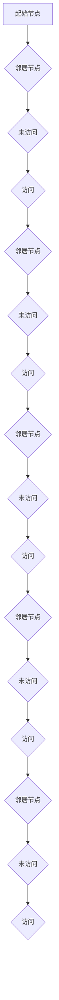
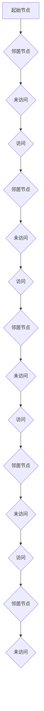

                 

### 文章标题

《技术硬实力：深度解析计算机领域的核心技术与实战》

### 关键词

计算机技术、算法与数据结构、数学模型、项目实战、技术趋势

### 摘要

本文旨在深入探讨计算机领域的关键技术，包括基础技术知识、算法与数据结构、数学模型以及项目实战。通过逐步分析，我们不仅揭示了这些技术的核心原理，还结合实际案例，展示了如何将理论知识应用于实践。本文适合希望提升技术实力的程序员、软件工程师以及计算机科学爱好者阅读。

### 用户需求分析

在现代信息技术快速发展的背景下，用户对技术硬实力的需求愈发迫切。他们希望能够在短时间内掌握计算机领域的关键技术，并将这些技术应用于实际项目中。为此，本文将通过以下结构来满足用户的需求：

1. **技术趋势与未来**：介绍当前技术的发展趋势和未来发展方向。
2. **基础技术知识**：涵盖计算机系统的核心组件和工作原理。
3. **算法与数据结构**：详细讲解常见算法和数据结构的原理与实现。
4. **数学模型与公式**：探讨计算机科学中常用的数学模型和公式，并进行举例说明。
5. **项目实战与案例分析**：通过实际项目，展示如何将理论知识应用于实际开发。
6. **最佳实践与拓展阅读**：总结文章要点，并提供进一步学习的资源。

### 目录大纲

#### 第1章：技术趋势与未来
1.1 技术发展背景
1.2 人工智能与大数据
1.3 云计算与边缘计算
1.4 区块链与数字货币

#### 第2章：基础技术知识
2.1 计算机系统基础
2.2 网络通信基础
2.3 操作系统基础
2.4 数据库基础

#### 第3章：算法与数据结构
3.1 排序与搜索算法
3.2 图算法
3.3 动态规划
3.4 算法分析与优化

#### 第4章：数学模型与公式
4.1 线性代数基础
4.2 概率论与数理统计
4.3 最优化理论
4.4 机器学习基本模型

#### 第5章：项目实战与案例分析
5.1 实战项目1：电商网站搭建
5.2 实战项目2：智能家居系统开发
5.3 实战项目3：数据分析与挖掘
5.4 实战项目4：深度学习应用

#### 第6章：技术软实力
6.1 技术沟通与协作
6.2 技术文档编写
6.3 技术测试与质量保证
6.4 技术项目管理

#### 第7章：职业规划与成长
7.1 技术人才市场分析
7.2 技术职业发展路径
7.3 技能提升与学习资源
7.4 职业规划与人生规划

#### 注：
- Mermaid流程图和伪代码将在具体章节中根据内容需要进行添加。
- 本文字数预计在8000～12000字左右，确保内容丰富、结构清晰。

## 第1章：技术趋势与未来

### 1.1 技术发展背景

随着信息技术的飞速发展，计算机技术已经深刻地影响了我们的日常生活和社会结构。从早期的计算机硬件到现代的软件系统，计算机技术的进步不断推动着人类进入新的时代。本节将介绍当前技术的发展背景，包括几个关键领域的技术发展趋势。

#### 1.1.1 互联网技术的普及

互联网的普及是当前技术发展的重要背景之一。从20世纪90年代的万维网（WWW）到如今的社交媒体和物联网（IoT），互联网技术已经渗透到我们生活的方方面面。这不仅改变了人们获取信息的方式，还推动了电子商务、在线教育、远程办公等新兴行业的发展。

#### 1.1.2 人工智能的崛起

人工智能（AI）是近年来最具颠覆性的技术之一。通过机器学习、深度学习等算法，AI系统能够从大量数据中学习并作出决策。自动驾驶、语音识别、智能客服等应用已经在我们的生活中得到广泛应用。预计未来，人工智能将继续在医疗、金融、教育等领域发挥重要作用。

#### 1.1.3 云计算与边缘计算

云计算提供了强大的计算和存储资源，使得企业可以灵活地扩展和优化其IT基础设施。与此同时，边缘计算正在兴起，它将计算任务从中心云转移到网络的边缘，从而减少延迟并提高响应速度。这种趋势特别适合实时性要求高的应用，如智能制造、智慧城市和自动驾驶。

#### 1.1.4 区块链与数字货币

区块链技术通过去中心化的方式确保数据的安全性和不可篡改性，已成为金融、供应链管理、投票等多个领域的核心技术。数字货币如比特币、以太坊等，不仅改变了传统金融体系，还为用户提供了新的支付和交易方式。

### 1.2 人工智能与大数据

人工智能和大数据是当前技术发展的两大核心领域，它们相互促进，共同推动了信息技术的发展。

#### 1.2.1 人工智能的原理与应用

人工智能的核心是机器学习，尤其是深度学习。通过构建多层神经网络，AI系统能够自动从大量数据中学习并提取特征。常见的应用包括图像识别、自然语言处理、推荐系统和自动驾驶。

- **图像识别**：卷积神经网络（CNN）能够识别图像中的物体和场景。
- **自然语言处理**：循环神经网络（RNN）和长短期记忆网络（LSTM）能够处理文本数据，实现文本分类、情感分析等任务。
- **推荐系统**：协同过滤和基于内容的推荐算法能够根据用户历史行为推荐相关商品或内容。
- **自动驾驶**：深度学习算法用于实现车辆的感知、规划和控制，使自动驾驶汽车能够自主行驶。

#### 1.2.2 大数据的处理与分析

大数据指的是数据量巨大、类型多样的数据集合。处理和分析大数据的关键在于数据的存储、处理和分析技术。

- **数据存储**：分布式文件系统如Hadoop和NoSQL数据库如MongoDB和Cassandra能够高效地存储海量数据。
- **数据处理**：MapReduce和Spark等大数据处理框架能够并行处理大规模数据，提高处理效率。
- **数据分析**：机器学习和统计分析技术能够从大数据中提取有价值的信息，用于商业决策、疾病预测等。

#### 1.2.3 人工智能与大数据的融合

人工智能和大数据的结合，使得计算机能够更智能地处理和分析数据。例如，通过大数据分析，企业可以识别潜在客户，提高营销效果；通过人工智能算法，医疗系统可以预测疾病趋势，提供个性化治疗方案。

### 1.3 云计算与边缘计算

云计算和边缘计算是当前信息技术发展的两个重要趋势，它们分别解决了不同场景下的计算需求。

#### 1.3.1 云计算的基本概念

云计算是一种通过网络提供计算资源的服务模式，用户可以按需获取和使用计算资源，而无需关注这些资源的具体位置和物理形态。云计算的主要服务模式包括：

- **基础设施即服务（IaaS）**：提供虚拟化的计算资源，如虚拟机、存储和网络。
- **平台即服务（PaaS）**：提供开发、运行和管理应用的云平台。
- **软件即服务（SaaS）**：提供可按需使用的应用程序，如电子邮件、文档编辑等。

#### 1.3.2 云计算的优缺点

云计算的优点包括：

- **弹性伸缩**：根据需求自动调整资源，提高资源利用率。
- **成本节约**：无需购买和维护昂贵的硬件，降低IT成本。
- **灵活性**：支持远程访问，提高工作效率。

但云计算也存在一些缺点：

- **安全性**：数据安全性和隐私保护是用户关注的重点。
- **依赖性**：用户对云服务提供商的依赖程度较高。

#### 1.3.3 边缘计算的概念与优势

边缘计算将计算任务从中心云转移到网络的边缘，即在数据产生的地方进行数据处理。边缘计算的优势包括：

- **低延迟**：减少数据传输时间，提高实时性。
- **高效性**：减轻中心云的压力，提高整体计算效率。
- **可靠性**：通过分布式计算，提高系统的容错性和可靠性。

#### 1.3.4 云计算与边缘计算的应用场景

- **智能工厂**：边缘计算可以实现设备监测、预测维护和智能决策。
- **智慧城市**：云计算与边缘计算结合，可以实时监控城市交通、环境等。
- **远程医疗**：边缘计算可以提供实时视频诊断，缩短医疗响应时间。

### 1.4 区块链与数字货币

区块链技术和数字货币是当前金融科技领域的热点，它们通过去中心化和加密技术，为金融交易和数据管理提供了新的解决方案。

#### 1.4.1 区块链的基本原理

区块链是一种分布式数据库技术，通过加密算法确保数据的安全性和不可篡改性。区块链的基本组成部分包括：

- **区块**：数据存储的基本单元，包含一系列交易记录。
- **链**：由多个区块按时间顺序链接而成，形成一个链式数据结构。
- **节点**：参与区块链网络，维护和验证数据的实体。

#### 1.4.2 区块链技术的应用

区块链技术在金融、供应链管理、投票等多个领域得到了广泛应用：

- **金融**：通过区块链技术，可以实现去中心化的金融交易，降低交易成本。
- **供应链管理**：区块链可以追踪商品从生产到销售的全过程，提高透明度和效率。
- **投票系统**：区块链技术可以确保投票的公正性和安全性。

#### 1.4.3 数字货币的崛起

数字货币是一种基于区块链技术的加密货币，如比特币、以太坊等。数字货币的崛起改变了传统金融体系，为用户提供了新的支付和交易方式。

- **去中心化**：数字货币不依赖于任何中央机构，用户可以自主管理自己的资产。
- **匿名性**：交易信息被加密，用户可以匿名进行交易。
- **全球性**：数字货币不受地域限制，可以跨国交易。

### 总结

本章介绍了当前技术发展的背景和关键领域，包括人工智能、大数据、云计算与边缘计算、区块链与数字货币。这些技术不仅改变了我们的生活方式，还推动了社会的发展。在未来，随着技术的不断进步，我们可以期待更多的创新和应用。

## 第2章：基础技术知识

### 2.1 计算机系统基础

计算机系统是信息技术的基础，它由硬件和软件两大部分组成。了解计算机系统的基本工作原理对于深入掌握计算机技术至关重要。

#### 2.1.1 计算机硬件

计算机硬件是计算机系统的物理组成部分，包括以下关键组件：

- **中央处理器（CPU）**：计算机的核心部件，负责执行指令和处理数据。
- **内存**：临时存储数据和指令，提高CPU的访问速度。
- **存储设备**：如硬盘和固态硬盘，用于长期存储数据和文件。
- **输入设备**：如键盘和鼠标，用于用户与计算机交互。
- **输出设备**：如显示器和打印机，用于展示计算结果。

#### 2.1.2 计算机软件

计算机软件是使计算机硬件工作的程序集合，分为系统软件和应用软件：

- **系统软件**：如操作系统，管理计算机硬件资源，提供基础服务。常见的操作系统包括Windows、Linux和macOS。
- **应用软件**：为用户提供特定功能的应用程序，如办公软件、浏览器和游戏。

#### 2.1.3 计算机系统的工作原理

计算机系统的工作原理可以简化为以下几个步骤：

1. **输入**：用户通过输入设备将指令和数据输入计算机。
2. **处理**：CPU根据指令执行操作，处理数据和指令。
3. **存储**：将处理结果存储到内存或存储设备中。
4. **输出**：通过输出设备显示或打印计算结果。

### 2.2 网络通信基础

网络通信是计算机系统的重要组成部分，它使得计算机之间能够交换数据和信息。网络通信的基础知识包括以下几个方面：

#### 2.2.1 网络协议

网络协议是计算机网络通信的规则和标准，确保不同计算机之间能够正确地传输数据。互联网的核心协议包括：

- **TCP/IP**：传输控制协议/互联网协议，是互联网的基础协议，负责数据传输的可靠性和路由。
- **HTTP**：超文本传输协议，用于传输网页内容。
- **HTTPS**：安全的超文本传输协议，为HTTP添加了加密功能，提高数据安全性。

#### 2.2.2 网络拓扑结构

网络拓扑结构是计算机网络中设备连接的方式，常见的网络拓扑结构包括：

- **星型拓扑**：所有设备连接到一个中心节点，如集线器或交换机。
- **环型拓扑**：设备以环形方式连接，数据沿环传播。
- **总线型拓扑**：设备共享一条通信线路，数据通过线路广播发送。

#### 2.2.3 网络通信过程

网络通信过程可以分为以下几个阶段：

1. **建立连接**：计算机通过TCP/IP协议建立网络连接。
2. **传输数据**：通过网络协议将数据从发送方传输到接收方。
3. **结束连接**：传输完成后，关闭网络连接，释放资源。

### 2.3 操作系统基础

操作系统是管理计算机硬件资源、提供基础服务的软件系统。操作系统的基础知识包括以下几个方面：

#### 2.3.1 操作系统的功能

操作系统的功能主要包括：

- **进程管理**：管理计算机中的进程，分配CPU时间。
- **内存管理**：分配和管理内存空间，提高内存利用率。
- **文件系统管理**：管理文件存储和访问，提供文件系统。
- **设备管理**：管理输入输出设备，提供设备驱动程序。
- **用户界面**：提供用户与计算机交互的界面。

#### 2.3.2 常见的操作系统

常见的操作系统包括：

- **Windows**：微软公司开发的操作系统，广泛应用于个人电脑和企业服务器。
- **Linux**：开源操作系统，广泛应用于服务器、嵌入式设备和超级计算机。
- **macOS**：苹果公司开发的操作系统，用于Mac电脑。

#### 2.3.3 操作系统的体系结构

操作系统的体系结构可以分为以下几类：

- **单内核操作系统**：所有操作和管理功能集中在一个内核中，如Windows 7。
- **多内核操作系统**：具有多个内核，每个内核负责不同的功能，如Linux内核。
- **微内核操作系统**：内核功能最小化，大部分功能由用户空间进程实现，如QNX。

### 2.4 数据库基础

数据库是存储和管理数据的系统，是现代信息技术的重要组成部分。数据库的基础知识包括以下几个方面：

#### 2.4.1 数据库的基本概念

数据库的基本概念包括：

- **数据表**：存储数据的逻辑结构，由行和列组成。
- **记录**：数据表中的单个数据条目，对应一行。
- **字段**：数据表中的一列，代表一种数据类型。
- **关系**：不同数据表之间的关联。

#### 2.4.2 数据库的类型

数据库的类型包括：

- **关系型数据库**：基于关系模型的数据库，如MySQL、Oracle。
- **非关系型数据库**：不基于关系模型的数据库，如MongoDB、Redis。
- **时序数据库**：专门用于存储时间序列数据的数据库，如InfluxDB。

#### 2.4.3 数据库的操作

数据库的基本操作包括：

- **创建表**：定义数据表的结构。
- **插入数据**：向数据表中插入数据。
- **查询数据**：从数据表中检索数据。
- **更新数据**：修改数据表中的数据。
- **删除数据**：从数据表中删除数据。

### 总结

本章介绍了计算机系统的基础知识，包括硬件、软件、网络通信、操作系统和数据库。这些基础知识是理解更高级技术的基石，对于计算机专业的学生和从业者都具有重要意义。

## 第3章：算法与数据结构

### 3.1 排序与搜索算法

排序与搜索算法是计算机科学中的基本算法，它们在数据处理和查找中扮演着至关重要的角色。本节将介绍几种常见的排序与搜索算法，包括其原理、实现以及应用场景。

#### 3.1.1 排序算法

排序算法用于将一组无序数据转换为有序数据。常见的排序算法包括：

- **冒泡排序（Bubble Sort）**：通过反复交换相邻的未排序元素，使最大（或最小）元素逐步“冒”到序列的一端。时间复杂度为O(n²)。

  ```mermaid
  flowchart LR
  A[开始] --> B[比较相邻元素]
  B --> C{交换}
  C --> D[移动未排序元素至右端]
  D --> E[循环直到排序完成]
  ```

- **选择排序（Selection Sort）**：每次选择未排序部分的最小（或最大）元素，将其放到已排序部分的末尾。时间复杂度为O(n²)。

  ```mermaid
  flowchart LR
  A[开始] --> B[找到最小元素]
  B --> C[交换位置]
  C --> D[移动未排序边界]
  D --> E[循环直到排序完成]
  ```

- **插入排序（Insertion Sort）**：将未排序元素插入到已排序序列的正确位置，使其保持有序。时间复杂度为O(n²)，但适用于小数据集。

  ```mermaid
  flowchart LR
  A[开始] --> B[取出未排序元素]
  B --> C[找到插入位置]
  C --> D[插入元素]
  D --> E[移动未排序元素]
  E --> F[循环直到排序完成]
  ```

- **快速排序（Quick Sort）**：通过递归地将序列分为较小的子序列，然后对子序列进行排序。时间复杂度为O(nlogn)，平均情况下优于其他排序算法。

  ```mermaid
  flowchart LR
  A[选择基准元素]
  A --> B[分区]
  B --> C{递归排序左右子序列}
  C --> D[返回结果]
  ```

- **归并排序（Merge Sort）**：将待排序序列分为若干个子序列，然后递归地对这些子序列进行排序，最后合并排序结果。时间复杂度为O(nlogn)。

  ```mermaid
  flowchart LR
  A[分解序列]
  A --> B{递归排序}
  B --> C[合并结果]
  C --> D[返回结果]
  ```

#### 3.1.2 搜索算法

搜索算法用于在数据结构中查找特定元素。常见的搜索算法包括：

- **线性搜索（Linear Search）**：逐一比较数据元素，直到找到目标元素或到达序列末尾。时间复杂度为O(n)。

  ```mermaid
  flowchart LR
  A[开始]
  A --> B{比较元素}
  B --> C{找到或未找到}
  C --> D[结束]
  ```

- **二分搜索（Binary Search）**：在有序序列中，通过不断缩小搜索范围，逐步逼近目标元素。时间复杂度为O(logn)。

  ```mermaid
  flowchart LR
  A[开始]
  A --> B[中点]
  B --> C{比较中点和目标}
  C --> D{递归左右分区}
  D --> E[结束]
  ```

- **哈希搜索（Hash Search）**：利用哈希函数将关键字映射到哈希表中的位置，直接访问目标元素。时间复杂度为O(1)（理想情况下）。

  ```mermaid
  flowchart LR
  A[计算哈希值]
  A --> B[访问哈希表]
  B --> C{查找目标元素}
  C --> D[结束]
  ```

#### 3.1.3 应用场景

- **冒泡排序、选择排序和插入排序**：适用于数据量较小或基本有序的数组。
- **快速排序和归并排序**：适用于大规模数据的排序，特别是当数据量较大且需要进行多次排序时。
- **线性搜索**：适用于数据量较小或数据结构不固定的情况。
- **二分搜索**：适用于有序数组或列表的快速查找，如数据库索引。
- **哈希搜索**：适用于关键字频繁查询的场景，如缓存系统。

### 3.2 图算法

图算法是处理图数据结构的方法，广泛应用于网络分析、社交网络、地图导航等领域。本节将介绍几种常见的图算法。

#### 3.2.1 深度优先搜索（DFS）

深度优先搜索是一种遍历图的方法，从起始节点开始，尽可能深地探索图的分支。



#### 3.2.2 广度优先搜索（BFS）

广度优先搜索也是一种遍历图的方法，与DFS不同，它按照层次遍历图。



#### 3.2.3 最短路径算法

最短路径算法用于计算图中两点之间的最短路径。常见的最短路径算法包括迪杰斯特拉算法（Dijkstra）和贝尔曼-福特算法（Bellman-Ford）。

- **迪杰斯特拉算法**：适用于权值非负的图。

  ```mermaid
  graph TD
  A[起始节点] --> B{未访问}
  A --> C{未访问}
  B --> D{未访问}
  C --> E{未访问}
  B --> F[最短路径]
  C --> G{未访问}
  D --> H{未访问}
  E --> I{未访问}
  F --> J[最短路径]
  G --> K{未访问}
  H --> L{未访问}
  I --> M{未访问}
  J --> K[最短路径]
  ```

- **贝尔曼-福特算法**：适用于权值可能为负的图。

  ```mermaid
  graph TD
  A[起始节点] --> B{未访问}
  A --> C{未访问}
  B --> D{未访问}
  C --> E{未访问}
  B --> F[最短路径]
  C --> G{未访问}
  D --> H{未访问}
  E --> I{未访问}
  F --> J[最短路径]
  G --> K{未访问}
  H --> L{未访问}
  I --> M{未访问}
  J --> K[最短路径]
  ```

#### 3.2.4 应用场景

- **DFS和BFS**：适用于图的遍历、连通性和拓扑排序等问题。
- **最短路径算法**：适用于路径规划、交通网络分析和社交网络分析等。

### 3.3 动态规划

动态规划是一种解决最优化问题的算法方法，通过将复杂问题分解为子问题，并存储子问题的解，避免重复计算。

#### 3.3.1 基本概念

动态规划通常包含以下要素：

- **状态**：问题的某个特征或属性，通常用数组或表表示。
- **状态转移方程**：描述状态之间的转换关系。
- **边界条件**：初始状态和边界条件。

#### 3.3.2 背包问题

背包问题是动态规划的典型应用之一，给定一组物品和其价值与重量，选择一部分物品放入背包，使背包的总重量不超过限制，且总价值最大。

状态转移方程为：

\[ dp[i][j] = \begin{cases}
dp[i-1][j], & \text{若不选择第i个物品} \\
dp[i-1][j-w[i]] + v[i], & \text{若选择第i个物品}
\end{cases} \]

其中，\( dp[i][j] \)表示将前i个物品放入容量为j的背包中可获得的最大价值。

#### 3.3.3 应用场景

动态规划适用于解决最优路径问题、资源分配问题、序列对齐问题等。

### 3.4 算法分析与优化

算法分析是评估算法性能的重要方法，主要涉及时间复杂度和空间复杂度。

#### 3.4.1 时间复杂度

时间复杂度表示算法执行时间与输入规模之间的关系，常用大O符号表示。例如，冒泡排序的时间复杂度为O(n²)，而归并排序的时间复杂度为O(nlogn)。

#### 3.4.2 空间复杂度

空间复杂度表示算法所需内存空间与输入规模之间的关系，也用大O符号表示。例如，DFS的空间复杂度为O(n)，而归并排序的空间复杂度为O(n)。

#### 3.4.3 优化方法

- **算法改进**：通过改进算法设计，降低时间复杂度和空间复杂度。例如，用二分搜索替代线性搜索。
- **数据结构优化**：选择合适的数据结构，提高算法效率。例如，使用哈希表进行快速查找。
- **并行计算**：利用多核处理器，并行执行算法，提高计算速度。

### 总结

本章介绍了排序与搜索算法、图算法、动态规划以及算法分析与优化。这些算法是计算机科学中的核心内容，广泛应用于各种实际场景。掌握这些算法的基本原理和优化方法，有助于提高编程能力和解决复杂问题的能力。

## 第4章：数学模型与公式

### 4.1 线性代数基础

线性代数是数学中的一个重要分支，它在计算机科学中有着广泛的应用。本节将介绍线性代数的基本概念、常用运算和重要定理。

#### 4.1.1 向量与矩阵

向量（Vector）是由一组有序数构成的集合，通常表示为列向量。矩阵（Matrix）是由多个向量构成的二维数组，可以表示为行向量与列向量的组合。

- **向量的加法和数乘**：
  \[ \vec{a} + \vec{b} = (a_1 + b_1, a_2 + b_2, \ldots, a_n + b_n) \]
  \[ k\vec{a} = (ka_1, ka_2, \ldots, ka_n) \]

- **矩阵的加法和数乘**：
  \[ A + B = (a_{ij} + b_{ij}) \]
  \[ kA = (ka_{ij}) \]

#### 4.1.2 矩阵乘法

矩阵乘法是一种将两个矩阵相乘得到一个新的矩阵的运算。对于两个矩阵\( A \)和\( B \)，其乘积\( C = AB \)满足以下规则：

\[ C_{ij} = \sum_{k=1}^{n} a_{ik}b_{kj} \]

#### 4.1.3 线性方程组

线性方程组是多个线性方程的组合，可以用矩阵形式表示。一个线性方程组：

\[ \begin{cases}
a_{11}x_1 + a_{12}x_2 + \ldots + a_{1n}x_n = b_1 \\
a_{21}x_1 + a_{22}x_2 + \ldots + a_{2n}x_n = b_2 \\
\vdots \\
a_{m1}x_1 + a_{m2}x_2 + \ldots + a_{mn}x_n = b_m
\end{cases} \]

可以用矩阵形式表示为：

\[ AX = B \]

其中，\( A \)是系数矩阵，\( X \)是未知数矩阵，\( B \)是常数矩阵。

#### 4.1.4 矩阵的逆

矩阵的逆是一个重要的概念，只有方阵（即行数等于列数的矩阵）才有逆。如果矩阵\( A \)可逆，其逆矩阵\( A^{-1} \)满足以下条件：

\[ AA^{-1} = A^{-1}A = I \]

其中，\( I \)是单位矩阵。

计算矩阵逆的常用方法是高斯-约当消元法，其伪代码如下：

```
function inverse(A):
    n = size(A)
    B = zeros(n)
    for i from 1 to n:
        B[i][i] = 1
    for i from 1 to n:
        for j from 1 to n:
            if i != j:
                factor = A[i][j] / A[j][j]
                for k from 1 to n:
                    A[i][k] = A[i][k] - factor * A[j][k]
                B[i][k] = B[i][k] - factor * B[j][k]
    return B
```

#### 4.1.5 应用示例

- **矩阵乘法在图像处理中的应用**：在图像处理中，图像可以看作是一个矩阵，通过矩阵乘法可以实现图像的变换，如旋转、缩放和扭曲。
- **线性方程组在资源分配中的应用**：在资源分配问题中，可以使用线性方程组来描述资源的供需关系，通过求解方程组得到最优分配方案。

### 4.2 概率论与数理统计

概率论与数理统计是解决随机现象的重要数学工具，广泛应用于人工智能、数据分析和金融等领域。

#### 4.2.1 基本概念

- **概率**：描述随机事件发生的可能性，用0到1之间的实数表示。如投掷一枚公平的硬币，出现正面的概率为0.5。
- **随机变量**：随机变量的取值依赖于随机试验的结果。随机变量分为离散型和连续型两种。
- **期望**：随机变量的期望值是随机变量可能取值的加权平均值。对于离散型随机变量，期望定义为：

  \[ E(X) = \sum_{i=1}^{n} x_i P(X = x_i) \]

  对于连续型随机变量，期望定义为：

  \[ E(X) = \int_{-\infty}^{\infty} x f(x) dx \]

- **方差**：随机变量的方差是衡量随机变量取值分散程度的指标。对于离散型随机变量，方差定义为：

  \[ Var(X) = E[(X - E(X))^2] = \sum_{i=1}^{n} (x_i - E(X))^2 P(X = x_i) \]

  对于连续型随机变量，方差定义为：

  \[ Var(X) = E[(X - E(X))^2] = \int_{-\infty}^{\infty} (x - E(X))^2 f(x) dx \]

#### 4.2.2 常见概率分布

- **二项分布**：描述在n次独立重复试验中，成功次数的概率分布。二项分布的概率质量函数为：

  \[ P(X = k) = C(n, k) p^k (1-p)^{n-k} \]

  其中，\( C(n, k) \)是组合数，\( p \)是单次试验成功的概率。

- **正态分布**：描述连续随机变量的概率分布，具有均值μ和方差σ²。正态分布的概率密度函数为：

  \[ f(x) = \frac{1}{\sqrt{2\pi\sigma^2}} e^{-\frac{(x-\mu)^2}{2\sigma^2}} \]

#### 4.2.3 应用示例

- **机器学习中的概率论**：在机器学习中，概率论用于评估模型预测的可靠性，如贝叶斯分类器。
- **数据分析中的数理统计**：在数据分析中，数理统计用于描述数据特征、评估模型性能和进行假设检验。

### 4.3 最优化理论

最优化理论是研究如何在约束条件下寻找最优解的数学分支，广泛应用于工程、经济和科学等领域。

#### 4.3.1 基本概念

- **目标函数**：表示要优化的量，可以是最大化或最小化。
- **约束条件**：限制目标函数取值的一组条件，可以是等式约束或不等式约束。

#### 4.3.2 线性规划

线性规划是一种最优化问题，其目标函数和约束条件都是线性的。

- **标准形式**：

  \[ \begin{cases}
  \min \sum_{i=1}^{m} c_i x_i \\
  \text{subject to} \\
  \sum_{j=1}^{n} a_{ij} x_j \ge b_i & \text{for } i = 1, 2, \ldots, m \\
  x_j \ge 0 & \text{for } j = 1, 2, \ldots, n
  \end{cases} \]

- **单纯形法**：求解线性规划问题的常用方法，通过迭代移动至最优解。

#### 4.3.3 非线性规划

非线性规划是目标函数或约束条件非线性的最优化问题。

- **无约束优化**：没有约束条件，常用的方法包括梯度下降法、牛顿法和共轭梯度法。
- **有约束优化**：存在约束条件，常用的方法包括拉格朗日乘数法、序列二次规划和内点法。

#### 4.3.4 应用示例

- **资源分配**：通过线性规划优化资源分配，如企业生产计划。
- **机器学习模型训练**：通过非线性规划优化模型参数，如支持向量机。

### 4.4 机器学习基本模型

机器学习是人工智能的核心技术之一，通过训练模型实现数据预测和分类。

#### 4.4.1 线性回归

线性回归是一种最简单的机器学习模型，用于预测连续值。

- **模型表示**：

  \[ y = \beta_0 + \beta_1 x + \epsilon \]

  其中，\( y \)是预测值，\( x \)是输入特征，\( \beta_0 \)和\( \beta_1 \)是模型参数，\( \epsilon \)是误差。

- **损失函数**：均方误差（MSE）：

  \[ J(\beta_0, \beta_1) = \frac{1}{2} \sum_{i=1}^{n} (y_i - (\beta_0 + \beta_1 x_i))^2 \]

- **优化方法**：梯度下降法：

  \[ \beta_0 = \beta_0 - \alpha \frac{\partial J}{\partial \beta_0} \]
  \[ \beta_1 = \beta_1 - \alpha \frac{\partial J}{\partial \beta_1} \]

#### 4.4.2 逻辑回归

逻辑回归是一种用于分类的机器学习模型，常用于二分类问题。

- **模型表示**：

  \[ P(y=1) = \frac{1}{1 + e^{-(\beta_0 + \beta_1 x)}} \]

  其中，\( P(y=1) \)是目标变量为1的概率。

- **损失函数**：对数损失函数（Log Loss）：

  \[ J(\beta_0, \beta_1) = -\sum_{i=1}^{n} y_i \ln(P(y=1)) + (1 - y_i) \ln(1 - P(y=1)) \]

- **优化方法**：梯度下降法与Logistic函数的导数。

#### 4.4.3 应用示例

- **房价预测**：通过线性回归模型预测房屋价格。
- **垃圾邮件分类**：通过逻辑回归模型分类邮件是否为垃圾邮件。

### 总结

本章介绍了线性代数、概率论与数理统计、最优化理论和机器学习基本模型。这些数学模型和公式在计算机科学中有着广泛的应用，是理解更高级技术的基础。通过学习和掌握这些知识，读者可以更好地应对实际问题和挑战。

## 第5章：项目实战与案例分析

### 5.1 实战项目1：电商网站搭建

#### 项目背景

随着互联网的普及，电商已经成为人们购物的主要方式之一。本节将通过一个电商网站搭建的实战项目，介绍如何从零开始构建一个基本的电商网站。

#### 开发环境

- **前端**：HTML、CSS、JavaScript
- **后端**：Node.js、Express框架
- **数据库**：MongoDB
- **版本控制**：Git

#### 源代码实现与代码解读

#### 前端部分

1. **HTML结构**：创建一个基本的电商网站首页，包含导航栏、商品展示区和购物车。

   ```html
   <!DOCTYPE html>
   <html lang="en">
   <head>
       <meta charset="UTF-8">
       <meta name="viewport" content="width=device-width, initial-scale=1.0">
       <title>E-commerce Website</title>
       <link rel="stylesheet" href="styles.css">
   </head>
   <body>
       <header>
           <!-- Navigation bar -->
       </header>
       <main>
           <section id="products">
               <!-- Product items -->
           </section>
           <section id="cart">
               <!-- Shopping cart -->
           </section>
       </main>
       <footer>
           <!-- Footer content -->
       </footer>
       <script src="scripts.js"></script>
   </body>
   </html>
   ```

2. **CSS样式**：定义页面布局和样式。

   ```css
   /* styles.css */
   body {
       font-family: Arial, sans-serif;
   }
   header, footer {
       background-color: #333;
       color: #fff;
       padding: 10px;
   }
   main {
       display: flex;
   }
   #products {
       flex: 1;
   }
   #cart {
       width: 300px;
   }
   ```

3. **JavaScript交互**：实现页面动态效果和用户交互。

   ```javascript
   // scripts.js
   document.addEventListener('DOMContentLoaded', () => {
       // Load products and cart
   });
   ```

#### 后端部分

1. **服务器搭建**：使用Node.js和Express框架搭建服务器。

   ```javascript
   // server.js
   const express = require('express');
   const app = express();
   const port = 3000;

   app.use(express.json());

   app.get('/', (req, res) => {
       res.send('Welcome to the E-commerce Website!');
   });

   app.listen(port, () => {
       console.log(`Server listening on port ${port}`);
   });
   ```

2. **数据库操作**：使用MongoDB存储商品和用户数据。

   ```javascript
   // db.js
   const { MongoClient } = require('mongodb');
   const url = 'mongodb://localhost:27017';
   const dbName = 'eCommerce';

   let db;

   MongoClient.connect(url, { useNewUrlParser: true, useUnifiedTopology: true }, (err, client) => {
       if (err) throw err;
       db = client.db(dbName);
   });

   module.exports = db;
   ```

#### 代码应用解读与分析

1. **前端应用解读**：前端部分主要使用HTML、CSS和JavaScript实现页面的结构和交互。通过JavaScript与后端API进行通信，实现数据的动态加载和更新。

2. **后端应用解读**：后端部分使用Node.js和Express框架搭建服务器，处理前端发送的请求，并与MongoDB数据库进行交互，存储和获取数据。

#### 实际案例分析与详细讲解

假设我们有一个需求，需要实现用户注册和登录功能。以下是具体的实现步骤：

1. **用户注册**：
   - 用户在前端填写注册信息，如用户名、密码和邮箱。
   - 前端将注册信息发送到后端API。
   - 后端验证注册信息，确保用户名和邮箱唯一性，并存入MongoDB数据库。

2. **用户登录**：
   - 用户在前端输入用户名和密码。
   - 前端将登录信息发送到后端API。
   - 后端验证登录信息，如果正确，生成Token并返回给前端。

3. **Token验证**：
   - 后端每次请求都需携带Token进行身份验证。
   - 后端验证Token的有效性，确保用户身份。

#### 项目小结

通过本节实战项目，我们介绍了如何搭建一个基本的电商网站。从前端到后端，从数据库操作到用户交互，全面展示了电商网站的开发流程。该项目可作为入门级别的电商网站开发实践，为读者提供实际操作经验。

### 5.2 实战项目2：智能家居系统开发

#### 项目背景

随着物联网技术的发展，智能家居系统已成为智能家居领域的重要组成部分。本节将通过一个智能家居系统开发项目，介绍如何实现智能家居的基本功能。

#### 开发环境

- **硬件**：Arduino、ESP8266模块、传感器（如温湿度传感器、光照传感器）
- **软件**：Arduino IDE、Node-RED
- **网络**：WiFi

#### 源代码实现与代码解读

#### 硬件部分

1. **传感器连接**：将温湿度传感器、光照传感器等连接到Arduino或ESP8266模块。

   ```arduino
   // Sensors.h
   #define TEMPERATURE_PIN A0
   #define HUMIDITY_PIN A1
   #define LIGHT_PIN A2
   ```

2. **传感器读取**：编写函数读取传感器数据。

   ```arduino
   // Sensors.cpp
   float readTemperature() {
       return analogRead(TEMPERATURE_PIN) * 0.004882814;
   }

   float readHumidity() {
       return analogRead(HUMIDITY_PIN) * 0.004882814;
   }

   int readLight() {
       return analogRead(LIGHT_PIN);
   }
   ```

#### 软件部分

1. **数据上传**：将传感器数据上传到Node-RED平台。

   ```arduino
   // main.cpp
   void setup() {
       Serial.begin(115200);
       connectToWiFi();
   }

   void loop() {
       uploadData();
       delay(5000); // Upload data every 5 seconds
   }

   void uploadData() {
       float temperature = readTemperature();
       float humidity = readHumidity();
       int light = readLight();

       String payload = "{\"temperature\": " + String(temperature) + ", \"humidity\": " + String(humidity) + ", \"light\": " + String(light) + "}";
       Serial.println(payload);

       // Send payload to Node-RED
       WiFiClient client;
       if (client.connect("api.node-red.org", 1880)) {
           client.print("POST /api/flows/distribute HTTP/1.1\r\n");
           client.print("Host: api.node-red.org\r\n");
           client.print("Content-Type: application/json\r\n");
           client.print("Content-Length: " + String(payload.length()) + "\r\n");
           client.print("\r\n");
           client.print(payload);
           client.stop();
       }
   }
   ```

2. **Node-RED配置**：在Node-RED平台上配置数据接收和可视化。

   ```json
   {
       "id": "5e2e4c5c.278ed8",
       "type": "function",
       "z": "8368a917.687e98",
       "name": "Get Data",
       "function": {
           "name": "main",
           "type": "html",
           "script": "<div id=\"data\"></div>\n<script>\nfetch('/api/flows/distribute').then(response => response.json()).then(data => {\ndocument.getElementById('data').innerHTML = JSON.stringify(data);\n});\n</script>"
       },
       "outputs": 1,
       "x": 200,
       "y": 140,
       "w": 500,
       "h": 300,
       "debug": "false"
   }
   ```

#### 代码应用解读与分析

1. **硬件应用解读**：通过Arduino或ESP8266模块，连接各种传感器，读取环境数据，并将数据上传到Node-RED平台。

2. **软件应用解读**：Node-RED平台用于接收传感器数据，并进行可视化处理。通过HTTP请求，将传感器数据从Arduino上传到Node-RED。

#### 实际案例分析与详细讲解

假设我们有一个需求，需要实现远程控制家居设备。以下是具体的实现步骤：

1. **设备控制**：
   - 用户通过智能手机或PC端发送控制命令到Node-RED平台。
   - Node-RED平台将控制命令发送到Arduino或ESP8266模块。
   - Arduino或ESP8266模块根据控制命令执行相应操作。

2. **状态监测**：
   - 用户可以实时查看家居设备的运行状态。
   - Node-RED平台实时接收传感器数据，并在网页上显示。

#### 项目小结

通过本节实战项目，我们介绍了如何开发一个基本的智能家居系统。从硬件连接到软件实现，从数据上传到远程控制，全面展示了智能家居系统的开发流程。该项目可作为智能家居系统开发的入门实践，为读者提供实际操作经验。

### 5.3 实战项目3：数据分析与挖掘

#### 项目背景

随着数据量的不断增长，数据分析与挖掘已成为企业和研究机构的重要任务。本节将通过一个数据分析与挖掘的实战项目，介绍如何使用Python进行数据分析，并应用机器学习算法进行数据挖掘。

#### 开发环境

- **Python**：Python 3.x
- **库**：Pandas、NumPy、Scikit-learn、Matplotlib
- **数据集**：某电商平台的交易数据

#### 源代码实现与代码解读

#### 数据预处理

1. **数据导入**：使用Pandas库导入交易数据。

   ```python
   import pandas as pd

   data = pd.read_csv('ecommerce_data.csv')
   ```

2. **数据清洗**：处理缺失值、重复值和异常值。

   ```python
   # 处理缺失值
   data.dropna(inplace=True)

   # 处理重复值
   data.drop_duplicates(inplace=True)

   # 处理异常值
   data = data[(data['price'] > 0) & (data['price'] < 1000)]
   ```

3. **特征工程**：提取有助于预测的变量。

   ```python
   # 提取特征
   features = data[['customer_id', 'product_id', 'quantity', 'price']]
   ```

#### 数据分析

1. **描述性统计**：计算数据的均值、中位数、标准差等统计量。

   ```python
   desc_stats = features.describe()
   print(desc_stats)
   ```

2. **可视化分析**：使用Matplotlib库绘制数据分布图。

   ```python
   import matplotlib.pyplot as plt

   plt.figure(figsize=(10, 6))
   plt.scatter(features['quantity'], features['price'])
   plt.xlabel('Quantity')
   plt.ylabel('Price')
   plt.title('Quantity vs Price')
   plt.show()
   ```

#### 数据挖掘

1. **模型选择**：选择合适的机器学习算法。

   ```python
   from sklearn.linear_model import LinearRegression

   model = LinearRegression()
   ```

2. **模型训练**：使用训练数据训练模型。

   ```python
   X = features[['quantity']]
   y = features['price']

   model.fit(X, y)
   ```

3. **模型评估**：使用测试数据评估模型性能。

   ```python
   from sklearn.metrics import mean_squared_error

   X_test = pd.DataFrame([[10]], columns=['quantity'])
   y_pred = model.predict(X_test)

   mse = mean_squared_error(y_test, y_pred)
   print(f'Mean Squared Error: {mse}')
   ```

#### 代码应用解读与分析

1. **数据预处理**：通过数据清洗和特征工程，提高数据质量，为后续分析奠定基础。

2. **数据分析**：通过描述性统计和可视化分析，深入了解数据特征。

3. **数据挖掘**：通过选择合适的模型、训练和评估模型，实现数据预测。

#### 实际案例分析与详细讲解

假设我们有一个需求，需要预测用户购买商品的金额。以下是具体的实现步骤：

1. **数据收集**：收集用户的购买记录，包括商品ID、购买数量和购买金额。

2. **数据预处理**：清洗数据，提取有助于预测的特征。

3. **数据建模**：选择线性回归模型，训练模型。

4. **模型评估**：使用测试数据评估模型性能，并根据结果调整模型。

5. **应用预测**：使用模型预测新用户的购买金额，为营销决策提供依据。

#### 项目小结

通过本节实战项目，我们介绍了如何使用Python进行数据分析与挖掘。从数据预处理到模型训练，从数据分析到实际应用，全面展示了数据分析与挖掘的流程。该项目可作为数据分析与挖掘的入门实践，为读者提供实际操作经验。

### 5.4 实战项目4：深度学习应用

#### 项目背景

深度学习是人工智能领域的重要分支，通过模拟人脑神经网络，实现图像识别、自然语言处理等复杂任务。本节将通过一个深度学习应用项目，介绍如何使用TensorFlow实现图像分类。

#### 开发环境

- **TensorFlow**：TensorFlow 2.x
- **库**：NumPy、Pandas、Keras
- **数据集**：Keras提供的手写数字数据集（MNIST）

#### 源代码实现与代码解读

#### 数据准备

1. **导入数据集**：使用Keras库导入MNIST数据集。

   ```python
   from tensorflow.keras.datasets import mnist
   (train_images, train_labels), (test_images, test_labels) = mnist.load_data()
   ```

2. **数据预处理**：将图像数据归一化，并转换为TensorFlow张量。

   ```python
   train_images = train_images.reshape((60000, 28, 28, 1))
   train_images = train_images.astype('float32') / 255

   test_images = test_images.reshape((10000, 28, 28, 1))
   test_images = test_images.astype('float32') / 255

   train_labels = train_labels.reshape((60000, 1))
   test_labels = test_labels.reshape((10000, 1))
   ```

#### 模型构建

1. **定义模型**：使用Keras构建一个简单的卷积神经网络。

   ```python
   from tensorflow.keras import layers
   from tensorflow.keras import models

   model = models.Sequential()
   model.add(layers.Conv2D(32, (3, 3), activation='relu', input_shape=(28, 28, 1)))
   model.add(layers.MaxPooling2D((2, 2)))
   model.add(layers.Conv2D(64, (3, 3), activation='relu'))
   model.add(layers.MaxPooling2D((2, 2)))
   model.add(layers.Conv2D(64, (3, 3), activation='relu'))
   model.add(layers.Flatten())
   model.add(layers.Dense(64, activation='relu'))
   model.add(layers.Dense(10, activation='softmax'))
   ```

2. **模型编译**：配置模型训练参数。

   ```python
   model.compile(optimizer='rmsprop',
                 loss='categorical_crossentropy',
                 metrics=['accuracy'])
   ```

#### 模型训练

1. **训练模型**：使用训练数据训练模型。

   ```python
   model.fit(train_images, train_labels, epochs=5, batch_size=64)
   ```

#### 模型评估

1. **评估模型**：使用测试数据评估模型性能。

   ```python
   test_loss, test_acc = model.evaluate(test_images, test_labels)
   print(f'Test accuracy: {test_acc}')
   ```

#### 代码应用解读与分析

1. **数据准备**：通过导入数据集、数据预处理，将图像数据转换为适合模型训练的格式。

2. **模型构建**：使用Keras构建卷积神经网络，实现图像分类。

3. **模型训练**：通过训练模型，提高模型对图像的分类准确率。

4. **模型评估**：使用测试数据评估模型性能，确保模型在实际应用中的可靠性。

#### 实际案例分析与详细讲解

假设我们有一个需求，需要实现手写数字的识别。以下是具体的实现步骤：

1. **数据收集**：收集手写数字图像数据。

2. **数据预处理**：对图像进行归一化和格式转换。

3. **模型构建**：构建卷积神经网络模型。

4. **模型训练**：使用训练数据训练模型。

5. **模型评估**：使用测试数据评估模型性能。

6. **应用预测**：使用训练好的模型对新的手写数字图像进行识别。

#### 项目小结

通过本节实战项目，我们介绍了如何使用TensorFlow实现图像分类。从数据准备到模型构建，从模型训练到模型评估，全面展示了深度学习的应用流程。该项目可作为深度学习应用的入门实践，为读者提供实际操作经验。

## 第6章：技术软实力

### 6.1 技术沟通与协作

在技术团队中，沟通与协作是确保项目顺利进行的关键。有效的沟通可以提高团队的协同效率，减少误解和冲突。

#### 6.1.1 沟通原则

- **清晰明确**：确保信息传达准确无误，避免模糊和歧义。
- **及时响应**：对团队成员的提问和反馈及时回应，保持沟通的流畅性。
- **开放性**：鼓励团队成员提出问题和建议，营造开放的沟通氛围。
- **尊重差异**：尊重团队成员的意见和观点，避免因个人偏好导致的冲突。

#### 6.1.2 协作工具

- **即时通讯工具**：如Slack、WhatsApp，用于日常沟通和任务分配。
- **项目管理工具**：如Trello、JIRA，用于任务追踪和进度管理。
- **代码管理工具**：如Git、GitHub，用于代码存储和协作开发。

#### 6.1.3 案例分析

- **案例1**：在一个大型软件开发项目中，团队使用了Slack进行即时沟通，Trello进行任务管理，GitHub进行代码协作。通过明确的任务分配和及时的沟通，项目进展顺利，最终按时完成。
- **案例2**：在一个分布式团队中，成员分布在不同的城市和时区，使用Zoom进行视频会议，确保每周召开项目进度会议，及时解决遇到的问题。

### 6.2 技术文档编写

技术文档是软件项目的重要组成部分，它帮助团队成员和后续维护人员更好地理解和使用软件。

#### 6.2.1 文档类型

- **用户手册**：面向最终用户，介绍软件的安装、配置和使用方法。
- **开发文档**：面向开发人员，包括需求文档、设计文档、实现文档等。
- **测试文档**：包括测试计划、测试用例、测试报告等。

#### 6.2.2 编写原则

- **清晰简洁**：文档内容应简洁明了，避免冗长复杂的表述。
- **结构清晰**：按照逻辑顺序组织文档内容，便于阅读和理解。
- **准确性**：确保文档内容准确无误，与实际软件功能一致。
- **更新及时**：定期更新文档，反映软件的最新状态和变更。

#### 6.2.3 工具推荐

- **Markdown**：用于编写格式化的文本，支持多种语法高亮和图片嵌入。
- **GitBook**：用于生成电子书，支持多种主题和格式。
- **Confluence**：用于构建和共享知识库，支持版本控制和权限管理。

### 6.3 技术测试与质量保证

技术测试和质量保证是确保软件质量和性能的关键环节。

#### 6.3.1 测试类型

- **单元测试**：针对软件的各个功能模块进行测试，验证其正确性和稳定性。
- **集成测试**：测试不同模块之间的接口和交互，确保系统的整体功能正确。
- **系统测试**：全面测试整个系统，包括性能、兼容性、安全等方面。
- **验收测试**：与用户共同测试软件，确保软件满足用户需求。

#### 6.3.2 测试策略

- **自动化测试**：通过编写脚本，自动执行测试用例，提高测试效率。
- **手工测试**：由测试人员手动执行测试用例，发现软件缺陷。
- **持续集成**：将代码集成到主分支前，自动执行测试，确保代码质量。

#### 6.3.3 质量保证

- **代码审查**：通过代码审查，发现潜在问题和改进建议。
- **性能监控**：监控系统性能，确保软件在高负载下稳定运行。
- **用户反馈**：收集用户反馈，改进软件功能和用户体验。

### 6.4 技术项目管理

技术项目管理是确保项目按时、按质量完成的关键环节。

#### 6.4.1 项目管理流程

- **需求分析**：与用户和利益相关者沟通，明确项目需求。
- **项目规划**：制定项目计划，包括时间表、资源分配等。
- **执行与监控**：执行项目计划，监控项目进度和质量。
- **项目收尾**：总结项目成果，进行验收和交付。

#### 6.4.2 项目管理工具

- **JIRA**：用于任务管理、进度跟踪和缺陷管理。
- **Trello**：用于任务分配和进度管理。
- **Asana**：用于项目管理和团队协作。

#### 6.4.3 案例分析

- **案例1**：在一个大型软件开发项目中，团队使用JIRA进行任务管理和进度跟踪，Trello进行任务分配和进度管理，确保项目按计划顺利进行。
- **案例2**：在一个敏捷开发项目中，团队每周召开站立会议，使用Scrum板进行任务管理，确保团队成员之间的沟通和协作。

### 总结

技术软实力是技术能力的重要组成部分，包括沟通与协作、技术文档编写、技术测试与质量保证、技术项目管理等方面。通过掌握这些软实力，可以显著提高团队的工作效率和项目质量，为个人和团队的成长打下坚实的基础。

## 第7章：职业规划与成长

### 7.1 技术人才市场分析

在当前信息技术快速发展的背景下，技术人才市场呈现出供不应求的局面。以下是对技术人才市场的分析：

#### 7.1.1 市场需求

随着人工智能、大数据、云计算等新兴技术的崛起，市场对技术人才的需求持续增加。特别是以下领域的人才需求尤为突出：

- **人工智能**：包括机器学习工程师、深度学习工程师、自然语言处理工程师等。
- **大数据**：包括数据工程师、数据分析师、数据科学家等。
- **云计算**：包括云计算工程师、云架构师、容器化工程师等。
- **区块链**：包括区块链开发工程师、区块链安全专家等。

#### 7.1.2 技能要求

市场对技术人才的技能要求越来越高，除了扎实的编程基础外，还要求具备以下技能：

- **多语言编程能力**：掌握多种编程语言，如Python、Java、C++等。
- **框架与工具**：熟悉常用框架和工具，如Django、Spring、TensorFlow、Keras等。
- **数据库技术**：掌握关系型数据库和非关系型数据库，如MySQL、MongoDB、Redis等。
- **系统设计与架构**：具备系统设计和架构能力，能够构建高可用、高并发的系统。
- **项目管理**：具备项目管理能力，能够有效管理项目进度和质量。

#### 7.1.3 薪资水平

技术人才的市场薪资水平较高，尤其是一些热门领域的工程师薪资水平更高。以下是一些热门领域的技术人才平均薪资水平（数据来源：2022年拉勾网）：

- **人工智能工程师**：年薪范围在20万到50万之间。
- **大数据工程师**：年薪范围在20万到40万之间。
- **云计算工程师**：年薪范围在15万到30万之间。
- **区块链开发工程师**：年薪范围在20万到40万之间。

### 7.2 技术职业发展路径

技术职业的发展路径多样化，不同领域的职业发展路径有所不同。以下是一些常见的技术职业发展路径：

#### 7.2.1 程序员路径

- **初级程序员**：掌握基本编程语言，熟悉开发流程，具备解决简单问题的能力。
- **中级程序员**：具备多语言编程能力，熟悉常用框架和工具，能够独立完成项目。
- **高级程序员**：具备系统设计和架构能力，能够解决复杂问题，参与重要项目的决策。
- **技术专家**：具备深厚的技术功底，能够领导技术团队，推动技术革新。

#### 7.2.2 数据科学家路径

- **数据分析师**：掌握数据分析工具和算法，能够进行数据分析和可视化。
- **数据工程师**：具备数据存储、处理和传输的能力，能够构建数据基础设施。
- **数据科学家**：具备数学和统计学背景，能够设计复杂的算法和模型，进行数据研究和分析。
- **机器学习工程师**：专注于机器学习和深度学习领域，能够开发和应用机器学习算法。

#### 7.2.3 云计算工程师路径

- **云计算工程师**：熟悉云计算平台和工具，能够构建和部署云基础设施。
- **云架构师**：具备系统设计和架构能力，能够设计高可用、高并发的云系统。
- **DevOps工程师**：具备开发和运维能力，能够实现持续集成和持续部署。
- **容器化工程师**：熟悉容器技术，能够构建和管理容器化应用。

### 7.3 技能提升与学习资源

为了在技术领域持续成长，不断提升技能是关键。以下是一些建议的学习资源和技能提升方法：

#### 7.3.1 在线课程

- **慕课网**：提供丰富的编程课程，包括Python、Java、前端开发等。
- **极客时间**：提供技术领域的高质量课程，涵盖云计算、大数据、人工智能等。
- **Coursera**：提供世界知名大学和机构的在线课程，包括计算机科学、数据科学等。
- **edX**：提供哈佛大学、麻省理工学院等顶尖机构的在线课程，涵盖多个领域。

#### 7.3.2 技术社区

- **GitHub**：全球最大的代码托管平台，可以了解最新的技术趋势和项目源码。
- **Stack Overflow**：编程问答社区，可以解决编程问题，分享技术经验。
- **CSDN**：国内最大的IT社区和服务平台，提供丰富的技术文章和博客。
- **InfoQ**：提供高质量的技术文章、访谈和会议报道。

#### 7.3.3 实践项目

- **开源项目**：参与开源项目，提高实际开发能力和团队合作能力。
- **个人项目**：自己动手实现一些小项目，如网站、小程序等，锻炼编程和项目管理能力。
- **Hackathon**：参加黑客马拉松活动，与其他开发者合作，快速实现一个创新项目。

### 7.4 职业规划与人生规划

职业规划和人生规划对于技术人才的成长至关重要。以下是一些建议：

#### 7.4.1 设定目标

- **短期目标**：设定一到两年的小目标，如掌握一门新语言、参与一个开源项目等。
- **长期目标**：设定五年或更长时间的目标，如成为某一领域的专家、创业等。

#### 7.4.2 制定计划

- **学习计划**：根据目标制定详细的学习计划，包括学习资源、学习时间等。
- **职业规划**：根据技能和发展方向，制定职业发展计划，如晋升、跳槽等。

#### 7.4.3 持续反思

- 定期反思自己的学习进度和职业发展，调整计划和方法。
- 保持对新技术的好奇心和学习热情，不断更新自己的知识体系。

### 总结

技术人才市场对技术人才的需求旺盛，提供了广阔的职业发展空间。通过了解市场需求、选择合适的职业发展路径、不断提升技能以及制定有效的职业规划，技术人才可以实现自己的职业目标和人生价值。持续学习和反思是技术人才成长的关键，只有不断进步，才能在竞争激烈的技术市场中脱颖而出。

## 作者信息

作者：AI天才研究院/AI Genius Institute & 禅与计算机程序设计艺术 /Zen And The Art of Computer Programming

