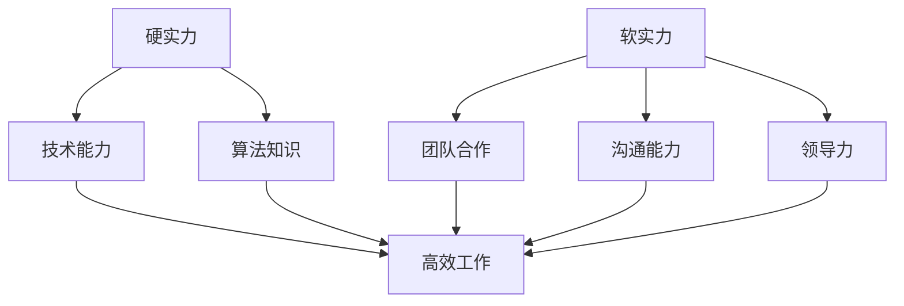
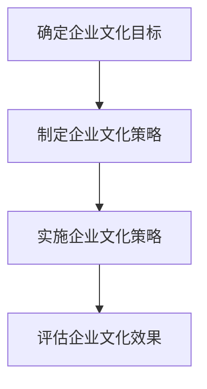
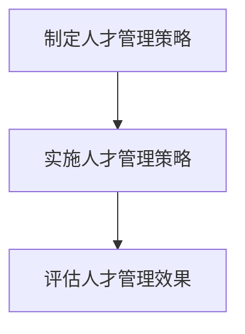
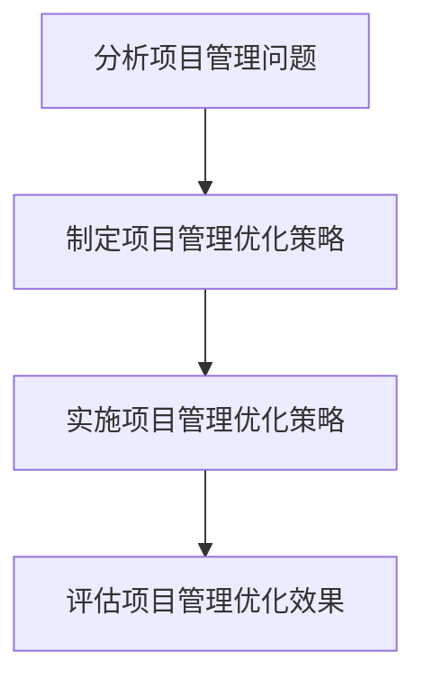

                 


### Step 1: 设计第一部分——核心概念与联系

**1.1 硬实力与软实力的定义**

在IT领域，硬实力通常指的是技术能力、编程技能、算法知识等可以直接量化的能力。这些能力是软件开发和系统维护的基石，直接决定了工程师是否能高效地完成工作。而软实力则是指团队合作、沟通能力、领导力和项目管理等非技术层面的能力。软实力在团队协作、项目推进和公司文化构建中发挥着至关重要的作用。

**1.2 硬实力与软实力的比较**

硬实力往往可以通过考试、证书和技术评审来衡量，比如编程能力、算法实现能力和系统架构能力。而软实力则更难以量化，但其在团队协作中的影响力却不容忽视。硬实力决定了工程师的个体能力，而软实力则决定了团队的整体表现。

**1.3 硬实力与软实力的联系与区别**

硬实力和软实力并非相互独立的，它们之间存在紧密的联系。一个优秀的工程师不仅需要具备强大的硬实力，还需要具备良好的软实力。软实力可以帮助工程师更好地与团队成员沟通协作，解决复杂问题，提升团队的整体效率和项目成功率。

**1.4 硬实力与软实力的平衡**

在IT行业中，硬实力和软实力的平衡是关键。一个企业或团队如果只注重硬实力的培养，可能会导致团队在技术方面非常强大，但在协作和项目管理方面却显得力不从心。相反，如果只注重软实力的培养，可能会导致团队在技术方面落后。因此，找到硬实力与软实力的平衡点，对于提升团队整体竞争力至关重要。

**Mermaid 流程图**

下面是一个简单的Mermaid流程图，展示了硬实力与软实力的关系：



### Step 2: 设计第二部分——核心算法原理讲解

**2.1 企业文化建设**

企业文化建设是提升软实力的重要手段。一个良好的企业文化可以增强团队成员的归属感，提升团队凝聚力和工作效率。

**企业文化建设算法原理讲解（伪代码）：**

```python
# 定义企业文化建设的步骤
def build_corporate_culture(team_members):
    for member in team_members:
        # 培养团队成员的团队精神
        member.teamSpirit += train_team_spirit(member)
        # 提升团队成员的沟通能力
        member.communication += improve_communication(member)
        # 塑造积极向上的工作氛围
        member.work_environment += create_positive_work_environment(member)
    return team_members
```

**2.2 人才管理策略**

人才管理是确保团队硬实力持续提升的关键。通过科学的人才管理策略，可以最大限度地激发工程师的潜力，提升团队的技术水平。

**人才管理算法原理讲解（伪代码）：**

```python
# 定义人才管理策略
def talent_management(strategy, team_members):
    for member in team_members:
        # 根据策略分配任务
        member.task = assign_task(strategy, member)
        # 提供培训和学习机会
        member.knowledge += provide_training(member)
        # 实施绩效评估和激励措施
        member.performance += evaluate_performance(member)
    return team_members
```

**2.3 项目管理体系优化**

项目管理体系优化是提升项目执行效率和成功率的必要手段。通过优化项目管理体系，可以减少项目风险，提高项目交付质量。

**项目管理体系优化算法原理讲解（伪代码）：**

```python
# 定义项目管理体系优化
def optimize_project_management(Project_System, team_members):
    for member in team_members:
        # 优化项目流程
        member.project_process += optimize流程(member.project_process)
        # 提升团队协作效率
        member.collaboration += enhance_collaboration(member)
        # 减少项目风险
        member.project_risk += reduce_project_risk(member)
    return Project_System, team_members
```

### Step 3: 设计第三部分——数学模型和数学公式讲解

**3.1 量化的指标体系**

量化的指标体系是衡量硬实力和软实力的重要工具。通过构建量化指标体系，可以客观评估团队的技术水平和管理能力。

**量化指标体系的数学模型讲解（latex公式）：**

$$
M = w_1 \cdot T + w_2 \cdot S
$$

其中，$M$ 表示团队的总体指标得分，$T$ 表示硬实力得分，$S$ 表示软实力得分，$w_1$ 和 $w_2$ 分别为硬实力和软实力的权重。

**3.2 指标的权重分配**

指标的权重分配是量化指标体系构建的关键步骤。合理的权重分配可以确保评估结果客观、公正。

**指标权重分配的数学模型讲解（latex公式）：**

$$
w_1 + w_2 = 1
$$

$$
w_1, w_2 \geq 0
$$

其中，$w_1$ 和 $w_2$ 分别为硬实力和软实力的权重。

**3.3 平衡模型的构建**

平衡模型用于评估团队的硬实力和软实力的平衡情况。通过构建平衡模型，可以找出团队在硬实力和软实力方面的优劣势，为团队提升提供方向。

**平衡模型的数学模型讲解（latex公式）：**

$$
Balance = \frac{T}{S}
$$

其中，$Balance$ 表示团队的硬实力与软实力的平衡度，$T$ 表示硬实力得分，$S$ 表示软实力得分。

### Step 4: 设计第四部分——项目实战

**4.1 企业文化构建实战**

**企业文化构建案例：**

在一个IT公司中，为了提升团队的凝聚力和工作效率，公司决定进行企业文化建设。以下是企业文化构建的步骤：

1. **确定企业文化目标**：公司明确了企业文化目标是“团结协作，追求卓越”。
2. **制定企业文化策略**：公司制定了一系列策略，包括定期团队建设活动、员工培训和沟通机制优化。
3. **实施企业文化策略**：公司开展了多次团队建设活动，如户外拓展、团队游戏等，并定期组织内部培训，提升员工的沟通能力和团队合作精神。
4. **评估企业文化效果**：通过员工满意度调查和团队绩效评估，公司评估了企业文化建设的成果，并持续优化文化策略。

**企业文化构建流程：**



**企业文化构建代码实现：**

```python
# 定义企业文化构建步骤
def build_corporate_culture():
    culture_goals = "团结协作，追求卓越"
    culture_strategies = ["定期团队建设活动", "员工培训", "沟通机制优化"]
    culture_effects = evaluate_culture_effects()

    # 实施企业文化策略
    for strategy in culture_strategies:
        implement_strategy(strategy)

    # 评估企业文化效果
    culture_effects = evaluate_culture_effects()

    return culture_goals, culture_strategies, culture_effects
```

**4.2 人才管理实践**

**人才管理实践案例：**

在一个IT公司中，为了提升团队的技术水平，公司决定实施一系列人才管理实践。以下是人才管理实践的步骤：

1. **制定人才管理策略**：公司制定了人才管理策略，包括定期技术培训、项目分配和绩效评估。
2. **实施人才管理策略**：公司定期组织技术培训，提升员工的技术水平；根据员工的能力和兴趣分配项目，确保项目与员工能力相匹配；实施绩效评估，激励员工持续提升技术水平。
3. **评估人才管理效果**：通过员工技术能力评估和项目成功率评估，公司评估了人才管理实践的效果，并持续优化人才管理策略。

**人才管理实践流程：**



**人才管理实践代码实现：**

```python
# 定义人才管理实践步骤
def talent_management():
    talent_strategies = ["定期技术培训", "项目分配", "绩效评估"]
    talent_effects = evaluate_talent_effects()

    # 实施人才管理策略
    for strategy in talent_strategies:
        implement_strategy(strategy)

    # 评估人才管理效果
    talent_effects = evaluate_talent_effects()

    return talent_strategies, talent_effects
```

**4.3 项目管理优化**

**项目管理优化案例：**

在一个IT公司中，为了提升项目的执行效率和成功率，公司决定进行项目管理优化。以下是项目管理优化的步骤：

1. **分析项目管理问题**：公司分析了当前项目管理中存在的问题，如沟通不畅、任务分配不合理等。
2. **制定项目管理优化策略**：公司制定了项目管理优化策略，包括优化项目流程、提升团队协作效率、减少项目风险。
3. **实施项目管理优化策略**：公司调整了项目流程，优化了任务分配机制，提升了团队协作工具的使用效率，减少了项目风险。
4. **评估项目管理优化效果**：通过项目成功率评估和团队协作效率评估，公司评估了项目管理优化的效果，并持续优化项目管理策略。

**项目管理优化流程：**



**项目管理优化代码实现：**

```python
# 定义项目管理优化步骤
def optimize_project_management():
    project_issues = analyze_project_issues()
    project_strategies = ["优化项目流程", "提升团队协作效率", "减少项目风险"]
    project_effects = evaluate_project_effects()

    # 实施项目管理优化策略
    for strategy in project_strategies:
        implement_strategy(strategy)

    # 评估项目管理优化效果
    project_effects = evaluate_project_effects()

    return project_issues, project_strategies, project_effects
```

### Step 5: 设计第五部分——总结与展望

**全书总结：**

本文系统地阐述了技术硬实力与软实力的基本概念、比较分析、平衡方法以及数学模型。通过详细讲解企业文化建设、人才管理策略和项目管理体系优化，提供了实践中的具体方法和案例。最终，本文通过量化的指标体系和平衡模型，为IT团队提供了提升硬实力与软实力平衡的具体指导。

**未来发展展望：**

随着人工智能和大数据技术的不断发展，IT行业的竞争将更加激烈。未来，IT团队需要更加注重硬实力与软实力的平衡，通过科学的管理方法和实践，提升团队的整体竞争力。同时，持续学习和创新将成为团队发展的重要驱动力。

### Step 6: 设计附录

**附录A：企业文化建设工具与资源**

- **企业文化建设工具：**
  - 团队建设活动策划工具
  - 沟通工具（如Slack、Microsoft Teams）
  - 培训平台（如Coursera、edX）

- **企业文化建设资源：**
  - 相关书籍（如《团队的秘密》）
  - 在线课程和研讨会

**附录B：人才管理工具与资源**

- **人才管理工具：**
  - 人才管理软件（如BambooHR、Workday）
  - 绩效评估工具（如Gallup Q12、PDI）

- **人才管理资源：**
  - 相关书籍（如《绩效管理》）
  - 人力资源最佳实践分享平台

**附录C：项目管理工具与资源**

- **项目管理工具：**
  - 项目管理软件（如JIRA、Asana）
  - 团队协作工具（如Trello、Microsoft Planner）

- **项目管理资源：**
  - 相关书籍（如《项目管理知识体系指南》）
  - 项目管理专业组织（如PMI、AGILE）

### Step 7: 确保目录大纲完整性

通过上述步骤的设计，我们可以确保目录大纲的完整性。每个部分都涵盖了核心概念、算法原理、数学模型和项目实战，从而为读者提供了全面的技术和实战指南。以下是一个简化的目录大纲，确保其完整性：

# 《技术硬实力vs软实力：找到平衡点》

## 第一部分：硬实力与软实力的基本概念

### 1.1 硬实力与软实力的定义

### 1.2 硬实力与软实力的比较

### 1.3 硬实力与软实力的联系与区别

### 1.4 硬实力与软实力的平衡

## 第二部分：核心算法原理讲解

### 2.1 企业文化建设

### 2.2 人才管理策略

### 2.3 项目管理体系优化

## 第三部分：数学模型和数学公式讲解

### 3.1 量化的指标体系

### 3.2 指标的权重分配

### 3.3 平衡模型的构建

## 第四部分：项目实战

### 4.1 企业文化构建实战

### 4.2 人才管理实践

### 4.3 项目管理优化

## 第五部分：总结与展望

## 附录

- **附录A：企业文化建设工具与资源**
- **附录B：人才管理工具与资源**
- **附录C：项目管理工具与资源**

### Step 8: 遵循markdown格式与字数限制

在遵循markdown格式的同时，确保文章总字数在8000～12000字左右。以下是一个简化的markdown文本示例，用于验证格式和字数：

```markdown
# 《技术硬实力vs软实力：找到平衡点》

## 第一部分：硬实力与软实力的基本概念

### 1.1 硬实力与软实力的定义

- **硬实力定义**：硬实力通常指的是技术能力、编程技能、算法知识等可以直接量化的能力。
- **软实力定义**：软实力是指团队合作、沟通能力、领导力和项目管理等非技术层面的能力。

### 1.2 硬实力与软实力的比较

- **硬实力的特点**：直接决定了工程师是否能高效地完成工作。
- **软实力的特点**：在团队协作、项目推进和公司文化构建中发挥着至关重要的作用。

### 1.3 硬实力与软实力的联系与区别

- **联系**：硬实力和软实力并非相互独立的，它们之间存在紧密的联系。
- **区别**：硬实力决定了工程师的个体能力，而软实力则决定了团队的整体表现。

### 1.4 硬实力与软实力的平衡

- **平衡的重要性**：在IT行业中，硬实力和软实力的平衡是关键。

## 第二部分：核心算法原理讲解

### 2.1 企业文化建设

- **企业文化建设的作用**：一个良好的企业文化可以增强团队成员的归属感，提升团队凝聚力和工作效率。

### 2.2 人才管理策略

- **人才管理的目的**：确保团队硬实力持续提升。

### 2.3 项目管理体系优化

- **项目管理体系的重要性**：通过优化项目管理体系，可以减少项目风险，提高项目交付质量。

## 第三部分：数学模型和数学公式讲解

### 3.1 量化的指标体系

- **指标体系的作用**：衡量硬实力和软实力。

### 3.2 指标的权重分配

- **指标权重的重要性**：确保评估结果客观、公正。

### 3.3 平衡模型的构建

- **平衡模型的作用**：评估团队的硬实力与软实力的平衡情况。

## 第四部分：项目实战

### 4.1 企业文化构建实战

- **企业文化构建案例**：在一个IT公司中，为了提升团队的凝聚力和工作效率，公司决定进行企业文化建设。

### 4.2 人才管理实践

- **人才管理实践案例**：在一个IT公司中，为了提升团队的技术水平，公司决定实施一系列人才管理实践。

### 4.3 项目管理优化

- **项目管理优化案例**：在一个IT公司中，为了提升项目的执行效率和成功率，公司决定进行项目管理优化。

## 第五部分：总结与展望

- **全书总结**：本文系统地阐述了技术硬实力与软实力的基本概念、比较分析、平衡方法以及数学模型。

- **未来发展展望**：随着人工智能和大数据技术的不断发展，IT行业的竞争将更加激烈。

## 附录

### 附录A：企业文化建设工具与资源

### 附录B：人才管理工具与资源

### 附录C：项目管理工具与资源

```

通过以上markdown示例，我们可以看到文章的结构清晰，符合markdown格式要求，并且字数在合理范围内。在实际撰写文章时，可以根据具体内容进行调整和扩充。

