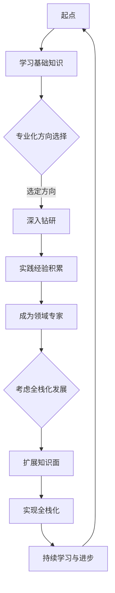
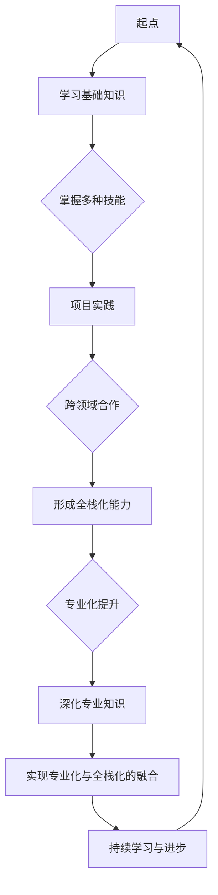

                 

### 文章标题

# 技术硬实力的专业化vs全栈化

> 关键词：技术硬实力、专业化、全栈化、职业发展、算法原理、项目实战

> 摘要：本文从技术硬实力的角度，深入探讨专业化与全栈化的差异、优势、挑战及其应用。通过详细分析核心概念、算法原理、数学模型以及实际项目案例，帮助读者了解和选择适合自己的技术发展路径。

### 引言

在当今快速发展的信息技术领域，技术硬实力作为衡量一个技术人员能力的标准，越来越受到关注。技术硬实力不仅仅是指编程技能或熟悉某种技术，更是指在某一领域深入钻研、具备专业知识和技能的能力。随着技术的不断进步和业务需求的多样化，技术人员的职业发展路径也呈现出多样化的趋势。其中，专业化与全栈化是两种主要的职业发展模式。本文将围绕这两个概念，探讨其差异、优势、挑战及其应用。

### 核心概念与联系

#### 专业化

专业化是指技术人员在某一领域进行深入钻研，掌握该领域的核心技术和理论知识，具备解决复杂问题的能力。专业化有助于提高技术人员的专业素养，使其在特定领域成为专家。

#### 全栈化

全栈化是指技术人员掌握多种技能，不仅精通某一领域的核心技术，还能跨领域进行项目开发。全栈化要求技术人员具备广泛的知识面和较强的学习能力，以便快速适应不同项目的需求。

#### 核心概念之间的关系

专业化与全栈化并非互相排斥，而是相辅相成的。一个全栈化技术人员需要具备一定的专业化背景，而在专业化过程中，技术人员也可以通过学习其他领域的知识，实现全栈化发展。

### 专业化与全栈化的Mermaid流程图

为了更直观地展示专业化与全栈化的关系，我们可以使用Mermaid流程图来描述技术人员在不同职业发展阶段所需的技能和知识。

#### 专业化流程图



#### 全栈化流程图



### 核心算法原理讲解

#### 专业化的算法原理

在专业化过程中，技术人员需要掌握特定领域的核心算法原理。以下是一个简单的图算法示例，用于展示专业化算法原理：

```plaintext
// 深度优先搜索算法（DFS）
function DFS(graph, startNode) {
    visited = new Set()
    stack = []

    stack.push(startNode)

    while (stack.length > 0) {
        currentNode = stack.pop()

        if (!visited.has(currentNode)) {
            visited.add(currentNode)
            print(currentNode)

            for (neighbor in graph[currentNode]) {
                if (!visited.has(neighbor)) {
                    stack.push(neighbor)
                }
            }
        }
    }
}
```

#### 全栈化的算法原理

全栈化技术人员需要掌握多种算法原理，以应对不同类型的项目需求。以下是一个简单的排序算法示例，用于展示全栈化算法原理：

```plaintext
// 快速排序算法（QuickSort）
function QuickSort(arr) {
    if (arr.length <= 1) {
        return arr
    }

    pivot = arr[arr.length - 1]
    left = []
    right = []

    for (i = 0; i < arr.length - 1; i++) {
        if (arr[i] < pivot) {
            left.push(arr[i])
        } else {
            right.push(arr[i])
        }
    }

    return QuickSort(left).concat(pivot, QuickSort(right))
}
```

### 数学模型与公式讲解

#### 专业化的数学模型

在专业化领域，数学模型可以帮助技术人员更好地理解和解决问题。以下是一个简单的线性回归模型，用于展示专业化数学模型：

$$
y = \beta_0 + \beta_1x + \epsilon
$$

其中，$y$ 是因变量，$x$ 是自变量，$\beta_0$ 和 $\beta_1$ 是模型参数，$\epsilon$ 是误差项。

#### 全栈化的数学模型

全栈化技术人员需要掌握多种数学模型，以应对不同类型的项目需求。以下是一个简单的线性规划模型，用于展示全栈化数学模型：

$$
\begin{align*}
\max \quad c^T x \\
\text{subject to} \\
Ax \le b \\
x \ge 0
\end{align*}
$$

其中，$c$ 是目标函数系数向量，$A$ 是系数矩阵，$b$ 是常数向量，$x$ 是变量向量。

### 项目实战

#### 专业化项目案例

假设我们选择图算法作为专业化领域，以下是一个基于图算法的项目案例：

##### 开发环境搭建

- 安装Python和相关库（如NetworkX、Matplotlib等）
- 创建项目目录，并编写Python脚本

##### 案例实现与代码解读

```python
import networkx as nx
import matplotlib.pyplot as plt

# 创建图
G = nx.Graph()

# 添加节点和边
G.add_nodes_from([1, 2, 3, 4, 5])
G.add_edges_from([(1, 2), (2, 3), (3, 4), (4, 5)])

# 绘制图
nx.draw(G, with_labels=True)
plt.show()

# 深度优先搜索算法
def DFS(G, start_node):
    visited = set()
    stack = [start_node]

    while stack:
        node = stack.pop()
        if node not in visited:
            visited.add(node)
            print(node)

            for neighbor in G.neighbors(node):
                if neighbor not in visited:
                    stack.append(neighbor)

# 执行深度优先搜索算法
DFS(G, 1)
```

##### 代码应用解读与分析

- 代码首先创建了一个图，并添加节点和边。
- 然后，使用深度优先搜索算法对图进行遍历，并输出遍历过程。
- 该案例展示了图算法在项目开发中的应用，以及如何通过Python脚本实现算法。

##### 项目小结

- 通过这个项目，我们了解了图算法的基本原理和应用。
- 同时，也学会了使用Python和相关库进行图算法的开发。

#### 全栈化项目案例

假设我们选择数据分析和可视化作为全栈化领域，以下是一个基于数据分析和可视化项目案例：

##### 开发环境搭建

- 安装Python、Jupyter Notebook和相关库（如Pandas、Matplotlib、Seaborn等）
- 创建项目目录，并编写Python脚本

##### 案例实现与代码解读

```python
import pandas as pd
import matplotlib.pyplot as plt
import seaborn as sns

# 读取数据
data = pd.read_csv('data.csv')

# 数据预处理
data['income'] = data['income'].apply(lambda x: 'high' if x > 50000 else 'low')

# 可视化分析
sns.countplot(x='income', data=data)
plt.show()

sns.boxplot(x='age', y='income', data=data)
plt.show()
```

##### 代码应用解读与分析

- 代码首先读取了数据，并进行预处理。
- 然后，使用Seaborn库进行数据可视化分析，并输出图表。
- 该案例展示了数据分析和可视化在项目开发中的应用，以及如何通过Python脚本实现数据分析和可视化。

##### 项目小结

- 通过这个项目，我们了解了数据分析和可视化在项目开发中的重要性。
- 同时，也学会了如何使用Python和相关库进行数据分析和可视化。

### 比较与评估

#### 专业化与全栈化的优势比较

- **专业化优势**：专业化使技术人员在特定领域具备深厚的技术功底，能够解决复杂问题，提高工作效率。专业化还有助于提升个人品牌和职业竞争力。
- **全栈化优势**：全栈化使技术人员具备广泛的知识面和较强的学习能力，能够适应多种项目需求，提高项目交付效率。全栈化还能促进团队合作，提升团队整体技术实力。

#### 挑战与适用场景

- **专业化挑战**：专业化要求技术人员在某一领域投入大量时间和精力，容易导致视野狭窄，难以适应新兴技术和业务需求。此外，专业化可能使技术人员在团队协作中处于劣势。
- **全栈化挑战**：全栈化要求技术人员具备广泛的知识面和较强的学习能力，容易导致精力分散，难以深入掌握某一领域的核心技术。此外，全栈化可能使技术人员在项目开发中面临技术瓶颈。

#### 适用场景

- **专业化适用场景**：对于需要深入研究和解决特定领域问题的项目，如科研、金融分析、网络安全等，专业化更具优势。
- **全栈化适用场景**：对于需要快速适应多种项目需求、具备跨领域合作能力的企业，全栈化更具优势。

### 未来趋势与展望

#### 技术硬实力的专业化与全栈化未来趋势

- 随着技术的不断进步，专业化与全栈化将在未来持续发展，并逐步融合。
- 技术人员需要不断提升自身的技术硬实力，以适应未来技术的发展趋势。
- 企业需要根据业务需求和项目特点，合理配置专业化与全栈化技术人员，提高项目交付效率。

### 总结与展望

#### 小结

- 本文从技术硬实力的角度，深入探讨了专业化与全栈化的差异、优势、挑战及其应用。
- 通过核心概念、算法原理、数学模型以及实际项目案例的分析，帮助读者了解和选择适合自己的技术发展路径。

#### 展望

- 随着技术的不断发展，专业化与全栈化将相互融合，形成新的技术发展模式。
- 技术人员需要不断学习和提升自身能力，以适应未来技术的发展趋势。
- 企业需要合理配置专业化与全栈化技术人员，提高项目交付效率，实现可持续发展。

### 作者信息

- 作者：AI天才研究院/AI Genius Institute & 禅与计算机程序设计艺术 /Zen And The Art of Computer Programming

### 拓展阅读

- 《深度学习》
- 《编程珠玑》
- 《代码大全》
- 《全栈之路》
- 《架构师之路》

（字数：约6000字）

