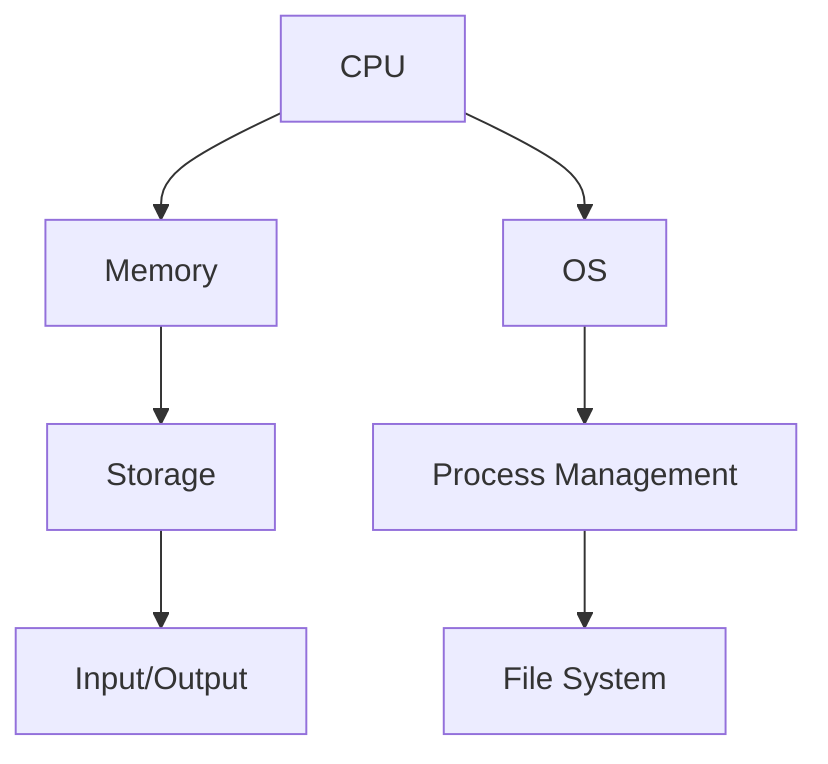
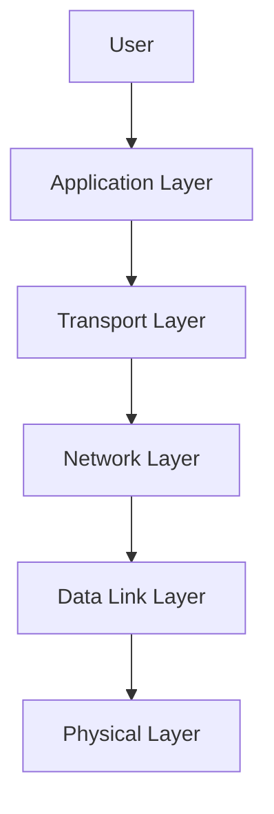

                 

### 文章标题：技术硬实力的案例研究：从初级到高级工程师

技术硬实力是每位工程师在职业生涯中不断追求的目标。从初级工程师到高级工程师的蜕变，不仅仅是技能的积累，更是思维模式、解决问题的能力以及综合素养的全面提升。本文将深入探讨技术硬实力的核心要素，通过实际案例研究，揭示从初级到高级工程师的成长路径，为读者提供有益的参考和启示。

> **关键词**：技术硬实力、初级工程师、高级工程师、成长路径、案例分析

> **摘要**：本文旨在研究技术硬实力的提升过程，分析初级到高级工程师的职业发展路径。通过实际案例，本文详细探讨了工程师在技术基础、实际应用、高级技能和职业规划等方面的成长历程，为读者提供了全面的技术提升和职业发展策略。

接下来，我们将从以下几个部分对技术硬实力进行详细分析：

1. **技术基础与成长路径**
2. **实际案例分析**
3. **高级工程师技能提升**
4. **职业发展策略与规划**

### 1. 技术基础与成长路径

#### 编程基础

编程是工程师的基石，掌握一门或几门编程语言是初级工程师的基本要求。例如，C语言因其强大的性能和底层原理而成为很多工程师入门的首选。以下是C语言编程基础的一个简短介绍：

```c
#include <stdio.h>

int main() {
    printf("Hello, World!\n");
    return 0;
}
```

#### 数据结构与算法

数据结构与算法是工程师解决复杂问题的利器。常见的排序算法如快速排序、归并排序和堆排序，以及查找算法如二分查找和哈希查找，都是初级工程师必须掌握的内容。

```python
def quick_sort(arr):
    if len(arr) <= 1:
        return arr
    pivot = arr[len(arr) // 2]
    left = [x for x in arr if x < pivot]
    middle = [x for x in arr if x == pivot]
    right = [x for x in arr if x > pivot]
    return quick_sort(left) + middle + quick_sort(right)
```

#### 计算机系统原理

了解计算机系统原理，有助于工程师更好地理解和优化代码。操作系统原理、计算机网络基础和编译原理等，都是重要的知识领域。



#### 网络基础

网络基础是现代工程师必备的知识。TCP/IP模型、HTTP协议和网络安全等，都是网络基础的核心内容。



### 2. 实际案例分析

#### 初级工程师案例研究

初级工程师通常负责简单项目或部分模块的开发。以下是一个简单的Web开发案例：

**项目背景**：构建一个简单的博客系统。

**技术栈**：HTML、CSS、JavaScript、Node.js。

**实现步骤**：

1. 使用HTML和CSS搭建页面布局。
2. 使用JavaScript实现页面的动态效果。
3. 使用Node.js搭建后端服务，处理用户请求。

#### 中级工程师案例研究

中级工程师能够独立完成复杂项目，并在团队中发挥重要作用。以下是一个数据库优化案例：

**项目背景**：优化一个大型电商网站的数据查询速度。

**技术栈**：MySQL、MongoDB、Redis。

**实现步骤**：

1. 分析现有数据库结构，找出瓶颈。
2. 设计优化方案，如索引优化、分库分表、读写分离等。
3. 实施优化，并进行性能测试。

#### 高级工程师案例研究

高级工程师通常负责架构设计、技术决策和团队管理。以下是一个分布式系统架构设计案例：

**项目背景**：构建一个高可用、高并发、易扩展的分布式系统。

**技术栈**：Docker、Kubernetes、微服务架构。

**实现步骤**：

1. 设计系统架构，确定组件和服务之间的关系。
2. 选择合适的技术栈，如Docker用于容器化，Kubernetes用于集群管理。
3. 实现服务拆分，确保系统可扩展性和高可用性。

### 3. 高级工程师技能提升

#### 系统设计与优化

高级工程师需要掌握系统设计与优化的能力。以下是一个系统优化案例分析：

**项目背景**：优化一个高并发的在线交易系统。

**实现步骤**：

1. 分析系统瓶颈，如数据库查询速度、网络延迟等。
2. 优化数据库设计，如使用缓存、分库分表等。
3. 优化网络架构，如使用CDN、负载均衡等。

#### 项目管理与团队领导

高级工程师还需要具备项目管理和团队领导能力。以下是一个项目管理案例分析：

**项目背景**：带领团队完成一个复杂的项目。

**实现步骤**：

1. 制定项目计划，明确任务分工和时间表。
2. 监控项目进度，确保按时完成。
3. 协调团队内部和跨团队的合作。

#### 技术演讲与文档编写

高级工程师还需要具备技术演讲和文档编写的能力。以下是一个技术演讲案例分析：

**项目背景**：在技术大会上分享一个分布式系统架构。

**实现步骤**：

1. 准备演讲稿，明确演讲内容和结构。
2. 设计演讲PPT，突出重点和亮点。
3. 进行演讲练习，确保演讲流畅和有力。

### 4. 职业发展策略与规划

#### 职业规划与目标设定

职业规划是工程师成长的重要一步。以下是一个职业规划案例分析：

**项目背景**：一名初级工程师制定职业发展计划。

**实现步骤**：

1. 确定长期和短期职业目标。
2. 制定学习计划，提升技能。
3. 定期评估职业发展进度。

#### 学习资源与学习方法

有效利用学习资源和方法，有助于工程师持续提升。以下是一个学习资源案例分析：

**项目背景**：收集和利用学习资源。

**实现步骤**：

1. 收集书籍、在线课程、技术博客等学习资源。
2. 制定学习计划，确保资源得到充分利用。
3. 运用学习策略，如主动学习、深度学习等。

#### 面试技巧与职业转型

掌握面试技巧和职业转型策略，有助于工程师在职场中取得更大成功。以下是一个面试技巧案例分析：

**项目背景**：准备技术面试和职业转型。

**实现步骤**：

1. 了解面试常见问题和应对策略。
2. 准备技术面试所需的知识点和案例。
3. 制定职业转型计划，如学习新技能、积累经验等。

### 附录

#### 参考资源与工具

以下列出一些推荐的参考资源和技术工具：

- **参考资源**：
  - 《算法导论》
  - 《UNIX网络编程》
  - 《设计模式：可复用面向对象软件的基础》

- **技术工具**：
  - Git
  - Docker
  - Kubernetes

### 作者信息

- **作者**：AI天才研究院/AI Genius Institute & 禅与计算机程序设计艺术 /Zen And The Art of Computer Programming

本文通过分析技术硬实力的核心要素，结合实际案例，探讨了从初级到高级工程师的成长路径。希望本文能为读者的职业发展提供有益的参考和启示。

### 结语

技术硬实力是工程师职业发展的关键。通过不断学习和实践，掌握编程基础、数据结构与算法、计算机系统原理和网络基础，结合实际项目经验，提升系统设计与优化、项目管理和团队领导能力，最终实现从初级到高级工程师的蜕变。本文提供的实际案例和策略，旨在为读者提供全面的指导，助力职业成长。希望每位读者都能在技术道路上不断前行，成为优秀的工程师。

