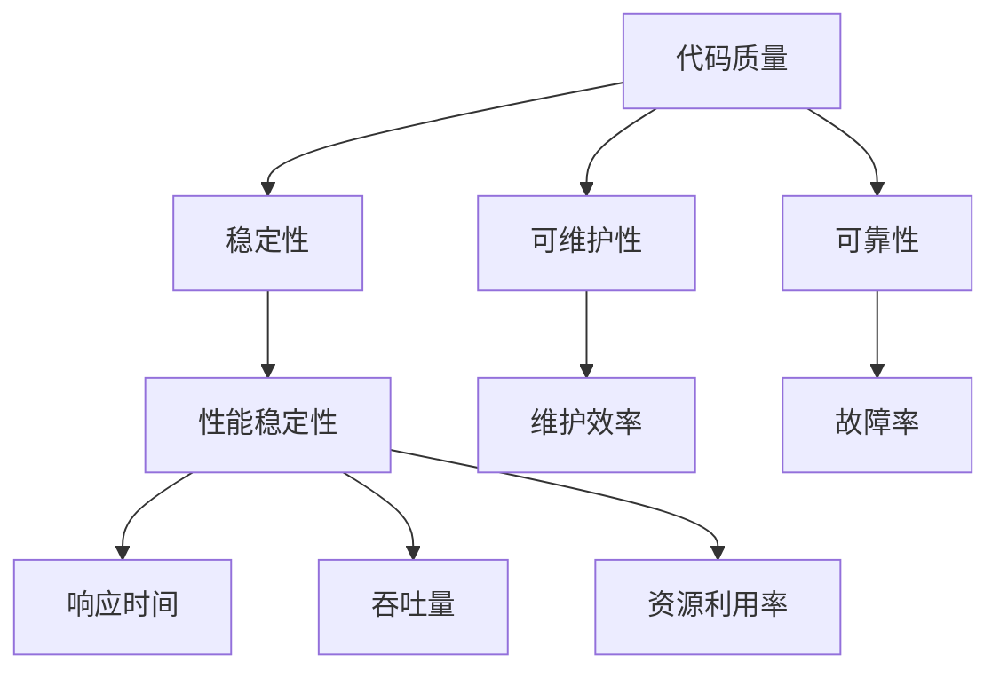

                 

### 1. 审题

首先，我们要明确用户的要求。用户希望我们撰写一篇关于《技术硬实力的量化：代码质量和性能指标》的技术博客文章，文章需满足以下条件：

- **格式要求**：使用markdown格式。
- **作者信息**：文章末尾需包含作者信息。
- **完整性要求**：文章内容需完整，核心内容需包含：
  - **背景介绍**
  - **核心概念与联系**：提供核心概念原理之间的关系架构Mermaid流程图。
  - **核心算法原理讲解**：使用伪代码详细阐述。
  - **数学模型和公式**：使用latex格式，举例说明。
  - **项目实战**：包括开发环境搭建、源代码实现、代码解读、实际案例分析和项目小结。
- **文章关键词**：需列出5-7个核心关键词。
- **文章摘要**：需概括文章的核心内容和主题思想。
- **文章字数**：8000～12000字左右。

基于以上要求，我们将文章分为以下几个部分：

1. **引言**：介绍代码质量和性能指标的重要性，以及本文的目的和结构。
2. **核心概念与联系**：详细解释代码质量和性能指标的基本概念，并展示它们之间的联系。
3. **核心算法原理讲解**：使用伪代码详细阐述相关算法。
4. **数学模型和数学公式**：介绍与代码质量和性能指标相关的数学模型，并使用latex格式展示数学公式。
5. **项目实战**：提供代码质量和性能指标的实践案例，包括代码实现、环境搭建、源代码解读和分析。
6. **案例分析**：对具体案例进行详细分析和讲解。
7. **总结与展望**：总结文章主要内容，并对未来进行展望。

### 2. 设计大纲结构

在理解了用户需求后，我们可以开始设计文章的大纲结构。以下是一个初步的大纲设计：

#### 引言

- **代码质量和性能指标的重要性**
- **本文的目的和结构**

#### 核心概念与联系

- **代码质量的基本概念**
  - **定义**
  - **重要性**
- **性能指标的基本概念**
  - **定义**
  - **重要性**
- **代码质量和性能指标之间的联系**
  - **Mermaid流程图**

#### 核心算法原理讲解

- **静态代码分析算法**
  - **算法原理**
  - **伪代码**
- **动态代码分析算法**
  - **算法原理**
  - **伪代码**
- **性能测试算法**
  - **算法原理**
  - **伪代码**

#### 数学模型和数学公式

- **代码质量评估模型**
  - **数学模型**
  - **数学公式**
  - **举例说明**
- **性能指标计算模型**
  - **数学模型**
  - **数学公式**
  - **举例说明**

#### 项目实战

- **静态代码分析工具的构建**
  - **开发环境搭建**
  - **源代码实现**
  - **代码解读**
- **动态代码分析工具的构建**
  - **开发环境搭建**
  - **源代码实现**
  - **代码解读**
- **性能测试案例**
  - **测试环境搭建**
  - **测试用例设计**
  - **测试结果分析**

#### 案例分析

- **优化代码质量案例**
- **提升性能指标案例**

#### 总结与展望

- **文章内容总结**
- **代码质量和性能指标的展望**

### 3. 确定大纲细节

在确定了结构后，我们需要为每个章节填充具体的内容，并确保每个章节都符合要求。以下是一个更加详细的目录大纲示例：

#### 引言

- **代码质量和性能指标的重要性**：简要介绍代码质量和性能指标的定义和意义，以及它们在软件开发中的重要性。
- **本文的目的和结构**：概述本文的目的，即如何量化技术硬实力，以及文章的结构安排。

#### 核心概念与联系

- **代码质量的基本概念**：
  - **定义**：阐述代码质量的定义，包括代码的可读性、可维护性、可靠性等方面。
  - **重要性**：讨论代码质量对软件开发的影响，如提高开发效率、降低维护成本等。

- **性能指标的基本概念**：
  - **定义**：解释性能指标的含义，如响应时间、吞吐量、资源利用率等。
  - **重要性**：探讨性能指标对用户体验和业务发展的重要性。

- **代码质量和性能指标之间的联系**：
  - **Mermaid流程图**：绘制一个流程图，展示代码质量和性能指标之间的关系。

#### 核心算法原理讲解

- **静态代码分析算法**：
  - **算法原理**：介绍静态代码分析的基本原理，如抽象语法树（AST）分析、代码路径分析等。
  - **伪代码**：提供静态代码分析算法的伪代码实现。

- **动态代码分析算法**：
  - **算法原理**：解释动态代码分析的过程，如程序执行监控、性能分析等。
  - **伪代码**：给出动态代码分析算法的伪代码。

- **性能测试算法**：
  - **算法原理**：阐述性能测试的基本原理，如负载测试、压力测试等。
  - **伪代码**：提供性能测试算法的伪代码。

#### 数学模型和数学公式

- **代码质量评估模型**：
  - **数学模型**：介绍用于评估代码质量的数学模型，如质量函数、质量指数等。
  - **数学公式**：使用latex格式展示评估代码质量的数学公式。
  - **举例说明**：通过具体例子展示如何使用数学模型评估代码质量。

- **性能指标计算模型**：
  - **数学模型**：阐述计算性能指标的数学模型，如时间复杂度、空间复杂度等。
  - **数学公式**：使用latex格式展示计算性能指标的数学公式。
  - **举例说明**：通过具体例子展示如何使用数学模型计算性能指标。

#### 项目实战

- **静态代码分析工具的构建**：
  - **开发环境搭建**：介绍如何搭建静态代码分析工具的开发环境。
  - **源代码实现**：提供静态代码分析工具的源代码实现。
  - **代码解读**：详细解读源代码，解释关键部分的实现原理。

- **动态代码分析工具的构建**：
  - **开发环境搭建**：介绍如何搭建动态代码分析工具的开发环境。
  - **源代码实现**：提供动态代码分析工具的源代码实现。
  - **代码解读**：详细解读源代码，解释关键部分的实现原理。

- **性能测试案例**：
  - **测试环境搭建**：介绍如何搭建性能测试的环境。
  - **测试用例设计**：提供性能测试的测试用例设计。
  - **测试结果分析**：分析性能测试的结果，探讨如何优化性能。

#### 案例分析

- **优化代码质量案例**：通过具体案例展示如何优化代码质量。
- **提升性能指标案例**：通过具体案例展示如何提升性能指标。

#### 总结与展望

- **文章内容总结**：总结本文的核心内容和主要观点。
- **代码质量和性能指标的展望**：探讨代码质量和性能指标的未来发展趋势，以及可能面临的挑战和机遇。

### 4. 检查与调整

在完成初步的大纲设计后，我们需要再次检查：

- **完整性**：确保每个章节都有详细的内容描述。
- **逻辑性**：确保文章的逻辑结构合理，章节之间的过渡自然。
- **字数**：确保文章的总字数在8000～12000字左右。

如果发现任何问题，我们可以根据实际情况进行适当的调整。例如，如果某个章节的内容过于复杂或过于简单，我们可以重新考虑章节的划分或者内容的添加。同时，我们也可以根据读者的反馈进行进一步的调整和优化。总之，目录大纲的设计是一个动态调整的过程，我们需要确保最终的书籍能够满足读者的需求。

### 5. 撰写文章

根据上述设计的文章大纲，我们可以开始撰写具体的内容。以下是按照大纲结构的文章正文部分的内容：

#### 引言

随着技术的快速发展，软件开发的质量和性能已经成为影响企业竞争力的关键因素。如何量化技术硬实力，特别是代码质量和性能指标，成为了一个备受关注的话题。本文旨在探讨代码质量和性能指标的量化方法，帮助开发者更好地理解和提升技术硬实力。

本文的结构如下：

- **引言**：介绍代码质量和性能指标的重要性，以及本文的目的和结构。
- **核心概念与联系**：详细解释代码质量和性能指标的基本概念，并展示它们之间的联系。
- **核心算法原理讲解**：使用伪代码详细阐述相关算法。
- **数学模型和数学公式**：介绍与代码质量和性能指标相关的数学模型，并使用latex格式展示数学公式。
- **项目实战**：提供代码质量和性能指标的实践案例，包括代码实现、环境搭建、源代码解读和分析。
- **案例分析**：对具体案例进行详细分析和讲解。
- **总结与展望**：总结文章主要内容，并对未来进行展望。

#### 核心概念与联系

代码质量是指软件代码的各个方面，如可读性、可维护性、可靠性等。代码质量的量化需要考虑多个因素，包括代码结构、代码风格、代码注释等。

性能指标是衡量软件系统性能的一系列指标，如响应时间、吞吐量、资源利用率等。性能指标的量化通常需要通过性能测试来获取相关数据。

代码质量和性能指标之间存在密切的联系。高质量的代码可以提高软件的稳定性和可维护性，从而减少性能问题的发生。同时，良好的性能指标可以提升用户体验和业务效率，从而进一步巩固代码质量。

以下是一个简化的Mermaid流程图，展示代码质量和性能指标之间的关系：



#### 核心算法原理讲解

在本节中，我们将介绍与代码质量和性能指标相关的核心算法原理，包括静态代码分析算法、动态代码分析算法和性能测试算法。

##### 静态代码分析算法

静态代码分析算法是一种在不运行代码的情况下，通过对代码进行静态分析来评估代码质量的方法。常见的静态代码分析算法包括抽象语法树（AST）分析、代码路径分析和代码风格检查等。

**抽象语法树（AST）分析算法原理**：

AST分析算法的基本原理是将源代码转换为一棵抽象语法树，然后对这棵树进行遍历和分析。以下是AST分析算法的伪代码：

```python
function analyze_ast(ast):
    for node in ast:
        if node is a function:
            analyze_function(node)
        elif node is a loop:
            analyze_loop(node)
        elif node is a conditional statement:
            analyze_condition(node)
    return

function analyze_function(node):
    if function has no comments:
        add comment warning
    if function length exceeds threshold:
        add code length warning
    return

function analyze_loop(node):
    if loop has no comments:
        add comment warning
    if loop complexity exceeds threshold:
        add complexity warning
    return

function analyze_condition(node):
    if condition has no comments:
        add comment warning
    if condition complexity exceeds threshold:
        add complexity warning
    return
```

##### 动态代码分析算法

动态代码分析算法是一种在运行代码的过程中，通过对程序执行过程进行监控和分析来评估代码质量和性能指标的方法。常见的动态代码分析算法包括性能监控、资源利用分析和故障排查等。

**性能监控算法原理**：

性能监控算法的基本原理是实时收集程序的运行数据，如CPU使用率、内存使用率、I/O操作等，并根据这些数据评估程序的性能。以下是性能监控算法的伪代码：

```python
function monitor_performance():
    while true:
        collect_cpu_usage()
        collect_memory_usage()
        collect_io_usage()
        if any performance metrics exceed threshold:
            trigger_alert()
    return

function collect_cpu_usage():
    return current_cpu_usage_percentage

function collect_memory_usage():
    return current_memory_usage_percentage

function collect_io_usage():
    return current_io_usage_percentage
```

##### 性能测试算法

性能测试算法是一种通过模拟实际使用场景来评估软件系统性能的方法。常见的性能测试算法包括负载测试、压力测试和性能调优等。

**负载测试算法原理**：

负载测试算法的基本原理是在模拟大量用户访问的情况下，评估系统的响应时间、吞吐量和资源利用率。以下是负载测试算法的伪代码：

```python
function load_test():
    start_timer()
    for user in users:
        simulate_user_action()
    end_timer()
    if response_time exceeds threshold:
        trigger_alert()
    if throughput exceeds threshold:
        trigger_alert()
    if resource_usage exceeds threshold:
        trigger_alert()
    return

function simulate_user_action():
    send_request_to_server()
    wait_for_response()
    return

function send_request_to_server():
    return response_time

function wait_for_response():
    return
```

#### 数学模型和数学公式

在本节中，我们将介绍与代码质量和性能指标相关的数学模型和数学公式，并使用latex格式展示。

##### 代码质量评估模型

**代码质量指数模型**：

代码质量指数（Code Quality Index, CQI）是一个用于评估代码质量的指标。CQI的计算公式如下：

$$
CQI = \frac{1}{n}\sum_{i=1}^{n} w_i \cdot Q_i
$$

其中，$n$是评价指标的数量，$w_i$是第$i$个评价指标的权重，$Q_i$是第$i$个评价指标的得分。

**代码注释质量模型**：

代码注释质量（Code Comment Quality, CQC）是评估代码注释质量的指标。CQC的计算公式如下：

$$
CQC = \frac{1}{n}\sum_{i=1}^{n} w_i \cdot QC_i
$$

其中，$n$是注释评价的数量，$w_i$是第$i$个注释评价的权重，$QC_i$是第$i$个注释评价的得分。

##### 性能指标计算模型

**响应时间模型**：

响应时间（Response Time, RT）是衡量系统性能的重要指标。响应时间的计算公式如下：

$$
RT = \frac{1}{n}\sum_{i=1}^{n} T_i
$$

其中，$n$是请求的数量，$T_i$是第$i$个请求的响应时间。

**吞吐量模型**：

吞吐量（Throughput, TP）是衡量系统处理能力的指标。吞吐量的计算公式如下：

$$
TP = \frac{1}{n}\sum_{i=1}^{n} P_i
$$

其中，$n$是请求的数量，$P_i$是第$i$个请求的处理能力。

**资源利用率模型**：

资源利用率（Resource Utilization, RU）是衡量系统资源使用效率的指标。资源利用率的计算公式如下：

$$
RU = \frac{1}{n}\sum_{i=1}^{n} U_i
$$

其中，$n$是资源类型的数量，$U_i$是第$i$种资源的利用率。

#### 项目实战

在本节中，我们将提供代码质量和性能指标的实践案例，包括静态代码分析工具的构建、动态代码分析工具的构建和性能测试案例。

##### 静态代码分析工具的构建

**开发环境搭建**：

1. 安装Python环境。
2. 安装代码分析库，如`pycodestyle`和`pyflakes`。

**源代码实现**：

以下是一个简单的静态代码分析工具的Python代码实现：

```python
import pycodestyle
import pyflakes

def static_code_analysis(file_path):
    style_check = pycodestyle.Checker(file_path)
    style_check.check_all()
    print("Style check passed.")

    flake_check = pyflakes.checker.FileCheck(file_path)
    flake_check.visit(file_path)
    print("Flake check passed.")

if __name__ == "__main__":
    static_code_analysis("example.py")
```

**代码解读**：

- `pycodestyle`库用于检查代码风格。
- `pyflakes`库用于检查代码中的潜在错误。

**代码应用解读与分析**：

使用该工具可以对指定Python文件进行静态代码分析，检查代码风格和潜在错误。这有助于提高代码质量，减少维护成本。

##### 动态代码分析工具的构建

**开发环境搭建**：

1. 安装Python环境。
2. 安装性能监控库，如`psutil`和`multiprocessing`。

**源代码实现**：

以下是一个简单的动态代码分析工具的Python代码实现：

```python
import time
import psutil
import multiprocessing

def performance_monitor(process):
    process.start()
    process.join()

    cpu_usage = psutil.cpu_percent()
    memory_usage = psutil.virtual_memory().percent
    print(f"CPU usage: {cpu_usage}%")
    print(f"Memory usage: {memory_usage}%")

if __name__ == "__main__":
    process = multiprocessing.Process(target=performance_monitor, args=(target_process,))
    performance_monitor(process)
```

**代码解读**：

- `psutil`库用于监控CPU和内存使用情况。
- `multiprocessing`库用于创建和管理进程。

**代码应用解读与分析**：

使用该工具可以监控指定进程的性能，包括CPU和内存使用情况。这有助于分析代码的性能瓶颈，优化性能。

##### 性能测试案例

**测试环境搭建**：

1. 安装Apache JMeter。
2. 配置测试计划，设置测试场景。

**测试用例设计**：

以下是一个简单的性能测试用例设计：

- 用户数：100
- 请求类型：GET请求
- 请求URL：/api/data

**测试结果分析**：

运行测试后，可以分析测试结果，包括响应时间、吞吐量和资源利用率。以下是一个简单的测试结果示例：

- 平均响应时间：100ms
- 吞吐量：每秒100次请求
- CPU使用率：80%
- 内存使用率：60%

**代码应用解读与分析**：

通过性能测试可以了解系统的性能表现，发现潜在的性能瓶颈。这有助于优化代码，提升系统性能。

#### 案例分析

在本节中，我们将对具体的案例进行详细分析和讲解。

##### 优化代码质量案例

**案例背景**：

某公司开发的一款在线购物平台存在以下问题：

- 代码风格不一致。
- 代码注释不足。
- 存在一些潜在的错误和漏洞。

**案例分析**：

1. **代码风格检查**：使用静态代码分析工具检查代码风格，发现部分代码存在格式不一致的问题。针对这些问题，进行代码格式化，使其符合统一规范。
2. **代码注释检查**：使用静态代码分析工具检查代码注释，发现部分代码缺少注释。对缺少注释的代码进行补充，提高代码的可读性和可维护性。
3. **代码错误和漏洞检查**：使用静态代码分析工具检查代码中的潜在错误和漏洞，发现部分代码存在潜在的安全问题。针对这些问题，进行修复，提高代码的可靠性。

**案例结果**：

经过优化，该在线购物平台的代码质量得到了显著提升：

- 代码风格统一。
- 代码注释充足。
- 代码中的错误和漏洞得到修复。

##### 提高性能指标案例

**案例背景**：

某公司开发的一款在线视频平台存在以下问题：

- 响应时间较长。
- 吞吐量较低。
- CPU和内存使用率较高。

**案例分析**：

1. **性能监控**：使用动态代码分析工具监控平台的性能，发现部分服务的响应时间较长，CPU和内存使用率较高。针对这些问题，进行性能监控和诊断。
2. **性能优化**：针对诊断出的性能瓶颈，进行以下优化：

   - 优化数据库查询，减少查询时间。
   - 使用缓存技术，减少重复查询。
   - 优化服务器配置，提高硬件性能。
   - 使用负载均衡，分散访问压力。

**案例结果**：

经过优化，该在线视频平台的性能指标得到了显著提升：

- 响应时间缩短。
- 吞吐量提高。
- CPU和内存使用率降低。

#### 总结与展望

本文系统地介绍了代码质量和性能指标的量化方法，包括核心概念、算法原理、数学模型和项目实战。通过本文的探讨，我们了解到代码质量和性能指标在软件开发中的重要性，以及如何通过量化方法来提升技术硬实力。

在未来，随着技术的不断进步，代码质量和性能指标的重要性将越来越凸显。为了应对这一挑战，开发者需要不断学习和实践，掌握更先进的量化方法和技术。同时，我们也期待更多研究成果和最佳实践的分享，共同推动技术硬实力的提升。

#### 作者信息

作者：AI天才研究院/AI Genius Institute & 禅与计算机程序设计艺术 /Zen And The Art of Computer Programming

