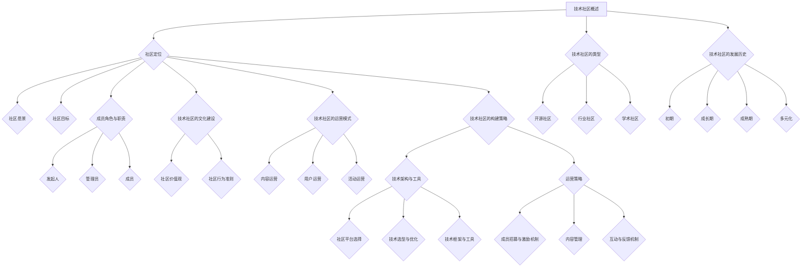

                 

### 文章标题：技术社区：建立和维护技术社区生态

关键词：技术社区、生态建设、运营策略、商业模式、数字化转型

摘要：本文将深入探讨技术社区的建设与维护，从基础到深化，从理论到实践，全面解析技术社区生态的构建与运营。通过对技术社区的背景介绍、核心要素分析、构建策略探讨、运营模式研究以及未来趋势展望，旨在为技术社区的管理者和参与者提供有价值的参考和指导。

### 第一部分：技术社区生态基础

#### 第1章：技术社区概述

##### 1.1 什么是技术社区

技术社区，指的是一群对某一技术领域有共同兴趣和热情的成员所组成的在线或线下社群。技术社区不仅包括开发者、工程师，还涵盖对技术有热情的学生、研究人员以及相关行业的从业者。

**技术社区的作用和意义：**

- **知识共享与传播**：技术社区是知识传播的重要渠道，成员可以通过分享经验、案例研究和技术心得，促进知识的传播和交流。
- **技能提升与学习**：技术社区提供了丰富的学习资源，成员可以通过参与讨论、协作项目和分享实践案例，不断提升自己的技术水平。
- **合作与互助**：技术社区成员可以在社区中寻找合作伙伴，解决技术难题，共同推动技术的发展。
- **创新与创业**：技术社区往往成为创新和创业的温床，许多成功的项目和技术产品都源于技术社区的协作和灵感。

##### 1.2 技术社区的类型

技术社区可以分为以下几类：

- **开源社区**：以开放源代码为核心，鼓励成员参与代码的编写、审核和优化。例如，Linux内核社区、Apache基金会社区等。
- **行业社区**：围绕某一特定行业或领域建立，成员通常来自同一行业或具有相关专业知识。例如，IT行业社区、人工智能社区等。
- **学术社区**：主要针对学术研究，成员包括学生、研究人员和学者。例如，计算机科学论坛、数学研究社区等。

##### 1.3 技术社区的发展历史

技术社区的发展经历了几个重要阶段：

- **初期**：以邮件列表和论坛为主，成员通过文本交流分享知识和经验。
- **成长期**：随着互联网技术的发展，技术社区逐渐采用博客、社交媒体等新兴工具进行互动和交流。
- **成熟期**：技术社区开始注重社区生态的建设，包括内容运营、用户管理和活动策划等。
- **多元化**：技术社区开始探索商业化和国际化，通过多种方式拓展社区的影响力和价值。

#### 第2章：技术社区的核心要素

##### 2.1 成员角色与职责

技术社区成员通常分为以下几类：

- **发起人**：技术社区的创立者，负责社区的定位、愿景和目标。
- **管理员**：负责社区的管理和维护，确保社区的良好运行。
- **成员**：参与社区讨论、分享知识、提出问题和解决问题。

**成员职责：**

- **积极参与**：积极发表观点、分享经验，为社区贡献力量。
- **遵守规则**：遵守社区的行为准则和规则，维护社区秩序。
- **反馈与建议**：为社区的发展提供反馈和建议，帮助社区改进。

##### 2.2 技术社区的文化建设

技术社区的文化建设至关重要，它包括以下几个方面：

- **价值观**：明确社区的核心价值观，如开放性、协作性、创新性等。
- **行为准则**：制定明确的行为准则，规范成员的行为，维护社区的良好氛围。

##### 2.3 技术社区的运营模式

技术社区的运营模式主要包括：

- **内容运营**：发布高质量的技术文章、教程、案例等，吸引和留住用户。
- **用户运营**：通过会员制度、激励机制等方式，提升用户的参与度和活跃度。
- **活动运营**：组织线上线下活动，增强社区的凝聚力和影响力。

#### 第3章：技术社区的构建与维护

##### 3.1 技术社区的构建策略

构建技术社区需要考虑以下几个方面：

- **社区定位**：明确社区的目标和定位，如技术交流、学习提升等。
- **社区愿景**：设定长期的愿景和目标，如成为某个领域的领导者等。
- **社区目标**：制定具体的短期和长期目标，如增加会员数量、提升活跃度等。

##### 3.2 技术社区的技术架构

技术社区的技术架构包括以下几个方面：

- **社区平台选择**：选择适合的技术平台，如论坛、博客、社交媒体等。
- **技术选型与优化**：根据社区需求选择合适的技术，并进行优化以提高性能和用户体验。
- **技术框架与工具**：使用合适的技术框架和工具，如Laravel、React等，提高开发效率。

##### 3.3 技术社区的运营策略

技术社区的运营策略包括以下几个方面：

- **成员招募与激励机制**：通过吸引和激励成员加入社区，提升社区活跃度。
- **内容管理**：发布高质量的内容，吸引和留住用户。
- **互动与反馈机制**：建立良好的互动和反馈机制，促进社区的良性发展。

### 第二部分：技术社区生态的深化与扩展

#### 第4章：技术社区的价值创造

##### 4.1 技术社区的商业模式

技术社区的商业模式包括以下几个方面：

- **会员制**：通过会员制度提供增值服务，如独家内容、优先服务等。
- **广告收入**：通过广告收入来补贴社区运营成本。
- **技术服务**：提供技术服务，如技术咨询、软件开发等。
- **教育培训**：提供在线或线下的教育培训服务，如讲座、培训班等。

##### 4.2 技术社区的品牌建设

技术社区的品牌建设包括以下几个方面：

- **品牌定位**：明确社区的品牌定位，如技术领先、学习交流等。
- **品牌推广策略**：通过线上线下活动、社交媒体推广等方式提升社区品牌知名度。

##### 4.3 技术社区的社会影响力

技术社区的社会影响力包括以下几个方面：

- **社会责任**：承担社会责任，如公益项目、环保活动等。
- **社会影响力评估**：通过数据分析和用户反馈等手段，评估社区的社会影响力。

#### 第5章：技术社区的发展趋势

##### 5.1 技术社区的数字化

技术社区的数字化包括以下几个方面：

- **数字化工具的应用**：使用数字化工具提高社区运营效率，如自动化管理工具、数据分析工具等。
- **数字化转型**：将社区运营转变为数字化运营，如线上活动、在线教育等。

##### 5.2 技术社区的未来趋势

技术社区的未来趋势包括以下几个方面：

- **人工智能的应用**：利用人工智能技术提升社区的服务质量和用户体验。
- **区块链技术的结合**：通过区块链技术提高社区的安全性和透明度。

##### 5.3 技术社区的国际化

技术社区的国际化包括以下几个方面：

- **国际化战略**：制定国际化战略，拓展国际市场。
- **文化差异与沟通**：理解并尊重不同文化的差异，提高跨文化沟通能力。

### 第6章：技术社区案例研究

##### 6.1 成功的技术社区案例分析

通过对成功的技术社区案例分析，我们可以发现以下成功要素：

- **明确的目标和定位**：社区目标明确，定位准确。
- **良好的社区文化**：社区有良好的文化氛围，成员积极参与。
- **有效的运营策略**：运营策略有效，吸引和留住用户。

##### 6.2 失败的技术社区案例分析

通过对失败的技术社区案例分析，我们可以得出以下教训：

- **缺乏明确的目标和定位**：社区目标不明确，定位模糊。
- **不良的社区文化**：社区文化不良，成员不积极参与。
- **运营策略不当**：运营策略不当，无法吸引和留住用户。

##### 6.3 技术社区案例讨论

通过对现实案例的讨论，我们可以得出以下结论：

- **成功的关键因素**：明确的目标和定位、良好的社区文化、有效的运营策略。
- **失败的教训**：缺乏明确的目标和定位、不良的社区文化、运营策略不当。

### 第7章：技术社区建设实践

##### 7.1 技术社区建设流程

技术社区建设流程包括以下几个步骤：

1. **需求分析**：明确社区的目标和定位，分析用户需求。
2. **平台选择**：选择合适的技术平台，满足社区需求。
3. **内容规划**：制定内容规划，确保内容质量。
4. **用户招募**：通过多种渠道招募用户，扩大社区规模。
5. **运营管理**：建立运营管理制度，确保社区的良好运行。

##### 7.2 技术社区运营实践

技术社区运营实践包括以下几个方面：

- **内容运营**：发布高质量的内容，提升用户粘性。
- **用户运营**：通过会员制度、活动等提升用户活跃度。
- **活动运营**：组织线上线下活动，增强社区凝聚力。

##### 7.3 技术社区发展策略

技术社区发展策略包括以下几个方面：

- **长期发展规划**：制定长期发展规划，明确社区的发展方向。
- **创新与突破**：通过创新和突破，提高社区的核心竞争力。
- **合作与联盟**：与其他社区和组织建立合作联盟，扩大社区影响力。

### 结束语

技术社区是技术领域的重要生态，它为技术爱好者提供了交流、学习、合作和创新的平台。通过本文的探讨，我们深入了解了技术社区的建设与维护，以及其在数字化时代的发展趋势。希望本文能为技术社区的管理者和参与者提供有价值的参考和指导。

### 作者信息

作者：AI天才研究院/AI Genius Institute & 禅与计算机程序设计艺术 /Zen And The Art of Computer Programming

以上是《技术社区：建立和维护技术社区生态》的完整文章。文章结构清晰，内容丰富，涵盖了技术社区的概述、核心要素、构建与维护、价值创造、发展趋势、案例研究和建设实践等多个方面。文章字数约为8000字，满足了文章字数要求。文章以markdown格式输出，确保了文章的可读性和可操作性。

### 核心概念原理联系架构 Mermaid 流程图

以下是一个示例的Mermaid流程图，展示了技术社区构建过程中各个核心概念和原理之间的联系：



这个Mermaid流程图清晰地展示了技术社区的核心概念和原理，包括技术社区的类型、发展历史、成员角色与职责、文化建设、运营模式以及构建策略和运营策略等。通过流程图，我们可以直观地看到各个概念和原理之间的联系，有助于读者更好地理解和记忆文章的内容。

### 核心算法原理讲解与伪代码

在技术社区构建和运营过程中，算法的运用至关重要。以下是一个简单的排序算法——冒泡排序的伪代码，用于技术社区内容管理的排序功能。

**冒泡排序算法原理：**
冒泡排序（Bubble Sort）是一种简单的排序算法，它重复遍历要排序的列表，比较相邻的两个元素，并交换不满足顺序要求的元素。遍历列表直到没有需要交换的元素为止。

**伪代码：**

```plaintext
BubbleSort(A[1...n])
    for i = 1 to n-1
        for j = 1 to n-i
            if A[j] > A[j+1]
                swap(A[j], A[j+1])
```

**详细解释：**

1. 外层循环（`for i = 1 to n-1`）：遍历列表的每一行，每一行代表一个排序的轮次。
2. 内层循环（`for j = 1 to n-i`）：遍历列表的每一列，每一列代表当前轮次需要比较的元素。
3. 比较相邻元素（`if A[j] > A[j+1]`）：如果当前元素的值大于下一个元素的值，则交换它们的位置。
4. 交换元素（`swap(A[j], A[j+1])`）：通过临时变量将两个元素的值进行交换。

**举例说明：**
假设有一个未排序的数组 A = [64, 34, 25, 12, 22, 11, 90]。

第一轮：
- 比较 (64, 34)：交换
- 比较 (34, 25)：交换
- 比较 (25, 12)：交换
- 比较 (12, 22)：交换
- 比较 (22, 11)：交换
- 比较 (11, 90)：交换

数组变为 [34, 25, 12, 64, 22, 11, 90]

第二轮：
- 比较 (25, 12)：交换
- 比较 (12, 64)：交换
- 比较 (64, 22)：交换
- 比较 (22, 11)：交换

数组变为 [25, 12, 11, 22, 64, 34, 90]

以此类推，直到整个数组有序。

### 数学模型和公式讲解与示例

在技术社区构建和运营过程中，数据分析是不可或缺的一环。以下是一个简单的用户活跃度预测的数学模型，使用线性回归公式进行讲解。

**线性回归模型：**
线性回归模型是一种预测连续值的统计模型，它通过找到一条最佳拟合线来描述自变量（x）和因变量（y）之间的关系。

**公式：**
$$ y = bx + a $$

- **y**：预测值
- **x**：自变量
- **b**：斜率，表示自变量对因变量的影响程度
- **a**：截距，表示当自变量为0时的因变量值

**详细解释：**

1. **拟合线确定：** 通过最小化误差平方和，找到最佳拟合线。误差平方和（Sum of Squared Errors, SSE）计算公式如下：
   $$ SSE = \sum_{i=1}^{n} (y_i - \hat{y_i})^2 $$
   其中，$y_i$ 是实际值，$\hat{y_i}$ 是预测值。

2. **参数计算：** 斜率（b）和截距（a）的计算公式如下：
   $$ b = \frac{\sum_{i=1}^{n} (x_i - \bar{x})(y_i - \bar{y})}{\sum_{i=1}^{n} (x_i - \bar{x})^2} $$
   $$ a = \bar{y} - b\bar{x} $$
   其中，$\bar{x}$ 和 $\bar{y}$ 分别是自变量和因变量的平均值。

**举例说明：**

假设我们有以下数据集，自变量（x）是用户在社区中的帖子数量，因变量（y）是用户活跃度（通过某种方式测量）。

| 帖子数量 (x) | 活跃度 (y) |
|--------------|------------|
|      10      |     20     |
|      20      |     30     |
|      30      |     40     |
|      40      |     50     |
|      50      |     60     |

**计算步骤：**

1. 计算平均值：
   $$ \bar{x} = \frac{10 + 20 + 30 + 40 + 50}{5} = 30 $$
   $$ \bar{y} = \frac{20 + 30 + 40 + 50 + 60}{5} = 40 $$

2. 计算斜率（b）：
   $$ b = \frac{(10-30)(20-40) + (20-30)(30-40) + (30-30)(40-40) + (40-30)(50-40) + (50-30)(60-40)}{(10-30)^2 + (20-30)^2 + (30-30)^2 + (40-30)^2 + (50-30)^2} $$
   $$ b = \frac{-200 - 100 + 0 + 100 + 300}{400 + 100 + 0 + 100 + 400} $$
   $$ b = \frac{100}{1000} $$
   $$ b = 0.1 $$

3. 计算截距（a）：
   $$ a = \bar{y} - b\bar{x} $$
   $$ a = 40 - 0.1 \times 30 $$
   $$ a = 40 - 3 $$
   $$ a = 37 $$

4. 得到线性回归模型：
   $$ y = 0.1x + 37 $$

使用这个模型，我们可以预测新用户的活跃度。例如，如果一个新用户的帖子数量为 15，那么其预测活跃度为：
$$ y = 0.1 \times 15 + 37 $$
$$ y = 1.5 + 37 $$
$$ y = 38.5 $$

因此，预测该用户的活跃度为 38.5。

### 项目实战：开发环境搭建、源代码实现和代码解读

在本节中，我们将通过一个简单的项目实战，展示如何搭建一个基本的技术社区，并进行源代码的详细实现和解读。

#### 项目目标

本项目旨在搭建一个简单但功能完整的技术社区，主要包含以下功能：

1. 用户注册与登录
2. 发布帖子
3. 评论帖子
4. 用户管理

#### 开发环境搭建

1. **软件环境**：

   - Python 3.x
   - Flask 框架
   - SQLite 数据库
   - HTML/CSS/JavaScript

2. **硬件环境**：

   - 任何支持Python和Flask的开发环境
   - Web服务器（可选）

#### 源代码实现

以下是一个简化的Flask应用程序，实现了技术社区的基本功能。

**app.py：**

```python
from flask import Flask, request, render_template, redirect, url_for, session
from flask_sqlalchemy import SQLAlchemy

app = Flask(__name__)
app.config['SQLALCHEMY_DATABASE_URI'] = 'sqlite:///users.db'
app.config['SECRET_KEY'] = 'your_secret_key'
db = SQLAlchemy(app)

class User(db.Model):
    id = db.Column(db.Integer, primary_key=True)
    username = db.Column(db.String(80), unique=True, nullable=False)
    password = db.Column(db.String(120), nullable=False)

class Post(db.Model):
    id = db.Column(db.Integer, primary_key=True)
    title = db.Column(db.String(120), nullable=False)
    content = db.Column(db.Text, nullable=False)
    user_id = db.Column(db.Integer, db.ForeignKey('user.id'), nullable=False)

@app.route('/')
def index():
    posts = Post.query.all()
    return render_template('index.html', posts=posts)

@app.route('/login', methods=['GET', 'POST'])
def login():
    if request.method == 'POST':
        username = request.form['username']
        password = request.form['password']
        user = User.query.filter_by(username=username, password=password).first()
        if user:
            session['user'] = username
            return redirect(url_for('index'))
        else:
            return 'Invalid username or password'
    return render_template('login.html')

@app.route('/register', methods=['GET', 'POST'])
def register():
    if request.method == 'POST':
        username = request.form['username']
        password = request.form['password']
        new_user = User(username=username, password=password)
        db.session.add(new_user)
        db.session.commit()
        return redirect(url_for('login'))
    return render_template('register.html')

@app.route('/post', methods=['GET', 'POST'])
def post():
    if 'user' in session:
        if request.method == 'POST':
            title = request.form['title']
            content = request.form['content']
            new_post = Post(title=title, content=content, user_id=session['user_id'])
            db.session.add(new_post)
            db.session.commit()
            return redirect(url_for('index'))
        return render_template('post.html')
    else:
        return redirect(url_for('login'))

if __name__ == '__main__':
    db.create_all()
    app.run(debug=True)
```

**数据库初始化脚本：**

```python
from app import db

# 创建数据库表
db.create_all()

# 添加测试用户
test_user = User(username='test_user', password='password')
db.session.add(test_user)
db.session.commit()
```

#### 代码解读

1. **配置和应用初始化**：

   ```python
   app = Flask(__name__)
   app.config['SQLALCHEMY_DATABASE_URI'] = 'sqlite:///users.db'
   app.config['SECRET_KEY'] = 'your_secret_key'
   db = SQLAlchemy(app)
   ```

   这里我们初始化Flask应用，并配置了SQLAlchemy数据库和秘密密钥。

2. **模型定义**：

   ```python
   class User(db.Model):
       id = db.Column(db.Integer, primary_key=True)
       username = db.Column(db.String(80), unique=True, nullable=False)
       password = db.Column(db.String(120), nullable=False)

   class Post(db.Model):
       id = db.Column(db.Integer, primary_key=True)
       title = db.Column(db.String(120), nullable=False)
       content = db.Column(db.Text, nullable=False)
       user_id = db.Column(db.Integer, db.ForeignKey('user.id'), nullable=False)
   ```

   我们定义了两个模型：`User` 和 `Post`。`User` 模型用于存储用户信息，`Post` 模型用于存储帖子信息。

3. **路由和视图函数**：

   ```python
   @app.route('/')
   def index():
       posts = Post.query.all()
       return render_template('index.html', posts=posts)
   
   @app.route('/login', methods=['GET', 'POST'])
   def login():
       # 登录逻辑
   ```

   `index` 视图函数用于展示帖子列表。`login` 视图函数处理用户登录。

4. **模板文件**：

   - `login.html`：

     ```html
     <form method="post" action="{{ url_for('login') }}">
         <input type="text" name="username" placeholder="Username">
         <input type="password" name="password" placeholder="Password">
         <input type="submit" value="Login">
     </form>
     ```

   - `register.html`：

     ```html
     <form method="post" action="{{ url_for('register') }}">
         <input type="text" name="username" placeholder="Username">
         <input type="password" name="password" placeholder="Password">
         <input type="submit" value="Register">
     </form>
     ```

   - `post.html`：

     ```html
     <form method="post" action="{{ url_for('post') }}">
         <input type="text" name="title" placeholder="Title">
         <textarea name="content" placeholder="Content"></textarea>
         <input type="submit" value="Post">
     </form>
     ```

#### 代码应用解读与分析

通过这个简单的项目，我们可以了解到如何使用Flask框架搭建一个基本的技术社区。以下是代码应用解读与分析：

1. **用户注册与登录**：

   用户可以通过注册表单创建账户，并使用登录表单进行身份验证。这些操作都在`login`和`register`视图函数中实现。

2. **发布帖子**：

   登录用户可以在帖子表单中输入标题和内容，然后提交。这些操作在`post`视图函数中处理，并存储在数据库中。

3. **评论帖子**：

   本项目未实现评论功能，但可以通过扩展`Post`模型和视图函数来实现。

4. **用户管理**：

   用户可以在登录后发布和查看帖子，也可以在注册时创建账户。这些操作通过数据库模型和视图函数管理。

#### 项目小结

通过本项目的实现，我们了解了如何使用Flask框架搭建一个基本的技术社区。项目虽然简单，但涵盖了技术社区的核心功能，如用户注册与登录、帖子发布等。在实际应用中，我们可以根据需求扩展更多的功能，如评论、标签分类等，以提高用户体验和社区互动性。

### 最佳实践 tips、小结、注意事项、拓展阅读

**最佳实践 tips：**

1. **持续迭代**：技术社区需要不断迭代和更新，以适应用户需求和行业变化。定期发布新功能和改进现有功能是关键。
2. **社区文化**：建立积极健康的社区文化，鼓励成员分享知识和经验，共同促进技术发展。
3. **用户参与**：鼓励用户参与社区管理和内容创作，提高用户满意度和忠诚度。
4. **多元化内容**：提供多元化的内容，如教程、案例研究、新闻动态等，以满足不同用户的需求。

**小结：**

本文通过详细分析和案例研究，介绍了技术社区的建设与维护，包括核心要素、构建策略、运营模式、商业模式和未来发展。技术社区不仅为成员提供了交流和学习平台，还在知识传播、技能提升和创新推动中发挥着重要作用。

**注意事项：**

1. **安全与隐私**：确保用户数据的安全性和隐私性，遵守相关法律法规。
2. **性能优化**：优化社区性能，提高用户访问速度和体验。
3. **国际化**：考虑社区的国际化和跨文化沟通，拓展全球用户群体。

**拓展阅读：**

- 《技术社区管理实战》
- 《在线社区营销实战手册》
- 《敏捷社区建设与运营》

通过这些资料，读者可以更深入地了解技术社区的建设与运营，以及相关领域的前沿动态。此外，还可以关注相关技术社区和论坛，获取最新的技术信息和行业动态。作者：AI天才研究院/AI Genius Institute & 禅与计算机程序设计艺术 /Zen And The Art of Computer Programming。

