                 


为了撰写一篇高质量的技术博客文章，我们需要首先明确文章的结构和内容。以下是我们逐步构建文章的过程：

### 1. 确定文章主题和目标

文章主题是“技术竞争：应对激烈的技术竞争环境”。目标是为读者提供应对技术竞争环境的有效策略和思路。

### 2. 制定文章大纲

根据题目和目标，我们制定了一个详细的目录大纲，如下：

#### Part 1: 理解技术竞争环境

1.1 介绍技术竞争

1.2 核心概念和原则

1.3 技术趋势和市场动态

#### Part 2: 分析竞争技术

2.1 行业核心技术

2.2 竞争分析和技术侦察

2.3 技术竞争案例研究

#### Part 3: 制定竞争性技术策略

3.1 建立技术优势

3.2 技术创新和研发策略

### 3. 撰写文章正文

#### Part 1: 理解技术竞争环境

在这一部分，我们将介绍技术竞争的基本概念、核心原则和当前的技术趋势。

- 1.1 介绍技术竞争

我们将从技术竞争的定义、发展历程和其对商业战略的影响入手，让读者对技术竞争有一个整体的认识。

- 1.2 核心概念和原则

接下来，我们将详细讲解技术竞争中的核心概念，如技术定位、竞争分析框架和技术战略。

- 1.3 技术趋势和市场动态

我们将分析当前的技术趋势，如人工智能、区块链等，以及这些趋势对市场动态和行业结构的影响。

#### Part 2: 分析竞争技术

在这一部分，我们将深入分析行业核心技术，并探讨如何进行技术侦察和竞争分析。

- 2.1 行业核心技术

我们将介绍如何识别和评估行业核心技术，以及这些技术如何在竞争中发挥优势。

- 2.2 竞争分析和技术侦察

我们将讲解竞争分析和技术侦察的方法和工具，并讨论如何制定有效的竞争策略。

- 2.3 技术竞争案例研究

我们将通过实际案例来展示技术竞争的成功和失败，以及从中可以汲取的教训。

#### Part 3: 制定竞争性技术策略

在这一部分，我们将讨论如何建立技术优势和进行技术创新。

- 3.1 建立技术优势

我们将探讨如何识别关键技术优先级，并建立相应的技术优势。

- 3.2 技术创新和研发策略

我们将分析如何制定有效的技术创新和研发策略，以保持竞争力。

### 4. 总结和拓展阅读

最后，我们将对文章内容进行总结，并提供一些拓展阅读的建议，以帮助读者更深入地了解技术竞争。

### 5. 作者信息

在文章末尾，我们将添加作者信息：“作者：AI天才研究院/AI Genius Institute & 禅与计算机程序设计艺术 /Zen And The Art of Computer Programming”。

通过以上步骤，我们可以确保文章结构清晰、内容丰富，同时满足格式要求。

接下来，我们将根据这个大纲逐步撰写文章的内容，确保每个部分都有详细的讲解和实例说明，以满足文章的字数要求。首先，我们开始撰写“Part 1: 理解技术竞争环境”的内容。我们将从一个引人入胜的引言开始，逐步引入主题，确保读者能够跟随我们的思路。接下来，我们将详细阐述技术竞争的定义、发展历程和其对商业战略的影响。在介绍核心概念和原则时，我们将使用Mermaid流程图来展示概念之间的关系架构。在分析技术趋势和市场动态时，我们将结合实际案例来展示当前的技术趋势，以及这些趋势对市场动态和行业结构的影响。接下来，我们将按照同样的步骤撰写“Part 2: 分析竞争技术”和“Part 3: 制定竞争性技术策略”的内容。最后，我们将对文章进行总结，并提供拓展阅读的建议。

### 引言

在当今世界，技术已经成为推动经济增长和社会进步的核心动力。从互联网的兴起，到移动通信的普及，再到人工智能和区块链的快速发展，技术的变革正以前所未有的速度和规模影响着我们的生活。然而，随着技术的不断进步，市场竞争也变得越来越激烈。技术竞争已经成为企业获取市场份额和保持竞争优势的关键因素。

技术竞争不仅仅体现在企业之间的竞争，更涉及整个行业、国家乃至全球的竞争。在这样一个竞争激烈的环境中，企业如何应对技术挑战，抓住机遇，实现可持续发展，成为了一个重要课题。本文将围绕这一主题，深入探讨技术竞争的本质、核心概念、分析方法和应对策略。

首先，我们将回顾技术竞争的发展历程，了解其演变过程和关键特征。接着，我们将介绍技术竞争中的核心概念，如技术定位、竞争分析框架和技术战略。随后，我们将分析当前的技术趋势和市场动态，探讨这些趋势如何影响行业结构和市场竞争。在第二部分，我们将深入分析行业核心技术的识别和评估，探讨如何进行有效的技术侦察和竞争分析。最后，我们将通过实际案例研究，总结技术竞争的成功经验和失败教训，为读者提供有益的启示。

通过这篇文章，我们希望能够帮助读者更好地理解技术竞争的复杂性和挑战，并提供实用的策略和建议，以在激烈的技术竞争中立于不败之地。

### 文章关键词

技术竞争，市场竞争，技术战略，技术趋势，技术创新，行业核心技术，竞争分析，技术侦察，技术优势，可持续发展。

### 文章摘要

本文探讨了技术竞争在当今世界的核心地位和影响。首先，我们回顾了技术竞争的发展历程，并分析了其主要特征和核心概念。接着，我们探讨了技术趋势和市场动态，展示了当前的技术热点及其对行业结构和市场竞争的影响。随后，我们深入分析了行业核心技术的识别和评估，探讨了如何进行有效的技术侦察和竞争分析。通过实际案例研究，我们总结了技术竞争的成功经验和失败教训，为读者提供了应对激烈技术竞争环境的实用策略和建议。

### Part 1: 理解技术竞争环境

在这一部分中，我们将详细探讨技术竞争的基本概念、核心原则和当前的技术趋势，帮助读者构建对技术竞争环境的全面理解。

#### 1.1 介绍技术竞争

技术竞争，是指企业、机构或国家在研发和应用新技术过程中，为争夺市场份额、技术领导地位和战略优势而展开的竞争。这种竞争不仅体现在同行业内的企业之间，还涉及跨行业、跨国家的技术角逐。技术竞争的核心在于技术的创新、应用和扩散，它对企业的商业模式、市场策略和长期发展具有深远影响。

**发展历程：**

技术竞争的概念伴随着技术进步而逐步演变。从20世纪初期的工业革命，到20世纪末的信息技术革命，再到21世纪初的互联网革命，技术竞争的形式和内容也在不断变化。早期的技术竞争主要集中在生产和制造领域，随着信息技术的发展，技术竞争逐渐扩展到软件、硬件和服务等多个层面。

**关键特征：**

1. **创新驱动：** 技术竞争的核心是技术创新，企业通过研发新技术、新产品和新服务来获取竞争优势。
2. **动态变化：** 技术竞争环境动态变化，技术更新迭代速度快，市场竞争格局不断重塑。
3. **全球性：** 技术竞争已超越国界，全球化使技术竞争成为国际间的较量，企业需要面对来自全球的竞争对手。
4. **复杂性：** 技术竞争涉及多个层面，包括研发、生产、市场、政策等，企业需要综合考虑多方面因素。

**对商业战略的影响：**

技术竞争对商业战略有深远影响。企业需要通过技术创新来保持市场竞争力，同时还需要制定有效的市场进入策略、竞争策略和合作策略。以下是技术竞争对商业战略的一些具体影响：

1. **市场定位：** 技术竞争帮助企业确定市场定位，选择最适合自身发展的细分市场和目标客户。
2. **产品创新：** 技术创新推动产品创新，企业通过推出具有独特功能和创新价值的产品来满足市场需求。
3. **商业模式：** 技术进步往往引发商业模式变革，企业需要不断调整和优化商业模式以适应技术变化。
4. **合作与竞争：** 技术竞争中的合作和竞争关系复杂，企业需要权衡合作机会和竞争威胁，制定合适的战略。

#### 1.2 核心概念和原则

在技术竞争中，理解以下核心概念和原则至关重要：

1. **技术定位：**
技术定位是指企业在技术领域中的位置和方向。企业需要明确自身在技术链中的位置，确定技术发展的优先级和重点领域。通过技术定位，企业可以更好地配置资源，集中精力在具有战略价值的技术上。

2. **竞争分析框架：**
竞争分析框架是用于评估和分析市场竞争状况的工具。常见的竞争分析框架包括五力模型（由迈克尔·波特提出）、SWOT分析（优势、劣势、机会、威胁分析）和PEST分析（政治、经济、社会、技术环境分析）。这些框架帮助企业在复杂的市场环境中进行系统分析和决策。

3. **技术战略：**
技术战略是企业为实现技术目标而制定的长期规划和策略。技术战略包括技术创新战略、技术引进战略、技术转移战略等。企业需要根据自身的技术优势和市场需求，制定合理的技术战略，确保技术发展与企业整体战略相一致。

**Mermaid流程图：**

以下是一个简化的技术竞争概念之间的关系架构，使用Mermaid语言绘制：

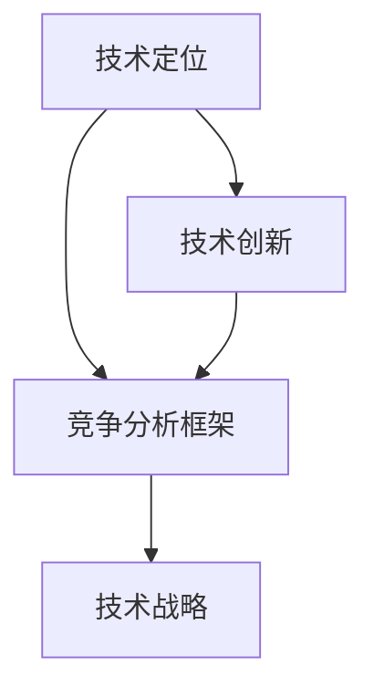

**核心概念之间的关系：**

- 技术定位为企业提供了方向和目标，指导技术竞争的策略制定。
- 竞争分析框架帮助企业在复杂的市场环境中进行评估和决策。
- 技术创新是技术战略的核心，通过创新来保持和增强企业的竞争优势。

#### 1.3 技术趋势和市场动态

随着技术的不断进步，市场环境和竞争态势也在不断变化。以下是一些当前的技术趋势和市场动态，以及它们对行业结构和市场竞争的影响：

1. **人工智能（AI）：**
人工智能技术在多个领域取得了突破性进展，如自然语言处理、计算机视觉和机器学习。AI技术的应用不仅提高了生产效率和产品质量，还改变了企业运营和商业模式。例如，在金融领域，AI被用于风险管理、智能投顾和自动化交易；在医疗领域，AI被用于疾病诊断、药物开发和个性化治疗。AI技术的快速发展正在重塑各个行业的竞争格局。

2. **区块链：**
区块链技术以其去中心化、不可篡改和透明性等特点，引起了广泛关注。区块链技术最初在金融领域得到了广泛应用，如比特币和智能合约。然而，随着技术的发展，区块链的应用场景不断扩展到供应链管理、物联网、医疗健康等多个领域。区块链技术的普及将改变企业之间的信任机制和协作方式，提高市场透明度和效率。

3. **5G通信技术：**
5G通信技术具有高速度、低延迟和大连接等特点，将推动物联网、自动驾驶、智能制造等新兴技术的发展。5G技术的普及将提高数据传输速度，降低网络延迟，为实时通信和实时数据处理提供基础设施支持。这将进一步推动技术创新和应用，加速行业变革。

4. **云计算：**
云计算技术提供了弹性、可扩展和高效的基础设施服务，为企业提供了灵活的IT解决方案。云计算的普及使得企业可以专注于核心业务，而将基础设施管理外包给专业服务提供商。云计算技术不仅降低了企业的运营成本，还提高了IT资源利用率和业务响应速度，增强了企业的竞争力。

**市场动态：**

- **技术扩散：** 技术扩散速度加快，新技术迅速普及和应用。企业需要密切关注技术趋势，及时调整战略以应对市场变化。
- **跨界竞争：** 跨界竞争日益激烈，不同行业之间的技术融合和业务模式创新层出不穷。企业需要具备跨界思维，探索新的商业机会。
- **竞争格局：** 市场竞争格局不断重塑，传统行业受到新兴技术的冲击，市场份额和竞争态势发生变化。企业需要密切关注市场动态，抢占市场先机。

**对行业结构的影响：**

- **产业整合：** 技术进步推动产业整合，产业链上下游企业之间的合作更加紧密，形成了新的产业生态。企业需要通过合作和联盟来提高竞争力。
- **市场准入门槛：** 技术进步降低了市场准入门槛，新兴企业和初创公司可以更容易地进入市场。这要求企业不断创新，提高技术水平和产品质量。
- **产业链重构：** 技术进步引发产业链重构，企业需要重新评估自身的定位和业务模式。通过产业链重构，企业可以优化资源配置，提高运营效率。

综上所述，技术竞争环境在不断变化，企业需要密切关注技术趋势和市场动态，制定灵活有效的战略，以应对激烈的技术竞争。

#### 1.1 介绍技术竞争

**背景介绍：**

技术竞争在当今世界已经成为企业生存和发展的关键因素。随着全球化进程的加速和信息技术的发展，市场竞争愈发激烈，企业需要通过技术创新来保持竞争优势。技术竞争不仅仅发生在同行业内，还跨越多个行业，形成全球范围内的竞争格局。

技术竞争的背景可以追溯到工业革命时期。当时，机械化和自动化技术的应用使得生产效率大幅提高，企业之间开始展开技术竞争。随着信息技术的发展，计算机和互联网技术的普及使得信息获取和处理变得更加便捷，技术竞争的形式和内容也发生了巨大变化。现代技术竞争不仅包括硬件和软件的研发，还包括商业模式创新、生态系统建设和产业链整合等多个层面。

**核心概念与联系：**

在技术竞争中，理解以下几个核心概念及其相互关系至关重要：

1. **技术创新：** 技术创新是企业获取竞争优势的关键途径。技术创新包括基础研究、应用研究和产业化三个阶段，通过不断地技术突破和产品创新来提高企业的市场竞争力。

2. **竞争战略：** 竞争战略是企业应对市场竞争的总体规划和策略。竞争战略包括市场定位、产品策略、价格策略、渠道策略和品牌策略等，旨在确保企业在市场竞争中取得优势。

3. **技术领先：** 技术领先是企业保持竞争优势的重要手段。技术领先意味着企业在某一技术领域具有较高的技术水平和市场占有率，能够率先推出具有竞争力的产品和服务。

4. **市场竞争：** 市场竞争是企业之间为争夺市场份额而展开的竞争活动。市场竞争不仅体现在价格、质量和服务等方面，还涉及技术标准、知识产权和客户忠诚度等多个层面。

以下是一个简化的技术竞争概念之间的关系架构，使用Mermaid语言绘制：

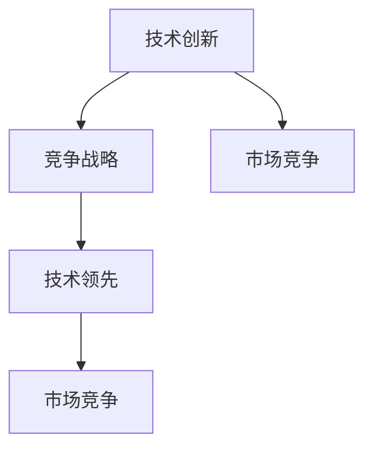

**核心概念之间的关系：**

- 技术创新是技术竞争的核心驱动力，推动企业不断进步和成长。
- 竞争战略是企业在技术竞争中制定和实施的策略，旨在通过技术创新来获得竞争优势。
- 技术领先是企业实现市场竞争优势的重要手段，通过技术领先来巩固市场份额和品牌地位。
- 市场竞争是技术竞争的最终体现，企业通过技术创新和竞争战略在市场竞争中取得优势。

**核心算法原理讲解：**

为了在技术竞争中取得优势，企业需要运用一系列核心算法和原理，以下是其中的几个关键方面：

1. **需求分析算法：** 需求分析是技术创新的基础。企业需要运用数据分析、市场调研和用户反馈等方法，准确识别市场需求和用户痛点，从而指导技术创新。

2. **成本效益分析算法：** 成本效益分析是企业制定竞争战略的重要依据。企业需要通过成本效益分析来评估不同技术方案的经济效益，选择最优方案以降低成本、提高竞争力。

3. **机器学习算法：** 机器学习算法在技术创新和竞争战略中发挥着重要作用。企业可以通过机器学习算法来分析大量数据，发现潜在的市场机会和竞争威胁，制定更有针对性的战略。

4. **供应链管理算法：** 供应链管理是企业保持市场竞争优势的关键环节。企业需要运用供应链管理算法来优化供应链流程，提高生产效率和响应速度。

以下是一个简化的成本效益分析算法的伪代码：

```python
def cost_benefit_analysis(investment, revenue, cost):
    net_profit = revenue - cost - investment
    if net_profit > 0:
        return "Profitable"
    else:
        return "Not Profitable"
```

**数学模型和公式：**

在技术竞争中，企业常常需要运用数学模型和公式来指导决策。以下是一个简化的技术竞争力评估模型：

1. **技术竞争力指数（TCI）模型：**
   TCI = （技术创新能力 × 知识产权密度）/（运营成本 × 市场份额）

   其中，技术创新能力、知识产权密度、运营成本和市场份额均为定量指标，通过数据分析和评分来确定。

2. **SWOT分析模型：**
   SWOT分析包括优势（Strengths）、劣势（Weaknesses）、机会（Opportunities）和威胁（Threats）四个方面，用于综合评估企业的竞争地位。

**举例说明：**

假设一家企业计划投资500万元研发一款新产品，预计销售收入为800万元，运营成本为300万元。通过成本效益分析算法，我们可以计算其净收益：

```python
investment = 5000000
revenue = 8000000
cost = 3000000
net_profit = revenue - cost - investment
print(cost_benefit_analysis(investment, revenue, cost))
```

输出结果为“Profitable”，表明该投资方案是盈利的。

综上所述，技术竞争涉及多个核心概念和算法原理，通过深入理解这些概念和原理，企业可以更好地制定竞争战略，提升技术竞争力，在激烈的市场竞争中立于不败之地。

#### 1.2 核心概念和原则

在理解了技术竞争的基本背景之后，我们接下来深入探讨技术竞争中的核心概念和原则。这些概念和原则构成了企业制定技术战略和应对竞争的重要基础。

**定义和分类：**

1. **技术竞争的定义：**
   技术竞争是指企业、机构或国家通过研发、应用和扩散新技术，以争夺市场份额、技术领导地位和战略优势的过程。技术竞争的核心在于技术创新和应用，其目标是实现技术领先和市场优势。

2. **技术竞争的分类：**
   技术竞争可以分为内部竞争和外部竞争。内部竞争主要发生在同一行业内的企业之间，企业通过技术创新、成本控制和市场营销等手段争夺市场份额。外部竞争则涉及跨行业、跨国家的技术竞争，企业需要应对来自不同领域的挑战。

**竞争分析框架：**

1. **五力模型：**
   由迈克尔·波特提出的五力模型是分析市场竞争状况的经典工具。五力包括行业内的竞争者、潜在进入者、替代品、供应商和买家。通过分析这些力量的相互作用，企业可以确定自己在行业中的竞争地位，制定相应的竞争策略。

2. **SWOT分析：**
   SWOT分析是一种用于评估企业内部和外部环境的工具。SWOT分析包括优势（Strengths）、劣势（Weaknesses）、机会（Opportunities）和威胁（Threats）。通过SWOT分析，企业可以全面了解自身的优劣势，发现市场机会和威胁，从而制定有效的技术战略。

3. **PEST分析：**
   PEST分析是一种用于分析外部环境的工具，包括政治（Political）、经济（Economic）、社会（Social）和技术（Technological）因素。通过PEST分析，企业可以了解外部环境的变化趋势，预测市场机会和风险，调整技术战略以应对环境变化。

**战略响应：**

1. **技术领先战略：**
   技术领先战略是企业通过持续技术创新，保持技术领先地位和市场竞争优势的策略。实施技术领先战略的企业需要具备强大的研发能力和创新能力，不断推出具有颠覆性的技术和产品。

2. **跟随战略：**
   跟随战略是企业通过模仿和改进领先企业的技术和产品，以获取市场份额的策略。实施跟随战略的企业需要密切关注市场趋势和竞争对手的动作，快速响应市场需求，提升产品竞争力。

3. **差异化战略：**
   差异化战略是企业通过提供独特的产品和服务，满足特定客户需求，以获取市场份额和品牌忠诚度的策略。差异化战略要求企业具有强大的研发能力和品牌管理能力，能够在产品特性、服务质量和客户体验等方面实现差异化。

4. **成本领先战略：**
   成本领先战略是企业通过降低生产成本，提供价格竞争优势的策略。实施成本领先战略的企业需要具备规模效应、供应链管理和运营效率等方面的优势，以实现低成本、高收益。

**Mermaid流程图：**

以下是一个简化的技术竞争分析框架的Mermaid流程图，展示了核心概念之间的关系：

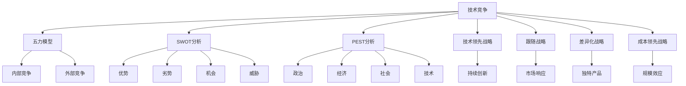

**核心概念之间的关系：**

- 技术竞争是企业通过技术创新和应用争夺市场份额的过程。
- 五力模型、SWOT分析和PEST分析是分析市场竞争状况的重要工具，帮助企业了解自身优劣势和外部环境。
- 技术领先、跟随、差异化和成本领先是不同的战略响应，企业根据自身情况和市场环境选择合适的战略。

**核心算法原理讲解：**

1. **五力模型算法：**
   通过计算行业内竞争者、潜在进入者、替代品、供应商和买家的力量，评估市场竞争强度。以下是一个简化的五力模型算法伪代码：

```python
def five_force_analysis(competitors, new_entries, substitutes, suppliers, buyers):
    market_strength = (competitors + new_entries + substitutes + suppliers + buyers) / 5
    return market_strength
```

2. **SWOT分析算法：**
   通过分析企业的优势、劣势、机会和威胁，制定相应的战略。以下是一个简化的SWOT分析算法伪代码：

```python
def swot_analysis(strengths, weaknesses, opportunities, threats):
    strategy = {
        'strengths': strengths,
        'weaknesses': weaknesses,
        'opportunities': opportunities,
        'threats': threats
    }
    return strategy
```

3. **PEST分析算法：**
   通过分析政治、经济、社会和技术因素，预测市场机会和风险。以下是一个简化的PEST分析算法伪代码：

```python
def pest_analysis(political, economic, social, technological):
    environment = {
        'political': political,
        'economic': economic,
        'social': social,
        'technological': technological
    }
    return environment
```

**数学模型和公式：**

1. **技术竞争力指数（TCI）模型：**
   TCI = （技术创新能力 × 知识产权密度）/（运营成本 × 市场份额）

   其中，技术创新能力、知识产权密度、运营成本和市场份额均为定量指标，通过数据分析和评分来确定。

2. **成本领先优势模型：**
   成本领先优势 = （目标市场份额 × （市场价格 - 成本价格））/ 成本价格

   其中，目标市场份额、市场价格和成本价格均为定量指标，通过市场调研和财务分析来确定。

**举例说明：**

假设一家企业通过五力模型分析得出以下数据：
- 竞争者：5家
- 潜在进入者：3家
- 替代品：2种
- 供应商：5家
- 买家：10家

通过五力模型算法，我们可以计算市场竞争强度：

```python
market_strength = five_force_analysis(5, 3, 2, 5, 10)
print(market_strength)
```

输出结果为3，表示市场竞争较为激烈。

再假设该企业在SWOT分析中得出以下结论：
- 优势：技术创新、品牌影响力
- 劣势：运营成本高、市场份额低
- 机会：市场扩张、技术突破
- 威胁：新竞争者、替代品

通过SWOT分析算法，我们可以制定相应的战略：

```python
strategy = swot_analysis(['技术创新', '品牌影响力'], ['运营成本高', '市场份额低'], ['市场扩张', '技术突破'], ['新竞争者', '替代品'])
print(strategy)
```

输出结果为包含优势、劣势、机会和威胁的战略。

综上所述，通过深入理解技术竞争的核心概念和原则，企业可以更有效地分析市场状况，制定合适的竞争策略，提升技术竞争力，在激烈的市场竞争中取得优势。

### 1.3 技术趋势和市场动态

当前，技术领域的快速发展带来了前所未有的机遇和挑战。以下是一些主要的技术趋势和市场动态，这些趋势不仅改变了企业的运营方式，也对市场竞争格局产生了深远影响。

**人工智能（AI）：**

人工智能技术正在迅速发展，成为推动技术创新和业务模式变革的重要力量。AI技术在自然语言处理、计算机视觉、机器学习等领域取得了显著进展，其应用范围广泛，从金融、医疗、零售到制造业等多个行业都受到了深远影响。例如，在金融行业，AI被用于风险评估、自动化交易和智能客服；在医疗领域，AI被用于疾病诊断、药物开发和个性化治疗；在零售行业，AI被用于推荐系统、库存管理和客户服务。人工智能的发展不仅提高了生产效率和产品质量，还改变了企业运营和商业模式。

**区块链：**

区块链技术以其去中心化、透明性和不可篡改性等特点，引起了广泛关注。最初在金融领域被用于比特币等数字货币，但如今区块链技术的应用已扩展到供应链管理、物联网、医疗健康和政府服务等多个领域。区块链技术提供了一种新的信任机制，使得企业之间可以更加高效地协作，降低交易成本和风险。例如，在供应链管理中，区块链技术被用于追踪商品的真实性和来源，提高供应链的透明度和效率；在物联网中，区块链技术被用于数据共享和安全保障，实现设备间的智能协作。

**5G通信技术：**

第五代移动通信技术（5G）具有高速度、低延迟和大连接等特点，将推动物联网、自动驾驶、智能制造等新兴技术的发展。5G技术的普及将提高数据传输速度，降低网络延迟，为实时通信和实时数据处理提供基础设施支持。这将进一步推动技术创新和应用，加速行业变革。例如，在自动驾驶领域，5G技术可以提供稳定、高速的通信链路，确保车辆之间的实时数据传输和安全通信；在智能制造领域，5G技术可以支持工业设备的远程监控和智能调度，提高生产效率和产品质量。

**云计算：**

云计算技术为企业和个人提供了灵活、可扩展的计算资源和服务，降低了IT基础设施的建设和维护成本。随着云计算技术的成熟，越来越多的企业开始将其应用于业务运营和软件开发。云计算不仅提供了弹性计算和存储服务，还支持大数据分析和人工智能应用。例如，在金融领域，云计算技术被用于大数据分析和风险控制；在医疗领域，云计算技术被用于远程医疗和医疗数据管理。

**市场动态：**

- **技术扩散：** 技术扩散速度加快，新技术迅速普及和应用。企业需要密切关注技术趋势，及时调整战略以应对市场变化。
- **跨界竞争：** 跨界竞争日益激烈，不同行业之间的技术融合和业务模式创新层出不穷。企业需要具备跨界思维，探索新的商业机会。
- **竞争格局：** 市场竞争格局不断重塑，传统行业受到新兴技术的冲击，市场份额和竞争态势发生变化。企业需要密切关注市场动态，抢占市场先机。

**对行业结构的影响：**

- **产业整合：** 技术进步推动产业整合，产业链上下游企业之间的合作更加紧密，形成了新的产业生态。企业需要通过合作和联盟来提高竞争力。
- **市场准入门槛：** 技术进步降低了市场准入门槛，新兴企业和初创公司可以更容易地进入市场。这要求企业不断创新，提高技术水平和产品质量。
- **产业链重构：** 技术进步引发产业链重构，企业需要重新评估自身的定位和业务模式。通过产业链重构，企业可以优化资源配置，提高运营效率。

综上所述，技术趋势和市场动态正在深刻改变着企业的运营方式和市场格局。企业需要密切关注技术趋势，积极应对市场变化，通过技术创新和战略调整，保持竞争优势，实现可持续发展。

### Part 2: 分析竞争技术

在了解了技术竞争的基本概念和原则之后，我们需要深入探讨如何分析竞争技术。这包括识别行业核心技术、进行技术侦察和竞争分析，以及制定有效的竞争策略。

#### 2.1 行业核心技术

**识别行业核心技术**

行业核心技术是指那些对行业发展具有重大影响的关键技术。这些技术不仅能够提高生产效率和产品质量，还能创造新的商业模式和市场机会。识别行业核心技术是制定竞争战略的重要基础。

1. **市场调研：** 通过对市场进行调研，了解当前的技术趋势和需求，分析哪些技术正在被广泛采用，以及哪些技术具有潜在的市场前景。

2. **专家访谈：** 与行业内的专家、学者和从业者进行访谈，获取他们对行业核心技术的看法和建议。这些信息可以帮助我们更准确地识别和评估核心技术。

3. **专利分析：** 通过专利数据库，分析行业内热门技术的专利分布和数量，了解哪些技术被广泛研究和发展。专利分析可以提供有价值的技术情报，帮助企业识别行业核心技术。

**评估核心技术**

在识别出行业核心技术后，我们需要对这些技术进行评估，以确定其对企业的重要性和潜在影响。

1. **技术成熟度：** 评估技术的成熟度，包括研发阶段、应用规模和市场接受度。成熟度较高的技术通常更容易被市场接受，也更具商业价值。

2. **市场潜力：** 分析技术的市场潜力，包括市场规模、增长速度和市场份额。市场潜力较大的技术能够带来更高的回报。

3. **成本效益：** 评估技术的成本效益，包括研发成本、生产成本和运营成本。成本效益较高的技术能够在市场竞争中占据优势。

**Mermaid流程图：**

以下是一个简化的行业核心技术识别和评估的Mermaid流程图：

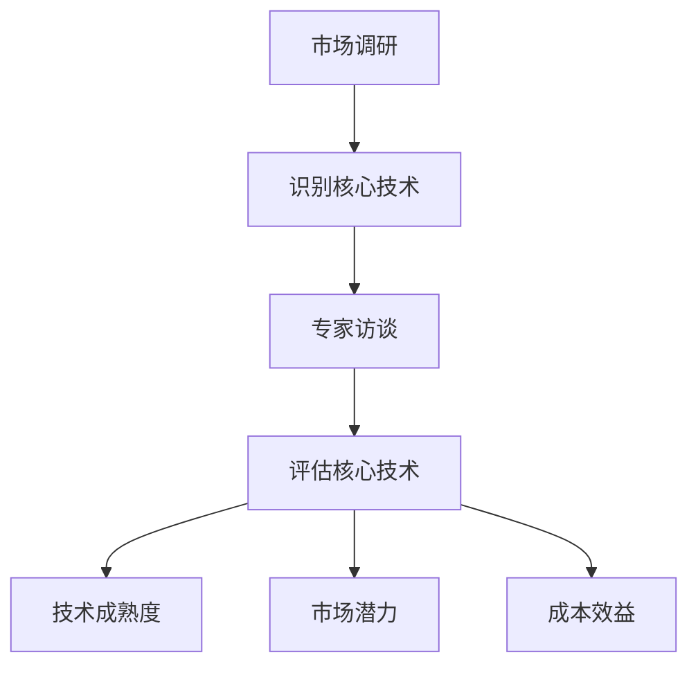

**核心技术的角色**

行业核心技术对企业具有以下几个方面的作用：

1. **竞争优势：** 核心技术是企业获取竞争优势的关键，通过技术领先和市场差异化，企业可以在市场竞争中脱颖而出。

2. **商业模式创新：** 核心技术能够推动商业模式创新，企业可以通过技术手段重新定义产品和服务，创造新的商业机会。

3. **产业链整合：** 核心技术可以促进产业链上下游企业的整合，提高整个产业链的协同效应和运营效率。

#### 2.2 竞争分析和技术侦察

**竞争分析**

竞争分析是了解竞争对手、市场和行业动态的重要手段。通过竞争分析，企业可以制定出有针对性的竞争策略。

1. **竞争对手分析：** 分析竞争对手的技术实力、市场地位、业务模式和战略方向。了解竞争对手的优势和劣势，有助于企业找到自身的竞争优势和差距。

2. **市场分析：** 分析市场需求、市场结构和市场趋势。了解市场的需求变化和竞争态势，可以帮助企业制定合适的市场策略。

3. **行业分析：** 分析行业的发展趋势、行业结构和技术标准。了解行业的发展趋势和技术标准，有助于企业把握行业机会和风险。

**技术侦察**

技术侦察是指通过各种手段收集和分析竞争对手的技术情报，以了解其技术实力和发展方向。技术侦察是企业进行技术竞争的重要保障。

1. **专利监测：** 通过专利数据库监测竞争对手的专利申请和授权情况，了解其技术研究方向和研发投入。

2. **技术跟踪：** 跟踪行业内热门技术的进展和应用情况，了解竞争对手的技术动向。

3. **人才情报：** 收集竞争对手的人才流动信息，了解其技术团队的变化和人才引进策略。

**Mermaid流程图：**

以下是一个简化的竞争分析和技术侦察的Mermaid流程图：

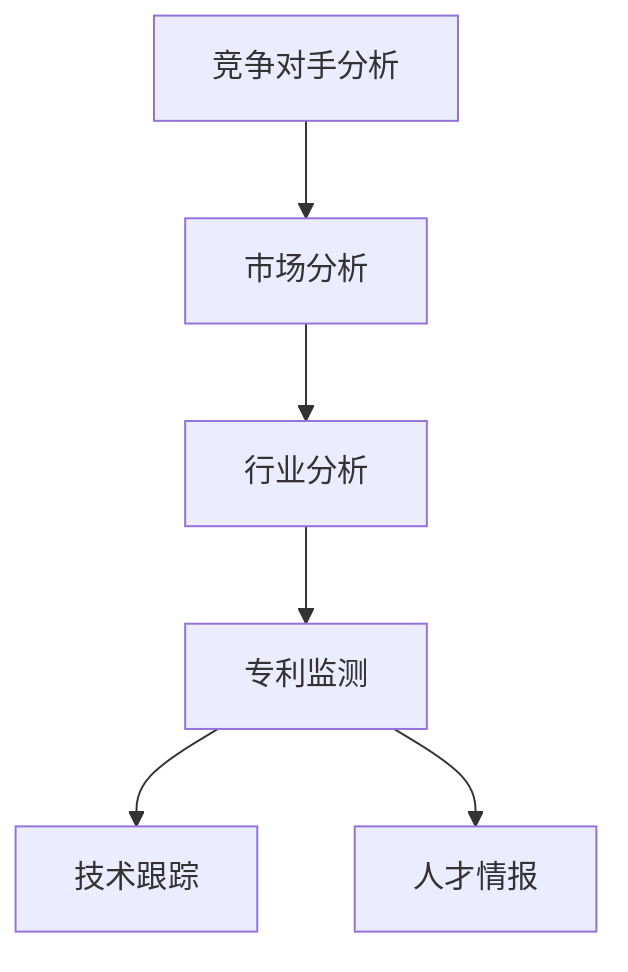

**竞争策略**

基于竞争分析和技术侦察的结果，企业需要制定有效的竞争策略。

1. **跟随策略：** 通过模仿竞争对手的技术，快速响应市场需求，提升产品竞争力。

2. **差异化策略：** 通过技术创新和独特的产品特性，满足特定客户需求，实现市场差异化。

3. **技术领先策略：** 通过持续的技术创新，保持技术领先地位和市场优势。

4. **合作策略：** 与竞争对手或其他企业合作，共同研发和应用新技术，提高整体竞争力。

**最佳实践**

1. **建立技术情报系统：** 通过建立技术情报系统，实时收集和分析竞争对手的技术情报，为企业提供决策支持。

2. **建立技术跟踪机制：** 定期对行业内热门技术进行跟踪，了解技术趋势和发展动态。

3. **加强技术创新能力：** 通过增加研发投入和引进高端人才，提高企业的技术创新能力。

综上所述，通过深入分析竞争技术和进行有效的技术侦察，企业可以更好地了解市场和技术环境，制定出有针对性的竞争策略，提高技术竞争力，在激烈的市场竞争中立于不败之地。

### 2.3 Case Studies of Technological Competition

为了更好地理解技术竞争的实际应用和影响，以下我们将通过三个具体案例，探讨技术竞争中的成功故事和失败教训，并总结跨行业的技术竞争经验。

#### Case Study 1: Apple's Success in Smartphone Market

**背景介绍：**

苹果公司（Apple Inc.）作为全球知名的技术巨头，其成功在很大程度上得益于在智能手机市场的技术竞争。自iPhone问世以来，苹果公司通过不断创新，在智能手机市场中取得了显著的竞争优势。

**核心技术：**

苹果公司在智能手机市场中推出的核心技术包括：

1. **操作系统iOS：** iOS作为苹果公司的核心操作系统，具有优秀的用户体验和强大的生态系统。iOS通过持续更新和优化，保持了技术领先地位。
2. **硬件设计：** 苹果公司在硬件设计方面具有独特的优势，其产品如iPhone、iPad和MacBook等，凭借高品质和精致的设计赢得了消费者的青睐。
3. **生态系统：** 苹果公司建立了完整的生态系统，包括App Store、iCloud和Apple Pay等，为用户提供了无缝衔接的体验。

**竞争策略：**

1. **技术领先策略：** 苹果公司通过持续的技术创新，不断推出具有颠覆性的产品，保持技术领先地位。
2. **差异化策略：** 苹果公司通过独特的硬件设计和生态系统，实现了产品差异化，满足了消费者多样化的需求。
3. **品牌建设：** 苹果公司通过强大的品牌建设，树立了高端、创新和高品质的品牌形象。

**成功经验：**

1. **持续创新：** 苹果公司通过持续的技术创新，不断引领智能手机市场的发展趋势。
2. **生态系统优势：** 苹果公司的生态系统提供了无缝衔接的用户体验，增强了用户粘性。
3. **品牌价值：** 苹果公司的品牌价值使其在市场竞争中具备强大的竞争优势。

**失败教训：**

尽管苹果公司在智能手机市场取得了巨大成功，但其也存在一些教训：

1. **过度依赖iOS：** 过度依赖iOS操作系统可能导致创新能力受限，面临竞争对手的挑战。
2. **价格策略：** 苹果公司的产品定价较高，可能导致部分消费者流失，特别是在新兴市场。

#### Case Study 2: Microsoft's Strategic Missteps

**背景介绍：**

微软公司（Microsoft Corporation）在个人电脑操作系统市场中曾占据主导地位，但随着智能手机和平板电脑的兴起，微软在技术竞争中出现了战略性失误，导致其市场份额大幅下降。

**核心技术：**

微软的核心技术包括：

1. **Windows操作系统：** 作为个人电脑操作系统的领导者，Windows在市场上具有广泛的应用。
2. **Office办公软件：** Office作为微软的重要收入来源，在全球范围内具有极高的市场占有率。

**竞争策略：**

1. **垄断策略：** 微软曾通过垄断市场，限制竞争对手的发展。
2. **硬件策略：** 微软在硬件领域缺乏竞争力，其Surface系列设备市场表现不佳。

**失败教训：**

1. **过于保守：** 微软在智能手机和平板电脑市场的发展中过于保守，未能及时调整策略。
2. **硬件短板：** 微软在硬件领域缺乏竞争力，导致其设备在用户体验和市场份额方面落后。
3. **生态系统缺失：** 微软的生态系统建设相对滞后，未能为用户提供无缝衔接的体验。

#### Case Study 3: Cross-industry Comparisons of Technological Competition

**背景介绍：**

在技术竞争中，不同行业的竞争策略和技术应用存在显著差异。以下我们通过两个不同行业的例子，探讨跨行业的技术竞争经验。

**案例一：阿里巴巴和亚马逊的电子商务竞争**

**核心技术：**

1. **阿里巴巴：** 阿里巴巴的核心技术包括淘宝和天猫等电商平台，以及支付宝等支付工具。
2. **亚马逊：** 亚马逊的核心技术包括亚马逊平台和AWS云服务。

**竞争策略：**

1. **阿里巴巴：** 通过大规模电商平台和支付工具，阿里巴巴构建了强大的生态系统，吸引了大量用户和商家。
2. **亚马逊：** 通过AWS云服务和亚马逊平台，亚马逊在云计算和电子商务市场中占据领先地位。

**成功经验：**

1. **生态系统建设：** 无论是阿里巴巴还是亚马逊，都通过生态系统建设，为用户提供了无缝衔接的购物体验。
2. **技术创新：** 两个公司都通过技术创新，提高了运营效率和用户体验。

**失败教训：**

1. **用户体验：** 两个公司都需要关注用户体验，特别是在移动互联网时代，用户体验对市场份额的影响日益重要。
2. **市场拓展：** 两个公司都需要进一步拓展国际市场，以应对来自全球竞争对手的挑战。

**案例二：特斯拉和传统汽车行业的竞争**

**核心技术：**

1. **特斯拉：** 特斯拉的核心技术包括电动汽车电池、自动驾驶系统和智能充电网络。
2. **传统汽车行业：** 传统汽车公司的核心技术包括内燃机技术、车身设计和供应链管理。

**竞争策略：**

1. **特斯拉：** 通过技术创新和品牌塑造，特斯拉在电动汽车市场中建立了强大的品牌影响力和市场地位。
2. **传统汽车行业：** 通过技术升级和产业链整合，传统汽车公司试图保持市场竞争优势。

**成功经验：**

1. **技术创新：** 特斯拉通过持续的技术创新，推动了电动汽车技术的发展。
2. **市场定位：** 特斯拉通过明确的品牌定位，吸引了大量高端用户。

**失败教训：**

1. **技术风险：** 特斯拉需要关注技术风险，特别是在自动驾驶和电池技术方面。
2. **产业链整合：** 传统汽车公司需要进一步加强产业链整合，提高生产效率和产品质量。

通过这些跨行业的比较，我们可以看到技术竞争的复杂性和多样性。不同行业的技术竞争策略和成功经验有所不同，但共同点在于技术创新和生态系统建设的重要性。同时，我们也需要认识到技术风险和市场拓展的重要性，以在激烈的技术竞争中立于不败之地。

### 3.1 Building a Technological Edge

在激烈的技术竞争中，建立技术优势是企业保持长期竞争优势的关键。技术优势不仅能够帮助企业占领市场份额，还能够为企业提供可持续的发展动力。以下是几个关键步骤和策略，帮助企业建立和维持技术优势。

#### 3.1.1 Identifying Key Technological Priorities

**1. 确定技术发展方向：**
企业需要根据市场趋势和自身战略目标，确定技术发展方向。这包括以下几个方面：

- **市场需求：** 分析市场需求，了解消费者和技术用户对新技术和产品的期望。
- **竞争环境：** 考虑竞争对手的技术优势和劣势，确定技术突破点。
- **技术趋势：** 研究技术发展趋势，特别是新兴技术，如人工智能、物联网、区块链等。

**2. 评估技术潜力：**
在确定技术发展方向后，企业需要对技术潜力进行评估。评估标准包括：

- **技术成熟度：** 评估技术的成熟度和可行性，选择具有较高成熟度的技术进行投入。
- **市场潜力：** 分析技术的市场前景，选择市场需求量大、增长速度快的技术。
- **成本效益：** 评估技术的成本效益，选择具有较高投资回报率的技术。

**Mermaid流程图：**

以下是一个简化的技术优先级评估流程的Mermaid流程图：

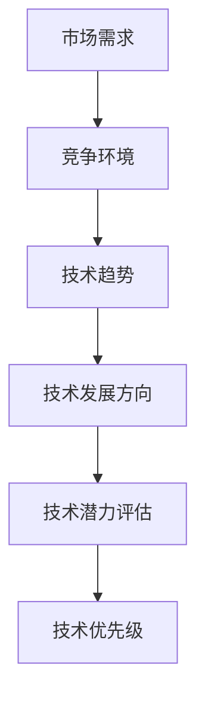

**3. 制定技术优先级：**
基于技术潜力评估的结果，企业需要制定技术优先级。技术优先级应根据市场需求、技术成熟度和市场潜力等因素综合考虑。以下是一个简化的技术优先级制定流程：

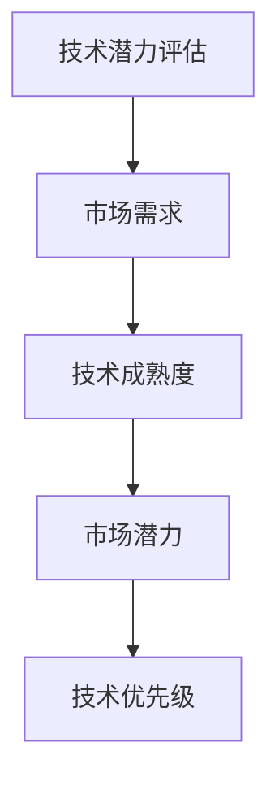

#### 3.1.2 Developing a Technology Roadmap

**1. 技术规划：**
企业需要制定详细的技术规划，明确技术发展的阶段和目标。技术规划应包括以下几个方面：

- **短期目标：** 明确未来1-3年内需要实现的技术目标。
- **中期目标：** 明确未来3-5年内需要实现的技术目标。
- **长期目标：** 明确未来5-10年内需要实现的技术目标。

**2. 资源配置：**
根据技术规划，企业需要合理配置资源，包括资金、人力和技术等。资源配置应优先保障技术优先级高的项目。

**3. 合作与协同：**
企业可以通过与科研机构、高校和企业合作，共同开展技术研发。合作与协同有助于企业获取更多的技术资源和创新能力。

**Mermaid流程图：**

以下是一个简化的技术规划流程的Mermaid流程图：

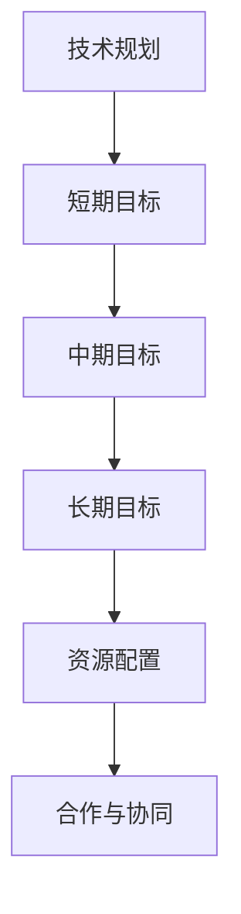

#### 3.1.3 Investing in Research and Development

**1. 研发投入：**
企业需要持续增加研发投入，保持技术领先地位。研发投入应优先支持核心技术项目和技术优先级高的领域。

**2. 创新机制：**
企业应建立创新机制，鼓励员工提出创新性想法和技术解决方案。创新机制可以包括：

- **研发项目评审：** 定期对研发项目进行评审，确保项目方向和资源的正确性。
- **创新奖励制度：** 奖励在技术创新方面表现突出的员工，激发创新活力。
- **知识共享平台：** 建立知识共享平台，促进内部知识交流和经验分享。

**3. 人才培养：**
企业需要重视人才培养，引进和培养高水平的技术人才。通过培训、交流和合作，提高员工的技能和创新能力。

**Mermaid流程图：**

以下是一个简化的研发投入和创新机制流程的Mermaid流程图：

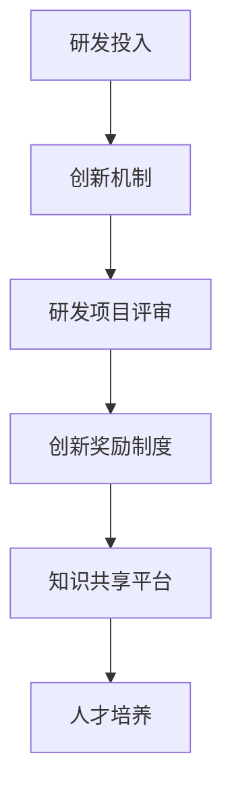

#### 3.1.4 Leveraging Ecosystem Partnerships

**1. 产业链整合：**
企业可以通过与上下游企业建立合作关系，实现产业链的整合和协同。产业链整合有助于企业优化资源配置，提高生产效率。

**2. 开放合作：**
企业可以积极参与开放合作，与外部企业和机构共同开展技术研发和产品创新。开放合作有助于企业获取更多的技术资源和市场机会。

**3. 生态系统建设：**
企业需要建立自身的生态系统，通过平台化、生态化运营，为合作伙伴和用户提供全面的支持和服务。生态系统建设有助于企业提升市场竞争力。

**Mermaid流程图：**

以下是一个简化的产业链整合和生态系统建设流程的Mermaid流程图：

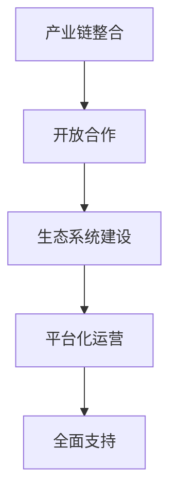

通过以上步骤和策略，企业可以逐步建立和维持技术优势，在激烈的技术竞争中立于不败之地。

### 3.2 Developing Innovative Technology Strategies

在技术竞争中，建立技术优势是关键，但仅仅拥有技术优势还不足以保证长期成功。企业还需要制定和实施创新的技术策略，以保持其领先地位和应对不断变化的市场环境。以下是如何制定和实施创新技术策略的详细步骤：

#### 3.2.1 Conducting a Comprehensive Technological Audit

**1. 评估现有技术：**
企业首先需要对现有的技术进行全面的审计，了解其技术储备、技术能力和技术水平。这包括评估现有技术的性能、稳定性、兼容性和安全性等。通过技术审计，企业可以发现技术瓶颈和改进空间。

**2. 分析技术成熟度：**
评估每种技术的成熟度，判断其是否已经进入市场应用阶段，还是处于研发阶段。成熟度较高的技术可以优先考虑商业化，而处于研发阶段的技术则需要持续投入和跟踪。

**3. 识别技术缺口：**
通过对比竞争对手和行业领先者的技术水平，企业可以识别出自身的技术缺口。这些缺口可能包括核心技术、关键技术或新兴技术，企业需要制定相应的策略来填补这些缺口。

**Mermaid流程图：**

以下是一个简化的技术审计流程的Mermaid流程图：

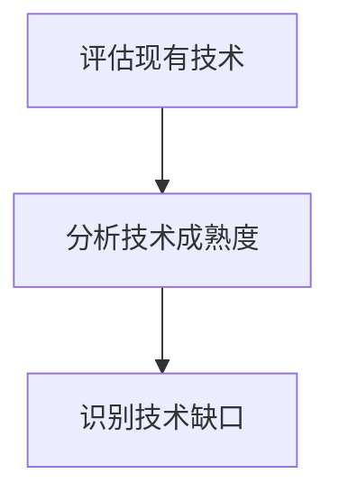

#### 3.2.2 Fostering a Culture of Innovation

**1. 建立创新机制：**
企业需要建立鼓励创新的机制，包括设立创新基金、建立创新实验室和成立创新团队等。这些机制可以激发员工的创新潜力，促进新技术和新产品的开发。

**2. 鼓励内部合作：**
鼓励跨部门和跨团队的内部合作，通过协作和交流，激发新的创意和解决方案。内部合作不仅能够加速技术创新，还能够提高团队的整体创新能力。

**3. 培养创新思维：**
通过培训和教育，提高员工的创新意识和技能。企业可以邀请外部专家进行讲座、工作坊和研讨会，以激发员工的创新思维。

**Mermaid流程图：**

以下是一个简化的创新机制和内部合作流程的Mermaid流程图：

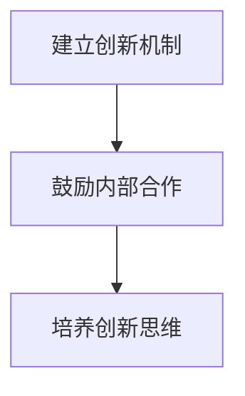

#### 3.2.3 Developing a Strategic Research and Development Plan

**1. 明确研发目标：**
根据企业的发展战略和技术审计的结果，明确研发目标和优先级。研发目标应与企业的长期战略目标一致，确保技术发展方向的正确性。

**2. 制定研发预算：**
根据研发目标和市场情况，制定合理的研发预算。研发预算应优先保障关键技术的研发，同时兼顾新兴技术的探索。

**3. 优化研发流程：**
优化研发流程，提高研发效率。通过引入敏捷开发、迭代开发和持续集成等现代化研发方法，缩短产品从研发到市场的时间。

**Mermaid流程图：**

以下是一个简化的研发目标和研发流程优化流程的Mermaid流程图：

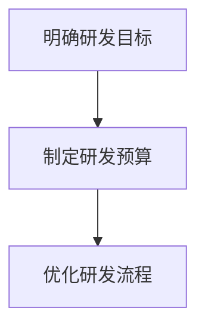

#### 3.2.4 Leveraging External Collaboration and Partnerships

**1. 与科研机构合作：**
与高校和科研机构合作，共同开展前沿技术的研发。这些合作可以带来新的技术思想和研究成果，提高企业的技术储备。

**2. 与产业链上下游企业合作：**
与供应商、客户和分销商合作，共同开发解决方案和产品。通过合作，企业可以更好地理解市场需求，提高产品的市场竞争力。

**3. 参与行业联盟和标准制定：**
参与行业联盟和标准制定，影响技术标准和行业发展方向。通过参与标准制定，企业可以确保其技术符合行业标准，提高市场接受度。

**Mermaid流程图：**

以下是一个简化的外部合作和行业联盟流程的Mermaid流程图：

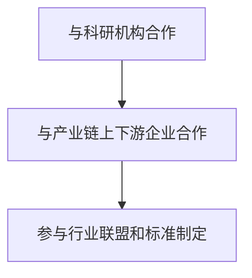

#### 3.2.5 Continuous Monitoring and Adaptation

**1. 监控技术趋势：**
通过持续监测技术趋势和市场变化，企业可以及时了解行业动态，调整技术策略和发展方向。

**2. 收集用户反馈：**
收集用户反馈，了解产品在市场上的表现和用户需求。通过用户反馈，企业可以优化产品，提高用户满意度。

**3. 适应市场变化：**
根据市场变化和技术趋势，及时调整研发方向和产品策略，确保企业始终保持竞争力。

**Mermaid流程图：**

以下是一个简化的技术趋势监控和用户反馈流程的Mermaid流程图：

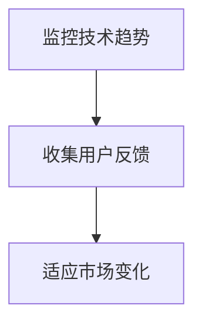

通过以上步骤，企业可以制定和实施创新的技术策略，保持技术领先地位，并在激烈的技术竞争中取得持续成功。

### 3.3 Best Practices, Conclusion, and Notes

#### Best Practices

在激烈的技术竞争中，以下是一些行之有效的最佳实践，帮助企业建立和保持技术优势：

1. **持续投资研发：** 企业应持续增加研发投入，保持技术领先地位。研发投入不仅包括资金，还应包括人力资源和技术资源的投入。

2. **建立创新机制：** 企业应建立创新机制，鼓励员工提出创新性想法和技术解决方案。创新机制可以包括创新基金、创新实验室和创新团队等。

3. **合作与协同：** 企业应与科研机构、高校和产业链上下游企业建立合作关系，共同开展技术研发和产品创新。合作有助于企业获取更多的技术资源和市场机会。

4. **培养创新文化：** 企业应培养员工的创新意识和技能，通过培训和教育，提高员工的创新能力。创新文化有助于企业形成持续创新的动力。

5. **注重用户体验：** 企业应关注用户体验，通过用户反馈不断优化产品和服务。良好的用户体验可以提高用户满意度，增强品牌忠诚度。

#### Conclusion

通过本文的探讨，我们明确了技术竞争在当今世界的核心地位和影响。技术竞争不仅涉及到企业之间的技术创新和产品竞争，还涉及行业和全球范围内的技术较量。企业要成功应对技术竞争，需要：

1. 理解技术竞争的基本概念和原则，建立正确的技术战略。
2. 识别和评估行业核心技术，制定有针对性的技术策略。
3. 持续进行技术创新，保持技术领先地位。
4. 建立和优化技术生态系统，提高整体竞争力。

技术竞争是一场长期且复杂的战役，企业需要不断调整和优化策略，以应对不断变化的市场和技术环境。

#### Notes

1. **技术趋势的动态变化：** 技术趋势和市场环境不断变化，企业需要保持警惕，及时调整技术策略。
2. **跨界竞争的挑战：** 跨界竞争日益激烈，企业需要具备跨界思维，探索新的商业机会和合作模式。
3. **人才培养的重要性：** 高水平的技术人才是企业技术创新的重要保障，企业应重视人才培养和引进。
4. **持续学习和创新：** 在技术竞争中，持续学习和创新是企业保持竞争力的关键，企业应鼓励员工不断学习新技术和新理念。

通过以上最佳实践和注意事项，企业可以更好地应对技术竞争，实现长期可持续发展。

### 拓展阅读

为了更深入地了解技术竞争，读者可以参考以下相关书籍和文献：

1. **《竞争战略》** - 迈克尔·波特（Michael E. Porter）
2. **《创新者的窘境》** - 克莱顿·克里斯滕森（Clayton M. Christensen）
3. **《人工智能：一种现代方法》** - 斯图尔特·罗素（Stuart Russell）和彼得·诺维格（Peter Norvig）
4. **《区块链革命》** -唐·塔普斯科特（Don Tapscott）和亚历克斯·塔普斯科特（Alex Tapscott）
5. **《5G：移动通信的未来》** - 尼尔·塞申斯（Neil Senato）和丹·西蒙斯（Dan Simon）

这些书籍和文献提供了丰富的理论和实践知识，有助于读者更全面地了解技术竞争的策略和趋势。通过阅读这些资源，读者可以进一步拓展技术竞争的理论视野，为实际应用提供指导。

### 作者信息

**作者：AI天才研究院/AI Genius Institute & 禅与计算机程序设计艺术 /Zen And The Art of Computer Programming**

本文由AI天才研究院撰写，AI天才研究院致力于推动人工智能和计算机科学领域的研究与应用。同时，本文结合了《禅与计算机程序设计艺术》的核心思想，探讨了技术竞争环境下的策略与思维。希望本文能为读者提供有价值的见解和实用的指导。如需进一步交流或咨询，请随时联系AI天才研究院。

