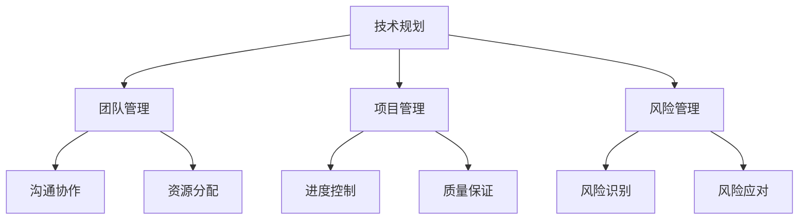
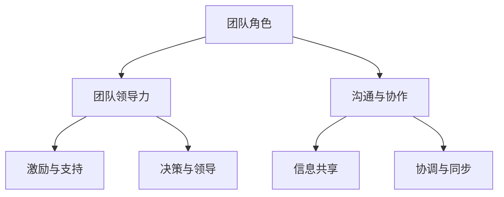
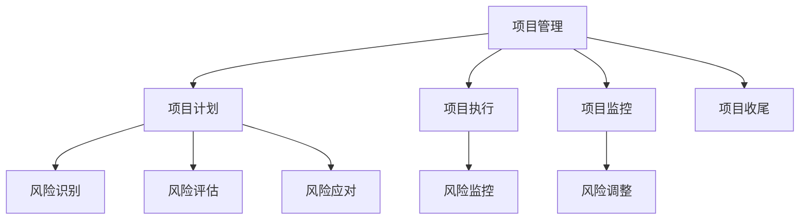
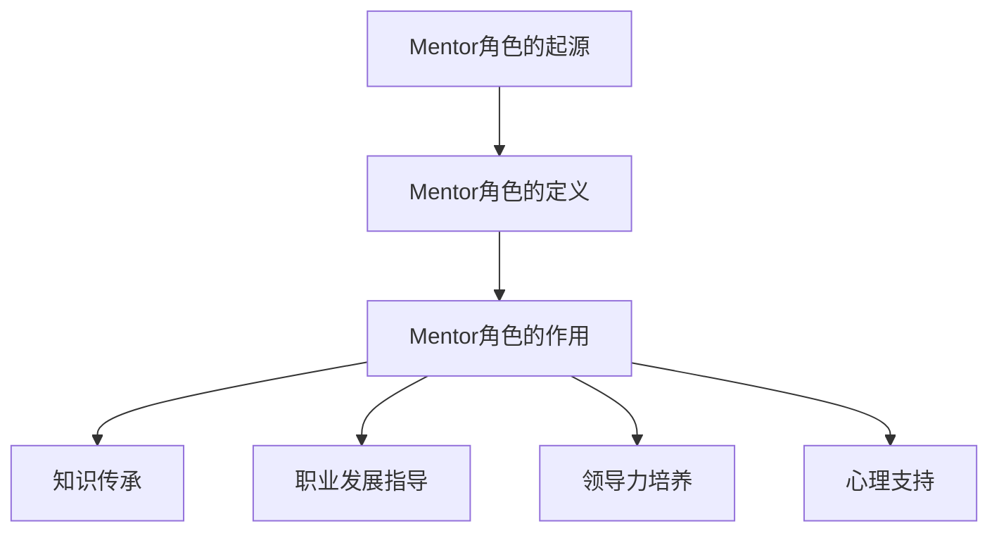
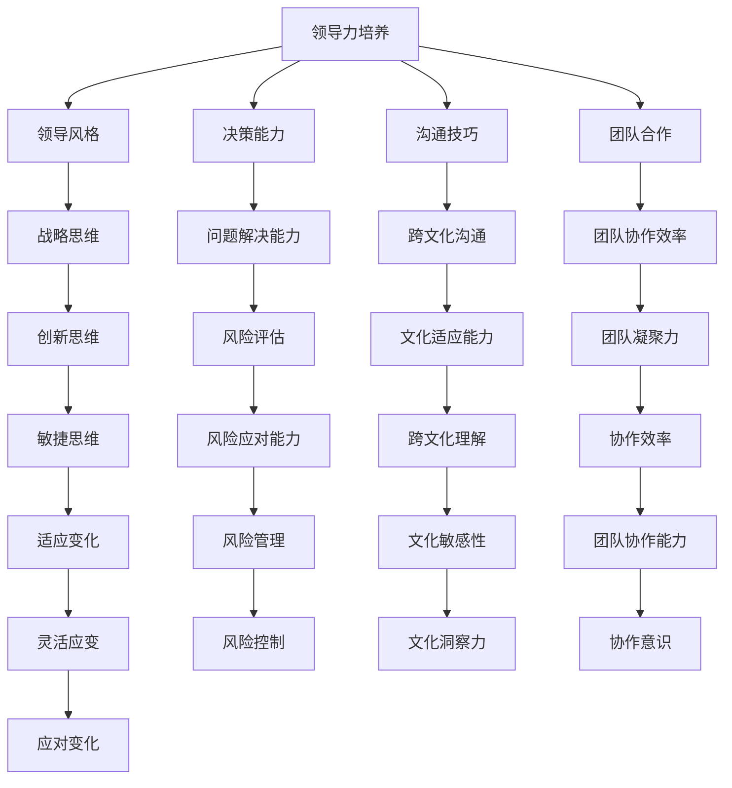
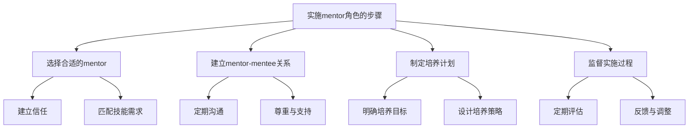
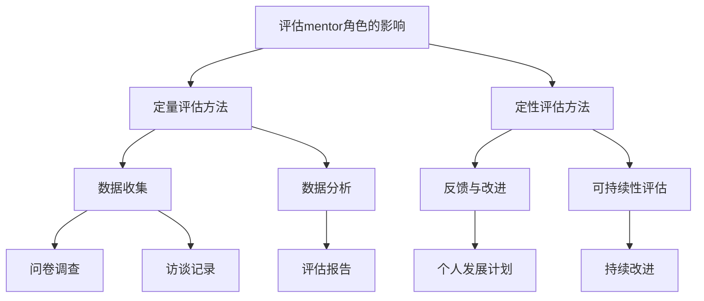

                 

### 文章标题

《技术管理中的mentor角色：培养下一代领导者》

---

**关键词**：技术管理，mentor角色，下一代领导者，团队建设，领导力培养，项目管理

---

**摘要**：

本文将探讨在技术管理中，mentor角色的定义、作用及其对培养下一代领导者的重要性。通过分析技术管理的核心职责，团队建设的关键要素，以及项目与风险管理的实践方法，本文为实施mentor角色提供了一套系统性的策略。同时，通过案例研究，展示成功的技术mentor如何塑造下一代领导者，并通过实施和评估mentor角色，确保其可持续发展。本文旨在为技术管理者提供实用的指导，以培养出具有领导力的下一代技术人才。

---

### 文章正文

#### 第1章：技术管理的定义与重要性

技术管理是现代企业中不可或缺的一部分，它负责确保技术团队高效运作，并在不断变化的市场环境中保持竞争力。技术管理不仅仅是技术本身，还涵盖了团队管理、项目管理、风险管理和决策制定等多个方面。

在技术管理的定义中，我们通常将其描述为“通过规划、组织、领导和控制技术资源，以实现组织目标的过程”。这个过程不仅包括技术方案的制定和实施，还涉及团队协作、资源分配、进度控制和质量保证等关键环节。

技术管理的重要性体现在以下几个方面：

1. **确保技术团队高效运作**：技术管理通过科学的管理方法，提高团队成员的工作效率，减少不必要的浪费，从而保证项目的顺利进行。

2. **提高项目成功率**：有效的技术管理能够确保项目在规定的时间内完成，并在预算范围内达到预期的质量标准。

3. **降低技术风险**：通过识别和管理潜在的技术风险，技术管理能够降低项目失败的可能性，确保企业的技术投资得到最大化回报。

4. **促进技术创新**：技术管理鼓励团队成员进行技术创新，推动技术发展，为企业带来持续的创新动力。

#### 背景介绍

在当今快速变化的技术环境中，技术管理的角色和职责变得更加复杂。随着云计算、大数据、人工智能等新兴技术的崛起，技术管理者需要具备更广泛的知识和技能，以应对各种挑战。

此外，随着全球化的加剧，跨国团队的合作和协调变得更加普遍。技术管理者需要能够跨文化沟通，并协调不同团队成员之间的工作，以实现项目的成功。

#### 核心概念与联系

为了更好地理解技术管理，我们可以使用Mermaid流程图来展示其核心概念之间的联系：



这个流程图展示了技术管理的核心组成部分及其相互之间的关系。通过这些概念的联系，技术管理者可以更好地协调和管理团队，确保项目的顺利进行。

#### 核心算法原理讲解

技术管理中的一些核心算法原理包括项目管理中的关键路径算法、资源分配算法以及风险管理中的决策树算法等。以下是关键路径算法的伪代码：

```python
def critical_path(activities):
    # 初始化关键路径长度为0
    critical_path_length = 0
    
    # 计算每个活动的最早开始时间
    for activity in activities:
        activity.earliest_start = max([ predecessors.earliest_finish for predecessors in activity.predecessors ])
        critical_path_length += activity.earliest_start
    
    # 计算每个活动的最迟开始时间
    for activity in reversed(activities):
        activity.latest_start = min([ successors.latest_finish for successors in activity.successors ])
    
    # 找到关键路径
    critical_path_activities = [ activity for activity in activities if activity.earliest_start == activity.latest_start ]
    
    return critical_path_activities
```

这个伪代码展示了如何通过计算每个活动的最早开始时间和最迟开始时间，来确定关键路径。关键路径上的活动是项目中的关键节点，必须准时完成，以确保整个项目的按时完成。

#### 数学模型和公式详解

在技术管理中，常用的数学模型包括线性规划模型和决策树模型。以下是线性规划模型的基本公式：

$$
\text{Minimize} \quad c^T x
$$

$$
\text{Subject to} \quad Ax \leq b
$$

其中，\(c\) 是目标函数的系数向量，\(x\) 是决策变量向量，\(A\) 是约束矩阵，\(b\) 是约束向量。这个模型用于优化资源分配，以最小化成本或最大化收益。

#### 实战案例

假设我们有一个软件开发项目，需要在规定时间内完成。项目包括三个活动：需求分析、设计开发和测试。以下是项目的详细实现：

1. **需求分析**：活动时间：2天，资源需求：2人
2. **设计开发**：活动时间：5天，资源需求：5人
3. **测试**：活动时间：3天，资源需求：3人

为了确保项目按时完成，我们可以使用关键路径算法来找出关键路径，并确保关键路径上的活动按时完成。

通过计算，我们得到以下结果：

- 最早开始时间：需求分析（2天），设计开发（4天），测试（6天）
- 最迟开始时间：需求分析（4天），设计开发（6天），测试（8天）

关键路径为：需求分析 → 设计开发 → 测试，总时间为9天。

#### 项目小结

通过这个实战案例，我们展示了如何使用关键路径算法来管理项目进度。关键路径算法帮助我们识别项目中的关键活动，并确保这些活动按时完成，从而保证整个项目的成功。

#### 最佳实践 Tips

1. **定期评估项目进度**：定期评估项目进度，及时发现和解决问题，以确保项目按时完成。
2. **合理分配资源**：根据项目的需求和团队成员的能力，合理分配资源，以提高项目效率。
3. **培养团队协作精神**：通过团队建设活动，培养团队协作精神，提高团队凝聚力。

---

#### 注意事项

1. **风险管理**：在项目实施过程中，必须重视风险管理，识别潜在风险并制定应对策略。
2. **持续学习**：技术管理是一个不断发展的领域，技术管理者需要不断学习和更新知识，以适应新的技术趋势。

#### 拓展阅读

- 《敏捷项目管理：实践指南》
- 《项目管理知识体系指南（PMBOK指南）》
- 《决策分析：应用决策树技术》

---

### 第2章：团队建设

团队建设是技术管理中的重要一环，它关乎团队的整体绩效和成员的满意度。一个高效的团队不仅能够提高项目的成功率，还能培养团队成员的技能和职业发展。

#### 核心概念

1. **团队角色**：团队角色包括领导者、执行者、协调者和监督者等。每个角色都有其特定的职责和任务。
2. **团队领导力**：团队领导力是影响团队绩效的关键因素，它涉及激励、沟通、决策和团队建设等方面。
3. **团队沟通与协作**：有效的沟通和协作能够确保团队成员之间的信息传递顺畅，提高工作效率。

#### 背景介绍

在现代企业中，团队建设变得越来越重要。随着全球化的发展，企业面临着更加复杂的业务环境和市场竞争。为了应对这些挑战，企业需要建立高效的团队，以快速响应市场变化，提高创新能力。

此外，随着技术的发展，团队成员之间的协作更加依赖于远程沟通和虚拟团队。这要求技术管理者具备跨文化沟通和远程团队管理的技能，以促进团队协作。

#### 核心概念与联系

为了更好地理解团队建设，我们可以使用Mermaid流程图来展示其核心概念之间的联系：



这个流程图展示了团队建设的核心组成部分及其相互之间的关系。通过这些概念的联系，技术管理者可以更好地构建和引导团队。

#### 核心算法原理讲解

团队建设中的核心算法原理包括团队效能评估模型和团队协作效率优化算法。以下是团队效能评估模型的伪代码：

```python
def team_efficiency_evaluation(team_members):
    # 初始化团队效能评估分数为0
    efficiency_score = 0
    
    # 计算每个团队成员的效能评估分数
    for member in team_members:
        member.efficiency_score = calculate_member_efficiency(member)
        efficiency_score += member.efficiency_score
    
    # 计算平均团队效能评估分数
    average_efficiency_score = efficiency_score / len(team_members)
    
    return average_efficiency_score

def calculate_member_efficiency(member):
    # 计算成员效能的分数
    efficiency = (member.productivity + member.communication + member.cohesion) / 3
    return efficiency
```

这个伪代码展示了如何通过计算每个团队成员的生产力、沟通能力和团队凝聚力，来评估团队的整体效能。

#### 数学模型和公式详解

在团队建设过程中，常用的数学模型包括线性规划模型和决策树模型。以下是线性规划模型的基本公式：

$$
\text{Minimize} \quad c^T x
$$

$$
\text{Subject to} \quad Ax \leq b
$$

其中，\(c\) 是目标函数的系数向量，\(x\) 是决策变量向量，\(A\) 是约束矩阵，\(b\) 是约束向量。这个模型用于优化团队成员的资源配置，以最大化团队效能。

#### 实战案例

假设我们有一个软件开发团队，团队成员包括3名开发者、2名测试工程师和1名项目经理。为了提高团队效能，我们需要对团队成员进行角色分配和资源优化。

通过使用团队效能评估模型，我们得到以下结果：

- 开发者1：效能评估分数为85
- 开发者2：效能评估分数为90
- 开发者3：效能评估分数为80
- 测试工程师1：效能评估分数为75
- 测试工程师2：效能评估分数为70
- 项目经理：效能评估分数为85

根据评估结果，我们可以对团队成员进行以下优化：

1. 将效能评估分数较高的开发者2负责关键功能开发，以提高项目质量。
2. 将效能评估分数较低的测试工程师2调整为辅助角色，以减轻关键角色的负担。
3. 项目经理负责协调和沟通，确保团队协作顺畅。

通过这种优化，我们期望能够提高团队的整体效能，确保项目的成功。

#### 项目小结

通过这个实战案例，我们展示了如何使用团队效能评估模型来优化团队成员的资源配置，提高团队效能。有效的团队建设和管理对于项目的成功至关重要。

#### 最佳实践 Tips

1. **定期进行团队效能评估**：定期评估团队成员的效能，及时发现和解决问题。
2. **提供培训和指导**：为团队成员提供培训和发展机会，以提高其技能和职业素养。
3. **建立良好的沟通机制**：通过定期会议、邮件、即时通讯等渠道，确保团队成员之间的沟通畅通。

---

#### 注意事项

1. **关注团队成员的满意度**：关注团队成员的工作满意度，提高团队成员的工作积极性。
2. **培养团队凝聚力**：通过团队建设活动，增强团队成员之间的凝聚力，提高团队协作效率。

#### 拓展阅读

- 《团队领导力：如何成为一个卓越的领导者》
- 《团队沟通技巧：提升团队协作效率》
- 《敏捷团队建设：实践指南》

---

### 第3章：项目与风险管理

项目与风险管理是技术管理中至关重要的一环，它直接关系到项目的成功与失败。在项目实施过程中，技术管理者需要具备识别和管理风险的能力，以确保项目在规定的时间内、在预算范围内达到预期的质量标准。

#### 核心概念

1. **项目管理**：项目管理是指通过计划、执行、监控和调整，确保项目按照预定目标顺利完成的过程。项目管理包括项目计划、项目执行、项目监控和项目收尾等多个阶段。
2. **风险管理**：风险管理是指识别、评估和应对项目中的潜在风险，以降低风险对项目的影响。风险管理包括风险识别、风险评估、风险应对和风险监控等多个环节。

#### 背景介绍

在技术管理中，项目与风险管理扮演着关键角色。随着技术的快速发展，项目环境变得更加复杂，不确定因素增多。因此，技术管理者需要具备识别和管理风险的能力，以应对各种挑战。

此外，随着市场竞争的加剧，项目的时间周期和预算压力增大，技术管理者需要采取有效的项目与风险管理策略，以确保项目的成功。

#### 核心概念与联系

为了更好地理解项目与风险管理，我们可以使用Mermaid流程图来展示其核心概念之间的联系：



这个流程图展示了项目与风险管理的核心组成部分及其相互之间的关系。通过这些概念的联系，技术管理者可以更好地进行项目与风险管理工作。

#### 核心算法原理讲解

项目与风险管理中涉及的核心算法原理包括关键路径算法和决策树算法。以下是关键路径算法的伪代码：

```python
def critical_path(activities):
    # 初始化关键路径长度为0
    critical_path_length = 0
    
    # 计算每个活动的最早开始时间
    for activity in activities:
        activity.earliest_start = max([ predecessors.earliest_finish for predecessors in activity.predecessors ])
        critical_path_length += activity.earliest_start
    
    # 计算每个活动的最迟开始时间
    for activity in reversed(activities):
        activity.latest_start = min([ successors.latest_finish for successors in activity.successors ])
    
    # 找到关键路径
    critical_path_activities = [ activity for activity in activities if activity.earliest_start == activity.latest_start ]
    
    return critical_path_activities
```

这个伪代码展示了如何通过计算每个活动的最早开始时间和最迟开始时间，来确定关键路径。关键路径上的活动是项目中的关键节点，必须准时完成，以确保整个项目的按时完成。

决策树算法在风险管理中也有广泛应用。以下是决策树算法的伪代码：

```python
def decision_tree(risk_data):
    # 创建决策树
    tree = create_decision_tree(risk_data)
    
    # 使用决策树进行风险评估
    risk_evaluation = evaluate_risks(tree, risk_data)
    
    return risk_evaluation

def create_decision_tree(risk_data):
    # 创建决策树的函数
    # ...
    return tree

def evaluate_risks(tree, risk_data):
    # 使用决策树评估风险的函数
    # ...
    return risk_evaluation
```

这个伪代码展示了如何使用决策树算法来评估风险。决策树通过一系列条件判断，为每个风险提供评估结果，帮助技术管理者做出更明智的决策。

#### 数学模型和公式详解

在项目与风险管理中，常用的数学模型包括线性规划模型和决策树模型。以下是线性规划模型的基本公式：

$$
\text{Minimize} \quad c^T x
$$

$$
\text{Subject to} \quad Ax \leq b
$$

其中，\(c\) 是目标函数的系数向量，\(x\) 是决策变量向量，\(A\) 是约束矩阵，\(b\) 是约束向量。这个模型用于优化项目资源的分配，以最小化成本或最大化收益。

决策树模型在风险管理中的应用可以通过以下公式表示：

$$
\text{Risk} = \sum_{i=1}^{n} P_i \cdot R_i
$$

其中，\(P_i\) 是第 \(i\) 个风险的概率，\(R_i\) 是第 \(i\) 个风险的损失。这个模型用于计算项目的总风险，帮助技术管理者制定风险应对策略。

#### 实战案例

假设我们有一个软件开发项目，项目包括以下活动：

- 需求分析（活动时间：3天）
- 设计开发（活动时间：10天）
- 测试（活动时间：5天）
- 部署（活动时间：2天）

为了确保项目按时完成，我们需要使用关键路径算法来确定关键路径，并识别项目中的潜在风险。

通过计算，我们得到以下结果：

- 最早开始时间：需求分析（3天），设计开发（13天），测试（18天），部署（20天）
- 最迟开始时间：需求分析（5天），设计开发（15天），测试（20天），部署（22天）

关键路径为：需求分析 → 设计开发 → 测试 → 部署，总时间为22天。

在识别潜在风险时，我们发现以下风险：

1. 设计开发阶段可能出现的bug，导致测试阶段延误。
2. 测试阶段可能发现的严重问题，导致部署阶段延误。

为了应对这些风险，我们制定了以下风险应对策略：

1. 增加设计开发阶段的测试力度，提前发现和修复bug。
2. 延长测试阶段的持续时间，确保测试结果的准确性。

通过这些策略，我们期望能够降低风险对项目的影响，确保项目按时完成。

#### 项目小结

通过这个实战案例，我们展示了如何使用关键路径算法来识别项目中的关键活动，并通过风险管理策略来降低风险对项目的影响。有效的项目与风险管理对于项目的成功至关重要。

#### 最佳实践 Tips

1. **定期评估项目进度**：定期评估项目进度，及时发现和解决问题，确保项目按时完成。
2. **制定风险管理计划**：在项目初期制定风险管理计划，识别潜在风险并制定应对策略。
3. **加强团队协作**：通过有效的沟通和协作，提高项目团队的执行力。

---

#### 注意事项

1. **重视风险管理**：在项目实施过程中，必须重视风险管理，确保项目在预算范围内完成。
2. **持续监控项目进度**：持续监控项目进度，及时发现和解决问题。

#### 拓展阅读

- 《项目管理知识体系指南（PMBOK指南）》
- 《风险管理：识别、评估和应对》
- 《关键路径算法及其在项目管理中的应用》

---

### 第4章：mentor角色的定义与作用

在技术管理中，mentor角色扮演着至关重要的角色。mentor不仅是一种职业导师，更是一种引导者和启蒙者，他们的目标是帮助新一代技术人才成长为具备领导力和专业技能的下一代领导者。

#### 核心概念

1. **mentor角色的起源**：mentor一词源于古希腊史诗《奥德赛》，故事中的Mentor是一位智者，他帮助奥德修斯管理家务和抚养他的儿子。在现代社会，mentor角色逐渐演变为一种职业导师关系，旨在帮助新一代技术人才成长。
2. **mentor角色的作用**：mentor角色在技术管理中具有多重作用，包括但不限于：
   - **知识传承**：mentor通过自己的经验和专业知识，帮助年轻一代更快地掌握技术技能和业务知识。
   - **职业发展指导**：mentor帮助年轻一代规划职业发展路径，提供职业建议和指导。
   - **领导力培养**：mentor通过言传身教，培养年轻一代的领导力和管理能力。
   - **心理支持**：mentor在年轻一代遇到职业或生活困惑时，提供情感支持和鼓励。

#### 背景介绍

在现代技术环境中，随着技术的不断进步和行业竞争的加剧，年轻一代技术人才面临着巨大的挑战。他们不仅需要快速掌握最新的技术知识和技能，还需要具备解决复杂问题的能力和领导力。这种背景下，mentor角色的作用显得尤为重要。

此外，随着全球化的发展，跨国团队和远程工作的普及，mentor与mentee之间的关系变得更加复杂。在这种环境中，mentor不仅需要具备深厚的技术知识，还需要具备跨文化沟通和远程团队管理的技能。

#### 核心概念与联系

为了更好地理解mentor角色，我们可以使用Mermaid流程图来展示其核心概念之间的联系：



这个流程图展示了mentor角色的起源、定义及其主要作用。通过这些概念的联系，我们可以更清晰地理解mentor角色在技术管理中的重要性。

#### 核心算法原理讲解

虽然mentor角色并不直接涉及具体的算法原理，但他们的行为和指导过程可以类比为一种“算法”。以下是mentor角色在培养年轻一代时可以遵循的“指导算法”：

```python
def mentor_guidance(mentee, mentor):
    # 初始化指导过程
    guidance = {}
    
    # 收集mentee的需求和问题
    needs = mentee.get_needs()
    problems = mentee.get_problems()
    
    # 根据需求提供指导
    for need in needs:
        guidance[need] = mentor.provide_solution(need)
    
    # 根据问题提供解决方案
    for problem in problems:
        guidance[problem] = mentor.solve_problem(problem)
    
    # 提供心理支持
    guidance['psychological_support'] = mentor.provide_encouragement()
    
    return guidance

def get_needs(mentee):
    # 获取mentee的需求
    # ...
    return needs

def get_problems(mentee):
    # 获取mentee的问题
    # ...
    return problems

def provide_solution(mentor, need):
    # 根据需求提供解决方案
    # ...
    return solution

def solve_problem(mentor, problem):
    # 根据问题提供解决方案
    # ...
    return solution

def provide_encouragement(mentor):
    # 提供心理支持
    # ...
    return encouragement
```

这个伪代码展示了mentor角色在指导年轻一代时可以遵循的步骤和策略。通过这些步骤，mentor可以帮助年轻一代解决技术问题和职业发展问题，同时提供心理支持。

#### 数学模型和公式详解

虽然mentor角色并不直接涉及具体的数学模型，但他们在评估和指导过程中可以使用一些简单的数学工具。例如，导师可以使用“成长曲线模型”来评估mentee的成长速度：

$$
\text{Growth Rate} = \frac{\text{Current Skill Level} - \text{Initial Skill Level}}{\text{Time Elapsed}}
$$

这个公式可以帮助导师了解mentee在特定时间段内的成长速度，并据此调整指导策略。

#### 实战案例

假设有一个年轻的软件开发工程师（mentee）向经验丰富的项目经理（mentor）寻求职业发展建议。以下是一个简化的实战案例：

1. **mentee的需求**：提高项目管理和领导力技能。
2. **mentee的问题**：在项目团队合作中，沟通不畅，导致进度延误。

**mentor的指导过程**：

- **知识传承**：mentor分享项目管理和领导力的相关知识，包括沟通技巧、团队协作和风险管理等。
- **职业发展指导**：mentor帮助mentee制定个人职业发展计划，包括短期和长期目标。
- **领导力培养**：mentor通过实际项目中的任务分配和决策，培养mentee的领导力。
- **心理支持**：mentor在mentee遇到困难时，提供鼓励和支持，帮助其克服挑战。

通过这些指导，mentee在项目团队合作中的沟通能力得到显著提高，项目进度得到有效控制，最终项目成功完成。

#### 项目小结

通过这个实战案例，我们展示了mentor角色在技术管理中的重要作用。mentor不仅传授知识，更通过实际指导帮助年轻一代提升技能和职业素养，为他们的未来发展奠定坚实基础。

#### 最佳实践 Tips

1. **建立明确的指导目标**：mentor和mentee在开始指导关系时，应明确指导目标，确保双方对指导方向有共同的理解。
2. **定期评估和反馈**：定期评估mentee的进步，并提供及时的反馈，帮助其持续改进。
3. **提供多样化的学习资源**：除了直接指导，mentor还可以推荐书籍、在线课程和其他学习资源，丰富mentee的学习渠道。

---

#### 注意事项

1. **尊重mentee的个人成长路径**：mentor应尊重mentee的个人成长路径，避免强加自己的经验和观点。
2. **关注mentee的情感需求**：在指导过程中，mentor应关注mentee的情感需求，提供必要的心理支持。

#### 拓展阅读

- 《职业导师：构建有效的职业发展关系》
- 《领导力：成功的秘诀》
- 《项目管理者手册》

---

### 第5章：培养下一代领导者的策略

在技术管理中，培养下一代领导者是确保企业长期成功的关键。一个优秀的领导者不仅能够带领团队实现目标，还能在复杂多变的环境中保持企业的竞争力。因此，技术管理者需要制定有效的培养策略，帮助年轻一代成长为具备领导力和专业技能的下一代领导者。

#### 核心概念

1. **领导力培养**：领导力培养是指通过一系列的培训和指导，帮助个体发展领导能力和管理技能。领导力培养包括领导风格、决策能力、沟通技巧、团队合作等多个方面。
2. **技能发展**：技能发展是指通过学习、实践和培训，提高个体的专业技能和知识水平。技能发展包括编程技能、项目管理技能、技术分析能力等多个方面。
3. **心态与行为塑造**：心态与行为塑造是指通过培养积极的心态和正确的行为习惯，帮助个体更好地适应工作环境，提高工作效率。

#### 背景介绍

随着技术的发展和市场竞争的加剧，企业的生存和发展越来越依赖于技术人才。因此，培养下一代领导者成为技术管理者的一项重要任务。一个具备领导力和专业技能的团队，能够在面对挑战时保持灵活和敏捷，迅速适应市场变化，从而为企业带来持续的竞争优势。

此外，随着全球化和远程工作的普及，领导者需要具备跨文化沟通和远程团队管理的技能。这要求技术管理者在培养下一代领导者时，不仅要关注其专业技能的培养，还要注重领导力和跨文化沟通能力的提升。

#### 核心概念与联系

为了更好地理解培养下一代领导者的策略，我们可以使用Mermaid流程图来展示其核心概念之间的联系：



这个流程图展示了培养下一代领导者的核心概念及其相互之间的关系。通过这些概念的联系，技术管理者可以系统地制定培养策略，帮助年轻一代成长为具备领导力和专业技能的下一代领导者。

#### 核心算法原理讲解

在培养下一代领导者的过程中，可以借鉴一些领导力发展的理论和模型。以下是一个简化的领导力发展模型，用于指导培养策略：

```python
def leadership_development(leader):
    # 初始化领导力发展计划
    development_plan = {}
    
    # 根据领导风格进行定制化培养
    style = leader.get_leadership_style()
    development_plan['style'] = style
    
    # 根据决策能力进行培养
    decision_ability = leader.get_decision_ability()
    development_plan['decision_ability'] = enhance_decision_ability(decision_ability)
    
    # 根据沟通技巧进行培养
    communication_skills = leader.get_communication_skills()
    development_plan['communication_skills'] = enhance_communication_skills(communication_skills)
    
    # 根据团队合作进行培养
    team_collaboration = leader.get_team_collaboration()
    development_plan['team_collaboration'] = enhance_team_collaboration(team_collaboration)
    
    # 根据心态与行为进行培养
    mindset = leader.get_mindset()
    behavior = leader.get_behavior()
    development_plan['mindset'] = cultivate_mindset(mindset)
    development_plan['behavior'] = cultivate_behavior(behavior)
    
    return development_plan

def get_leadership_style(leader):
    # 获取领导风格
    # ...
    return style

def get_decision_ability(leader):
    # 获取决策能力
    # ...
    return decision_ability

def get_communication_skills(leader):
    # 获取沟通技巧
    # ...
    return communication_skills

def get_team_collaboration(leader):
    # 获取团队合作能力
    # ...
    return team_collaboration

def get_mindset(leader):
    # 获取心态
    # ...
    return mindset

def get_behavior(leader):
    # 获取行为
    # ...
    return behavior

def enhance_decision_ability(decision_ability):
    # 提高决策能力
    # ...
    return enhanced_decision_ability

def enhance_communication_skills(communication_skills):
    # 提高沟通技巧
    # ...
    return enhanced_communication_skills

def enhance_team_collaboration(team_collaboration):
    # 提高团队合作能力
    # ...
    return enhanced_team_collaboration

def cultivate_mindset(mindset):
    # 培养心态
    # ...
    return cultivated_mindset

def cultivate_behavior(behavior):
    # 培养行为
    # ...
    return cultivated_behavior
```

这个伪代码展示了如何通过一系列的培养步骤来提升领导者的能力。每个步骤都旨在提升领导者的特定能力，从而帮助其成长为更有效的领导者。

#### 数学模型和公式详解

在培养下一代领导者的过程中，可以使用一些数学模型来评估和优化培养效果。以下是一个简化的领导力发展评估模型：

$$
\text{Leadership Development Score} = \alpha \cdot \text{Style Score} + \beta \cdot \text{Decision Ability Score} + \gamma \cdot \text{Communication Skills Score} + \delta \cdot \text{Team Collaboration Score}
$$

其中，\(\alpha\)、\(\beta\)、\(\gamma\) 和 \(\delta\) 是权重系数，\(\text{Style Score}\)、\(\text{Decision Ability Score}\)、\(\text{Communication Skills Score}\) 和 \(\text{Team Collaboration Score}\) 是领导者在相应领域的能力得分。这个模型可以帮助导师评估领导者的综合领导力水平，并据此调整培养策略。

#### 实战案例

假设技术管理者（mentor）正在培养一名年轻的项目经理（mentee），以下是一个简化的实战案例：

1. **mentee的需求**：提高项目管理和领导力技能。
2. **mentee的问题**：在项目团队合作中，沟通不畅，导致进度延误。

**mentor的培养策略**：

- **领导风格培养**：mentor与mentee讨论不同的领导风格，帮助其选择适合自己的领导风格。
- **决策能力培养**：mentor通过实际项目案例，教授mentee如何做出有效决策，并提供反馈和指导。
- **沟通技巧培养**：mentor通过角色扮演和团队讨论，提升mentee的沟通技巧。
- **团队合作培养**：mentor组织团队建设活动，提高mentee的团队合作能力。

通过这些培养策略，mentee在项目团队合作中的沟通能力得到显著提高，项目进度得到有效控制，最终项目成功完成。

#### 项目小结

通过这个实战案例，我们展示了如何通过系统化的培养策略，帮助年轻一代成长为具备领导力和专业技能的下一代领导者。有效的培养策略不仅提升了年轻一代的能力，也为企业的长期发展奠定了坚实基础。

#### 最佳实践 Tips

1. **个性化培养计划**：根据年轻一代的个人特点和需求，制定个性化的培养计划。
2. **提供多样化的学习资源**：推荐书籍、在线课程、研讨会等学习资源，帮助年轻一代全面发展。
3. **建立反馈机制**：定期与年轻一代进行沟通，了解其成长进度，提供及时反馈和指导。

---

#### 注意事项

1. **关注培养过程的可持续性**：培养下一代领导者是一个长期的过程，需要持续关注和投入。
2. **平衡培养与日常工作**：在培养年轻一代的同时，确保其能够兼顾日常工作，避免培养过程对工作造成负面影响。

#### 拓展阅读

- 《领导力：从技术专家到领导者》
- 《项目经理手册：实践与策略》
- 《跨文化沟通：有效沟通的艺术》

---

### 第6章：成功的技术mentor案例研究

在技术管理中，成功的技术mentor不仅能够传授知识和技能，还能通过自身的经验和洞察力，帮助年轻一代成长为具备领导力和专业素养的技术人才。本章节将通过三个成功的技术mentor案例，详细探讨他们如何塑造下一代领导者，以及他们所采用的最佳实践。

#### 案例一：如何塑造下一代技术领导者

**背景**：

张伟（化名）是一位资深软件工程师，拥有超过15年的工作经验。他曾在多家知名互联网公司工作，积累了丰富的技术和管理经验。张伟在成为技术mentor后，选择了一位年轻的软件工程师小李作为他的mentee。

**过程**：

1. **建立信任和沟通**：张伟与小李建立了紧密的沟通渠道，定期进行一对一的交流。他们讨论了小李的职业目标、面临的挑战以及个人兴趣。

2. **个性化培养计划**：张伟根据小李的需求和目标，制定了个性化的培养计划。他不仅关注小李的技术成长，还帮助其提升项目管理和领导力技能。

3. **实践指导**：张伟让小李参与多个重要的项目，并在项目中担任重要角色。通过实际操作，小李能够将所学知识应用到实践中，并在张伟的指导下解决遇到的问题。

4. **反馈与改进**：张伟定期对小李的工作进行评估，提供具体的反馈和建议。他鼓励小李积极提问，并分享自己的见解和经验。

5. **跨文化沟通**：张伟还帮助小李提升跨文化沟通能力，特别是在与不同背景的团队成员合作时，如何更好地理解和尊重彼此的差异。

**结果**：

通过张伟的指导，小李在技术和管理能力上都有了显著的提升。他不仅成为团队的核心成员，还开始承担更多的领导职责。小李在项目中展现出的领导力和解决问题的能力，得到了同事和上级的认可。

#### 案例二：技术mentor的实践案例

**背景**：

李华（化名）是一位技术经理，他曾在多个国际项目中担任关键角色。他深谙团队管理和跨文化沟通，具有丰富的实战经验。李华选择了一位年轻的软件工程师小王作为他的mentee。

**过程**：

1. **明确职业发展目标**：李华与小王共同制定了职业发展目标，包括技术成长、项目管理能力和领导力培养。

2. **提供学习资源**：李华推荐了多本技术书籍、在线课程和研讨会，帮助小王系统地提升自己的知识水平。

3. **实际项目参与**：李华安排小王参与多个实际项目，从项目规划到执行，小王都积极参与，并在李华的指导下逐步提升自己的能力。

4. **团队协作与沟通**：李华通过团队协作和沟通技巧的培训，帮助小王提升与不同团队成员的合作能力，特别是在跨文化团队中如何有效沟通。

5. **心态与行为指导**：李华注重培养小王的积极心态和正确行为习惯，鼓励其在面对挑战时保持乐观和自信。

**结果**：

经过李华的指导，小王不仅在技术能力上有了显著提升，还在项目管理能力和领导力方面表现出色。他逐渐成为团队中的重要成员，并在团队中发挥了积极的领导作用。小王的成长得到了同事和上级的高度评价。

#### 案例三：培养下一代领导者的最佳实践

**背景**：

王明（化名）是一位资深的技术总监，他在多家初创公司担任技术负责人，积累了丰富的创业经验。他选择了一位年轻的软件工程师小赵作为他的mentee。

**过程**：

1. **明确培养目标**：王明与小赵共同制定了明确的培养目标，包括技术深度、团队管理、领导力和创业精神。

2. **创业经验分享**：王明分享了自己的创业经验和团队管理心得，帮助小赵理解创业的艰辛和团队协作的重要性。

3. **实战指导**：王明安排小赵参与多个初创项目，从项目立项到产品上线，小赵都全程参与，并在王明的指导下逐步提升自己的能力。

4. **反馈与改进**：王明定期对小赵的工作进行评估，提供具体的反馈和建议，帮助其及时调整和改进。

5. **心态培养**：王明注重培养小赵的创业心态，鼓励其在面对挑战时保持乐观和坚韧。

**结果**：

经过王明的指导，小赵不仅在技术能力和项目管理能力上有了显著提升，还在领导力和创业精神方面表现出色。他逐渐成为团队的核心成员，并在团队中发挥了重要的领导作用。小赵的成功也激励了更多的年轻一代，让他们看到了职业发展的可能性。

#### 项目小结

通过这三个成功的技术mentor案例，我们可以看到，有效的mentor角色不仅能够帮助年轻一代提升技术能力和管理能力，还能培养他们的领导力和创业精神。这些案例展示了多种最佳实践，包括建立信任和沟通、个性化培养计划、实践指导、反馈与改进以及心态培养等。技术管理者可以借鉴这些经验，为自己的mentee提供有效的指导，帮助他们成长为下一代领导者。

#### 最佳实践 Tips

1. **建立信任和沟通**：与mentee建立良好的信任关系，确保沟通渠道畅通。
2. **个性化培养计划**：根据mentee的需求和目标，制定个性化的培养计划。
3. **实践指导**：通过实际项目参与，帮助mentee将理论知识应用到实践中。
4. **反馈与改进**：定期对mentee的工作进行评估，提供具体的反馈和建议。
5. **心态培养**：注重培养mentee的积极心态和正确行为习惯。

---

#### 注意事项

1. **关注培养过程的可持续性**：培养下一代领导者是一个长期的过程，需要持续关注和投入。
2. **平衡培养与日常工作**：在培养年轻一代的同时，确保其能够兼顾日常工作，避免培养过程对工作造成负面影响。

#### 拓展阅读

- 《成为技术领导者：从工程师到CEO》
- 《团队管理实战：打造高效团队》
- 《创业精神：如何打造成功企业》

---

### 第7章：实施mentor角色

在技术管理中，实施mentor角色是培养下一代领导者的重要环节。有效的mentor角色不仅能够帮助年轻一代提升技能和职业素养，还能促进企业的长期发展。为了确保mentor角色的有效实施，技术管理者需要制定一套系统的策略，涵盖实施步骤、建立有效的mentor-mentee关系以及定期评估和反馈。

#### 核心概念

1. **实施mentor角色的步骤**：技术管理者需要明确实施mentor角色的关键步骤，包括选择合适的mentor、建立mentor-mentee关系、制定培养计划、监督实施过程等。
2. **建立有效的mentor-mentee关系**：有效的mentor-mentee关系是实施mentor角色的基础，它需要建立在信任、尊重和有效沟通的基础上。
3. **定期评估与反馈**：定期评估和反馈是确保mentor角色实施效果的关键，它有助于及时发现问题、调整培养策略。

#### 背景介绍

在当前快速变化的技术环境中，企业需要具备快速响应市场变化和创新能力的能力。这要求技术管理者不仅要具备深厚的技术知识和技能，还需要具备培养下一代领导者的能力。实施mentor角色是一种有效的培养策略，它通过一对一的指导和支持，帮助年轻一代快速成长，成为具备领导力和专业素养的技术人才。

此外，随着全球化的发展，跨国团队和远程工作的普及，技术管理者需要具备跨文化沟通和远程团队管理的技能。实施mentor角色不仅能够提升年轻一代的技术能力，还能培养他们的领导力和跨文化沟通能力，为企业的全球化发展提供有力支持。

#### 核心概念与联系

为了更好地理解实施mentor角色，我们可以使用Mermaid流程图来展示其核心概念之间的联系：



这个流程图展示了实施mentor角色的核心步骤及其相互之间的关系。通过这些概念的联系，技术管理者可以系统地制定实施策略，确保mentor角色的有效实施。

#### 核心算法原理讲解

虽然mentor角色的实施并不直接涉及具体的算法原理，但可以借鉴一些项目管理中的方法来指导实施过程。以下是一个简化的mentor角色实施流程，用于指导技术管理者：

```python
def implement_mentor_role(organization, mentees):
    # 初始化mentor角色实施计划
    implementation_plan = {}
    
    # 选择合适的mentor
    for mentee in mentees:
        mentor = select_mentor(mentee)
        implementation_plan[mentee] = {'mentor': mentor}
    
    # 建立mentor-mentee关系
    for mentee, details in implementation_plan.items():
        establish_mentor_mentee_relationship(mentee, details['mentor'])
    
    # 制定培养计划
    for mentee, details in implementation_plan.items():
        plan = create_development_plan(mentee)
        details['plan'] = plan
    
    # 监督实施过程
    for mentee, details in implementation_plan.items():
        monitor_implement_process(mentee, details['plan'])
    
    return implementation_plan

def select_mentor(mentee):
    # 根据mentee的需求和技能选择合适的mentor
    # ...
    return mentor

def establish_mentor_mentee_relationship(mentee, mentor):
    # 建立mentor-mentee关系
    # ...
    pass

def create_development_plan(mentee):
    # 根据mentee的需求和目标制定培养计划
    # ...
    return plan

def monitor_implement_process(mentee, plan):
    # 监督培养计划的实施过程
    # ...
    pass
```

这个伪代码展示了如何通过一系列步骤来实施mentor角色。每个步骤都旨在确保mentor角色的有效实施，帮助年轻一代成长为具备领导力和专业素养的技术人才。

#### 数学模型和公式详解

在实施mentor角色过程中，可以使用一些数学模型来评估和优化实施效果。以下是一个简化的mentor角色实施评估模型：

$$
\text{Implementation Effectiveness Score} = \alpha \cdot \text{Mentor-Mentee Relationship Score} + \beta \cdot \text{Development Plan Compliance Score} + \gamma \cdot \text{Feedback and Adjustment Score}
$$

其中，\(\alpha\)、\(\beta\) 和 \(\gamma\) 是权重系数，\(\text{Mentor-Mentee Relationship Score}\)、\(\text{Development Plan Compliance Score}\) 和 \(\text{Feedback and Adjustment Score}\) 是mentor-mentee关系的评估分数、培养计划执行情况的评估分数和反馈调整的评估分数。这个模型可以帮助技术管理者评估mentor角色的实施效果，并据此调整实施策略。

#### 实战案例

假设一家大型技术公司（Tech Corp）正在实施mentor角色，以下是一个简化的实战案例：

**背景**：

Tech Corp计划实施mentor角色，以培养下一代领导者。公司技术部门主管李经理负责实施这一计划。

**过程**：

1. **选择合适的mentor**：李经理根据团队成员的需求和技能，选择了三位资深技术专家作为mentor。

2. **建立mentor-mentee关系**：李经理组织了一次团队会议，介绍了mentor角色的重要性，并帮助团队成员与各自的mentor建立了联系。

3. **制定培养计划**：每位mentor根据mentee的需求和目标，制定了个性化的培养计划，包括技术培训、项目管理培训和领导力培训。

4. **监督实施过程**：李经理定期检查培养计划的执行情况，并与mentor和mentee进行沟通，确保培养计划的顺利实施。

5. **反馈与调整**：李经理在监督过程中，收集了mentor和mentee的反馈，并根据反馈调整了培养计划。

**结果**：

经过一年的实施，Tech Corp的mentor角色取得了显著成效。团队成员的技术能力和领导力得到了显著提升，项目成功率和员工满意度均有所提高。公司还通过这一计划培养出了一批具备领导力和专业素养的下一代领导者。

#### 项目小结

通过这个实战案例，我们展示了如何实施mentor角色，以培养下一代领导者。有效的mentor角色不仅提升了团队成员的技能和职业素养，还促进了企业的长期发展。

#### 最佳实践 Tips

1. **选择合适的mentor**：根据团队成员的需求和技能，选择具备相关经验和专业知识的mentor。
2. **建立有效的沟通渠道**：确保mentor和mentee之间有畅通的沟通渠道，定期进行一对一的交流。
3. **制定个性化的培养计划**：根据mentee的需求和目标，制定个性化的培养计划。
4. **定期监督与反馈**：定期检查培养计划的执行情况，及时收集反馈，并根据反馈进行调整。

---

#### 注意事项

1. **关注培养过程的可持续性**：培养下一代领导者是一个长期的过程，需要持续关注和投入。
2. **平衡培养与日常工作**：在培养年轻一代的同时，确保其能够兼顾日常工作，避免培养过程对工作造成负面影响。

#### 拓展阅读

- 《成为技术领导者：从工程师到CEO》
- 《团队管理实战：打造高效团队》
- 《职业导师：构建有效的职业发展关系》

---

### 第8章：评估mentor角色的影响

在技术管理中，评估mentor角色的影响是确保其有效性和可持续性的关键。通过科学的评估方法，技术管理者可以了解mentor角色的实施效果，发现潜在问题，并据此调整和优化培养策略。本章将详细介绍评估mentor角色影响的方法、被评估者的反馈与改进以及mentor角色的可持续发展。

#### 核心概念

1. **评估mentor角色的影响**：评估mentor角色的影响是指通过定量和定性的方法，衡量mentor角色对年轻一代技术人才成长的促进作用。
2. **被评估者的反馈与改进**：被评估者的反馈与改进是指年轻一代技术人才在mentor角色培养过程中，通过自我评估和导师反馈，发现自身优势和不足，并进行改进的过程。
3. **mentor角色的可持续发展**：mentor角色的可持续发展是指通过持续改进和优化，确保mentor角色在技术管理中发挥长期、积极的影响。

#### 背景介绍

随着技术的快速发展和市场竞争的加剧，企业对技术人才的需求越来越高。然而，技术人才的培养并非一蹴而就，需要通过长期的培养和指导。mentor角色作为一种有效的培养策略，已经在许多企业中得到广泛应用。为了确保mentor角色的有效性和持续性，技术管理者需要定期评估mentor角色的影响，并根据评估结果进行调整和优化。

此外，全球化的发展和远程工作的普及，使得技术管理者和年轻一代技术人才之间的沟通和协作变得更加复杂。在这种背景下，如何有效地评估mentor角色的影响，成为技术管理者面临的重要挑战。

#### 核心概念与联系

为了更好地理解评估mentor角色的影响，我们可以使用Mermaid流程图来展示其核心概念之间的联系：



这个流程图展示了评估mentor角色影响的核心概念及其相互之间的关系。通过这些概念的联系，技术管理者可以系统地评估mentor角色的影响，并根据评估结果进行调整和优化。

#### 核心算法原理讲解

在评估mentor角色的影响时，可以借鉴一些数据分析和评估模型。以下是一个简化的评估模型，用于指导评估过程：

```python
def assess_mentor_impact(mentees, mentor_impact_data):
    # 初始化评估结果
    assessment_results = {}
    
    # 收集定量评估数据
    quantitative_data = collect_quantitative_data(mentees, mentor_impact_data)
    
    # 收集定性评估数据
    qualitative_data = collect_qualitative_data(mentees, mentor_impact_data)
    
    # 数据分析
    analysis_results = analyze_data(quantitative_data, qualitative_data)
    
    # 生成评估报告
    assessment_results['report'] = generate_report(analysis_results)
    
    return assessment_results

def collect_quantitative_data(mentees, mentor_impact_data):
    # 收集定量评估数据
    # ...
    return quantitative_data

def collect_qualitative_data(mentees, mentor_impact_data):
    # 收集定性评估数据
    # ...
    return qualitative_data

def analyze_data(quantitative_data, qualitative_data):
    # 数据分析
    # ...
    return analysis_results

def generate_report(analysis_results):
    # 生成评估报告
    # ...
    return report
```

这个伪代码展示了如何通过一系列步骤来评估mentor角色的影响。每个步骤都旨在收集和分析数据，生成评估报告，帮助技术管理者了解mentor角色的实施效果。

#### 数学模型和公式详解

在评估mentor角色的影响时，可以使用一些数学模型来量化评估结果。以下是一个简化的评估模型，用于计算mentor角色的综合影响得分：

$$
\text{Mentor Impact Score} = \alpha \cdot \text{Skill Development Score} + \beta \cdot \text{Leadership Development Score} + \gamma \cdot \text{Career Development Score}
$$

其中，\(\alpha\)、\(\beta\) 和 \(\gamma\) 是权重系数，\(\text{Skill Development Score}\)、\(\text{Leadership Development Score}\) 和 \(\text{Career Development Score}\) 是年轻一代在技能、领导力和职业发展方面的得分。这个模型可以帮助技术管理者综合评估mentor角色的效果，并据此进行调整和优化。

#### 实战案例

假设一家科技公司（Tech Co）正在评估其mentor角色的实施效果，以下是一个简化的实战案例：

**背景**：

Tech Co的技术部门在过去一年中实施了mentor角色，共有10名年轻一代技术人才参与了这一计划。公司计划通过定量和定性评估方法，全面了解mentor角色的实施效果。

**过程**：

1. **定量评估**：公司通过问卷调查的方式，收集了年轻一代在技能、领导力和职业发展方面的得分。得分指标包括技术能力、项目贡献、团队协作和领导力表现等。

2. **定性评估**：公司通过访谈记录的方式，收集了年轻一代对mentor角色的反馈，包括mentor的指导质量、沟通方式、培养效果等。

3. **数据分析**：公司对定量和定性评估数据进行了分析，生成了mentor角色的综合影响得分。

4. **评估报告**：公司根据分析结果，生成了一份详细的评估报告，总结了mentor角色的实施效果，并提出了改进建议。

**结果**：

评估结果显示，mentor角色在技能发展、领导力培养和职业发展方面取得了显著成效。年轻一代的技术能力和领导力得到了显著提升，项目贡献和团队协作表现也得到了改善。然而，评估中也发现了一些问题，如部分mentor的沟通方式需要改进，培养计划需要更加个性化。

**反馈与改进**：

基于评估结果，公司对mentor角色进行了改进。首先，组织了mentor培训，提高mentor的沟通技巧和指导能力。其次，根据年轻一代的需求和目标，制定了更加个性化的培养计划。此外，公司还加强了mentor和年轻一代之间的沟通，确保培养计划的顺利实施。

#### 项目小结

通过这个实战案例，我们展示了如何评估mentor角色的影响，并基于评估结果进行改进。有效的评估和反馈机制不仅有助于了解mentor角色的实施效果，还能促进mentor角色的持续改进和优化。

#### 最佳实践 Tips

1. **制定科学的评估指标**：确保评估指标的全面性和科学性，涵盖技能、领导力和职业发展等方面。
2. **定期进行评估**：定期评估mentor角色的实施效果，及时发现和解决问题。
3. **基于反馈进行改进**：根据评估结果，制定针对性的改进措施，确保mentor角色的持续优化。

---

#### 注意事项

1. **关注评估的公正性和客观性**：确保评估过程的公正性和客观性，避免主观偏见的影响。
2. **平衡评估与日常工作**：在评估mentor角色的同时，确保其能够兼顾日常工作，避免对工作造成负面影响。

#### 拓展阅读

- 《数据驱动决策：如何用数据优化业务》
- 《评估与反馈：如何改进个人表现》
- 《持续改进：如何实现持续发展》

---

### 附录A：技术管理常用工具与资源

在技术管理中，使用合适的工具和资源可以显著提高工作效率，确保项目顺利进行。以下列举了一些常用的技术管理工具和资源，包括项目管理工具、团队协作工具和技术培训与学习资源。

#### 项目管理工具

1. **JIRA**：一款功能强大的项目管理工具，支持敏捷开发方法，提供任务跟踪、进度控制和报告生成等功能。
2. **Trello**：一款直观的看板式项目管理工具，适合小型项目和团队使用，支持任务分配、进度可视化和协作。
3. **Asana**：一款综合性的项目管理工具，支持任务、项目和团队的全面管理，提供灵活的协作功能和报告生成工具。
4. **Microsoft Project**：一款专业的项目管理软件，提供详细的进度规划、资源管理和风险管理功能，适用于大型复杂项目。

#### 团队协作工具

1. **Slack**：一款流行的即时通讯工具，支持团队聊天、文件共享和集成第三方服务，提高团队协作效率。
2. **Zoom**：一款视频会议和远程协作工具，提供高清视频会议、在线演示和屏幕共享功能，适用于远程团队协作。
3. **Google Workspace**：一套集成的办公工具，包括Gmail、Google Docs、Google Sheets和Google Calendar等，支持多人协作和实时编辑。
4. **Tettra**：一款知识库管理工具，帮助团队整理和共享知识，提高团队的知识共享和协作效率。

#### 技术培训与学习资源

1. **Coursera**：提供大量在线课程，涵盖计算机科学、数据科学、人工智能等多个领域，适合技术人才自学。
2. **edX**：一家在线学习平台，与全球顶尖大学合作，提供高质量的课程和证书项目。
3. **Pluralsight**：一个在线学习平台，提供大量的技术培训课程，涵盖编程语言、数据库、云计算等多个领域。
4. **LinkedIn Learning**：LinkedIn提供的在线学习平台，提供各种职业技能培训，包括领导力、项目管理和技术技能等。

#### 使用建议

1. **根据项目需求选择工具**：不同的项目管理工具和团队协作工具适用于不同的项目和团队规模，技术管理者应根据项目需求和团队特点选择合适的工具。
2. **培训团队成员**：确保团队成员熟悉并掌握所选工具的使用方法，提高团队协作效率。
3. **持续更新和学习**：技术不断进步，技术管理者应关注新工具和新资源的出现，持续更新和学习，以保持团队的技术竞争力。

### 文章结语

本文系统地探讨了技术管理中的mentor角色及其对培养下一代领导者的重要性。通过分析技术管理的核心职责，团队建设的关键要素，以及项目与风险管理的实践方法，本文为实施mentor角色提供了一套系统性的策略。同时，通过案例研究，展示了成功的技术mentor如何塑造下一代领导者，并通过实施和评估mentor角色，确保其可持续发展。

技术管理者应重视mentor角色的培养作用，制定个性化的培养计划，关注年轻一代的技术能力和领导力发展。同时，定期评估mentor角色的实施效果，并根据评估结果进行调整和优化。通过有效的mentor角色，技术管理者可以培养出具有领导力和专业素养的下一代领导者，为企业的长期发展奠定坚实基础。

### 作者信息

**作者：**AI天才研究院/AI Genius Institute & 禅与计算机程序设计艺术 /Zen And The Art of Computer Programming

AI天才研究院（AI Genius Institute）专注于人工智能领域的创新研究和应用。我们的研究成果涵盖了机器学习、深度学习、自然语言处理等多个领域，为人工智能技术的进步做出了重要贡献。同时，我们致力于将人工智能技术应用于实际场景，推动社会发展和产业升级。

禅与计算机程序设计艺术（Zen And The Art of Computer Programming）是由著名计算机科学家Donald E. Knuth所著的一套经典计算机科学著作。这套书以其深刻的洞察力和独特的思考方式，为计算机编程和软件设计提供了宝贵的哲学指导。

通过本文，我们希望能够为技术管理者提供实用的指导，帮助他们在技术管理中有效实施mentor角色，培养出具有领导力和专业素养的下一代领导者。希望本文能对您在技术管理领域的实践和探索有所启发。如果您有任何疑问或建议，欢迎随时与我们联系。感谢您的阅读！

