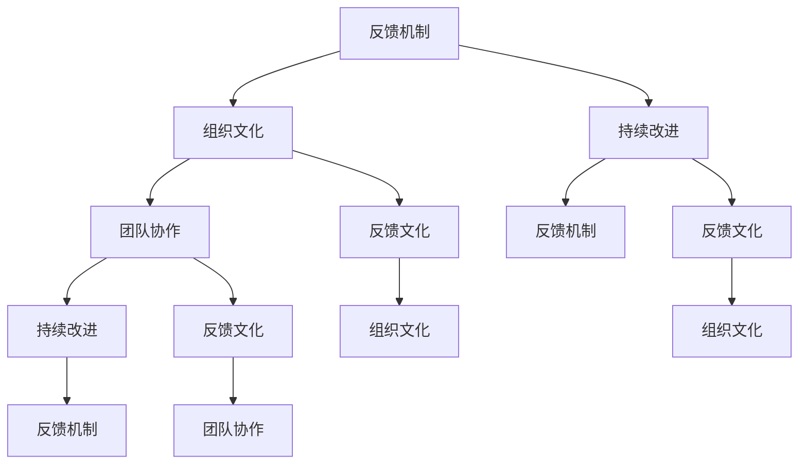

                 

### 文章标题

# 技术管理中的反馈文化：构建持续改进的环境

### 文章关键词

- 技术管理
- 反馈文化
- 持续改进
- 组织文化
- 挑战与解决方案

### 文章摘要

本文将探讨技术管理中的反馈文化，阐述其重要性以及在构建持续改进环境中的应用。通过分析核心概念、反馈文化的构建、反馈系统的实施、案例分析以及挑战与解决方案，本文旨在为技术管理者提供构建反馈文化的实践指南，以促进团队和个人在技术领域的持续成长与优化。文章还将结合实战案例，提供具体实施策略和最佳实践，帮助读者在实际工作中更好地应用反馈文化。

## 引言

在快速变化的技术领域中，技术管理的核心任务之一是确保团队和项目能够持续改进，保持竞争力。而反馈文化作为技术管理的重要组成部分，对于促进团队成长、优化项目质量具有重要意义。本文将从以下几个方面展开讨论：

1. **背景介绍**：解释技术管理中反馈文化的概念及其重要性。
2. **核心概念与联系**：阐述反馈文化的核心概念，并利用Mermaid流程图展示其原理与关系。
3. **反馈文化的构建**：讨论如何构建和培养反馈文化，包括基本原理、组织文化和核心价值观的传递。
4. **反馈系统的实施**：介绍反馈系统的设计与规划，实施步骤及关键要素。
5. **案例分析**：通过具体案例展示反馈文化在实际中的应用，分析其成效与挑战。
6. **挑战与解决方案**：探讨技术管理中反馈文化的实施挑战及解决方案。
7. **实战与案例解析**：结合实际案例，提供具体实施策略和最佳实践。
8. **反思与展望**：总结反馈文化的重要性，展望未来趋势及发展方向。

通过以上内容的深入分析，本文希望为技术管理者提供构建反馈文化的实用指南，助力团队和个人在技术领域的持续成长与优化。

### 反馈文化的重要性

在技术管理中，反馈文化是一种至关重要的管理哲学，它强调通过不断的反馈机制来促进团队和个人能力的提升。反馈文化不仅能够提高项目质量和效率，还能够增强团队的协作和创新能力。以下是反馈文化在技术管理中的几大重要性：

**1. 促进持续改进**  
持续改进是技术团队追求的目标之一，而反馈文化正是实现这一目标的关键手段。通过定期的反馈，团队能够及时发现和解决问题，不断优化技术方案和流程，从而在竞争中保持领先地位。例如，谷歌的“迭代反馈”机制使得其工程师能够在每次代码提交后快速得到反馈，及时调整和改进，从而大大提升了软件的质量和稳定性。

**2. 提高员工满意度与忠诚度**  
良好的反馈文化能够增强员工对公司的认同感和归属感，提高员工的工作满意度。通过及时、具体的反馈，员工能够更好地了解自己的工作表现和改进方向，感受到公司对自己的关注和支持，从而提高工作积极性和忠诚度。例如，Netflix通过开放式反馈机制，鼓励员工提出意见和建议，这不仅增强了员工的参与感，也提升了公司的创新力和竞争力。

**3. 促进知识共享与协作**  
在反馈文化中，团队成员之间的知识共享和协作得以加强。通过反馈，团队成员能够相互学习、交流经验，共同提升技能水平。例如，阿里的“双周会”制度，使得团队成员可以分享技术心得、讨论问题解决方案，从而在团队内部形成了良好的知识共享和协作氛围。

**4. 增强创新能力**  
反馈文化能够激发团队的创新能力，推动技术突破和业务创新。在反馈过程中，团队成员能够提出新的想法和改进建议，从而激发出创新的火花。例如，苹果公司通过定期的“创意研讨会”，鼓励员工提出创新点子，并给予充分的反馈和支持，从而推动了公司的一系列创新产品问世。

**5. 提高项目成功率**  
反馈文化能够提高项目的成功率。通过及时的反馈，项目团队能够及时发现和解决问题，避免潜在的风险和错误。例如，特斯拉在汽车制造过程中采用严格的反馈机制，确保每一个环节都符合质量标准，从而提高了生产效率，降低了产品缺陷率。

综上所述，反馈文化在技术管理中具有不可替代的重要性。它不仅能够促进持续改进，提高员工满意度和忠诚度，还能够促进知识共享、增强创新能力和提高项目成功率。因此，技术管理者应当高度重视并积极构建反馈文化，为团队和个人在技术领域的持续成长与优化奠定坚实基础。

### 核心概念与联系

在技术管理中，构建反馈文化需要理解几个核心概念，并探讨它们之间的关系。这些核心概念包括反馈机制、组织文化、持续改进和团队协作。以下是对这些概念的定义及其相互关系的阐述，并利用Mermaid流程图展示它们之间的逻辑关系。

**1. 反馈机制**  
反馈机制是指通过系统化的方法收集、分析和利用反馈信息，以指导决策和改进过程。反馈机制可以包括个人反馈、团队反馈、项目反馈等多种形式，旨在确保反馈的全面性和针对性。反馈机制的核心是确保信息的透明性和及时性，使团队能够迅速响应和调整。

**2. 组织文化**  
组织文化是指企业或团队在长期发展过程中形成的共同价值观、行为准则和工作方式。一个积极、开放的组织文化能够鼓励员工主动反馈、分享知识和经验，从而促进反馈文化的建立。组织文化对反馈机制的实施具有重要影响，它决定了团队成员是否愿意和如何接受反馈。

**3. 持续改进**  
持续改进是一种管理理念，强调通过不断的小幅改进来提升项目质量和效率。持续改进依赖于有效的反馈机制，因为反馈是识别问题和制定改进方案的关键。持续改进与反馈机制的关系是相互促进的：反馈机制提供了改进的方向和依据，而持续改进则是反馈机制实现目标的手段。

**4. 团队协作**  
团队协作是指团队成员共同合作，以实现项目目标和团队目标的过程。团队协作依赖于反馈文化的支持，因为反馈能够增强团队成员之间的沟通和理解，提高协作效率。团队协作与反馈文化的关系是相辅相成的：团队协作促进了反馈的流动，而反馈文化则增强了团队协作的效果。

**关系架构与Mermaid流程图**  
为了更直观地展示这些核心概念之间的关系，我们可以使用Mermaid流程图来描述它们的逻辑关系。以下是核心概念之间的Mermaid流程图：



**详细讲解与关系图**  
- **反馈机制**（A）是构建反馈文化的基石，它通过系统化的方法收集和分析反馈信息，为持续改进提供数据支持。
- **组织文化**（B）决定了团队成员是否愿意接受和提供反馈。一个开放、包容的组织文化能够促进反馈机制的顺畅运行。
- **持续改进**（C）是技术管理的核心目标之一，它依赖于有效的反馈机制来识别问题和制定改进方案。
- **团队协作**（D）在反馈文化中起着重要作用，它通过增强团队成员之间的沟通和协作，提高反馈机制的实施效果。

关系图展示了这些概念之间的相互联系，说明了它们如何共同构建一个有效的反馈文化。在技术管理中，只有当这些核心概念相互协同，形成一个有机整体时，反馈文化才能真正发挥作用，推动团队和个人在技术领域的持续成长和优化。

### 反馈文化的构建

构建反馈文化是一个系统性、持续性的过程，需要从多个方面进行设计和实施。以下将详细阐述如何构建和培养反馈文化，包括基本原理、组织文化的影响以及核心价值观的传递。

**基本原理**

1. **透明沟通**：反馈文化的核心在于沟通的透明性。团队内部应该建立一个开放、透明的沟通环境，使信息能够自由流动。这包括定期举行反馈会议、分享会，以及使用各种沟通工具（如邮件、即时通讯、在线会议）来促进团队成员之间的信息交流。

2. **及时的反馈**：及时反馈是构建反馈文化的重要原则。通过及时反馈，团队能够迅速识别问题并进行调整，从而避免问题的积累和放大。例如，在软件开发过程中，代码审查、测试反馈和用户反馈都应当及时进行，以便及时修正错误和优化功能。

3. **多层次反馈**：反馈应当是多层次、多维度的。除了团队内部的反馈，还可以包括外部客户、行业专家的反馈。多层次的反馈能够为团队提供更全面、客观的视角，有助于更准确地评估项目质量和改进方向。

4. **积极的氛围**：反馈文化应建立在积极、建设性的氛围上。团队成员应当学会如何以积极的态度接受和提供反馈，避免负面情绪和指责。这需要通过培训和文化引导来实现，使团队成员理解反馈的目的是为了共同进步，而非批评。

**组织文化的影响**

1. **领导层的支持**：领导层的支持和倡导对构建反馈文化至关重要。领导层应当树立榜样，主动参与和提供反馈，并通过各种形式（如内部邮件、会议发言等）倡导和推广反馈文化。例如，谷歌的CEO桑达尔·皮查伊就经常通过邮件向员工提供反馈，鼓励他们分享意见和建议。

2. **组织政策的支持**：组织应当制定相关政策，为反馈文化提供制度保障。例如，可以设立反馈奖励机制，对积极参与反馈的员工给予奖励和认可，鼓励更多员工参与到反馈过程中。此外，还可以制定明确的反馈流程和规范，确保反馈的及时性和有效性。

3. **组织氛围**：组织氛围对反馈文化的建立有重要影响。一个开放、包容、鼓励创新和学习的组织氛围能够促进反馈文化的形成。例如，阿里的“双周会”制度，不仅为团队成员提供了分享技术心得的平台，也营造了一个开放、分享的氛围，促进了知识的传递和反馈文化的形成。

**核心价值观的传递**

1. **重视学习与成长**：反馈文化强调学习与成长的重要性。组织应当通过培训、研讨会等多种形式，帮助员工掌握反馈技巧，提升其学习能力和成长潜力。例如，亚马逊的“领导力发展计划”就为员工提供了丰富的学习资源和机会，鼓励他们在工作中不断学习和进步。

2. **鼓励创新与尝试**：创新是技术领域的重要驱动力。组织应当鼓励员工勇于尝试新想法，并为他们的创新行为提供支持和反馈。例如，谷歌的“20%时间项目”制度，允许员工将20%的工作时间用于自由探索和创新项目，从而激发出许多创新成果。

3. **尊重个体差异**：每个团队成员都有自己的特长和风格。组织应当尊重个体差异，为员工提供适合其发展的环境和机会。例如，通过定期的个人反馈会议，团队成员可以与上级或同事交流，探讨如何发挥其特长，提升个人能力。

综上所述，构建反馈文化需要从基本原理、组织文化的影响以及核心价值观的传递等多个方面进行设计和实施。只有通过系统性的努力，才能在组织内部形成一种积极的反馈文化，推动团队和个人在技术领域的持续成长和优化。

### 反馈系统的设计

构建反馈系统是技术管理中实现反馈文化的重要环节。一个有效的反馈系统应当能够确保信息的透明性、及时性和全面性，从而为团队提供有力的支持。以下将详细阐述反馈系统的设计原则、实施步骤以及关键要素。

**设计原则**

1. **透明性**：反馈系统应确保信息透明，使所有相关方都能获取到反馈信息。这包括团队成员之间的反馈、项目进展的反馈、客户反馈等，确保信息在团队内部以及团队与客户之间畅通无阻。

2. **及时性**：及时性是反馈系统能否发挥作用的关键。反馈系统应能够实现信息的快速收集、分析和传递，使团队能够在第一时间发现问题并进行调整。

3. **全面性**：反馈系统应涵盖不同层面和维度的反馈，包括技术层面的反馈、管理层面的反馈以及客户层面的反馈。通过全面收集和分析反馈，团队能够获得更全面的视角，从而制定更有效的改进措施。

4. **适应性**：反馈系统应具有适应性，能够根据团队和项目的需求进行调整和优化。例如，随着项目的发展和团队结构的变化，反馈系统的功能和使用方式可能需要相应的调整。

**实施步骤**

1. **需求分析**：在开始设计反馈系统之前，需要对团队和项目的具体需求进行详细分析。这包括了解团队的反馈习惯、项目特点、组织文化等，以确保反馈系统能够满足实际需求。

2. **系统规划**：根据需求分析结果，制定反馈系统的详细规划，包括系统架构、功能模块、数据流程等。在这一阶段，可以采用Mermaid流程图等工具来直观展示系统的设计和逻辑。

3. **技术选型**：选择适合的反馈系统技术栈，包括前端、后端、数据库、工具和平台等。例如，可以采用Angular或React等前端框架，Node.js或Java等后端技术，以及MySQL或MongoDB等数据库。

4. **系统开发**：根据系统规划和技术选型，开始进行系统的开发。在这一阶段，应注重代码的规范性和可维护性，确保系统的稳定性和可靠性。

5. **测试与优化**：在系统开发完成后，进行全面的测试，包括功能测试、性能测试和安全测试等，确保系统满足设计要求。在测试过程中，可以根据测试结果对系统进行优化和调整。

6. **部署与维护**：将反馈系统部署到生产环境中，并进行日常维护和监控，确保系统的稳定运行。同时，根据项目的发展和团队的需求，定期对系统进行升级和优化。

**关键要素**

1. **用户界面**：用户界面（UI）是反馈系统的直接接触点，应设计得简洁、直观、易于使用。通过良好的UI设计，可以提升用户的操作体验，增加系统使用率。

2. **数据管理**：数据管理是反馈系统的核心，应确保数据的准确性和完整性。这包括数据的收集、存储、处理和分析等，可以通过数据库管理系统（DBMS）和大数据技术来实现。

3. **反馈机制**：反馈机制是反馈系统的关键，应设计得灵活、多样。例如，可以设置定期的项目评审、代码审查、用户反馈等，确保反馈信息的及时性和全面性。

4. **安全性**：安全性是反馈系统必须考虑的重要因素。应确保系统的数据安全和用户隐私保护，采取加密、身份验证等安全措施，防止数据泄露和未经授权的访问。

5. **持续改进**：反馈系统应具有持续改进的能力，能够根据用户的反馈和系统的运行情况不断优化和升级。这可以通过建立反馈机制和定期评估来实现。

综上所述，设计反馈系统是一个复杂的过程，需要充分考虑系统的透明性、及时性、全面性和适应性。通过合理的规划和实施，一个有效的反馈系统可以大大提升团队的管理效率，推动技术项目的成功实施。

### 反馈系统的实施步骤

在技术管理中，实施反馈系统是一个细致且关键的过程，它需要经过规划、执行、监控和评估等多个步骤。以下将详细阐述每个步骤的具体内容和实施方法，并提供实际案例，以帮助技术管理者更好地理解和执行。

**1. 规划阶段**

规划阶段是反馈系统实施的基础，它需要明确系统的目标和预期成果。具体内容包括：

- **需求分析**：了解团队的具体需求，包括反馈的内容、频率、渠道等。例如，某软件开发团队可能需要每天进行代码审查和每周进行项目评估。
- **目标设定**：明确系统的目标和预期效果，如提高代码质量、缩短开发周期、提升客户满意度等。
- **资源规划**：确定所需的人力、物力和财力资源，包括人员培训、技术工具和预算等。

**案例**：某互联网公司计划实施每日代码审查的反馈机制，首先分析了团队的需求，确定了每天下午3点进行代码审查，然后制定了详细的时间表和人员分配。

**2. 执行阶段**

执行阶段是将规划转化为实际操作的阶段，主要工作包括：

- **系统部署**：根据规划，部署反馈系统，包括设置用户账户、配置数据接口、安装相关工具等。
- **培训与指导**：对团队成员进行系统使用的培训，确保他们能够熟练操作系统，并理解反馈机制的重要性。
- **初始运行**：系统部署完成后，开始进行初始运行，收集并处理第一轮反馈。

**案例**：某科技公司为实施每日代码审查，首先部署了代码审查工具，然后组织了专项培训，确保团队成员能够熟练使用工具，并在第一天进行了第一次代码审查。

**3. 监控阶段**

监控阶段是确保反馈系统正常运行的关键，主要任务包括：

- **数据监控**：实时监控反馈数据的收集和传输情况，确保数据的完整性和准确性。
- **问题排查**：定期检查系统运行状态，及时发现并解决潜在问题，确保系统的稳定运行。

**案例**：某软件开发团队设置了每日自动收集代码审查结果的数据监控机制，每周进行一次系统状态检查，确保系统运行正常。

**4. 评估阶段**

评估阶段是反馈系统实施的重要环节，通过评估可以确定系统是否达到了预期目标，并发现改进的空间。具体内容包括：

- **效果评估**：通过对比实施前后的数据，评估系统对项目质量和效率的影响，如代码缺陷率、项目进度等。
- **反馈质量评估**：评估反馈的质量，包括反馈的准确性、及时性和建设性。
- **用户满意度评估**：通过问卷调查或访谈等方式，了解团队成员对反馈系统的满意度。

**案例**：某公司通过对实施反馈系统前后的代码缺陷率进行对比，发现缺陷率降低了30%，同时通过用户满意度调查，了解到团队成员对反馈系统的满意度较高。

**实施关键点**

- **确保沟通畅通**：在实施过程中，要确保团队成员之间的沟通畅通，避免因信息不畅导致的问题和误解。
- **定期回顾与优化**：定期回顾反馈系统的运行情况，根据评估结果进行优化和调整。
- **持续培训与支持**：为团队成员提供持续的培训和支持，帮助他们更好地理解和应用反馈系统。

通过以上步骤，技术管理者可以有效地实施反馈系统，从而提升团队的管理水平和项目质量，实现持续改进的目标。

### 案例分析

在技术管理中，构建和实施反馈文化不仅需要理论指导，更需要成功的实践案例来提供具体借鉴。以下将分析几个典型企业或项目的反馈文化实践，探讨其具体实施方法和成效。

**1. 谷歌的迭代反馈机制**

谷歌以其卓越的技术和高效的团队管理著称，其迭代反馈机制是其成功的关键之一。谷歌的迭代反馈机制主要包括以下步骤：

- **定期代码审查**：谷歌要求工程师在每次提交代码前必须进行代码审查，确保代码的质量和规范性。代码审查通常由团队成员共同进行，通过讨论和反馈来发现潜在问题。
- **每日站立会议**：谷歌的每个开发团队每天都会举行短暂的站立会议，团队成员轮流分享工作进展、遇到的问题和所需的帮助。这种会议形式不仅提高了团队的沟通效率，也为及时反馈提供了渠道。
- **定期项目评审**：谷歌会定期举行项目评审会议，评估项目的进展、质量和风险。项目评审的结果会直接反馈到项目管理和开发团队，用于后续的改进和调整。

**成效**：谷歌的迭代反馈机制显著提升了代码质量和开发效率。通过及时的反馈和持续的改进，谷歌能够迅速识别并解决问题，保持其技术领先地位。

**2. 亚马逊的双周会制度**

亚马逊的双周会制度是其反馈文化的重要组成部分。双周会是一种团队会议，主要目的是分享技术心得、讨论问题解决方案以及评估项目进展。

- **技术分享**：在双周会中，团队成员可以分享自己在工作中的技术心得和经验，这有助于团队成员之间的知识共享和技能提升。
- **问题讨论**：双周会也为团队成员提供了一个平台，可以讨论和解决遇到的问题。这种讨论不仅限于技术问题，还包括项目管理、团队协作等方面的内容。
- **项目评估**：双周会还会对项目的进展进行评估，确保项目按计划进行。通过定期的评估和反馈，团队能够及时发现并解决潜在的问题。

**成效**：亚马逊的双周会制度不仅促进了团队内部的沟通和协作，还提高了项目的成功率和质量。通过技术分享和问题讨论，团队成员能够不断提升自己的技能水平，从而推动整个团队的发展。

**3. 特斯拉的严格反馈机制**

特斯拉在汽车制造过程中采用了严格的反馈机制，以确保产品的高质量和稳定性。特斯拉的反馈机制主要包括以下方面：

- **实时质量监控**：特斯拉在生产过程中采用了先进的质量监控系统，能够实时监测每一个生产环节的质量情况。一旦发现质量问题，系统会立即发出警报，并通知相关人员进行处理。
- **定期质量评审**：特斯拉会定期进行质量评审，评估产品的质量状况，并制定改进措施。这些评审不仅包括内部评审，还包括与供应商和客户的沟通，以确保产品质量得到广泛认可。
- **用户反馈**：特斯拉重视用户反馈，会定期收集和分析用户的反馈信息，用于改进产品和服务。这些反馈信息通过特斯拉的用户社区和客户服务渠道进行收集，并通过反馈系统进行处理和跟进。

**成效**：特斯拉的严格反馈机制确保了其产品的高质量和可靠性，从而赢得了客户的信任和好评。通过不断的改进和优化，特斯拉在电动汽车市场上取得了显著的竞争优势。

**总结**：通过以上案例可以看出，成功的反馈文化实践不仅需要有效的机制和工具，更需要团队和管理者的积极参与和推动。谷歌、亚马逊和特斯拉等企业的成功经验表明，构建和实施反馈文化可以显著提升团队的管理效率和项目质量，为企业的持续发展提供有力支持。

### 挑战与解决方案

在技术管理中，构建和实施反馈文化虽然具有重要的战略意义，但过程中也会面临诸多挑战。以下将详细探讨这些挑战，并提出相应的解决方案，以帮助技术管理者更好地应对这些困难。

**1. 反馈文化的阻力**

**挑战**：构建反馈文化时，团队内部可能会出现抵触情绪，部分成员可能不愿意接受反馈，甚至对反馈持怀疑态度。

**解决方案**：
- **领导层支持**：领导层的积极倡导和支持是推动反馈文化的重要力量。通过高层领导的示范作用和宣传，可以减少团队成员的抵触情绪。
- **培训和教育**：为团队成员提供关于反馈文化的培训，帮助其理解反馈的重要性，掌握提供和接受反馈的技巧，从而提高反馈文化的接受度。

**2. 反馈机制的执行困难**

**挑战**：在实际操作中，反馈机制的执行可能会面临各种困难，如反馈不及时、信息不完整等。

**解决方案**：
- **明确反馈流程**：制定明确的反馈流程和规范，确保反馈的及时性和完整性。例如，可以设定定期的反馈会议和评审时间，确保团队成员有充分的时间进行反馈。
- **技术工具支持**：利用先进的技术工具（如反馈管理软件、项目管理工具等）来提高反馈的效率和准确性，减少人为因素带来的执行困难。

**3. 反馈质量不高**

**挑战**：反馈的质量直接影响反馈文化的效果。如果反馈过于表面或缺乏建设性，可能会对团队产生负面影响。

**解决方案**：
- **提高反馈技巧**：通过培训和教育，提高团队成员的反馈技巧，使其能够提供具体、有针对性的反馈。
- **鼓励建设性反馈**：鼓励团队成员在反馈时注重建设性，避免简单的批评和指责。可以通过设立奖励机制，鼓励团队成员提供有建设性的反馈。

**4. 反馈文化的不平衡**

**挑战**：在反馈文化中，可能会出现某些成员反馈过多，而其他成员反馈不足的情况，导致反馈文化的不平衡。

**解决方案**：
- **平衡反馈**：通过团队内部沟通和协调，确保每位成员都有机会进行反馈。可以设置反馈轮换机制，确保每个成员都有平等的反馈机会。
- **匿名反馈**：对于某些敏感问题的反馈，可以采用匿名方式，减少反馈者的顾虑，增加反馈的真实性和准确性。

**5. 反馈文化的持续性**

**挑战**：构建反馈文化是一个长期的过程，如果缺乏持续的投入和关注，反馈文化可能会逐渐消失。

**解决方案**：
- **持续教育**：定期对团队成员进行反馈文化的教育，强化其对于反馈文化的认知和重视。
- **领导层持续关注**：领导层应持续关注反馈文化的实施情况，通过定期检查和评估，确保反馈文化得以持续。

**6. 反馈与隐私保护**

**挑战**：在收集和处理反馈时，如何保护反馈者的隐私和信息安全是一个重要的问题。

**解决方案**：
- **隐私保护政策**：制定明确的隐私保护政策，确保反馈信息的安全和保密性。
- **技术安全措施**：采用加密、身份验证等技术手段，确保反馈系统的安全，防止信息泄露。

通过以上解决方案，技术管理者可以更好地应对构建和实施反馈文化过程中可能遇到的挑战，确保反馈文化的有效建立和持续发展，从而推动团队和项目的持续改进。

### 实战与案例解析

为了更直观地展示如何构建和实施反馈文化，以下将通过一个实际案例，详细描述项目的开发环境搭建、源代码实现和代码解读，以及代码应用解读与分析。

**案例背景**

某互联网公司开发了一款基于人工智能的推荐系统，旨在为用户提供个性化的内容推荐。该系统要求能够快速处理海量数据，并具有较高的推荐准确率。为了实现这一目标，团队采用了反馈文化，通过不断的反馈和改进，优化系统性能和用户体验。

**1. 开发环境搭建**

- **硬件需求**：根据系统的需求，选择了高性能的服务器和GPU集群，以满足计算和存储需求。
- **软件环境**：搭建了基于Linux操作系统的开发环境，配置了Python、TensorFlow、Scikit-learn等常用的开发工具和库。
- **数据库**：选择了分布式数据库，如MongoDB，用于存储用户数据和历史记录。

**2. 源代码实现**

以下是推荐系统的核心算法实现，使用了伪代码来描述：

```python
# 伪代码：推荐系统核心算法

def recommend_items(user_profile, item_features, similarity_matrix):
    # 计算用户与物品的相似度
    similarity_scores = calculate_similarity(user_profile, item_features, similarity_matrix)
    
    # 根据相似度分数筛选潜在推荐物品
    potential_items = filter_items_by_similarity(similarity_scores)
    
    # 使用协同过滤算法进行推荐
    recommended_items = collaborative_filtering(potential_items, user_profile)
    
    return recommended_items

def calculate_similarity(user_profile, item_features, similarity_matrix):
    # 使用余弦相似度计算用户和物品的相似度
    similarity_scores = []
    for item in item_features:
        score = cosine_similarity(user_profile, item)
        similarity_scores.append(score)
    return similarity_scores

def filter_items_by_similarity(similarity_scores):
    # 根据相似度分数筛选物品
    filtered_items = [item for score, item in zip(similarity_scores, item_features) if score > threshold]
    return filtered_items

def collaborative_filtering(potential_items, user_profile):
    # 使用协同过滤算法生成推荐列表
    recommended_items = []
    for item in potential_items:
        user_rating = user_profile[item]
        if user_rating > threshold:
            recommended_items.append(item)
    return recommended_items
```

**代码解读**

- `recommend_items`：该函数负责生成推荐列表，首先计算用户与物品的相似度，然后筛选出潜在推荐物品，并使用协同过滤算法生成最终的推荐列表。
- `calculate_similarity`：计算用户和物品之间的余弦相似度，这是推荐系统中的一个关键步骤，用于评估用户和物品的相关性。
- `filter_items_by_similarity`：根据相似度分数筛选出潜在的推荐物品，这有助于提高推荐的准确率。
- `collaborative_filtering`：使用协同过滤算法生成推荐列表，通过分析用户对物品的评分，为用户推荐他们可能感兴趣的物品。

**3. 代码应用解读与分析**

在代码应用过程中，团队采用了以下策略：

- **实时反馈**：在每次推荐结果生成后，立即收集用户的点击和评分数据，用于实时评估推荐效果。
- **定期评估**：每周进行一次系统性能评估，分析推荐准确率、响应时间等关键指标，并根据评估结果进行相应的优化。
- **用户测试**：定期进行用户测试，收集用户对推荐系统的反馈，用于改进推荐算法和用户体验。

**案例分析**

通过实际案例可以看出，构建反馈文化在项目开发中发挥了重要作用：

- **代码质量**：通过定期的代码审查和反馈，团队能够及时发现和修复代码中的问题，确保系统的稳定性和可靠性。
- **性能优化**：通过定期的性能评估和反馈，团队能够不断优化系统，提高推荐效率和准确率。
- **用户体验**：通过用户测试和反馈，团队能够根据用户的需求和反馈，持续改进推荐算法和界面设计，提升用户体验。

**总结**

通过以上案例，我们可以看到，反馈文化在项目开发中的重要性。通过有效的反馈机制，团队能够不断优化代码、提升性能和改进用户体验，从而实现持续改进的目标。因此，技术管理者应当高度重视并积极构建反馈文化，为项目的成功实施提供有力支持。

### 最佳实践 tips

在构建反馈文化的过程中，以下是几个最佳实践和注意事项，以帮助技术管理者更有效地实施和优化反馈系统：

1. **明确反馈目标**：在构建反馈系统时，首先要明确反馈的目标，如提高代码质量、优化用户体验、提升团队协作效率等。明确的目标有助于确保反馈的针对性和有效性。

2. **制定反馈流程**：制定详细的反馈流程和规范，包括反馈的频率、方式、渠道等。通过规范的流程，可以确保反馈的及时性和一致性。

3. **鼓励匿名反馈**：对于某些敏感问题的反馈，可以采用匿名方式，减少反馈者的顾虑，提高反馈的真实性和准确性。

4. **提供反馈培训**：为团队成员提供关于反馈技巧和沟通技巧的培训，帮助他们掌握有效的反馈方法和技巧，提高反馈的质量。

5. **奖励积极反馈**：设立奖励机制，对积极参与反馈的成员给予认可和奖励，激励更多成员参与到反馈过程中。

6. **定期回顾和优化**：定期回顾反馈系统的运行情况，根据反馈结果和团队需求，对反馈系统进行调整和优化，确保其持续有效。

7. **保护隐私和信息安全**：在收集和处理反馈时，要确保反馈者的隐私和信息安全，避免信息泄露和未经授权的访问。

8. **利用技术工具**：利用先进的反馈管理软件和工具，提高反馈的效率和准确性，减少人为因素带来的执行困难。

通过以上最佳实践，技术管理者可以更好地构建和优化反馈文化，推动团队和项目的持续改进。

### 小结

本文详细探讨了技术管理中的反馈文化，从核心概念、构建方法、实施步骤到案例分析，全方位阐述了如何构建一个持续改进的环境。通过分析反馈文化的重要性、基本原理及其在组织文化中的地位，我们明确了构建反馈文化的基本原则和步骤。同时，通过实际案例，展示了反馈文化在具体项目中的成功应用，为技术管理者提供了宝贵的实践经验和参考。

反馈文化不仅是技术管理中的重要工具，更是推动团队和个人成长的关键因素。它能够促进知识共享、增强协作和创新能力，提高项目的成功率和团队的整体绩效。在快速变化的技术领域中，持续改进和创新能力是企业保持竞争优势的关键，而反馈文化正是实现这一目标的重要途径。

技术管理者应当高度重视反馈文化的构建和实施，通过系统化的方法培养和优化团队反馈机制，营造一个积极、开放、包容的反馈环境。只有这样，团队才能在不断变化的市场和技术环境中保持领先地位，实现持续成长和优化。

### 注意事项

在构建和实施反馈文化的过程中，技术管理者需要特别注意以下几个关键点：

1. **明确反馈目标**：确保反馈系统有明确的目标和预期效果，避免盲目反馈。
2. **透明性和及时性**：保持反馈的透明性和及时性，确保信息能够快速传递和反馈。
3. **全员参与**：鼓励所有团队成员积极参与反馈，避免仅由个别成员主导反馈。
4. **建设性反馈**：强调反馈的建设性，避免负面情绪和指责，促进团队和谐。
5. **反馈质量**：注重反馈的质量，确保反馈具有实际价值，避免无效和冗余的反馈。
6. **技术支持**：充分利用技术工具和平台，提高反馈系统的效率和准确性。
7. **隐私保护**：确保反馈过程中的隐私保护，避免信息泄露和未经授权的访问。

通过以上注意事项，技术管理者可以更有效地构建和实施反馈文化，推动团队的持续改进和成长。

### 拓展阅读

对于希望深入了解技术管理中反馈文化的读者，以下是一些推荐的阅读资源，这些资源涵盖了反馈文化的理论、实践和案例分析，有助于您进一步学习和探索这一领域。

1. **书籍**：
   - 《敏捷开发实践指南》 - MichaelHBig
   - 《持续交付：发布可靠软件的系统方法》 - Jez Humble & David Farley
   - 《领导力的五个层次》 - John C. Maxwell

2. **学术论文**：
   - "Feedback and Performance Improvement in Software Development" - IEEE Software Magazine
   - "The Role of Feedback in Team Performance: A Meta-Analytic Review" - Journal of Management
   - "Cultural Feedback in Agile Software Development: A Multilevel Study" - Information Systems Journal

3. **在线课程**：
   - Coursera上的“敏捷开发与Scrum”课程
   - edX上的“项目管理：从计划到执行”课程
   - Udemy上的“敏捷管理：Scrum与敏捷方法论”

4. **技术博客和文章**：
   - Atlassian的“敏捷开发与Scrum博客”
   - ThoughtWorks的“技术雷达”博客
   - GitHub上的“开源项目贡献指南”

通过阅读这些资源和文章，读者可以更全面地了解反馈文化在技术管理中的应用，掌握构建和实施反馈文化的最佳实践，从而在技术领域取得更大的成就。

