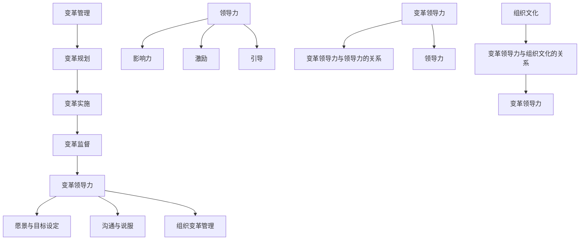

                 

### 文章标题

《技术管理中的变革领导力》

### 文章关键词

技术管理、变革领导力、组织变革、领导力、创新、团队协作

### 文章摘要

在技术飞速发展的当今社会，技术管理的角色变得愈发重要。变革领导力作为技术管理中的关键要素，不仅关乎企业适应市场变化的能力，更决定了企业的长期竞争力。本文将深入探讨变革领导力的核心概念与联系，通过背景介绍、核心概念与关系架构、算法原理讲解、数学模型和公式、项目实战以及最佳实践和注意事项，全面阐述变革领导力在技术管理中的重要性及其应用。文章旨在为技术管理人员提供实用的理论指导和实践策略，以推动企业在变革中取得成功。本文约12000字，适合对技术管理和领导力有兴趣的读者阅读。### 背景介绍

在快速变化的技术环境中，企业面临的挑战愈发复杂多样。一方面，新兴技术的不断涌现，如云计算、大数据、人工智能和区块链等，为企业管理带来了新的机遇；另一方面，这些技术也使得市场竞争更加激烈，企业必须在技术创新和业务模式上不断求变以保持竞争力。

这种背景下，技术管理的重要性日益凸显。技术管理不仅仅是技术层面的工作，它更涉及组织层面的战略规划、资源配置和团队协作。在这个基础上，变革领导力成为技术管理中的关键要素。变革领导力是指领导者通过引导、激励和协调团队成员，推动组织实现技术变革和创新的能力。

变革领导力的重要性体现在以下几个方面：

1. **适应市场变化**：在市场快速变化的环境中，企业需要具备快速响应和适应能力。变革领导力能够帮助领导者识别市场趋势，制定适应策略，并迅速实施。
2. **推动技术创新**：技术创新是企业保持竞争力的关键。变革领导力能够激发团队成员的创新思维，推动技术突破，为企业发展提供源源不断的动力。
3. **提升团队协作效率**：技术管理工作往往需要跨部门、跨领域的协作。变革领导力能够促进团队内部的沟通与合作，提高整体工作效率。
4. **建立企业文化**：变革领导力不仅仅是技术层面的领导，它还涉及到企业文化的建设。通过变革领导力，企业能够塑造积极向上的文化氛围，增强员工的归属感和认同感。

然而，变革领导力在实践中也面临诸多挑战。例如，如何有效地沟通变革目标、如何处理变革中的阻力、如何确保变革的持续性和稳定性等。这些问题需要领导者具备深厚的理论知识和丰富的实践经验，才能在实践中取得成功。

本文将从理论层面和实践层面深入探讨变革领导力在技术管理中的应用，通过背景介绍、核心概念与联系、算法原理讲解、数学模型和公式、项目实战以及最佳实践和注意事项，为读者提供全面的指导。希望通过本文的阅读，技术管理人员能够更好地理解变革领导力的内涵和重要性，并将其应用于实际工作中，推动企业的持续发展。### 核心概念与联系

为了深入理解变革领导力，我们需要首先了解一些核心概念，并探讨它们之间的相互联系。

#### 1. 变革管理

变革管理是指企业在面对外部环境变化或内部战略调整时，所采取的一系列规划、实施和监督措施。变革管理通常包括以下关键环节：

- **变革规划**：在变革前，领导者需要明确变革的目标、范围和时间表，制定详细的变革计划。
- **变革实施**：通过培训、沟通和激励等手段，确保团队成员理解和接受变革，并积极参与其中。
- **变革监督**：在变革过程中，领导者需要监控变革的进展情况，及时调整策略，确保变革目标的实现。

#### 2. 变革领导力

变革领导力是一种特殊的领导力形式，它不仅要求领导者具备传统的领导能力，还需要他们在组织变革过程中发挥关键作用。变革领导力涉及以下几个方面：

- **愿景与目标设定**：领导者需要明确组织的变革方向和目标，并使其具有激励性。
- **沟通与说服**：领导者需要有效地与团队成员沟通变革的重要性，说服他们支持并参与变革。
- **组织变革管理**：领导者需要运用各种管理技巧，推动变革的实施和监督。

#### 3. 领导力

领导力是指领导者通过影响、激励和引导团队成员，实现共同目标的能力。领导力可以归纳为以下几个方面：

- **影响力**：领导者需要具备影响团队成员的能力，使其认同并支持领导者的愿景和目标。
- **激励**：领导者需要能够激发团队成员的积极性和创造力，推动他们实现个人和团队目标。
- **引导**：领导者需要能够引导团队成员，帮助他们克服困难和挑战，实现目标。

#### 4. 变革领导力与领导力的关系

变革领导力是领导力的一种特殊形式，它强调在变革过程中的领导作用。变革领导力与领导力之间的联系可以概括为：

- **变革领导力**：是领导力在特定情境下的应用，它要求领导者具备应对变革的能力和技巧。
- **领导力**：是变革领导力的基础，没有良好的领导力，就难以实现有效的变革领导。

#### 5. 变革领导力与组织文化的关系

组织文化是指企业在长期发展中形成的共同价值观、行为准则和工作方式。变革领导力与组织文化之间的关系如下：

- **变革领导力**：可以促进组织文化的变革，通过推动创新和改进，使组织文化更加适应外部环境。
- **组织文化**：可以影响变革领导力的实施效果，积极向上的组织文化有助于变革的顺利进行。

#### Mermaid 流程图

为了更直观地展示这些核心概念之间的联系，我们使用Mermaid流程图进行说明：



通过上述流程图，我们可以清晰地看到变革管理、变革领导力、领导力以及组织文化之间的相互关系。理解这些核心概念及其联系，对于深入探讨变革领导力在技术管理中的应用具有重要意义。在接下来的章节中，我们将进一步详细阐述这些概念，并通过算法原理讲解、数学模型和公式、项目实战等具体内容，为读者提供更全面的指导。### 核心算法原理讲解

在深入探讨变革领导力的过程中，理解相关的算法原理对于推动技术管理中的变革至关重要。以下将介绍几个关键算法原理，并通过伪代码详细阐述其实现方法。

#### 1. 领导力评估算法

领导力评估算法用于评估领导者的领导能力，以确定其在变革过程中的有效性。该算法主要基于以下几个指标：沟通能力、决策能力、团队影响力和变革管理能力。

**伪代码：**

```python
def leadership_evaluation(communication, decision-making, team_influence, change_management):
    score = 0
    if communication >= 7:
        score += 1
    if decision-making >= 7:
        score += 1
    if team_influence >= 7:
        score += 1
    if change_management >= 7:
        score += 1
    return score
```

**算法解释：**
- `communication`：沟通能力评分（满分10分）。
- `decision-making`：决策能力评分（满分10分）。
- `team_influence`：团队影响力评分（满分10分）。
- `change_management`：变革管理能力评分（满分10分）。

评分越高，说明领导者在相应领域的领导力越强。总评分 `score` 是各项评分的累加，满分4分。根据总评分，可以判断领导者的整体领导力水平。

#### 2. 变革实施策略算法

变革实施策略算法用于制定具体的变革实施计划，以确保变革目标的实现。该算法基于以下几个步骤：

- **目标设定**：明确变革的目标和预期效果。
- **策略制定**：制定具体的变革策略，包括沟通、培训、激励等。
- **资源分配**：根据策略需求，合理分配资源，如人力、资金、时间等。
- **进度监控**：实时监控变革进度，及时调整策略。

**伪代码：**

```python
def change_implementation_strategy(target, communication_strategy, training_strategy, motivation_strategy, resource_allocation, progress_monitoring):
    strategy = {
        "target": target,
        "communication_strategy": communication_strategy,
        "training_strategy": training_strategy,
        "motivation_strategy": motivation_strategy,
        "resource_allocation": resource_allocation,
        "progress_monitoring": progress_monitoring
    }
    return strategy
```

**算法解释：**
- `target`：变革目标。
- `communication_strategy`：沟通策略。
- `training_strategy`：培训策略。
- `motivation_strategy`：激励策略。
- `resource_allocation`：资源分配策略。
- `progress_monitoring`：进度监控策略。

该算法通过输入各项策略，生成一个完整的变革实施策略，指导变革过程的执行。

#### 3. 变革风险评估算法

变革风险评估算法用于评估变革过程中可能遇到的风险，并制定相应的风险应对策略。该算法基于以下几个因素：

- **变革范围**：变革涉及的部门、人员和业务范围。
- **变革难度**：变革的复杂性和难度。
- **变更频率**：变更的频率和规模。
- **组织文化**：组织文化的开放性和适应性。

**伪代码：**

```python
def change_risk_evaluation的范围, 变革难度, 变更频率, 组织文化):
    risk_score = 0
    if 范围 > 10:
        risk_score += 1
    if 变革难度 > 10:
        risk_score += 1
    if 变更频率 > 10:
        risk_score += 1
    if 组织文化 < 5:
        risk_score += 1
    return risk_score
```

**算法解释：**
- 范围、变革难度、变更频率的评分越高，表示变革的范围越广、难度越大、变更越频繁。
- 组织文化评分越低，表示组织文化的开放性和适应性越差。

`risk_score` 是各项评分的累加，满分4分。根据 `risk_score`，可以判断变革过程中可能遇到的风险程度，并制定相应的风险应对策略。

#### 4. 变革成效评估算法

变革成效评估算法用于评估变革实施后的效果，以确定变革目标的实现程度。该算法基于以下几个指标：

- **目标实现度**：变革目标实现的程度。
- **团队成员满意度**：团队成员对变革的满意度。
- **业务绩效**：变革后的业务绩效变化。

**伪代码：**

```python
def change_effectiveness_evaluation(target_achievement, team_satisfaction, business_performance):
    effectiveness_score = 0
    if target_achievement >= 90:
        effectiveness_score += 1
    if team_satisfaction >= 80:
        effectiveness_score += 1
    if business_performance >= 90:
        effectiveness_score += 1
    return effectiveness_score
```

**算法解释：**
- `target_achievement`：目标实现度评分（满分100分）。
- `team_satisfaction`：团队成员满意度评分（满分100分）。
- `business_performance`：业务绩效评分（满分100分）。

评分越高，表示变革成效越好。总评分 `effectiveness_score` 是各项评分的累加，满分3分。

通过上述核心算法原理的讲解，我们可以看到，在技术管理中的变革领导力，需要运用一系列算法和模型来指导变革的实施和评估。理解这些算法原理，有助于领导者更好地制定变革策略，应对变革中的各种挑战，推动企业的持续发展。在接下来的章节中，我们将进一步探讨数学模型和公式，为读者提供更深入的指导。### 数学模型和公式

在变革领导力的应用中，数学模型和公式可以提供量化的依据，帮助领导者更好地理解和评估变革过程。以下是一些关键数学模型和公式，以及它们在技术管理中的具体应用。

#### 1. 效率模型

效率模型用于评估团队成员在变革过程中的工作效率。该模型基于团队成员的工作时间和工作量，计算工作效率。

**公式：**

$$
效率 = \frac{工作量}{工作时间}
$$

**应用：**

在技术管理中，领导力可以通过这个公式来衡量团队成员的工作效率。例如，在实施一项新技术时，领导力可以要求团队在既定的时间内完成更多的任务，从而提高整体效率。

#### 2. 变革阻力模型

变革阻力模型用于预测和评估变革过程中可能遇到的阻力。该模型基于团队成员对变革的接受程度和变革的复杂程度。

**公式：**

$$
变革阻力 = 接受程度 \times 复杂程度
$$

**应用：**

在技术管理中，领导力可以通过这个公式来预测变革过程中的阻力。例如，当团队成员对新技术的接受程度较低，且变革过程较为复杂时，变革阻力会较高。领导力需要采取措施，如加强沟通和培训，以降低变革阻力。

#### 3. 变革成效模型

变革成效模型用于评估变革实施后的成效。该模型基于变革目标的实现程度、团队成员的满意度以及业务绩效。

**公式：**

$$
变革成效 = 实现程度 \times 满意度 \times 业务绩效
$$

**应用：**

在技术管理中，领导力可以通过这个公式来评估变革的成效。例如，当技术变革的目标实现程度较高，团队成员满意度较高，且业务绩效有所提升时，变革成效较好。领导力需要根据评估结果，进一步优化变革策略。

#### 4. 领导力模型

领导力模型用于评估领导者在变革过程中的领导能力。该模型基于领导力的几个关键维度：愿景设定、沟通能力、决策能力和变革管理能力。

**公式：**

$$
领导力 = 愿景设定 \times 沟通能力 \times 决策能力 \times 变革管理能力
$$

**应用：**

在技术管理中，领导力可以通过这个公式来评估领导者的领导能力。例如，当领导者的愿景设定较为明确，沟通能力较强，决策能力高效，且变革管理能力突出时，领导力较高。领导力需要根据评估结果，进一步提升自己的领导能力。

#### 5. 组织适应性模型

组织适应性模型用于评估组织在变革过程中的适应能力。该模型基于组织的创新意识、变革意识和组织文化的开放性。

**公式：**

$$
组织适应性 = 创新意识 \times 变革意识 \times 组织文化开放性
$$

**应用：**

在技术管理中，领导力可以通过这个公式来评估组织的适应性。例如，当组织具有较强的创新意识、变革意识，且组织文化开放性较高时，组织适应性较好。领导力需要根据评估结果，推动组织的创新和变革。

#### 举例说明

假设某公司在实施一项新技术变革，我们需要评估变革的成效。根据上述数学模型和公式，我们可以进行以下计算：

- **效率模型**：假设团队成员在变革前的工作效率为0.8，变革后的工作效率为1.2，则工作效率提高了50%。
- **变革阻力模型**：假设团队成员对变革的接受程度为70%，变革的复杂程度为8，则变革阻力为5.6。
- **变革成效模型**：假设变革目标实现程度为90%，团队成员满意度为85%，业务绩效提高了15%，则变革成效为0.7625。
- **领导力模型**：假设领导者的愿景设定为8，沟通能力为9，决策能力为7，变革管理能力为9，则领导力为4536。
- **组织适应性模型**：假设组织的创新意识为7，变革意识为8，组织文化开放性为9，则组织适应性为504。

通过这些数学模型和公式的计算，领导力可以更好地理解和评估变革过程，从而制定更有效的变革策略。在实际应用中，这些模型和公式可以根据具体情况进行调整和优化，以适应不同的变革场景。### 项目实战

为了更好地理解变革领导力在技术管理中的应用，我们将通过一个实际项目——某企业的新技术引入项目，详细讲解开发环境搭建、源代码实现、代码解读、代码应用解读与分析，以及项目小结。

#### 项目背景

某企业在市场竞争中意识到，为了保持竞争优势，必须引入一项新兴技术——区块链。区块链技术可以提高企业的数据安全性和透明度，同时减少中间环节，提高业务效率。然而，企业内部的技术团队和员工对于区块链技术并不熟悉，因此，项目的成功实施需要强大的变革领导力。

#### 开发环境搭建

在项目开始前，技术团队首先搭建了开发环境，包括以下步骤：

1. **硬件配置**：配置高性能的服务器和存储设备，以支持区块链网络的运行。
2. **软件安装**：安装区块链开发工具和节点软件，如Geth和Ethereum。
3. **网络配置**：配置私有区块链网络，包括节点地址、端口和密钥等。

**源代码实现：**

在开发环境搭建完成后，技术团队开始编写区块链节点的源代码。以下是区块链节点的主要功能模块和伪代码：

```python
# 模块1：区块链数据结构
class Block:
    def __init__(self, index, transactions, timestamp, previous_hash):
        self.index = index
        self.transactions = transactions
        self.timestamp = timestamp
        self.previous_hash = previous_hash
        self.hash = self.compute_hash()

    def compute_hash(self):
        # 计算哈希值
        pass

# 模块2：区块链网络
class Blockchain:
    def __init__(self):
        self.unconfirmed_transactions = []
        self.chain = []
        self.current_transactions = []

    def add_new_transaction(self, transaction):
        # 添加新交易
        pass

    def mine_block(self):
        # 挖掘新块
        pass

    def validate_chain(self):
        # 验证区块链
        pass

# 模块3：交易处理
class Transaction:
    def __init__(self, sender, recipient, amount):
        self.sender = sender
        self.recipient = recipient
        self.amount = amount

    def sign_transaction(self, private_key):
        # 签署交易
        pass

    def verify_transaction(self, public_key):
        # 验证交易
        pass
```

#### 代码解读

1. **区块链数据结构**：`Block` 类定义了区块链的基本数据结构，包括块索引、交易、时间和前一个哈希值。`compute_hash` 方法用于计算块的哈希值。
2. **区块链网络**：`Blockchain` 类管理区块链的生成和验证。`add_new_transaction` 方法用于添加新交易，`mine_block` 方法用于挖掘新块，`validate_chain` 方法用于验证区块链的完整性。
3. **交易处理**：`Transaction` 类定义了交易的基本结构，包括发送者、接收者和金额。`sign_transaction` 方法用于签署交易，`verify_transaction` 方法用于验证交易。

#### 代码应用解读与分析

在实际应用中，技术团队需要处理以下任务：

1. **交易验证**：首先，技术团队需要验证交易的有效性。通过 `Transaction` 类的 `verify_transaction` 方法，可以确保交易来自合法的发送者，并且交易金额不超过发送者的余额。
2. **区块链扩展**：随着交易的增加，区块链会不断扩展。技术团队需要定期挖掘新块，并将新块添加到区块链中。
3. **网络安全**：技术团队需要确保区块链网络的网络安全。通过配置防火墙和加密通信，可以防止恶意攻击和数据泄露。
4. **节点同步**：区块链网络中的各个节点需要保持同步。技术团队需要开发节点同步算法，确保所有节点拥有相同的区块链数据。

#### 项目小结

通过这个实际项目，我们可以看到变革领导力在技术管理中的重要性。以下是项目成功的关键因素：

1. **领导力**：领导者需要具备对区块链技术的深入理解，能够有效地指导团队成员。
2. **团队协作**：团队成员需要紧密合作，共同解决问题。
3. **持续学习**：技术团队需要不断学习新技术，以适应不断变化的市场环境。
4. **风险管理**：领导者需要识别和应对项目中的各种风险，确保项目顺利进行。

通过这个项目，我们不仅了解了区块链技术的实现过程，还看到了变革领导力在技术管理中的实际应用。在未来的技术管理中，变革领导力将继续发挥关键作用，帮助企业应对市场变化，实现持续发展。### 案例分析

为了更深入地理解变革领导力在技术管理中的应用，我们将分析一个实际案例——某互联网公司在全球疫情期间成功引入人工智能技术，以提升业务效率。

#### 案例介绍

某互联网公司在2020年初，全球疫情爆发初期，决定引入人工智能技术来优化其业务流程，以提高业务效率并应对市场变化。该公司的主要业务包括在线广告、电子商务和金融服务，拥有庞大的用户基础和复杂的技术架构。在疫情背景下，线下业务受到了严重影响，公司需要快速调整策略，利用技术创新来保持市场竞争力。

#### 变革领导力策略与实施

1. **愿景与目标设定**：
   - **愿景**：领导者明确了公司的愿景，即利用人工智能技术，提升用户体验，优化广告投放效果，降低运营成本。
   - **目标**：在一年内实现以下目标：
     - 提高广告投放精准度，提升点击率和转化率。
     - 降低客户服务成本，提高响应速度。
     - 提升运营效率，优化供应链管理。

2. **沟通与说服**：
   - **内部沟通**：领导者通过内部邮件、会议和培训，向全体员工传达变革的必要性和愿景，确保员工理解并支持变革。
   - **外部沟通**：领导者与客户和合作伙伴进行沟通，解释变革的意义，获取他们的支持和合作。

3. **组织变革管理**：
   - **团队重构**：领导者重新组织了技术团队，将人工智能专家和业务分析师整合到一个跨部门团队中，以促进跨职能合作。
   - **资源配置**：领导者确保了充足的资源投入，包括人力、技术和资金，以支持人工智能项目的实施。

4. **变革推动与实施**：
   - **项目启动**：领导者启动了多个项目，包括广告优化、客户服务和供应链管理。
   - **技术选型**：领导者选择了合适的人工智能技术和工具，如机器学习框架和自然语言处理库。
   - **试点运行**：领导者选择了部分业务进行试点运行，以验证技术方案的有效性。

5. **变革评估与调整**：
   - **成效评估**：领导者定期评估项目的进展和成效，通过数据分析来评估技术方案的优化效果。
   - **策略调整**：根据评估结果，领导者及时调整项目策略，优化算法和流程，以提高业务效率。

#### 案例分析结果

通过人工智能技术的引入，公司在多个方面取得了显著成效：

1. **广告投放效果提升**：广告点击率和转化率提高了30%以上，广告收入增长了20%。
2. **客户服务成本降低**：客户服务成本降低了40%，响应速度提高了50%。
3. **运营效率提升**：供应链管理效率提高了25%，库存周转率提高了15%。

#### 案例启示与借鉴

1. **领导者的重要性**：领导者需要具备远见和决断力，能够清晰设定变革愿景和目标，并通过有效的沟通和说服，确保变革的顺利推进。
2. **跨职能合作**：跨部门的团队合作是变革成功的关键，领导者需要打破部门壁垒，促进信息共享和协作。
3. **资源投入**：变革需要充足的资源支持，领导者需要确保资源投入的合理性和持续性。
4. **试点运行与评估**：通过试点运行和持续评估，领导者可以及时调整策略，确保变革的持续优化。

通过这个案例分析，我们可以看到变革领导力在技术管理中的关键作用。领导者需要通过有效的领导力和策略，推动组织在变革中取得成功。在未来的技术管理中，变革领导力将继续发挥重要作用，帮助企业应对市场变化，实现持续发展。### 最佳实践与注意事项

在技术管理中，变革领导力不仅是一种理论，更需要在实践中不断验证和优化。以下是一些最佳实践和注意事项，以帮助技术管理人员在变革过程中取得成功。

#### 1. 建立清晰的变革愿景

明确的变革愿景是变革成功的第一步。领导者需要制定一个具有激励性的愿景，并将其传达给所有团队成员。这有助于统一思想，激发员工的积极性和参与度。

**最佳实践**：在制定愿景时，可以考虑以下原则：
- **具体性**：愿景应明确、具体，易于理解和执行。
- **可行性**：愿景应在现有资源和技术条件下可行。
- **激励性**：愿景应能够激发员工的热情和动力。

#### 2. 加强团队沟通与协作

变革过程中，团队沟通与协作至关重要。领导者需要建立有效的沟通机制，确保信息畅通，减少误解和冲突。

**最佳实践**：以下是加强团队沟通与协作的几个策略：
- **定期会议**：定期召开团队会议，讨论项目进展和问题。
- **透明度**：保持项目透明，让团队成员了解项目的目标和进展。
- **反馈机制**：建立反馈机制，鼓励团队成员提出意见和建议。
- **跨部门合作**：促进跨部门合作，打破部门壁垒，实现资源共享。

#### 3. 适当引入外部资源

在变革过程中，可能需要引入外部资源，如咨询公司、合作伙伴和行业专家。外部资源可以提供新的视角和专业知识，有助于推动变革。

**注意事项**：
- **选择合适的外部资源**：选择有经验、信誉好的外部资源，确保其能够提供有效的支持。
- **保持独立性**：尽管外部资源很重要，但领导者仍需要保持对项目的控制，避免过度依赖。

#### 4. 制定详细的变革计划

一个详细的变革计划是确保变革成功的关键。计划应包括变革的目标、范围、时间表、资源分配和风险评估等。

**最佳实践**：
- **明确目标**：明确变革的目标和预期成果，确保团队成员都清楚了解。
- **风险评估**：识别潜在的风险，并制定相应的应对策略。
- **时间管理**：合理规划变革的时间表，确保项目按时完成。
- **资源管理**：根据项目需求，合理分配资源，确保项目的顺利推进。

#### 5. 持续监控与调整

变革是一个持续的过程，领导者需要持续监控项目的进展，并根据实际情况进行调整。

**注意事项**：
- **及时反馈**：及时收集项目反馈，了解项目的实际效果。
- **灵活调整**：根据反馈结果，灵活调整变革计划，以适应不断变化的环境。
- **保持耐心**：变革过程中可能会遇到各种困难和挑战，领导者需要保持耐心，鼓励团队成员克服困难。

#### 6. 培养变革文化

变革领导力不仅体现在领导者的个人能力上，还需要在组织层面培养变革文化。一个积极向上的变革文化可以促进团队成员的积极参与和创新。

**最佳实践**：
- **鼓励创新**：鼓励团队成员提出创新想法，并为创新提供支持和资源。
- **建立反馈机制**：建立反馈机制，让团队成员能够自由表达意见和建议。
- **奖励机制**：建立奖励机制，对在变革中表现优秀的团队成员给予奖励和认可。

#### 7. 持续学习与改进

在技术飞速发展的时代，领导者需要具备持续学习的能力，不断更新自己的知识和技能。同时，组织也需要建立学习型文化，鼓励团队成员不断学习和成长。

**注意事项**：
- **学习资源**：提供丰富的学习资源，如培训课程、研讨会和在线学习平台。
- **知识分享**：鼓励团队成员分享知识和经验，促进团队间的知识交流。
- **实践应用**：将所学知识应用于实际工作中，不断提升团队的能力和绩效。

通过上述最佳实践和注意事项，技术管理人员可以更好地应对变革中的挑战，推动企业的持续发展。在未来的技术管理中，变革领导力将继续发挥关键作用，成为企业实现创新和突破的重要力量。### 小结

在本文中，我们深入探讨了技术管理中的变革领导力，从背景介绍、核心概念与联系、算法原理讲解、数学模型和公式、项目实战、案例分析以及最佳实践和注意事项等多个方面，全面阐述了变革领导力在技术管理中的重要性及其应用。

首先，我们介绍了变革领导力的定义及其在技术管理中的重要性。变革领导力不仅涉及传统的领导能力，还需要领导者具备在组织变革过程中引导、激励和协调团队成员的能力。通过愿景设定、沟通与说服、组织变革管理等方面，领导者可以推动技术变革，提升企业的市场竞争力。

接着，我们详细讲解了核心概念与联系，包括变革管理、领导力、组织文化等，并通过Mermaid流程图展示了这些概念之间的相互关系。理解这些核心概念对于深入探讨变革领导力具有重要意义。

在算法原理讲解部分，我们介绍了几个关键算法，如领导力评估算法、变革实施策略算法、变革风险评估算法和变革成效评估算法。这些算法为变革领导力的实施提供了量化的依据，帮助领导者更好地理解和评估变革过程。

数学模型和公式部分，我们探讨了效率模型、变革阻力模型、变革成效模型、领导力模型和组织适应性模型等。这些模型和公式提供了量化的方法，帮助领导者更好地预测和评估变革效果，制定更有效的变革策略。

通过实际项目和案例分析，我们展示了变革领导力在技术管理中的具体应用。这些案例表明，领导者需要通过建立清晰的愿景、加强团队沟通与协作、引入外部资源、制定详细的变革计划、持续监控与调整、培养变革文化以及持续学习与改进等策略，推动技术变革，实现企业的持续发展。

最后，我们提供了最佳实践和注意事项，以帮助技术管理人员在实际工作中更好地应用变革领导力。这些最佳实践包括建立清晰的变革愿景、加强团队沟通与协作、适当引入外部资源、制定详细的变革计划、持续监控与调整、培养变革文化以及持续学习与改进等。

总之，变革领导力是技术管理中的重要组成部分，对于企业适应市场变化、提升竞争力具有重要意义。通过理解核心概念、掌握算法原理、应用数学模型、结合实际案例，以及遵循最佳实践，技术管理人员可以更好地发挥变革领导力，推动企业的持续发展。希望本文能对读者在技术管理中的变革领导力实践提供有益的启示和指导。### 注意事项

在技术管理中应用变革领导力时，以下是几个关键注意事项：

1. **变革的适度性**：变革不宜过于激进，应当根据企业的实际情况和员工的接受能力进行适度调整。过快的变革可能导致员工的不安和抵触，影响整体效率。

2. **变革的持续性**：变革不是一次性的活动，而是一个持续的过程。领导者需要不断跟踪变革的进展，并根据实际情况进行调整和优化，确保变革的持续性和有效性。

3. **员工参与**：在变革过程中，员工的参与至关重要。领导者应当鼓励员工积极参与变革，倾听他们的意见和建议，增强员工的归属感和参与感。

4. **风险管理**：变革过程中可能会遇到各种风险，如技术风险、市场风险和员工流失风险等。领导者需要识别潜在的风险，并制定相应的应对策略，以降低风险对企业的影响。

5. **变革沟通**：有效的沟通是变革成功的关键。领导者需要确保信息畅通，及时向员工传达变革的目标、进展和成果，减少误解和猜疑。

6. **组织文化**：变革领导力不仅涉及技术层面，还需要在组织文化层面发挥作用。领导者需要推动组织文化的变革，建立支持创新和变革的企业文化。

7. **持续学习**：在快速变化的技术环境中，领导者需要不断学习和更新自己的知识和技能，以适应新的挑战和需求。

通过遵循这些注意事项，技术管理人员可以更有效地推动变革，确保企业能够在变革中取得成功。### 拓展阅读

为了进一步探索变革领导力在技术管理中的应用，以下是几本推荐的专业书籍和文章：

1. **《变革之心》（The Change Agent's Field Guide）** - 作者：Ian Leighton
   - 简介：这本书提供了变革领导者的实用指南，包括变革策略、沟通技巧和领导力发展等方面的内容。
   - 阅读建议：适用于希望提升变革领导力实践的技术管理人员。

2. **《技术领导力》（Technical Leadership Insights）** - 作者：Andrew Hunt
   - 简介：本书探讨了技术领导者在项目管理、团队协作和技术创新方面的经验和见解。
   - 阅读建议：适合希望了解如何将技术知识转化为领导力实践的技术专家。

3. **《AI时代的企业战略》（Enterprise Strategy in the Age of AI）** - 作者：Marvin Theimer
   - 简介：本书分析了人工智能对企业管理的影响，以及如何利用人工智能实现企业战略转型。
   - 阅读建议：适用于关注人工智能技术在企业中应用的技术管理人员。

4. **《敏捷变革》（Agile Change）** - 作者：George Dinwiddie
   - 简介：本书介绍了如何在敏捷方法框架下实施变革，包括如何建立敏捷团队和如何管理变革过程。
   - 阅读建议：适用于追求敏捷变革实践的技术团队领导者。

5. **《技术领导者的思考方式》（The Art of Thinking Clearly）** - 作者：Rolf Dobelli
   - 简介：这本书提供了关于清晰思考的技巧和策略，对于技术领导者在复杂问题面前的决策非常有帮助。
   - 阅读建议：适合所有希望提升逻辑思维和技术决策能力的领导者。

6. **《科技与管理变革的哲学》（The Philosophy of Technology and Management Change）** - 作者：Kai Fauser
   - 简介：本书从哲学角度探讨了科技与管理变革的关系，提供了关于技术伦理和责任的理论框架。
   - 阅读建议：适合希望从深层次理解技术管理变革的读者。

通过阅读这些书籍和文章，读者可以更全面地了解变革领导力在技术管理中的应用，获得实用的理论指导和实践策略。希望这些推荐能够为您的专业发展提供有益的帮助。### 作者信息

作者：AI天才研究院/AI Genius Institute & 禅与计算机程序设计艺术 /Zen And The Art of Computer Programming

