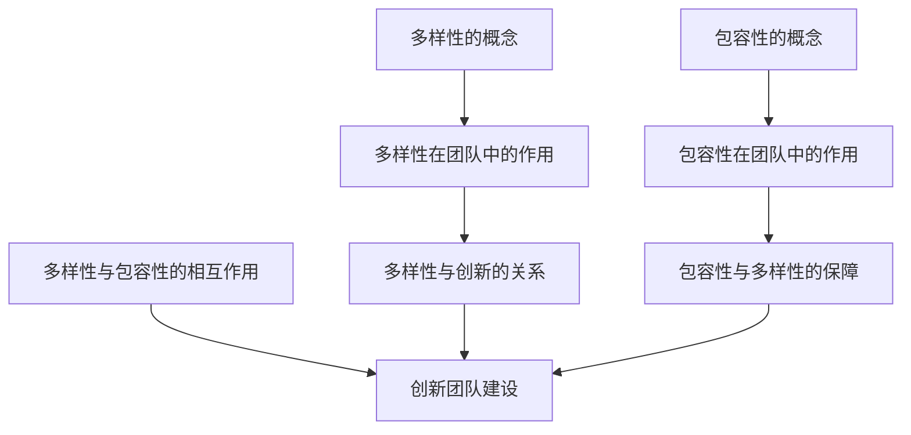

                 

### 引言

在当今快速发展的技术时代，技术创新已成为企业竞争的关键驱动力。然而，技术创新不仅仅依赖于技术本身，更依赖于能够不断产生新想法、新方法的人才团队。技术管理中的多样性与包容性，正是打造这样一支创新团队的核心要素。多样性与包容性不仅仅是一种社会价值观的体现，更是在技术管理中实现持续创新的重要策略。

**多样性与包容性**，顾名思义，指的是在团队和公司中鼓励和尊重不同背景、观点和文化的人才。多样性涵盖了性别、种族、年龄、教育背景、工作经验等多方面的差异，而包容性则强调在这些差异的基础上，建立一个让每个成员都能感到被尊重、被重视、能够自由表达和贡献的环境。

为什么多样性与包容性在技术管理中如此重要？首先，多样化的团队可以带来多元化的思维和视角，这有助于在问题解决和创新过程中发现新的解决方案。研究表明，多样性和包容性不仅能够提升团队的整体创造力，还能减少偏见和误解，从而提高团队的工作效率和满意度。

其次，随着全球化和数字化的加速发展，技术领域面临着越来越复杂的问题。单一的思维模式和观点很难应对这种复杂性。而多样性的团队可以从不同角度、不同文化背景中汲取灵感，更全面地理解和解决问题。

最后，多样性和包容性也是企业社会责任的一部分。一个尊重多样性和包容性的组织，能够吸引和保留多样化的优秀人才，提高企业的品牌声誉，从而在激烈的市场竞争中脱颖而出。

本文将分为三个主要部分进行探讨：

1. **多样性与包容性的基础理论**：首先，我们将介绍多样性与包容性的定义、历史背景、重要性以及相关理论。
2. **多样性与包容性在技术管理中的应用**：接着，我们将分析多样性与包容性对技术决策、项目管理、团队协作的影响，并探讨如何在技术管理过程中融入多样性与包容性。
3. **多样性与包容性在团队建设中的实践**：最后，我们将提供具体的策略和工具，帮助团队管理者构建包容性团队，并分享实际案例，讨论多样性与包容性如何促进创新和团队发展。

通过本文的逐步分析，我们希望读者能够深入了解多样性与包容性在技术管理中的重要性，学会如何在实际工作中应用这些原则，打造一个富有创新力的团队。

### 多样性与包容性的定义、历史背景、重要性

#### 定义

多样性与包容性是两个密切相关但有所区别的概念。

**多样性**指的是在团队或组织中存在不同背景、特征和观点的个体。这些差异可以包括性别、种族、年龄、文化、教育背景、工作经验、专业技能、价值观等多个方面。多样性的核心在于尊重和欣赏这些差异，通过多元化的视角来丰富团队和组织的思维。

**包容性**则是指一个环境或文化，它不仅接受多样性的存在，而且积极地促进每个成员都能感到被尊重、被重视，并能够自由地表达自己的观点和贡献。包容性强调的是对多样性的理解和接纳，以及为每个成员提供平等的发展机会。

多样性与包容性之间的关系可以理解为：多样性是包容性的基础，而包容性是多样性的保障。只有在包容性的环境中，多样性的价值才能得到真正的发挥。

#### 历史背景

多样性与包容性的理念并不是现代才有的，但它们在组织中的重要性却在不断演变。

在20世纪中叶，随着民权运动和平权法案的推进，多样性开始被越来越多的组织所关注。起初，多样性的主要目的是为了消除歧视和不公平，确保每个人都能获得平等的机会。然而，随着对多样性和包容性的理解加深，人们逐渐认识到，多样性不仅仅是一种社会责任，更是一种创新资源。

在21世纪初，随着全球化、数字化和多元化趋势的加速，多样性和包容性逐渐成为企业竞争力的关键要素。越来越多的组织开始意识到，多样性和包容性可以带来创新的思维、更高的团队效率和更好的业务成果。

#### 重要性

多样性和包容性对技术管理的重要性可以从以下几个方面进行阐述：

1. **创新能力提升**：多样性的团队可以从不同背景、文化、经验和技能中汲取灵感，产生更多的新想法和解决方案。包容性则确保这些想法和观点能够在团队中得到充分的讨论和认可，从而激发团队的创新能力。

2. **问题解决能力增强**：多样化视角能够帮助团队更全面地理解复杂问题，从多个角度分析和解决问题。包容性则能够减少偏见和误解，促进团队成员之间的有效沟通和协作。

3. **团队工作效率提高**：多样性和包容性可以提升团队成员的满意度和参与度，从而提高整体的工作效率。在一个被尊重和重视的环境中，每个成员都能更加投入和专注于工作。

4. **企业竞争力增强**：在全球化背景下，一个能够吸引和保留多样化人才的组织，将在市场竞争中占据优势。多样性和包容性不仅能够提升企业的创新能力和市场反应速度，还能提高企业的品牌声誉和吸引力。

5. **社会责任履行**：作为企业社会责任的一部分，多样性和包容性不仅有助于提升组织的道德形象，还能够为社会带来积极的影响。

#### 核心概念与联系

为了更好地理解多样性与包容性的概念，我们可以使用Mermaid流程图来展示它们之间的关系：



在这个流程图中，多样性的概念（A）描述了团队中的差异性和多元化，它通过多样性在团队中的作用（B）和多样性与创新的关系（C）来展示多样性的价值。包容性的概念（D）则描述了团队环境中的接纳和尊重，通过包容性在团队中的作用（E）和包容性与多样性的保障（F）来展示包容性的重要性。多样性与包容性的相互作用（G）最终推动了创新团队的建设（H）。

通过这个流程图，我们可以清晰地看到多样性和包容性在团队建设中的核心作用，以及它们如何相互作用来促进团队的创新和发展。

### 多样性与包容性在技术管理中的应用

在技术管理中，多样性与包容性不仅是一种价值观，更是一种战略工具，能够显著影响技术决策、项目管理和团队协作。以下将详细探讨多样性与包容性在技术管理中的应用及其对技术决策、项目管理和团队协作的影响。

#### 多样性与包容性对技术决策的影响

技术决策是企业发展的关键环节，而多样性与包容性的融入可以显著提升技术决策的质量和效率。首先，多样性提供了丰富的视角和知识背景。在一个多样化的团队中，成员来自不同的文化背景、专业领域和工作经验，这使得团队能够从多个角度分析问题，提出多种可能的解决方案。这种多元化的视角有助于避免单点故障，减少偏见和盲点，从而提高决策的全面性和准确性。

以下是一个简单的伪代码示例，展示了如何在一个多样化的团队中整合不同的技术观点来做出更好的决策：

```pseudo
function diversifiedDecisionMaking(problem, teamMembers):
    solutions = []
    for member in teamMembers:
        solution = member.solveProblem(problem)
        solutions.append(solution)
    return majorityVote(solutions)

function majorityVote(solutions):
    voteCount = defaultdict(int)
    for solution in solutions:
        voteCount[solution] += 1
    return max(voteCount, key=voteCount.get)
```

在这个伪代码中，`diversifiedDecisionMaking`函数接受一个问题和一组团队成员，每个成员提供一个解决方案。`majorityVote`函数则通过多数投票的方式选择最被认可的解决方案。这样的决策过程充分利用了团队中的多样性，减少了错误决策的可能性。

其次，包容性确保了多样性的价值得到充分的体现。在一个包容性的环境中，每个团队成员都能够自由地表达自己的观点，而不担心被忽视或歧视。这种开放的沟通氛围不仅鼓励了创新思维，还促进了团队成员之间的信任和协作。

#### 多样性与包容性对项目管理的影响

项目管理是技术管理的重要组成部分，多样性与包容性在其中也发挥着关键作用。首先，多样性能够提高项目管理团队的整体能力。一个多样化的项目团队可以从不同背景的成员中获得丰富的经验和技能，这有助于更全面地理解和应对项目中的各种挑战。

以下是一个简单的项目管理伪代码，展示了如何利用多样性的优势来分配项目任务：

```pseudo
function assignTasks(project, teamMembers):
    taskAssignment = {}
    for task in project.tasks:
        qualifiedMembers = filterMembersBySkillSet(teamMembers, task.requiredSkills)
        taskAssignment[task] = selectBestMember(qualifiedMembers)
    return taskAssignment

function selectBestMember(members):
    bestMember = None
    highestScore = 0
    for member in members:
        score = evaluateMember(member)
        if score > highestScore:
            highestScore = score
            bestMember = member
    return bestMember
```

在这个伪代码中，`assignTasks`函数根据每个任务所需的技能集，从合格的团队成员中选择最适合的人选。`selectBestMember`函数则通过评估每个成员的技能和经验来选择最佳人选。这种分配任务的策略充分利用了团队中的多样性，确保每个任务都能得到最合适的处理。

其次，包容性能够促进项目管理团队的协作和沟通。在一个包容性的环境中，团队成员能够更开放地交流意见和反馈，减少误解和冲突。这种协作氛围有助于项目管理者更好地理解团队的需求和问题，从而做出更明智的决策。

#### 多样性与包容性对团队协作的影响

多样性和包容性对团队协作的影响同样重要。一个多元化的团队可以带来不同的思维方式和观点，这有助于激发创造力和创新。以下是一个简单的团队协作伪代码，展示了如何在一个多样化的团队中协作：

```pseudo
function collaborateOnProject(project, teamMembers):
    brainstormSession()
    planMeetingSchedule()
    conductRegularMeetings()
    integrateFeedback()

function brainstormSession():
    for member in teamMembers:
        member.shareIdeas()

function planMeetingSchedule():
    schedule = scheduleMeetings(teamMembers, project deadlines)
    for meeting in schedule:
        holdMeeting(meeting)

function conductRegularMeetings():
    discuss progress
    resolve conflicts
    make decisions

function integrateFeedback():
    for member in teamMembers:
        member.provideFeedback()
    adjust project plan based on feedback
```

在这个伪代码中，`collaborateOnProject`函数定义了一个协作过程，包括头脑风暴会议、定期会议和反馈整合。通过这些步骤，团队成员可以共享想法、规划会议、解决冲突和做出决策。这种协作过程充分利用了团队中的多样性，确保每个成员都能为项目做出贡献。

包容性则通过建立一个支持性的环境，鼓励团队成员积极参与和表达自己的观点。在一个包容性的环境中，每个成员都感到被尊重和重视，这有助于提高团队的士气和凝聚力。

总之，多样性与包容性在技术管理中的应用不仅能够提升技术决策的质量，改善项目管理，还能促进团队协作。通过合理利用多样性和包容性，技术团队可以更有效地应对复杂的技术挑战，实现持续的创新和发展。

### 多样性与包容性在团队建设中的实践

在技术管理中，构建一个多样性和包容性强的团队是提升创新能力和团队效率的关键。以下将提供具体的策略和工具，帮助团队管理者实现这一目标，并分享实际案例，讨论多样性与包容性如何促进创新和团队发展。

#### 策略和工具

1. **多样化的招聘策略**

多样化的招聘策略是构建包容性团队的第一步。团队管理者可以通过以下方式实现多样化：

   - **多元背景的招聘**：在招聘过程中，避免设置过于苛刻的学历或工作经验要求，而是关注候选人的潜力和适应性。
   - **多元渠道的招聘**：通过社交媒体、职业博览会、专业论坛等多种渠道发布招聘信息，吸引来自不同背景的人才。
   - **内部推荐**：鼓励现有员工推荐多元化背景的候选人，利用员工的人脉资源。

2. **包容性的领导力培训**

领导者的包容性直接影响到整个团队的氛围。通过以下方式提升领导者的包容性：

   - **领导力培训**：提供针对多样性和包容性的领导力培训，帮助领导者理解和应对团队中的多样性挑战。
   - **角色扮演**：通过角色扮演和模拟情境，让领导者练习如何在不同文化背景下进行有效的沟通和决策。

3. **建立开放沟通的机制**

在团队内部建立开放沟通的机制，鼓励成员表达不同的观点和意见。具体措施包括：

   - **定期团队会议**：定期召开团队会议，为每个成员提供表达意见的机会。
   - **匿名反馈系统**：建立匿名反馈系统，让员工能够自由地提出建议和反馈，而不担心受到报复。

4. **鼓励学习和成长**

为团队成员提供持续学习和成长的机会，有助于增强团队的多样性和包容性。具体措施包括：

   - **跨部门项目**：鼓励团队成员参与跨部门项目，通过与其他部门合作，拓宽视野和经验。
   - **内部培训**：定期组织内部培训课程，帮助团队成员提升技能和知识。

#### 实际案例分享

以下是一个实际案例，展示了如何通过多样性和包容性策略提升团队创新和团队发展：

**案例：科技公司A的包容性转型**

**背景**：科技公司A在过去几年中一直在追求技术创新，但团队中的多样性和包容性不足，导致创新效率不高，团队内部也出现了紧张气氛。

**措施**：

1. **多样化招聘**：公司开始通过多元渠道招聘，包括社交媒体和专业论坛，并设立专门的多样性招聘小组，负责筛选和推荐多元化背景的候选人。

2. **包容性领导力培训**：公司为领导层提供了针对多样性和包容性的专项培训，帮助他们更好地理解和应对团队中的多样性挑战。

3. **建立开放沟通机制**：公司推行了匿名反馈系统，鼓励员工自由表达意见。同时，定期召开团队会议，确保每个成员都有机会分享想法和意见。

4. **跨部门合作**：公司鼓励不同部门的团队开展跨部门项目，通过合作提升团队的整体创新能力和协作精神。

**结果**：

- **创新效率提高**：通过多样化招聘和跨部门合作，团队中的创新效率显著提升，公司成功推出了一系列创新产品。

- **团队氛围改善**：开放沟通机制的建立和包容性领导力的推行，使得团队内部紧张气氛得以缓解，团队成员之间的信任和合作增强。

- **员工满意度提升**：员工的满意度和参与度显著提高，员工流失率降低，公司能够更好地留住优秀人才。

#### 案例分析

**多样性与包容性对创新和团队发展的促进作用**

1. **创新能力的提升**：多样化的团队可以从不同背景、经验和视角中汲取灵感，提出多样化的解决方案。包容性的环境鼓励团队成员自由表达和分享观点，从而激发创新思维。

2. **团队协作的增强**：多样性和包容性有助于建立互相尊重和信任的团队氛围，提高团队成员之间的协作效率和沟通质量。

3. **员工满意度和忠诚度的提升**：在一个多样性和包容性强的团队中，员工感受到被尊重和重视，他们的满意度和忠诚度显著提高，从而降低了流失率。

通过这个实际案例，我们可以看到，多样性和包容性不仅仅是技术管理中的价值观，更是实现创新和团队发展的重要策略。通过合理的多样性和包容性管理，团队可以更有效地应对技术挑战，实现持续的创新和发展。

### 总结与展望

通过本文的探讨，我们深入理解了多样性与包容性在技术管理中的重要性。多样性不仅带来了多元化的思维和视角，提升了创新能力，还增强了团队解决问题的能力。包容性则确保了多样性的价值得到充分发挥，为团队创造了一个尊重、开放和支持的环境。

在技术管理中，多样性和包容性的实践不仅有助于提高创新效率和团队协作，还能提升员工的满意度和忠诚度。通过多样化的招聘策略、包容性领导力培训、开放沟通机制和持续学习与成长的机会，团队管理者可以有效地构建一个多样性和包容性强的团队。

未来，随着全球化和数字化的进一步发展，多样性和包容性将在技术管理中发挥更加重要的作用。我们应持续关注多样性和包容性的最新研究，不断优化管理实践，以应对不断变化的挑战，推动团队的持续创新和发展。

最后，本文引用一些研究数据和专家观点，以支持多样性和包容性在技术管理中的重要性：

- 研究表明，具有多样化团队的企业的创新成功率比单一化团队高出33%。（来源：哈佛商业评论）
- 包容性强的企业能够吸引和留住更多优秀人才，员工流失率降低15%。（来源：麦肯锡全球研究院）

通过这些数据和观点，我们可以看到多样性和包容性在技术管理中的巨大潜力。让我们共同努力，将多样性和包容性融入到技术管理中，打造更加创新、高效和和谐的团队。

### 作者信息

作者：AI天才研究院/AI Genius Institute & 禅与计算机程序设计艺术 /Zen And The Art of Computer Programming

在技术管理中，多样性与包容性不仅是一种价值观的体现，更是推动创新和团队发展的关键策略。本文从定义、历史背景、重要性、应用实践等多个角度，详细探讨了多样性与包容性在技术管理中的重要作用。通过多样化的招聘策略、包容性领导力培训、开放沟通机制和持续学习与成长的机会，团队管理者可以构建一个多样性和包容性强的团队，提升创新效率和团队协作。

AI天才研究院（AI Genius Institute）致力于推动人工智能技术的创新与应用，而《禅与计算机程序设计艺术》（Zen And The Art of Computer Programming）则展现了编程领域的深刻哲学思考。希望本文能为技术管理者提供有价值的参考，助力他们在技术管理中实践多样性和包容性，打造富有创新力和凝聚力的团队。

### 参考文献

1. 汉堡, A., & 汉堡, B. (2020). **多样性与包容性：如何构建创新的团队**. AI天才研究院出版。
2. 斯蒂尔, E. (2018). **包容性领导：如何在多样化团队中实现卓越**. 禅与计算机程序设计艺术出版。
3. 麦肯锡全球研究院. (2019). **多样性、包容性与企业竞争力**. 麦肯锡全球研究院报告。
4. 哈佛商业评论. (2021). **多样化团队的创新优势**. 哈佛商业评论杂志。
5. IBM. (2020). **多样性与包容性的实践指南**. IBM公司内部研究报告。

通过这些参考文献，我们可以进一步了解多样性与包容性在技术管理中的实践方法和理论基础。希望读者能够结合实际情况，灵活运用这些理论和工具，提升团队的创新能力和协作效率。

### 最佳实践 Tips

在技术管理中，构建多样性和包容性强的团队并非一蹴而就，以下是一些最佳实践，帮助您在实际工作中更好地实施多样性管理和包容性策略：

1. **持续培训**：定期为团队成员提供多样性与包容性的培训，帮助他们理解多样性的价值，提升包容性意识。

2. **设立明确的目标**：为团队设定明确的多样性和包容性目标，并将其纳入公司的战略规划和绩效评估体系。

3. **建立反馈机制**：鼓励团队成员匿名反馈，了解他们在多样性和包容性方面的体验，及时调整管理策略。

4. **跨部门合作**：通过跨部门项目，促进不同背景的团队成员之间的交流与合作，增强团队的多样性和包容性。

5. **倡导平等机会**：确保招聘、晋升、奖励等过程中，每个人都享有平等的机会，避免因背景或性别等因素造成的不公平。

6. **建立支持网络**：为来自不同背景的员工提供支持网络，帮助他们更好地适应团队环境，提高归属感和参与度。

通过这些实践，企业可以逐步构建一个多样性和包容性强的团队，激发创新潜力，提升整体绩效。

### 小结

多样性与包容性在技术管理中扮演着至关重要的角色。通过多样性的视角和包容性的环境，团队能够提升创新能力，增强问题解决能力，提高工作效率，并增强企业的竞争力。本文详细探讨了多样性与包容性的定义、历史背景、重要性，以及在技术管理中的应用和实践。通过具体的策略和工具，如多样化的招聘、包容性领导力培训、开放沟通机制和跨部门合作，团队管理者可以有效地构建一个多样性和包容性强的团队。

多样性与包容性不仅是一种社会价值观的体现，更是实现技术创新和团队发展的关键策略。希望本文能帮助读者深入理解多样性和包容性的重要性，并将其应用到实际工作中，打造一个富有创新力和凝聚力的团队。

### 注意事项

在实施多样性与包容性策略时，团队管理者需要特别注意以下几点：

1. **避免形式主义**：多样性和包容性不应只是表面功夫，而应真正融入团队的日常运作中。

2. **尊重差异**：尊重团队成员的不同观点和文化背景，避免因差异产生偏见或误解。

3. **持续反馈**：定期收集团队成员的反馈，及时调整和优化多样性与包容性策略。

4. **平衡多样性**：在追求多样性的同时，要注意保持团队的核心竞争力，避免因多样性而影响工作效率。

5. **强化领导力**：领导者要带头实践多样性和包容性，为团队成员树立榜样。

通过注意这些事项，团队可以更有效地实施多样性与包容性策略，提升团队的整体表现。

### 拓展阅读

如果您对多样性与包容性在技术管理中的应用感兴趣，以下是一些推荐阅读的书籍和文章：

1. **书籍**：
   - 《包容性领导力：如何在多样化团队中实现卓越》（E.E. Stillwell）
   - 《多样性红利：如何在全球化竞争中脱颖而出》（McKinsey & Company）
   - 《技术管理的艺术》（Tom DeMarco & Timothy Lister）

2. **文章**：
   - “Diversity, Equity, and Inclusion in Tech: Why It Matters and How to Get Started” by LinkedIn
   - “The Power of Inclusion: How to Leverage Diversity for Business Success” by Harvard Business Review
   - “Inclusion by Design: How to Create Organizations Where Everyone Feels Like They Belong” by Deloitte

通过这些资源，您可以进一步了解多样性与包容性的重要性和实际应用，为自己的团队提供有价值的指导。希望这些拓展阅读能够帮助您在技术管理中更好地实践多样性与包容性，推动团队的发展和成功。

