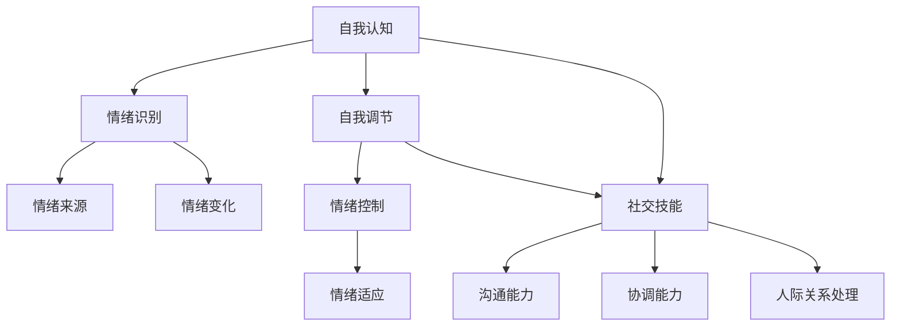

                 

### 概述

在技术管理领域，情商（Emotional Intelligence，简称EQ）正逐渐成为影响团队协作、项目推进以及组织成功的重要因素。情商不仅涉及个人情绪的识别和管理，还涵盖了与他人有效沟通和建立良好人际关系的能力。本文旨在探讨技术管理中的情商，分析其重要性以及如何在实际工作中提升和运用。

首先，情商在技术管理中的重要性不言而喻。技术团队往往由不同背景、技能和性格的人组成，如何协调这些差异，确保团队高效协作，是技术管理者面临的一大挑战。情商在这个过程中起到了关键作用，它帮助管理者识别团队成员的情绪状态，调整自己的沟通方式，从而减少冲突，提高团队凝聚力。

本文将按照以下结构展开：

1. **背景介绍**：介绍情商的概念及其在技术管理中的重要性。
2. **核心概念与联系**：通过Mermaid流程图，展示情商的核心概念及其相互关系。
3. **核心算法原理讲解**：使用伪代码阐述情商评估和提升的方法。
4. **数学模型和公式**：讨论情商评估中的数学模型，并通过实例进行解释。
5. **项目实战**：分析实际案例，展示情商在技术管理中的应用。
6. **最佳实践与拓展阅读**：总结本文的重点，并提供进一步学习的资源。

通过这样的结构，我们希望能够帮助读者系统地理解情商在技术管理中的重要性，并提供实用的提升技巧和实际案例。

---

**关键词**：情商、技术管理、团队协作、沟通、冲突管理、情绪识别、情绪调节、社交技能

**摘要**：
本文探讨了情商在技术管理中的重要性，从核心概念、评估方法到实际应用，通过理论讲解和案例分析，为技术管理者提供了一整套提升情商和团队协作效率的策略和工具。

## 背景介绍

情商，即情绪智力，是指个体识别、理解、调节和管理自己以及他人情绪的能力。它与传统的智力（IQ）不同，更注重情感和人际关系的处理。情商的概念最早由心理学家约翰·梅耶（John D. Mayer）和彼得·萨洛维（Peter Salovey）在1990年提出，他们将其定义为“识别和利用情绪信息以指导思维和行动的能力”。随后，心理学家丹尼尔·戈尔曼（Daniel Goleman）在1995年的著作《情商》中进一步扩展了这一概念，提出了情商包括五大要素：自我认知、自我调节、社会认知、社交技能和动机。

在技术管理领域，情商的重要性尤为突出。首先，技术团队往往由不同背景的成员组成，他们可能在专业技能上各有优势，但在情绪处理上可能存在差异。管理者需要具备高情商，能够识别和理解团队成员的情绪状态，从而更好地协调团队。其次，技术项目通常涉及复杂的沟通和协作，管理者需要具备出色的社交技能，以确保信息的准确传达和团队成员的顺畅合作。此外，技术管理者在项目推进过程中难免会遇到冲突，高情商可以帮助他们有效处理这些冲突，保持团队的和谐与高效。

总的来说，情商在技术管理中的作用主要体现在以下几个方面：

1. **团队协作**：高情商的管理者能够识别和满足团队成员的情感需求，促进团队合作，提高整体效率。
2. **沟通**：情商有助于管理者改善沟通方式，减少误解和冲突，提升团队内部的沟通质量。
3. **冲突管理**：通过理解他人的情绪，管理者能够更有效地解决团队内部的矛盾，维护团队和谐。
4. **决策制定**：情商有助于管理者在复杂情境中保持冷静，做出更为明智的决策。

综上所述，情商不仅对个人职业发展至关重要，更是技术管理成功的关键因素。了解和提升情商，对于技术管理者来说，是提升领导力、管理能力和团队协作效率的必由之路。

### 核心概念与联系

情商的三大核心维度包括自我认知、自我调节和社交技能，这些维度相互联系，共同构成了情商的整体框架。首先，自我认知是指个体对自己情绪状态的识别和理解能力，包括情绪的识别、情绪的来源和情绪的变化。其次，自我调节是指个体管理和调整自己情绪状态的能力，包括情绪控制和情绪适应。最后，社交技能是指个体在社交场合中处理人际关系、沟通和协调的能力。

为了更直观地展示这些核心概念及其相互关系，我们可以通过Mermaid流程图来描述它们：



在上述流程图中，自我认知和自我调节构成了情商的基础，它们共同决定了个体如何处理自己的情绪。情绪识别帮助个体理解自己的情绪，情绪来源帮助个体识别情绪的触发因素，情绪变化则反映了情绪在时间上的动态变化。自我调节包括情绪控制和情绪适应，前者帮助个体在面对压力和挑战时保持冷静，后者则使个体能够适应不同情境下的情绪变化。

社交技能则是情商的延伸，它决定了个体如何与他人互动。沟通能力是社交技能的核心，包括倾听、表达和反馈，这些技能有助于建立和维护健康的人际关系。协调能力和人际关系处理则进一步扩展了社交技能的应用范围，使个体能够在团队和项目中有效地协调各方利益，处理复杂的社交局面。

通过这一流程图，我们可以清晰地看到情商的各个维度是如何相互联系和作用的。自我认知和自我调节为社交技能提供了基础，而社交技能则通过沟通和协调进一步强化了情商的整体效果。这种相互关系不仅有助于个体在职业和技术环境中更好地应对挑战，也为其在团队中发挥领导作用提供了必要的支持。

### 核心算法原理讲解

在理解情商的核心概念后，接下来我们将探讨如何评估和提升情商。评估情商的算法通常涉及几个关键步骤，包括数据收集、特征提取和综合评估。以下是一个简单的伪代码，用于说明情商评估的过程：

```plaintext
// 伪代码：情商评估算法
function AssessEmotionalIntelligence(individual):
    // 数据收集
    selfAwarenessScore = CollectSelfAwarenessData(individual)
    selfRegulationScore = CollectSelfRegulationData(individual)
    socialSkillsScore = CollectSocialSkillsData(individual)

    // 特征提取
    selfAwarenessFeatures = ExtractFeatures(selfAwarenessScore)
    selfRegulationFeatures = ExtractFeatures(selfRegulationScore)
    socialSkillsFeatures = ExtractFeatures(socialSkillsScore)

    // 综合评估
    totalScore = CombineFeatures(selfAwarenessFeatures, selfRegulationFeatures, socialSkillsFeatures)
    emotionalIntelligenceRating = CalculateRating(totalScore)

    // 输出评估结果
    return emotionalIntelligenceRating

// 辅助函数
function CollectSelfAwarenessData(individual):
    // 通过问卷或自我报告收集数据
    return CollectSurveyResponses(individual)

function CollectSelfRegulationData(individual):
    // 通过观察和第三方反馈收集数据
    return CollectObserverFeedback(individual)

function CollectSocialSkillsData(individual):
    // 通过社交活动和绩效评估收集数据
    return CollectPerformanceData(individual)

function ExtractFeatures(scoreData):
    // 从数据中提取关键特征
    return ExtractKeyFeatures(scoreData)

function CombineFeatures(feature1, feature2, feature3):
    // 对不同维度的特征进行综合评估
    combinedFeature = (feature1 * weight1) + (feature2 * weight2) + (feature3 * weight3)
    return combinedFeature

function CalculateRating(combinedFeature):
    // 根据综合得分计算情商评级
    if combinedFeature >= highThreshold:
        return "High"
    else if combinedFeature >= mediumThreshold:
        return "Medium"
    else:
        return "Low"
```

在上面的伪代码中，`AssessEmotionalIntelligence`函数是核心评估函数，它首先收集个体在自我认知、自我调节和社交技能方面的数据。然后，通过`ExtractFeatures`函数从这些数据中提取关键特征。最后，使用`CombineFeatures`函数将这些特征综合起来，并使用`CalculateRating`函数计算情商评级。

具体来说，`CollectSelfAwarenessData`函数通过问卷或自我报告的方式收集数据，而`CollectSelfRegulationData`和`CollectSocialSkillsData`则分别通过观察和第三方反馈、社交活动和绩效评估来收集数据。`ExtractFeatures`函数从这些数据中提取关键特征，例如自我认知中的情绪识别能力、自我调节中的情绪控制和适应能力，以及社交技能中的沟通能力和人际关系处理能力。

综合评估是通过`CombineFeatures`函数来实现的，它对每个维度的特征进行加权综合。权重可以根据实际情况进行调整，以确保各个维度在综合评分中的重要性得到合理体现。最后，`CalculateRating`函数根据综合得分来评定个体的情商水平，从而提供具体的情商评估结果。

通过这样的算法，我们可以系统地评估个体的情商，并为其提供有针对性的提升建议。这不仅有助于个人发展，也为组织在人才管理和团队建设方面提供了科学依据。

### 数学模型和公式

在情商评估中，数学模型和公式扮演着重要角色，它们帮助我们对复杂的数据进行量化分析，从而更准确地评估个体的情商水平。以下是几个常用的数学模型和公式，通过具体实例来说明如何应用这些模型。

#### 1. 线性回归模型

线性回归模型是一种基本的统计方法，用于预测一个变量（因变量）与一个或多个其他变量（自变量）之间的关系。在情商评估中，我们可以使用线性回归模型来预测某个特定维度的情商评分。

**公式：**
$$
\hat{y} = b_0 + b_1 \cdot x
$$

其中，$y$是情商评分，$x$是影响情商的某个自变量，$b_0$是截距，$b_1$是斜率。

**实例：** 假设我们要评估自我调节能力，收集了10个团队成员的情绪控制得分和情绪适应得分。我们使用情绪控制得分（$x_1$）和情绪适应得分（$x_2$）来预测自我调节得分（$y$）。通过最小二乘法，我们可以计算出斜率和截距。

**伪代码：**
```plaintext
// 伪代码：线性回归模型计算
function LinearRegression(x1, x2, y):
    // 计算斜率和截距
    b1 = (N * Σ(x1 * y) - Σx1 * Σy) / (N * Σ(x1^2) - (Σx1)^2)
    b0 = (Σy - b1 * Σx1) / N

    // 返回斜率和截距
    return (b0, b1)
```

**计算过程：**
- $N$ 是团队成员的总数。
- $Σ$ 表示求和。

#### 2. 决策树模型

决策树模型是一种用于分类和回归的强大工具，可以用于构建复杂的决策路径，帮助我们理解不同因素对情商评估的影响。

**公式：**
$$
\text{Node Split} = \frac{Gini(\text{left}) + Gini(\text{right}) - Gini(\text{split})}{N}
$$

其中，$Gini$ 是基尼不纯度，$N$ 是当前节点的样本数量，$\text{left}$ 和 $\text{right}$ 分别代表左右子节点。

**实例：** 假设我们使用决策树模型来评估社交技能，包括沟通能力、协调能力和人际关系处理能力。我们通过计算每个特征对社交技能的基尼不纯度差异来决定节点的划分。

**伪代码：**
```plaintext
// 伪代码：决策树模型划分
function DecisionTreeSplit(features, labels):
    // 计算基尼不纯度差异
    GiniDifference = GiniImpurity(features) - (GiniImpurity(left) + GiniImpurity(right))

    // 判断是否继续划分
    if GiniDifference > threshold:
        // 划分左右子节点
        leftFeatures, rightFeatures = SplitFeatures(features)
        leftLabels, rightLabels = SplitLabels(labels)
        return DecisionTreeSplit(leftFeatures, leftLabels), DecisionTreeSplit(rightFeatures, rightLabels)
    else:
        return None
```

**计算过程：**
- $GiniImpurity$ 函数用于计算当前节点的基尼不纯度。
- $SplitFeatures$ 和 $SplitLabels$ 函数用于根据特征划分左右子节点。

#### 3. 神经网络模型

神经网络模型是一种通过多层节点进行信息处理的模型，常用于复杂的非线性问题。在情商评估中，我们可以使用神经网络模型来建立复杂的情绪评估模型。

**公式：**
$$
\text{Output} = \sigma(\sum_{i=1}^{n} w_i \cdot a_i)
$$

其中，$w_i$ 是权重，$a_i$ 是输入特征，$\sigma$ 是激活函数。

**实例：** 假设我们使用神经网络模型来评估情商，输入特征包括自我认知、自我调节和社交技能的得分。

**伪代码：**
```plaintext
// 伪代码：神经网络模型评估
function NeuralNetworkAssessment(inputs):
    // 初始化权重
    weights = InitializeWeights()

    // 计算神经网络的输出
    output = 0
    for i in range(n):
        output += weights[i] * inputs[i]
    output = Sigmoid(output)

    // 返回输出结果
    return output

function Sigmoid(x):
    return 1 / (1 + e^{-x})
```

**计算过程：**
- $e$ 是自然对数的底数。
- $Sigmoid$ 函数是一个常见的激活函数，用于将输出值转换为概率分布。

通过这些数学模型和公式，我们可以对情商进行量化和评估，从而更科学地理解和提升个体的情商水平。

### 项目实战

为了更好地展示情商在技术管理中的实际应用，我们将通过一个实际项目案例进行深入分析。该项目是一个跨部门合作的大型软件开发项目，目标是开发一款企业级客户关系管理（CRM）系统。

#### 项目背景

该项目由公司内部的研发部、市场部和客户服务部共同发起，目的是提升公司在客户关系管理方面的效率和客户满意度。项目涉及多个技术领域，包括前端开发、后端服务、数据库设计和移动应用开发。团队成员来自不同的部门，具有不同的技术背景和沟通习惯，这对项目的顺利推进提出了挑战。

#### 项目执行中的情商应用

在项目启动阶段，项目经理意识到团队协作的关键在于成员之间的有效沟通和情绪管理。以下是在项目执行过程中，项目经理如何运用情商提升团队协作效率的几个实例：

1. **有效沟通技巧**：
   - **倾听**：在项目规划会议上，项目经理特别注重倾听团队成员的意见和需求。通过耐心倾听，项目经理能够更好地理解每个成员的期望和担忧，从而减少误解和冲突。
   - **表达**：在向团队成员传达任务和目标时，项目经理使用清晰、简洁的语言，确保信息的准确传达。同时，项目经理还会使用非言语沟通，如肢体语言和表情，来增强表达效果。
   - **反馈**：项目经理建立了定期的反馈机制，鼓励团队成员提供项目进展和意见。这种开放的反馈环境有助于团队成员之间的信任建立和协作。

2. **冲突管理**：
   - **识别冲突**：在项目推进过程中，项目经理通过定期团队交流和观察，及时发现潜在的冲突。例如，当两个团队成员在功能实现上存在分歧时，项目经理及时介入，避免冲突升级。
   - **处理冲突**：项目经理采用基于事实的冲突解决策略，通过分析问题根源，找到解决方案。例如，在一个技术选择争议中，项目经理组织了一次技术研讨会，让团队成员共同探讨最佳方案，最终达成一致。
   - **团队恢复**：在冲突解决后，项目经理会组织团队成员进行反思和总结，确保冲突不会再次发生。同时，项目经理还会通过表扬和奖励来恢复团队的积极氛围。

3. **社交技能提升**：
   - **人际关系建立**：项目经理通过组织团队建设活动和社交聚会，促进团队成员之间的了解和信任。这种人际关系的建立有助于提高团队的整体协作效率。
   - **激励**：项目经理善于运用正面激励来提升团队士气。在项目里程碑达成时，项目经理会公开表扬和奖励表现突出的团队成员，激励他们继续保持良好的工作状态。

#### 项目成果与经验总结

通过在项目中运用情商管理技巧，项目团队取得了显著的成果：

- **团队协作**：团队成员之间的沟通更加顺畅，协作效率提高，项目进度按计划推进。
- **冲突减少**：通过有效的冲突管理和团队恢复策略，项目团队保持了稳定的工作氛围，减少了因冲突导致的工作中断。
- **客户满意度**：项目的最终交付产品得到了客户的认可，客户满意度显著提升，为公司赢得了更多的市场份额。

经验总结：

1. **倾听和沟通**：项目经理通过倾听和有效沟通，建立了团队成员之间的信任，提高了团队协作效率。
2. **冲突管理**：项目经理的及时介入和基于事实的冲突解决策略，确保了项目的顺利推进。
3. **社交技能**：通过人际关系建立和正面激励，项目经理提升了团队的士气和凝聚力。

这个实际案例充分展示了情商在技术管理中的应用效果，为其他技术管理者提供了宝贵的参考和借鉴。

### 最佳实践与小结

在技术管理中，情商的有效运用不仅能提高团队协作效率，还能显著减少冲突，提升整体项目成功率。以下是总结的最佳实践建议：

1. **倾听与沟通**：定期组织团队沟通会议，倾听团队成员的意见和需求，确保信息的准确传达。
2. **冲突管理**：建立冲突预防机制和快速响应流程，采用事实导向的解决策略，确保团队稳定。
3. **社交技能**：通过团队建设活动和正面激励，提升团队士气，建立健康的人际关系。

**注意事项**：
- **文化差异**：在跨国团队中，要特别注意文化差异，尊重不同文化背景下的沟通和冲突处理方式。
- **个性化关怀**：每个团队成员都有其独特的情感需求，管理者应关注个体差异，提供个性化的支持。

**拓展阅读**：
- 《情商：为什么情商比智商更重要》（作者：丹尼尔·戈尔曼）
- 《技术团队管理实战：高效协作与冲突管理》（作者：马克·塞德尔）

通过学习和实践这些最佳策略，技术管理者可以在复杂的技术环境中更好地发挥领导力，实现项目的成功。

