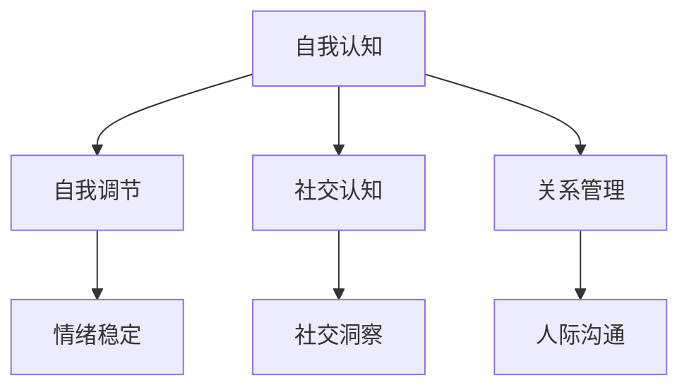

                 

### 情绪智能在技术管理中的重要性

情绪智能，也被称作情商（Emotional Intelligence，简称EQ），是一种理解和管理自己及他人情绪的能力。在技术管理中，情绪智能的重要性不容忽视。技术团队往往面临复杂的项目任务、激烈的市场竞争和不断变化的技术环境，这些因素都会对团队成员的情绪产生重大影响。情绪智能作为一种软技能，对提升团队整体效能有着直接和间接的影响。

#### 背景介绍

技术管理是一个涉及项目规划、资源分配、团队协调等多方面的复杂过程。在传统的管理模式中，技术管理者更注重技术能力和项目进度，往往忽视了团队成员的情绪和需求。然而，随着敏捷开发、DevOps等现代管理理念的不断推广，人们逐渐认识到，情绪智能在技术管理中的重要性不容忽视。情绪智能能够帮助技术管理者更好地应对团队内部的冲突，提升团队的协作能力，从而提高项目成功率。

#### 核心概念与联系

情绪智能主要涵盖以下几个核心概念：

1. **自我认知（Self-awareness）**：了解自己的情绪状态，包括情绪的类型、原因和影响。
2. **自我调节（Self-regulation）**：控制和调整自己的情绪，使其适应不同的环境和任务。
3. **社交认知（Social awareness）**：理解他人的情绪，并从中获取社交信息。
4. **关系管理（Relationship management）**：建立和维持健康的人际关系，有效解决冲突。

这些概念之间有着紧密的联系。例如，自我认知是自我调节的基础，只有了解自己的情绪，才能进行有效的调节。而社交认知和关系管理则侧重于与他人互动，帮助技术管理者更好地理解和应对团队中的情绪问题。

下面是情绪智能核心概念之间的Mermaid流程图：



#### 核心算法原理讲解

为了更深入地理解情绪智能在技术管理中的应用，我们可以使用伪代码来阐述几个关键算法原理。

**1. 自我认知评估算法：**

```plaintext
function 自我认知评估（情绪日志）:
    初始化情绪评分（score）为0
    对于每条情绪日志：
        如果情绪日志中的情绪类型是积极情绪：
            score += 1
        否则：
            score -= 1
    返回 score / 情绪日志总数
end function
```

**2. 自我调节策略算法：**

```plaintext
function 自我调节（当前情绪，目标情绪）:
    如果当前情绪 ≠ 目标情绪：
        如果当前情绪是积极情绪：
            保持当前情绪状态
        否则：
            执行情绪调节策略，例如深呼吸、冥想或进行身体锻炼
    等待一段时间，重新评估当前情绪
    如果当前情绪 = 目标情绪：
        结束自我调节
    否则：
        重新执行自我调节策略
end function
```

**3. 社交认知与关系管理算法：**

```plaintext
function 社交认知评估（团队成员情绪日志）:
    初始化情绪评分（score）为0
    对于每个团队成员的情绪日志：
        如果团队成员的情绪日志中情绪类型是积极情绪：
            score += 1
        否则：
            score -= 1
    返回 score / 团队成员总数
end function

function 关系管理策略（团队成员情绪日志）:
    如果社交认知评估结果小于设定阈值：
        执行冲突解决策略，例如开诚布公的沟通或团队合作活动
    否则：
        保持现有人际关系，并进行定期情绪状态检查
end function
```

#### 数学模型和公式

在情绪智能的应用中，数学模型和公式可以帮助我们更精确地评估和管理情绪状态。以下是一个简单的情绪评估模型：

$$
E = \alpha \times S + \beta \times C + \gamma \times R
$$

其中：
- \( E \) 是情绪得分
- \( \alpha \), \( \beta \), 和 \( \gamma \) 是权重系数
- \( S \) 是自我认知得分
- \( C \) 是社交认知得分
- \( R \) 是关系管理得分

权重系数可以根据具体情况调整，以反映不同维度在情绪智能中的重要性。

#### 举例说明

假设有一个技术团队，其成员的情绪日志如下：

| 成员 | 自我认知得分 | 社交认知得分 | 关系管理得分 |
|------|--------------|--------------|--------------|
| 小明 | 8            | 7            | 9            |
| 小红 | 6            | 5            | 7            |
| 小李 | 7            | 8            | 6            |

使用上述情绪评估模型，我们可以计算出每个成员的情绪得分：

$$
E_{\text{小明}} = \alpha \times 8 + \beta \times 7 + \gamma \times 9
$$

$$
E_{\text{小红}} = \alpha \times 6 + \beta \times 5 + \gamma \times 7
$$

$$
E_{\text{小李}} = \alpha \times 7 + \beta \times 8 + \gamma \times 6
$$

根据具体情境调整权重系数后，可以得到每个成员的情绪得分，从而为团队的情绪管理提供数据支持。

#### 结论

情绪智能在技术管理中扮演着关键角色。通过自我认知、自我调节、社交认知和关系管理，技术管理者可以更好地应对团队中的情绪问题，提升团队凝聚力和整体效能。使用伪代码、数学模型和实际案例，我们可以更深入地理解情绪智能的核心算法原理和应用方法。在后续章节中，我们将进一步探讨情绪智能在具体技术管理情境中的实际应用，并分享实战经验和最佳实践。

