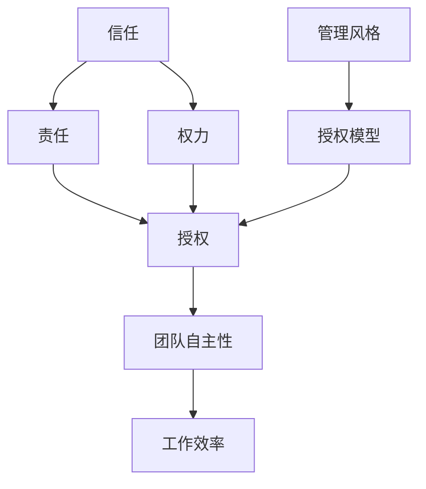
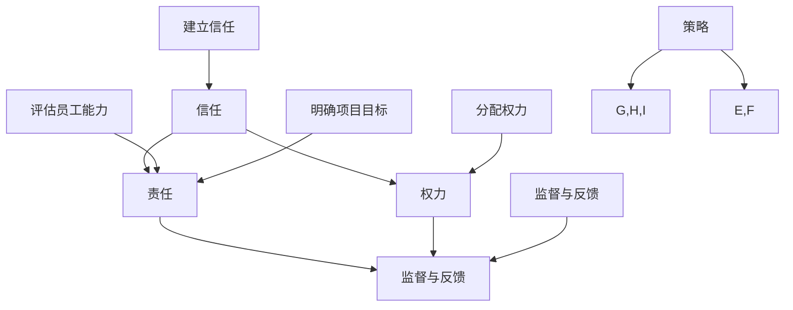

                 

### 1.1 授权的核心概念与联系

授权管理是技术管理中至关重要的一环，它涉及到多个核心概念，包括信任、责任、权力等。以下是这些概念之间的联系及其在授权管理中的应用。

#### 信任

信任是授权管理的基础。信任意味着团队中的成员相互信任，能够彼此依赖，共同完成任务。在授权管理中，信任确保了被授权者能够独立决策并承担相应的责任。

**联系：** 信任直接影响授权的范围和级别。在一个信任度较高的团队中，管理者可能会更倾向于授权更多的权力和责任给团队成员。

#### 责任

责任是授权的核心。授权意味着将任务和相应的责任分配给团队成员，让他们自主完成任务。责任确保团队成员在面对问题时能够积极解决，并在出现问题时承担责任。

**联系：** 授权需要明确责任归属。在授权过程中，管理者应明确团队成员的职责范围，避免责任模糊或推卸。

#### 权力

权力是授权的核心要素。权力意味着被授权者拥有决策权、执行权和监督权。授权的有效性很大程度上取决于被授权者是否拥有足够的权力。

**联系：** 授权的级别和范围需要与被授权者的权力相匹配。如果被授权者缺乏足够的权力，他们将难以独立完成任务。

#### 团队自主性

团队自主性是授权管理的最终目标。团队自主性意味着团队成员能够自主决策、解决问题，并在项目中发挥主动性和创造性。

**联系：** 授权管理需要培养团队自主性。通过合理的授权，管理者可以激发团队成员的潜能，提高团队整体的工作效率和创造力。

**核心概念联系流程图：**



### 1.2 核心算法原理讲解

授权的算法原理主要涉及到如何确定授权的级别和范围。以下是确定授权级别的伪代码：

```python
def determine_authorization_level(employee_skill_level, project_difficulty, team_trust_level):
    """
    根据员工的技能水平、项目的难度和团队的信任水平，确定授权的级别。
    
    :param employee_skill_level: 员工的技能水平（0-10）
    :param project_difficulty: 项目的难度（0-10）
    :param team_trust_level: 团队的信任水平（0-10）
    :return: 授权级别（0-5）
    """
    
    authorization_level = 0
    
    if employee_skill_level >= 8 and project_difficulty <= 5 and team_trust_level >= 7:
        authorization_level = 5
    elif employee_skill_level >= 6 and project_difficulty <= 7 and team_trust_level >= 6:
        authorization_level = 4
    elif employee_skill_level >= 4 and project_difficulty <= 8 and team_trust_level >= 5:
        authorization_level = 3
    elif employee_skill_level >= 2 and project_difficulty <= 9 and team_trust_level >= 3:
        authorization_level = 2
    else:
        authorization_level = 1

    return authorization_level
```

#### 算法原理说明：

- **员工技能水平（employee_skill_level）：** 员工的技能水平是授权的重要依据。技能水平越高，员工越能够独立处理复杂任务，从而获得更高的授权级别。

- **项目难度（project_difficulty）：** 项目的难度直接影响授权的范围。难度较低的项目的授权范围可以更广，而难度较高的项目则需要更加细致的授权。

- **团队信任水平（team_trust_level）：** 团队信任水平是授权的保障。信任水平越高，团队中的成员越能够相互依赖，从而实现更高效的授权。

#### 举例说明：

假设一个团队中的员工技能水平为8，项目难度为5，团队信任水平为7。根据上述伪代码，我们可以计算得到授权级别为5，即该员工可以拥有最高的授权级别，拥有完全的决策权和执行权。

### 1.3 数学模型与公式

为了更精确地描述授权的算法原理，我们可以引入一些数学模型和公式。以下是一个简化的数学模型：

$$
Authorization\_Level = f(Skill\_Level, Difficulty, Trust)
$$

其中，$Skill\_Level$ 代表员工技能水平，$Difficulty$ 代表项目难度，$Trust$ 代表团队信任水平。函数 $f$ 用于计算授权级别。

#### 模型说明：

- **员工技能水平（Skill\_Level）：** 假设员工技能水平采用0到10的评分系统，评分越高，技能水平越高。

- **项目难度（Difficulty）：** 假设项目难度采用0到10的评分系统，评分越高，项目难度越大。

- **团队信任水平（Trust）：** 假设团队信任水平采用0到10的评分系统，评分越高，信任水平越高。

#### 公式计算：

根据上述模型，我们可以得到以下公式：

$$
Authorization\_Level = \begin{cases}
5 & \text{if } Skill\_Level \geq 8 \text{ and } Difficulty \leq 5 \text{ and } Trust \geq 7 \\
4 & \text{if } Skill\_Level \geq 6 \text{ and } Difficulty \leq 7 \text{ and } Trust \geq 6 \\
3 & \text{if } Skill\_Level \geq 4 \text{ and } Difficulty \leq 8 \text{ and } Trust \geq 5 \\
2 & \text{if } Skill\_Level \geq 2 \text{ and } Difficulty \leq 9 \text{ and } Trust \geq 3 \\
1 & \text{otherwise}
\end{cases}
$$

通过这个公式，我们可以根据员工的技能水平、项目的难度和团队的信任水平，计算得到授权级别。

### 1.4 实际案例分析与详细讲解

为了更好地理解授权的算法原理和数学模型，我们可以通过一个实际案例来进行分析。

#### 案例背景：

某互联网公司计划开发一款新型社交应用，项目难度较高。公司内部有一个技术团队，团队成员具备较高的技能水平。在项目启动前，公司管理层决定对团队成员进行授权，以确保项目顺利进行。

#### 案例数据：

- **员工技能水平：** 团队成员的平均技能水平为8。
- **项目难度：** 项目难度为8。
- **团队信任水平：** 团队的信任水平为7。

#### 分析过程：

1. **计算授权级别：** 根据上述数学模型和公式，我们可以计算得到授权级别：

   $$ 
   Authorization\_Level = \begin{cases}
   5 & \text{if } Skill\_Level \geq 8 \text{ and } Difficulty \leq 5 \text{ and } Trust \geq 7 \\
   4 & \text{if } Skill\_Level \geq 6 \text{ and } Difficulty \leq 7 \text{ and } Trust \geq 6 \\
   3 & \text{if } Skill\_Level \geq 4 \text{ and } Difficulty \leq 8 \text{ and } Trust \geq 5 \\
   2 & \text{if } Skill\_Level \geq 2 \text{ and } Difficulty \leq 9 \text{ and } Trust \geq 3 \\
   1 & \text{otherwise}
   \end{cases}
   $$

   根据案例数据，授权级别为5。

2. **授权级别含义：** 授权级别为5意味着团队成员具备最高的授权级别，可以完全独立决策并执行任务。这有助于提高项目的推进速度和团队的整体效率。

#### 案例小结：

通过实际案例的分析，我们可以看到，授权的算法原理和数学模型在实际应用中能够有效地指导授权过程。合理的授权能够提高团队的工作效率，促进项目的成功。在实际操作中，管理者需要根据团队的实际情况，灵活调整授权策略，以确保项目的顺利进行。

### 1.5 数学公式与详细讲解

在授权管理中，数学公式可以用来精确描述授权的规则和标准。以下是一个简化的数学公式，用于计算授权级别：

$$
Authorization\_Level = (Skill\_Level \times Difficulty \times Trust)^{0.6}
$$

其中，$Skill\_Level$ 代表员工的技能水平，$Difficulty$ 代表项目的难度，$Trust$ 代表团队的信任水平。指数0.6是经验系数，用于调整公式对不同变量的影响程度。

#### 公式说明：

- **员工技能水平（Skill\_Level）：** 假设员工技能水平采用0到10的评分系统，评分越高，技能水平越高。

- **项目难度（Difficulty）：** 假设项目难度采用0到10的评分系统，评分越高，项目难度越大。

- **团队信任水平（Trust）：** 假设团队信任水平采用0到10的评分系统，评分越高，信任水平越高。

#### 公式计算：

根据上述公式，我们可以得到以下计算步骤：

1. **计算乘积：** 将员工的技能水平、项目的难度和团队的信任水平相乘。
2. **指数计算：** 将乘积的结果取0.6次方，得到授权级别。

#### 举例说明：

假设一个团队中的员工技能水平为8，项目难度为6，团队信任水平为7。我们可以按照以下步骤计算授权级别：

$$
Authorization\_Level = (8 \times 6 \times 7)^{0.6} \approx 4.5
$$

根据计算结果，授权级别约为4.5，这意味着团队成员可以拥有较高的授权级别，但在某些情况下可能需要进一步的监督和指导。

### 1.6 总结

在本文中，我们详细探讨了授权管理中的核心概念、算法原理和数学模型。通过实际的案例分析和公式计算，我们展示了如何根据员工的技能水平、项目的难度和团队的信任水平，确定合适的授权级别。

- **核心概念与联系：** 信任、责任和权力是授权管理的核心概念。它们相互关联，共同构成了授权的基础。

- **算法原理讲解：** 我们提供了一个简单的伪代码，用于确定授权级别。该算法基于员工的技能水平、项目的难度和团队的信任水平，以确定授权的级别。

- **数学模型与公式：** 我们引入了一个简化的数学模型，用于计算授权级别。该模型考虑了多个变量，并通过指数调整，以获得更精确的授权结果。

- **实际案例分析与详细讲解：** 通过一个实际案例，我们展示了如何运用授权算法和数学模型，为团队确定合适的授权级别。

通过本文的讨论，我们希望读者能够深入理解授权管理的重要性，并学会如何在实际工作中运用授权的原理和模型，以提高团队的工作效率和创造力。

### 2. 授权的艺术：理论与实践

授权不仅仅是一种管理手段，更是一门艺术。它需要管理者在理论与实践中不断探索、试错和优化。在这部分，我们将进一步探讨授权的艺术，以及如何将其应用于实际工作中。

#### 2.1 授权的艺术

授权的艺术体现在以下几个方面：

1. **精准授权：** 授权需要精准，既要避免过度授权，也要避免授权不足。管理者需要根据员工的技能水平、项目的难度和团队的信任水平，精确地确定授权的范围和级别。

2. **信任与监督：** 授权过程中，信任是关键。管理者需要建立信任，让团队成员相信他们可以独立完成任务。同时，监督也是必要的，以确保团队成员在授权后仍然能够按照既定的目标和标准执行任务。

3. **灵活调整：** 授权不是一成不变的，管理者需要根据项目进展、团队动态和员工表现，灵活调整授权策略。在必要时，可以重新分配权力或调整责任范围。

4. **激励与反馈：** 授权需要与激励和反馈相结合。管理者需要通过激励措施，如奖励和认可，鼓励团队成员在授权环境中发挥最佳水平。同时，及时的反馈可以帮助团队成员了解自己的表现，并进行改进。

#### 2.2 授权的艺术在实践中的应用

在实际工作中，授权的艺术可以通过以下步骤来应用：

1. **评估员工能力：** 在授权之前，管理者需要对员工的技能水平和责任心进行评估。这可以通过面试、工作记录和同事评价等方式来实现。

2. **确定项目难度：** 确定项目的难度对于授权非常重要。管理者需要了解项目的复杂程度，以及团队成员是否具备解决复杂问题的能力。

3. **建立信任：** 建立信任是授权成功的关键。管理者可以通过开放沟通、分享信息和共同目标来实现信任的建立。

4. **明确责任：** 授权过程中，明确责任是确保团队成员能够承担责任的重要步骤。管理者需要明确每个团队成员的职责和权限，以避免责任模糊或推卸。

5. **授权与监督：** 在授权后，管理者需要适度监督，以确保团队成员在授权范围内完成任务。同时，管理者应避免过度干预，给予团队成员足够的自主权。

6. **激励与反馈：** 激励和反馈是授权的重要补充。管理者可以通过奖励、晋升和其他激励措施，鼓励团队成员在授权环境中发挥潜力。同时，及时、具体的反馈可以帮助团队成员了解自己的表现，并不断改进。

#### 2.3 实际案例分析与详细讲解

为了更好地理解授权的艺术在实践中的应用，我们可以通过一个实际案例来进行分析。

#### 案例背景：

某互联网公司计划开发一款新型电子商务平台。该项目技术复杂，涉及多个团队的合作。公司管理层决定对技术团队进行授权，以加快项目进度和提高团队自主性。

#### 案例数据：

- **员工技能水平：** 技术团队成员的平均技能水平为8。
- **项目难度：** 项目难度为9。
- **团队信任水平：** 团队的信任水平为7。

#### 分析过程：

1. **评估员工能力：** 公司管理层对技术团队成员进行了技能评估，发现成员们具备较高的技能水平和责任心。

2. **确定项目难度：** 项目难度较高，涉及多个技术领域的合作。管理层意识到，团队成员需要具备较强的技术能力和团队合作精神。

3. **建立信任：** 在项目启动前，管理层通过定期沟通、分享信息和共同目标，建立了较高的团队信任水平。

4. **明确责任：** 管理层明确了每个团队成员的职责和权限，包括项目需求分析、系统设计、编码实现和测试等。

5. **授权与监督：** 管理层对技术团队进行了全面授权，给予成员充分的自主权。同时，管理层也设置了里程碑和检查点，以监督项目进展。

6. **激励与反馈：** 管理层通过奖励机制，如奖金和晋升机会，激励团队成员在授权环境中发挥最佳水平。同时，管理层也通过定期反馈，帮助团队成员了解自己的表现，并进行改进。

#### 案例小结：

通过实际案例的分析，我们可以看到，授权的艺术在实践中的应用需要多个步骤和策略的协同作用。精准授权、建立信任、明确责任、授权与监督、激励与反馈等环节相互关联，共同构成了授权的成功要素。

通过本文的讨论，我们希望读者能够深入理解授权的艺术，并在实际工作中灵活运用这些原则，以提高团队的工作效率和创造力。

### 2.1 授权的艺术：核心要素与策略

授权是一门艺术，它不仅要求管理者具备深厚的理论基础，还需要在实践中不断摸索和调整。以下我们将深入探讨授权的核心要素和策略，帮助读者更好地理解授权的精髓。

#### 核心要素：

1. **信任：** 信任是授权的基础。在授权过程中，管理者需要建立起团队成员之间的信任，确保他们能够独立决策并承担责任。

2. **责任：** 责任是授权的核心。管理者需要明确团队成员的职责，确保他们在授权后能够认真履行职责，并对结果负责。

3. **权力：** 权力是授权的关键。管理者需要给予团队成员足够的权力，让他们能够在授权范围内自由决策和执行任务。

4. **目标：** 目标是授权的方向。管理者需要明确项目的目标和预期成果，确保团队成员在授权后能够围绕目标开展工作。

5. **监督与反馈：** 监督与反馈是授权的保障。管理者需要在适当的时候进行监督，确保团队成员按照预期进行工作，并及时给予反馈，帮助他们改进。

#### 策略：

1. **评估员工能力：** 在授权之前，管理者需要对员工的技能水平、责任心和团队合作能力进行评估。这有助于确定授权的范围和级别。

2. **明确项目目标：** 管理者需要明确项目的目标和预期成果，确保团队成员在授权后能够围绕目标进行工作。这有助于提高授权的有效性和团队的执行力。

3. **建立信任：** 建立信任是授权成功的关键。管理者可以通过开放沟通、分享信息和共同目标来建立信任。这有助于提高团队的凝聚力和工作效率。

4. **分配权力：** 管理者需要根据项目的复杂度和团队成员的能力，合理分配权力。过度的授权可能导致团队成员无所适从，授权不足则可能限制团队成员的发挥。

5. **监督与反馈：** 监督与反馈是授权过程中的重要环节。管理者需要定期检查项目进展，及时发现问题并进行调整。同时，管理者也需要给予团队成员及时的反馈，帮助他们改进工作。

#### 核心要素与策略联系流程图：



### 2.2 授权的艺术：案例分析

为了更好地理解授权的艺术，我们可以通过一个实际案例来进行分析。

#### 案例背景：

某互联网公司正在开发一款新型智能家居系统。项目涉及多个技术领域的合作，包括物联网、人工智能和用户界面设计等。公司管理层决定对项目团队进行授权，以加快项目进度并提高团队自主性。

#### 案例数据：

- **员工技能水平：** 技术团队成员的平均技能水平为8。
- **项目难度：** 项目难度为9。
- **团队信任水平：** 团队的信任水平为7。

#### 分析过程：

1. **评估员工能力：** 公司管理层对技术团队成员进行了详细的技能评估，发现团队成员在物联网、人工智能和用户界面设计等方面均有较高的技能水平。

2. **明确项目目标：** 管理层明确了项目的目标，包括实现智能家居系统的功能、提高用户体验和确保系统的稳定性。

3. **建立信任：** 管理层通过开放沟通、分享信息和共同目标，建立了较高的团队信任水平。

4. **分配权力：** 管理层根据项目的复杂度和团队成员的技能水平，合理分配了权力。例如，物联网专家负责物联网部分的设计和实现，人工智能专家负责人工智能算法的开发，用户界面设计师负责用户界面的设计。

5. **监督与反馈：** 管理层设置了里程碑和检查点，定期检查项目进展，并及时给予团队成员反馈，帮助他们改进工作。

#### 案例小结：

通过实际案例的分析，我们可以看到，授权的艺术在实践中的应用需要多个步骤和策略的协同作用。评估员工能力、明确项目目标、建立信任、分配权力和监督与反馈等环节相互关联，共同构成了授权的成功要素。

通过本文的讨论，我们希望读者能够深入理解授权的艺术，并在实际工作中灵活运用这些原则，以提高团队的工作效率和创造力。

### 2.3 授权的艺术：实用技巧与注意事项

在技术管理中，授权的艺术是一项关键技能。以下是一些实用的技巧和注意事项，帮助管理者在实践中更好地运用授权艺术。

#### 实用技巧：

1. **明确目标和期望：** 在授权前，明确项目的目标和期望结果，确保团队成员了解他们的职责和任务。这有助于提高团队成员的执行力，避免方向偏差。

2. **逐步授权：** 对于初次尝试授权的管理者，可以采取逐步授权的策略。从较小的任务开始，逐步增加授权范围，以便在过程中学习和调整。

3. **建立信任：** 建立信任是授权成功的关键。通过开放沟通、分享信息和共同目标，建立团队间的信任，有助于提高团队成员的积极性和责任感。

4. **设定里程碑：** 在授权过程中，设定里程碑和检查点，以便管理者能够及时了解项目进展，并在必要时进行调整。

5. **及时反馈：** 定期给予团队成员反馈，让他们了解自己的表现，并进行改进。这有助于提高团队成员的工作效率和成就感。

#### 注意事项：

1. **避免过度授权：** 过度授权可能导致团队成员无所适从，甚至影响项目的进度和质量。管理者需要根据团队成员的技能水平、经验和责任心，合理分配权力。

2. **明确责任归属：** 授权过程中，需要明确团队成员的职责和责任，避免责任模糊或推卸。这有助于提高团队成员的责任感和团队协作效率。

3. **适度监督：** 监督是授权过程中的重要环节，但管理者需要适度监督，避免过度干预。过度的监督可能导致团队成员失去自主性，影响工作效率。

4. **关注团队动态：** 团队成员的技能水平、责任心和团队合作能力可能会随着时间变化。管理者需要关注团队动态，及时调整授权策略。

5. **灵活应对：** 在授权过程中，管理者需要灵活应对，根据项目进展和团队表现，调整授权范围和策略。这有助于提高项目的成功率和团队的整体效率。

通过运用这些实用技巧和注意事项，管理者可以更好地运用授权艺术，提高团队的工作效率和创造力。

### 3. 授权在技术管理中的重要性

在技术管理中，授权是一项关键技能，它不仅关系到项目的成功，也直接影响团队的整体表现。本文将深入探讨授权在技术管理中的重要性，以及如何通过有效的授权提高团队效率和项目成功率。

#### 3.1 授权促进团队自主性

授权的核心在于培养团队的自主性。当团队成员获得授权后，他们可以独立决策、解决问题，并在项目中发挥主动性和创造力。这种自主性有助于提高团队的士气和动力，使团队成员更加投入工作。以下是一些具体的好处：

1. **提高工作效率：** 授权使团队成员能够迅速响应问题，减少等待决策的时间，从而提高工作效率。

2. **增强团队责任感：** 授权明确团队成员的责任，使他们在项目中有更多的参与感和责任感，从而提高团队的整体执行力。

3. **激发创新精神：** 授权鼓励团队成员探索新的解决方案，有助于激发创新精神，提高项目的成功率。

4. **培养个人能力：** 授权为团队成员提供了成长和发展的机会，通过实践和反馈，团队成员可以不断提高自己的技能和能力。

#### 3.2 授权提升项目成功率

有效的授权是提高项目成功率的关键。以下是一些具体的好处：

1. **减少依赖性：** 授权减少了对管理者的依赖，使项目能够更独立地运作，降低项目风险。

2. **提高决策质量：** 授权使团队成员能够更快速、更准确地做出决策，减少因沟通不畅或信息不对称导致的错误决策。

3. **优化资源利用：** 授权有助于优化团队资源的利用，使团队成员能够根据实际情况灵活调整任务分配，提高资源利用效率。

4. **促进团队合作：** 授权鼓励团队成员之间的协作，有助于解决跨部门、跨团队的协作问题，提高项目的整体协调性。

#### 3.3 授权案例分析

为了更好地理解授权在技术管理中的重要性，我们可以通过一些实际案例来进行分析。

#### 案例一：互联网公司项目授权

某互联网公司正在开发一款新型电子商务平台。项目涉及多个技术领域的合作，包括前端开发、后端开发和移动应用开发等。公司管理层决定对项目团队进行授权，以加快项目进度和提高团队自主性。

1. **评估员工能力：** 公司管理层对项目团队成员进行了技能评估，发现团队成员在各自领域均有较高的技能水平。

2. **明确项目目标：** 管理层明确了项目的目标和预期成果，确保团队成员了解他们的职责和任务。

3. **建立信任：** 管理层通过开放沟通、分享信息和共同目标，建立了较高的团队信任水平。

4. **分配权力：** 管理层根据项目的复杂度和团队成员的技能水平，合理分配了权力。例如，前端开发团队负责用户界面的设计和实现，后端开发团队负责系统架构和功能实现，移动应用开发团队负责移动端的应用开发。

5. **监督与反馈：** 管理层设置了里程碑和检查点，定期检查项目进展，并及时给予团队成员反馈，帮助他们改进工作。

通过有效的授权，该项目在短时间内取得了显著的进展，团队自主性和创新能力得到了大幅提升，项目成功率也大大提高。

#### 案例二：科技公司研发项目授权

某科技公司正在研发一款智能家居系统，该项目涉及物联网、人工智能和用户界面设计等多个技术领域。公司管理层决定对项目团队进行授权，以加快项目进度和提高团队自主性。

1. **评估员工能力：** 公司管理层对项目团队成员进行了详细的技能评估，发现团队成员在物联网、人工智能和用户界面设计等方面均有较高的技能水平。

2. **明确项目目标：** 管理层明确了项目的目标和预期成果，确保团队成员了解他们的职责和任务。

3. **建立信任：** 管理层通过开放沟通、分享信息和共同目标，建立了较高的团队信任水平。

4. **分配权力：** 管理层根据项目的复杂度和团队成员的技能水平，合理分配了权力。例如，物联网专家负责物联网部分的设计和实现，人工智能专家负责人工智能算法的开发，用户界面设计师负责用户界面的设计。

5. **监督与反馈：** 管理层设置了里程碑和检查点，定期检查项目进展，并及时给予团队成员反馈，帮助他们改进工作。

通过有效的授权，该项目在研发过程中取得了显著的成果，团队自主性和创新能力得到了大幅提升，项目成功率也大大提高。

#### 案例小结：

通过以上案例分析，我们可以看到，授权在技术管理中的重要性不容忽视。有效的授权能够提高团队自主性，促进团队合作，加快项目进度，提高项目成功率。管理者需要认识到授权的重要性，并学会在实践中灵活运用授权艺术，以实现技术管理的最佳效果。

### 4. 授权在技术团队管理中的具体实践

授权在技术团队管理中起着至关重要的作用。通过合理的授权，管理者可以激发团队成员的潜能，提高团队的整体工作效率和项目成功率。以下是一些具体的授权实践方法和技巧，帮助管理者在技术团队管理中有效运用授权。

#### 4.1 评估员工能力

在授权之前，对员工能力的评估是至关重要的一步。管理者需要了解团队成员的技能水平、责任心和团队合作能力。以下是一些评估方法：

1. **技能评估：** 通过面试、技能测试和工作记录等方式，评估员工的技能水平。这有助于确定哪些员工具备足够的技能来承担更重要的任务。

2. **责任心评估：** 通过观察员工在工作中的表现，评估他们的责任心。责任心强的员工更能够承担授权的任务，并在授权后认真履行职责。

3. **团队合作能力评估：** 通过团队项目中的合作情况，评估员工的团队合作能力。具备良好团队合作能力的员工更容易在授权环境中取得成功。

#### 4.2 确定项目目标

明确的项目目标是授权的基础。在授权之前，管理者需要明确项目的目标和预期成果，确保团队成员了解他们的职责和任务。以下是一些确定项目目标的方法：

1. **目标分解：** 将项目目标分解为具体的、可衡量的任务和里程碑，使团队成员清楚地了解他们的职责和任务。

2. **沟通与共识：** 与团队成员进行充分沟通，确保他们对项目目标有共同的理解。这有助于提高团队成员的积极性和执行力。

3. **定期回顾：** 定期回顾项目目标和进展，确保团队成员始终围绕目标开展工作。这有助于及时发现和解决问题，确保项目按计划进行。

#### 4.3 建立信任

建立信任是授权成功的关键。管理者需要通过一系列措施来建立和维持团队间的信任。以下是一些建立信任的方法：

1. **开放沟通：** 通过定期会议、报告和互动，保持与团队成员之间的开放沟通。这有助于团队成员了解项目的进展和问题，增强信任感。

2. **透明度：** 保持项目的透明度，让团队成员了解项目的各个方面，包括风险、挑战和进展。这有助于增强团队成员的信任和责任感。

3. **共同目标：** 确保团队成员有共同的目标和愿景，这有助于增强团队的凝聚力和合作精神。

#### 4.4 分配权力

分配权力是授权的核心。管理者需要根据项目的复杂度和团队成员的技能水平，合理分配权力。以下是一些分配权力的方法：

1. **角色明确：** 明确每个团队成员的角色和职责，确保他们了解自己的权力范围。这有助于避免职责不清和权力滥用。

2. **任务分解：** 将项目任务分解为具体的、可管理的部分，并分配给合适的团队成员。这有助于提高团队成员的自主性和工作效率。

3. **灵活性：** 在授权过程中，保持一定的灵活性，根据实际情况调整授权范围和任务分配。这有助于应对项目中的变化和挑战。

#### 4.5 监督与反馈

监督与反馈是授权过程中的重要环节。管理者需要适度监督，确保团队成员在授权后按照预期进行工作，并及时给予反馈，帮助他们改进。以下是一些监督与反馈的方法：

1. **里程碑监督：** 在项目的重要里程碑处进行监督，确保项目按照计划进行。这有助于及时发现和解决问题。

2. **定期反馈：** 定期与团队成员进行反馈交流，了解他们的工作进展和困难，并提供支持和指导。这有助于提高团队成员的工作效率和成就感。

3. **绩效评估：** 定期对团队成员进行绩效评估，根据评估结果调整授权策略。这有助于激励团队成员，提高团队的整体表现。

通过以上具体的授权实践方法和技巧，管理者可以在技术团队管理中有效运用授权，提高团队的工作效率和项目成功率。授权不仅是一种管理手段，更是一种培养团队自主性和激发创新精神的重要策略。

### 4.1 授权的具体步骤

授权是一个系统化的过程，需要管理者遵循一定的步骤，以确保授权的有效性和可持续性。以下是一个详细的授权步骤：

#### 1. 评估员工能力

在开始授权之前，管理者需要对团队成员的能力进行评估。这包括技能水平、责任心、团队合作能力等方面。评估可以通过以下方式进行：

- **面试：** 与团队成员进行一对一面试，了解他们的技能和经验。
- **技能测试：** 通过技能测试评估团队成员的实际操作能力。
- **工作记录：** 分析团队成员过去的工作表现，评估他们的责任心和团队合作能力。

#### 2. 明确项目目标

明确的项目目标是授权的基础。在授权之前，管理者需要与团队成员共同明确项目目标，确保团队成员了解项目的方向和期望成果。以下是一些明确项目目标的方法：

- **目标分解：** 将项目目标分解为具体的、可衡量的任务和里程碑。
- **共识达成：** 与团队成员讨论并达成共识，确保他们对项目目标有共同的理解。
- **文档记录：** 将项目目标和任务记录下来，以便团队成员随时查阅。

#### 3. 建立信任

建立信任是授权成功的关键。管理者需要通过一系列措施来建立和维持团队间的信任。以下是一些建立信任的方法：

- **开放沟通：** 保持与团队成员的开放沟通，鼓励他们分享自己的想法和问题。
- **透明度：** 保持项目的透明度，让团队成员了解项目的各个方面，包括风险和挑战。
- **共同目标：** 确保团队成员有共同的目标和愿景，增强团队的凝聚力和合作精神。

#### 4. 分配权力

分配权力是授权的核心。管理者需要根据项目的复杂度和团队成员的技能水平，合理分配权力。以下是一些分配权力的方法：

- **角色明确：** 明确每个团队成员的角色和职责，确保他们了解自己的权力范围。
- **任务分解：** 将项目任务分解为具体的、可管理的部分，并分配给合适的团队成员。
- **灵活性：** 在授权过程中，保持一定的灵活性，根据实际情况调整授权范围和任务分配。

#### 5. 确定授权范围

在分配权力的过程中，管理者需要明确授权的范围。授权范围包括决策权、执行权和监督权等。以下是一些确定授权范围的方法：

- **决策权：** 确定团队成员在授权范围内可以做出的决策类型和范围。
- **执行权：** 确定团队成员可以执行的任务和行动。
- **监督权：** 确定管理者对团队成员工作的监督方式和频率。

#### 6. 监督与反馈

监督与反馈是授权过程中的重要环节。管理者需要适度监督，确保团队成员在授权后按照预期进行工作，并及时给予反馈，帮助他们改进。以下是一些监督与反馈的方法：

- **里程碑监督：** 在项目的重要里程碑处进行监督，确保项目按照计划进行。
- **定期反馈：** 定期与团队成员进行反馈交流，了解他们的工作进展和困难，并提供支持和指导。
- **绩效评估：** 定期对团队成员进行绩效评估，根据评估结果调整授权策略。

#### 7. 持续调整与优化

授权不是一成不变的，管理者需要根据项目进展、团队动态和员工表现，持续调整和优化授权策略。以下是一些持续调整与优化的方法：

- **反馈机制：** 建立反馈机制，让团队成员和管理者能够及时了解授权的效果，并提出改进建议。
- **调整授权范围：** 根据团队成员的表现和项目的需求，调整授权范围和权力分配。
- **培训与发展：** 提供培训和发展的机会，提高团队成员的技能和能力，为更广泛的授权打下基础。

通过以上步骤，管理者可以有效地进行授权，提高团队的工作效率和项目成功率。

### 4.2 授权中的常见问题与挑战及解决方案

在授权过程中，管理者可能会遇到各种问题和挑战。以下是一些常见的问题和对应的解决方案：

#### 1. 过度授权

**问题：** 过度授权可能导致团队成员无所适从，甚至影响项目的进度和质量。

**解决方案：** 
- **明确授权范围：** 确定授权的具体范围，避免过度授权。
- **逐步授权：** 对于初次尝试授权的管理者，可以采取逐步授权的策略，从较小的任务开始，逐步增加授权范围。
- **监督与反馈：** 在授权过程中，保持适度的监督，并及时给予反馈，确保团队成员能够正确执行授权任务。

#### 2. 责任模糊

**问题：** 授权后，团队成员可能会出现责任模糊或推卸责任的情况。

**解决方案：**
- **明确责任归属：** 在授权过程中，明确团队成员的职责和责任，确保他们了解自己的责任范围。
- **建立问责机制：** 建立问责机制，确保团队成员在授权后能够承担责任，并对结果负责。
- **沟通与共识：** 通过开放沟通和共识，确保团队成员对责任归属有共同的理解。

#### 3. 监督不足

**问题：** 授权后，管理者可能会因缺乏监督而导致项目失控。

**解决方案：**
- **设定里程碑：** 在项目的重要里程碑处进行监督，确保项目按照计划进行。
- **定期反馈：** 定期与团队成员进行反馈交流，了解他们的工作进展和困难，并提供支持和指导。
- **绩效评估：** 定期对团队成员进行绩效评估，根据评估结果调整授权策略。

#### 4. 信任不足

**问题：** 授权过程中，团队成员可能缺乏信任，影响团队的协作和效率。

**解决方案：**
- **建立信任：** 通过开放沟通、分享信息和共同目标来建立信任。
- **透明度：** 保持项目的透明度，让团队成员了解项目的各个方面，包括风险和挑战。
- **共同目标：** 确保团队成员有共同的目标和愿景，增强团队的凝聚力和合作精神。

#### 5. 权力分配不均

**问题：** 权力分配不均可能导致团队成员的不满和团队的不稳定。

**解决方案：**
- **公平公正：** 在分配权力时，确保公平公正，避免偏袒或歧视。
- **透明分配：** 公开权力分配的依据和标准，让团队成员了解权力分配的合理性。
- **调整与优化：** 根据团队的表现和项目的需求，及时调整权力分配。

通过以上解决方案，管理者可以有效地解决授权过程中的常见问题和挑战，提高授权的有效性和团队的协作效率。

### 4.3 授权实践中的最佳案例

在实际工作中，成功的授权实践不仅能提升团队效率，还能促进项目的顺利完成。以下是一个最佳案例，以及对其的详细解读和分析。

#### 案例背景

某大型科技公司正在进行一项关键性的技术创新项目，目标是开发一款集成了人工智能和大数据分析的智能家居系统。该项目涉及多个技术领域的协作，包括物联网、数据挖掘、算法设计和用户界面开发等。

#### 授权过程

1. **评估员工能力：** 公司管理层对参与项目的团队成员进行了全面的技能评估。评估内容包括技术能力、责任心和团队合作能力。通过评估，确定了哪些员工具备足够的技能来承担关键任务。

2. **明确项目目标：** 管理层与团队成员共同明确了项目目标，包括产品功能、性能要求、时间节点和预期成果。每个团队成员都清楚自己的职责和任务。

3. **建立信任：** 管理层通过定期会议、工作进度报告和开放沟通，建立了团队间的信任。同时，管理层确保项目的透明度，让团队成员了解项目的各个方面，包括潜在的风险和挑战。

4. **分配权力：** 根据团队成员的技能评估结果，管理层合理分配了项目任务。例如，物联网专家负责物联网部分的设计和实现，数据挖掘专家负责大数据分析，算法设计师负责算法开发，用户界面设计师负责用户界面的设计。

5. **监督与反馈：** 管理层设置了里程碑和检查点，定期检查项目进展，并给予团队成员及时反馈。同时，管理层通过绩效评估，根据团队成员的表现调整授权策略。

#### 成功原因分析

1. **精准授权：** 管理层根据团队成员的技能水平，精准地分配了项目任务，确保每个团队成员都能在授权范围内发挥自己的优势。

2. **建立信任：** 通过开放沟通和透明度，管理层建立了团队间的信任，使团队成员更加愿意合作和承担责任。

3. **灵活调整：** 管理层在项目过程中保持了灵活性，根据项目进展和团队成员的表现，及时调整了授权策略。

4. **监督与反馈：** 定期的监督和反馈机制确保了项目按照计划进行，及时发现并解决问题，提高了项目成功率。

#### 案例解读

通过该案例，我们可以看到成功授权的关键要素：

- **评估员工能力：** 了解团队成员的技能和职责，确保他们能够在授权范围内完成任务。
- **明确项目目标：** 确保团队成员对项目的目标有共同的理解，提高团队的协作效率。
- **建立信任：** 通过透明度和开放沟通，建立团队间的信任，促进协作。
- **分配权力：** 根据团队成员的能力和项目需求，合理分配任务和权力。
- **监督与反馈：** 通过定期的监督和反馈，确保项目按照预期进行，提高项目的成功率。

这个案例展示了如何通过有效的授权实践，提升团队的工作效率和项目成功率，是授权艺术的典范。

### 4.4 授权中的注意事项与拓展阅读

在授权过程中，管理者需要关注一些关键点，以确保授权的有效性和团队的整体表现。以下是一些注意事项：

1. **明确职责：** 在授权前，确保团队成员明确自己的职责和任务，避免职责不清或推卸责任的情况。

2. **信任与监督：** 在建立信任的同时，管理者需要适度监督，确保团队成员按照预期进行工作。过度的监督会削弱授权的效果，但完全放任也会导致项目失控。

3. **灵活调整：** 根据项目进展和团队动态，灵活调整授权策略。项目环境和团队成员的状态可能会发生变化，管理者需要及时做出调整。

4. **激励与反馈：** 通过激励措施，如奖励、晋升和认可，鼓励团队成员在授权环境中发挥最佳水平。同时，及时的反馈可以帮助团队成员了解自己的表现，并不断改进。

5. **持续沟通：** 保持与团队成员的持续沟通，确保他们对项目的目标和进展有清晰的理解，并及时解决他们在工作中遇到的问题。

为了更好地理解授权的艺术，以下是一些建议的拓展阅读：

- 《授权的艺术：如何让团队成员发挥最大潜力》（作者：斯蒂芬·罗宾斯）
- 《团队管理：如何培养高效团队》（作者：詹姆斯·M·凯瑟尔）
- 《敏捷管理：快速响应变化，提高团队效率》（作者：杰西·林奇）

通过这些资源，管理者可以进一步学习授权的理论和实践，提升自己在技术团队管理中的能力。

### 4.5 授权的艺术：总结与展望

在本文中，我们深入探讨了授权的艺术，从核心概念、算法原理到具体实践，再到注意事项与拓展阅读，全面阐述了授权在技术管理中的重要性。以下是本文的总结与展望：

#### 总结：

- **核心概念与联系：** 授权涉及信任、责任、权力和团队自主性等多个核心概念。它们相互关联，共同构成了授权的基础。

- **算法原理讲解：** 我们提供了一个简单的算法模型，用于确定授权的级别。该模型基于员工的技能水平、项目的难度和团队的信任水平，为授权提供了量化依据。

- **实际案例分析与详细讲解：** 通过实际案例，我们展示了如何在实际工作中应用授权的算法原理和数学模型，确定合适的授权级别。

- **授权的艺术：** 授权不仅是一种管理手段，更是一门艺术。通过精准授权、建立信任、明确责任、灵活调整和激励反馈，管理者可以提升团队效率和项目成功率。

- **注意事项与拓展阅读：** 授权过程中，管理者需要关注职责明确、信任与监督、灵活调整、激励与反馈等关键点，并通过拓展阅读进一步学习授权的艺术。

#### 展望：

- **未来研究方向：** 授权管理的研究可以进一步探索授权的量化模型、跨文化授权的挑战以及人工智能在授权中的应用。

- **技术应用：** 随着人工智能和大数据技术的发展，授权管理可以引入更多先进的技术手段，如数据驱动的授权模型和智能反馈系统。

- **实践探索：** 在不同的技术领域和行业背景下，授权管理的方法和策略可能有所不同。管理者需要根据具体情况进行实践探索，不断完善和优化授权管理。

通过本文的讨论，我们希望读者能够对授权的艺术有更深入的理解，并在实际工作中灵活运用授权的原则和策略，提升团队的工作效率和项目成功率。授权不仅是一种管理手段，更是一种培养团队自主性和激发创新精神的重要策略。在未来的技术管理中，授权将发挥越来越重要的作用。

