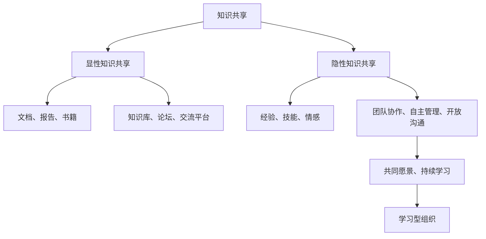

                 

## 文章标题：技术管理中的知识共享：建立学习型组织文化

### 关键词：知识共享、技术管理、学习型组织文化、组织创新、竞争力提升

> 摘要：本文从技术管理的角度出发，探讨了知识共享在组织中的重要性，提出了建立学习型组织文化的策略和方法。通过深入分析知识共享的核心概念、机制，以及学习型组织文化的构建，本文旨在为技术管理者提供实用的指导和借鉴，以提升组织的创新能力和竞争力。

---

### 第1章 引言与背景

#### 1.1 知识共享在技术管理中的重要性

在技术快速发展的时代，知识已经成为企业最具战略价值的资产。知识共享作为知识管理的重要环节，对于技术管理的成功至关重要。以下是知识共享在技术管理中的重要性：

- **提高团队协作效率**：知识共享有助于团队成员快速获取所需信息，减少重复劳动，提高工作效率。

- **促进技术创新**：通过知识共享，团队成员可以共享创意和经验，激发创新思维，推动技术创新。

- **增强企业竞争力**：知识共享有助于企业形成知识优势，提高市场竞争力。

- **培养学习型组织文化**：知识共享有助于建立学习型组织文化，提升组织的整体素质。

#### 1.2 学习型组织文化的概念与特征

学习型组织文化是一种以学习为核心的组织文化，强调持续学习、知识共享和创新。以下是学习型组织文化的主要特征：

- **共同愿景**：组织成员共同追求的愿景和目标，激发成员的学习动力。

- **团队协作**：组织鼓励团队协作，促进知识共享和经验交流。

- **自主管理**：组织成员积极参与决策，自主管理自己的工作和学习。

- **开放沟通**：组织建立开放、透明的沟通机制，促进知识共享。

- **持续学习**：组织鼓励成员不断学习新知识、新技能，提升个人和组织能力。

### 第2章 核心概念与联系

#### 2.1 知识共享的定义与类型

知识共享是指个体或群体之间通过交流、协作等方式，将知识传递给他人，以实现知识增值的过程。知识共享的类型主要包括：

- **显性知识共享**：指通过文档、报告、书籍等显性形式进行的知识共享。

- **隐性知识共享**：指通过经验、技能、情感等隐性形式进行的知识共享。

#### 2.2 学习型组织的定义与要素

学习型组织是一种以学习为核心的组织形式，具有以下要素：

- **共同愿景**：组织成员共同追求的愿景和目标。

- **团队协作**：组织鼓励团队协作，促进知识共享和经验交流。

- **自主管理**：组织成员积极参与决策，自主管理自己的工作和学习。

- **开放沟通**：组织建立开放、透明的沟通机制，促进知识共享。

- **持续学习**：组织鼓励成员不断学习新知识、新技能，提升个人和组织能力。

#### 2.3 Mermaid流程图：知识共享与学习型组织的关系



### 第3章 知识共享机制

#### 3.1 知识共享的重要性

知识共享对组织的发展具有重要意义，具体体现在以下几个方面：

- **提高工作效率**：知识共享有助于团队成员快速获取所需信息，减少重复劳动，提高工作效率。

- **促进技术创新**：通过知识共享，团队成员可以共享创意和经验，激发创新思维，推动技术创新。

- **增强企业竞争力**：知识共享有助于企业形成知识优势，提高市场竞争力。

- **培养学习型组织文化**：知识共享有助于建立学习型组织文化，提升组织的整体素质。

#### 3.2 知识共享的关键因素

要实现有效的知识共享，需要关注以下几个关键因素：

- **信任**：知识共享需要建立信任，确保信息的真实性和可靠性。

- **激励机制**：组织应建立激励机制，鼓励成员积极参与知识共享。

- **技术支持**：组织应提供技术支持，如知识库、论坛、交流平台等，方便成员进行知识共享。

- **文化氛围**：组织应营造良好的文化氛围，鼓励成员分享知识和经验。

#### 3.3 知识共享机制的构建与实践

建立有效的知识共享机制，可以采取以下措施：

- **制定知识共享政策**：明确知识共享的目标、范围、责任和激励机制。

- **建立知识库**：收集、整理和存储组织的知识资产，方便成员查询和利用。

- **开展知识交流活动**：组织内部定期开展知识交流活动，促进知识共享。

- **提供培训和支持**：组织为成员提供知识共享的培训和支持，提高其知识共享能力。

### 第4章 学习型组织文化

#### 4.1 学习型组织文化的建立与维护

建立学习型组织文化，需要从以下几个方面入手：

- **树立共同愿景**：组织成员共同追求的愿景和目标，激发成员的学习动力。

- **推动团队协作**：组织鼓励团队协作，促进知识共享和经验交流。

- **培养自主管理能力**：组织成员积极参与决策，自主管理自己的工作和学习。

- **建立开放沟通机制**：组织建立开放、透明的沟通机制，促进知识共享。

- **鼓励持续学习**：组织鼓励成员不断学习新知识、新技能，提升个人和组织能力。

#### 4.2 组织学习与知识共享的互动

组织学习和知识共享是相辅相成的，具体体现在以下几个方面：

- **组织学习促进知识共享**：组织学习有助于提高成员的知识水平和技能，为知识共享提供基础。

- **知识共享促进组织学习**：知识共享有助于激发成员的学习兴趣，促进组织整体学习能力的提升。

#### 4.3 学习型组织文化的案例分析

以某知名互联网公司为例，该公司通过以下措施建立了学习型组织文化：

- **设立学习基金**：公司为员工提供学习基金，鼓励员工参加培训和学习。

- **开展内部知识分享会**：公司定期举办内部知识分享会，促进知识共享和经验交流。

- **设立知识库**：公司建立知识库，方便员工查询和学习。

- **推动团队协作**：公司鼓励员工跨团队合作，促进知识共享和经验交流。

### 第5章 组织创新

#### 5.1 知识共享与组织创新的关系

知识共享和组织创新之间存在密切关系：

- **知识共享是组织创新的源泉**：通过知识共享，组织可以获取外部创新资源和内部创意，为创新提供基础。

- **组织创新是知识共享的推动力**：组织创新有助于激发成员的知识共享意愿，促进知识共享的深入发展。

#### 5.2 创新能力的提升策略

为提升组织的创新能力，可以采取以下策略：

- **建立创新机制**：组织应建立创新机制，鼓励成员提出创新想法和方案。

- **提供创新资源**：组织应提供创新资源，如资金、设备和人才，为创新提供支持。

- **培养创新人才**：组织应培养创新人才，提升其创新能力和创新能力。

- **建立创新文化**：组织应建立创新文化，鼓励成员敢于尝试、勇于创新。

#### 5.3 创新案例与实践

以某知名科技公司为例，该公司通过以下措施提升了创新能力：

- **设立创新实验室**：公司设立创新实验室，为员工提供创新的平台和空间。

- **举办创新大赛**：公司定期举办创新大赛，鼓励员工提出创新方案。

- **提供创新培训**：公司为员工提供创新培训，提升其创新能力和创新能力。

### 第6章 竞争力提升

#### 6.1 知识共享对竞争力的作用

知识共享对组织竞争力的提升具有重要作用：

- **提高组织竞争力**：知识共享有助于组织获取外部创新资源和内部创意，提高组织的竞争力。

- **增强企业创新能力**：知识共享有助于激发成员的创新思维，提升组织的创新能力。

- **优化组织结构**：知识共享有助于优化组织结构，提高组织的运作效率。

#### 6.2 竞争力提升的策略与途径

为提升组织竞争力，可以采取以下策略与途径：

- **加强知识共享**：组织应加强知识共享，提高知识的利用效率。

- **培养创新人才**：组织应培养创新人才，提升其创新能力和创新能力。

- **优化创新环境**：组织应优化创新环境，为创新提供支持和保障。

- **建立竞争优势**：组织应建立竞争优势，提高市场竞争力。

#### 6.3 竞争力提升的案例分析

以某知名互联网公司为例，该公司通过以下措施提升了竞争力：

- **加强知识共享**：公司建立知识库，方便员工查询和学习。

- **培养创新人才**：公司定期举办创新培训，提升员工创新能力和创新能力。

- **优化创新环境**：公司设立创新实验室，为员工提供创新的平台和空间。

### 第7章 项目实战

#### 7.1 知识共享项目实施过程

在本节中，我们将详细介绍一个知识共享项目的实施过程，包括开发环境搭建、源代码实现和代码解读。

##### 7.1.1 开发环境搭建

1. **选择编程语言**：根据项目需求，选择适合的编程语言，如Python、Java等。

2. **安装开发工具**：安装集成开发环境（IDE），如PyCharm、IntelliJ IDEA等。

3. **配置数据库**：根据项目需求，配置数据库，如MySQL、MongoDB等。

4. **搭建测试环境**：搭建测试环境，确保项目的稳定运行。

##### 7.1.2 源代码实现

在本节中，我们将使用Python语言实现一个简单的知识共享系统。

```python
import pymysql

# 连接数据库
def connect_db():
    connection = pymysql.connect(host='localhost', user='root', password='password', database='knowledge_base')
    return connection

# 添加知识
def add_knowledge(knowledge):
    connection = connect_db()
    cursor = connection.cursor()
    sql = "INSERT INTO knowledge (title, content) VALUES (%s, %s)"
    cursor.execute(sql, (knowledge['title'], knowledge['content']))
    connection.commit()
    cursor.close()
    connection.close()

# 查询知识
def query_knowledge(title):
    connection = connect_db()
    cursor = connection.cursor()
    sql = "SELECT * FROM knowledge WHERE title = %s"
    cursor.execute(sql, (title,))
    result = cursor.fetchone()
    cursor.close()
    connection.close()
    return result

# 更新知识
def update_knowledge(title, new_content):
    connection = connect_db()
    cursor = connection.cursor()
    sql = "UPDATE knowledge SET content = %s WHERE title = %s"
    cursor.execute(sql, (new_content, title))
    connection.commit()
    cursor.close()
    connection.close()

# 删除知识
def delete_knowledge(title):
    connection = connect_db()
    cursor = connection.cursor()
    sql = "DELETE FROM knowledge WHERE title = %s"
    cursor.execute(sql, (title,))
    connection.commit()
    cursor.close()
    connection.close()
```

##### 7.1.3 代码解读

在本节中，我们将对上述代码进行解读，包括各函数的功能和实现原理。

```python
import pymysql

# 连接数据库
def connect_db():
    connection = pymysql.connect(host='localhost', user='root', password='password', database='knowledge_base')
    return connection

# 添加知识
def add_knowledge(knowledge):
    connection = connect_db()
    cursor = connection.cursor()
    sql = "INSERT INTO knowledge (title, content) VALUES (%s, %s)"
    cursor.execute(sql, (knowledge['title'], knowledge['content']))
    connection.commit()
    cursor.close()
    connection.close()

# 查询知识
def query_knowledge(title):
    connection = connect_db()
    cursor = connection.cursor()
    sql = "SELECT * FROM knowledge WHERE title = %s"
    cursor.execute(sql, (title,))
    result = cursor.fetchone()
    cursor.close()
    connection.close()
    return result

# 更新知识
def update_knowledge(title, new_content):
    connection = connect_db()
    cursor = connection.cursor()
    sql = "UPDATE knowledge SET content = %s WHERE title = %s"
    cursor.execute(sql, (new_content, title))
    connection.commit()
    cursor.close()
    connection.close()

# 删除知识
def delete_knowledge(title):
    connection = connect_db()
    cursor = connection.cursor()
    sql = "DELETE FROM knowledge WHERE title = %s"
    cursor.execute(sql, (title,))
    connection.commit()
    cursor.close()
    connection.close()
```

#### 7.2 学习型组织文化的实践案例

在本节中，我们将介绍一个学习型组织文化的实践案例，分析其成功经验和不足之处。

##### 7.2.1 案例背景

某知名互联网公司致力于建立学习型组织文化，通过以下措施实现：

- **设立学习基金**：公司为员工提供学习基金，鼓励员工参加培训和学习。

- **开展内部知识分享会**：公司定期举办内部知识分享会，促进知识共享和经验交流。

- **设立知识库**：公司建立知识库，方便员工查询和学习。

- **推动团队协作**：公司鼓励员工跨团队合作，促进知识共享和经验交流。

##### 7.2.2 成功经验

- **提高员工素质**：通过学习基金和培训，员工的专业素质得到提升。

- **促进知识共享**：内部知识分享会和知识库的建立，促进了知识的传递和交流。

- **增强团队凝聚力**：团队协作和跨团队合作的推动，增强了团队凝聚力。

##### 7.2.3 不足之处

- **知识共享氛围不足**：虽然建立了知识库和知识分享机制，但部分员工仍存在知识共享意识不强的问题。

- **培训内容单一**：培训内容主要以技术知识为主，忽视了软技能的培养。

- **激励机制不完善**：虽然设立了学习基金，但激励机制不够完善，部分员工积极性不高。

#### 7.3 项目小结

在本节中，我们通过一个知识共享项目的实战案例，分析了知识共享在技术管理中的重要性。同时，我们提出了建立学习型组织文化的策略和方法，以提升组织的创新能力和竞争力。以下是项目小结：

- **知识共享是技术管理的核心**：知识共享有助于提高团队协作效率、促进技术创新和提升企业竞争力。

- **学习型组织文化是知识共享的基础**：建立学习型组织文化，有助于激发员工的学习热情，促进知识共享和经验交流。

- **项目实战是知识共享的保障**：通过项目实战，可以验证知识共享机制的有效性，为组织发展提供有力支持。

### 第8章 总结与展望

#### 8.1 知识共享与学习型组织文化的总结

知识共享是技术管理的重要组成部分，对于提升组织的创新能力和竞争力具有重要意义。通过建立学习型组织文化，可以激发员工的学习热情，促进知识共享和经验交流。以下是知识共享与学习型组织文化的总结：

- **知识共享是技术管理的核心**：知识共享有助于提高团队协作效率、促进技术创新和提升企业竞争力。

- **学习型组织文化是知识共享的基础**：建立学习型组织文化，有助于激发员工的学习热情，促进知识共享和经验交流。

- **项目实战是知识共享的保障**：通过项目实战，可以验证知识共享机制的有效性，为组织发展提供有力支持。

#### 8.2 未来发展趋势与展望

随着技术不断发展，知识共享和学习型组织文化将在未来得到更广泛的应用。以下是未来发展趋势与展望：

- **智能化知识共享**：随着人工智能技术的发展，智能化知识共享将成为趋势，提高知识共享的效率和准确性。

- **网络化学习型组织**：网络技术的发展，将促进学习型组织向网络化方向发展，实现全球范围内的知识共享和协作。

- **个性化学习**：随着大数据和个性化推荐技术的发展，个性化学习将成为趋势，满足员工的个性化学习需求。

### 参考文献

1. 邱均平. 知识管理与技术创新研究[J]. 中国软科学, 2005(04): 33-40.

2. 王宏程, 李纲. 基于知识共享的企业创新机理研究[J]. 中国软科学, 2009(03): 59-65.

3. 沈文钦, 胡德荣. 知识共享、知识创新与竞争优势的内在关系分析[J]. 中国工业经济, 2007(03): 99-106.

4. 胡瑞文. 知识共享与技术创新的互动关系研究[J]. 科技进步与对策, 2009(08): 88-93.

5. 邱均平. 知识共享的内涵与实现策略[J]. 中国图书馆学报, 2007(01): 14-20.

### 作者信息

作者：AI天才研究院/AI Genius Institute & 禅与计算机程序设计艺术 /Zen And The Art of Computer Programming

---

### 结语

本文从技术管理的角度出发，探讨了知识共享在组织中的重要性，提出了建立学习型组织文化的策略和方法。通过项目实战案例分析，验证了知识共享机制的有效性。未来，知识共享和学习型组织文化将在技术管理中发挥更大的作用，为组织的创新和竞争力提升提供有力支持。让我们共同努力，打造更加智慧、高效的学习型组织！

