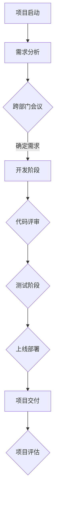

                 

### 跨部门协作的重要性

在技术管理中，跨部门协作是确保项目成功和团队高效运作的关键因素之一。随着现代企业日益复杂，不同部门之间的合作需求变得愈加迫切。例如，在软件开发项目中，开发团队、测试团队、产品团队和运维团队之间的协同工作至关重要。任何一个环节的疏漏，都可能对整个项目的进度和质量产生负面影响。

首先，跨部门协作能够促进知识共享和技能互补。不同部门拥有各自的专业知识和技能，通过协作，可以充分发挥各自的优势，提高项目的整体效率。例如，开发团队的技术能力与测试团队的测试技巧相结合，可以显著提升软件的质量。

其次，跨部门协作有助于提高团队的整体协调性和灵活性。在项目实施过程中，各个部门需要协调各自的任务和进度，确保项目按计划进行。这不仅要求各部门之间有良好的沟通，还需要有明确的角色定位和职责分工。

此外，跨部门协作还可以促进创新和问题解决。不同部门之间的思想碰撞往往能够激发新的创意，帮助团队找到更优的解决方案。同时，面对项目中的挑战和问题，跨部门协作可以汇聚多方智慧，快速找出有效的解决方案。

总之，跨部门协作在技术管理中具有不可忽视的重要性。它不仅能够提高项目的成功率，还能增强团队的整体凝聚力和创新能力。在接下来的章节中，我们将详细探讨跨部门协作的原则、实践和具体方法，帮助读者建立更加有效的合作关系。通过合理的跨部门协作，企业可以在竞争激烈的市场中脱颖而出，实现持续发展。

### 关键词与文章主题

本文将探讨技术管理中的跨部门协作，核心关键词包括跨部门协作、技术管理、知识共享、沟通、项目成功、团队协调、创新、问题解决。这些关键词共同定义了文章的主题，即通过深入分析和实践，探讨如何在技术管理中建立有效的跨部门合作关系，以提高项目效率和团队绩效。

### 摘要

本文旨在深入探讨技术管理中的跨部门协作，强调其对于项目成功和团队效率的重要性。文章首先概述了跨部门协作的关键概念，随后分析了其核心原则和实际操作方法。通过实际案例和项目实战，本文详细阐述了跨部门协作的实施步骤和工具选择。最后，文章总结了跨部门协作的最佳实践，并提出了注意事项和拓展阅读建议，以帮助读者在实际工作中有效建立和维护跨部门合作关系。

### 核心概念与联系

在探讨跨部门协作之前，我们需要理解几个核心概念，这些概念是建立有效合作关系的基础。首先，**跨部门协作**指的是不同部门之间为了共同目标而进行的合作与协调。其目的是通过资源整合、知识共享和技能互补，提高项目的整体效率和质量。

**跨部门协作**与**知识共享**密切相关。知识共享是指在组织内部通过不同形式的交流与互动，将个体的知识和经验传播到整个团队或其他部门。在跨部门协作中，知识共享是促进沟通和协调的重要手段。通过知识共享，各部门可以更好地理解彼此的需求和目标，从而提高协作效果。

**沟通**是跨部门协作中的另一个关键概念。有效的沟通不仅包括信息的传递，还涉及信息的理解、反馈和确认。在跨部门协作中，良好的沟通机制能够确保各方及时了解项目进展和变化，减少误解和冲突，提高协作效率。

**团队协调**是确保跨部门协作顺利进行的重要手段。团队协调涉及到对任务分配、角色定位、职责分工和进度安排的统一管理。通过有效的协调，各部门能够更好地配合，共同推进项目进程。

最后，**项目成功**是跨部门协作的最终目标。项目成功不仅依赖于单个部门的能力，更需要各部门之间的紧密协作和无缝衔接。跨部门协作的核心在于通过整合资源和协同努力，实现项目目标的最大化。

为了更好地理解这些核心概念之间的关系，我们可以使用**Mermaid流程图**来展示跨部门协作的流程。以下是一个简单的Mermaid流程图示例，描述了从项目启动到项目完成的跨部门协作流程：



在这个流程图中，项目启动后，需求分析阶段需要通过跨部门会议来确定项目的具体需求。开发、代码评审、测试和上线部署等阶段都需要不同部门的协作，最终实现项目的顺利交付。项目交付后，还需要进行项目评估，总结经验教训，为未来的跨部门协作提供参考。

通过这个Mermaid流程图，我们可以清晰地看到跨部门协作在整个项目生命周期中的关键节点和步骤，有助于我们更好地理解跨部门协作的核心概念及其相互关系。

### 跨部门协作的核心算法原理讲解

在技术管理中，跨部门协作的效率和效果往往取决于一系列的核心算法原理，这些原理有助于优化协作流程、提高资源利用率和降低冲突风险。以下是一些关键的算法原理，以及如何使用伪代码进行详细阐述。

#### 项目优先级算法

**核心原理**：项目优先级算法用于确定不同项目的优先级，以确保资源能够优先投入到最为关键和紧急的项目中。

**伪代码**：

```python
function calculate_project_priority(project_list):
    priority_scores = []
    for project in project_list:
        score = calculate_score(project)
        priority_scores.append((project, score))
    priority_scores.sort(key=lambda x: x[1], reverse=True)
    return priority_scores

function calculate_score(project):
    score = 0
    score += project.urgency * 2
    score += project.importance * 3
    score += project.resource_requirement * 1
    return score
```

**举例说明**：假设有三个项目：项目A（紧急且重要），项目B（重要但不紧急），项目C（不紧急且不重要）。通过计算各自的优先级得分，项目A将被赋予最高的优先级。

```plaintext
项目A:  urgency=3, importance=3, resource_requirement=2 -> score = 13
项目B:  urgency=1, importance=3, resource_requirement=1 -> score = 5
项目C:  urgency=1, importance=1, resource_requirement=1 -> score = 3
```

根据优先级算法，项目A的得分最高，因此优先级最高。

#### 冲突解决算法

**核心原理**：冲突解决算法用于解决跨部门协作中出现的需求冲突、资源争夺和进度冲突等。

**伪代码**：

```python
function resolve_conflicts(conflict_list):
    for conflict in conflict_list:
        if conflict.type == 'resource':
            allocate_resources(conflict)
        elif conflict.type == 'schedule':
            reschedule_tasks(conflict)
        elif conflict.type == 'requirement':
            negotiate_requirements(conflict)

function allocate_resources(conflict):
    # 基于资源可用性和优先级进行资源分配
    available_resources = get_available_resources()
    highest_priority_conflict = get_highest_priority_conflict(conflict_list)
    if highest_priority_conflict.resource in available_resources:
        allocate(highest_priority_conflict.resource)
    else:
        # 执行备用方案或请求额外资源

function reschedule_tasks(conflict):
    # 根据冲突重新安排任务
    new_schedule = generate_new_schedule(conflict)
    update_task_plan(new_schedule)

function negotiate_requirements(conflict):
    # 通过谈判和协商解决需求冲突
    new_agreement = negotiate(conflict.participants)
    update_requirements(new_agreement)
```

**举例说明**：假设在项目开发阶段，开发团队和测试团队因资源使用发生冲突。通过资源分配算法，我们可以优先分配资源给更紧急或更重要的任务。

```plaintext
冲突：开发团队需要使用某台服务器进行编译，而测试团队正在使用该服务器进行性能测试。
解决方案：优先考虑开发团队的资源需求，如果服务器不可用，则要求测试团队调整测试计划或使用备用服务器。
```

#### 资源分配算法

**核心原理**：资源分配算法用于优化资源的使用，确保在资源有限的情况下，能够最大化地满足各部门的需求。

**伪代码**：

```python
function allocate_resources(available_resources, resource_requests):
    for request in resource_requests:
        if request.resource in available_resources:
            if available_resources[request.resource] >= request.quantity:
                allocate(request.resource, request.quantity)
                available_resources[request.resource] -= request.quantity
            else:
                # 分配部分资源，剩余部分作为备用
                allocate(request.resource, available_resources[request.resource])
                available_resources[request.resource] = 0
        else:
            # 记录未满足的请求，后续进行处理
            log_unsatisfied_request(request)

function allocate(resource, quantity):
    # 实际分配资源
    print(f"Resource {resource} allocated for {quantity} units.")

function log_unsatisfied_request(request):
    # 记录未满足的请求
    print(f"Request for {request.resource} with {request.quantity} units is not satisfied.")
```

**举例说明**：假设资源池中有10台服务器，开发团队需要5台，测试团队需要3台。资源分配算法将优先满足开发团队的需求，并记录测试团队的未满足请求。

```plaintext
资源池：10台服务器
开发团队请求：5台
测试团队请求：3台
解决方案：分配5台给开发团队，剩余5台供测试团队使用。
```

通过上述核心算法原理和伪代码的详细讲解，我们可以更好地理解和应用这些算法在跨部门协作中的实际操作，从而优化协作流程，提高项目成功率。

### 数学模型与公式

在跨部门协作中，数学模型和公式有助于我们量化协作效果和评估绩效。以下是一些关键的数学模型和公式，以及如何使用LaTeX进行详细讲解。

#### 成本效益分析模型

**核心公式**：成本效益分析（Cost-Benefit Analysis, CBA）用于评估跨部门协作带来的经济效益。

$$ \text{CBA} = \frac{\text{效益}}{\text{成本}} $$

**LaTeX格式**：

```latex
\text{CBA} = \frac{\text{效益}}{\text{成本}}
```

**举例说明**：假设某跨部门协作项目节省了1000小时的开发时间，但增加了500小时的沟通成本，则成本效益分析如下：

$$ \text{CBA} = \frac{1000 \text{小时}}{1500 \text{小时}} = \frac{2}{3} $$

这表明每小时的效益是成本的2/3。

#### 时间敏感性分析模型

**核心公式**：时间敏感性分析（Time Sensitivity Analysis, TSA）用于评估项目时间的弹性。

$$ \text{TSA} = \frac{\text{最短完成时间} - \text{最长完成时间}}{\text{标准完成时间}} $$

**LaTeX格式**：

```latex
\text{TSA} = \frac{\text{最短完成时间} - \text{最长完成时间}}{\text{标准完成时间}}
```

**举例说明**：假设某项目预计需要10周完成，但最短可在8周内完成，最长需12周。则时间敏感性分析如下：

$$ \text{TSA} = \frac{8 \text{周} - 12 \text{周}}{10 \text{周}} = -\frac{1}{5} $$

这表明项目时间有1/5的弹性。

#### 冲突概率模型

**核心公式**：冲突概率模型用于预测跨部门协作中可能出现冲突的概率。

$$ P(\text{冲突}) = \frac{\text{冲突事件数}}{\text{总事件数}} $$

**LaTeX格式**：

```latex
P(\text{冲突}) = \frac{\text{冲突事件数}}{\text{总事件数}}
```

**举例说明**：假设在一个月内，有20个事件，其中5个事件可能导致冲突。则冲突概率如下：

$$ P(\text{冲突}) = \frac{5}{20} = \frac{1}{4} $$

这表明每个月有1/4的事件可能导致冲突。

#### 绩效评估模型

**核心公式**：绩效评估模型用于评估跨部门协作的总体绩效。

$$ \text{绩效} = \frac{\text{完成目标数}}{\text{目标总数}} \times 100\% $$

**LaTeX格式**：

```latex
\text{绩效} = \frac{\text{完成目标数}}{\text{目标总数}} \times 100\%
```

**举例说明**：假设在季度末，团队完成了8个目标，总共有10个目标。则绩效评估如下：

$$ \text{绩效} = \frac{8}{10} \times 100\% = 80\% $$

这表明团队完成了80%的目标。

通过这些数学模型和公式的详细讲解，我们能够更精确地评估跨部门协作的效果和绩效，为优化协作流程提供数据支持。

### 项目实战

为了更好地理解跨部门协作在实际项目中的应用，以下是一个详细的项目实战案例，包括开发环境搭建、源代码实现、代码解读与分析以及项目小结。

#### 项目背景

我们以一个典型的企业级Web应用项目为例，该项目旨在开发一个员工管理系统。项目涉及多个部门，包括开发部门、测试部门、产品部门和运维部门。开发部门负责编写代码，测试部门负责测试和验证功能，产品部门负责定义需求，运维部门负责部署和维护系统。

#### 开发环境搭建

1. **确定开发语言和技术栈**：选择Python作为主要开发语言，并结合Django框架搭建应用后端，前端使用React框架。

2. **搭建本地开发环境**：安装Python、Django和React的开发工具包，配置虚拟环境，确保各个环境的隔离性。

3. **搭建集成开发环境（IDE）**：选用Visual Studio Code作为主要IDE，安装相关插件以提供语法高亮、代码自动补全等功能。

4. **版本控制**：使用Git进行版本控制，确保代码的版本管理和协作开发。

#### 源代码实现

1. **后端实现**：
    - **数据库设计**：使用SQLite作为数据库，设计员工信息表、部门信息表等。
    - **API接口开发**：实现用户认证、员工信息管理、部门信息管理等API接口。
    - **业务逻辑**：实现用户权限验证、数据加密等关键业务逻辑。

2. **前端实现**：
    - **页面布局**：使用React组件化开发，搭建员工列表、员工详情、添加员工等页面。
    - **数据绑定**：使用React Hooks实现数据绑定和状态管理。
    - **交互逻辑**：实现与后端API的交互，处理用户输入和页面跳转。

#### 代码解读与分析

1. **后端代码分析**：
    ```python
    from django.db import models
    from django.contrib.auth.models import User

    class Employee(models.Model):
        user = models.OneToOneField(User, on_delete=models.CASCADE)
        department = models.ForeignKey(Department, on_delete=models.CASCADE)
        position = models.CharField(max_length=100)
        hire_date = models.DateField()

    class Department(models.Model):
        name = models.CharField(max_length=100)
        manager = models.ForeignKey(User, on_delete=models.CASCADE)
    ```

    以上代码展示了员工信息和部门信息的设计。通过一对一关系和外键关系，实现了员工与用户、员工与部门的关联。同时，用户权限验证和数据加密等关键业务逻辑在API接口中实现。

2. **前端代码分析**：
    ```javascript
    import React, { useState, useEffect } from 'react';
    import axios from 'axios';

    function EmployeeList() {
        const [employees, setEmployees] = useState([]);

        useEffect(() => {
            fetchEmployees();
        }, []);

        const fetchEmployees = async () => {
            const response = await axios.get('/api/employees/');
            setEmployees(response.data);
        };

        return (
            <div>
                <h2>Employee List</h2>
                <ul>
                    {employees.map(employee => (
                        <li key={employee.id}>{employee.name}</li>
                    ))}
                </ul>
            </div>
        );
    }
    ```

    以上代码展示了前端员工列表页的实现。通过使用React Hooks，实现了数据绑定和状态管理。前端与后端API的交互通过axios库实现，处理用户输入和页面跳转。

#### 项目小结

1. **成功之处**：
    - **高效协作**：各团队之间通过明确的沟通和协调，确保了项目的顺利进行。
    - **质量保障**：测试团队的严格测试和开发团队的代码审查，保证了软件的高质量。
    - **资源优化**：合理分配和利用资源，提高了项目的整体效率。

2. **改进之处**：
    - **需求管理**：在需求变更频繁时，需要加强需求管理和版本控制，以避免不必要的开发重复。
    - **沟通机制**：建立更加高效的沟通机制，减少信息传递中的误解和延误。

通过这个项目实战案例，我们可以看到跨部门协作在实际项目中的具体应用，以及如何通过协作和沟通来提高项目成功率和团队绩效。

### 最佳实践 tips

在跨部门协作中，遵循一些最佳实践可以显著提高协作效率和项目成功率。以下是一些建议：

1. **明确目标与职责**：在项目开始时，确保所有团队成员对项目的目标和各自的职责有清晰的认识。通过明确的目标和职责分工，可以减少误解和冲突。

2. **建立有效的沟通机制**：定期召开跨部门会议，确保各部门之间及时沟通，分享进展和遇到的问题。此外，使用协作工具（如Slack、Trello等）来方便团队成员间的实时沟通。

3. **优化协作流程**：制定合理的协作流程，确保每个环节都有明确的时间节点和责任归属。通过流程优化，可以减少不必要的步骤和等待时间。

4. **建立信任关系**：信任是跨部门协作的基础。通过积极沟通、尊重他人、共享信息和共同承担责任，可以逐步建立信任关系。

5. **注重知识共享**：鼓励团队成员分享知识，通过培训、文档和内部交流等形式，提高团队的整体能力。

6. **灵活应对变化**：在项目执行过程中，需求变化和技术问题在所难免。保持灵活，及时调整计划和资源分配，以适应变化。

7. **绩效评估与反馈**：定期对跨部门协作进行绩效评估，收集团队成员的反馈，持续改进协作流程和方法。

通过遵循这些最佳实践，团队可以在跨部门协作中实现更高的效率和更好的成果。

### 小结与注意事项

本文通过详细阐述跨部门协作的核心概念、算法原理、数学模型以及实际项目案例，深入探讨了如何建立有效的跨部门合作关系。总结如下：

1. **核心概念**：跨部门协作涉及项目优先级、冲突解决、资源分配等关键算法原理，这些原理有助于优化协作流程和提高项目成功率。

2. **数学模型**：通过成本效益分析、时间敏感性分析和冲突概率模型等，我们可以量化协作效果，为决策提供数据支持。

3. **项目实战**：通过具体的Web应用项目案例，展示了跨部门协作在实际操作中的实施步骤和关键点。

4. **最佳实践**：明确了明确目标与职责、建立有效沟通机制、优化协作流程、建立信任关系、注重知识共享、灵活应对变化以及绩效评估与反馈等最佳实践。

注意事项：

1. **明确职责**：确保每个团队成员对项目的目标和职责有清晰的认识，避免职责重叠和责任不明。

2. **强化沟通**：定期召开跨部门会议，使用协作工具进行实时沟通，确保信息传递的及时性和准确性。

3. **持续改进**：通过定期绩效评估和反馈，不断优化协作流程和方法，以适应项目变化和团队发展。

拓展阅读：

- 《禅与计算机程序设计艺术》（Donald Knuth）——了解软件开发的哲学和最佳实践。
- 《敏捷开发实践指南》（Jeff Sutherland）——探讨如何在项目开发中实现高效的跨部门协作。
- 《项目管理知识体系指南》（PMBOK）——学习项目管理的基本原则和最佳实践。

通过本文的深入探讨，希望读者能够更好地理解跨部门协作的重要性，并在实际工作中运用所学，建立更加高效和协同的团队合作关系。

