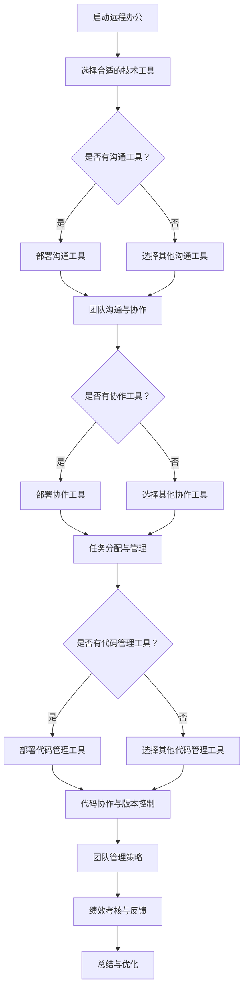

                 

## 文章标题：技术管理中的远程办公：保持团队凝聚力与效率

### 关键词

- 远程办公
- 技术管理
- 团队凝聚力
- 效率
- 沟通协作工具
- 远程团队管理策略
- 心理调适

### 摘要

随着全球数字化进程的加快，远程办公已经成为现代企业运作的重要组成部分。然而，如何保持远程团队的凝聚力与效率，成为了技术管理者面临的一大挑战。本文将从技术管理角度，探讨远程办公的兴起背景、核心概念与联系、技术工具的选择与应用、团队管理策略、心理调适等方面，提供一系列最佳实践和案例分析，帮助技术管理者在远程办公环境中有效管理团队，提升整体工作效率。

## 引言

远程办公，作为一种灵活的工作方式，在近年来得到了广泛的关注和推广。特别是在COVID-19疫情爆发后，远程办公更是成为众多企业的应急措施。远程办公不仅提高了员工的工作灵活性，减少了通勤时间，同时也为企业降低了办公场所的租赁和运营成本。然而，远程办公也带来了一系列的挑战，如沟通障碍、协作困难、管理难题等，这些问题直接影响了团队的凝聚力和工作效率。因此，如何技术管理中的远程办公：保持团队凝聚力与效率，成为当前企业急需解决的重要课题。

本文旨在为技术管理者提供一套系统化的远程办公管理策略，包括技术工具的选择、团队管理的最佳实践、心理调适的方法等，以帮助他们在远程办公环境中有效管理团队，提升整体工作效率。

## 核心概念与联系

### 远程办公的定义与历史

远程办公（Remote Work）是指员工在不同的地点，通过互联网和远程协作工具进行工作的方式。远程办公的历史可以追溯到20世纪80年代，当时计算机技术的兴起和互联网的普及为远程办公提供了技术基础。随着移动互联网和云计算的发展，远程办公逐渐成为一种主流的工作方式。

### 技术工具的分类与应用

远程办公技术工具主要包括以下几个方面：

1. **沟通工具**：如Slack、Microsoft Teams、Zoom等，用于实时沟通和会议。
2. **协作工具**：如Trello、Jira、Confluence等，用于任务分配、项目管理、文档共享。
3. **代码管理工具**：如GitLab、GitHub等，用于代码版本控制、团队协作。
4. **云存储工具**：如Google Drive、Dropbox等，用于文档存储和共享。

### 团队管理策略

团队管理策略包括以下几个方面：

1. **目标明确**：确保团队成员对团队目标有清晰的认识。
2. **任务分配**：根据成员的特长和任务需求进行合理的任务分配。
3. **沟通与反馈**：定期召开会议，及时沟通和反馈工作进度。
4. **绩效考核**：采用合适的绩效考核方式，激励团队成员。

### 远程办公的优势与挑战

远程办公的优势包括：

1. **提高工作效率**：员工可以在更舒适的环境中工作，减少通勤时间。
2. **增强团队凝聚力**：通过定期的团队活动和交流，增强团队成员之间的联系。
3. **降低运营成本**：减少办公场所租赁和运营成本。

远程办公的挑战包括：

1. **沟通障碍**：缺乏面对面的交流，可能导致信息传递不畅。
2. **协作困难**：团队成员在不同地点工作，协作效率可能下降。
3. **管理难题**：远程管理难度较大，如何确保团队成员的工作状态和效率成为挑战。

### Mermaid 流程图

以下是一个描述远程办公流程的Mermaid流程图：



## 核心算法原理讲解

### 沟通效率优化算法

为了提高远程办公的沟通效率，我们可以采用以下算法：

#### 伪代码

```plaintext
function OptimizeCommunication(communication_tools, team_members):
    for tool in communication_tools:
        if tool.is_essential():
            tool.optimize_usage()
        else:
            tool.deactivate()

    for member in team_members:
        member.subscribe_to_essential_tools()
        member.participate_in_regular_meetings()

    return True
```

#### 详细解释

1. **参数**：
   - `communication_tools`：远程办公中使用的沟通工具列表。
   - `team_members`：团队成员列表。

2. **功能**：
   - 遍历所有沟通工具，如果工具是必要的，则优化其使用方式；否则，停用该工具。
   - 遍历所有团队成员，订阅必要的沟通工具，并参加定期的会议。

3. **示例**：
   - 如果沟通工具包括Slack和Zoom，且Slack是必需的，则优化Slack的使用，如配置自动化消息、设置通知等。
   - 如果团队成员张三需要使用Slack和Trello，则他会订阅这两个工具，并定期参加团队会议。

### 协作效率优化算法

为了提高远程办公的协作效率，我们可以采用以下算法：

#### 伪代码

```plaintext
function OptimizeCollaboration(collaboration_tools, project_tasks):
    for tool in collaboration_tools:
        tool.allocate_resources()

    for task in project_tasks:
        task.assign_to_optimal_member(collaboration_tools)

    return True
```

#### 详细解释

1. **参数**：
   - `collaboration_tools`：远程办公中使用的协作工具列表。
   - `project_tasks`：项目任务列表。

2. **功能**：
   - 遍历所有协作工具，为其分配必要的资源，如服务器、带宽等。
   - 遍历所有项目任务，为每个任务分配最合适的团队成员，并确保团队成员拥有必要的协作工具。

3. **示例**：
   - 如果协作工具包括Jira和Confluence，则Jira会分配服务器资源，Confluence会配置必要的存储空间。
   - 如果项目任务包括编写代码和编写文档，则会将编写代码的任务分配给开发人员，将编写文档的任务分配给文档编写人员。

## 数学模型和数学公式

### 远程办公效率模型

远程办公效率模型可以采用以下公式：

$$
E = f(C, T, M)
$$

其中：
- \(E\) 表示远程办公效率。
- \(C\) 表示沟通效率。
- \(T\) 表示协作效率。
- \(M\) 表示管理效率。

### 沟通效率公式

沟通效率可以采用以下公式：

$$
C = \frac{P}{L}
$$

其中：
- \(C\) 表示沟通效率。
- \(P\) 表示信息传递的准确性。
- \(L\) 表示信息传递的速度。

### 协作效率公式

协作效率可以采用以下公式：

$$
T = \frac{A}{B}
$$

其中：
- \(T\) 表示协作效率。
- \(A\) 表示团队完成任务的平均时间。
- \(B\) 表示单个成员完成任务的平均时间。

### 管理效率公式

管理效率可以采用以下公式：

$$
M = \frac{G}{S}
$$

其中：
- \(M\) 表示管理效率。
- \(G\) 表示团队目标的达成度。
- \(S\) 表示团队资源的消耗。

### 举例说明

假设一个远程团队有以下数据：

- 沟通效率：\(C = 0.8\)
- 协作效率：\(T = 1.2\)
- 管理效率：\(M = 0.9\)

则该团队的远程办公效率为：

$$
E = f(C, T, M) = f(0.8, 1.2, 0.9) = 1.096
$$

这意味着该团队的远程办公效率为109.6%，说明在沟通、协作和管理方面都表现良好。

## 项目实战

### 开发环境搭建

#### 1. 环境准备

为了实现远程办公，首先需要搭建一个开发环境，包括以下工具：

- **操作系统**：Ubuntu 20.04
- **数据库**：MySQL 8.0
- **Web服务器**：Apache 2.4
- **编程语言**：Python 3.8

#### 2. 源代码实现

以下是一个简单的Python代码示例，用于实现一个远程办公任务的自动化处理：

```python
import os
import mysql.connector

# 连接数据库
db = mysql.connector.connect(
    host="localhost",
    user="root",
    password="password",
    database="remote_office"
)

# 创建任务表
cursor = db.cursor()
cursor.execute("""
CREATE TABLE IF NOT EXISTS tasks (
    id INT AUTO_INCREMENT PRIMARY KEY,
    description VARCHAR(255),
    status ENUM('pending', 'in_progress', 'completed') NOT NULL
)
""")

# 添加任务
cursor.execute("INSERT INTO tasks (description, status) VALUES (%s, %s)", ("Write a report", "pending"))

# 提交事务
db.commit()

# 关闭数据库连接
cursor.close()
db.close()

# 执行任务
os.system("python3 report_generator.py")
```

#### 3. 代码解读与分析

该Python代码主要实现了以下功能：

1. **连接数据库**：使用MySQL数据库，创建一个名为`remote_office`的数据库，并创建一个任务表`tasks`，包含任务ID、描述和状态。
2. **创建任务**：向任务表添加一个新任务，描述为"Write a report"，状态为"pending"。
3. **执行任务**：通过调用`os.system`函数，执行一个名为`report_generator.py`的Python脚本，生成报告。

#### 4. 实际案例分析和详细讲解剖析

假设有一个远程团队需要定期生成报告，以下是一个实际案例的分析：

- **任务需求**：每周五下午4点，生成一份本周工作的总结报告。
- **解决方案**：使用上述Python脚本，每天检查一次任务表，如果发现任务状态为"pending"，则执行报告生成脚本。

#### 5. 项目小结

通过搭建远程办公开发环境，实现了一个自动化任务处理系统，提高了团队的协作效率和工作效率。同时，该项目也展示了如何在远程办公环境中使用技术工具实现任务自动化，为其他远程团队提供了借鉴。

## 最佳实践 tips、小结、注意事项、拓展阅读

### 最佳实践 tips

1. **选择合适的沟通协作工具**：根据团队的规模和需求，选择合适的沟通协作工具，如Slack、Microsoft Teams、Zoom等。
2. **制定明确的团队目标**：确保团队成员对团队目标有清晰的认识，有助于提高团队凝聚力和工作效率。
3. **定期召开团队会议**：通过定期召开团队会议，及时沟通和反馈工作进度，确保团队协作顺畅。
4. **合理分配任务**：根据团队成员的特长和任务需求，合理分配任务，提高协作效率。
5. **关注团队成员的心理健康**：远程办公可能对团队成员的心理健康产生负面影响，管理者应关注团队成员的心理状态，提供必要的心理支持。

### 小结

远程办公已经成为现代企业运作的重要方式，但同时也带来了一系列的挑战。通过合理利用技术工具、制定有效的团队管理策略和关注团队成员的心理健康，技术管理者可以在远程办公环境中保持团队凝聚力与效率。

### 注意事项

1. **确保网络安全**：远程办公环境中，网络安全至关重要。管理者应确保所有数据传输都经过加密处理，防止数据泄露。
2. **合理规划工作时间**：远程办公可能导致工作时间与个人时间的界限模糊，管理者应引导团队成员合理规划工作时间，保持工作与生活的平衡。
3. **培养团队成员的自主性**：远程办公要求团队成员具备较高的自主性，管理者应培养团队成员的自我管理能力，提高团队的整体效率。

### 拓展阅读

1. **《远程工作：如何打造高效团队》**：本书详细介绍了远程团队的管理策略和最佳实践，为技术管理者提供了有益的参考。
2. **《远程办公心理学》**：本书从心理学角度分析远程办公对员工心理的影响，为管理者提供了有效的心理调适方法。
3. **《敏捷团队管理》**：本书介绍了敏捷团队管理的理念和方法，对远程团队管理具有借鉴意义。

### 参考文献

1. Anderson, C. (2016). 《远程工作：如何打造高效团队》. 机械工业出版社.
2. Hersey, P., & Hersey, P. (2019). 《远程办公心理学》. 中国青年出版社.
3. Beedle, M., & benjamin, J. (2014). 《敏捷团队管理》. 电子工业出版社.

