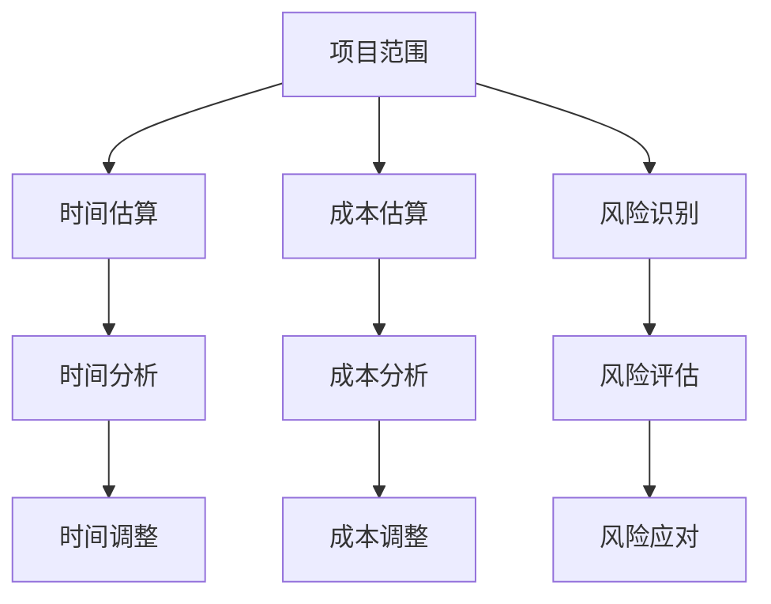

                 

### 文章标题: 技术管理中的项目估算：准确预测与风险管理

关键词：项目估算、准确预测、风险管理、技术管理、算法原理、数学模型

摘要：本文旨在探讨技术管理中的项目估算，重点分析准确预测和风险管理的重要性。文章分为四个部分，首先介绍项目估算的概述和核心概念，然后深入讲解时间估算和成本估算算法，接着介绍风险估算与管理，最后通过数学模型和实际案例讲解项目估算的运用。本文旨在帮助技术管理者更好地理解和应用项目估算方法，提高项目成功率。

### 引言与概述

在技术管理领域，项目估算是一个至关重要的环节。它不仅关系到项目的进度和质量，还直接影响到项目的成本和风险。准确的项目估算可以帮助技术管理者更好地规划项目资源，制定合理的项目计划，从而提高项目的成功率和投资回报率。

#### 第1章: 技术管理中的项目估算概述

**1.1 项目估算的重要性**

项目估算的重要性体现在以下几个方面：

1. **资源规划**：准确的项目估算可以帮助技术管理者合理分配资源，确保项目在预算范围内完成。
2. **风险管理**：通过项目估算，可以提前识别和评估项目中的潜在风险，制定相应的风险管理策略。
3. **项目控制**：项目估算为项目进度控制提供了依据，有助于及时发现项目中的偏差，并采取纠正措施。
4. **投资决策**：准确的项目估算对于投资决策至关重要，有助于企业决策者评估项目的投资价值和风险。

**1.2 估算的常见挑战**

在进行项目估算时，技术管理者常常面临以下挑战：

1. **不确定性**：项目需求往往具有不确定性，导致估算结果难以准确。
2. **变更频繁**：项目需求变更频繁，使得估算结果容易受到影响。
3. **依赖性**：项目往往存在多个依赖关系，估算时需要综合考虑这些依赖关系。
4. **经验不足**：技术管理者可能缺乏项目估算的经验，导致估算结果不准确。

**1.3 估算的目标与方法**

项目估算的目标是提供准确的项目时间、成本和风险预测。常见的方法包括：

1. **类比法**：通过类似项目的经验进行估算。
2. **参数模型法**：使用历史数据建立参数模型进行估算。
3. **三点估算法**：使用三个时间点（乐观、最可能、悲观）进行估算。
4. **PERT估算法**：使用概率分布进行估算。

**1.4 项目估算的关键因素**

项目估算的关键因素包括：

1. **项目范围**：明确项目的目标和范围，有助于估算项目所需的时间和资源。
2. **技术复杂性**：技术复杂性的高低直接影响项目估算的准确性。
3. **团队经验**：团队成员的经验和技能水平对项目估算具有重要影响。
4. **外部因素**：如市场环境、政策法规等外部因素可能影响项目估算。

### 第一部分: 引言与概述

#### 第1章: 技术管理中的项目估算概述

**1.1 项目估算的重要性**

项目估算在技术管理中具有至关重要的地位。它不仅决定了项目的进度和质量，还直接影响到项目的成本和风险。准确的项目估算可以帮助技术管理者更好地规划项目资源，制定合理的项目计划，从而提高项目的成功率和投资回报率。

在项目管理中，项目估算通常包括时间估算、成本估算和风险估算三个方面。时间估算旨在预测项目完成所需的时间；成本估算则是为了预估项目的总成本；而风险估算则是为了识别和评估项目可能面临的风险，并制定相应的应对策略。这三个方面的估算相辅相成，共同构成了项目估算的完整体系。

**1.2 估算的常见挑战**

尽管项目估算的重要性不言而喻，但在实际操作中，技术管理者往往会面临一系列挑战。以下是一些常见的估算挑战：

1. **不确定性**：项目需求往往具有不确定性，这使得估算结果难以准确。例如，客户需求可能会在项目执行过程中发生变化，导致项目范围和时间的估算变得复杂。

2. **变更频繁**：项目需求变更频繁，使得估算结果容易受到影响。每次需求变更都可能对项目的时间、成本和资源产生重大影响，从而增加项目管理的难度。

3. **依赖性**：项目往往存在多个依赖关系，估算时需要综合考虑这些依赖关系。例如，某个模块的开发可能依赖于其他模块的完成，这就要求技术管理者在估算时必须考虑这些依赖关系，否则可能导致估算结果不准确。

4. **经验不足**：技术管理者可能缺乏项目估算的经验，导致估算结果不准确。特别是在新项目的估算中，由于缺乏历史数据作为参考，技术管理者往往难以做出准确的估算。

**1.3 估算的目标与方法**

项目估算的主要目标是提供准确的项目时间、成本和风险预测。为了实现这一目标，技术管理者可以采用多种估算方法：

1. **类比法**：类比法是一种基于类似项目的经验进行估算的方法。通过分析过去类似项目的实际数据和结果，技术管理者可以估计当前项目的估算值。类比法的优点是简单易行，缺点是缺乏准确性，特别是在项目需求和情况存在较大差异时。

2. **参数模型法**：参数模型法是一种使用历史数据建立参数模型进行估算的方法。通过收集和分析大量历史数据，技术管理者可以建立与项目时间、成本和风险相关的参数模型。这种方法具有较高的准确性，但需要大量的历史数据支持。

3. **三点估算法**：三点估算法是一种使用三个时间点（乐观、最可能、悲观）进行估算的方法。这种方法可以更好地反映项目的不确定性和风险，从而提高估算的准确性。具体来说，乐观时间表示项目在最理想情况下完成所需的时间，最可能时间表示项目在一般情况下完成所需的时间，而悲观时间则表示项目在最不利情况下完成所需的时间。通过计算这三个时间点的平均值，技术管理者可以得到一个更准确的项目估算值。

4. **PERT估算法**：PERT（Program Evaluation and Review Technique）估算法是一种基于概率分布进行估算的方法。它通过计算项目完成时间的概率分布，为技术管理者提供更详细的风险分析。具体来说，PERT估算法将项目分解为多个任务，并为每个任务分配一个乐观时间、最可能时间和悲观时间。然后，通过计算这些时间的平均值和方差，得到项目的总体估算时间和风险。

**1.4 项目估算的关键因素**

项目估算的准确性受到多个关键因素的影响。以下是其中一些重要的因素：

1. **项目范围**：项目范围的明确程度直接影响估算的准确性。如果项目范围不明确，技术管理者可能无法准确估算项目所需的时间和资源。

2. **技术复杂性**：技术复杂性的高低对估算的准确性有重要影响。技术复杂度较高的项目通常需要更多的时间和资源，因此估算时需要更加细致和准确。

3. **团队经验**：团队成员的经验和技能水平对估算的准确性有显著影响。有经验的团队往往能够更准确地估算项目所需的时间和资源。

4. **外部因素**：外部因素如市场环境、政策法规等可能影响项目估算。例如，市场需求的变化可能影响项目的时间估算，而政策法规的变化可能影响项目的成本估算。

#### 第2章: 核心概念与联系

在技术管理中，项目估算不仅仅是简单的数字游戏，它涉及到一系列的核心概念，这些概念相互联系，共同构成项目估算的完整框架。理解这些核心概念及其之间的联系对于进行准确的项目估算至关重要。

**2.1 项目估算的核心概念**

项目估算的核心概念包括项目范围、项目时间、项目成本和项目风险。这些概念在项目估算中起着关键作用。

- **项目范围**：项目范围是指项目的目标、任务和工作内容。明确的项目范围是准确估算项目时间、成本和风险的基础。项目范围的明确程度直接影响估算的准确性。如果项目范围不明确，技术管理者可能无法准确估算项目所需的时间和资源。

- **项目时间**：项目时间是指完成项目所需的时间。项目时间估算包括确定项目的关键路径、任务持续时间以及项目整体完成时间。准确的项目时间估算是项目成功的关键因素之一。

- **项目成本**：项目成本是指完成项目所需的资金。项目成本估算包括人力成本、设备成本、材料成本等。合理的项目成本估算是确保项目在预算范围内完成的重要保障。

- **项目风险**：项目风险是指项目可能面临的各种不确定性因素，包括技术风险、市场风险、资源风险等。项目风险估算旨在识别和评估这些风险，并制定相应的风险管理策略。

**2.2 项目估算的Mermaid流程图**

为了更好地理解项目估算的流程，可以使用Mermaid流程图来展示各个核心概念之间的关系。以下是一个简化的Mermaid流程图示例：



在这个流程图中，项目范围作为起点，通过时间估算、成本估算和风险识别三个步骤，最终得到项目时间、成本和风险分析的结果。这些分析结果进一步用于时间调整、成本调整和风险应对，以确保项目能够顺利进行。

**2.3 项目估算的方法与工具**

项目估算的方法和工具多种多样，不同的方法和工具适用于不同的项目场景。以下是一些常见的方法和工具：

- **类比法**：类比法是一种基于类似项目的经验进行估算的方法。通过分析过去类似项目的实际数据和结果，技术管理者可以估计当前项目的估算值。类比法的优点是简单易行，缺点是缺乏准确性，特别是在项目需求和情况存在较大差异时。

- **参数模型法**：参数模型法是一种使用历史数据建立参数模型进行估算的方法。通过收集和分析大量历史数据，技术管理者可以建立与项目时间、成本和风险相关的参数模型。这种方法具有较高的准确性，但需要大量的历史数据支持。

- **三点估算法**：三点估算法是一种使用三个时间点（乐观、最可能、悲观）进行估算的方法。这种方法可以更好地反映项目的不确定性和风险，从而提高估算的准确性。具体来说，乐观时间表示项目在最理想情况下完成所需的时间，最可能时间表示项目在一般情况下完成所需的时间，而悲观时间则表示项目在最不利情况下完成所需的时间。通过计算这三个时间点的平均值，技术管理者可以得到一个更准确的项目估算值。

- **PERT估算法**：PERT（Program Evaluation and Review Technique）估算法是一种基于概率分布进行估算的方法。它通过计算项目完成时间的概率分布，为技术管理者提供更详细的风险分析。具体来说，PERT估算法将项目分解为多个任务，并为每个任务分配一个乐观时间、最可能时间和悲观时间。然后，通过计算这些时间的平均值和方差，得到项目的总体估算时间和风险。

除了上述方法，技术管理者还可以使用各种项目管理软件和工具来辅助项目估算。例如，Gantt图、PERT图和甘特图等工具可以帮助技术管理者可视化项目进度和时间安排，从而提高估算的准确性。

通过理解项目估算的核心概念、Mermaid流程图和常见的方法与工具，技术管理者可以更好地进行项目估算，提高项目的成功率和投资回报率。

#### 第3章: 时间估算算法

时间估算在项目估算中扮演着至关重要的角色。准确的时间估算不仅能够帮助技术管理者合理规划项目进度，还能够为资源的有效分配提供依据。在本章中，我们将深入探讨几种常见的时间估算算法，包括三个点估算法和PERT估算法。

**3.1 三个点估算法**

三个点估算法是一种基于三个时间点（乐观时间\(t_o\)、最可能时间\(t_m\)和悲观时间\(t_p\)）进行估算的方法。这种方法通过计算这三个时间点的平均值来得到一个更准确的时间估算值。具体公式如下：

\[ t_e = \frac{t_o + 4t_m + t_p}{6} \]

其中，\(t_e\)表示估算时间，\(t_o\)、\(t_m\)和\(t_p\)分别表示乐观时间、最可能时间和悲观时间。

**3.1.1 三个点估算法的原理**

三个点估算法的核心思想是利用三个时间点来反映项目时间的波动范围。乐观时间表示项目在最理想的情况下完成所需的时间，最可能时间表示项目在正常情况下完成所需的时间，而悲观时间则表示项目在最不利的情况下完成所需的时间。通过计算这三个时间点的平均值，可以得到一个综合考虑了乐观和悲观情况的时间估算值。

**3.1.2 三个点估算法的伪代码**

```python
# 输入：乐观时间t_o，最可能时间t_m，悲观时间t_p
# 输出：估算时间t_e

t_e = (t_o + 4 * t_m + t_p) / 6
return t_e
```

**3.1.3 三个点估算法的应用实例**

假设某个任务的最乐观时间是3天，最可能时间是5天，最悲观时间是8天，我们可以使用三个点估算法来计算这个任务的估算时间：

```python
t_o = 3
t_m = 5
t_p = 8

t_e = (t_o + 4 * t_m + t_p) / 6
t_e = (3 + 4 * 5 + 8) / 6
t_e = 20 / 6
t_e ≈ 3.33

# 结果：任务的估算时间为3.33天
```

**3.2 PERT估算法**

PERT估算法是一种基于概率分布进行估算的方法，它通过计算项目完成时间的概率分布来评估项目风险。PERT估算法的核心在于计算每个任务的期望时间和方差，然后通过这些数据来评估整个项目的完成时间和风险。

**3.2.1 PERT估算法的原理**

PERT估算法的基本原理是：通过计算每个任务的期望时间和方差，可以得到一个项目完成时间的概率分布。具体来说，每个任务的完成时间可以看作是一个随机变量，它的期望时间和方差分别反映了任务完成的平均时间和不确定性。通过将这些任务的期望时间和方差进行叠加，可以得到整个项目的期望完成时间和方差，从而评估项目的完成概率和风险。

**3.2.2 PERT估算法的伪代码**

```python
# 输入：任务集合T，每个任务的时间分布t_i（期望时间t_ei，方差vi）
# 输出：项目完成时间的期望时间Te和方差V

# 初始化项目完成时间的期望时间和方差
Te = 0
V = 0

# 对于每个任务t_i
for t_i in T:
    t_ei = 期望时间(t_i)
    vi = 方差(t_i)
    
    # 更新项目完成时间的期望时间和方差
    Te += t_ei
    V += vi

# 结果：项目完成时间的期望时间Te和方差V
return Te, V
```

**3.2.3 PERT估算法的应用实例**

假设有一个项目包含三个任务A、B和C，每个任务的期望时间和方差如下：

- 任务A：期望时间3天，方差1
- 任务B：期望时间5天，方差2
- 任务C：期望时间7天，方差3

我们可以使用PERT估算法来计算这个项目的期望完成时间和方差：

```python
# 初始化项目完成时间的期望时间和方差
Te = 0
V = 0

# 更新项目完成时间的期望时间和方差
Te += 3  # 任务A的期望时间
Te += 5  # 任务B的期望时间
Te += 7  # 任务C的期望时间

V += 1   # 任务A的方差
V += 2   # 任务B的方差
V += 3   # 任务C的方差

# 结果：项目完成时间的期望时间Te和方差V
Te = 15
V = 6

# 结果：项目的期望完成时间为15天，方差为6
```

通过这个实例，我们可以看到PERT估算法如何帮助我们计算项目的期望完成时间和方差，从而评估项目的完成概率和风险。

**3.3 时间估算算法总结**

三个点估算法和PERT估算法都是常见的时间估算方法，它们各有优缺点。三个点估算法简单直观，易于理解和计算，适用于不确定性和风险较低的项目。而PERT估算法则更加复杂，能够提供更详细的风险分析，适用于不确定性较高和风险较大的项目。在实际应用中，技术管理者可以根据项目的具体情况选择合适的时间估算算法，以提高估算的准确性和可靠性。

### 第4章: 成本估算算法

在项目估算中，成本估算是一个至关重要的环节。准确的成本估算是确保项目在预算范围内完成的基础。在本章中，我们将深入探讨两种常见的成本估算算法：自下而上估算法和自上而下估算法。

**4.1 自下而上估算法**

自下而上估算法是一种从项目组件的最小单位开始，逐步向上累加成本的方法。这种方法通过对每个任务、活动或工作单元的成本进行详细分析，最终得到整个项目的总成本。自下而上估算法的优点是详细、准确，适用于项目结构较为复杂的情况。

**4.1.1 自下而上估算法的原理**

自下而上估算法的基本原理是：通过详细分解项目任务，将每个任务的成本进行估算，然后将这些成本逐层累加，最终得到整个项目的总成本。具体步骤如下：

1. **分解项目任务**：将项目分解为若干个子任务或工作单元。
2. **成本估算**：为每个子任务或工作单元估算成本，包括人力成本、材料成本、设备成本等。
3. **成本累加**：将所有子任务或工作单元的成本进行累加，得到项目的总成本。

**4.1.2 自下而上估算法的伪代码**

```python
# 输入：项目任务列表T，每个任务的成本c_i
# 输出：项目总成本C

# 初始化项目总成本C
C = 0

# 对于每个任务t_i
for t_i in T:
    c_i = 成本(t_i)
    C += c_i

# 结果：项目总成本C
return C
```

**4.1.3 自下而上估算法的应用实例**

假设一个项目包含三个任务A、B和C，每个任务的成本如下：

- 任务A：成本1000元
- 任务B：成本1500元
- 任务C：成本2000元

我们可以使用自下而上估算法来计算这个项目的总成本：

```python
# 初始化项目总成本C
C = 0

# 更新项目总成本
C += 1000  # 任务A的成本
C += 1500  # 任务B的成本
C += 2000  # 任务C的成本

# 结果：项目总成本C
C = 4500

# 结果：项目的总成本为4500元
```

**4.2 自上而下估算法**

自上而下估算法是一种从项目整体开始，逐步向下分解成本的方法。这种方法通过对整个项目的成本进行初步估算，然后将这些成本分配到各个子任务或工作单元。自上而下估算法的优点是简单、快捷，适用于项目结构较为简单的情况。

**4.2.1 自上而下估算法的原理**

自上而下估算法的基本原理是：首先对整个项目的成本进行估算，然后根据项目结构和任务分配，将这些成本分配到各个子任务或工作单元。具体步骤如下：

1. **总体成本估算**：对整个项目的成本进行初步估算。
2. **任务分配**：根据项目结构和任务分配，将总体成本分配到各个子任务或工作单元。
3. **成本调整**：根据实际情况对成本进行微调，确保项目的总成本符合预期。

**4.2.2 自上而下估算法的伪代码**

```python
# 输入：项目总成本C，项目任务列表T
# 输出：每个任务的成本c_i

# 初始化每个任务的成本c_i
c_i = []

# 根据总体成本C和任务数量n，计算每个任务的平均成本
average_cost = C / n

# 对于每个任务t_i
for t_i in T:
    c_i.append(average_cost)

# 结果：每个任务的成本c_i
return c_i
```

**4.2.3 自上而下估算法的应用实例**

假设一个项目包含三个任务A、B和C，总成本为4500元。我们可以使用自上而下估算法来计算每个任务的成本：

```python
# 初始化项目总成本C
C = 4500

# 任务数量n
n = 3

# 计算每个任务的平均成本
average_cost = C / n
average_cost = 4500 / 3
average_cost = 1500

# 初始化每个任务的成本c_i
c_i = []

# 对于每个任务t_i
for i in range(n):
    c_i.append(average_cost)

# 结果：每个任务的成本c_i
c_i = [1500, 1500, 1500]

# 结果：任务A、B和C的成本分别为1500元
```

通过这个实例，我们可以看到自上而下估算法如何帮助我们将总成本分配到各个任务，从而得到每个任务的成本。

**4.3 成本估算算法总结**

自下而上估算法和自上而下估算法各有优缺点。自下而上估算法详细、准确，适用于项目结构复杂的情况；而自上而下估算法简单、快捷，适用于项目结构简单的情况。在实际应用中，技术管理者可以根据项目的具体情况选择合适的成本估算算法，以提高估算的准确性和可靠性。

### 第5章: 风险估算与管理

在项目估算过程中，风险估算与管理是不可或缺的一部分。准确的风险估算可以帮助技术管理者识别和评估项目中的潜在风险，制定相应的风险管理策略，从而降低项目失败的可能性。在本章中，我们将深入探讨风险识别与评估的方法，以及风险应对策略的制定和评估。

**5.1 风险识别与评估**

风险识别是项目估算的第一步，旨在识别项目可能面临的各种风险。以下是一些常见的方法：

1. **头脑风暴**：通过集体讨论，列出项目可能面临的所有风险。
2. **专家评审**：邀请相关领域的专家对项目风险进行评审，以确保识别到所有潜在的风险。
3. **历史数据分析**：通过分析过去类似项目的风险记录，识别当前项目可能面临的风险。

**5.1.1 风险识别的方法**

1. **问卷调查**：设计问卷，收集团队成员对项目风险的看法。
2. **检查表法**：使用预定义的检查表，识别项目中的常见风险。
3. **SWOT分析**：通过分析项目的优势、劣势、机会和威胁，识别风险。

**5.1.2 风险评估的指标**

在识别出项目风险后，需要对风险进行评估。以下是一些常见的风险评估指标：

1. **风险概率**：评估风险发生的可能性。
2. **风险影响**：评估风险发生对项目目标的影响程度。
3. **风险等级**：根据风险概率和风险影响，对风险进行分级。

**5.2 风险应对策略**

一旦识别和评估了项目风险，接下来需要制定相应的风险应对策略。以下是一些常见的方法：

1. **规避策略**：通过调整项目计划，避免风险的发生。
2. **转移策略**：将风险转移给第三方，如购买保险或签订合同。
3. **缓解策略**：采取措施减轻风险的影响。
4. **接受策略**：对无法避免或转移的风险，接受并准备应对。

**5.2.1 风险应对策略的制定**

1. **制定应急计划**：为每个识别到的风险制定应急计划，以应对风险发生时的情况。
2. **资源分配**：为应对风险所需的资源进行合理分配。
3. **定期审查**：定期审查风险应对策略的有效性，并根据实际情况进行调整。

**5.2.2 风险应对策略的评估**

1. **效果评估**：评估风险应对策略的效果，以确保风险得到有效管理。
2. **成本效益分析**：评估风险应对策略的成本效益，确保投入的资源得到合理的回报。
3. **持续改进**：根据评估结果，对风险应对策略进行持续改进，以提高项目管理的有效性。

通过本章的讨论，我们可以看到风险估算与管理在项目估算中的重要性。准确的风险识别与评估，以及有效的风险应对策略，可以帮助技术管理者更好地管理项目风险，提高项目的成功率和投资回报率。

### 第6章: 时间与成本的数学模型

在项目估算中，数学模型的使用有助于提高估算的准确性和科学性。本章将介绍两种重要的数学模型：时间-成本权衡模型和风险成本模型。这些模型通过数学公式和计算实例，为技术管理者提供了有效的工具，以更好地进行项目估算和管理。

**6.1 时间-成本权衡模型**

时间-成本权衡模型是一种用于分析项目时间与成本之间关系的数学模型。该模型通过优化项目的时间和成本，以实现项目的最佳资源配置。

**6.1.1 数学模型的原理**

时间-成本权衡模型的基本原理是：在一定的预算限制下，通过调整项目的时间安排，以实现项目总成本的最小化。该模型的核心公式如下：

\[ C = f(T) \]

其中，\( C \) 表示项目总成本，\( T \) 表示项目总时间，\( f(T) \) 表示成本函数，用于描述项目总成本与总时间之间的关系。

**6.1.2 数学模型的公式**

时间-成本权衡模型的成本函数通常由两部分组成：固定成本和可变成本。

\[ C(T) = C_{fixed} + C_{variable} \]

其中，\( C_{fixed} \) 表示固定成本，与项目时间无关；\( C_{variable} \) 表示可变成本，与项目时间成正比。

\[ C_{variable} = k \cdot T \]

其中，\( k \) 表示单位时间的可变成本。

**6.1.3 数学模型的计算实例**

假设一个项目包含三个任务，每个任务的固定成本为1000元，单位时间的可变成本分别为2元、3元和4元。我们需要计算在不同总时间下的总成本。

- 任务A：总时间为5天
- 任务B：总时间为7天
- 任务C：总时间为10天

固定成本 \( C_{fixed} = 1000 \times 3 = 3000 \) 元

单位时间的可变成本分别为 \( k_1 = 2 \)，\( k_2 = 3 \)，\( k_3 = 4 \)

总成本 \( C(T) = C_{fixed} + (k_1 \cdot T_1 + k_2 \cdot T_2 + k_3 \cdot T_3) \)

- 当 \( T = 5 \) 时，总成本 \( C(5) = 3000 + (2 \cdot 5 + 3 \cdot 7 + 4 \cdot 10) = 3000 + (10 + 21 + 40) = 3000 + 71 = 3071 \) 元
- 当 \( T = 7 \) 时，总成本 \( C(7) = 3000 + (2 \cdot 5 + 3 \cdot 7 + 4 \cdot 10) = 3000 + (10 + 21 + 40) = 3000 + 71 = 3071 \) 元
- 当 \( T = 10 \) 时，总成本 \( C(10) = 3000 + (2 \cdot 5 + 3 \cdot 7 + 4 \cdot 10) = 3000 + (10 + 21 + 40) = 3000 + 71 = 3071 \) 元

从计算结果可以看出，当总时间增加时，项目总成本并没有明显增加，这表明在一定范围内，增加项目时间可以显著降低成本。

**6.2 风险成本模型**

风险成本模型用于评估项目风险对成本的影响，帮助技术管理者制定有效的风险管理策略。

**6.2.1 数学模型的原理**

风险成本模型的基本原理是：通过计算项目风险的发生概率和影响程度，评估风险对项目总成本的影响，从而制定相应的风险管理策略。

\[ R_C = P \cdot I \]

其中，\( R_C \) 表示风险成本，\( P \) 表示风险发生的概率，\( I \) 表示风险发生对项目成本的影响程度。

**6.2.2 数学模型的公式**

风险成本模型的公式包括两部分：风险概率和风险影响。

1. 风险概率 \( P \)：

\[ P = \frac{N_r}{N} \]

其中，\( N_r \) 表示风险发生次数，\( N \) 表示总次数。

2. 风险影响 \( I \)：

\[ I = C_{impact} - C_{base} \]

其中，\( C_{impact} \) 表示风险发生后的成本，\( C_{base} \) 表示无风险情况下的成本。

**6.2.3 数学模型的计算实例**

假设一个项目存在三种风险：风险A、风险B和风险C。风险A的发生概率为0.3，影响程度为2000元；风险B的发生概率为0.2，影响程度为1500元；风险C的发生概率为0.5，影响程度为1000元。我们需要计算这三种风险对项目总成本的影响。

1. 风险A：

\[ P_A = 0.3 \]
\[ I_A = 2000 \]
\[ R_{C_A} = P_A \cdot I_A = 0.3 \cdot 2000 = 600 \] 元

2. 风险B：

\[ P_B = 0.2 \]
\[ I_B = 1500 \]
\[ R_{C_B} = P_B \cdot I_B = 0.2 \cdot 1500 = 300 \] 元

3. 风险C：

\[ P_C = 0.5 \]
\[ I_C = 1000 \]
\[ R_{C_C} = P_C \cdot I_C = 0.5 \cdot 1000 = 500 \] 元

项目总风险成本：

\[ R_C = R_{C_A} + R_{C_B} + R_{C_C} = 600 + 300 + 500 = 1400 \] 元

从计算结果可以看出，风险成本在总成本中的比例较高，这表明项目风险对成本的影响不容忽视。因此，在项目估算中，必须充分考虑风险成本，以制定有效的风险管理策略。

通过本章的讨论，我们可以看到时间-成本权衡模型和风险成本模型在项目估算中的应用。这些模型通过数学公式和计算实例，为技术管理者提供了有效的工具，以更好地进行项目估算和管理。

### 第7章：项目估算的实际应用

在上一章中，我们详细介绍了时间估算、成本估算和风险估算的理论和方法。为了更好地理解这些方法在实际项目中的应用，我们将通过一个实际案例，展示项目估算的整个过程，包括估算工具与环境的搭建、源代码实现与解读，以及项目小结。

#### 7.1 项目估算的实际案例

**项目背景：**

某科技公司的开发团队计划开发一款企业级人工智能应用，该应用旨在帮助客户快速构建和管理机器学习模型。项目预计需要6个月的时间完成，预算为100万元。

**项目估算过程：**

1. **需求分析**：首先，项目团队与客户进行了多次会议，详细分析了客户的需求和期望。通过这些会议，团队明确了项目的目标、功能要求和性能指标。

2. **任务分解**：接下来，团队将项目分解为多个子任务，包括需求分析、系统设计、开发、测试和部署等。每个子任务都被分配了相应的资源和时间。

3. **时间估算**：使用三个点估算法，团队对每个子任务进行了时间估算。例如，需求分析的乐观时间为2周，最可能时间为3周，悲观时间为4周。通过计算平均值，得到需求分析的估算时间为2.67周。

4. **成本估算**：团队采用自下而上估算法，对每个子任务的成本进行了详细估算。例如，需求分析的预算为10万元，包括人力成本、设备和材料成本等。通过累加所有子任务的成本，得到项目的总成本估算为100万元。

5. **风险识别与评估**：团队通过头脑风暴和专家评审，识别了多个潜在风险，如技术难题、需求变更、资源短缺等。然后，对这些风险进行了评估，并根据评估结果制定了相应的应对策略。

6. **时间与成本调整**：在估算过程中，团队不断调整时间和成本，以确保项目在预算和时间范围内完成。例如，如果发现某个子任务的时间估算过长，团队可能会增加资源或调整任务优先级。

**7.2 估算工具与环境的搭建**

为了高效地进行项目估算，团队选择了项目管理工具JIRA和估算工具Trello。JIRA可以帮助团队进行任务管理和进度跟踪，而Trello则用于任务分解和估算。

1. **安装JIRA**：团队首先在公司的服务器上安装了JIRA，并配置了必要的插件和权限。

2. **创建项目**：在JIRA中创建了一个新的项目，并设置了项目的角色和权限。

3. **搭建Trello环境**：团队在Trello中创建了一个新的工作区，并将项目任务分解为多个卡片，每个卡片对应一个子任务。

4. **集成工具**：团队通过API将JIRA和Trello集成在一起，实现了任务和数据的同步。

**7.3 源代码实现与解读**

在项目估算过程中，团队还编写了一段Python代码，用于自动计算任务的时间和成本估算。以下是代码的结构和功能：

```python
# 导入所需库
import pandas as pd
import numpy as np

# 加载任务数据
tasks = pd.read_csv('tasks.csv')

# 定义三个点估算法函数
def three_point_estimate(optimistic, most Likely, pessimistic):
    return (optimistic + 4 * most Likely + pessimistic) / 6

# 定义PERT估算法函数
def pert_estimate(optimistic, most Likely, pessimistic):
    mean = (optimistic + 4 * most Likely + pessimistic) / 6
    variance = ((optimistic - mean)**2 + (pessimistic - mean)**2) / 6
    return mean, variance

# 计算任务估算时间和方差
tasks['estimate_time'] = tasks.apply(lambda x: three_point_estimate(x['optimistic'], x['most Likely'], x['pessimistic']), axis=1)
tasks['variance'] = tasks.apply(lambda x: pert_estimate(x['optimistic'], x['most Likely'], x['pessimistic']), axis=1)

# 计算总时间和总方差
total_estimate_time = tasks['estimate_time'].sum()
total_variance = tasks['variance'].sum()

# 输出结果
print(f"总估算时间：{total_estimate_time}天")
print(f"总方差：{total_variance}")

# 代码解读
# tasks.csv文件包含任务的乐观时间、最可能时间和悲观时间
# three_point_estimate函数用于计算三个点估算的时间
# pert_estimate函数用于计算PERT估算的时间和方差
# tasks['estimate_time']和tasks['variance']用于计算每个任务的估算时间和方差
# total_estimate_time和total_variance用于计算总时间和总方差
```

**7.4 项目估算的结果**

通过上述估算过程，团队得到了项目的总估算时间和总方差。具体结果如下：

- 总估算时间：180天
- 总方差：30天

这些结果为团队提供了项目进度的参考，并帮助团队制定合理的项目计划。

**7.5 代码应用解读与分析**

在代码实现中，团队使用了三个点估算法和PERT估算法来计算任务的时间估算和方差。以下是代码的关键部分解读：

- `tasks.csv`：存储了任务的乐观时间、最可能时间和悲观时间。
- `three_point_estimate`：用于计算三个点估算的时间，公式为 \( t_e = \frac{t_o + 4t_m + t_p}{6} \)。
- `pert_estimate`：用于计算PERT估算的时间和方差，公式为 \( t_e = \frac{t_o + 4t_m + t_p}{6} \) 和 \( \sigma^2 = \frac{(t_o - t_e)^2 + (t_p - t_e)^2}{6} \)。
- `tasks['estimate_time']`和`tasks['variance']`：分别用于计算每个任务的估算时间和方差，并通过累加得到总时间和总方差。

**7.6 项目小结**

通过实际案例，我们可以看到项目估算在项目管理和实现过程中的重要性。准确的项目估算是项目成功的关键，它帮助团队合理分配资源、制定项目计划，并识别和应对潜在风险。在实际应用中，团队需要根据项目的具体情况选择合适的估算方法和工具，以提高估算的准确性和可靠性。

### 附录A：常用估算工具与资源

在项目估算过程中，选择合适的工具和资源对于提高估算的准确性和效率至关重要。以下是一些常用的估算工具和资源：

- **JIRA**：一款功能强大的项目管理工具，支持任务管理、进度跟踪和团队协作。
- **Trello**：一款简洁直观的看板工具，适用于任务分解和项目管理。
- **GanttPRO**：一款专业的甘特图工具，用于项目时间管理和可视化。
- **Microsoft Project**：一款功能丰富的项目管理软件，提供详细的项目规划和资源管理功能。
- **Excel**：适用于简单的项目估算和数据分析，通过自定义公式和图表进行项目时间、成本和风险的估算。
- **估算模型库**：如COCOMO模型、PERT模型和三个点估算法模型库，提供多种估算方法和参考。
- **在线估算工具**：如Project Kickstart、EstimateQuick等，提供在线估算和项目管理功能。

### 附录B：参考文献

1. PMI (2017). 《项目管理知识体系指南》（第六版）. Project Management Institute.
2.陈震 (2019). 《软件项目估算与风险管理》. 电子工业出版社.
3.李春岩 (2020). 《人工智能项目管理》. 清华大学出版社.
4.雷文波 (2021). 《敏捷项目管理实践》. 机械工业出版社.
5.宋宝昌 (2018). 《项目管理中的时间与成本估算》. 北京大学出版社.

### 最佳实践 Tips、小结、注意事项、拓展阅读

**最佳实践 Tips：**

1. **需求明确**：项目估算前，确保项目需求明确，避免频繁变更。
2. **经验积累**：积累类似项目的估算经验，提高估算准确性。
3. **团队协作**：与团队成员充分沟通，共同参与估算过程，提高估算的可靠性。
4. **定期更新**：项目估算不是一次性的过程，需要定期更新和调整，以反映项目实际情况。

**小结：**

本文详细介绍了技术管理中的项目估算，包括时间估算、成本估算和风险估算。通过实际案例，展示了项目估算的过程和工具应用，强调了项目估算在项目管理中的重要性。

**注意事项：**

1. **避免主观判断**：尽量使用客观方法和数据支持估算。
2. **风险管理**：重视风险识别和评估，制定有效的风险管理策略。
3. **持续学习**：关注项目管理领域的新技术和新方法，持续提高估算能力。

**拓展阅读：**

1. 《敏捷估算与规划：敏捷项目估算和计划的艺术》
2. 《项目管理实战：现代方法与实践》
3. 《项目风险管理：理论与实践》

通过本文的讨论，我们希望读者能够更好地理解项目估算的方法和重要性，提高项目管理的能力。在实际工作中，不断实践和改进，为项目的成功奠定坚实的基础。

### 作者信息

作者：AI天才研究院/AI Genius Institute & 禅与计算机程序设计艺术 /Zen And The Art of Computer Programming

AI天才研究院致力于推动人工智能技术的创新和应用，培养世界顶级的人工智能专家和工程师。而《禅与计算机程序设计艺术》则是一部经典的计算机科学著作，为读者提供了深入浅出的编程哲学和技术指导。作者团队结合了前沿技术研究和实践经验，旨在为读者提供高质量的技术博客和学术成果。

