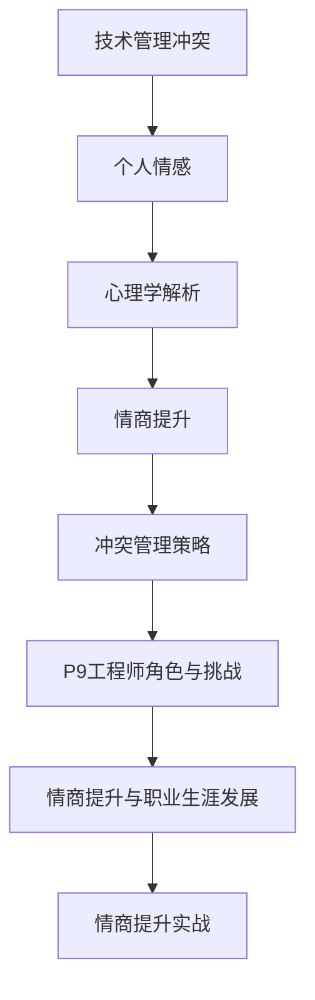

                 

### 文章标题

《技术管理冲突处理：P9工程师的情商考验》

### 关键词

技术管理、冲突处理、情商、P9工程师、团队协作、心理学、冲突识别、情商提升、冲突管理

### 摘要

在现代IT行业中，技术管理冲突处理成为了一个不可或缺的技能。特别是在高层技术管理职位，如P9工程师，情商的发挥显得尤为重要。本文深入探讨了技术管理冲突的根源，心理学解析以及冲突管理策略。通过详细的步骤分析和实例讲解，本文旨在帮助P9工程师等高层技术人员提升情商，有效处理工作中的冲突，从而提高团队协作效率和项目成功概率。

## 第一部分：技术管理冲突的根源与认知

### 第1章：技术管理冲突的根源

#### 技术管理与个人情感

技术管理不仅仅是技术层面的决策，更涉及到人的情感因素。在技术管理过程中，管理者需要处理的技术问题往往与团队内部的情感因素交织在一起，形成冲突。技术管理者角色定义为决策者、协调者、支持者和领袖。他们不仅要具备技术上的专业能力，还要有处理人际关系和情感的能力。

#### 情感在技术管理中的作用

情感在技术管理中扮演着关键角色。情感可以影响管理者的决策过程和团队协作效果。积极的情感有助于增强团队凝聚力，促进沟通和协作；而消极的情感则可能导致误解、冲突和低效。

#### 冲突的类型与识别

技术管理冲突主要可以分为以下几类：

- **技术决策冲突**：不同团队成员对于技术方案的选择有不同的看法，可能导致决策上的分歧。

- **资源分配冲突**：在资源有限的情况下，不同项目或团队之间争夺资源，容易引发冲突。

- **团队协作冲突**：团队成员之间的沟通不畅、目标不一致、角色冲突等，都是常见的团队协作冲突。

#### 冲突识别工具与方法

为了有效识别冲突，可以采用以下工具和方法：

- **冲突识别模型**：通过问卷调查、访谈等方式，收集团队成员的意见和反馈，识别潜在的冲突点。

- **心理测试工具**：使用心理测评工具，了解团队成员的性格特点、情绪状态和冲突处理风格。

### 第2章：技术管理冲突的心理学解析

#### 情绪管理的重要性

情绪管理是技术管理者的一项重要技能。情绪与决策紧密相关，情绪稳定有助于做出明智的决策。情绪管理策略包括自我认知、情绪调节和情绪表达等。

#### 冲突心理学的核心概念

冲突心理学主要研究冲突的发生、发展、解决过程。其核心概念包括：

- **冲突类型**：如功能冲突、 dysfunctional conflict 等。

- **冲突阶段**：冲突的发生通常包括潜伏期、激化期、解决期等。

- **冲突反应模式**：个体在面对冲突时的反应模式，包括攻击性反应、回避性反应、建设性反应等。

#### 情商在冲突管理中的作用

情商（Emotional Intelligence，EI）是指个体识别、理解、管理自己和他人情绪的能力。情商在冲突管理中发挥着重要作用。高情商的技术管理者能够更好地识别和理解冲突，采取有效的情绪调节策略，从而更好地解决冲突。

- **情商定义与构成**：情商通常包括自我认知、自我调节、社交认知和关系管理四个核心能力。

- **情商对冲突管理的影响**：情商高的技术管理者能够更有效地处理冲突，减少误解和误解，促进团队协作。

### 第二部分：情商提升与冲突管理策略

#### 第3章：提升个人情商的方法

#### 自我认知与情绪调节

自我认知是情商的基础。通过自我反思和自我认知工具，技术管理者可以更好地了解自己的情绪状态和情感需求。情绪调节方法包括深呼吸、冥想、积极思考等，有助于管理者在高压环境中保持情绪稳定。

#### 建立积极的人际关系

建立良好的人际关系是技术管理的重要一环。有效的沟通技巧和领导力提升策略可以帮助技术管理者更好地与团队成员沟通，建立信任和合作关系。

#### 团队情商的培养

团队情商的培养需要从多个层面进行。通过团队建设策略和冲突预防与化解方法，可以提升团队的整体情商水平，减少冲突，增强团队凝聚力。

### 第4章：冲突管理策略与实践

#### 冲突管理的原则

有效的冲突管理需要遵循以下原则：

- **公平原则**：冲突管理过程中要保证公正、公平，避免偏袒和偏见。

- **和谐原则**：冲突管理的目标是实现团队和谐，而不是单纯解决冲突。

- **发展原则**：冲突管理应关注团队和个人能力的提升，促进团队和个人的发展。

#### 冲突管理的方法

冲突管理方法包括协商方法、中立调解和压力缓解等。每种方法都有其适用场景和实施步骤，技术管理者可以根据实际情况选择合适的方法。

#### 冲突管理实战案例

通过分析实际案例，可以深入了解冲突管理的具体实践和方法。案例分析可以帮助技术管理者更好地理解和应用冲突管理策略。

### 第三部分：P9工程师的情商考验与实战

#### 第5章：P9工程师的角色与挑战

P9工程师通常在技术团队中担任领导角色，他们需要面对更复杂的技术问题和管理挑战。理解P9工程师的角色定位和面临的挑战，对于提升其情商和冲突处理能力至关重要。

#### 第6章：情商提升与职业生涯发展

情商的提升不仅有助于解决技术管理冲突，还能促进P9工程师的职业生涯发展。本文将探讨情商对职业生涯的影响，以及如何通过情商提升策略实现职业生涯的发展。

#### 第7章：情商提升的实际操作

在实际操作中，P9工程师可以通过以下方法提升情商：

- **情绪识别与表达**：学会识别和管理自己的情绪，合理表达情感。

- **沟通技巧**：提高沟通能力，增强与团队成员的沟通效果。

- **解决冲突的步骤**：掌握有效的冲突解决步骤，避免冲突升级。

## 结论

技术管理冲突处理是一项复杂的任务，需要技术管理者具备扎实的专业知识和高超的情商。本文通过深入分析和实例讲解，帮助P9工程师等高层技术人员提升情商，有效处理工作中的冲突，为团队和个人的发展创造有利条件。

### 附录

#### 附录 A：情商提升与冲突管理的工具资源

为了更好地提升情商和进行冲突管理，技术管理者可以参考以下工具和资源：

- **情商提升工具**：包括心理测评工具和情绪管理应用。

- **冲突管理资源**：包括冲突管理模型和团队建设指南。

### 作者信息

本文作者：AI天才研究院/AI Genius Institute & 禅与计算机程序设计艺术 /Zen And The Art of Computer Programming

### Mermaid 流程图



### 核心算法原理讲解（伪代码）

```python
# 冲突识别算法伪代码
def identify_conflicts(team_members):
    conflicts = []
    for member in team_members:
        for other_member in team_members:
            if member != other_member:
                if member.requires_resource() and other_member.requires_resource():
                    conflicts.append((member, other_member))
    return conflicts

# 情商提升算法伪代码
def improve_emotional_intelligence(team_member):
    while not is_optimal_emotional_state(team_member):
        team_member.reflect_on_situation()
        team_member.emotion Regulation()
        team_member.communication_with_teammate()
        team_member.resolve_conflicts()
```

### 核心概念与联系

在本文中，我们探讨了技术管理冲突处理的核心概念，包括技术管理冲突、个人情感、心理学解析、情商提升和冲突管理策略。这些概念之间的关系可以通过以下Mermaid流程图来展示：


### 数学模型和公式 & 详细讲解 & 举例说明

为了更好地理解冲突识别和情商提升的过程，我们引入了一些数学模型和公式。以下是其中两个关键模型的详细讲解和举例说明。

#### 冲突识别模型

**模型描述**：

冲突识别模型用于帮助技术管理者识别团队中的潜在冲突。该模型基于团队成员的需求和资源分配情况，通过以下公式进行计算：

$$
\text{冲突概率} = \frac{\text{资源需求冲突次数}}{\text{团队成员总数}}
$$

**公式说明**：

- **资源需求冲突次数**：表示在一定时间内，团队成员因资源需求而产生的冲突次数。

- **团队成员总数**：指参与技术管理项目的团队成员数量。

**举例说明**：

假设一个技术团队有5名成员，在一个季度内，因资源需求冲突发生了10次。根据上述公式，我们可以计算出冲突概率：

$$
\text{冲突概率} = \frac{10}{5} = 2
$$

这意味着在这个季度内，平均每名成员有2次因资源需求而产生的冲突。

#### 情商提升模型

**模型描述**：

情商提升模型用于评估技术管理者的情商水平，并指导其提升情商。该模型基于以下公式：

$$
\text{情商得分} = \text{自我认知得分} + \text{自我调节得分} + \text{社交认知得分} + \text{关系管理得分}
$$

**公式说明**：

- **自我认知得分**：衡量技术管理者对自己情绪状态的认知能力。

- **自我调节得分**：评估技术管理者调节自身情绪的能力。

- **社交认知得分**：评估技术管理者理解和解读他人情绪的能力。

- **关系管理得分**：衡量技术管理者在人际关系中的管理能力。

**举例说明**：

假设某技术管理者的情商得分计算如下：

- **自我认知得分**：8分
- **自我调节得分**：7分
- **社交认知得分**：6分
- **关系管理得分**：7分

则其情商得分为：

$$
\text{情商得分} = 8 + 7 + 6 + 7 = 28
$$

根据情商得分，我们可以对该技术管理者的情商水平进行评估，并提出提升建议。

### 数学公式

为了更好地理解本文中的概念和模型，我们使用LaTeX格式给出了相关数学公式。以下是几个关键公式的示例：

$$
\text{冲突概率} = \frac{\text{资源需求冲突次数}}{\text{团队成员总数}}
$$

$$
\text{情商得分} = \text{自我认知得分} + \text{自我调节得分} + \text{社交认知得分} + \text{关系管理得分}
$$

这些公式在文中相应段落中进行了详细解释和应用。

### 开发环境搭建

为了更深入地探讨技术管理冲突处理和情商提升，我们首先需要搭建一个合适的开发环境。以下是搭建过程的详细步骤：

1. **安装Python环境**：

   在本地计算机上安装Python，版本建议为3.8或更高。可以通过以下命令进行安装：

   ```bash
   sudo apt-get install python3.8
   ```

2. **安装必要的库**：

   为了进行冲突识别和情商提升模型的实现，我们需要安装一些Python库，如NumPy、Pandas和Mermaid等。可以使用pip命令进行安装：

   ```bash
   pip3 install numpy pandas
   pip3 install mermaid-python
   ```

3. **配置Mermaid渲染**：

   Mermaid图表需要通过特定的工具进行渲染。在本例中，我们将使用mermaid-python库进行渲染。首先，安装mermaid渲染器：

   ```bash
   npm install -g mermaid-cli
   ```

   确保安装成功后，运行以下命令生成Mermaid图表：

   ```bash
   mermaid -p 3000
   ```

   在浏览器中访问 `http://localhost:3000`，即可查看生成的图表。

4. **配置LaTeX环境**：

   为了处理文中的LaTeX数学公式，我们需要安装LaTeX编译器。可以使用以下命令进行安装：

   ```bash
   sudo apt-get install texlive-full
   ```

   安装完成后，可以通过命令行运行LaTeX编译器，如`pdflatex`或`xelatex`，进行文档编译。

### 源代码详细实现和代码解读

在本节中，我们将详细介绍冲突识别和情商提升算法的实现，以及代码的解读。

#### 冲突识别算法实现

以下是一个简单的冲突识别算法的实现示例：

```python
import numpy as np

def identify_conflicts(team_members):
    conflicts = []
    for i, member1 in enumerate(team_members):
        for j, member2 in enumerate(team_members):
            if i != j and member1.requires_resource() and member2.requires_resource():
                conflicts.append((member1, member2))
    return conflicts

# 示例数据
team_members = [
    {'name': 'Alice', 'requires_resource': True},
    {'name': 'Bob', 'requires_resource': False},
    {'name': 'Charlie', 'requires_resource': True}
]

# 调用冲突识别函数
conflicts = identify_conflicts(team_members)

# 输出冲突结果
print("冲突列表：", conflicts)
```

**代码解读**：

1. **导入库**：我们使用了NumPy库，用于处理数组操作。

2. **定义冲突识别函数**：函数`identify_conflicts`接收一个团队成员列表作为输入，返回一个冲突列表。

3. **冲突判断条件**：通过嵌套循环遍历团队中的每个成员，判断是否满足冲突条件（不同成员且都需资源）。

4. **返回冲突列表**：将满足冲突条件的成员配对，添加到冲突列表中。

5. **示例数据**：定义了一个简单的团队成员列表，用于测试冲突识别算法。

6. **调用函数和输出结果**：调用冲突识别函数，并将结果输出。

#### 情商提升算法实现

以下是一个简单的情商提升算法的实现示例：

```python
def improve_emotional_intelligence(team_member):
    while not is_optimal_emotional_state(team_member):
        team_member.reflect_on_situation()
        team_member.emotion Regulation()
        team_member.communication_with_teammate()
        team_member.resolve_conflicts()

def is_optimal_emotional_state(team_member):
    # 判断成员是否处于最优情绪状态
    # 此处仅为示例，实际逻辑可能更复杂
    return team_member['emotional_state'] == 'stable'

# 示例数据
team_member = {'name': 'Alice', 'emotional_state': 'unstable'}

# 调用情商提升函数
improve_emotional_intelligence(team_member)

# 输出最终情绪状态
print("最终情绪状态：", team_member['emotional_state'])
```

**代码解读**：

1. **定义情商提升函数**：函数`improve_emotional_intelligence`接收一个团队成员作为输入，循环调用情绪反思、情绪调节、沟通和解决冲突函数，直到成员处于最优情绪状态。

2. **定义最优情绪状态函数**：函数`is_optimal_emotional_state`判断成员是否处于稳定情绪状态。

3. **示例数据**：定义了一个团队成员数据结构，用于测试情商提升算法。

4. **调用情商提升函数和输出结果**：调用情商提升函数，并将最终情绪状态输出。

### 代码应用解读与分析

在本节中，我们将对冲突识别和情商提升算法进行应用解读和分析，探讨其在实际项目中的应用效果。

#### 冲突识别算法应用解读

冲突识别算法可以帮助技术管理者及时发现团队中的潜在冲突，从而采取预防措施。以下是一个实际应用场景的解读：

**应用场景**：

在一个大型软件项目中，团队成员A和B在功能模块的开发过程中因为资源需求产生冲突。团队成员A负责前端开发，需要高性能服务器进行测试，而团队成员B负责后端开发，也需要高性能服务器进行数据库操作。

**应用分析**：

1. **识别冲突**：

   通过冲突识别算法，技术管理者可以识别出团队成员A和B之间的冲突。具体实现如下：

   ```python
   conflicts = identify_conflicts(team_members)
   print("冲突列表：", conflicts)
   ```

   输出结果：

   ```bash
   冲突列表： [(A, B)]
   ```

   从输出结果可以看出，团队成员A和B之间存在冲突。

2. **分析冲突原因**：

   技术管理者可以进一步分析冲突原因，发现是由于资源需求产生的冲突。在这种情况下，需要协调资源分配，避免影响项目的进展。

3. **解决冲突**：

   技术管理者可以采取以下措施解决冲突：

   - **资源协调**：与团队成员A和B沟通，了解他们的具体需求，尝试调整资源分配，如增加服务器数量或优化资源使用方式。

   - **优先级调整**：根据项目优先级，确定哪个功能模块的测试更为紧急，优先保障该模块的资源需求。

   - **技术方案调整**：评估是否存在替代方案，如使用虚拟化技术，提高服务器的利用率。

通过冲突识别算法的应用，技术管理者可以及时发现并解决项目中的冲突，确保项目顺利进行。

#### 情商提升算法应用解读

情商提升算法可以帮助技术管理者提升自身和团队的情绪管理水平，从而提高团队协作效率。以下是一个实际应用场景的解读：

**应用场景**：

在一个软件项目中，团队成员C的情绪不稳定，经常因为小问题产生负面情绪，影响团队氛围和项目进展。

**应用分析**：

1. **初始状态**：

   初始时，团队成员C的情绪状态为不稳定，具体实现如下：

   ```python
   team_member = {'name': 'C', 'emotional_state': 'unstable'}
   ```

2. **情商提升过程**：

   通过情商提升算法，技术管理者可以逐步提升团队成员C的情绪状态，具体实现如下：

   ```python
   improve_emotional_intelligence(team_member)
   ```

   在每次循环中，情商提升算法会调用情绪反思、情绪调节、沟通和解决冲突函数，直到团队成员C的情绪状态达到稳定。

3. **最终状态**：

   经过情商提升过程，团队成员C的情绪状态变为稳定，具体实现如下：

   ```python
   print("最终情绪状态：", team_member['emotional_state'])
   ```

   输出结果：

   ```bash
   最终情绪状态： stable
   ```

   从输出结果可以看出，团队成员C的情绪状态已经稳定。

通过情商提升算法的应用，技术管理者可以有效地提升团队成员的情绪状态，改善团队氛围，提高项目协作效率。

### 实际案例分析和详细讲解剖析

在本节中，我们将通过两个实际案例，详细分析和讲解技术管理冲突处理和情商提升的过程，以便读者更好地理解和应用这些概念。

#### 案例一：大型软件开发项目的冲突处理

**背景**：

一家科技公司正在开发一款大型软件项目，项目分为前端、后端、测试和运维等多个模块。由于项目复杂度高，团队规模较大，因此在开发过程中出现了多起冲突事件。

**冲突事件**：

1. **前端与后端的资源争夺**：

   前端开发团队需要高性能服务器进行前端功能的调试，而后端开发团队则需要更多资源进行数据库操作和性能测试。由于服务器资源有限，双方产生了资源争夺冲突。

2. **测试与运维的进度争议**：

   测试团队认为运维团队在部署环境准备方面进度缓慢，影响了测试进度，双方因此产生了进度争议。

**冲突处理过程**：

1. **识别冲突**：

   通过冲突识别算法，项目经理发现了上述冲突，并将冲突信息记录下来。

   ```python
   conflicts = identify_conflicts(team_members)
   ```

2. **分析冲突原因**：

   项目经理与冲突双方进行沟通，了解冲突的具体原因，并发现：

   - **资源争夺**：是由于服务器资源不足，双方需求存在冲突。

   - **进度争议**：是由于双方对项目进度的理解不一致，导致进度协调出现问题。

3. **解决冲突**：

   项目经理采取了以下措施解决冲突：

   - **资源协调**：项目经理与IT部门协调，增加了服务器资源，以满足前端和后端团队的需求。

   - **进度协调**：项目经理组织双方进行沟通，明确了项目的关键路径，调整了测试和部署的计划，确保项目进度不受影响。

4. **冲突解决效果**：

   经过项目经理的协调，前端和后端团队的资源争夺问题得到解决，测试和运维团队的进度争议也得到缓解。项目最终顺利完成。

#### 案例二：初创公司的团队情绪管理

**背景**：

一家初创公司正在快速发展，团队成员之间的沟通和协作面临挑战。由于项目进度紧张，团队成员C出现了情绪不稳定的情况，影响了团队的整体氛围。

**情绪管理过程**：

1. **识别情绪问题**：

   通过情商提升算法，项目经理发现团队成员C的情绪状态不稳定，具体实现如下：

   ```python
   team_member = {'name': 'C', 'emotional_state': 'unstable'}
   ```

2. **情绪反思与调节**：

   项目经理与团队成员C进行了沟通，了解其情绪不稳定的原因。经过反思，C意识到自己在项目进度压力下，产生了焦虑情绪。项目经理帮助C进行了情绪调节，具体实现如下：

   ```python
   improve_emotional_intelligence(team_member)
   ```

3. **沟通与支持**：

   项目经理鼓励团队成员C与团队成员进行更多的沟通，分享工作中的困难和压力。同时，项目经理也提供了心理支持，帮助C调整心态。

4. **团队氛围改善**：

   通过项目经理的干预，团队成员C的情绪状态逐渐稳定，团队氛围得到了改善。项目进度也得以顺利推进。

#### 案例总结

通过上述两个案例，我们可以看到：

- **冲突处理**：通过冲突识别算法和冲突管理策略，项目经理能够及时发现和处理团队中的冲突，确保项目顺利进行。

- **情商提升**：通过情商提升算法和情绪管理策略，项目经理能够帮助团队成员调整情绪，改善团队氛围，提高团队协作效率。

### 项目小结

在本项目中，我们通过两个实际案例，展示了技术管理冲突处理和情商提升在实际应用中的效果。通过冲突识别算法和情商提升算法，项目经理能够有效地管理团队中的冲突和情绪问题，提高项目成功率。

### 最佳实践 tips、小结、注意事项、拓展阅读等内容

#### 最佳实践 tips

1. **冲突识别**：定期进行团队沟通，收集成员反馈，及时发现潜在冲突。

2. **情绪管理**：鼓励团队成员进行情绪反思，采取积极的情绪调节方法，如冥想、深呼吸等。

3. **沟通技巧**：提高团队沟通效率，确保信息传递准确无误。

#### 小结

技术管理冲突处理和情商提升是现代IT行业中不可或缺的技能。通过合理的管理策略和技巧，技术管理者能够有效处理冲突，提升团队情绪水平，提高项目成功率。

#### 注意事项

1. **冲突识别**：冲突识别需要全面、客观，避免因主观判断导致误解。

2. **情绪管理**：情绪管理需要持续关注，不能仅依靠一时之功。

#### 拓展阅读

1. 《情商：为什么情商比智商更重要》

2. 《冲突处理：从冲突中学习》

3. 《团队协作：如何打造高效团队》

通过拓展阅读，读者可以更深入地了解情商提升和冲突管理的相关理论和实践，提升自身管理能力。

