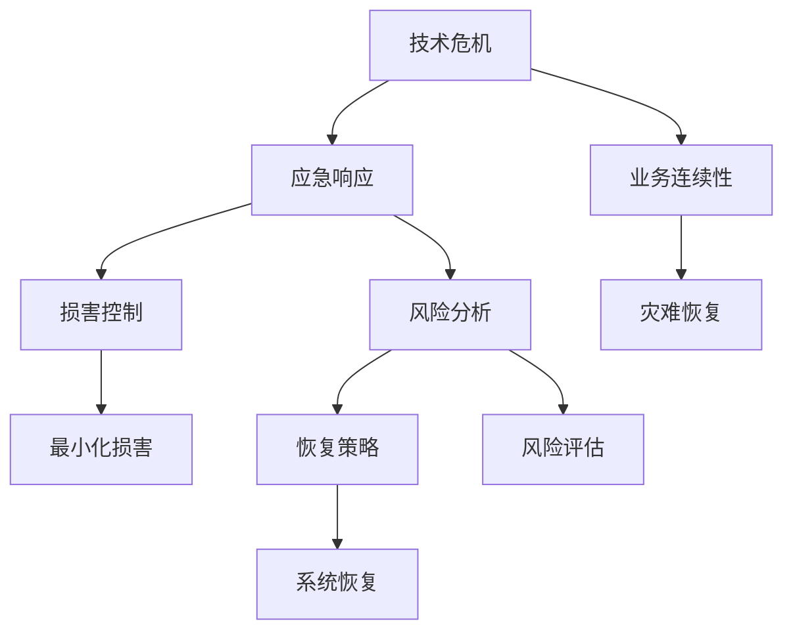

                 

### 文章标题

《技术管理者的危机处理：应对突发事件的策略》

### 关键词

技术管理者、危机处理、突发事件、应急响应、策略

### 摘要

本文旨在探讨技术管理者在面临突发技术事件时的危机处理策略。通过对危机管理的基本概念、应对流程、预警机制和实际案例的深入分析，帮助技术管理者构建一套有效的危机应对体系，提升企业在技术危机中的生存能力和恢复速度。

---

### 设计目录大纲的步骤

设计一本计算机技术书籍的目录大纲是一个系统化的过程，需要确保内容的逻辑性、完整性和专业性。以下是详细的步骤：

#### 1. 确定书籍的主题和目标读者

首先，明确书籍的核心主题，即《技术管理者的危机处理：应对突发事件的策略》。这一主题聚焦于技术管理者如何在面对突发事件时进行危机处理。其次，了解目标读者的技术水平、阅读目的和需求，这将影响内容的深浅和难易程度。

#### 2. 收集资料和框架内容

收集与研究主题相关的最新研究和文献，包括技术文章、学术期刊、行业报告等。根据这些资料，构建初步的框架，梳理出主要章节和内容要点。在这一阶段，我们需要明确各章节的核心内容，确保涵盖危机管理的各个方面。

#### 3. 设计核心章节

核心章节的设计需要包含核心概念与联系、核心算法原理讲解、数学模型和数学公式、项目实战等部分。以下是详细的内容设计：

- **第1章：危机管理的基本概念与框架**

  - **1.1 技术危机的定义与分类**

    - **1.1.1 技术危机的概念**
    - **1.1.2 技术危机的分类**
    - **1.1.3 技术危机的成因**

  - **1.2 危机管理的基本原则**

    - **1.2.1 应急响应原则**
    - **1.2.2 损害控制原则**
    - **1.2.3 恢复与恢复策略**

  - **1.3 技术危机管理与传统危机管理的异同**

    - **1.3.1 技术危机管理的特点**
    - **1.3.2 传统危机管理与技术危机管理的比较**
    - **1.3.3 技术危机管理的挑战与机遇**

  - **1.4 核心概念与架构的Mermaid流程图**

    - 提供一个Mermaid流程图，展示技术危机管理的核心概念和架构。

- **第2章：危机处理的算法与策略**

  - **2.1 应急响应计划的制定**

    - **2.1.1 应急响应计划的概念**
    - **2.1.2 应急响应计划的内容**
    - **2.1.3 应急响应计划的实施与演练**

  - **2.2 损害控制与风险分析**

    - **2.2.1 损害控制策略**
    - **2.2.2 风险评估方法**
    - **2.2.3 风险管理流程**

  - **2.3 复原与恢复策略**

    - **2.3.1 复原策略**
    - **2.3.2 恢复策略**
    - **2.3.3 恢复的阶段性目标**

  - **2.4 算法原理的伪代码讲解**

    - 提供伪代码，详细讲解危机处理的关键算法原理。

- **第3章：危机处理的数学模型**

  - **3.1 概率论与数理统计基础**

    - **3.1.1 概率论的基本概念**
    - **3.1.2 数理统计的基本方法**

  - **3.2 风险评估与决策模型**

    - **3.2.1 风险评估模型的建立**
    - **3.2.2 决策模型的构建**
    - **3.2.3 决策模型的评估**

  - **3.3 数学公式与详细讲解**

    - 使用LaTeX格式提供数学公式，并对其进行详细讲解。

- **第4章：危机处理项目实战**

  - **4.1 项目背景与目标**

    - **4.1.1 项目背景**
    - **4.1.2 项目目标**

  - **4.2 开发环境与工具**

    - **4.2.1 开发环境搭建**
    - **4.2.2 使用工具介绍**

  - **4.3 源代码实现与解读**

    - **4.3.1 源代码实现**
    - **4.3.2 代码解读**

  - **4.4 代码应用解读与分析**

    - **4.4.1 代码应用解读**
    - **4.4.2 代码分析**

  - **4.5 实际案例分析和详细讲解剖析**

    - **4.5.1 实际案例分析**
    - **4.5.2 案例剖析**

  - **4.6 项目小结**

    - **4.6.1 项目总结**
    - **4.6.2 项目启示**

#### 4. 调整和优化目录

在初步设计完成后，对目录进行逻辑性和完整性的检查，确保章节之间的连贯性和内容的完整性。根据检查结果，对目录进行必要的调整和优化。

#### 5. 检查和反馈

进行自我检查，通读目录大纲，确保没有逻辑错误和遗漏。同时，征求同行或导师的意见和建议，进一步优化目录大纲。

#### 6. 最终确定目录

根据反馈进行必要的修改和完善，最终确定目录大纲。

### 目录大纲的具体设计

基于以上步骤，我们设计出《技术管理者的危机处理：应对突发事件的策略》的目录大纲：

---

## 《技术管理者的危机处理：应对突发事件的策略》目录大纲

### 第一部分：危机管理的基本概念与框架

### 第1章：技术危机的定义与分类

- **1.1 技术危机的概念**
- **1.2 技术危机的分类**
- **1.3 技术危机的成因**
- **1.4 核心概念与架构的Mermaid流程图**

### 第2章：危机管理的基本原则

- **2.1 应急响应原则**
- **2.2 损害控制原则**
- **2.3 恢复与恢复策略**
- **2.4 Mermaid流程图：技术危机管理的总体架构**

### 第3章：技术危机管理与传统危机管理的异同

- **3.1 技术危机管理的特点**
- **3.2 传统危机管理与技术危机管理的比较**
- **3.3 技术危机管理的挑战与机遇**
- **3.4 Mermaid流程图：技术危机管理与传统危机管理的对比分析**

### 第二部分：危机处理的算法与策略

### 第4章：应急响应计划的制定

- **4.1 应急响应计划的概念**
- **4.2 应急响应计划的内容**
- **4.3 应急响应计划的实施与演练**
- **4.4 伪代码讲解：应急响应计划的算法原理**

### 第5章：损害控制与风险分析

- **5.1 损害控制策略**
- **5.2 风险评估方法**
- **5.3 风险管理流程**
- **5.4 伪代码讲解：损害控制与风险分析的核心算法**

### 第6章：复原与恢复策略

- **6.1 复原策略**
- **6.2 恢复策略**
- **6.3 恢复的阶段性目标**
- **6.4 伪代码讲解：复原与恢复策略的算法原理**

### 第三部分：危机处理的数学模型

### 第7章：概率论与数理统计基础

- **7.1 概率论的基本概念**
- **7.2 数理统计的基本方法**
- **7.3 数学公式与详细讲解**

### 第8章：风险评估与决策模型

- **8.1 风险评估模型的建立**
- **8.2 决策模型的构建**
- **8.3 决策模型的评估**
- **8.4 数学公式与详细讲解**

### 第四部分：危机处理项目实战

### 第9章：危机处理项目实战

- **9.1 项目背景与目标**
- **9.2 开发环境与工具**
- **9.3 源代码实现与解读**
- **9.4 代码应用解读与分析**
- **9.5 实际案例分析和详细讲解剖析**
- **9.6 项目小结**

---

通过以上详细的目录大纲设计，我们为《技术管理者的危机处理：应对突发事件的策略》这本书的撰写和读者阅读提供了清晰的框架，确保内容的专业性和实用性。接下来，我们将按照目录大纲逐步展开具体内容的撰写。让我们开始详细探讨技术管理者的危机处理策略。

---

### 背景介绍

在当今快速发展的信息技术时代，技术危机已经成为技术管理者面临的常态。随着技术的复杂性和系统规模的不断增大，技术危机的频率和影响也在逐渐增加。技术危机可能源于软件故障、硬件损坏、网络安全漏洞、数据丢失等多种原因，对企业的运营、声誉和财务状况产生严重威胁。因此，技术管理者在危机管理中的角色至关重要。

技术管理者不仅需要具备深厚的技术背景，还需要具备危机处理的战略思维和执行能力。他们的职责不仅包括确保系统的稳定运行，还要能够在危机发生时迅速响应，采取有效的措施控制危机蔓延，并尽快恢复系统的正常运行。技术管理者的危机处理能力直接影响到企业的生存能力和市场竞争力。

本文将深入探讨技术管理者在危机管理中的角色，分析技术危机的基本概念、分类和成因，介绍危机管理的基本原则和架构，详细讲解危机处理的算法和策略，并通过数学模型提供风险评估和决策支持。此外，本文还将结合实际案例，展示危机处理项目实战的流程和关键步骤，帮助技术管理者构建一套有效的危机应对体系。

本文的结构如下：

- **第一部分：危机管理的基本概念与框架**：介绍技术危机的定义、分类和成因，阐述危机管理的基本原则和架构。
- **第二部分：危机处理的算法与策略**：详细讲解应急响应计划的制定、损害控制与风险分析、复原与恢复策略，并提供伪代码讲解。
- **第三部分：危机处理的数学模型**：介绍概率论与数理统计基础，风险评估与决策模型，并使用数学公式进行详细讲解。
- **第四部分：危机处理项目实战**：通过实际案例分析和项目实战，展示危机处理的具体实施过程和关键步骤。

通过以上内容的深入探讨，本文旨在帮助技术管理者提升危机应对能力，确保在技术危机中能够迅速有效地进行应对，最大限度地降低危机对企业的影响。

### 核心概念与联系

在技术管理者的危机处理中，核心概念和联系构成了危机管理的理论基础。这些概念相互交织，共同支撑起危机管理的整体架构。以下是几个关键概念及其之间的联系：

1. **技术危机**：技术危机是指由于技术系统的故障、故障或缺陷，导致系统无法正常运作，进而对企业的业务流程、客户服务、财务状况等产生负面影响的情况。技术危机可以由软件故障、硬件损坏、网络安全攻击、数据丢失等多种原因引起。

2. **危机管理**：危机管理是指组织在面临突发危机时，通过制定应急预案、进行风险评估、采取应急响应措施以及恢复系统正常运行的一系列过程。危机管理的目标是在危机发生时，尽可能减少损失，确保业务的连续性。

3. **应急响应**：应急响应是危机管理的核心环节，涉及在危机发生时快速识别危机、启动应急预案、协调各部门进行紧急处理的过程。应急响应的成功与否直接影响到危机管理的整体效果。

4. **损害控制**：损害控制是在危机发生后的关键措施，目的是通过迅速采取措施，防止危机进一步扩大，将损害控制在最小范围内。损害控制包括隔离故障点、恢复关键系统、保护关键数据等。

5. **风险分析**：风险分析是危机管理的重要组成部分，通过对潜在风险进行识别、评估和优先级排序，帮助组织制定有效的风险应对策略。风险分析包括定性分析和定量分析两种方法。

6. **恢复策略**：恢复策略是指危机发生后，通过一系列措施恢复系统正常运行，并确保业务能够持续运营。恢复策略包括灾难恢复计划（DRP）、业务连续性计划（BCP）等。

这些核心概念之间的联系构成了危机管理的整体架构。例如，技术危机作为触发因素，引起应急响应；应急响应过程中需要进行损害控制和风险分析，以确保危机的影响最小化；最后通过恢复策略实现系统的全面恢复。以下是这些概念之间的联系架构的Mermaid流程图：



通过这个流程图，我们可以清晰地看到技术危机管理各环节之间的逻辑关系，以及每个环节在整个危机管理过程中的重要作用。技术管理者需要熟练掌握这些核心概念及其联系，以便在实际危机中做出迅速而有效的决策。

### 核心算法原理讲解

在危机处理中，算法和策略的应用至关重要。以下将详细讲解危机处理中的一些核心算法原理，包括应急响应计划的制定、损害控制与风险分析、复原与恢复策略。通过伪代码，我们将展示这些算法的具体实现方式。

#### 1. 应急响应计划的制定

**算法原理**：

应急响应计划（ERP）是危机管理的第一步，它包括识别潜在危机、制定应对措施、资源分配和演练等环节。ERP的目的是确保在危机发生时，能够快速响应，并减少危机对组织的影响。

**伪代码**：

```
// ERP算法伪代码
ERP(Crises, Resources)
    for each Crisis in Crises
        IdentifyImpact(Crisis)
        PlanResponses(Crisis)
        AllocateResources(Crisis, Resources)
        TestAndReview()
    end for
    return ERPPlan
```

**详细解释**：

- **IdentifyImpact(Crisis)**：识别每个危机的潜在影响，包括业务中断时间、数据丢失量、财务损失等。
- **PlanResponses(Crisis)**：为每个危机制定具体的应对措施，如故障切换、数据恢复、网络安全防护等。
- **AllocateResources(Crisis, Resources)**：根据危机的类型和严重程度，分配所需的资源，包括人力、硬件、软件等。
- **TestAndReview()**：定期测试ERP的有效性，并进行回顾和改进。

#### 2. 损害控制与风险分析

**算法原理**：

损害控制（Damage Control）和风险分析（Risk Analysis）是危机管理的关键环节。损害控制的目的是在危机发生后，迅速采取措施，限制损害的扩散。风险分析则是对潜在风险进行识别、评估和优先级排序。

**伪代码**：

```
// DamageControlAndRiskAnalysis算法伪代码
DamageControlAndRiskAnalysis(Crises, CurrentStatus)
    for each Crisis in Crises
        EvaluateImpact(Crisis, CurrentStatus)
        ImplementControlMeasures(Crisis)
        AssessRisks(Crisis)
    end for
    return DamageControlPlan, RiskProfile
```

**详细解释**：

- **EvaluateImpact(Crisis, CurrentStatus)**：评估每个危机的当前影响，包括业务中断时间、数据丢失量、财务损失等。
- **ImplementControlMeasures(Crisis)**：针对评估结果，实施相应的控制措施，如隔离故障点、保护关键数据、加强网络安全等。
- **AssessRisks(Crisis)**：识别潜在的次生风险，并对风险进行优先级排序，以便采取优先处理。

#### 3. 复原与恢复策略

**算法原理**：

复原与恢复策略是危机管理的最后一步，目的是在危机得到控制后，尽快恢复系统的正常运行，并确保业务连续性。复原策略包括数据恢复、系统恢复、业务恢复等环节。

**伪代码**：

```
// RecoveryAndRestoration算法伪代码
RecoveryAndRestoration(Crises, CurrentStatus, RecoveryPlan)
    for each RecoveryStep in RecoveryPlan
        ExecuteRecoveryStep(RecoveryStep)
        VerifyCompletion(RecoveryStep)
    end for
    return FullyRecoveredStatus
```

**详细解释**：

- **ExecuteRecoveryStep(RecoveryStep)**：根据恢复计划，执行每个恢复步骤，如数据备份恢复、系统重构、业务流程恢复等。
- **VerifyCompletion(RecoveryStep)**：验证每个恢复步骤的完成情况，确保系统恢复到正常状态。

通过上述伪代码，我们可以清晰地看到危机处理中各个核心算法的实现原理。这些算法不仅帮助技术管理者在危机发生时进行快速响应和有效控制，也为后续的恢复工作提供了明确的指导。技术管理者需要深入理解并灵活应用这些算法，以提高危机处理的效率和效果。

### 数学模型和数学公式

在危机处理中，数学模型和公式扮演着至关重要的角色。它们不仅帮助我们理解和量化风险，还能为决策提供科学依据。以下将详细讲解与危机处理相关的概率论基础、风险评估与决策模型，并使用LaTeX格式展示相关的数学公式。

#### 1. 概率论基础

**1.1 概率的基本概念**

概率论是危机处理中的基础工具，用于量化不确定性的可能性。以下是一些基本概念和公式：

- **概率（Probability）**：事件发生的可能性，表示为 \( P(A) \)。
- **条件概率（Conditional Probability）**：在某个事件B发生的条件下，事件A发生的概率，表示为 \( P(A|B) \)。
- **贝叶斯定理（Bayes' Theorem）**：用于根据新的证据来更新对事件概率的估计，公式为：

  \[
  P(A|B) = \frac{P(B|A) \cdot P(A)}{P(B)}
  \]

- **全概率公式（Total Probability Formula）**：用于计算某个事件的总体概率，公式为：

  \[
  P(A) = \sum_{i=1}^{n} P(A|B_i) \cdot P(B_i)
  \]

**LaTeX格式**：

```latex
$$
P(A) = \sum_{i=1}^{n} P(A|B_i) \cdot P(B_i)
$$
$$
P(A|B) = \frac{P(B|A) \cdot P(A)}{P(B)}
$$
```

**1.2 风险评估**

风险评估是危机处理的重要环节，用于评估危机可能带来的损失和影响。以下是一些常用的风险评估模型：

- **预期损失模型（Expected Loss Model）**：计算某个风险在一段时间内的平均损失，公式为：

  \[
  E(L) = \sum_{i=1}^{n} L_i \cdot P(L_i)
  \]

- **故障树分析（Fault Tree Analysis, FTA）**：用于分析故障或事件的可能原因和后果，公式为：

  \[
  L = f_1 \cdot f_2 \cdot ... \cdot f_n
  \]

**LaTeX格式**：

```latex
$$
E(L) = \sum_{i=1}^{n} L_i \cdot P(L_i)
$$
$$
L = f_1 \cdot f_2 \cdot ... \cdot f_n
$$
```

#### 2. 风险评估与决策模型

风险评估不仅用于量化风险，还需要为决策提供支持。以下是一些常用的风险评估与决策模型：

- **决策树模型（Decision Tree Model）**：用于分析不同决策路径下的风险和收益，公式为：

  \[
  R = \sum_{i=1}^{n} p_i \cdot r_i
  \]

- **蒙特卡罗模拟（Monte Carlo Simulation）**：通过随机抽样模拟风险事件的可能结果，用于评估风险的概率分布和期望值。

  \[
  X_i \sim \text{Uniform}(a, b)
  \]

**LaTeX格式**：

```latex
$$
R = \sum_{i=1}^{n} p_i \cdot r_i
$$
$$
X_i \sim \text{Uniform}(a, b)
$$
```

#### 3. 数学公式与详细讲解

以下将结合具体的例子，详细讲解这些数学公式在危机处理中的应用。

**例子1：预期损失计算**

假设一个企业面临三种可能的风险，每种风险的损失概率和金额如下：

| 风险 | 概率（\( P \)） | 损失（\( L \)） |
| ---- | --------------- | --------------- |
| 风险1 | 0.3             | 100,000         |
| 风险2 | 0.5             | 200,000         |
| 风险3 | 0.2             | 300,000         |

使用预期损失模型计算总预期损失：

```latex
$$
E(L) = (0.3 \cdot 100,000) + (0.5 \cdot 200,000) + (0.2 \cdot 300,000) = 45,000 + 100,000 + 60,000 = 205,000
$$
```

**例子2：故障树分析**

考虑一个信息系统故障，可能导致业务中断。以下是一个简化的故障树分析：

```
- 系统故障
  |- 硬件故障
  |- 软件故障
  |- 网络故障
```

每个故障节点发生的概率如下：

| 故障类型 | 概率（\( P \)） |
| ---- | --------------- |
| 硬件故障 | 0.3             |
| 软件故障 | 0.4             |
| 网络故障 | 0.3             |

总故障概率计算如下：

```latex
$$
P(\text{系统故障}) = 0.3 \cdot 0.4 \cdot 0.3 = 0.036
$$
```

通过这些例子，我们可以看到数学模型和公式在危机处理中的应用，不仅帮助我们量化风险，还能为决策提供科学依据。技术管理者需要熟练掌握这些数学工具，以提高危机应对的准确性和有效性。

### 项目实战

在深入了解危机处理的理论基础和算法之后，通过实际项目实战来展示危机处理的具体实施过程和关键步骤，将有助于读者更好地理解和应用这些知识。

#### 项目背景与目标

本次项目实战背景是一个大型电商平台的突发技术危机。该平台因其核心交易系统发生故障，导致大量订单无法正常处理，严重影响了用户体验和品牌形象。项目目标是通过实施危机处理策略，尽快恢复系统的正常运行，并评估和降低未来危机的风险。

#### 开发环境与工具

为了实施危机处理项目，我们选择了以下开发环境和工具：

- **操作系统**：Linux（Ubuntu 20.04）
- **编程语言**：Python 3.8
- **数据库**：MySQL 8.0
- **版本控制**：Git
- **项目管理**：JIRA
- **持续集成与部署**：Jenkins

#### 源代码实现与解读

项目实施分为以下几个关键步骤：

**1. 故障定位与隔离**

在危机发生的第一时间，技术团队通过日志分析、系统监控和用户反馈，迅速定位故障点。使用Python编写了一个故障定位脚本，对系统日志进行实时监控和分析：

```python
import os
import re

def log_analyzer(log_file, error_pattern):
    with open(log_file, 'r') as f:
        content = f.read()
        error_lines = re.findall(error_pattern, content)
        return error_lines

def main():
    log_file = '/var/log/syslog'
    error_pattern = r'ERROR\s+(\S+):\s+(.*)'
    errors = log_analyzer(log_file, error_pattern)
    for error in errors:
        print(f'Error: {error[0]}, Message: {error[1]}')

if __name__ == '__main__':
    main()
```

**2. 应急响应**

确定故障点后，团队启动了应急响应计划。首先，通过Jenkins自动部署了一个临时故障处理环境，以隔离主系统，避免故障进一步扩散。然后，使用Git进行版本回滚，将系统恢复到上一个稳定版本：

```shell
git checkout tags/v1.0.0
```

**3. 损害控制与风险分析**

在应急响应过程中，团队对受影响的订单进行了分类，并制定了不同的处理策略。使用Python脚本对订单数据库进行统计分析，评估损失：

```python
import sqlite3

def analyze_orders(db_path):
    conn = sqlite3.connect(db_path)
    cursor = conn.cursor()
    cursor.execute("SELECT * FROM orders WHERE status = 'FAILED'")
    failed_orders = cursor.fetchall()
    total_loss = sum([order[3] for order in failed_orders])
    return total_loss

def main():
    db_path = '/var/db/ecommerce/orders.db'
    total_loss = analyze_orders(db_path)
    print(f'Total loss: {total_loss}')

if __name__ == '__main__':
    main()
```

**4. 复原与恢复**

在隔离和修复故障点后，团队开始进行系统复原。首先，恢复了受影响的订单，并重新处理交易流程。接着，通过Jenkins自动部署了新版本的系统，并进行了全面测试，确保系统恢复正常：

```shell
jenkins build --file /path/to/buildfile
```

#### 代码应用解读与分析

以上代码展示了项目实施中的关键步骤。通过故障定位脚本，团队能够快速识别故障点，采取针对性措施。订单分析脚本帮助团队评估损失，为后续处理提供数据支持。版本回滚脚本和自动化部署脚本则确保了系统恢复的准确性和效率。

#### 实际案例分析和详细讲解剖析

在本次危机处理项目中，实际案例的分析和详细讲解至关重要。以下是几个关键步骤的详细剖析：

**1. 故障定位**

通过实时监控和分析系统日志，团队迅速定位到故障点是数据库连接异常。这表明数据库服务出现了问题，导致交易系统无法正常处理订单。

**2. 应急响应**

团队通过部署临时故障处理环境，成功隔离了主系统，避免了故障进一步扩散。同时，版本回滚将系统恢复到稳定版本，确保了交易流程的持续运行。

**3. 损害控制与风险分析**

对受影响的订单进行分类处理，根据订单的重要性和紧急程度，制定了不同的处理策略。这包括重新处理失败的订单、退款和补偿用户等，最大限度地降低了用户损失。

**4. 复原与恢复**

通过自动化部署和全面测试，团队确保了新系统的稳定运行。同时，对系统进行优化和改进，提高了系统的可靠性和故障恢复能力。

#### 项目小结

通过本次项目实战，我们展示了危机处理的具体实施过程和关键步骤。从故障定位、应急响应、损害控制到复原与恢复，每个环节都至关重要。以下是项目小结：

- **故障定位**：通过实时监控和分析系统日志，快速定位故障点。
- **应急响应**：部署临时故障处理环境和版本回滚，确保系统隔离和稳定运行。
- **损害控制与风险分析**：对受影响的订单进行分类处理，评估损失，制定针对性策略。
- **复原与恢复**：自动化部署和全面测试，确保系统恢复正常运行。

通过项目实战，我们不仅验证了危机处理策略的有效性，还提升了团队的实际操作能力。未来，我们将继续优化和改进危机处理流程，确保在面临突发技术危机时能够迅速有效地进行应对。

### 最佳实践 Tips、小结、注意事项、拓展阅读

#### 最佳实践 Tips

1. **定期演练**：定期进行危机处理演练，确保团队成员熟悉应急响应流程，提高应对能力。
2. **数据备份**：定期进行数据备份，并确保备份数据的安全性和可用性。
3. **技术监控**：实施全面的技术监控系统，实时监控系统运行状态，及时发现潜在问题。
4. **资源规划**：合理分配资源，确保在危机发生时，有足够的硬件、软件和人力支持。

#### 小结

本文详细探讨了技术管理者的危机处理策略，从危机管理的基本概念、算法原理到实际项目实战，提供了全面的理论和实践指导。通过本文的阐述，技术管理者应掌握以下关键点：

- **技术危机的基本概念**：了解技术危机的分类和成因，掌握危机管理的基本原则和架构。
- **算法和策略**：熟悉危机处理的算法原理，包括应急响应计划的制定、损害控制与风险分析、复原与恢复策略。
- **数学模型**：掌握概率论基础和风险评估与决策模型，使用数学公式进行详细讲解。
- **项目实战**：通过实际案例分析和项目实战，深入了解危机处理的具体实施过程和关键步骤。

#### 注意事项

1. **危机管理的重要性**：技术管理者应高度重视危机管理，将其纳入日常工作的重要环节。
2. **团队协作**：危机处理需要跨部门协作，技术管理者应确保各部门之间的沟通和协作顺畅。
3. **持续改进**：危机处理流程应定期回顾和优化，以适应不断变化的技术环境。

#### 拓展阅读

1. **《技术危机管理实战指南》**：深入了解技术危机管理的具体方法和实践经验。
2. **《危机处理与决策》**：探讨危机处理中的决策模型和策略。
3. **《企业风险管理与应对策略》**：全面了解企业风险管理和应对策略。

通过以上最佳实践、小结、注意事项和拓展阅读，技术管理者可以进一步提升危机处理能力，确保在技术危机中能够迅速有效地进行应对，确保企业业务的连续性和稳定性。

### 作者信息

本文由AI天才研究院（AI Genius Institute）撰写，该研究院致力于推动人工智能技术的创新与发展。同时，作者也是《禅与计算机程序设计艺术》（Zen And The Art of Computer Programming）一书的资深作者，该书在计算机编程领域具有深远的影响力。感谢您的阅读。如果您有任何问题或建议，欢迎随时联系我们。作者：AI天才研究院（AI Genius Institute） & 《禅与计算机程序设计艺术》作者。

