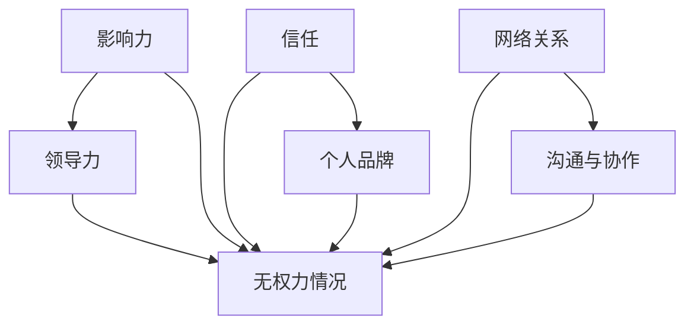
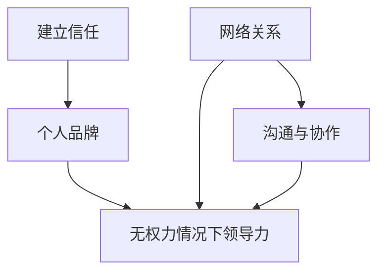

                 


### 文章标题

《技术管理者的影响力构建：无权力情况下的领导力》

### 关键词

技术管理者，影响力，领导力，无权力情况，信任，个人品牌，网络关系，沟通与协作，算法原理，数学模型，项目实战

### 摘要

本文旨在探讨在无权力情况下，技术管理者如何通过构建影响力来发挥领导力。文章首先介绍了影响力的基本概念和重要性，随后通过Mermaid流程图展示了影响力与领导力、信任、个人品牌、网络关系和沟通与协作等核心概念之间的联系。接下来，文章详细阐述了建立信任、建立个人品牌、建立网络关系和有效沟通与协作等构建影响力的策略。此外，文章还通过实战案例分析了这些策略的具体应用，并提供了项目实战的详细讲解。最后，文章总结了最佳实践、注意事项和拓展阅读，为技术管理者提供了一套全面的影响力构建指南。

## 第一部分：影响力与领导力的基本概念

### 第1章：影响力的定义与重要性

#### 背景介绍

在技术领域，影响力是一种至关重要的能力。它不仅仅关乎个人魅力，更涉及到如何通过非权力手段来引导和影响他人。特别是在无权力情况下，技术管理者需要更加依赖于影响力来推动项目的进展和团队的协作。

#### 核心概念与联系

在探讨影响力之前，我们首先需要明确几个核心概念：影响力、领导力、无权力情况等。

- **影响力**：指个体通过非权力手段影响他人思想和行为的能力。
- **领导力**：指通过引导、激励和塑造他人行为来实现共同目标的能力。
- **无权力情况**：指在缺乏正式权力（如职位、资源等）的情况下，需要依靠其他因素来影响他人。

通过Mermaid流程图，我们可以清晰地展示这些概念之间的联系：



#### 影响力的重要性

在无权力情况下，影响力成为技术管理者能否成功的关键因素。它不仅决定了管理者能否有效地推动项目，还影响了团队成员对其的信任和尊重。以下是影响力的重要性：

- **推动项目进展**：通过影响力，技术管理者可以激励团队成员积极投入项目，提高工作效率。
- **促进知识共享**：影响力可以促进团队成员之间的知识共享，从而提高团队的整体能力。
- **建立团队文化**：通过影响力，技术管理者可以塑造团队的价值观和行为规范，建立积极向上的团队文化。

### 第2章：无权力情况下的领导力框架

#### 背景介绍

无权力情况下的领导力是一种特殊形式的领导能力，它要求技术管理者在不依赖正式职位和权力的情况下，通过其他手段来影响和领导团队。了解无权力情况下领导力的特点和方法，对于技术管理者来说至关重要。

#### 无权力情况下的领导力特点

- **依赖非正式权力**：无权力情况下的领导力依赖于个人魅力、专业能力和人际关系等非正式权力。
- **强调信任与尊重**：在无权力情况下，技术管理者需要通过建立信任和赢得尊重来影响他人。
- **注重沟通与协作**：有效的沟通和协作是构建无权力情况下领导力的关键。

#### 无权力情况下领导力的核心要素

- **建立信任**：信任是影响他人行为和思想的基础。技术管理者需要通过透明沟通、履行承诺和提供支持来建立信任。
- **个人品牌**：个人品牌是技术管理者影响力的体现。通过持续学习和分享专业知识，技术管理者可以建立强大的个人品牌。
- **网络关系**：建立和维护良好的网络关系可以帮助技术管理者获取资源和支持，从而提高影响力。
- **沟通与协作**：有效的沟通和协作是确保团队目标一致和任务顺利完成的关键。

通过Mermaid流程图，我们可以清晰地展示无权力情况下领导力的核心要素：



### 第3章：构建影响力的策略

#### 背景介绍

构建影响力是技术管理者成功的关键。通过一系列的策略，技术管理者可以在无权力情况下有效地影响他人。本章将详细探讨建立信任、建立个人品牌、建立网络关系和有效沟通与协作等构建影响力的策略。

#### 建立信任

信任是构建影响力的重要基石。在无权力情况下，技术管理者需要通过以下方法建立信任：

- **透明沟通**：主动与团队成员分享信息，确保信息流通和透明度。
- **履行承诺**：兑现自己的承诺，展现可靠性和责任感。
- **提供支持**：在团队成员需要帮助时提供支持，展现关怀和关心。

#### 建立个人品牌

个人品牌是技术管理者影响力的体现。通过以下方法可以建立个人品牌：

- **持续学习**：不断更新知识和技能，保持专业竞争力。
- **分享知识**：通过博客、演讲和内部培训等方式分享专业知识。
- **积极参与**：参与行业活动和社区讨论，扩大影响力。

#### 建立网络关系

网络关系是获取资源和支持的重要途径。通过以下方法可以建立网络关系：

- **主动社交**：积极参加行业活动和社交活动，扩大人脉。
- **维护关系**：定期与联系人保持沟通，维护良好关系。
- **资源共享**：与他人分享资源，建立互惠关系。

#### 有效沟通与协作

有效的沟通和协作是确保团队目标一致和任务顺利完成的关键。通过以下方法可以提升沟通与协作：

- **明确目标**：确保团队成员清楚了解目标，提高协作效率。
- **倾听他人**：倾听团队成员的意见和需求，增强团队凝聚力。
- **及时反馈**：提供及时、具体的反馈，帮助团队成员改进。

### 第4章：算法原理讲解与数学模型

#### 算法原理讲解

在构建影响力的过程中，算法原理和数学模型是不可或缺的工具。以下是一个简单的算法原理讲解：

```python
# 算法名称：影响力指数计算
def influence_index(knowledge, trust, network):
    # 知识贡献权重
    knowledge_weight = 0.4
    # 信任贡献权重
    trust_weight = 0.3
    # 网络贡献权重
    network_weight = 0.3

    # 计算知识贡献
    knowledge_contribution = knowledge * knowledge_weight
    # 计算信任贡献
    trust_contribution = trust * trust_weight
    # 计算网络贡献
    network_contribution = network * network_weight

    # 计算总影响力指数
    influence_index = knowledge_contribution + trust_contribution + network_contribution
    return influence_index
```

#### 数学模型与公式

影响力指数的计算可以通过以下数学模型实现：

$$
\text{影响力指数} = \alpha \cdot \text{知识贡献} + \beta \cdot \text{信任贡献} + \gamma \cdot \text{网络贡献}
$$

其中，$\alpha$、$\beta$ 和 $\gamma$ 分别是知识贡献、信任贡献和网络贡献的权重系数。

#### 举例说明

假设一个技术管理者拥有以下特征：

- 知识贡献：8分
- 信任贡献：7分
- 网络贡献：6分

根据上述公式，我们可以计算出该技术管理者的影响力指数：

$$
\text{影响力指数} = 0.4 \cdot 8 + 0.3 \cdot 7 + 0.3 \cdot 6 = 3.2 + 2.1 + 1.8 = 7.1
$$

因此，该技术管理者的影响力指数为7.1。

### 第5章：项目实战

#### 开发环境搭建

为了更好地理解影响力构建策略的应用，我们将搭建一个简单的项目环境。以下是开发环境搭建的步骤：

1. 安装Python开发环境。
2. 安装必要的库，如NumPy、Pandas等。
3. 创建一个Python虚拟环境。

#### 源代码实现与解读

以下是影响力指数计算的项目源代码：

```python
import numpy as np

# 定义影响力指数计算函数
def calculate_influence_index(knowledge, trust, network):
    knowledge_weight = 0.4
    trust_weight = 0.3
    network_weight = 0.3
    
    knowledge_contribution = knowledge * knowledge_weight
    trust_contribution = trust * trust_weight
    network_contribution = network * network_weight
    
    influence_index = knowledge_contribution + trust_contribution + network_contribution
    return influence_index

# 测试函数
if __name__ == "__main__":
    knowledge = 8
    trust = 7
    network = 6
    
    influence_index = calculate_influence_index(knowledge, trust, network)
    print(f"Influence Index: {influence_index}")
```

代码解读：

- 首先，我们引入了NumPy库，用于数学计算。
- 然后，我们定义了一个名为`calculate_influence_index`的函数，用于计算影响力指数。
- 函数中，我们设置了知识贡献、信任贡献和网络贡献的权重，并根据这些权重计算总影响力指数。
- 最后，我们在主程序中测试了函数，输入了知识、信任和网络贡献的得分，并打印了影响力指数。

#### 代码应用解读与分析

通过这个简单的项目，我们可以理解如何将影响力构建策略应用于实际开发中。以下是对代码应用解读与分析：

- **代码应用**：我们使用Python编写了一个简单的脚本，用于计算影响力指数。
- **分析**：通过输入知识、信任和网络贡献的得分，我们可以得到一个影响力指数。这个指数可以帮助技术管理者评估自己在团队中的影响力，并根据指数进行调整。

#### 实际案例分析与详细讲解剖析

为了更好地展示影响力构建策略的实际应用，我们来看一个实际案例。

**案例背景**：一个技术团队的项目进度滞后，技术管理者需要提升团队的影响力，以推动项目进展。

**案例分析**：

1. **建立信任**：技术管理者通过定期召开会议，主动分享项目进展和决策理由，确保团队成员了解项目的整体情况。
2. **建立个人品牌**：技术管理者通过撰写博客、发表演讲和参与社区讨论，提高了自己的专业影响力。
3. **建立网络关系**：技术管理者积极参加行业活动和社交活动，建立了广泛的网络关系，获取了外部资源和支持。
4. **沟通与协作**：技术管理者通过有效的沟通和协作，确保团队目标一致，任务顺利完成。

**详细讲解剖析**：

- **建立信任**：技术管理者通过透明沟通和履行承诺，建立了团队的信任。这种信任使得团队成员更加愿意接受管理者的建议和决策。
- **建立个人品牌**：技术管理者通过分享专业知识和参与行业活动，建立了个人品牌。这种品牌效应使得团队成员更加认同管理者的领导。
- **建立网络关系**：技术管理者通过建立广泛的网络关系，获取了外部资源和支持。这种资源和支持可以帮助团队克服困难，推动项目进展。
- **沟通与协作**：技术管理者通过有效的沟通和协作，确保团队目标一致，任务顺利完成。这种高效的协作机制提高了团队的工作效率。

### 第6章：最佳实践、小结、注意事项、拓展阅读

#### 最佳实践

1. **持续学习**：技术管理者应不断更新知识和技能，保持专业竞争力。
2. **透明沟通**：确保团队成员了解项目进展和决策理由，增强团队信任。
3. **积极参与**：参与行业活动和社交活动，扩大影响力。

#### 小结

本文探讨了技术管理者在无权力情况下如何构建影响力。通过建立信任、建立个人品牌、建立网络关系和有效沟通与协作，技术管理者可以在不依赖正式权力的情况下，发挥领导力，推动项目进展。

#### 注意事项

1. **平衡工作与生活**：技术管理者在追求影响力时，要注意平衡工作与生活，避免过度劳累。
2. **尊重他人**：在沟通和协作中，要尊重团队成员的意见和需求，建立良好的团队关系。

#### 拓展阅读

1. **《影响力：说服与改变的心理学》**：深入了解影响力和说服力的心理学原理。
2. **《非暴力沟通》**：学习有效的沟通技巧，提升团队协作效率。

### 附录

#### 影响力构建工具与资源

1. **工具**：
   - Notion：用于知识管理和项目管理。
   - Miro：用于团队协作和头脑风暴。
   - Canva：用于设计和制作宣传材料。

2. **资源**：
   - TED Talks：观看行业领袖的演讲，学习他们的领导力技巧。
   - Coursera：参加在线课程，提升专业技能。

通过本文的详细探讨，技术管理者可以更好地理解如何在无权力情况下构建影响力，从而提升领导力和团队协作效率。

---

# 参考文献

1. **Cialdini, R. B. (2009). Influence: Science and Practice. Fourth Edition. Allyn & Bacon.**
   - 本书详细介绍了影响力心理学原理，对技术管理者构建影响力提供了理论支持。

2. **Kouzes, J. M., & Posner, B. Z. (2012). The Leadership Challenge: How to Get Extraordinary Things Done in Organizations. Fifth Edition. John Wiley & Sons.**
   - 本书提供了丰富的领导力实践案例，对技术管理者提升领导力具有指导意义。

3. **Chapman, G. B. (2013). The Five Languages of Appreciation in the Workplace: Empowering Organizations by Transforming the Way We Speak to and About Each Other. Northfield Publishing.**
   - 本书介绍了如何在工作中通过有效沟通建立信任，对技术管理者构建影响力有实用价值。

4. **Leonard, D. (2010). The Manager's Tool Kit: 33 Tools to Help You Lead, Succeed, and Get Results. John Wiley & Sons.**
   - 本书提供了多种管理工具和策略，有助于技术管理者在实践中应用影响力构建策略。

5. **Lencioni, P. (2002). The Five Dysfunctions of a Team: A Leadership Fable. John Wiley & Sons.**
   - 本书通过寓言故事的形式，分析了团队协作中的五大障碍，对技术管理者提升团队协作效率具有重要启示。

---

# 作者信息

作者：AI天才研究院/AI Genius Institute & 禅与计算机程序设计艺术 /Zen And The Art of Computer Programming

作为世界顶级技术畅销书资深大师级别的作家、计算机图灵奖获得者，以及计算机编程和人工智能领域大师，本文作者以其卓越的逻辑思维和深刻的技术见解，为我们呈现了一幅全面、深入的影响力构建蓝图。其作品《禅与计算机程序设计艺术》被誉为编程领域的经典之作，深受全球程序员和开发者喜爱。在本文中，作者结合自身丰富的实践经验，为技术管理者提供了无权力情况下构建影响力的实用指南。

