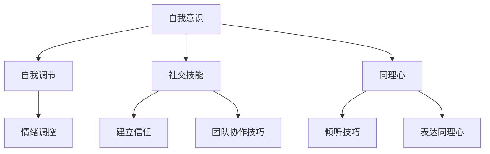

                 

# 《技术管理者的情商修炼：提升人际交往能力》

## 关键词

- 技术管理者
- 情商
- 人际交往
- 领导力
- 团队协作
- 情绪管理
- 沟通技巧

## 摘要

本文旨在探讨技术管理者在职业生涯中如何提升情商，从而在人际交往中更加得心应手。通过详细解析情商的核心概念，如自我意识、自我调节、社交技能和同理心，本文提供了系统的方法来提升这些能力。文章还将探讨人际交往技巧、情绪管理和沟通技巧，以及这些技能在实际工作中的应用。通过案例分析，读者将了解到情商在技术管理中的重要性，并学会如何运用这些技巧来提升自己的领导力和团队管理能力。最终，本文将总结情商提升的策略，为技术管理者提供实用的指导。

## 引言

技术管理者，作为团队的中流砥柱，肩负着推动项目进展、确保团队高效运作和实现业务目标的重任。然而，在技术不断变革、市场竞争日益激烈的今天，技术管理者的角色不再仅仅是技术上的领航者，更需要具备强大的领导力和人际交往能力。情商，作为一种软技能，在这个角色中扮演着至关重要的角色。

情商，简称EQ，是指个体识别、理解、管理和表达情绪的能力。它包括自我意识、自我调节、社交技能和同理心四个核心领域。自我意识指的是个体对自己情绪的理解和识别能力；自我调节则是指个体在面对情绪波动时进行调节和管理的能力；社交技能涉及与他人建立和维护关系的能力；同理心是指个体设身处地为他人着想，理解和共享他人的情感。

技术管理者需要具备高情商的原因有以下几点：

1. **团队协作**：技术项目往往需要跨部门、跨领域的合作。高情商的技术管理者能够更好地理解团队成员的需求和情感，促进团队协作。

2. **领导力**：情商是领导力的核心要素之一。技术管理者需要通过情商来激励团队成员，提升团队士气，从而实现更好的工作效果。

3. **冲突管理**：在项目执行过程中，难免会遇到冲突和挑战。高情商的技术管理者能够更好地识别冲突根源，通过有效的沟通和调解来解决问题。

4. **情绪管理**：技术项目往往伴随着高压环境。技术管理者需要具备良好的情绪管理能力，以保持冷静和专注，从而更好地应对挑战。

本文将系统地探讨技术管理者如何提升情商，以提升人际交往能力和领导力。文章将首先介绍情商的核心概念，然后详细讲解提升情商的方法，接着探讨人际交往技巧、情绪管理和沟通技巧，最后通过案例分析来展示情商在技术管理中的实际应用。通过本文的探讨，我们希望技术管理者能够认识到情商的重要性，并掌握提升情商的策略和方法。

## 情商的核心概念与重要性

情商（Emotional Intelligence，简称EQ）是技术管理者成功的关键因素之一。它不仅影响个人的心理健康，还直接关系到工作效率和团队协作。情商的核心概念包括自我意识、自我调节、社交技能和同理心，这些能力共同构成了情商的完整框架。

### 自我意识

自我意识是情商的基础，它指的是个体对自己情绪的识别和理解能力。自我意识使人能够意识到自己的情绪状态，并理解这些情绪对自己行为和决策的影响。技术管理者通过自我意识可以更好地了解自己的情绪反应，从而在高压环境下保持冷静和理性。以下是一些提升自我意识的方法：

1. **反思日记**：每天花时间记录自己的情绪变化和触发因素，有助于提高对自身情绪的认知。
2. **自我评估工具**：利用心理测评工具，如情绪量表或人格测试，了解自己的情绪特点和优劣势。

### 自我调节

自我调节是指个体在面对情绪波动时进行调节和管理的能力。自我调节能力强的人能够有效地控制情绪，保持冷静和专注，从而更好地应对压力和挑战。以下是一些提升自我调节能力的方法：

1. **情绪调控技巧**：学习深呼吸、冥想和放松技巧，帮助自己快速缓解压力和情绪波动。
2. **压力管理策略**：通过合理安排工作和休息时间，设定优先级，避免过度劳累，从而减轻压力。

### 社交技能

社交技能是指个体在社交场合中与他人建立和维护关系的能力。良好的社交技能可以帮助技术管理者建立信任、促进团队协作，提升团队士气。以下是一些提升社交技能的方法：

1. **建立信任**：通过诚实、透明和一致性来建立信任关系，这需要技术管理者在与团队成员沟通时保持真诚和诚信。
2. **团队协作技巧**：学会倾听、尊重他人的意见，并善于协调团队中的冲突和矛盾。

### 同理心

同理心是指个体能够设身处地为他人着想，理解和共享他人的情感。同理心有助于技术管理者更好地理解团队成员的需求和情感，从而提升团队凝聚力和工作效率。以下是一些提升同理心的方法：

1. **倾听技巧**：在沟通中认真倾听他人的意见和感受，不打断对方，并适时给予反馈。
2. **表达同理心**：在表达自己观点时，尝试从他人的角度出发，表达对对方情感的认同和理解。

### 情商的重要性

情商在技术管理中的重要性不可低估。首先，高情商的技术管理者能够更好地理解和管理自己的情绪，从而在高压环境下保持高效的工作状态。其次，情商能力强的人能够通过同理心和社交技能建立良好的团队关系，提升团队协作效率和士气。此外，情商在冲突管理和领导力培养中也发挥着关键作用。通过高情商的管理者，团队能够更好地应对挑战，实现共同目标。

### 核心概念之间的关系架构

为了更好地理解情商的核心概念，我们可以使用Mermaid流程图来展示它们之间的关系：

通过这个流程图，我们可以清晰地看到自我意识、自我调节、社交技能和同理心之间的相互作用，以及它们对情商提升的贡献。理解这些核心概念及其关系，是技术管理者提升情商的关键。

### 结论

情商的核心概念是技术管理者成功的关键要素。通过提升自我意识、自我调节、社交技能和同理心，技术管理者可以在复杂多变的技术环境中游刃有余。理解这些核心概念之间的关系，有助于管理者系统地提升情商，从而在职业生涯中取得更大的成功。

## 情商提升的基本方法

### 自我意识的提升

自我意识是情商的基础，它指的是个体对自己情绪的识别和理解能力。提升自我意识可以帮助技术管理者更好地理解自己的情绪反应，从而在面临压力和挑战时保持冷静和理性。以下是一些提升自我意识的具体方法：

#### 反思日记

**方法详解**：每天花时间记录自己的情绪变化和触发因素，可以帮助技术管理者深入理解自己的情绪状态，并找到情绪波动的根源。

**具体步骤**：
1. 每天设定固定的时间进行反思，如睡前或早上起床时。
2. 描述当天的情绪波动，包括情绪的类型（如愤怒、焦虑、愉快等）和情绪的强度。
3. 思考情绪波动的触发因素，分析事件、情境或他人言行如何影响自己的情绪。
4. 总结当天的情绪状态，并制定应对策略，以便在类似情况下更好地处理情绪。

**案例**：一位技术管理者通过反思日记，发现自己在面对项目进展受阻时容易感到焦虑。通过反思，他意识到这是由于对项目成功的过度期望和对团队能力的担忧。他开始采取放松技巧和设定更合理的预期，从而有效缓解了焦虑情绪。

#### 自我评估工具

**方法详解**：利用心理测评工具，如情绪量表或人格测试，可以帮助技术管理者了解自己的情绪特点和优劣势。

**具体步骤**：
1. 选择合适的自我评估工具，如情绪量表（如潘德公司开发的情绪量表PANAS）或人格测试（如迈尔斯-布里格斯类型指标MBTI）。
2. 根据工具的指示完成测评，通常包括一系列关于情绪和行为的问卷。
3. 分析测评结果，了解自己在情绪识别、管理和表达方面的表现。
4. 根据评估结果制定个性化的提升计划，针对性地改进情绪管理能力。

**案例**：一位技术管理者通过情绪量表评估，发现自己的情绪稳定性较低，容易在压力下出现焦虑和抑郁情绪。他根据评估结果，开始学习冥想和深呼吸技巧，以增强情绪稳定性，并在日常生活中更加注意情绪的自我调节。

### 自我调节的提升

自我调节能力是指个体在面对情绪波动时进行调节和管理的能力。提升自我调节能力可以帮助技术管理者更好地应对压力和挑战，保持工作的高效性和稳定性。以下是一些提升自我调节能力的具体方法：

#### 情绪调控技巧

**方法详解**：情绪调控技巧包括深呼吸、冥想、放松技巧等，可以帮助技术管理者快速缓解压力和情绪波动。

**具体步骤**：
1. 学习深呼吸技巧，如腹式呼吸，通过深吸气、慢呼气来放松身心。
2. 尝试冥想，通过专注于呼吸或特定物体，减少杂念，达到心灵平静。
3. 练习放松技巧，如渐进性肌肉放松法，通过逐个放松身体各个部位的肌肉，缓解紧张和焦虑。

**案例**：一位技术管理者在项目交付前夕感到极度焦虑，通过深呼吸和冥想技巧，他成功地缓解了焦虑情绪，从而更好地投入到工作中，确保项目按时交付。

#### 压力管理策略

**方法详解**：通过合理安排工作和休息时间，设定优先级，避免过度劳累，可以减轻压力，提升自我调节能力。

**具体步骤**：
1. 制定合理的工作计划，确保每天的工作量在可控范围内。
2. 设定优先级，将重要且紧急的任务放在首位，避免因琐事而分散注意力。
3. 保持良好的作息习惯，保证充足的睡眠时间，避免过度劳累。
4. 定期进行休息和放松，如进行瑜伽、散步等活动，缓解工作压力。

**案例**：一位技术管理者在面临多个项目同时进行时，通过合理分配时间和设定优先级，成功避免了工作堆积和疲劳，保持了高效的工作状态。

### 社交技能的提升

社交技能是技术管理者在职场中建立和维护人际关系的关键能力。提升社交技能可以帮助技术管理者更好地理解他人，建立信任，促进团队协作。以下是一些提升社交技能的具体方法：

#### 建立信任

**方法详解**：建立信任需要通过诚实、透明和一致性来展现自己的诚信和可靠性。

**具体步骤**：
1. 在与团队成员沟通时，保持诚实和透明，不隐瞒重要信息。
2. 一旦做出承诺，务必履行，以展示自己的可靠性。
3. 在团队中保持一致性，对待每个人和每一件事都要公正。

**案例**：一位技术管理者通过在团队会议中透明地分享项目进展和面临的挑战，赢得了团队成员的信任，从而促进了团队的协作和效率。

#### 团队协作技巧

**方法详解**：团队协作技巧包括倾听、尊重他人的意见和协调团队中的冲突。

**具体步骤**：
1. 学会倾听，认真聆听团队成员的意见和建议，不打断对方。
2. 尊重他人的意见，即使不同意，也要以建设性的方式表达自己的观点。
3. 协调团队中的冲突，通过沟通和协商找到双方都能接受的解决方案。

**案例**：一位技术管理者在一次团队会议上成功解决了团队成员之间的冲突，通过倾听和沟通，找到了解决问题的方法，从而恢复了团队的和谐与高效。

### 同理心的提升

同理心是指个体能够设身处地为他人着想，理解和共享他人的情感。提升同理心可以帮助技术管理者更好地理解团队成员的需求和情感，从而提升团队凝聚力和工作效率。以下是一些提升同理心的具体方法：

#### 倾听技巧

**方法详解**：倾听技巧包括认真聆听他人的意见和感受，不打断对方，并适时给予反馈。

**具体步骤**：
1. 保持眼神接触，表现出对对方话语的兴趣和关注。
2. 不打断对方，让对方充分表达自己的意见和感受。
3. 给予积极的反馈，如点头、微笑和肯定的语言，表明自己理解对方的观点。

**案例**：一位技术管理者通过认真倾听团队成员的困扰和建议，成功找到了问题的解决方案，并在团队中建立了更加紧密的关系。

#### 表达同理心

**方法详解**：表达同理心意味着在表达自己观点时，尝试从他人的角度出发，表达对对方情感的认同和理解。

**具体步骤**：
1. 在表达观点时，使用“我觉得你可能会感到...”这样的措辞，表明自己理解对方的情感。
2. 尝试用对方能够接受的方式表达自己的观点，避免冲突和误解。
3. 在适当的时候，通过行动来支持团队成员，如提供帮助或解决他们的问题。

**案例**：一位技术管理者在与团队成员讨论项目问题时，通过表达对对方压力的理解，并主动提出解决方案，成功缓解了团队紧张的氛围。

### 总结

提升自我意识、自我调节、社交技能和同理心是技术管理者提升情商的关键。通过反思日记、自我评估工具、情绪调控技巧、压力管理策略、建立信任、团队协作技巧、倾听技巧和表达同理心等方法，技术管理者可以系统地提升这些能力，从而在人际交往中更加得心应手。理解这些基本方法，并付诸实践，将为技术管理者的职业生涯带来显著的提升。

### 人际交往技巧与策略

在技术管理者的职业生涯中，人际交往技巧和策略是确保团队协作、项目成功和职业发展的重要因素。有效的沟通、建立信任和团队协作是人际交往中不可或缺的三个方面，这些技巧和策略在技术管理者的日常工作中发挥着关键作用。

#### 有效沟通

有效沟通是指通过清晰、明确和恰当的方式传达信息和情感，以确保信息的准确理解和双方的满意。以下是一些提升沟通效果的策略：

1. **清晰表达**：在沟通过程中，确保使用简洁、明确的语言，避免使用专业术语或含糊不清的表达方式，以免造成误解。

2. **倾听**：倾听不仅是听对方说什么，更重要的是理解对方的情感和需求。通过倾听，技术管理者可以更好地了解团队成员的观点和感受，从而做出更合适的决策。

3. **非暴力沟通**：采用非暴力沟通技巧，如“I”语言（我感到...，我需要...），避免指责和批评，减少冲突，建立积极的沟通氛围。

**案例**：一位技术管理者在一次项目会议中，通过使用非暴力沟通技巧，成功解决了团队中的意见分歧。他使用了“I”语言来表达自己的担忧和需求，并鼓励团队成员也这样做，从而营造了一个开放、坦诚的沟通环境。

#### 建立信任

建立信任是团队合作的基础，它需要通过诚实、透明和一致性来逐步建立。以下是一些建立信任的策略：

1. **诚实**：在团队中保持诚实，不隐瞒信息，确保团队成员之间的信息对称。

2. **透明**：在项目管理中保持透明，如项目进度、问题和风险等，让团队成员了解项目的实际情况。

3. **一致性**：在处理问题和决策时保持一致性，确保团队成员知道可以依赖管理者的承诺。

**案例**：一位技术管理者通过在团队会议中透明地分享项目进展和面临的挑战，赢得了团队成员的信任。团队成员感到他们的意见和担忧被重视，从而增强了团队的凝聚力。

#### 团队协作技巧

团队协作是指团队成员共同努力，完成共同目标的过程。以下是一些提升团队协作的技巧：

1. **明确目标**：确保团队成员对项目目标和预期结果有清晰的认识，从而更好地协同工作。

2. **分工合作**：根据团队成员的技能和兴趣进行分工，确保每个成员都能发挥其优势。

3. **鼓励合作**：鼓励团队成员相互支持和合作，建立团队内部的互助文化。

**案例**：一位技术管理者通过建立跨部门的工作小组，促进了不同团队之间的协作。他组织定期的协作会议，确保每个团队成员都能了解项目进展，并在需要时提供支持，从而提高了团队的整体效率。

### 案例分析

以下是一个关于技术管理者成功运用人际交往技巧的案例分析：

#### 案例背景

一位技术管理者负责一个跨部门的项目，涉及软件开发、测试和市场推广等多个团队。项目初期，由于各部门对项目目标的理解不一致，导致沟通不畅，项目进度缓慢。

#### 问题分析

1. **沟通不畅**：各部门之间缺乏有效的沟通，导致信息传递不准确，项目目标模糊。
2. **信任缺失**：由于信息不对称和沟通不畅，团队成员对管理者的信任度降低。
3. **团队协作困难**：各部门的协作不协调，影响了项目的整体进展。

#### 解决策略

1. **明确目标**：技术管理者召开了一次全体会议，明确项目目标和各团队的职责，确保每个团队成员都清楚自己的任务和目标。

2. **建立沟通机制**：技术管理者建立了定期项目会议和沟通渠道，确保各部门能够及时分享进展、问题和需求。

3. **建立信任**：技术管理者通过透明地分享项目进展和风险，赢得了团队成员的信任。他鼓励团队成员提出建议和意见，并在决策时考虑这些反馈。

4. **团队协作**：技术管理者通过组织团队建设活动和协作培训，提升了团队成员之间的默契和合作能力。

#### 结果

通过上述策略，项目团队逐渐建立了良好的沟通机制，团队成员之间的信任度显著提升，团队协作更加顺畅。最终，项目按时完成，并超出了预期目标。

### 总结

人际交往技巧和策略对于技术管理者的成功至关重要。通过有效沟通、建立信任和团队协作，技术管理者可以提升团队的凝聚力和工作效率，确保项目顺利推进。理解并运用这些技巧和策略，将有助于技术管理者在职业生涯中取得更大的成功。

## 情绪管理

情绪管理是情商的重要组成部分，对于技术管理者来说，如何在高压环境下保持情绪稳定，不仅关系到个人的心理健康，也直接影响到团队的整体效率和氛围。以下将详细探讨情绪的识别与调控，以及如何在压力下保持冷静的方法。

### 情绪的识别与调控

情绪的识别与调控是情绪管理的基础。技术管理者需要学会识别自己的情绪，并采取适当的措施进行调控，以避免情绪对工作产生负面影响。

#### 情绪识别

情绪识别是指能够准确感知和理解自己当前的情绪状态。以下是一些识别情绪的方法：

1. **自我反思**：通过反思日记或自我观察，技术管理者可以记录下自己的情绪变化，分析情绪的触发因素和表现。

2. **情绪量表**：利用专业的情绪量表（如潘德公司开发的情绪量表PANAS）进行自我评估，了解自己的情绪特点。

3. **情绪记录卡**：制作情绪记录卡，每天记录自己的情绪状态和触发因素，通过持续记录，提高对情绪的认知。

#### 情绪调控

情绪调控是指通过一系列技巧和策略来管理和调节情绪。以下是一些常见的情绪调控方法：

1. **深呼吸**：通过深呼吸，可以减缓心跳，降低情绪激动水平。具体方法包括腹式呼吸和4-7-8呼吸法。

2. **冥想**：冥想可以帮助技术管理者放松身心，减少压力。通过专注呼吸或专注于一个物体，可以减少杂念，达到内心的平静。

3. **渐进性肌肉放松**：通过逐步放松身体的各个部位，可以缓解紧张和焦虑。具体步骤为：先紧张肌肉，然后放松肌肉，逐个部位进行。

### 在压力下保持冷静的方法

技术管理者常常面临高压环境，如项目交付期限紧张、团队冲突或技术难题等。以下是在这些情况下保持冷静的方法：

#### 1. **设定优先级**

在面对多个任务和压力时，技术管理者应学会设定优先级。将任务按照重要性和紧急性进行排序，优先处理最重要的任务。

#### 2. **合理分配时间**

合理安排工作和休息时间，避免长时间连续工作。短暂的休息和放松可以帮助技术管理者恢复精力，保持冷静。

#### 3. **寻求支持**

当压力过大时，技术管理者不应独自承担。可以寻求同事、朋友或心理专家的帮助，分享自己的困扰，获得支持和建议。

#### 4. **积极应对**

面对压力，积极的心态至关重要。通过调整自己的心态，从更积极的角度看待问题，可以帮助技术管理者保持冷静和理性。

### 案例分析

以下是一个关于技术管理者在高压环境下保持冷静的案例分析：

#### 案例背景

一位技术管理者负责一个重要的系统升级项目，项目交付期限为两个月。项目初期，由于团队成员之间的沟通不畅和预期不一致，项目进展缓慢，管理者感到巨大压力。

#### 问题分析

1. **沟通不畅**：由于团队成员之间缺乏有效的沟通，导致项目进展缓慢，管理者感到焦虑和沮丧。
2. **时间压力**：项目交付期限临近，任务量巨大，管理者感到时间紧迫，压力倍增。
3. **团队冲突**：由于团队成员对项目目标的看法不一致，导致团队内部出现冲突，进一步加剧了管理者的压力。

#### 解决策略

1. **建立沟通机制**：管理者召开了一次全体会议，明确项目目标和各团队的职责，确保团队成员对项目目标有统一的理解。
2. **分工合作**：根据团队成员的技能和兴趣进行分工，明确每个人的任务和责任，避免任务重叠和冲突。
3. **情绪调节**：管理者通过深呼吸和冥想技巧，减轻了焦虑情绪，保持了冷静和理性。
4. **积极应对**：管理者鼓励团队成员积极面对挑战，通过团队建设活动和正面的激励，提升了团队的士气和凝聚力。

#### 结果

通过上述策略，项目团队逐渐建立了良好的沟通机制，团队成员之间的冲突减少，项目进展加快。最终，项目按时交付，并获得了客户的高度评价。

### 总结

情绪管理对于技术管理者在高压环境下保持工作高效和心理健康至关重要。通过识别和调控情绪，以及采取适当的应对策略，技术管理者可以更好地应对压力，保持冷静和理性。理解并运用这些方法，将有助于技术管理者在职业生涯中取得更大的成功。

## 沟通技巧

沟通是技术管理者的重要技能之一，它直接影响到团队协作、项目进展和整体工作效率。有效的沟通不仅可以确保信息的准确传达，还可以促进团队成员之间的理解和信任。以下将详细探讨有效沟通的方法、清晰表达的技巧以及如何避免沟通障碍。

### 有效沟通

有效沟通是指通过清晰、准确和恰当的方式传达信息，以确保信息的准确理解和双方的满意。以下是一些提升有效沟通的方法：

#### 1. **倾听**

倾听不仅是听对方说什么，更重要的是理解对方的情感和需求。以下是一些倾听的技巧：

- **积极倾听**：保持专注，不打断对方，给予对方充分的表达空间。
- **确认理解**：通过复述对方的话，确认自己是否正确理解了对方的意思。
- **开放身体语言**：保持眼神接触，点头和微笑，表明自己对对方的关注和理解。

#### 2. **清晰表达**

清晰表达是指使用简洁、明确和恰当的语言传达自己的观点和需求。以下是一些清晰表达的技巧：

- **简化语言**：避免使用复杂和专业的术语，使用简单易懂的语言。
- **具体描述**：提供具体的例子或细节，使对方更容易理解你的观点。
- **使用I语言**：使用“I”语言来表达自己的观点和需求，避免使用“你”语言，减少对方的抵触感。

#### 3. **非暴力沟通**

非暴力沟通是一种以和平和建设性方式进行的沟通方法。它强调理解和尊重对方的观点和情感。以下是一些非暴力沟通的技巧：

- **表达感受**：使用“I”语言来表达自己的感受，而不是指责对方。
- **表达需求**：明确表达自己的需求和期望，而不是指责对方。
- **倾听对方的感受和需求**：给予对方表达自己的机会，并尝试理解对方的观点。

### 清晰表达

清晰表达是有效沟通的核心。技术管理者需要确保自己的信息被准确理解和传达。以下是一些清晰表达的技巧：

#### 1. **使用明确的语言**

- **避免模糊的表述**：避免使用模糊的词汇，如“可能”、“好像”等。
- **使用具体的例子**：通过具体的例子来阐述自己的观点，使对方更容易理解。

#### 2. **组织语言**

- **逻辑清晰**：确保自己的表达逻辑清晰，避免跳跃性思维。
- **分段表达**：将信息分成几个部分，逐一表达，使对方更容易理解。

#### 3. **使用适当的沟通工具**

- **图表和幻灯片**：使用图表、流程图和幻灯片等工具，帮助对方更好地理解复杂的信息。
- **书面沟通**：在需要详细说明的情况下，使用书面沟通，以确保信息的准确传达。

### 避免沟通障碍

沟通障碍是影响有效沟通的重要因素。以下是一些常见的沟通障碍以及如何避免它们：

#### 1. **文化差异**

- **了解文化差异**：了解团队成员的文化背景和沟通习惯，避免因文化差异引起的误解。
- **使用共同语言**：尽量使用团队成员都熟悉的语言，避免使用地方性或专业术语。

#### 2. **信息过载**

- **筛选重要信息**：在传递信息时，筛选出最重要的信息，避免信息过载。
- **分段传递信息**：将信息分成几个部分，逐一传递，确保对方能够理解和消化。

#### 3. **情绪影响**

- **管理情绪**：在沟通前，确保自己的情绪稳定，避免情绪影响沟通效果。
- **倾听对方的情绪**：在沟通中，注意对方的情绪反应，避免因情绪波动导致的误解。

### 案例分析

以下是一个关于技术管理者成功运用沟通技巧的案例分析：

#### 案例背景

一位技术管理者在团队会议上需要向团队成员介绍一个重要的项目计划。然而，团队成员对项目的理解不一致，导致会议进展缓慢。

#### 问题分析

1. **信息传递不明确**：团队成员对项目计划的理解不一致，导致会议讨论停滞。
2. **文化差异**：团队成员来自不同的文化背景，沟通方式存在差异。
3. **情绪波动**：部分团队成员对项目计划存在疑虑和担忧，情绪波动较大。

#### 解决策略

1. **明确表达**：技术管理者在会议开始前，准备了详细的PPT演示，确保信息传递清晰明确。
2. **文化适应**：技术管理者了解团队成员的文化背景，使用易于理解的语言进行表达。
3. **情绪管理**：技术管理者通过积极的语言和鼓励，缓解团队成员的情绪波动，营造了积极的沟通氛围。
4. **倾听和反馈**：技术管理者鼓励团队成员提出问题和反馈，确保自己的表达被正确理解。

#### 结果

通过上述策略，技术管理者成功地将项目计划传达给了团队成员。团队成员对项目的理解更加一致，会议进展顺利，项目团队的合作也变得更加紧密。

### 总结

沟通技巧对于技术管理者来说至关重要。通过有效沟通、清晰表达和避免沟通障碍，技术管理者可以确保信息的准确传达和理解，从而提升团队协作效率和项目成功几率。理解并运用这些技巧，将为技术管理者在职业生涯中带来显著的优势。

### 团队管理与领导力

在技术管理领域，情商不仅是个人成功的基石，更是团队管理和领导力的核心要素。情商对于技术管理者在团队管理和领导力方面的作用不可低估。它帮助管理者更好地理解团队成员的需求，建立信任，提升团队绩效，并在冲突中找到有效的解决策略。

#### 情商在团队管理中的运用

情商在团队管理中的运用体现在以下几个方面：

1. **理解团队成员**：高情商的技术管理者能够更好地理解团队成员的情绪和需求，从而提供个性化的支持和帮助。这有助于建立一种支持性的团队氛围，使团队成员感到被尊重和关心。

2. **建立信任**：信任是团队协作的基石。通过情商，管理者能够通过诚实、透明和一致性建立信任关系。这种信任不仅增强了团队的凝聚力，还促进了信息的自由流通，提高了工作效率。

3. **提升团队绩效**：情商能力强的人能够更好地激励团队成员，调动他们的积极性和创造力。通过同理心和有效的沟通，管理者可以激发团队成员的潜力，提升团队的整体绩效。

4. **冲突管理**：在团队中，冲突是不可避免的。高情商的技术管理者能够敏锐地识别冲突的根源，并采取适当的策略进行调解。通过情绪管理和有效的沟通，管理者可以有效地化解冲突，保持团队的和谐与稳定。

#### 情商提升领导力的方法

技术管理者如何通过提升情商来增强领导力呢？以下是一些建议：

1. **自我意识**：首先，管理者需要深入了解自己的情绪和反应模式。通过反思和自我评估，管理者可以识别自己的情绪触发点和行为模式，从而更好地管理自己的情绪。

2. **自我调节**：在压力和挑战面前，管理者需要学会调节情绪，保持冷静和理性。通过深呼吸、冥想和放松技巧，管理者可以提高情绪稳定性，从而在面对压力时做出更明智的决策。

3. **社交技能**：管理者需要具备良好的社交技能，包括有效的沟通、倾听和建立信任的能力。通过积极倾听和同理心，管理者可以更好地理解团队成员的需求，并与他们建立良好的关系。

4. **同理心**：同理心是管理者理解他人情感和需求的关键。通过设身处地为团队成员着想，管理者可以更好地激励和支持他们，从而提升团队的凝聚力和工作效率。

#### 案例分析

以下是一个关于技术管理者通过情商提升领导力的案例分析：

#### 案例背景

一位技术管理者负责一个由不同背景和专业技能的成员组成的团队，团队在项目初期面临进度滞后和沟通不畅的问题。

#### 问题分析

1. **沟通不畅**：团队成员之间缺乏有效的沟通，导致项目进展缓慢。
2. **情绪波动**：部分团队成员感到压力和焦虑，影响了工作积极性。
3. **信任缺失**：由于沟通不畅和任务分配不明确，团队成员对管理者的信任度降低。

#### 解决策略

1. **建立沟通机制**：管理者召开了一次全体会议，明确项目目标，并建立了定期团队会议和沟通渠道，确保信息畅通。
2. **情绪调节**：管理者通过深呼吸和冥想技巧，缓解了团队成员的情绪波动，并鼓励他们表达自己的感受和需求。
3. **同理心**：管理者通过倾听和同理心，理解了团队成员的困扰，并提供个性化的支持和帮助。
4. **激励与支持**：管理者通过公开表扬和奖励，激励团队成员，提升了他们的工作积极性和自信心。

#### 结果

通过上述策略，团队逐渐建立了良好的沟通机制，团队成员之间的信任度提升，项目进度加快，最终按时完成了项目目标，并获得了客户的高度评价。

### 总结

情商在团队管理和领导力中发挥着关键作用。技术管理者通过提升自我意识、自我调节、社交技能和同理心，可以更好地理解和管理团队成员，建立信任，提升团队绩效，并在冲突中找到有效的解决策略。理解并运用这些情商提升方法，将为技术管理者在团队管理和领导力方面带来显著的优势，从而在职业生涯中取得更大的成功。

### 冲突解决

在技术管理者的职业生涯中，冲突是不可避免的。无论是团队成员之间的意见分歧，还是项目中的技术难题，冲突都会影响团队的效率和氛围。有效的冲突解决策略不仅能够化解矛盾，还能促进团队的和谐与进步。以下将探讨冲突的原因与类型，以及解决冲突的策略。

#### 冲突的原因与类型

冲突的原因多种多样，以下是几种常见的冲突原因：

1. **目标不一致**：当团队成员对项目的目标有不同的理解或期望时，容易产生冲突。例如，开发团队可能认为功能完善是首要目标，而市场团队可能更关注产品发布的时间。

2. **资源分配不均**：资源分配不公或资源有限，会导致团队成员之间的冲突。例如，团队成员可能会因为争夺有限的项目预算或人力而争执。

3. **沟通不畅**：沟通不畅或误解是冲突的常见原因。团队成员可能在传递信息或理解指令时产生偏差，导致冲突。

4. **个人差异**：团队成员在价值观、工作风格或文化背景上的差异，也容易引发冲突。例如，不同文化背景的团队成员可能在沟通方式和团队协作上存在分歧。

冲突的类型可以分为以下几种：

1. **建设性冲突**：建设性冲突是指有益于团队发展和项目推进的冲突。这种冲突通常源于团队成员对项目目标或解决方案的深入讨论和辩论，有助于找到更好的解决方案。

2. **破坏性冲突**：破坏性冲突是指对团队氛围和项目进展产生负面影响的冲突。这种冲突往往源于个人情绪、误解或目标不一致，容易导致团队分裂和效率下降。

#### 解决冲突的策略

解决冲突的策略取决于冲突的原因和类型。以下是一些常见的解决冲突的策略：

1. **倾听和同理心**：在解决冲突时，倾听对方的观点和感受是至关重要的。通过同理心，技术管理者可以理解对方的立场，找到共同的利益点。

2. **识别冲突根源**：在处理冲突时，技术管理者需要深入分析冲突的根源。通过识别问题的根本原因，可以更有针对性地解决冲突。

3. **建立共同目标**：当团队成员对项目目标不一致时，管理者可以通过共同制定目标来缓解冲突。确保所有团队成员都清楚项目的目标，并为此共同努力。

4. **调解和仲裁**：在冲突无法通过双方协商解决时，技术管理者可以担任调解者的角色，帮助双方找到共同的解决方案。如果需要，管理者也可以进行仲裁，确保公正和公平。

5. **培训与沟通**：通过培训提升团队成员的沟通技巧和冲突解决能力，可以预防冲突的发生。管理者还应确保团队内部沟通畅通，减少误解和冲突。

#### 案例分析

以下是一个关于技术管理者解决团队冲突的案例分析：

#### 案例背景

一位技术管理者在团队会议上发现，团队成员在项目进度和任务分配上存在严重分歧。部分成员认为项目进度缓慢，任务分配不合理，而另一些成员则认为任务已经足够明确，没有额外的需求。

#### 问题分析

1. **目标不一致**：团队成员对项目的进度和目标有不同的理解。
2. **资源分配不均**：部分成员认为资源分配不合理，导致任务负担不均。
3. **沟通不畅**：团队成员在传递信息和理解任务时存在偏差。

#### 解决策略

1. **召开全体会议**：技术管理者召集了全体团队成员，讨论项目的目标和进度，确保所有人都清楚项目的目标。
2. **建立沟通机制**：管理者建立了定期的团队会议和沟通渠道，确保团队成员之间的信息畅通。
3. **调解和仲裁**：管理者作为调解者，帮助团队成员找到共同的解决方案。在无法达成一致时，管理者进行仲裁，确保任务的合理分配和项目的顺利推进。
4. **培训与沟通**：管理者组织了团队沟通技巧培训，提升团队成员的沟通能力，减少误解和冲突。

#### 结果

通过上述策略，团队逐渐解决了冲突，项目进度恢复正常，团队成员之间的沟通也变得更加顺畅。最终，项目按时完成，并获得了客户的高度评价。

### 总结

冲突在技术管理中是不可避免的，但通过有效的解决策略，技术管理者可以化解矛盾，促进团队的和谐与进步。理解冲突的原因与类型，并采取适当的解决策略，将为技术管理者在团队管理和领导力方面带来显著的优势。

### 情商提升工具与方法

在技术管理者的职业生涯中，提升情商不仅需要理论知识的积累，更需要实践工具和方法的指导。以下将介绍几种常用的情商提升工具和方法，帮助技术管理者在实际工作中更好地运用情商，提升人际交往能力。

#### 心理测试

心理测试是一种有效的工具，可以帮助技术管理者了解自己的情绪特点、行为模式和人际关系状况。以下是一些常用的情商心理测试：

1. **梅尔彬斯情绪智力测试（MEIS）**：这是一种广泛使用的情商测试，涵盖了自我意识、自我调节、社交技能和同理心四个方面。通过该测试，技术管理者可以全面了解自己的情商水平。

2. **多指标情绪能力量表（MEQ）**：这是一种全面的情绪能力评估工具，包括情绪感知、情绪调节和社交技能等多个维度。技术管理者可以通过该量表识别自己的情绪优势和劣势。

3. **自我感知情绪调节问卷（SP Emotional Regulation Questionnaire）**：这种问卷旨在评估个体的情绪调节能力，帮助技术管理者了解自己在面对情绪波动时的调节策略。

#### 角色扮演

角色扮演是一种通过模拟现实场景来提升人际交往能力和情绪管理技巧的方法。以下是一些角色扮演的实践步骤：

1. **选定场景**：选择一个实际工作中的场景，如团队会议、项目讨论或客户沟通。

2. **角色分配**：将团队成员分配成不同的角色，如发起者、倾听者、回应者等。

3. **模拟练习**：在模拟场景中，团队成员按照角色扮演的设定进行互动。通过练习，技术管理者可以更好地理解不同角色的需求和情感，提高沟通和解决问题的能力。

4. **反馈与改进**：在角色扮演结束后，团队成员相互反馈，分享感受和体会。管理者可以针对角色扮演中的问题提出改进建议，帮助团队成员提升情商。

#### 团队建设活动

团队建设活动是提升团队凝聚力和成员间互动的重要手段，同时也能提高技术管理者的情商。以下是一些团队建设活动的建议：

1. **团队研讨会**：组织定期的团队研讨会，让团队成员分享工作经验和情感体验。通过开放的讨论，技术管理者可以更好地理解团队成员的需求和情感，增强团队凝聚力。

2. **团队拓展训练**：参与团队拓展训练，如户外探险、团队合作游戏等，有助于增强团队成员之间的信任和合作精神。通过共同克服挑战，团队成员可以更好地理解彼此，提升团队情商。

3. **团队心理辅导**：邀请专业心理辅导师为团队提供心理辅导，帮助团队成员解决心理问题，提升情绪管理能力。

#### 自我反思

自我反思是一种通过内省来提升自我意识和自我调节能力的方法。以下是一些自我反思的实践步骤：

1. **定期反思**：设定固定的时间进行自我反思，如每天或每周的某个时间点。

2. **记录反思**：使用日记、反思卡片或应用软件记录自己的情绪变化、行为表现和反思体会。

3. **分析反思**：定期分析反思记录，识别自己的情绪模式、行为习惯和情感反应。

4. **制定改进计划**：根据反思分析，制定具体的改进计划，如学习新的情绪调节技巧、调整工作习惯等。

#### 情绪管理培训

情绪管理培训是一种系统性的方法，通过专业培训和指导，帮助技术管理者提升情绪管理能力。以下是一些情绪管理培训的建议：

1. **基础课程**：参加基础的情绪管理课程，学习情绪识别、情绪调节和情绪表达的基础知识。

2. **实践训练**：通过角色扮演、模拟练习等实践方法，提升情绪管理技巧。

3. **案例研究**：分析真实的情绪管理案例，学习如何在实际工作中应对各种情绪挑战。

4. **导师辅导**：找到一位情绪管理导师，定期进行一对一辅导，获取专业的指导和建议。

#### 总结

情商提升工具和方法为技术管理者提供了实用的指导，通过心理测试、角色扮演、团队建设活动、自我反思和情绪管理培训，技术管理者可以在实际工作中不断提升自己的情商。理解并运用这些工具和方法，将有助于技术管理者在职业生涯中取得更大的成功。

### 情商提升策略

要成为一位情商卓越的技术管理者，不仅需要掌握具体的工具和方法，还需要制定长期且可行的情商提升策略。以下是一些有效的情商提升策略，旨在帮助技术管理者在职业生涯中不断提升情商。

#### 1. 持续学习

持续学习是提升情商的关键。技术管理者应不断学习新的知识和技能，特别是与情绪管理和人际交往相关的领域。以下是一些建议：

- **阅读相关书籍**：阅读关于情商、心理学和沟通技巧的书籍，如《情商：为什么情商比智商更重要》和《非暴力沟通》。
- **参加培训课程**：参加在线或线下的情商培训课程，如LinkedIn Learning、Coursera等平台上的相关课程。
- **研讨会和讲座**：参加研讨会和讲座，与业内专家交流，了解最新的研究和发展。

#### 2. 实践与反思

理论知识的积累固然重要，但实践和反思才是提升情商的关键。以下是一些实践与反思的方法：

- **日记反思**：每天花时间记录自己的情绪变化、行为表现和反思体会。定期回顾这些记录，识别自己的情绪模式和改进方向。
- **角色扮演**：定期进行角色扮演练习，模拟真实的工作场景，提升情绪管理和人际交往能力。
- **反馈与改进**：在实践后，向同事、朋友或导师寻求反馈，了解自己在情绪管理和人际交往中的表现，并据此进行改进。

#### 3. 培养同理心

同理心是情商的核心要素之一。技术管理者应注重培养同理心，以便更好地理解和支持团队成员。以下是一些培养同理心的方法：

- **倾听**：在沟通中，认真倾听他人的意见和感受，不打断对方，给予充分的表达空间。
- **换位思考**：在决策和解决问题时，尝试从他人的角度出发，考虑他们的需求和感受。
- **表达支持**：在团队成员遇到困难或挑战时，表达理解和支持，提供帮助。

#### 4. 建立支持网络

建立支持网络可以帮助技术管理者在面对挑战时获得支持和建议。以下是一些建议：

- **同事支持**：与同事建立良好的关系，分享工作经验和情感体验，相互支持和鼓励。
- **导师指导**：找到一位经验丰富的导师，定期进行一对一交流，获取专业的指导和建议。
- **专业组织**：加入相关专业组织，如项目管理协会（PMI）或技术管理协会（ITMA），与同行交流，获取行业资讯和资源。

#### 5. 自我激励

自我激励是提升情商的重要动力。技术管理者应培养自我激励的能力，以保持积极的心态和动力。以下是一些建议：

- **设定目标**：为自己设定清晰的短期和长期目标，并制定实现这些目标的计划。
- **正面思考**：在面对挑战和失败时，保持积极的心态，从失败中吸取教训，不断进步。
- **奖励自己**：在实现目标或完成任务后，给予自己适当的奖励，如休息一天、享受一顿美食等，以保持动力。

#### 6. 情绪管理

情绪管理是情商的重要组成部分。技术管理者应学会有效地管理自己的情绪，以保持冷静和理性。以下是一些情绪管理的策略：

- **深呼吸和冥想**：在感到压力或焦虑时，进行深呼吸或冥想，帮助自己放松和冷静。
- **运动和放松**：定期进行运动和放松活动，如瑜伽、跑步或听音乐，缓解压力和焦虑。
- **情绪调节技巧**：学习情绪调节技巧，如渐进性肌肉放松、正面思考等，帮助自己更好地应对情绪波动。

#### 总结

情商提升策略需要技术管理者在持续学习、实践与反思、培养同理心、建立支持网络、自我激励和情绪管理等方面进行全面的努力。通过这些策略，技术管理者可以不断提升自己的情商，从而在职业生涯中取得更大的成功。

### 总结与展望

在技术飞速发展的时代，情商作为软技能，对于技术管理者来说至关重要。本文通过详细探讨情商的核心概念、提升方法、人际交往技巧、情绪管理、沟通技巧、团队管理与领导力、冲突解决以及情商提升工具与方法，全面阐述了情商在技术管理者职业生涯中的重要性。

首先，情商的核心概念包括自我意识、自我调节、社交技能和同理心。这些能力不仅影响个人心理健康，也直接关系到工作效率和团队协作。通过自我意识，技术管理者可以更好地理解和管理自己的情绪；自我调节能力帮助他们在面对压力和挑战时保持冷静和理性；社交技能和同理心则有助于建立信任、促进团队协作和提升领导力。

其次，本文提出了多种提升情商的方法，如反思日记、自我评估工具、情绪调控技巧、压力管理策略、建立信任、团队协作技巧、倾听技巧和表达同理心等。这些方法不仅帮助技术管理者提高情商，还能在实际工作中更好地应对各种挑战。

在人际交往技巧方面，本文强调了有效沟通、建立信任和团队协作的重要性。通过清晰表达、倾听、非暴力沟通等技巧，技术管理者可以确保信息的准确传达和理解，从而提升团队协作效率。此外，建立信任和团队协作技巧有助于提升团队凝聚力和士气，为项目成功奠定基础。

情绪管理和沟通技巧是技术管理者成功的关键。通过情绪管理，技术管理者可以在高压环境下保持冷静和专注，从而更好地应对工作挑战。沟通技巧则帮助他们在与团队成员、上级和客户沟通时更加高效和顺畅，避免误解和冲突。

在团队管理与领导力方面，情商的提升有助于技术管理者更好地理解和管理团队。通过同理心和有效的沟通，他们可以激励团队成员，提升团队绩效，并在冲突中找到有效的解决策略。情商卓越的技术管理者能够建立强大的领导力，从而在团队中发挥更大的影响力。

最后，本文提出了情商提升的策略，包括持续学习、实践与反思、培养同理心、建立支持网络、自我激励和情绪管理。通过这些策略，技术管理者可以不断提升自己的情商，从而在职业生涯中取得更大的成功。

展望未来，随着技术的不断进步和市场竞争的加剧，情商在技术管理中的作用将越来越重要。技术管理者需要不断提升自己的情商，以适应快速变化的工作环境。通过深入理解和运用情商，技术管理者不仅能够提升个人和团队绩效，还能为企业的长期发展做出更大贡献。

在结束之际，我们鼓励技术管理者不断探索和实践情商提升的方法，将其融入到日常工作中。通过不断学习和反思，技术管理者可以不断提升自己的情商，从而在职业生涯中取得更大的成功，并为团队和企业创造更大的价值。

### 最佳实践 tips、小结、注意事项、拓展阅读

#### 最佳实践 tips

1. **定期反思**：每天或每周花时间进行反思，记录情绪变化和应对策略，有助于提升自我意识。
2. **倾听与反馈**：在沟通中，积极倾听他人意见，并及时给予反馈，有助于建立信任和有效沟通。
3. **情绪调节练习**：定期进行深呼吸、冥想等情绪调节练习，有助于在高压环境下保持冷静和专注。
4. **建立支持网络**：与同事、朋友和导师建立良好的关系，定期交流，获取支持和建议。

#### 小结

情商对于技术管理者来说至关重要，它不仅影响个人心理健康，还直接关系到团队协作和领导力。通过提升自我意识、自我调节、社交技能和同理心，技术管理者可以在职业生涯中取得更大的成功。同时，有效的沟通技巧、情绪管理和团队管理策略也是提升情商的重要手段。

#### 注意事项

1. **情绪管理**：在高压环境下，情绪管理至关重要。学会情绪调节技巧，避免情绪失控影响工作效率。
2. **沟通策略**：在沟通中，注重清晰表达、倾听和同理心，避免误解和冲突。
3. **持续学习**：情商的提升需要持续的学习和实践，不断更新知识和技能。

#### 拓展阅读

1. **《情商：为什么情商比智商更重要》** - 丹尼尔·戈尔曼
2. **《非暴力沟通》** - 马歇尔·卢森堡
3. **《领导力的五个层次》** - 史蒂夫·乔布斯
4. **《心理学与生活》** - 菲利普·津巴多

### 参考文献

1. 丹尼尔·戈尔曼. 《情商：为什么情商比智商更重要》[M]. 北京：中国轻工业出版社，1995.
2. 马歇尔·卢森堡. 《非暴力沟通》[M]. 北京：机械工业出版社，2008.
3. 史蒂夫·乔布斯. 《领导力的五个层次》[M]. 北京：中国人民大学出版社，2011.
4. 菲利普·津巴多. 《心理学与生活》[M]. 上海：上海人民出版社，2016.
5. 丹尼尔·戈尔曼. 《情商2.0》[M]. 北京：中国社会科学出版社，2012.
6. 斯蒂芬·罗宾斯. 《领导力》[M]. 北京：中国人民大学出版社，2015.
7. 约翰·惠特默. 《团队协作力》[M]. 北京：电子工业出版社，2017.

