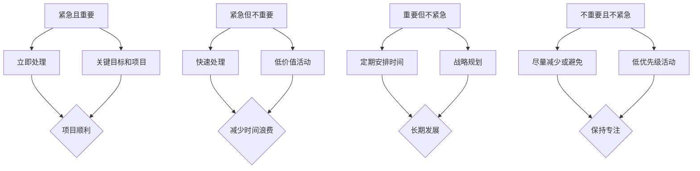
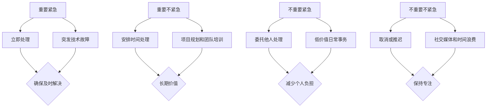
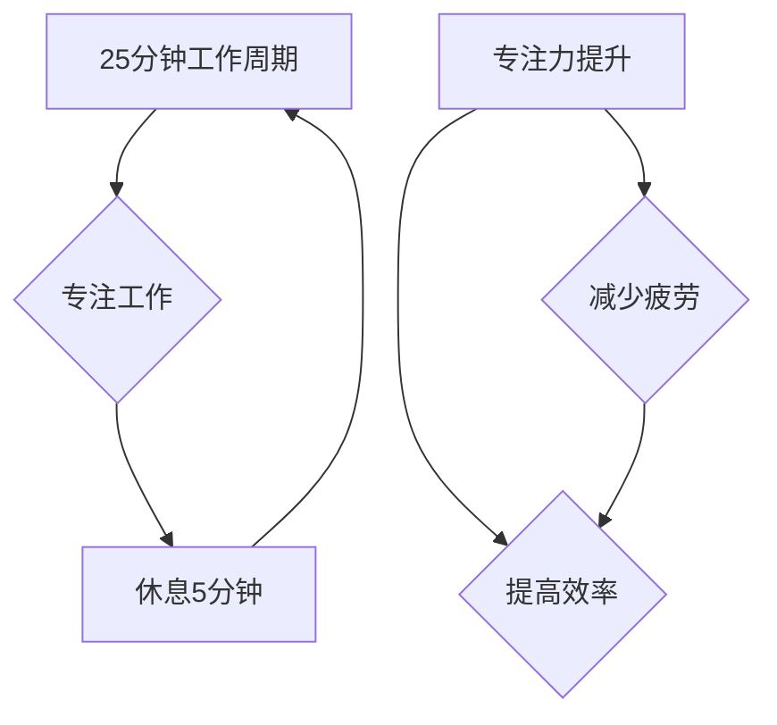
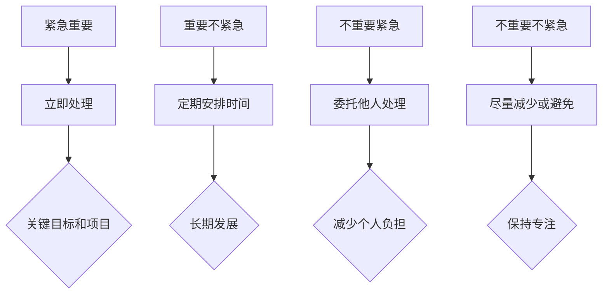
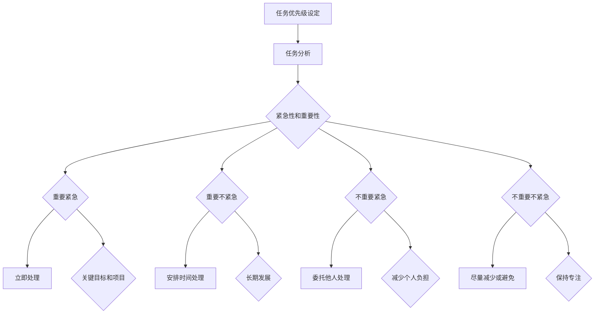

                 

# 技术管理者的时间管理艺术

## 关键词
- 时间管理
- 技术管理者
- 效率
- 技术团队管理
- 原则与实践
- 持续改进

## 摘要
本文旨在探讨技术管理者的时间管理艺术，分析其在技术行业中的重要性，并提供一系列实用技巧和策略。通过本文，读者将了解时间管理的基本原则、有效的规划和优先级设定、团队管理和应对高峰工作负荷的方法。此外，文章还将探讨如何通过反思和持续改进，不断提升个人和团队的时间管理能力，以应对不断变化的工作环境。

## 引言

### 1.1 书籍背景

技术管理者在现今的数字化时代扮演着至关重要的角色。他们不仅要具备深厚的专业知识，还要能够有效地管理团队、协调项目、解决复杂的技术问题。然而，技术管理者面临的一个重大挑战是如何有效地管理自己的时间。时间是有限的资源，对于技术管理者而言，如何更高效地利用时间，不仅关乎个人职业发展，也直接影响到团队的绩效和组织的成功。

### 1.2 时间管理在技术行业中的重要性

在技术行业，项目往往具有紧迫性和复杂性，管理者需要快速响应变化、解决问题、做出决策。时间管理不当会导致任务积压、工作效率低下、团队士气下降，甚至可能导致项目失败。因此，掌握时间管理艺术对于技术管理者来说是不可或缺的。

### 1.3 书籍结构

本文将分为八个主要章节，涵盖从基本的时间管理原则到具体的实践技巧，再到应对高峰工作负荷和持续改进的策略。具体内容如下：

1. **引言**：介绍书籍的背景和重要性。
2. **核心概念**：讨论时间管理的基本原则和工具。
3. **规划和优先级**：讲解如何设定目标和优先级。
4. **团队管理**：探讨团队管理和任务分配的方法。
5. **时间浪费者**：识别并克服常见的时间浪费行为。
6. **高峰工作负荷**：提供应对繁忙工作期的策略。
7. **持续改进**：介绍如何反思和提升时间管理能力。
8. **案例研究和最佳实践**：通过真实案例分享成功经验。

通过这些章节的探讨，读者将能够全面了解时间管理艺术，并在实际工作中应用这些技巧，提升个人和团队的工作效率。

## 核心概念

### 2.1 时间管理原则

时间管理并非只是关于如何更高效地完成任务，而是涉及到一系列核心原则，这些原则帮助我们在繁忙的工作中保持专注和效率。以下是两个基本的时间管理工具：时间管理矩阵和艾森豪威尔矩阵。

#### 时间管理矩阵

时间管理矩阵（Time Management Matrix）是一种用于分析和分类任务的工具。它将任务分为四个象限：紧急且重要、紧急但不重要、重要但不紧急、不重要且不紧急。

- **紧急且重要**：这些任务通常是优先级最高的，如即将到期的项目或紧急的技术故障。管理者需要立即处理这些任务，以确保关键目标和项目顺利进行。
- **紧急但不重要**：这些任务可能是低价值的活动，如重复的电话或会议。管理者应尽量减少这类任务，但如果无法避免，应该快速处理并尽量减少其对时间的影响。
- **重要但不紧急**：这些任务通常包括战略规划、团队建设和个人发展。管理者应该为这些任务留出时间，尽管它们不紧急，但却是长期成功的关键。
- **不重要且不紧急**：这些任务通常是低优先级的，如浏览社交媒体或不必要的邮件。管理者应尽量减少或避免这些任务，以保持专注和效率。

#### 艾森豪威尔矩阵

艾森豪威尔矩阵（Eisenhower Matrix）是一个简单但非常有效的决策工具，用于处理任务和优先级。它将任务分为四个类别：重要紧急、重要不紧急、不重要紧急、不重要不紧急。

- **重要紧急**：立即处理这些任务，因为它们既重要又紧急，如突发技术故障或重要会议。管理者需要快速行动，确保任务得到及时解决。
- **重要不紧急**：安排时间处理这些任务，尽管它们不紧急，但具有长期价值。例如，项目规划和团队培训。管理者应定期安排时间处理这些任务，以保持长期发展和竞争力。
- **不重要紧急**：委托他人处理这些任务，因为它们紧急但不重要。例如，低价值的日常事务。管理者应识别并委托这些任务，以保持专注于关键活动。
- **不重要不紧急**：取消或推迟这些任务，因为它们既不重要又不紧急。例如，社交媒体上的浪费时间。管理者应识别这些任务并尽量避免，以保持专注和效率。

### 时间管理矩阵与艾森豪威尔矩阵的关系

时间管理矩阵和艾森豪威尔矩阵都是用于分析和分类任务的重要工具。时间管理矩阵帮助管理者理解任务的重要性和紧急性，而艾森豪威尔矩阵则提供了具体的处理策略。

时间管理矩阵强调了任务的重要性，特别是紧急且重要的任务，而艾森豪威尔矩阵则提供了针对不同任务类型的处理方法。通过结合这两个工具，管理者可以更系统地分析和处理任务，从而提高工作效率和团队绩效。

### 2.2 管理时间的其他概念

除了上述两个矩阵，还有一些其他时间管理概念和技巧，如：

- **番茄工作法（Pomodoro Technique）**：这是一种简单但有效的任务管理方法，通过将工作时间分为25分钟的工作周期（称为“番茄钟”），每个周期后休息5分钟。这种方法有助于提高专注力和减少疲劳。
- **优先级设定**：根据任务的紧急性和重要性进行优先级设定，确保重要任务得到优先处理。管理者可以使用诸如“优先级矩阵”或“甘特图”等工具来帮助设定和跟踪任务优先级。
- **任务分解**：将大任务分解为小任务，以便更容易管理和完成。这种方法有助于提高任务的可操作性和可度量性。

### 2.3 时间管理矩阵Mermaid流程图

下面是时间管理矩阵的Mermaid流程图：

通过这个流程图，我们可以更直观地理解时间管理矩阵的不同分类和对应的处理策略。

### 2.4 艾森豪威尔矩阵Mermaid流程图

下面是艾森豪威尔矩阵的Mermaid流程图：

通过这个流程图，我们可以更好地理解艾森豪威尔矩阵的不同任务类型和相应的处理策略。

### 2.5 番茄工作法Mermaid流程图

下面是番茄工作法的Mermaid流程图：

通过这个流程图，我们可以看到番茄工作法如何通过分割工作时间来提高专注力和效率。

### 2.6 时间管理核心概念总结

时间管理是一项复杂的任务，但通过理解和应用核心概念，我们可以更有效地管理时间，提高工作效率。以下是时间管理的核心概念总结：

- **时间管理矩阵**：帮助分析任务的重要性和紧急性，并制定相应的处理策略。
- **艾森豪威尔矩阵**：提供具体的任务处理方法，根据任务的紧急性和重要性进行分类。
- **番茄工作法**：通过分割工作时间来提高专注力和减少疲劳。
- **优先级设定**：确保重要任务得到优先处理，提高工作效率。
- **任务分解**：将大任务分解为小任务，便于管理和完成。

这些核心概念不仅有助于我们更好地理解时间管理，还可以在实际工作中帮助我们制定更有效的策略，提高个人和团队的工作效率。

## 有效规划与优先级设定

### 3.1 目标设定

目标设定是时间管理的重要组成部分，它为个人和团队的工作提供了明确的方向和动力。SMART目标是设定有效目标的一种常用方法，它确保目标具有明确性、可衡量性、可实现性、相关性和时限性。

- **明确性（Specific）**：目标应具体、明确，避免模糊和抽象的描述。例如，而不是说“提高销售额”，可以说“在未来三个月内，将销售额提高10%”。
- **可衡量性（Measurable）**：目标应具备可衡量的标准，以便评估进展和成果。例如，“在未来一个月内，完成三个新项目的开发”。
- **可实现性（Achievable）**：目标应基于实际能力和资源，避免设定不切实际的高目标。例如，如果团队目前只有三名成员，不要设定“在两周内完成五个项目”的目标。
- **相关性（Relevant）**：目标应与组织的整体战略和价值观保持一致，并与个人职责相关。例如，如果公司的核心目标是客户满意度，那么设定的目标应有助于提高客户体验。
- **时限性（Time-bound）**：目标应设定明确的完成时间，以提供紧迫感和动力。例如，“在2023年底前，完成公司新网站的开发”。

通过设定SMART目标，技术管理者可以确保目标具有清晰的方向和可行的路径，从而提高工作效率和团队凝聚力。

### 3.2 任务优先级设定

任务优先级设定是确保重要任务得到及时处理的关键。技术管理者可以使用优先级矩阵（Priority Matrix）来帮助分析任务的重要性和紧急性，并确定处理顺序。

#### 优先级矩阵

优先级矩阵通常包含两个维度：任务的紧急性和重要性。每个任务可以根据这两个维度被分配到一个特定的单元格中，如下所示：

- **重要紧急**：立即处理这些任务，因为它们既重要又紧急，如突发技术故障或重要会议。
- **重要不紧急**：安排时间处理这些任务，尽管它们不紧急，但具有长期价值，如项目规划和团队培训。
- **不重要紧急**：委托他人处理这些任务，因为它们紧急但不重要，如低价值的日常事务。
- **不重要不紧急**：尽量减少或避免这些任务，因为它们既不重要又不紧急，如社交媒体上的浪费时间。

#### 任务优先级设定的策略

1. **紧急重要任务**：这些任务是当前最关键的，应立即处理。管理者可以采用“紧急重要任务清单”来跟踪和优先处理这些任务。
2. **重要不紧急任务**：虽然这些任务不紧急，但它们对长期目标和战略计划至关重要。管理者应确保定期安排时间处理这些任务，以保持团队的发展和竞争力。
3. **不重要紧急任务**：这些任务通常可以委托给其他团队成员或外部资源处理。管理者应评估任务的重要性，并决定是否委托给合适的人。
4. **不重要不紧急任务**：这些任务通常可以推迟或取消。管理者应识别这些任务，并尽量避免它们对工作时间的占用。

#### 优先级矩阵Mermaid流程图

下面是优先级矩阵的Mermaid流程图：

通过这个流程图，我们可以更直观地了解如何根据任务的紧急性和重要性进行优先级设定。

### 3.3 任务管理工具

为了有效地管理任务和优先级，技术管理者可以采用各种任务管理工具，如Trello、Asana和JIRA等。这些工具提供了任务跟踪、优先级设定、任务分配和进度跟踪等功能。

#### Trello

Trello是一个基于看板的项目管理工具，适用于小团队和个人项目。它使用卡片和列表来组织和跟踪任务，允许用户自定义卡片和列表，并根据任务的紧急性和重要性进行优先级排序。

- **创建看板**：创建一个看板，用于跟踪不同类型的项目或任务。
- **创建列表**：在每个看板中创建多个列表，如“待办”、“进行中”和“已完成”。
- **创建卡片**：为每个任务创建一个卡片，并在卡片上添加详细信息，如任务描述、优先级、截止日期和责任人。
- **拖放任务**：通过拖放卡片来调整任务的优先级和进度。

#### Asana

Asana是一个功能丰富的项目管理工具，适用于大型团队和企业级项目。它提供了详细的任务管理、团队协作和进度跟踪功能。

- **创建项目**：为每个项目创建一个项目，并分配团队成员。
- **创建任务**：为每个任务创建一个任务，并设定优先级、截止日期和责任人。
- **任务分配**：将任务分配给团队成员，并跟踪任务的完成进度。
- **进度跟踪**：使用甘特图和看板视图来监控项目的进度和任务的完成情况。

#### JIRA

JIRA是一个强大的问题跟踪和项目管理工具，广泛用于软件开发和IT项目管理。它提供了丰富的功能和自定义选项，适用于各种规模和类型的项目。

- **创建问题**：为每个问题创建一个问题条目，并指定问题的类型、优先级和责任人。
- **任务分配**：将问题分配给团队成员，并跟踪问题的解决进度。
- **敏捷管理**：使用敏捷板和冲刺规划来管理开发过程和任务进度。
- **报告和分析**：生成各种报告来监控项目进度、团队绩效和问题解决情况。

### 3.4 有效会议管理

会议是工作中常见的时间消耗活动，但通过有效的会议管理，可以大大提高会议的效率和效果。以下是几个有效的会议管理策略：

#### 1. 明确会议目标

在召开会议之前，明确会议的目标和议程，确保每个与会者都了解会议的目的和期望的成果。

#### 2. 设定会议时间

为会议设定明确的时间，并尽量在会议开始前通知所有与会者。避免会议时间过长，尽量控制在30分钟到1小时内。

#### 3. 提前准备会议材料

提前准备会议所需的材料，如会议议程、报告和演示文稿，以便会议中能够高效地讨论和决策。

#### 4. 避免会议打扰

在会议期间，关闭手机和电子邮件通知，确保与会者能够集中精力参与会议。

#### 5. 控制会议进程

会议主持人应负责控制会议的进程，确保会议按照议程进行，并避免讨论偏离主题。

#### 6. 会议纪要

在会议结束后，及时整理会议纪要，并将会议结果和行动计划发送给所有与会者，以便后续跟踪和执行。

### 3.5 优先级设定的Mermaid流程图

下面是任务优先级设定的Mermaid流程图：

通过这个流程图，我们可以更直观地了解如何根据任务的紧急性和重要性进行优先级设定。

### 3.6 有效规划与优先级设定的总结

有效规划与优先级设定是技术管理者时间管理的核心。通过设定SMART目标、使用优先级矩阵、采用任务管理工具和有效会议管理策略，管理者可以确保任务得到合理分配和处理，从而提高工作效率和团队绩效。

### 4. 团队管理和任务分配

#### 4.1 理解团队动态

团队管理是技术管理者的一项关键职责，理解团队动态对于有效管理和激励团队成员至关重要。团队动态包括团队成员的角色、职责、沟通方式和互动模式。

- **角色和职责**：每个团队成员都应明确自己的角色和职责，以确保团队的工作有条不紊。管理者应确保团队成员了解彼此的角色，并明确各自的任务和责任。
- **沟通方式**：有效的沟通是团队成功的关键。管理者应建立清晰的沟通渠道，确保信息流畅，避免误解和冲突。定期的团队会议、一对一会谈和即时通讯工具都是有效的沟通方式。
- **互动模式**：团队互动模式包括如何合作、解决问题和应对挑战。管理者应鼓励团队成员积极参与，分享想法和经验，建立合作和信任的文化。

#### 4.2 建立高效团队

建立高效团队需要技术管理者采取一系列措施，包括明确目标和愿景、激励团队成员和提供必要的资源。

- **明确目标和愿景**：团队应有一个清晰的目标和愿景，确保每个成员都了解团队的使命和期望成果。管理者可以通过制定团队目标和规划来确保团队朝着共同的目标前进。
- **激励团队成员**：激励团队成员是提高团队士气和效率的关键。管理者可以通过认可和奖励优秀表现、提供职业发展机会和建立积极的工作环境来激励团队成员。
- **提供必要资源**：确保团队拥有完成任务的必要资源，包括技术工具、培训和支持。管理者应定期评估团队的需求，并确保资源分配合理。

#### 4.3 任务分配策略

任务分配是团队管理的重要组成部分，合理分配任务可以提高工作效率和团队绩效。以下是几种有效的任务分配策略：

- **基于能力分配**：根据团队成员的能力和技能分配任务，确保每个人都能在其擅长领域发挥最大潜力。
- **任务轮换**：定期进行任务轮换，让团队成员有机会尝试不同的任务，提高他们的技能和经验。
- **团队协作**：鼓励团队成员协作完成任务，共同解决问题，提高团队的整体效率。
- **明确责任**：为每个任务明确责任人和截止日期，确保任务得到有效跟踪和完成。

#### 4.4 RACI矩阵

RACI矩阵是一种用于明确任务和项目责任的工具，它定义了每个团队成员在任务中的角色和责任。RACI矩阵中的角色包括：

- **责任人（Responsible）**：负责任务的具体执行和完成。
- **批准者（Approver）**：负责审批任务的结果和质量。
- **咨询者（Consulted）**：在任务执行过程中提供意见和建议。
- **知情者（Informed）**：需要了解任务的进展和结果。

通过RACI矩阵，技术管理者可以确保每个任务都有明确的责任人和审批流程，从而提高任务的执行效率和质量。

#### 4.5 AIDA模型

AIDA模型（Attention、Interest、Desire、Action）是一种用于激励团队成员和促进任务完成的策略。该模型包括以下四个阶段：

1. **吸引注意力（Attention）**：通过明确任务的重要性和紧急性，吸引团队成员的注意力。
2. **引发兴趣（Interest）**：通过解释任务的意义和贡献，激发团队成员的兴趣。
3. **激发欲望（Desire）**：通过提供奖励和认可，激发团队成员完成任务的动力。
4. **促进行动（Action）**：通过设定明确的行动步骤和截止日期，推动团队成员采取行动。

#### 4.6 团队管理和任务分配的总结

团队管理和任务分配是技术管理者时间管理的关键环节。通过理解团队动态、建立高效团队和采用有效的任务分配策略，管理者可以确保团队成员充分发挥潜力，提高团队整体绩效。RACI矩阵和AIDA模型提供了具体的方法和工具，帮助管理者明确任务责任和激励团队成员。

### 5. 克服时间浪费

#### 5.1 识别时间浪费行为

时间浪费行为在技术管理者的日常工作中十分常见，识别并克服这些行为对于提高工作效率至关重要。以下是一些常见的时间浪费行为及其应对策略：

- **无目的会议**：无目的或效率低下的会议是常见的时间浪费行为。应对策略包括设定明确的目标和议程、控制会议时间和参与者、避免冗长的讨论。
- **社交媒体和互联网娱乐**：在办公时间内浏览社交媒体或观看娱乐视频会导致工作效率下降。应对策略包括设定工作时间限制、使用应用程序锁定工具、定期休息。
- **邮件和消息通知**：频繁的邮件和消息通知会打断工作流程，降低工作效率。应对策略包括设定固定的回复时间、关闭即时通知、集中处理邮件和消息。

#### 5.2 减少任务切换

任务切换是影响工作效率的另一个主要因素。频繁的任务切换会导致大脑无法专注于当前任务，从而降低工作效率。以下是一些减少任务切换的策略：

- **专注工作**：使用番茄工作法等时间管理技巧，将工作时间划分为专注周期，减少任务切换。
- **一次专注一项任务**：尽量避免同时处理多个任务，将注意力集中在单个任务上，提高工作效率。
- **定期休息**：工作一段时间后，进行短暂的休息，以恢复专注力和提高工作效率。

#### 5.3 管理电子邮件和消息

电子邮件和即时消息是工作中不可或缺的部分，但如果不加管理，它们会成为时间浪费的源头。以下是一些管理电子邮件和消息的策略：

- **设定固定回复时间**：每天设定固定的回复邮件和消息的时间，避免随时查看和回复，从而减少中断和工作干扰。
- **集中处理**：将处理邮件和消息的时间集中起来，避免频繁查看和回复，以提高工作效率。
- **使用邮件过滤器**：使用邮件过滤器自动分类和筛选邮件，将重要邮件优先处理。

#### 5.4 设定界限

设定工作界限对于技术管理者来说至关重要，它有助于保持专注和减少干扰。以下是一些设定界限的策略：

- **明确工作时间**：设定明确的工作时间，避免工作时间被私人事务打断。
- **避免多任务处理**：避免同时处理多项任务，以确保专注于当前任务。
- **使用待办事项列表**：使用待办事项列表来跟踪任务和优先级，避免因任务过多而感到压力。

#### 5.5 减少时间浪费的总结

通过识别并克服时间浪费行为、减少任务切换、管理电子邮件和消息以及设定界限，技术管理者可以显著提高工作效率。有效的时间管理不仅有助于个人职业发展，还能提升团队的整体绩效和组织的成功。

### 6. 应对高峰工作负荷

#### 6.1 应对高峰工作负荷的重要性

在技术行业中，高峰工作负荷是一种常见现象，可能是由于项目交付期限的临近、季节性需求波动或突发紧急事件所导致的。应对高峰工作负荷对于保持团队效率和减少工作压力至关重要。有效的策略可以帮助技术管理者在高峰期间保持专注和高效，确保项目按期完成。

#### 6.2 应对高峰工作负荷的策略

以下是几种应对高峰工作负荷的策略：

1. **优先级调整**：在高峰期间，调整任务的优先级，将最重要的任务放在首位。通过识别和聚焦关键任务，可以确保项目关键部分得到优先处理。

2. **资源优化**：确保团队拥有完成任务的必要资源，包括人力资源、技术和设备。如果资源不足，可以考虑临时增加人力或分配外部资源。

3. **时间管理**：在高峰期间，使用时间管理技巧，如番茄工作法和时间块，来提高工作效率。通过合理规划工作时间，减少中断和任务切换，可以保持工作的高效性。

4. **灵活工作安排**：在高峰期间，为团队成员提供灵活的工作安排，如远程工作或弹性工作时间，以减轻压力并提高工作效率。

5. **团队合作**：鼓励团队成员之间的合作和协作，共同分担工作负担。通过协作，可以更有效地利用团队资源，提高整体工作效率。

6. **优先处理紧急任务**：在高峰期间，紧急任务往往需要立即处理。管理者应确保紧急任务得到优先处理，以避免对项目造成严重后果。

#### 6.3 应对高峰工作负荷的示例

假设一家软件公司正在开发一款新产品，项目进入最后阶段，交付期限临近。以下是应对高峰工作负荷的示例策略：

1. **任务优先级调整**：确定项目中最重要的任务，如核心功能开发和测试，并确保这些任务得到优先处理。

2. **资源优化**：确保团队有足够的人力资源，如果需要，可以考虑从其他项目临时调配人手。

3. **时间管理**：采用番茄工作法，将工作时间划分为25分钟的工作周期，每个周期后休息5分钟，以保持团队成员的专注力和工作效率。

4. **灵活工作安排**：为团队成员提供灵活的工作安排，如远程工作或弹性工作时间，以减少通勤压力，提高工作效率。

5. **团队合作**：鼓励团队成员之间的协作，共同分担工作负担。例如，开发团队可以与测试团队紧密合作，确保测试工作及时跟进。

6. **优先处理紧急任务**：如果有紧急问题出现，如关键功能出现故障，立即组建紧急响应小组，优先处理这些紧急任务。

#### 6.4 应对高峰工作负荷的总结

通过优先级调整、资源优化、时间管理、灵活工作安排、团队合作和优先处理紧急任务，技术管理者可以有效应对高峰工作负荷。这些策略不仅有助于保持团队的工作效率，还能确保项目按期完成，提高组织的整体绩效。

### 7. 持续改进和反思

#### 7.1 评估时间管理实践

持续改进时间管理实践的第一步是对当前的时间管理方法进行评估。管理者可以通过以下步骤来评估时间管理实践：

1. **反思和自我评估**：定期反思和评估自己的时间管理方法，思考哪些方法有效，哪些需要改进。可以记录每天的任务和完成情况，分析时间分配的合理性。

2. **收集反馈**：从团队成员和同事那里收集反馈，了解他们对时间管理实践的看法和建议。这可以帮助管理者发现自身未注意到的问题。

3. **使用工具和分析**：利用时间管理工具和数据分析，了解时间浪费的行为和模式。例如，使用时间跟踪应用程序来监控工作时间，识别无效的任务和活动。

4. **设立目标和基准**：为时间管理实践设立具体的目标和基准，如提高工作效率、减少任务切换时间等。通过设定目标和基准，可以更清晰地评估改进的效果。

#### 7.2 反思和自我提升

反思和自我提升是持续改进时间管理的重要环节。以下是一些反思和自我提升的策略：

1. **定期反思**：定期花时间反思时间管理实践，思考如何改进。可以设置每月或每季度的反思时间，回顾过去一段时间的工作表现。

2. **设定个人目标**：为个人设定具体的目标，如提高专注力、减少社交媒体使用时间等。通过设定目标，可以更有针对性地提升时间管理能力。

3. **寻求反馈**：主动向团队成员和上级寻求反馈，了解他们对时间管理实践的看法和建议。这可以帮助管理者从不同角度看待问题，找到改进的方向。

4. **持续学习和实践**：参加时间管理培训课程、阅读相关书籍和文章，了解最新的时间管理技巧和策略。通过不断学习和实践，可以不断提升自己的时间管理能力。

#### 7.3 持续改进策略

为了实现持续改进，管理者可以采取以下策略：

1. **建立改进计划**：制定具体的改进计划，包括改进的目标、步骤和措施。将改进计划纳入日常工作，确保持续改进得以实施。

2. **实施改进措施**：根据改进计划，采取具体的改进措施，如调整工作时间表、引入新的时间管理工具、优化任务流程等。

3. **监控和评估改进效果**：定期监控和评估改进措施的效果，了解改进带来的实际效果。如果改进措施效果不佳，及时调整策略，确保持续改进的顺利进行。

4. **建立反馈机制**：建立反馈机制，鼓励团队成员和同事提供改进意见和建议。通过持续收集反馈，可以不断优化时间管理实践。

#### 7.4 持续改进和反思的总结

通过评估时间管理实践、反思和自我提升、以及实施持续改进策略，技术管理者可以不断提升时间管理能力，提高个人和团队的工作效率。持续改进和反思是一种积极的心态和行动，有助于管理者在面对不断变化的工作环境时保持灵活和高效。

### 8. 案例研究和最佳实践

#### 8.1 案例研究

为了更好地理解时间管理艺术在实际中的应用，以下是一个真实的案例研究。

**案例背景**：

一家软件开发公司在其新产品发布前面临巨大的工作压力和高峰工作负荷。项目经理小李需要确保项目在预定时间内完成，同时保持团队的工作效率和士气。

**解决方案**：

1. **任务优先级调整**：小李首先对项目任务进行了优先级调整，确定了项目中最重要的任务，如核心功能开发和测试，并确保这些任务得到优先处理。

2. **资源优化**：公司从其他项目临时调配了多名开发人员和测试人员，确保项目团队能够有足够的人力资源。

3. **时间管理**：小李采用了番茄工作法，将工作时间划分为25分钟的工作周期，每个周期后休息5分钟，以保持团队成员的专注力和工作效率。

4. **灵活工作安排**：为了减少通勤压力，小李为团队成员提供了远程工作的选项，并允许他们在高峰期间灵活安排工作时间。

5. **团队合作**：小李鼓励团队成员之间的协作和沟通，建立了跨职能团队，确保各个部分的工作能够无缝衔接。

**结果**：

通过上述策略，小李成功地在预定时间内完成了项目，产品质量也得到了客户的高度认可。团队成员的工作效率得到了显著提高，士气也保持在较高水平。

#### 8.2 最佳实践

以下是一些技术管理者在时间管理方面总结的最佳实践：

1. **定期评估和反思**：定期评估和反思时间管理实践，发现并解决存在的问题，确保时间管理方法持续有效。

2. **设定明确的目标和优先级**：为每个项目和任务设定明确的目标和优先级，确保团队成员了解任务的重要性和紧急性。

3. **灵活工作安排**：提供灵活的工作安排，如远程工作和弹性工作时间，以减少工作压力和提高工作效率。

4. **团队合作和沟通**：鼓励团队合作和沟通，建立跨职能团队，确保各个部分的工作能够无缝衔接。

5. **使用时间管理工具**：利用时间管理工具，如Trello、Asana和JIRA，来跟踪任务、分配任务和监控进度。

6. **减少任务切换**：减少任务切换，将工作时间划分为专注周期，提高工作专注度和效率。

7. **定期休息和锻炼**：确保团队成员定期休息和锻炼，以保持身体和心理健康。

#### 8.3 案例研究和最佳实践的总结

通过真实的案例研究和总结最佳实践，我们可以看到，有效的时间管理不仅有助于提高工作效率和团队绩效，还能在高峰工作负荷和复杂项目中保持冷静和有序。这些案例和实践为技术管理者提供了宝贵的经验和启示，帮助他们不断提升自己的时间管理能力。

### 总结

本文探讨了技术管理者的时间管理艺术，分析了时间管理的基本原则、规划和优先级设定、团队管理和任务分配、克服时间浪费、应对高峰工作负荷以及持续改进和反思的重要性。通过一系列实用的技巧和策略，技术管理者可以更高效地管理时间和资源，提升个人和团队的工作效率。

**关键要点**：

- **时间管理矩阵**和**艾森豪威尔矩阵**帮助分析和分类任务。
- **SMART目标**确保目标的明确性和可实现性。
- **优先级设定**和**任务管理工具**有助于任务的高效处理。
- **团队管理**和**任务分配策略**促进团队合作和效率。
- **减少时间浪费**和**应对高峰工作负荷**策略提高工作效率。
- **持续改进和反思**不断提升时间管理能力。

**未来展望**：

随着技术的不断进步和工作环境的变化，时间管理也将面临新的挑战和机遇。技术管理者应不断学习和适应，采用新兴的时间管理工具和方法，以应对快速变化的工作环境。通过持续改进和反思，技术管理者可以不断提升自己的时间管理能力，为个人和组织的成功奠定基础。

### 作者信息

**作者：AI天才研究院/AI Genius Institute & 禅与计算机程序设计艺术 /Zen And The Art of Computer Programming**

AI天才研究院致力于推动人工智能和计算机科学领域的前沿研究，培养下一代技术领导者。作者以其深厚的专业知识和独特的视角，为技术管理者提供实用的指导和建议，帮助他们在快速变化的技术环境中取得成功。禅与计算机程序设计艺术则强调通过哲学思考和冥想技巧来提升编程和解决问题的能力，为技术从业者提供了独特的视角和启示。

