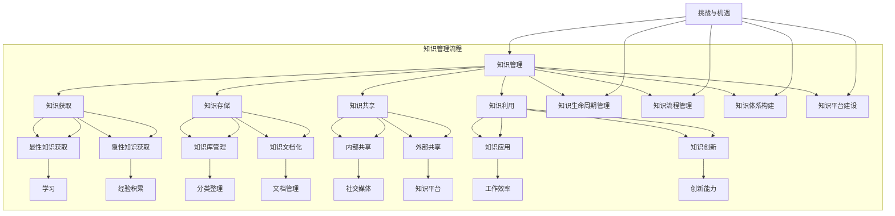

                 

### 文章标题

“技术管理者的知识管理：个人与团队学习策略”

### 文章关键词

技术管理者，知识管理，个人学习策略，团队学习策略，知识共享，知识创新，知识管理工具

### 文章摘要

本文将深入探讨技术管理者的知识管理，从个人和团队两个层面分析其重要性、挑战以及有效的学习策略。首先，文章介绍了知识管理的核心概念及其与技术管理的关联，并提出了知识管理的价值。接着，文章详细解析了知识管理的基本概念、原理和架构，通过Mermaid流程图展示了知识管理流程。此外，文章还讨论了知识管理的挑战与机遇，包括知识获取、存储、共享的难题，以及知识异构性问题、知识安全与隐私保护。随后，文章分别从个人知识管理策略和团队知识管理策略两方面，介绍了具体的知识管理方法，包括知识获取、存储、共享和利用。最后，文章探讨了知识管理工具与技术，如知识库管理系统、知识共享平台、知识搜索引擎，以及数据挖掘、自然语言处理和知识图谱等。通过实践案例，文章提供了个人知识管理和团队知识管理的成功经验和失败教训。文章总结知识管理的未来发展趋势，如人工智能与知识管理、知识服务与知识变现，以及知识管理与可持续发展。

### 引言

在当今快速发展的信息技术时代，知识已经成为企业和个人竞争的关键因素。技术管理者作为组织中的核心角色，不仅需要具备深厚的技术功底，还必须具备高效的知识管理能力。知识管理（Knowledge Management，简称KM）指的是通过系统地识别、收集、组织、存储、共享和应用知识，以提高组织效率和创新能力的实践。对于技术管理者而言，知识管理不仅关乎个人的成长与发展，更关乎团队和整个组织的竞争力。

#### 1.1 知识管理的概念

知识管理是一个多维度、多层次的概念，它涉及到知识获取、知识存储、知识共享和知识利用等多个方面。具体来说，知识管理包括以下核心要素：

- **知识获取**：通过学习、研究、观察、交流等方式获取新的知识和信息。
- **知识存储**：将获取到的知识进行分类、整理、存储，以便日后查阅和使用。
- **知识共享**：通过建立有效的知识共享机制，促进组织内外的知识流动和交流。
- **知识利用**：将知识应用于实际工作中，提高工作效率和创新能力。

#### 1.2 技术管理者的知识管理挑战

技术管理者面临的知识管理挑战主要集中在以下几个方面：

- **知识获取**：在信息技术领域，知识更新速度非常快，技术管理者需要不断学习新的技术知识和技能，以保持竞争力。
- **知识存储**：如何有效地组织和管理大量的技术文档、代码库和其他形式的知识，确保知识的可访问性和可维护性。
- **知识共享**：如何打破信息孤岛，促进团队成员之间的知识交流和协作，提高整体工作效率。
- **知识利用**：如何将知识转化为实际的业务价值，推动组织的技术创新和业务发展。

#### 1.3 知识管理的价值

知识管理对技术管理者有着重要的价值，主要体现在以下几个方面：

- **提高个人竞争力**：通过知识管理，技术管理者可以系统性地积累和整理自己的知识和经验，提高个人技能和专业水平。
- **增强团队协作**：有效的知识共享和协作机制有助于团队更好地协同工作，提高整体工作效率和创新能力。
- **推动技术创新**：知识管理为技术管理者提供了丰富的知识资源和创新灵感，有助于推动组织的技术创新和业务发展。
- **提升组织竞争力**：通过知识管理，组织可以更好地利用内部知识资源，提高整体运营效率和市场竞争力。

总结来说，知识管理对技术管理者来说至关重要。通过有效的知识管理，技术管理者不仅能够提升个人和团队的竞争力，还能推动组织实现持续的技术创新和业务发展。接下来，我们将进一步探讨知识管理的基本概念和原理，帮助技术管理者更好地理解和应用知识管理。

### 核心概念与联系

知识管理是一个复杂且多维度的领域，涉及到多个核心概念和原理。为了更好地理解和应用知识管理，我们需要详细探讨这些概念，并分析它们之间的联系。

#### 2.1 知识管理的基本概念

知识管理的基本概念包括知识分类、知识特性、知识管理和技术管理等多个方面。

1. **知识分类**：

知识可以按照不同的维度进行分类。常见的分类方法包括：

- **按形式分类**：可分为显性知识和隐性知识。显性知识是指可以通过语言、文字、图像等明确形式表达的知识，如文档、代码和报告等；隐性知识则是嵌入在个人经验和技能中的知识，如直觉、判断力和实践经验等。

- **按来源分类**：可分为内部知识和外部知识。内部知识是指组织内部产生的知识，如员工的经验和技能；外部知识则是指组织外部获取的知识，如行业趋势、竞争对手的信息等。

- **按功能分类**：可分为技术知识、业务知识和管理知识。技术知识主要涉及技术原理、技术架构和编程技巧等；业务知识则包括市场分析、客户需求和业务流程等；管理知识则涉及团队管理、项目管理等。

2. **知识特性**：

知识具有以下特性：

- **多样性**：知识种类繁多，形式多样，既有显性知识，也有隐性知识。
- **动态性**：知识是不断更新和演化的，随着技术的发展和市场的变化，知识也需要不断更新和优化。
- **关联性**：知识之间存在广泛的关联性，不同领域的知识相互交叉和融合，形成新的知识体系。

3. **知识管理**：

知识管理是指通过系统的方法和工具，对知识进行获取、存储、共享和利用的过程。知识管理的主要任务包括：

- **知识获取**：通过学习、研究、交流和合作等方式获取新的知识和信息。
- **知识存储**：将获取到的知识进行分类、整理和存储，以便日后查阅和使用。
- **知识共享**：建立有效的知识共享机制，促进组织内外的知识流动和交流。
- **知识利用**：将知识应用于实际工作中，提高工作效率和创新能力。

4. **技术管理**：

技术管理是指通过系统的方法和工具，对组织的技术资源进行规划、管理、开发和利用的过程。技术管理的主要任务包括：

- **技术规划**：根据组织的战略目标和业务需求，制定技术发展规划和策略。
- **技术开发**：通过技术创新和研发，提高组织的竞争力。
- **技术管理**：建立有效的技术管理体系，确保技术资源的有效利用和管理。

#### 2.2 知识管理原理与架构

知识管理原理主要包括知识生命周期管理、知识流程管理、知识体系构建和知识平台建设等方面。

1. **知识生命周期管理**：

知识生命周期管理是指对知识从生成、传播、应用到消亡的全过程进行管理。知识生命周期通常包括以下阶段：

- **生成**：知识生成是知识管理的起点，主要包括知识获取和知识创新。
- **传播**：知识传播是知识在组织内部和外部进行传递和分享的过程，包括知识共享、知识扩散和知识转移。
- **应用**：知识应用是将知识应用于实际工作中，提高工作效率和创新能力的过程。
- **消亡**：知识消亡是指知识失去实际应用价值，被新的知识所替代的过程。

2. **知识流程管理**：

知识流程管理是指对知识管理的各个环节进行系统化和标准化的管理。知识流程管理主要包括以下步骤：

- **需求分析**：根据组织的业务需求和知识需求，确定知识管理的目标和范围。
- **知识识别**：识别组织内部和外部的重要知识，包括显性知识和隐性知识。
- **知识获取**：通过学习、研究、交流和合作等方式获取新的知识和信息。
- **知识存储**：将获取到的知识进行分类、整理和存储，以便日后查阅和使用。
- **知识共享**：建立有效的知识共享机制，促进组织内外的知识流动和交流。
- **知识应用**：将知识应用于实际工作中，提高工作效率和创新能力。
- **知识评估**：对知识管理的效果进行评估和反馈，不断优化知识管理流程。

3. **知识体系构建**：

知识体系构建是指建立一套系统化、结构化的知识体系，以支持组织的知识管理和应用。知识体系构建主要包括以下内容：

- **知识分类体系**：根据组织的业务需求和知识特性，建立一套科学合理的知识分类体系。
- **知识标准体系**：制定一套统一的知识标准和规范，确保知识的质量和一致性。
- **知识库**：建立知识库，将组织内部的显性知识和隐性知识进行系统化和结构化的存储和管理。
- **知识图谱**：通过知识图谱技术，构建组织内部的知识网络，实现知识的关联和可视化。

4. **知识平台建设**：

知识平台建设是指建立一套集成化的知识管理平台，为组织提供全面的知识管理服务。知识平台建设主要包括以下内容：

- **知识库管理系统**：提供知识的存储、分类、检索和管理功能，确保知识的可访问性和可维护性。
- **知识共享平台**：提供知识的共享、交流和协作功能，促进组织内外的知识流动和交流。
- **知识搜索引擎**：提供强大的知识搜索功能，帮助用户快速定位所需的知识。
- **知识应用平台**：提供知识应用的环境和工具，支持知识的实际应用和创新。

#### 2.3 知识管理的挑战与机遇

知识管理在发展过程中面临着一系列的挑战和机遇。

1. **挑战**：

- **知识获取**：在信息技术爆炸的时代，知识更新速度非常快，技术管理者需要不断学习新的技术和知识，以保持竞争力。
- **知识存储**：如何有效地组织和管理大量的技术文档、代码库和其他形式的知识，确保知识的可访问性和可维护性。
- **知识共享**：如何打破信息孤岛，促进团队成员之间的知识交流和协作，提高整体工作效率。
- **知识安全与隐私保护**：如何确保知识的安全和隐私，防止知识泄露和滥用。

2. **机遇**：

- **技术革新**：随着人工智能、大数据、云计算等新技术的快速发展，知识管理工具和方法的不断进步，为知识管理提供了新的机遇。
- **数据驱动**：通过数据分析和挖掘，可以更精准地识别和组织知识，提高知识管理的效率和效果。
- **知识服务**：知识管理不仅仅是内部知识的管理，还可以通过知识服务，为外部客户提供价值，实现知识的变现和增值。

通过深入理解和分析知识管理的基本概念和原理，技术管理者可以更好地应对知识管理的挑战，把握机遇，提升个人和团队的知识管理能力，从而推动组织的持续发展和创新。

#### 核心概念与联系Mermaid流程图



该Mermaid流程图清晰地展示了知识管理的核心概念和联系，从知识获取、存储、共享到利用，再到知识生命周期管理、知识流程管理、知识体系构建和知识平台建设，全面解析了知识管理的各个组成部分及其相互关系。

#### 知识管理中的核心算法原理讲解

在知识管理过程中，核心算法原理起到了至关重要的作用，这些算法不仅帮助我们更好地获取、存储和共享知识，还帮助我们有效地利用和创新能力。以下将详细阐述几种常见的知识管理算法原理，包括数据挖掘、自然语言处理和知识图谱。

##### 1. 数据挖掘算法原理

数据挖掘是一种从大量数据中提取有价值信息的过程。其基本原理包括以下步骤：

1. **数据预处理**：对原始数据进行清洗、转换和归一化处理，以确保数据的质量和一致性。
   ```mermaid
   graph TD
       A[数据预处理] --> B[数据清洗]
       A --> C[数据转换]
       A --> D[数据归一化]
   ```

2. **特征选择**：从数据集中选择最有代表性的特征，以减少数据维度并提高模型的性能。
   ```mermaid
   graph TD
       E[特征选择] --> F[相关性分析]
       E --> G[主成分分析]
   ```

3. **模式识别**：使用分类、聚类、回归等算法，从数据中挖掘出潜在的模式和规律。
   ```mermaid
   graph TD
       H[模式识别] --> I[分类算法]
       H --> J[聚类算法]
       H --> K[回归算法]
   ```

4. **模型评估**：对挖掘出的模型进行评估，选择性能最佳的模型。
   ```mermaid
   graph TD
       L[模型评估] --> M[准确率评估]
       L --> N[召回率评估]
       L --> O[ROC曲线评估]
   ```

数据挖掘算法的伪代码如下：

```python
# 数据预处理
def preprocess_data(data):
    # 清洗数据
    cleaned_data = clean_data(data)
    # 转换数据
    transformed_data = transform_data(cleaned_data)
    # 归一化数据
    normalized_data = normalize_data(transformed_data)
    return normalized_data

# 特征选择
def select_features(data):
    # 进行相关性分析
    correlations = correlation_analysis(data)
    # 选择最有代表性的特征
    selected_features = select_relevant_features(correlations)
    return selected_features

# 模式识别
def discover_patterns(data, features):
    # 使用分类算法
    classifier = classify_algorithm(data, features)
    # 使用聚类算法
    clusters = cluster_algorithm(data, features)
    # 使用回归算法
    regressor = regression_algorithm(data, features)
    return classifier, clusters, regressor

# 模型评估
def evaluate_model(model, data):
    # 计算准确率
    accuracy = accuracy_score(model, data)
    # 计算召回率
    recall = recall_score(model, data)
    # 绘制ROC曲线
    roc_curve = roc_curve(model, data)
    return accuracy, recall, roc_curve
```

##### 2. 自然语言处理算法原理

自然语言处理（Natural Language Processing，NLP）是知识管理中的重要组成部分，其核心算法原理包括文本分类、情感分析和信息提取等。

1. **文本分类**：通过训练模型，将文本数据分类到预定义的类别中。
   ```mermaid
   graph TD
       P[文本分类] --> Q[词袋模型]
       P --> R[朴素贝叶斯分类器]
       P --> S[支持向量机分类器]
   ```

2. **情感分析**：分析文本中的情感倾向，通常分为正面、负面和中性。
   ```mermaid
   graph TD
       T[情感分析] --> U[文本预处理]
       T --> V[情感词典]
       T --> W[机器学习模型]
   ```

3. **信息提取**：从非结构化的文本中提取出结构化的信息，如实体识别和关系提取。
   ```mermaid
   graph TD
       Y[信息提取] --> Z[命名实体识别]
       Y --> AA[关系提取]
   ```

自然语言处理算法的伪代码如下：

```python
# 文本分类
def text_classification(text, model):
    # 使用词袋模型
    bag_of_words = bag_of_words_model(text)
    # 使用朴素贝叶斯分类器
    classifier = naive_bayes_classifier(bag_of_words, model)
    return classifier.predict(bag_of_words)

# 情感分析
def sentiment_analysis(text, model):
    # 进行文本预处理
    preprocessed_text = preprocess_text(text)
    # 使用情感词典
    sentiment = sentiment_dictionary(preprocessed_text)
    # 使用机器学习模型
    model.predict(preprocessed_text)
    return sentiment

# 信息提取
def information_extraction(text, model):
    # 使用命名实体识别
    entities = named_entity_recognition(text, model)
    # 使用关系提取
    relationships = relation_extraction(text, model)
    return entities, relationships
```

##### 3. 知识图谱算法原理

知识图谱是一种结构化的知识表示方法，通过节点和边来表示实体及其关系。其核心算法原理包括实体识别、关系提取和图谱嵌入等。

1. **实体识别**：从文本中识别出重要的实体，如人名、地点、组织等。
   ```mermaid
   graph TD
       BB[实体识别] --> CC[词向量模型]
       BB --> DD[命名实体识别]
   ```

2. **关系提取**：从文本中提取出实体之间的关系，如“工作于”、“位于”等。
   ```mermaid
   graph TD
       EE[关系提取] --> FF[依存句法分析]
       EE --> GG[实体链接]
   ```

3. **图谱嵌入**：将知识图谱中的实体和关系映射到低维空间，以便进行计算和推理。
   ```mermaid
   graph TD
       HH[图谱嵌入] --> II[图神经网络]
       HH --> JJ[矩阵分解]
   ```

知识图谱算法的伪代码如下：

```python
# 实体识别
def entity_recognition(text, model):
    # 使用词向量模型
    embeddings = word_embedding_model(text)
    # 使用命名实体识别
    entities = named_entity_recognition(text, embeddings)
    return entities

# 关系提取
def relation_extraction(text, model):
    # 使用依存句法分析
    dependencies = dependency_parsing(text, model)
    # 使用实体链接
    relations = link_entities(dependencies)
    return relations

# 图谱嵌入
def knowledge_graph_embedding(graph, model):
    # 使用图神经网络
    embeddings = graph_neural_network(graph, model)
    # 使用矩阵分解
    embeddings = matrix_factorization(graph, model)
    return embeddings
```

通过这些核心算法原理的讲解，我们可以看到数据挖掘、自然语言处理和知识图谱在知识管理中的应用。这些算法不仅帮助我们更有效地获取、存储和共享知识，还为我们提供了强大的工具来创新和应用知识，从而提升组织的整体竞争力。

#### 数学模型和数学公式讲解

在知识管理过程中，数学模型和数学公式起到了关键作用，它们帮助我们量化知识、优化流程和评估效果。以下将详细讲解几种常见的数学模型和数学公式，并辅以具体的解释和示例。

##### 1. 评估指标

评估指标是衡量知识管理效果的重要工具。以下是一些常用的评估指标：

1. **准确率（Accuracy）**：
   $$\text{Accuracy} = \frac{\text{正确预测的数量}}{\text{总预测的数量}}$$
   准确率表示模型预测正确的比例。

   **示例**：
   假设一个分类模型预测了100个样本，其中90个预测正确，10个预测错误，则准确率为：
   $$\text{Accuracy} = \frac{90}{100} = 0.9$$

2. **召回率（Recall）**：
   $$\text{Recall} = \frac{\text{正确预测的正例数量}}{\text{实际正例数量}}$$
   召回率表示模型成功召回所有正例的比例。

   **示例**：
   假设一个分类模型中有20个正例，模型正确预测了15个，则召回率为：
   $$\text{Recall} = \frac{15}{20} = 0.75$$

3. **精确率（Precision）**：
   $$\text{Precision} = \frac{\text{正确预测的正例数量}}{\text{预测为正例的数量}}$$
   精确率表示模型预测为正例中实际为正例的比例。

   **示例**：
   假设一个分类模型预测了30个样本，其中20个为正例，正确预测了18个，则精确率为：
   $$\text{Precision} = \frac{18}{20} = 0.9$$

4. **F1分数（F1 Score）**：
   $$\text{F1 Score} = 2 \times \frac{\text{Precision} \times \text{Recall}}{\text{Precision} + \text{Recall}}$$
   F1分数是精确率和召回率的调和平均数，用于综合评估模型的性能。

   **示例**：
   假设一个分类模型的精确率和召回率分别为0.9和0.75，则F1分数为：
   $$\text{F1 Score} = 2 \times \frac{0.9 \times 0.75}{0.9 + 0.75} = 0.9$$

##### 2. 数据挖掘中的数学模型

数据挖掘中的数学模型广泛应用于特征选择、聚类和分类等任务。以下介绍几种常用的模型：

1. **线性回归模型**：
   $$y = \beta_0 + \beta_1x_1 + \beta_2x_2 + ... + \beta_nx_n$$
   线性回归模型用于预测连续值输出，其中$y$是输出值，$x_1, x_2, ..., x_n$是输入特征，$\beta_0, \beta_1, \beta_2, ..., \beta_n$是模型参数。

   **示例**：
   假设我们有一个简单的线性回归模型，用于预测房屋价格，公式为：
   $$\text{Price} = 10 + 5 \times \text{Area} + 2 \times \text{Bedrooms}$$
   如果一个房屋的面积为100平方米，卧室数为3个，则预测价格为：
   $$\text{Price} = 10 + 5 \times 100 + 2 \times 3 = 10 + 500 + 6 = 516$$

2. **K-均值聚类算法**：
   K-均值聚类算法是一种无监督学习方法，用于将数据分为K个簇。
   $$\text{Centroid}_{i} = \frac{1}{N}\sum_{n=1}^{N}x_n$$
   其中，$x_n$是数据点，$N$是数据点的总数，$\text{Centroid}_{i}$是第$i$个簇的中心点。

   **示例**：
   假设我们有10个数据点，需要将它们分为2个簇。首先随机选择2个中心点，然后迭代更新中心点，直到收敛：
   $$\text{Centroid}_{1} = \frac{1}{10}(x_1 + x_2 + ... + x_{10})$$
   $$\text{Centroid}_{2} = \frac{1}{10}(x_1 + x_2 + ... + x_{10})$$
   通过不断迭代更新，最终得到2个簇的中心点。

3. **决策树模型**：
   决策树模型通过一系列的决策规则对数据进行分类。
   $$\text{if} \, x > \text{阈值} \, \text{then} \, \text{Class}_1 \, \text{else} \, \text{Class}_2$$
   其中，$x$是特征值，$\text{阈值}$是设定的阈值，$\text{Class}_1$和$\text{Class}_2$是两个可能的类别。

   **示例**：
   假设我们有一个决策树模型，用于分类客户是否购买产品：
   $$\text{if} \, \text{Age} > 40 \, \text{then} \, \text{Buyer} \, \text{else} \, \text{Non-Buyer}$$
   如果一个客户的年龄大于40岁，则预测为购买者；否则，预测为非购买者。

##### 3. 知识图谱中的数学模型

知识图谱中的数学模型通常用于实体识别、关系提取和图谱嵌入等任务。

1. **图神经网络（GNN）**：
   图神经网络用于学习图数据的表示。
   $$h_v^{(t+1)} = \sigma(\sum_{u \in \mathcal{N}(v)} W^{(l)} h_u^{(t)} + b^{(l)})$$
   其中，$h_v^{(t)}$是节点$v$在时间步$t$的嵌入表示，$\mathcal{N}(v)$是节点$v$的邻居集合，$W^{(l)}$和$b^{(l)}$是模型参数，$\sigma$是激活函数。

   **示例**：
   假设我们有一个图神经网络模型，用于学习节点的嵌入表示：
   $$h_v^{(1)} = \sigma(W^{(1)} h_v^{(0)} + b^{(1)})$$
   其中，$h_v^{(0)}$是节点的初始表示，$W^{(1)}$和$b^{(1)}$是模型参数。

2. **矩阵分解（MF）**：
   矩阵分解用于将高维数据映射到低维空间，常用于推荐系统和知识图谱嵌入。
   $$\mathbf{X} = \mathbf{U}\mathbf{V}^T$$
   其中，$\mathbf{X}$是原始数据矩阵，$\mathbf{U}$和$\mathbf{V}$是低维矩阵，$\mathbf{U}^T$是$\mathbf{U}$的转置。

   **示例**：
   假设我们有一个用户-物品评分矩阵$\mathbf{X}$，通过矩阵分解得到两个低维矩阵$\mathbf{U}$和$\mathbf{V}$：
   $$\mathbf{X} = \mathbf{U}\mathbf{V}^T$$
   其中，$\mathbf{U}$包含用户的低维表示，$\mathbf{V}$包含物品的低维表示。

通过这些数学模型和公式的讲解，我们可以看到知识管理中的量化工具和方法如何帮助技术管理者更好地理解和应用知识。这些数学模型不仅提供了理论支持，还为实际应用提供了具体的方法和步骤。

### 知识管理工具与技术

在知识管理的过程中，工具和技术起到了至关重要的作用。这些工具和技术不仅帮助技术管理者更有效地获取、存储、共享和利用知识，还提升了整个团队的工作效率和创新力。以下将详细探讨几种常见的知识管理工具和技术，包括知识库管理系统、知识共享平台、知识搜索引擎以及数据挖掘、自然语言处理和知识图谱。

#### 知识库管理系统

知识库管理系统（Knowledge Base Management System，KBMS）是知识管理中的核心工具，用于存储、管理和检索各种形式的知识。一个典型的知识库管理系统通常具备以下功能：

1. **知识存储**：支持多种数据类型的存储，如文本、图像、音频、视频等，并提供数据的版本控制和权限管理。
   ```mermaid
   graph TD
       A[知识存储] --> B[文本]
       A --> C[图像]
       A --> D[音频]
       A --> E[视频]
   ```

2. **知识检索**：提供强大的检索功能，支持关键词搜索、模糊查询、多条件组合查询等，帮助用户快速找到所需的知识。
   ```mermaid
   graph TD
       F[知识检索] --> G[关键词搜索]
       F --> H[模糊查询]
       F --> I[多条件组合查询]
   ```

3. **知识分类与组织**：通过分类和标签体系，对知识进行系统化和结构化的管理，便于知识的查找和使用。
   ```mermaid
   graph TD
       J[知识分类与组织] --> K[分类体系]
       J --> L[标签体系]
   ```

4. **知识共享**：支持知识的共享和协作，允许用户对知识进行评论、点赞和分享，促进知识的流动和交流。
   ```mermaid
   graph TD
       M[知识共享] --> N[评论]
       M --> O[点赞]
       M --> P[分享]
   ```

5. **知识应用**：提供知识应用场景，支持将知识库中的知识应用于实际工作中，如问题解决、决策支持和项目开发等。
   ```mermaid
   graph TD
       Q[知识应用] --> R[问题解决]
       Q --> S[决策支持]
       Q --> T[项目开发]
   ```

#### 知识共享平台

知识共享平台是促进团队内部知识流动和协作的重要工具。一个高效的知识共享平台通常具备以下特点：

1. **协作工具集成**：集成多种协作工具，如即时通讯、日程安排、文档共享等，支持团队成员的实时协作。
   ```mermaid
   graph TD
       U[协作工具集成] --> V[即时通讯]
       U --> W[日程安排]
       U --> X[文档共享]
   ```

2. **知识共创与沉淀**：支持团队成员共同创建和编辑知识，并将知识沉淀下来，形成组织的知识资产。
   ```mermaid
   graph TD
       Y[知识共创与沉淀] --> Z[知识共创]
       Y --> AA[知识沉淀]
   ```

3. **知识传递**：通过培训、知识分享会等方式，帮助新员工快速了解组织文化和知识，实现知识的传承和扩散。
   ```mermaid
   graph TD
       BB[知识传递] --> CC[培训]
       BB --> DD[知识分享会]
   ```

4. **反馈与改进**：提供反馈机制，允许用户对知识进行评价和改进，确保知识的准确性和实用性。
   ```mermaid
   graph TD
       EE[反馈与改进] --> FF[评价]
       EE --> GG[改进]
   ```

#### 知识搜索引擎

知识搜索引擎是快速获取知识的重要工具，它可以提高知识检索的效率和准确性。一个高效的搜索引擎通常具备以下特点：

1. **全文检索**：支持对知识库中所有文本内容进行全文检索，包括关键词、短语和句子等。
   ```mermaid
   graph TD
       HH[全文检索] --> II[关键词检索]
       HH --> JJ[短语检索]
       HH --> KK[句子检索]
   ```

2. **智能纠错**：自动纠正用户输入的错误拼写和语法错误，提高检索的准确率。
   ```mermaid
   graph TD
       LL[智能纠错] --> MM[拼写纠错]
       LL --> NN[语法纠错]
   ```

3. **个性化推荐**：根据用户的搜索历史和行为，推荐相关度高的知识，提高知识的获取效率。
   ```mermaid
   graph TD
       OO[个性化推荐] --> PP[搜索历史]
       OO --> QQ[用户行为]
   ```

4. **多语言支持**：支持多种语言检索，满足不同语言背景的用户需求。
   ```mermaid
   graph TD
       RR[多语言支持] --> SS[中文检索]
       RR --> TT[英文检索]
   ```

#### 数据挖掘

数据挖掘（Data Mining）是一种从大量数据中发现有价值信息的方法，它广泛应用于知识管理中。以下介绍几种常见的数据挖掘技术：

1. **分类**：将数据分为不同的类别，常用的分类算法包括决策树、随机森林和支持向量机等。
   ```mermaid
   graph TD
       WW[分类] --> XX[决策树]
       WW --> YY[随机森林]
       WW --> ZZ[支持向量机]
   ```

2. **聚类**：将数据划分为若干个簇，常用的聚类算法包括K-均值、层次聚类和DBSCAN等。
   ```mermaid
   graph TD
       AAA[聚类] --> BBB[K-均值]
       AAA --> CCC[层次聚类]
       AAA --> DDD[DBSCAN]
   ```

3. **关联规则挖掘**：发现数据项之间的关联关系，常用的算法包括Apriori和FP-growth等。
   ```mermaid
   graph TD
       EEE[关联规则挖掘] --> FF[Apriori算法]
       EEE --> GG[FP-growth算法]
   ```

4. **异常检测**：识别数据中的异常值和异常模式，常用的算法包括孤立森林和离群点检测等。
   ```mermaid
   graph TD
       HHH[异常检测] --> II[孤立森林]
       HHH --> JJ[离群点检测]
   ```

#### 自然语言处理

自然语言处理（Natural Language Processing，NLP）是知识管理中的重要技术，它帮助技术管理者理解和处理自然语言数据。以下介绍几种常见的NLP技术：

1. **文本分类**：将文本数据分类到预定义的类别中，常用的算法包括朴素贝叶斯、支持向量机和神经网络等。
   ```mermaid
   graph TD
       KKK[文本分类] --> LL[朴素贝叶斯]
       KKK --> MM[支持向量机]
       KKK --> NN[神经网络]
   ```

2. **情感分析**：分析文本中的情感倾向，常用的算法包括基于词典的方法、基于机器学习的方法和深度学习方法等。
   ```mermaid
   graph TD
       OOO[情感分析] --> PPP[基于词典的方法]
       OOO --> QQ[基于机器学习的方法]
       OOO --> RR[深度学习方法]
   ```

3. **实体识别**：从文本中识别出重要的实体，如人名、地点、组织等，常用的算法包括基于规则的方法、基于统计的方法和基于深度学习的方法等。
   ```mermaid
   graph TD
       SSS[实体识别] --> TT[基于规则的方法]
       SSS --> UU[基于统计的方法]
       SSS --> VV[基于深度学习的方法]
   ```

4. **关系提取**：从文本中提取出实体之间的关系，如“工作于”、“位于”等，常用的算法包括基于规则的方法、基于统计的方法和基于深度学习的方法等。
   ```mermaid
   graph TD
       WW[关系提取] --> XX[基于规则的方法]
       WW --> YY[基于统计的方法]
       WW --> ZZ[基于深度学习的方法]
   ```

#### 知识图谱

知识图谱是一种用于表示实体及其关系的图形化知识表示方法，它广泛应用于知识管理中。以下介绍几种常见的知识图谱技术：

1. **实体识别**：从文本中识别出重要的实体，如人名、地点、组织等，常用的算法包括命名实体识别和实体链接等。
   ```mermaid
   graph TD
       AAA[实体识别] --> BBB[命名实体识别]
       AAA --> CCC[实体链接]
   ```

2. **关系提取**：从文本中提取出实体之间的关系，如“工作于”、“位于”等，常用的算法包括基于规则的方法、基于统计的方法和基于深度学习的方法等。
   ```mermaid
   graph TD
       DDD[关系提取] --> EEE[基于规则的方法]
       DDD --> FFF[基于统计的方法]
       DDD --> GGG[基于深度学习的方法]
   ```

3. **图谱嵌入**：将知识图谱中的实体和关系映射到低维空间，以便进行计算和推理，常用的算法包括图神经网络和矩阵分解等。
   ```mermaid
   graph TD
       HHH[图谱嵌入] --> III[图神经网络]
       HHH --> JJJ[矩阵分解]
   ```

4. **图谱查询**：支持对知识图谱进行复杂的查询和推理，常用的算法包括路径查询、子图查询和图相似性计算等。
   ```mermaid
   graph TD
       KKK[图谱查询] --> LL[路径查询]
       KKK --> MM[子图查询]
       KKK --> NN[图相似性计算]
   ```

通过上述知识管理工具和技术的介绍，我们可以看到，这些工具和技术不仅丰富了知识管理的手段和方法，还为技术管理者提供了强大的支持。在实际应用中，技术管理者可以根据具体需求选择合适的工具和技术，实现知识的有效管理，提高团队的工作效率和创新力。

### 个人知识管理策略

在信息技术迅速发展的时代，技术管理者需要不断学习新的技术和知识，以保持个人竞争力。个人知识管理（Personal Knowledge Management，PKM）是指通过系统的方法和工具，对个人的知识进行获取、存储、共享和利用的过程。有效的个人知识管理不仅能提升技术管理者的个人技能和专业水平，还能增强团队协作和创新能力。以下是关于个人知识管理策略的详细探讨。

#### 3.1 个人知识管理概述

个人知识管理的重要性不言而喻，尤其在技术管理者这样的角色中，知识管理不仅关乎个人的职业发展，还关系到团队和组织的竞争力。以下是个人知识管理的一些基本原则：

- **持续学习**：技术更新迭代速度非常快，个人需要持续学习新的知识和技能，以适应不断变化的技术环境。
- **系统化存储**：对获取的知识进行系统化和结构化的存储，便于日后查阅和应用。
- **有效共享**：通过共享知识，促进团队成员之间的交流与合作，实现知识的最大化利用。
- **持续优化**：定期评估和优化知识管理策略，确保其符合个人和团队的发展需求。

#### 3.2 个人知识管理方法

个人知识管理主要包括以下四个方面：知识获取、知识存储、知识共享和知识利用。以下将详细探讨这些方面的具体方法。

##### 1. 知识获取

知识获取是个人知识管理的起点，以下是一些有效的知识获取方法：

- **主动学习**：通过参加培训课程、在线学习平台和阅读专业书籍，主动获取新的知识和技能。
- **互动学习**：通过参与技术论坛、社交媒体和在线社区，与他人交流和讨论，拓展知识视野。
- **实践应用**：将学到的知识应用到实际工作中，通过实践来加深理解和掌握技能。

##### 2. 知识存储

知识存储是确保知识长期有效利用的关键。以下是一些知识存储的方法：

- **电子文档**：使用文字处理软件（如Microsoft Word、Google Docs等）和电子表格（如Excel）来记录和存储知识。
- **知识库**：使用个人知识库系统（如Notion、Confluence等）来构建个人知识库，实现知识的系统化和结构化存储。
- **笔记工具**：使用笔记工具（如OneNote、Evernote等）来记录重要信息、心得体会和灵感。

##### 3. 知识共享

知识共享是个人知识管理中的重要环节，以下是一些有效的知识共享方法：

- **社交媒体**：通过微博、微信、LinkedIn等社交媒体平台，分享个人的技术见解和学习心得，拓展社交网络。
- **博客和专栏**：撰写技术博客或专栏，分享自己的技术经验和见解，同时积累个人技术影响力。
- **内部知识库**：在团队内部建立知识库，将个人知识和经验整理成文档，供团队成员查阅和使用。

##### 4. 知识利用

知识利用是将知识转化为实际业务价值的过程。以下是一些知识利用的方法：

- **技术实践**：将学到的知识应用到实际项目中，解决技术难题，提升工作效率和项目质量。
- **创新应用**：在现有知识的基础上，进行创新和改进，提出新的技术方案和解决方案。
- **知识传承**：通过培训和分享会，将个人知识和经验传承给团队成员，提升整个团队的技术水平。

#### 3.3 个人知识管理工具

选择合适的工具对于个人知识管理至关重要。以下介绍几种常用的个人知识管理工具：

- **学习平台**：如Coursera、Udemy、edX等在线学习平台，提供丰富的课程资源。
- **笔记工具**：如Evernote、OneNote等，支持多平台同步，便于记录和整理知识。
- **知识库系统**：如Notion、Confluence等，提供强大的知识管理和协作功能。
- **博客平台**：如WordPress、Medium等，便于撰写和发布技术博客。

#### 3.4 个人知识管理案例

以下是一个个人知识管理的实际案例：

**案例背景**：

某技术管理者李华，负责团队的技术规划和项目管理。为了保持个人竞争力，李华决定进行个人知识管理。

**步骤一：知识获取**：

李华通过参加行业会议、在线课程和阅读专业书籍，获取最新的技术知识和行业动态。同时，他积极参与技术论坛和社交媒体，与业内同行交流，拓展知识视野。

**步骤二：知识存储**：

李华使用Notion搭建个人知识库，将获取的知识进行分类存储，如技术文档、项目经验、学习笔记等。他定期整理和更新知识库，确保知识的准确性。

**步骤三：知识共享**：

李华在团队内部建立知识库，并将自己的知识和经验整理成文档，供团队成员查阅。此外，他在技术博客上分享技术见解和学习心得，积累个人影响力。

**步骤四：知识利用**：

李华将学到的知识应用到实际项目中，如使用新的技术方案优化项目架构，提升项目效率。他还参与团队的知识传承活动，通过培训和分享会，将知识传承给团队成员。

**效果评估**：

通过个人知识管理，李华不仅提升了个人技能和专业水平，还提高了团队的工作效率和创新能力。团队成员受益于李华的知识分享和传承，技术能力得到显著提升。

总结来说，个人知识管理对技术管理者来说至关重要。通过有效的知识管理，技术管理者不仅能够提升个人竞争力，还能为团队和组织创造更大的价值。

### 团队知识管理策略

在信息技术快速发展的背景下，技术管理者不仅需要具备个人的知识管理能力，还需要关注团队层面的知识管理。团队知识管理（Team Knowledge Management，TKM）是指通过系统的方法和工具，对团队的知识进行获取、存储、共享和利用，以提高团队协作效率和创新能力的实践。以下是关于团队知识管理策略的详细探讨。

#### 4.1 团队知识管理概述

团队知识管理的重要性在于，它能够帮助团队更好地应对技术挑战和业务需求，提高整体的工作效率和创新力。团队知识管理的主要目标包括：

- **提高团队协作效率**：通过有效的知识共享和协作机制，减少信息孤岛，提高团队成员之间的沟通与协作。
- **提升创新能力**：通过团队知识管理，积累和沉淀团队的知识和经验，为创新提供丰富的知识资源。
- **增强团队凝聚力**：通过知识共享和协作，增强团队成员之间的信任和认同，提升团队凝聚力。
- **优化业务流程**：通过知识管理，优化团队的工作流程和业务流程，提高团队的工作效率和响应速度。

#### 4.2 团队知识管理方法

团队知识管理的方法主要包括知识共享、知识传递和知识创新三个方面。以下将详细探讨这些方法。

##### 1. 知识共享

知识共享是团队知识管理的核心环节，以下是一些有效的知识共享方法：

- **内部知识库**：建立团队内部知识库，将团队的知识和经验进行系统化和结构化存储，便于团队成员查阅和使用。
- **共享平台**：使用共享平台（如Confluence、SharePoint等），提供文档共享、协作编辑和版本控制功能，促进团队成员的知识共享。
- **知识分享会**：定期组织知识分享会，团队成员分享自己的知识和经验，促进知识的流动和交流。
- **在线研讨会**：利用在线会议工具（如Zoom、Microsoft Teams等），组织在线研讨会，进行知识的深度讨论和交流。

##### 2. 知识传递

知识传递是确保团队知识得以传承和延续的重要手段，以下是一些有效的知识传递方法：

- **培训和指导**：组织培训课程和指导活动，帮助新员工快速掌握团队的知识和技能，确保知识的顺利传递。
- **导师制度**：实施导师制度，安排经验丰富的老员工指导新员工，帮助其快速融入团队并掌握知识。
- **文档和教程**：编写详细的文档和教程，将团队的知识和经验以文字、图片和视频等形式记录下来，便于新员工学习和参考。

##### 3. 知识创新

知识创新是团队知识管理的最终目标之一，以下是一些有效的知识创新方法：

- **头脑风暴**：组织头脑风暴会议，鼓励团队成员提出新的创意和想法，激发创新思维。
- **跨界合作**：通过跨界合作，引入外部知识和资源，促进知识的交叉和融合，激发创新灵感。
- **项目孵化**：设立项目孵化机制，支持团队成员探索新的技术和业务方向，推动知识的创新和应用。

#### 4.3 团队知识管理工具

选择合适的工具对于团队知识管理至关重要。以下介绍几种常用的团队知识管理工具：

- **知识库系统**：如Confluence、Notion等，提供知识存储、共享和协作功能。
- **协作平台**：如Microsoft Teams、Slack等，提供实时沟通、文档协作和任务管理功能。
- **学习平台**：如Coursera、edX等，提供在线课程和培训资源，支持团队学习。
- **项目管理工具**：如Jira、Trello等，提供任务跟踪、进度管理和协作功能，支持团队项目管理。

#### 4.4 团队知识管理案例

以下是一个团队知识管理的实际案例：

**案例背景**：

某互联网公司的一个研发团队，由于团队成员流动性较高，团队内部的知识传递和共享存在一定困难。为了提升团队协作效率和创新能力，团队决定实施知识管理策略。

**步骤一：知识共享**：

团队建立了内部知识库，使用Confluence进行文档管理和知识共享。每个项目结束后，团队成员将项目的文档、代码和经验教训整理成文档，存入知识库，供团队成员查阅。

**步骤二：知识传递**：

团队实施导师制度，每个新加入的成员都由一名经验丰富的老员工指导。同时，定期组织培训课程，帮助新员工快速掌握团队的知识和技能。

**步骤三：知识创新**：

团队定期组织头脑风暴会议，鼓励成员提出新的创意和想法。此外，团队还与其他部门进行跨界合作，引入外部知识和资源，促进知识的交叉和融合。

**效果评估**：

通过实施团队知识管理策略，团队的协作效率显著提高，知识共享和传递得到了有效保障。团队成员之间的沟通更加顺畅，知识流动更加频繁。团队创新能力得到提升，多个项目成功引入了新的技术方案和业务模式。

总结来说，团队知识管理对技术团队来说至关重要。通过有效的知识管理，技术团队不仅能够提升协作效率和创新能力，还能为组织的持续发展和创新提供强大的支持。

### 知识管理工具与技术

在技术管理者的日常工作中，知识管理工具和技术的选择和应用至关重要。这些工具不仅能够帮助个人和团队更有效地管理知识，还能提升整体工作效率和创新力。以下将介绍几种常见的知识管理工具和技术，并分析它们的优点和局限性，以帮助技术管理者做出合适的选择。

#### 1. 知识库管理系统

知识库管理系统（Knowledge Base Management System，KBMS）是知识管理中的重要工具，用于存储、管理和检索知识。常见的知识库管理系统包括Confluence、Notion、SharePoint等。

**优点**：

- **结构化存储**：支持多种数据类型的存储，如文本、图像、视频等，并提供分类和标签功能，便于知识组织和查找。
- **版本控制**：支持文档的版本控制，确保知识库中的知识是最新的和准确的。
- **权限管理**：提供严格的权限管理功能，确保知识的安全和隐私。

**局限性**：

- **学习成本**：一些知识库管理系统的界面较为复杂，需要用户花费一定时间学习。
- **灵活性有限**：对于复杂的知识管理和协作需求，某些知识库管理系统的功能可能不够灵活。

#### 2. 知识共享平台

知识共享平台是促进团队内部知识流动和协作的重要工具。常见的知识共享平台包括Slack、Microsoft Teams、Confluence等。

**优点**：

- **实时沟通**：支持实时消息传递、视频会议和在线协作，便于团队成员之间实时交流和协作。
- **文档共享**：支持文档的共享和协作编辑，方便团队成员共同工作和协作。
- **任务管理**：提供任务跟踪和进度管理功能，帮助团队高效完成项目。

**局限性**：

- **数据隐私**：对于涉及敏感信息的知识共享，可能需要额外关注数据隐私和安全。
- **集成难度**：与其他系统的集成可能较为复杂，需要一定的技术支持和配置。

#### 3. 知识搜索引擎

知识搜索引擎用于快速检索知识库中的信息，常见的知识搜索引擎包括Elasticsearch、Solr等。

**优点**：

- **高效检索**：支持全文检索和复杂的查询语法，能够快速找到所需的知识。
- **可扩展性**：支持扩展插件和定制化开发，适用于不同场景和需求。
- **高可靠性**：具备良好的性能和稳定性，确保知识检索的可靠性。

**局限性**：

- **学习成本**：配置和使用知识搜索引擎可能需要一定的技术背景和专业知识。
- **资源消耗**：大规模数据检索可能对服务器资源造成较大消耗。

#### 4. 数据挖掘技术

数据挖掘技术用于从大量数据中提取有价值的信息和知识，常见的算法包括决策树、支持向量机、神经网络等。

**优点**：

- **自动化分析**：能够自动化地分析和挖掘数据，提供有价值的洞察。
- **广泛应用**：适用于各种领域的数据分析和知识发现，如市场分析、客户行为分析等。
- **高性能**：现代数据挖掘算法具备较高的性能，能够处理海量数据。

**局限性**：

- **数据质量**：数据质量直接影响挖掘结果，需要投入大量精力进行数据清洗和处理。
- **解释难度**：某些复杂的模型结果可能难以解释，需要专业人员进行分析和解读。

#### 5. 自然语言处理技术

自然语言处理（Natural Language Processing，NLP）技术用于处理和解析自然语言数据，常见的应用包括文本分类、情感分析、实体识别等。

**优点**：

- **自动化处理**：能够自动化地处理大量文本数据，提高工作效率。
- **跨平台**：支持多种平台和编程语言，便于集成和应用。
- **高精度**：现代NLP技术具备较高的准确性和精度，能够提供可靠的结果。

**局限性**：

- **数据依赖**：NLP模型的性能很大程度上依赖于训练数据，需要大量高质量的训练数据。
- **语言复杂性**：自然语言本身的复杂性使得NLP技术面临一定的挑战，如语义理解、多语言处理等。

#### 6. 知识图谱技术

知识图谱技术用于构建实体及其关系的图形化表示，常见的应用包括实体识别、关系提取、图谱嵌入等。

**优点**：

- **可视化**：知识图谱提供了直观的图形化表示，便于理解和分析。
- **跨域关联**：通过图谱中的关系，能够发现不同实体之间的关联，促进知识的交叉和融合。
- **扩展性**：知识图谱具备良好的扩展性，易于添加新的实体和关系。

**局限性**：

- **数据质量**：知识图谱的质量很大程度上取决于实体和关系的数据源，需要确保数据的准确性和完整性。
- **计算复杂性**：知识图谱的构建和查询可能涉及复杂的计算，对计算资源和算法性能有较高要求。

#### 7. 人工智能与机器学习技术

人工智能（Artificial Intelligence，AI）和机器学习（Machine Learning，ML）技术在知识管理中发挥着重要作用，常见的应用包括推荐系统、自动化问答、智能搜索等。

**优点**：

- **智能化**：能够通过学习用户行为和数据，提供个性化的服务和推荐。
- **高效性**：自动化处理大量数据和任务，提高工作效率。
- **自适应**：能够根据环境和数据的变化，自适应地调整和优化。

**局限性**：

- **数据隐私**：AI和ML技术通常需要大量用户数据，可能涉及数据隐私和安全问题。
- **解释难度**：某些AI和ML模型的结果可能难以解释，需要专业人员进行分析和解读。

综上所述，知识管理工具和技术的选择应考虑实际需求和场景，结合工具的优点和局限性进行综合评估。通过合理选择和应用知识管理工具和技术，技术管理者能够更有效地管理知识，提升个人和团队的工作效率和创新能力。

### 知识管理实践案例

在知识管理的实际应用中，成功的实践案例和失败的经验教训都是宝贵的财富。以下将介绍几个典型的知识管理实践案例，包括个人知识管理实践案例和团队知识管理实践案例，分析其成功经验和失败原因，以供参考。

#### 6.1 个人知识管理实践案例

**案例一：技术专家的个人知识管理**

**背景**：

某大型互联网公司的技术专家李华，在多年的技术工作中积累了丰富的知识和经验。为了更好地管理和利用这些知识，李华决定实施个人知识管理。

**成功经验**：

1. **系统化存储**：李华使用Notion搭建个人知识库，将技术文档、项目经验、学习笔记等进行系统化存储和分类。这样，他可以快速找到所需的知识，避免了重复劳动。

2. **持续更新**：李华定期更新个人知识库，确保知识库中的内容是最新的。他还会定期回顾和总结自己的项目经验，从中提取有价值的知识点，不断完善知识库。

3. **知识共享**：李华在技术社区和博客上分享自己的技术见解和学习心得。这不仅提高了他的个人影响力，还帮助了其他技术人员解决了技术难题。

4. **持续学习**：李华利用在线学习平台和书籍，持续学习新的技术和知识。他将学习内容整理到个人知识库中，不断丰富和完善自己的知识体系。

**失败教训**：

1. **知识库维护难度**：随着知识库的内容不断增加，李华发现维护知识库的难度逐渐增大。有时他会因为工作繁忙而忽略知识库的更新，导致知识库中的内容变得过时。

2. **知识共享的障碍**：尽管李华在社区和博客上分享知识，但他发现并不是所有读者都能理解和应用这些知识。有时知识的表达方式过于专业，导致读者难以接受。

#### 6.2 团队知识管理实践案例

**案例二：软件开发团队的团队知识管理**

**背景**：

某软件开发团队在项目开发过程中遇到了知识传递和共享的难题，导致项目进展缓慢，团队成员之间的协作不顺畅。为了解决这些问题，团队决定实施团队知识管理。

**成功经验**：

1. **知识共享平台**：团队使用了Confluence作为知识共享平台，将项目的文档、代码和经验教训整理成文档，存入知识库，供团队成员查阅。Confluence提供了版本控制和协作编辑功能，确保了知识的准确性和实时性。

2. **知识传递机制**：团队实施了导师制度，新员工在入职时会有一位经验丰富的老员工进行指导。导师会定期组织培训课程，帮助新员工快速掌握团队的知识和技能。

3. **知识沉淀**：团队在每次项目结束后，会组织项目总结会议，讨论项目中的成功经验和教训。这些内容会被整理成文档，存入知识库，为后续项目提供参考。

4. **知识创新**：团队鼓励成员参与头脑风暴和跨界合作，从其他部门和项目中引入新的知识和资源，促进知识的交叉和融合，推动团队的创新。

**失败教训**：

1. **知识共享的积极性**：尽管团队提供了知识共享平台，但并非所有成员都积极参与知识共享。有些成员认为，共享知识会削弱自己在团队中的地位，导致知识共享的积极性不高。

2. **知识库的维护**：随着时间的推移，知识库的内容不断增加，但部分文档的更新和整理不及时，导致知识库中的内容变得杂乱无章，影响了知识库的可用性。

#### 6.3 知识管理失败案例分析

**案例三：初创公司的知识管理失败**

**背景**：

某初创公司在成立初期，为了提升团队的工作效率和创新能力，决定实施知识管理。然而，由于缺乏经验和管理不当，公司的知识管理项目最终以失败告终。

**失败原因**：

1. **缺乏明确目标**：公司在实施知识管理时，没有明确的知识管理目标和策略。团队成员对知识管理的意义和目的认识不清，导致知识管理项目的实施缺乏方向和动力。

2. **技术选择不当**：公司选择了复杂且不合适的知识管理工具，导致团队成员难以适应和使用。工具的复杂性使得知识管理的实施成本高昂，效果不佳。

3. **管理不到位**：公司缺乏有效的知识管理团队，对知识管理的实施和监督不足。知识管理项目的推进缺乏协调和沟通，导致项目进度缓慢，效果不明显。

4. **激励机制缺失**：公司没有建立有效的激励机制，鼓励团队成员积极参与知识共享和创新。知识共享和创新的积极性不高，导致知识管理项目难以持续推进。

#### 结论

通过以上案例，我们可以看到，成功的知识管理实践离不开明确的策略、合适的技术工具、有效的激励机制和团队的积极参与。同时，我们也需要认识到知识管理过程中的挑战和失败教训，以便在未来的实践中避免重复犯错，不断提升知识管理的效率和效果。

### 知识管理的未来发展趋势

知识管理作为一个持续发展和演进的重要领域，其未来趋势受到新技术、新方法和新理念的影响。以下是关于知识管理未来发展趋势的探讨，包括人工智能与知识管理、知识服务与知识变现、以及知识管理与可持续发展。

#### 1. 人工智能与知识管理

人工智能（AI）的快速发展正在深刻影响知识管理。AI技术通过提高知识获取、存储、共享和利用的效率，为知识管理带来了新的可能性。

- **自动化知识获取**：AI技术，如自然语言处理（NLP）和机器学习（ML），可以自动化地从大量非结构化数据中提取有价值的信息。例如，通过自然语言处理技术，AI可以自动从文本中提取关键词、主题和情感，从而快速识别和获取关键信息。

- **智能知识存储**：AI技术可以用于构建智能知识库，实现知识存储的自动化和智能化。通过使用机器学习算法，知识库可以自我学习和优化，提高知识的组织和管理效率。

- **个性化知识共享**：AI技术可以根据用户的行为和偏好，提供个性化的知识推荐。例如，基于用户的历史查询和浏览记录，AI可以推荐相关的知识内容，提高知识共享的针对性和有效性。

- **智能知识利用**：AI技术可以帮助用户更高效地利用知识，如智能问答系统和自动化决策支持系统。通过机器学习算法，AI可以理解用户的问题，并快速提供相关的知识答案。

#### 2. 知识服务与知识变现

知识服务是指将知识转化为服务，以创造价值。未来，知识服务将成为知识管理的重要组成部分，并具有巨大的商业潜力。

- **知识服务平台**：知识服务平台将整合各种知识资源，提供一站式服务。通过大数据分析和云计算技术，知识服务平台可以为用户提供定制化的知识解决方案。

- **知识变现**：知识变现是指将知识转化为经济价值。未来，通过知识服务，企业和个人可以创造新的收入来源。例如，通过在线课程、专业咨询、知识产权转让等方式，实现知识的商业价值。

- **知识付费**：随着用户对知识价值的认可，知识付费将成为一种趋势。高质量的知识内容和专业的知识服务将吸引更多用户愿意为其支付费用。

#### 3. 知识管理与可持续发展

知识管理不仅是企业发展的动力，也是社会可持续发展的关键因素。未来，知识管理将更加注重社会责任和可持续发展。

- **知识共享与协作**：通过知识共享和协作，可以促进知识和经验的传播，提高社会整体的创新能力和知识水平。例如，开放知识平台和共享实验室将成为促进知识传播和协作的重要工具。

- **可持续发展知识**：企业和组织将更加关注可持续发展知识的管理和应用。通过收集、存储和共享关于环境保护、社会责任和可持续发展的知识，企业和组织可以更好地实施可持续发展战略。

- **知识伦理**：随着知识管理的发展，知识伦理问题也日益凸显。未来，知识管理将更加注重知识伦理，确保知识的合法、合规和道德使用。

#### 4. 未来发展趋势总结

- **智能化**：AI技术将进一步提升知识管理的智能化水平，从知识获取到知识利用的各个环节，AI技术都将发挥重要作用。

- **服务化**：知识服务将成为知识管理的重要方向，知识服务平台和知识变现模式将为企业和个人创造新的商业机会。

- **社会责任**：知识管理将更加注重社会责任，推动知识共享和可持续发展，实现知识的社会价值。

总之，知识管理的未来发展趋势将充满机遇和挑战。通过引入新技术和新方法，技术管理者可以更有效地管理知识，推动组织的持续发展和创新，同时为社会带来更大的价值。

### 最佳实践 tips

在知识管理的实践中，以下是一些最佳实践，可以帮助技术管理者更好地进行个人和团队知识管理：

1. **明确目标和策略**：在实施知识管理之前，明确目标和策略是非常重要的。确保团队成员对知识管理的意义和目标有清晰的认识，并制定具体的实施计划。

2. **选择合适的工具**：根据实际需求，选择合适的知识管理工具。不同的工具适用于不同的场景和需求，如知识库管理系统、协作平台、知识搜索引擎等。

3. **持续学习和更新**：知识管理不是一次性的任务，而是一个持续的过程。个人和团队都需要不断学习和更新知识，确保知识库中的内容是最新的和实用的。

4. **建立知识共享文化**：鼓励团队成员积极参与知识共享，建立知识共享文化。可以通过知识分享会、内部论坛、博客等方式，促进团队成员之间的知识交流和协作。

5. **注重数据隐私和安全**：在知识管理过程中，要特别关注数据隐私和安全问题。确保知识库中的数据得到妥善保护，防止数据泄露和滥用。

6. **定期评估和优化**：定期对知识管理的效果进行评估和优化，根据实际情况调整策略和工具。通过反馈机制，收集团队成员的建议和意见，不断改进知识管理实践。

### 小结

本文从个人和团队两个层面探讨了技术管理者的知识管理策略，深入分析了知识管理的核心概念、原理、工具和技术，并提供了丰富的实践案例。知识管理对于技术管理者来说至关重要，它不仅有助于提升个人和团队的工作效率，还能推动组织的持续发展和创新。在未来的知识管理实践中，技术管理者应积极引入新技术和新方法，持续优化知识管理策略，以应对不断变化的技术环境和业务需求。

### 注意事项

在实施知识管理时，以下事项需要特别注意：

1. **知识获取的准确性和全面性**：确保获取的知识是准确和全面的，避免因信息不全或错误导致决策失误。

2. **知识存储的有序性和易访问性**：知识库的存储结构应清晰、有序，便于团队成员快速查找和使用。

3. **知识共享的透明性和及时性**：知识共享应做到透明和及时，避免信息孤岛，提高团队协作效率。

4. **知识应用的灵活性和实用性**：确保知识能够灵活应用，解决实际问题，提高知识管理的实际价值。

### 拓展阅读

- **《知识管理的艺术》**：了解知识管理的理论基础和实践方法。
- **《团队协作工具与应用》**：掌握团队协作平台的选用和操作技巧。
- **《人工智能与大数据》**：探索AI和大数据在知识管理中的应用。
- **《知识服务与知识变现》**：了解知识服务的发展趋势和商业模式。

