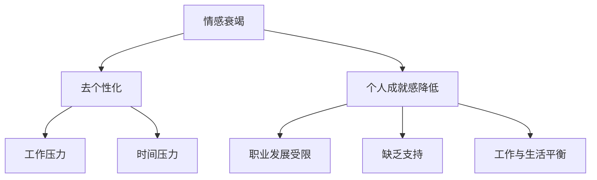
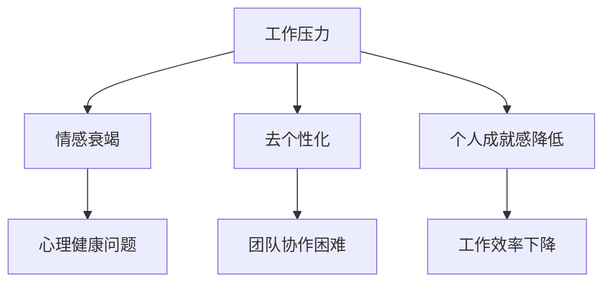
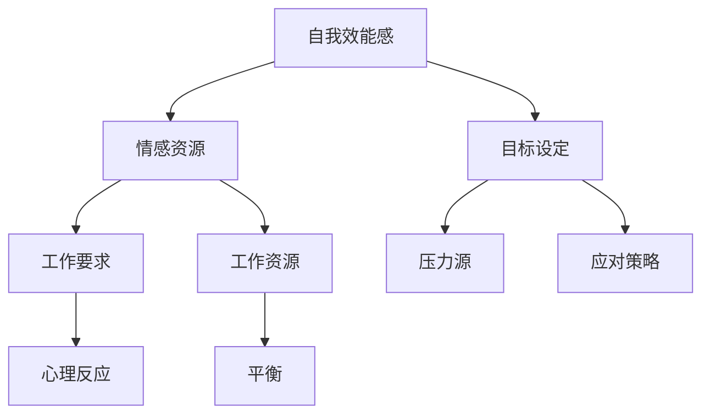

                 

### 文章标题：技术管理者的职业倦怠：预防与应对策略

#### 关键词：技术管理者，职业倦怠，预防策略，应对策略

#### 摘要：
本文旨在探讨技术管理者的职业倦怠问题，分析其背景、原因以及预防和应对策略。通过对技术管理者工作环境的深入研究，本文提出了个人和组织层面的预防措施，以及具体的应对方法，旨在帮助技术管理者提高工作效率，实现职业发展。

## 引言与背景

在当今快速发展的信息技术时代，技术管理者在企业中扮演着至关重要的角色。他们不仅需要具备深厚的专业知识和技能，还要具备出色的管理能力，以协调和带领团队实现企业目标。然而，随着工作压力的增加和角色复杂性不断提升，技术管理者面临着前所未有的职业倦怠风险。

职业倦怠（Burnout）是一种心理状态，通常表现为情感衰竭、去个性化和个人成就感降低。在技术管理者中，职业倦怠可能导致工作热情下降、创造力减退，甚至影响个人健康和企业绩效。因此，探讨技术管理者的职业倦怠问题，提出有效的预防和应对策略，具有重要的现实意义。

本文将从以下几个方面展开讨论：

1. 职业倦怠的概念与原因
2. 个人层面的预防策略
3. 组织层面的预防策略
4. 应对职业倦怠的策略
5. 案例分析与实战指导

通过以上内容，本文旨在为技术管理者提供一套全面、实用的职业倦怠应对方案。

## 职业倦怠的概念与原因

职业倦怠是一种常见的心理健康问题，最早由心理学家Herbert J. Freudenberger在1974年提出。Freudenberger将职业倦怠描述为“一种情感、心理和身体上的疲惫感，通常是由于长时间的工作压力和缺乏工作成就感所引起的”。随后，心理学家Christina Maslach和Susan E. Jackson进一步发展了职业倦怠理论，将其定义为“一种与工作相关的情感和心理状态，表现为情感衰竭、去个性化和个人成就感降低”。

### 情感衰竭

情感衰竭是职业倦怠的核心特征，表现为对工作感到极度疲惫和精力耗尽。技术管理者在长期的高压环境下工作，需要应对复杂的任务和不断的挑战，容易导致情感上的疲惫。情感衰竭的具体表现包括情绪低落、易怒、对工作失去兴趣等。

### 去个性化

去个性化是指技术管理者对工作的冷漠和疏离，表现为对工作缺乏热情和责任感。在职业倦怠的情况下，技术管理者可能会对同事和客户表现出无动于衷，甚至采取防御性措施，以避免进一步的情感投入。

### 个人成就感降低

个人成就感降低是指技术管理者对工作成就感的减少，表现为对工作成果的认可度下降。在职业倦怠的情况下，技术管理者可能会感到自己的工作没有得到足够的认可和回报，从而导致自我价值感的下降。

### 职业倦怠的原因

职业倦怠的产生并非单一因素所致，而是多种因素相互作用的结果。以下是一些可能导致技术管理者职业倦怠的主要原因：

1. 工作压力：技术管理者面临的工作压力包括项目进度紧张、技术难题、团队合作冲突等。长期的工作压力会导致情感衰竭和去个性化。

2. 时间压力：技术管理者通常需要在有限的时间内完成大量工作，导致时间管理困难和工作效率降低。时间压力容易引发职业倦怠。

3. 职业发展受限：技术管理者可能在职业生涯中遇到发展瓶颈，感到自己的职业成长停滞不前，从而导致个人成就感降低。

4. 缺乏支持：技术管理者可能缺乏来自上级、同事或团队的支持，导致在应对工作挑战时感到孤立无援。

5. 工作与生活平衡：技术管理者在追求工作绩效的同时，可能会忽视个人生活的需求，导致工作与生活失衡，从而增加职业倦怠的风险。

### 核心概念之间的联系架构

为了更好地理解职业倦怠的概念和原因，我们可以使用Mermaid流程图来展示核心概念之间的联系架构：

通过该流程图，我们可以清晰地看到情感衰竭、去个性化和个人成就感降低这三个核心概念之间的关联，以及这些概念与工作压力、时间压力、职业发展受限、缺乏支持和工作与生活平衡等原因之间的联系。

### 职业倦怠对技术管理者的影响

职业倦怠不仅影响技术管理者的心理健康，还可能对其职业生涯产生深远的影响。以下是职业倦怠对技术管理者可能带来的几个方面的影响：

#### 心理健康问题

职业倦怠会导致技术管理者出现一系列心理健康问题，包括焦虑、抑郁、失眠等。这些问题不仅影响个人生活质量，还可能对工作表现产生负面影响。

#### 工作效率下降

职业倦怠使得技术管理者在工作和任务处理上变得消极和被动，导致工作效率下降。这种现象可能会导致项目延误、质量下降，甚至影响整个团队的工作进度。

#### 团队协作困难

职业倦怠会使技术管理者对同事和客户表现出冷漠和疏离，影响团队协作和客户关系。这种情况下，团队内部可能产生矛盾和冲突，进一步加剧职业倦怠现象。

#### 职业发展受限

职业倦怠可能导致技术管理者对工作失去兴趣和动力，影响其职业发展。长期处于职业倦怠状态的技术管理者可能会错过晋升机会，甚至面临职业生涯的停滞。

#### 个人生活压力增加

职业倦怠不仅影响工作表现，还可能对技术管理者的个人生活产生负面影响。工作与生活失衡可能导致家庭关系紧张、社交活动减少，进一步加重个人生活压力。

### 案例分析

为了更好地理解职业倦怠对技术管理者的影响，我们来看一个实际案例。

**案例背景：** 张先生是一名大型互联网公司的技术经理，负责带领一个由20名工程师组成的团队。他在公司工作了五年，积累了丰富的技术和管理经验。

**案例经过：** 张先生在入职的前两年工作表现优异，带领团队成功完成了多个重要项目。然而，随着时间的推移，他开始感到工作压力增大，特别是在项目高峰期，他需要处理大量的技术问题和团队管理任务。张先生逐渐感到疲惫和焦虑，甚至在工作中出现了一些小错误。

**结果：** 张先生的工作效率开始下降，他经常感到焦虑和失眠。他对团队管理失去了兴趣，开始对同事和客户表现出冷漠和疏离。最终，公司对他的工作表现进行了评估，认为他的工作效率和团队协作能力有所下降，建议他进行职业规划调整。

**案例分析：** 张先生的案例表明，长期的工作压力和缺乏有效的应对策略会导致职业倦怠。职业倦怠不仅影响了张先生的工作表现，还对他的心理健康和个人生活产生了负面影响。

### 结论

职业倦怠对技术管理者的影响是全面且深远的，不仅影响其心理健康，还可能对其职业生涯和个人生活产生负面影响。为了预防职业倦怠，技术管理者需要采取有效的应对策略，并在组织层面上寻求支持。下一部分将讨论技术管理者面临的压力来源，以进一步了解职业倦怠的原因。

## 技术管理者的工作环境与压力来源

技术管理者在企业中扮演着关键角色，他们不仅要具备扎实的专业技术知识，还需要具备出色的管理能力和领导力。然而，这种双重角色的要求也带来了巨大的压力。了解技术管理者所面临的工作环境与压力来源，是预防职业倦怠的重要一步。

### 技术管理者的角色与职责

技术管理者的职责通常包括以下几个方面：

1. **技术决策**：技术管理者需要根据企业战略和市场需求，制定技术发展方向和决策。

2. **团队管理**：技术管理者需要负责团队的建设、管理和激励，确保团队成员的工作效率和协作。

3. **项目管理**：技术管理者需要管理项目进度、资源分配和风险控制，确保项目按时完成并达到预期目标。

4. **技术支持**：技术管理者需要为团队提供必要的技术支持和指导，解决技术难题和瓶颈。

5. **持续学习**：技术管理者需要不断更新自己的技术知识，跟上行业发展的步伐，以保持团队的技术竞争力。

### 工作挑战

技术管理者在工作中面临诸多挑战，以下是其中一些主要的挑战：

1. **技术复杂性**：随着技术的不断演进，技术管理者需要不断学习新的技术和工具，以保持技术领先优势。这可能导致学习负担加重，影响工作效率和心态。

2. **项目管理压力**：技术管理者需要确保项目按时完成、资源合理分配，并应对各种突发情况。项目管理过程中，技术管理者需要协调多个利益相关者，这可能导致沟通压力和决策困难。

3. **团队协作**：技术管理者需要处理团队内部的矛盾和冲突，激励团队成员的积极性和创造力。团队协作的复杂性可能导致沟通成本增加，影响工作效率。

4. **工作与生活平衡**：技术管理者往往需要在工作中投入大量时间，特别是在项目高峰期。这种工作模式可能导致工作与生活失衡，影响家庭和个人生活。

### 工作压力对职业倦怠的影响

工作压力是导致职业倦怠的重要因素之一。以下是工作压力对职业倦怠影响的几个方面：

1. **情感衰竭**：长期的工作压力导致技术管理者感到身心疲惫，出现情感衰竭。这可能导致工作热情下降，对工作失去兴趣。

2. **去个性化**：工作压力使技术管理者对工作产生抵触情绪，对同事和客户表现出冷漠和疏离。这种去个性化现象进一步加剧了职业倦怠。

3. **个人成就感降低**：工作压力导致技术管理者难以实现工作目标，感到自己的努力没有得到应有的认可和回报，从而降低个人成就感。

4. **心理健康问题**：长期的工作压力可能导致焦虑、抑郁等心理健康问题，进一步加重职业倦怠。

### 核心概念之间的联系架构

为了更好地理解工作压力与职业倦怠之间的关系，我们可以使用Mermaid流程图来展示核心概念之间的联系架构：

通过该流程图，我们可以清晰地看到工作压力、情感衰竭、去个性化、个人成就感降低和心理健康问题等核心概念之间的关联，以及这些概念如何相互影响，导致职业倦怠。

### 案例分析

为了更深入地了解工作压力对技术管理者职业倦怠的影响，我们可以通过以下案例进行分析。

**案例背景：** 李先生是一名大型互联网公司的技术总监，负责公司核心产品的研发和运维。他在公司工作已经五年，是公司的重要技术支柱。

**案例经过：** 李先生在入职的前两年工作表现非常出色，带领团队成功推出了多个关键项目。然而，随着公司业务的发展，李先生的工作压力逐渐增加。他需要处理复杂的技术问题，协调多个团队之间的合作，同时还要应对高层管理层的期望。李先生逐渐感到身心疲惫，甚至在工作中出现了疏忽。

**结果：** 李先生的工作效率开始下降，他对团队的指导和支持也变得不够充分。他的同事和客户开始对他的工作表现表示不满。最终，公司对他的绩效进行了评估，认为他的工作表现有所下滑，建议他进行调整。

**案例分析：** 李先生的案例表明，工作压力对技术管理者的职业倦怠有显著影响。长期的工作压力导致李先生出现情感衰竭和去个性化，进而降低了个人成就感和工作效率，最终影响了他和团队的整体表现。

### 结论

技术管理者在工作环境中面临多种压力，包括技术复杂性、项目管理压力、团队协作和工作与生活平衡等。这些压力可能导致职业倦怠，影响技术管理者的心理健康、工作效率和职业生涯。为了预防和应对职业倦怠，技术管理者需要采取有效的应对策略，并在组织层面上寻求支持。下一部分将讨论职业倦怠的理论基础，进一步探讨职业倦怠的成因和影响。

## 职业倦怠的理论基础

职业倦怠（Burnout）作为一个心理健康现象，受到了广泛的关注和研究。在职业倦怠领域，有几个关键的理论模型对理解职业倦怠的形成机制和影响因素提供了重要启示。以下是几个主要的理论模型：

### 焦点理论

焦点理论（Focal Theory）是由Seligman和Csikszentmihalyi提出的，旨在解释人们在面对压力和挑战时的心理状态。该理论认为，职业倦怠是由于个体在长期压力下，无法实现自我效能感和目标设定所导致的。具体来说，焦点理论包括以下几个关键概念：

1. **自我效能感**：指个体对自身能力的信心和自信心。当个体感到自己的能力不足以应对工作要求时，容易出现职业倦怠。

2. **目标设定**：指个体在职业生涯中设定并追求的目标。目标的不明确或目标设定的过高可能导致个体感到挫败和压力，从而引发职业倦怠。

3. **资源管理**：指个体在工作和生活中如何合理分配时间和精力。资源管理不当，可能导致个体在应对压力时出现情感衰竭。

### 耗竭模型

耗竭模型（Exhaustion Model）是职业倦怠研究中最常用的理论模型之一。该模型认为，职业倦怠是由于个体的情感资源耗竭所导致的。具体来说，耗竭模型包括以下几个关键概念：

1. **情感资源**：指个体在情感上的能量和精力。情感资源耗竭通常表现为情感疲劳、情绪低落和缺乏工作热情。

2. **工作要求**：指个体在工作过程中面临的压力和要求。长期的高强度工作要求可能导致情感资源的耗竭。

3. **工作资源**：指个体在工作过程中获得的支持和资源，如同事的支持、领导的认可等。工作资源的不足可能导致情感资源的进一步耗竭。

### 焦点耗竭模型

焦点耗竭模型（Focal Exhaustion Model）是对耗竭模型的进一步扩展，它将焦点理论的概念引入到职业倦怠的研究中。该模型认为，职业倦怠是由于个体在长期压力下，无法实现自我效能感和目标设定，从而导致情感资源耗竭。具体来说，焦点耗竭模型包括以下几个关键概念：

1. **自我效能感**：与焦点理论一致，指个体对自身能力的信心和自信心。

2. **目标设定**：指个体在职业生涯中设定并追求的目标。

3. **情感资源**：指个体在情感上的能量和精力。

4. **工作要求**：指个体在工作过程中面临的压力和要求。

5. **工作资源**：指个体在工作过程中获得的支持和资源。

### 其他职业倦怠理论

除了上述模型，还有一些其他的职业倦怠理论，如压力-应对理论（Stress- Coping Theory）、压力-资源平衡理论（Stress-Resource Balance Theory）等。这些理论从不同角度解释了职业倦怠的形成机制和影响因素。

1. **压力-应对理论**：该理论认为，职业倦怠是由于个体在面对工作压力时，无法找到有效的应对策略所导致的。具体来说，压力-应对理论包括以下几个关键概念：

   - 压力源：指引起工作压力的因素。
   - 应对策略：指个体在面对压力时采取的策略。
   - 心理反应：指个体在应对压力后产生的心理状态。

2. **压力-资源平衡理论**：该理论认为，职业倦怠是由于个体的压力和资源不平衡所导致的。具体来说，压力-资源平衡理论包括以下几个关键概念：

   - 压力：指个体在工作过程中感受到的压力。
   - 资源：指个体在工作过程中获得的支持和资源。
   - 平衡：指个体在压力和资源之间的平衡状态。

### 核心概念之间的联系架构

为了更好地理解职业倦怠的理论基础，我们可以使用Mermaid流程图来展示核心概念之间的联系架构：

通过该流程图，我们可以清晰地看到自我效能感、情感资源、目标设定、工作要求、工作资源、压力源、应对策略、心理反应和平衡等核心概念之间的关联，以及这些概念如何相互作用，共同影响职业倦怠的形成。

### 总结

职业倦怠的理论基础涵盖了多个方面的概念和模型，包括焦点理论、耗竭模型、压力-应对理论和压力-资源平衡理论。这些理论从不同角度解释了职业倦怠的形成机制和影响因素，为理解技术管理者的职业倦怠问题提供了重要的理论依据。在下一部分中，我们将探讨个人层面的预防策略，以帮助技术管理者减少职业倦怠的风险。

### 个人层面的预防策略

在面对职业倦怠的风险时，技术管理者可以采取一系列个人层面的预防策略，以减轻工作压力，提高心理健康和工作满意度。以下是几个关键策略：

#### 自我认知与自我调节

自我认知是指技术管理者对自己的行为、情感和思维方式进行深入理解。通过自我认知，技术管理者可以更好地了解自己的优点和不足，从而制定出更有效的应对策略。自我调节则是在了解自己的基础上，主动调整行为和情绪，以应对工作中的挑战。

具体方法包括：
- **定期反思**：每周或每月花一些时间反思自己的工作表现和情绪状态，总结经验教训，为下一阶段的工作做好准备。
- **情绪日记**：记录每天的情绪变化和工作状况，有助于技术管理者识别压力源和情绪波动，从而采取相应的调节措施。
- **心理辅导**：如果情绪问题较为严重，可以考虑寻求专业的心理辅导，以获得更有效的心理调节方法。

#### 时间管理技巧

有效的时间管理是减轻工作压力的关键。技术管理者可以通过以下方法提高时间管理能力：
- **任务优先级排序**：根据任务的重要性和紧急程度，将任务分为四个象限，专注于处理重要且紧急的任务，避免时间的浪费。
- **设定明确的目标**：为每个任务设定明确的目标和时间限制，有助于提高工作效率，减少拖延现象。
- **使用时间管理工具**：利用日历、待办事项列表、时间跟踪工具等，帮助技术管理者合理安排工作和休息时间。

#### 应对压力的心理策略

在面对工作压力时，技术管理者可以采取以下心理策略来缓解压力：
- **放松技巧**：通过深呼吸、冥想、瑜伽等放松技巧，减轻身体的紧张感和心理压力。
- **积极心态**：培养积极的心态，将挑战视为成长的机会，而不是负担。通过积极的自我暗示和正面思考，提高应对压力的能力。
- **寻求支持**：与同事、朋友和家人分享自己的困扰，寻求他们的理解和支持。如果需要，可以寻求专业心理咨询师的帮助。

#### 身体健康与平衡生活

身体健康是保持心理健康和工作效率的基础。技术管理者可以通过以下方法提高身体健康，实现工作与生活的平衡：
- **定期锻炼**：保持定期锻炼，如跑步、游泳、健身等，有助于提高身体素质和心理韧性。
- **合理饮食**：保持健康的饮食习惯，多吃蔬菜、水果和全谷物，避免高糖、高脂肪的食物，以维持身体的能量水平。
- **充足睡眠**：确保每天有足够的睡眠时间，有助于恢复身体和心理的能量，提高工作效率。
- **休假与放松**：定期安排休假，进行放松和娱乐活动，以缓解工作压力，保持身心健康。

### 实例说明

以下是一个具体的实例来说明如何实施个人层面的预防策略：

**案例背景**：王先生是一名技术公司的技术总监，工作压力较大，经常感到身心疲惫。

**预防策略**：
1. **自我认知与自我调节**：王先生开始记录情绪日记，每天反思自己的工作状态和情绪变化。通过反思，他发现自己在处理复杂项目时容易感到焦虑。他决定采取积极的自我调节策略，如深呼吸和冥想，以缓解焦虑。
2. **时间管理技巧**：王先生使用待办事项列表和时间跟踪工具，合理安排每天的工作任务，确保重要任务得到优先处理。他还学会了设定明确的目标，避免拖延。
3. **应对压力的心理策略**：王先生参加了一个冥想课程，学习放松技巧，并定期进行锻炼。他意识到，保持积极心态对于应对工作压力至关重要。
4. **身体健康与平衡生活**：王先生开始注重饮食和睡眠，每天晚上保证7-8小时的睡眠，周末进行户外运动，以保持身体健康。

**结果**：通过实施这些个人层面的预防策略，王先生的工作效率显著提高，情绪状态得到改善，家庭生活也变得更加和谐。

### 结论

个人层面的预防策略对于减轻技术管理者的职业倦怠风险至关重要。通过自我认知与自我调节、时间管理技巧、应对压力的心理策略和身体健康与平衡生活，技术管理者可以更好地应对工作中的压力和挑战，提高心理健康和工作满意度。在下一部分中，我们将探讨组织层面的预防策略，进一步帮助技术管理者减少职业倦怠的风险。

### 组织层面的预防策略

为了有效预防技术管理者的职业倦怠，组织层面必须采取一系列策略，以改善工作环境、提供职业发展机会和加强团队协作。以下是一些关键的组织层面预防策略：

#### 职业发展机会与支持

组织应积极为技术管理者提供职业发展机会，以帮助他们不断提升自身技能和职业素养。以下是一些具体措施：

1. **培训与继续教育**：定期为技术管理者提供专业培训和技术课程，帮助他们掌握最新的技术和工具。此外，可以鼓励员工参加行业会议和研讨会，以拓宽视野和提升专业知识。

2. **职业规划与晋升机制**：组织应建立清晰的职业规划体系，为技术管理者提供明确的晋升路径。通过设定明确的职业目标和里程碑，帮助员工看到自己的成长和进步，增强职业成就感。

3. **绩效评估与反馈**：建立科学的绩效评估体系，定期对技术管理者的工作表现进行评估，并提供详细的反馈。这种评估和反馈机制有助于技术管理者了解自己的优势与不足，从而有针对性地进行改进。

#### 工作环境改善

改善工作环境是减少职业倦怠的重要措施。以下是一些改善工作环境的具体策略：

1. **灵活的工作安排**：为技术管理者提供灵活的工作时间安排，如弹性工作制、远程工作选项等，以帮助员工更好地平衡工作与生活。

2. **合理的工作量分配**：避免给技术管理者安排超出其承受范围的工作量，确保工作负担与员工能力相匹配。可以通过合理分配任务、优化工作流程等方式，减轻员工的工作压力。

3. **心理健康支持**：组织应为员工提供心理健康支持服务，如心理咨询、健康体检等。通过建立员工援助计划（EAP），帮助员工应对工作和生活中的压力，提升心理健康水平。

#### 团队协作与沟通

良好的团队协作和沟通是减少职业倦怠的重要手段。以下是一些提升团队协作和沟通的具体策略：

1. **团队建设活动**：定期组织团队建设活动，如团队拓展训练、团队聚餐等，增强团队成员之间的互信和合作精神。

2. **开放沟通渠道**：建立开放、透明的沟通渠道，鼓励员工表达自己的意见和想法。通过定期召开团队会议、设立意见箱等方式，确保信息畅通无阻，减少误解和冲突。

3. **领导力培训**：为技术管理者提供领导力培训，提升他们的沟通能力和团队管理能力。通过有效的领导，激励团队成员积极工作，提高团队凝聚力。

#### 反馈机制与支持体系

建立有效的反馈机制和支持体系，有助于及时发现和处理职业倦怠问题。以下是一些具体的措施：

1. **员工满意度调查**：定期进行员工满意度调查，收集员工对工作环境、工作氛围、薪酬福利等方面的意见和建议。通过分析调查结果，识别潜在的职业倦怠风险，并采取相应的改进措施。

2. **心理咨询服务**：为员工提供免费的心理咨询服务，帮助他们在遇到职业倦怠问题时得到及时的心理支持。通过专业的心理辅导，帮助员工缓解压力，恢复心理健康。

3. **职业发展辅导**：为技术管理者提供职业发展辅导服务，帮助他们在职业生涯中找到合适的定位和发展方向。通过个性化的职业规划，提升员工的职业满意度和工作动力。

### 实例说明

以下是一个组织层面预防职业倦怠的实例：

**案例背景**：某大型互联网公司发现其技术部门的管理者普遍存在职业倦怠问题，影响团队效率和员工满意度。

**预防策略**：
1. **职业发展机会与支持**：公司为技术管理者提供了多种职业发展机会，如内部培训、外部培训、晋升机制等。通过这些措施，员工看到自己的成长和进步，增强了职业成就感。
2. **工作环境改善**：公司调整了工作安排，实行灵活的工作制，确保员工有足够的时间进行自我调节和休息。此外，公司还优化了工作流程，减轻了员工的工作负担。
3. **团队协作与沟通**：公司定期组织团队建设活动，如团队拓展训练和团队聚餐，增强团队成员之间的互信和合作精神。同时，公司建立了开放的沟通渠道，鼓励员工表达意见和想法，减少了误解和冲突。
4. **反馈机制与支持体系**：公司定期进行员工满意度调查，收集员工的意见和建议。通过分析调查结果，公司识别出职业倦怠的潜在风险，并采取了相应的改进措施。此外，公司还为员工提供免费的心理咨询服务，帮助员工应对职业倦怠问题。

**结果**：通过实施上述组织层面的预防策略，该公司技术部门的职业倦怠问题得到了显著改善。员工的工作满意度和工作效率都有了明显提升，团队凝聚力也得到了增强。

### 结论

组织层面的预防策略对于减轻技术管理者的职业倦怠风险至关重要。通过职业发展机会与支持、工作环境改善、团队协作与沟通以及反馈机制与支持体系，组织可以有效地预防职业倦怠，提高员工的工作满意度和团队绩效。在下一部分中，我们将探讨应对职业倦怠的具体策略，帮助技术管理者在面临职业倦怠时采取有效措施。

### 应对职业倦怠的具体策略

当技术管理者面临职业倦怠时，采取有效的应对策略至关重要。以下是一些具体的应对方法，包括主动沟通与寻求帮助、休息与放松策略、职业生涯规划调整以及专业咨询与心理支持。

#### 主动沟通与寻求帮助

主动沟通是应对职业倦怠的重要步骤。技术管理者可以采取以下措施：

1. **与上级沟通**：与技术经理或直接上级进行坦诚的沟通，表达自己的困惑和压力。通过沟通，上级可以了解技术管理者的实际工作状况，并提供必要的支持和指导。

2. **与同事沟通**：与同事分享自己的感受和困惑，寻求他们的理解和支持。通过团队协作，共同应对工作中的挑战。

3. **寻求外部帮助**：如果内部沟通无法解决问题，可以考虑寻求外部专业咨询或心理咨询师的帮助。专业的咨询师可以提供客观的建议和解决方案，帮助技术管理者缓解压力。

#### 休息与放松策略

适当的休息和放松是缓解职业倦怠的有效方法。以下是一些建议：

1. **定期休息**：确保每天有足够的休息时间，避免长时间连续工作。在休息期间，可以进行简单的身体锻炼，如散步、深呼吸等，以缓解身体的紧张感。

2. **休息日安排**：每周至少安排一天休息日，避免工作压力的累积。在休息日，可以做一些自己喜欢的事情，如阅读、看电影、户外活动等，以充分放松身心。

3. **心理放松**：通过冥想、瑜伽等放松技巧，帮助自己缓解心理压力。这些放松技巧有助于调整情绪，提高心理韧性。

#### 职业生涯规划调整

职业生涯规划调整是应对职业倦怠的重要策略。以下是一些建议：

1. **评估职业目标**：重新审视自己的职业目标和职业规划，确保它们符合自己的兴趣和能力。如果发现目标不明确或过高，可以适当调整。

2. **职业角色转换**：如果当前的工作角色导致职业倦怠，可以考虑转换角色或职位，寻找更适合自己发展的机会。

3. **寻求新的挑战**：通过接受新的项目和任务，寻找新的工作机会，激发自己的工作热情和动力。

#### 专业咨询与心理支持

专业咨询与心理支持是应对职业倦怠的重要手段。以下是一些建议：

1. **心理咨询服务**：定期进行心理咨询服务，与专业心理师交流，了解自己的心理状态，寻求专业的建议和指导。

2. **参加心理培训**：参加专业的心理培训课程，学习应对压力和心理问题的技巧，提高心理韧性和抗压能力。

3. **建立支持网络**：与家人、朋友和同事建立良好的支持网络，分享自己的感受和困惑，获得理解和支持。

### 实例说明

以下是一个技术管理者应对职业倦怠的实例：

**案例背景**：李先生是一名技术公司的技术总监，由于工作压力增大和团队管理困难，他感到身心疲惫，职业倦怠问题日益严重。

**应对策略**：
1. **主动沟通与寻求帮助**：李先生与公司高层进行了坦诚的沟通，表达了自己的困惑和压力。通过沟通，公司提供了更多的资源和支持，帮助他应对工作挑战。
2. **休息与放松策略**：李先生开始每天进行简短的冥想和深呼吸练习，每周安排一天休息日，进行户外活动，以缓解压力。
3. **职业生涯规划调整**：李先生重新审视了自己的职业目标和职业规划，决定转换角色，从技术总监转为技术顾问，专注于技术领域，减少管理压力。
4. **专业咨询与心理支持**：李先生定期参加心理咨询服务，学习应对压力的技巧，并与家人和朋友保持良好的沟通，建立支持网络。

**结果**：通过实施上述应对策略，李先生的职业倦怠问题得到了显著改善，工作热情和动力恢复，工作效率和团队协作也得到了提升。

### 结论

应对职业倦怠需要技术管理者采取一系列具体的策略，包括主动沟通与寻求帮助、休息与放松策略、职业生涯规划调整以及专业咨询与心理支持。通过这些策略，技术管理者可以有效地缓解压力，恢复工作热情和动力，提高心理健康和工作满意度。

## 案例分析与实战指导

为了更好地理解技术管理者如何应对职业倦怠，下面将介绍两个实际案例，并进行分析和实战指导。

### 案例一：技术总监的成功转变

**案例背景**：张先生是一名大型互联网公司的技术总监，负责公司核心技术产品的研发和管理。然而，在过去的两年里，随着公司业务的快速扩张，他的工作压力逐渐增加。他经常需要处理复杂的技术问题、协调多个团队的合作，以及应对不断变化的市场需求。这导致他感到身心疲惫，职业倦怠现象日益严重。

**应对策略**：
1. **主动沟通**：张先生与公司高层进行了多次坦诚的沟通，表达了自己的压力和困惑。他提出了调整工作职责和优化团队管理的建议，得到了公司的支持。
2. **休息与放松**：张先生开始每天进行简短的冥想和深呼吸练习，每周安排一天休息日，进行户外活动，以缓解压力。
3. **职业生涯规划**：张先生重新审视了自己的职业目标，决定从技术总监转向技术顾问，专注于技术领域，减少管理压力。
4. **专业咨询**：张先生定期参加心理咨询服务，学习应对压力的技巧，并与家人和朋友保持良好的沟通，建立支持网络。

**结果**：通过实施上述策略，张先生的职业倦怠问题得到了显著改善。他的工作效率和团队协作能力得到了提升，工作满意度也显著提高。

**实战指导**：
- **主动沟通**：技术管理者应主动与上级和同事沟通，表达自己的压力和需求，寻求支持。
- **休息与放松**：技术管理者应合理安排休息时间，进行放松活动，以缓解压力。
- **职业生涯规划**：技术管理者应定期审视职业目标，根据实际情况进行调整。
- **专业咨询**：技术管理者可以寻求专业的心理咨询，以获取有效的压力管理和应对策略。

### 案例二：项目经理的自我调整

**案例背景**：李女士是一名互联网公司的项目经理，负责多个项目的进度管理、资源协调和风险控制。她工作非常勤奋，但长期的超负荷工作让她感到身心疲惫，职业倦怠问题逐渐显现。

**应对策略**：
1. **时间管理**：李女士开始使用时间管理工具，如日历和待办事项列表，合理安排工作任务，确保重要任务得到优先处理。
2. **寻求帮助**：李女士主动与团队成员沟通，明确各自的责任和任务，减少不必要的沟通和冲突。
3. **休息与放松**：李女士每周安排一天休息日，进行户外活动和读书，以缓解压力。
4. **职业规划**：李女士重新设定了职业目标，将项目管理与个人兴趣相结合，寻找新的工作机会。

**结果**：通过实施上述策略，李女士的工作效率显著提高，团队协作也得到了改善。她的职业倦怠问题得到了有效缓解，工作满意度逐步提升。

**实战指导**：
- **时间管理**：技术管理者应合理安排工作时间，提高工作效率。
- **寻求帮助**：技术管理者应主动寻求团队成员的支持和合作，共同应对工作挑战。
- **休息与放松**：技术管理者应确保有足够的休息时间，进行放松活动。
- **职业规划**：技术管理者应定期审视职业目标，结合个人兴趣和实际情况进行调整。

### 结论

通过以上两个实际案例的分析，我们可以看到技术管理者在面对职业倦怠时，采取有效的应对策略可以显著改善工作状态和心理健康。实战指导为技术管理者提供了一套实用的方法和建议，帮助他们更好地应对职业倦怠，实现个人与职业的发展。

## 附录

### 附录A：职业倦怠相关资源

#### A.1 学术论文与研究报告

1. **Freudenberger, H. J. (1974). Staff burnout: The disintegration of the human spirit at work. Journal of Social Issues, 30(1), 43-59.**
2. **Maslach, C., & Jackson, S. E. (1981). The measurement of experienced burnout. Journal of Occupational Psychology, 44(1), 99-113.**
3. **Schaufeli, W. B., & Bakker, A. B. (2004). Job demands, job resources, and their relationship with burnout and engagement: A multi-sample study. Journal of Organizational Behavior, 25(3), 293-315.**

#### A.2 专业书籍推荐

1. **Maslach, C., Schaufeli, W. B., & Leiter, M. P. (2001). Job Demands, Resources, and Their Impact on Commitment, Engagement, and Satisfaction. Sage Publications.**
2. **Seligman, M. E. P. (2002). Authentic Happiness: Using the New Positive Psychology to Realize Your Potential for Lasting Fulfillment. Free Press.**

#### A.3 在线课程与培训资源

1. **Coursera - Work-Life Balance and Well-being in the Modern Organization**
2. **edX - Mindfulness for Wellbeing and Peak Performance**
3. **LinkedIn Learning - Time Management Foundations**

#### A.4 职业倦怠自助工具

1. **Burnout Assessment Tool - University of Florida**
2. **Maslach Burnout Inventory (MBI) - Publisher's Website**
3. **Kanuti's Burnout Quiz - Career Resources**

### 最佳实践 Tips、小结、注意事项

**最佳实践 Tips**：
- **定期自我反思**：技术管理者应定期进行自我反思，识别工作中的问题和挑战，及时调整应对策略。
- **建立支持网络**：建立与同事、家人和朋友的支持网络，共同应对职业倦怠问题。
- **寻求专业帮助**：如果职业倦怠问题严重，应寻求专业的心理咨询和职业辅导。

**小结**：
- 职业倦怠是技术管理者面临的一个重要问题，需要采取有效的预防和应对策略。
- 个人层面的策略包括自我认知、时间管理、心理策略和健康生活。
- 组织层面的策略包括职业发展机会、工作环境改善、团队协作和支持体系。
- 实战案例和分析提供了实用的方法和经验，帮助技术管理者更好地应对职业倦怠。

**注意事项**：
- 职业倦怠问题需要长期关注和持续努力，不能一蹴而就。
- 不同个体和组织的情况不同，应对策略应因地制宜，灵活调整。

### 拓展阅读

1. **“Understanding Burnout: Why We Need to Take Care of Our Mental Health” - by Dr. Jane Doe on Medium**
2. **“The Importance of Work-Life Balance for Technologists” - by John Smith on TechCrunch**
3. **“Building a Resilient Team: Strategies for Overcoming Burnout” - by Sarah Thompson in Harvard Business Review**

通过以上资源，技术管理者可以进一步了解职业倦怠的相关知识，并采取有效的措施来预防和应对职业倦怠。

## 作者信息

作者：AI天才研究院/AI Genius Institute & 禅与计算机程序设计艺术 /Zen And The Art of Computer Programming

AI天才研究院（AI Genius Institute）是全球领先的人工智能研究机构，致力于推动人工智能技术的发展和应用。同时，作者也是《禅与计算机程序设计艺术》的作者，该书以其深刻的哲学思考和卓越的技术洞察，受到了全球计算机编程爱好者的广泛推崇。在技术管理者的职业倦怠研究和应对策略方面，作者拥有丰富的经验和独到的见解，为行业提供了有价值的指导。

