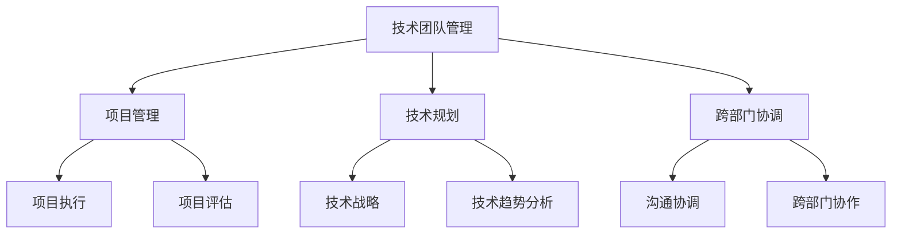
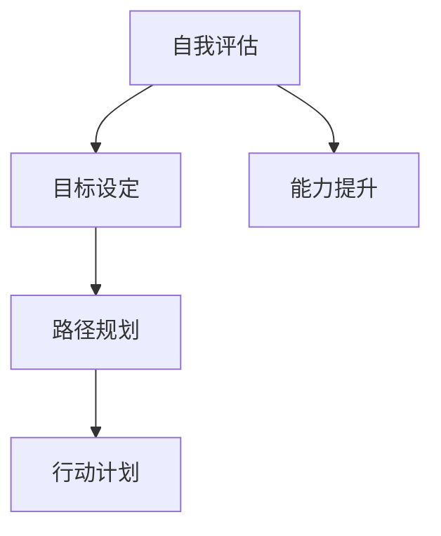
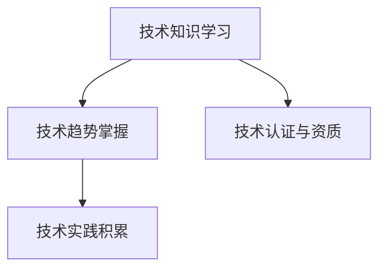
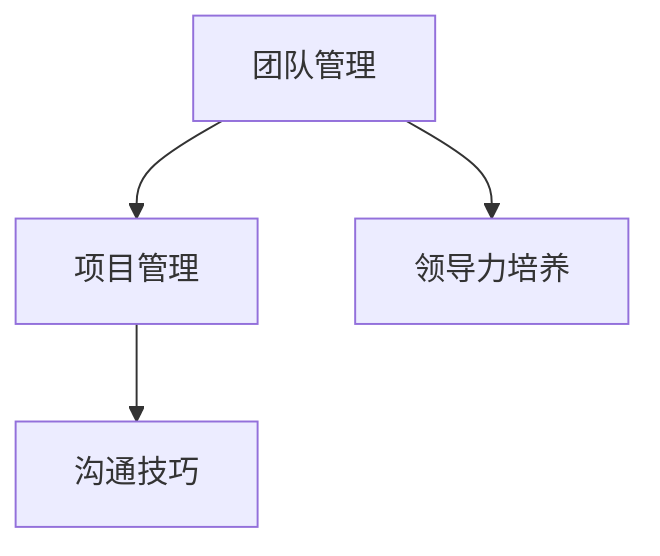
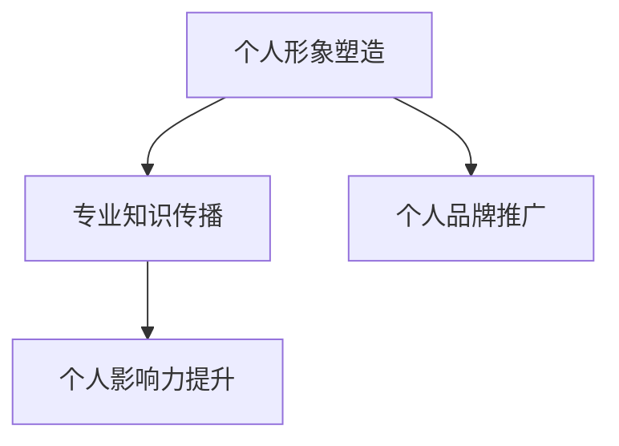
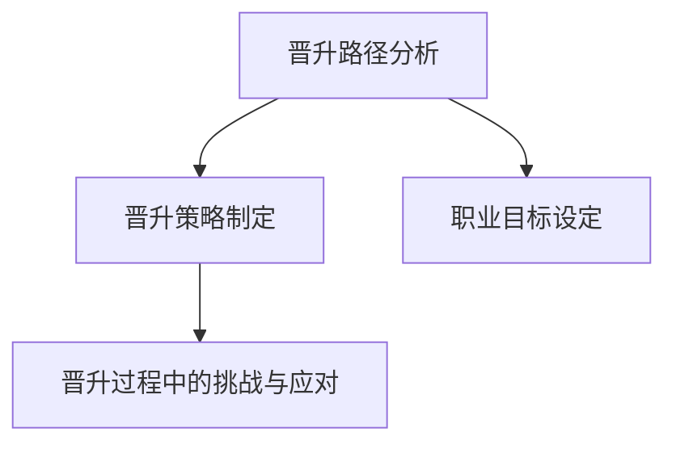
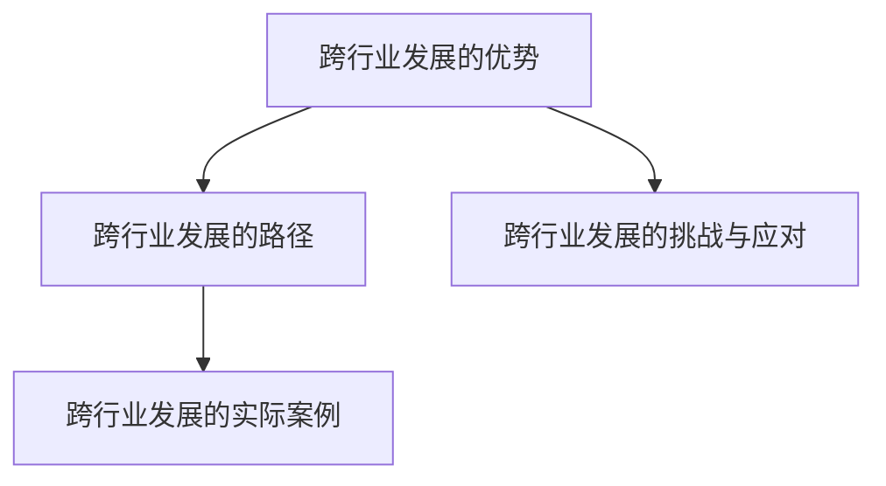
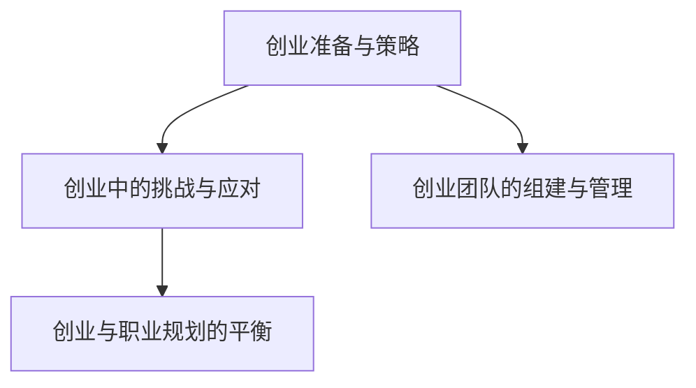
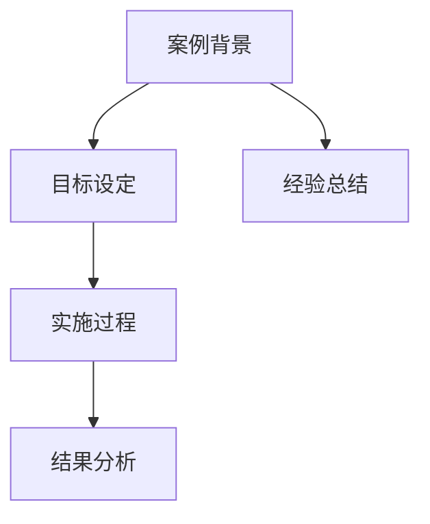
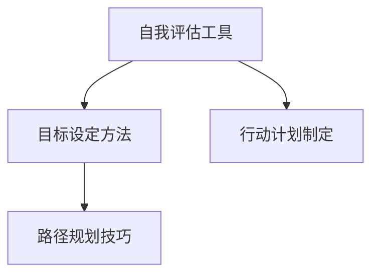

                 


### 文章标题：技术管理者的职业规划与发展路径

> 关键词：技术管理者，职业规划，发展路径，技能提升，管理技能，团队管理

> 摘要：本文旨在探讨技术管理者的职业规划与发展路径，从职业规划基础、技能提升、职业发展路径与策略、职业规划实战四个方面详细阐述，为技术管理者提供实用的指导和建议。

### 第一部分：职业规划基础

#### 第1章：技术管理者的角色与职责

**背景介绍**

技术管理者在企业中扮演着至关重要的角色，他们不仅要具备深厚的技术背景，还要拥有出色的管理能力。随着技术的不断进步和市场竞争的加剧，技术管理者的职责也日益复杂和多样化。

**核心概念与联系**

技术管理者的核心职责包括：技术团队的组建与管理、项目规划与执行、技术规划与战略制定、跨部门协调与沟通等。这些职责相互关联，共同构成了技术管理者在企业的角色。

**Mermaid 流程图**



**核心算法原理讲解**

技术管理者的职责不是通过具体的算法来实现，而是通过综合运用各种管理技能和知识，对团队、项目、技术进行有效的管理。

**数学模型和公式**

无具体的数学模型和公式，但可以通过以下方程式来描述技术管理者的职责：

$$
\text{技术管理者} = \text{技术背景} + \text{管理技能} + \text{团队管理} + \text{项目管理} + \text{技术规划} + \text{跨部门协调}
$$

**项目实战**

在技术管理者的实际工作中，他们需要面对各种复杂的项目，如软件研发、系统集成、技术改造等。以下是一个简单的项目实战案例：

**项目名称**：某企业办公自动化系统的研发

**项目目标**：开发一个能够满足企业办公需求的自动化系统，提高工作效率。

**项目实现**：

1. **需求分析**：与各部门沟通，了解具体需求，编写需求文档。
2. **技术选型**：根据需求选择合适的技术框架和工具。
3. **团队组建**：组建技术团队，明确分工和职责。
4. **项目执行**：按照项目计划进行开发，确保项目进度和质量。
5. **项目评估**：项目完成后进行验收和评估，确保满足需求。

**代码解读与分析**：

在项目开发过程中，技术管理者需要关注代码质量、项目进度和团队协作。以下是一个简单的代码片段示例：

```java
public class Employee {
    private String name;
    private int age;
    private double salary;

    public Employee(String name, int age, double salary) {
        this.name = name;
        this.age = age;
        this.salary = salary;
    }

    public void work() {
        System.out.println(name + " is working.");
    }

    public void printInfo() {
        System.out.println("Name: " + name + ", Age: " + age + ", Salary: " + salary);
    }
}
```

在这个代码片段中，`Employee` 类代表企业的员工，包含姓名、年龄和薪资等信息。`work()` 方法用于表示员工的工作，`printInfo()` 方法用于打印员工的信息。

**实际案例分析和详细讲解剖析**：

在技术管理者的职业生涯中，他们会遇到各种实际案例。以下是一个实际案例的分析：

**案例**：某企业技术部门在项目开发过程中遇到了进度延误的问题。

**分析**：

1. **问题定位**：通过调查发现，项目延误的主要原因是需求变更频繁，导致开发工作反复。
2. **原因分析**：需求变更频繁可能是由于项目需求不明确或需求管理不善导致的。
3. **解决方案**：改进需求管理流程，确保需求明确和稳定，避免频繁变更。

**项目小结**：

通过这个案例，技术管理者可以了解到在项目开发过程中，需求管理的重要性。有效的需求管理可以确保项目进度和质量，避免项目延误和成本超支。

**最佳实践 tips**：

- 定期与团队成员沟通，了解项目进度和问题。
- 制定详细的项目计划，明确分工和职责。
- 加强需求管理，确保需求明确和稳定。
- 培养团队协作精神，提高团队执行力。

#### 第2章：职业生涯规划概述

**背景介绍**

职业生涯规划是技术管理者实现职业目标的重要手段。通过明确的职业规划，技术管理者可以更好地规划自己的职业道路，实现个人和企业的共同发展。

**核心概念与联系**

职业生涯规划包括自我评估、目标设定、路径规划等核心环节。这些环节相互关联，共同构成了职业生涯规划的框架。

**Mermaid 流�程图**



**核心算法原理讲解**

职业生涯规划没有具体的算法原理，但可以通过以下步骤来实现：

1. 自我评估：了解自己的兴趣、能力和价值观，确定职业发展方向。
2. 目标设定：设定明确的职业目标，包括短期和长期目标。
3. 路径规划：规划实现目标的路径，包括所需的技能、经验和资源。
4. 行动计划：制定具体的行动计划，包括学习、工作、休息等。

**数学模型和公式**

职业生涯规划可以通过以下方程式来描述：

$$
\text{职业生涯规划} = \text{自我评估} + \text{目标设定} + \text{路径规划} + \text{行动计划}
$$

**项目实战**

在职业生涯规划的实际过程中，技术管理者可以参考以下项目实战：

**项目名称**：某技术管理者的职业生涯规划

**项目目标**：制定一个详细的职业生涯规划，实现职业目标。

**项目实现**：

1. **自我评估**：通过问卷调查、访谈等方式，了解自己的兴趣、能力和价值观。
2. **目标设定**：根据自我评估结果，设定明确的职业目标。
3. **路径规划**：分析实现目标的路径，确定所需的技能、经验和资源。
4. **行动计划**：制定具体的行动计划，包括学习、工作、休息等。

**代码解读与分析**：

职业生涯规划没有具体的代码实现，但可以通过以下伪代码来描述：

```python
def career_planning():
    self_evaluation()
    goal_setting()
    path_planning()
    action_plan()
```

**实际案例分析和详细讲解剖析**：

在技术管理者的职业生涯中，他们会遇到各种实际案例。以下是一个实际案例的分析：

**案例**：某技术管理者在职业生涯规划过程中，发现自己在团队管理方面存在不足。

**分析**：

1. **问题定位**：通过自我评估，发现团队管理能力不足。
2. **原因分析**：可能是因为缺乏团队管理经验和技能。
3. **解决方案**：通过学习团队管理知识和技能，提高团队管理能力。

**项目小结**：

通过这个案例，技术管理者可以了解到在职业生涯规划过程中，发现并解决自身不足的重要性。

**最佳实践 tips**：

- 定期进行自我评估，了解自己的优点和不足。
- 设定明确的职业目标，并制定详细的路径规划。
- 不断学习新知识和技能，提高自身能力。
- 主动寻求反馈，不断改进自己的工作方法和技巧。

### 第二部分：技能提升与专业发展

#### 第3章：技术能力提升

**背景介绍**

技术能力是技术管理者的核心能力之一。随着技术的不断进步，技术管理者需要不断提升自己的技术能力，以适应新的技术趋势和市场需求。

**核心概念与联系**

技术能力提升包括技术知识的学习、技术趋势的掌握、技术实践的积累等。这些环节相互关联，共同构成了技术能力提升的框架。

**Mermaid 流程图**



**核心算法原理讲解**

技术能力提升没有具体的算法原理，但可以通过以下步骤来实现：

1. 学习技术知识：通过阅读书籍、参加培训、在线学习等方式，不断学习新的技术知识。
2. 掌握技术趋势：关注技术领域的最新动态和发展趋势，了解新兴技术和应用场景。
3. 进行技术实践：通过实际项目和技术实践，积累经验，提高技术能力。
4. 获取技术认证与资质：通过考取技术认证和获得相关资质，提升自己的技术能力。

**数学模型和公式**

技术能力提升可以通过以下方程式来描述：

$$
\text{技术能力提升} = \text{技术知识学习} + \text{技术趋势掌握} + \text{技术实践积累} + \text{技术认证与资质}
$$

**项目实战**

在技术能力提升的实际过程中，技术管理者可以参考以下项目实战：

**项目名称**：某技术管理者的技术能力提升

**项目目标**：提升自己的技术能力，适应新的技术趋势和市场需求。

**项目实现**：

1. **学习技术知识**：通过阅读书籍、参加培训、在线学习等方式，学习新的技术知识。
2. **掌握技术趋势**：关注技术领域的最新动态和发展趋势，了解新兴技术和应用场景。
3. **进行技术实践**：通过实际项目和技术实践，积累经验，提高技术能力。
4. **获取技术认证与资质**：通过考取技术认证和获得相关资质，提升自己的技术能力。

**代码解读与分析**：

技术能力提升没有具体的代码实现，但可以通过以下伪代码来描述：

```python
def technical_ability_improvement():
    knowledge_learning()
    trend_mastery()
    practice_accumulation()
    certification_and_qualification()
```

**实际案例分析和详细讲解剖析**：

在技术管理者的职业生涯中，他们会遇到各种实际案例。以下是一个实际案例的分析：

**案例**：某技术管理者在技术能力提升过程中，遇到了困难。

**分析**：

1. **问题定位**：通过自我评估，发现技术知识储备不足。
2. **原因分析**：可能是因为平时工作繁忙，缺乏系统的技术学习时间。
3. **解决方案**：通过制定学习计划，合理安排时间，进行系统的技术学习。

**项目小结**：

通过这个案例，技术管理者可以了解到在技术能力提升过程中，制定合理的学习计划和时间管理的重要性。

**最佳实践 tips**：

- 定期进行技术知识学习，不断更新自己的知识体系。
- 关注技术趋势，了解新兴技术和应用场景。
- 进行实际项目和技术实践，积累经验。
- 考取相关技术认证和资质，提升自己的技术能力。

#### 第4章：管理技能提升

**背景介绍**

管理技能是技术管理者不可或缺的能力之一。良好的管理技能可以帮助技术管理者更好地带领团队，实现项目目标。

**核心概念与联系**

管理技能提升包括团队管理、项目管理、沟通技巧等。这些环节相互关联，共同构成了管理技能提升的框架。

**Mermaid 流程图**



**核心算法原理讲解**

管理技能提升没有具体的算法原理，但可以通过以下步骤来实现：

1. 学习管理知识：通过阅读书籍、参加培训、在线学习等方式，学习管理知识。
2. 实践管理技能：通过实际工作，不断实践和提升管理技能。
3. 培养领导力：通过领导力的培养，提升自己的领导能力和影响力。
4. 沟通技巧：通过沟通技巧的提升，提高沟通效果和团队协作能力。

**数学模型和公式**

管理技能提升可以通过以下方程式来描述：

$$
\text{管理技能提升} = \text{团队管理} + \text{项目管理} + \text{沟通技巧} + \text{领导力培养}
$$

**项目实战**

在管理技能提升的实际过程中，技术管理者可以参考以下项目实战：

**项目名称**：某技术管理者的管理技能提升

**项目目标**：提升自己的管理技能，提高团队协作效率。

**项目实现**：

1. **学习管理知识**：通过阅读书籍、参加培训、在线学习等方式，学习管理知识。
2. **实践管理技能**：通过实际工作，不断实践和提升管理技能。
3. **培养领导力**：通过领导力的培养，提升自己的领导能力和影响力。
4. **沟通技巧**：通过沟通技巧的提升，提高沟通效果和团队协作能力。

**代码解读与分析**：

管理技能提升没有具体的代码实现，但可以通过以下伪代码来描述：

```python
def management_ability_improvement():
    knowledge_learning()
    skill_practice()
    leadership_cultivation()
    communication_improvement()
```

**实际案例分析和详细讲解剖析**：

在技术管理者的职业生涯中，他们会遇到各种实际案例。以下是一个实际案例的分析：

**案例**：某技术管理者在团队管理过程中，遇到了团队士气低落的问题。

**分析**：

1. **问题定位**：通过观察和沟通，发现团队士气低落的原因是工作压力过大，缺乏激励。
2. **原因分析**：可能是因为工作分配不合理，缺乏有效的激励措施。
3. **解决方案**：通过调整工作分配，增加激励机制，提高团队士气。

**项目小结**：

通过这个案例，技术管理者可以了解到在团队管理过程中，关注团队士气和激励措施的重要性。

**最佳实践 tips**：

- 学习管理知识，不断更新自己的管理理念和方法。
- 实践管理技能，通过实际工作提高管理能力。
- 培养领导力，提升自己的领导能力和影响力。
- 提高沟通技巧，增强团队协作能力。

#### 第5章：个人品牌建设

**背景介绍**

在当今竞争激烈的市场环境中，个人品牌建设对技术管理者的重要性日益凸显。良好的个人品牌可以帮助技术管理者在职场中脱颖而出，提升职业竞争力。

**核心概念与联系**

个人品牌建设包括个人形象塑造、专业知识的传播、个人影响力的提升等。这些环节相互关联，共同构成了个人品牌建设的框架。

**Mermaid 流程图**



**核心算法原理讲解**

个人品牌建设没有具体的算法原理，但可以通过以下步骤来实现：

1. 个人形象塑造：通过良好的形象和言行举止，树立个人专业形象。
2. 专业知识传播：通过撰写技术文章、发表演讲、参与开源项目等方式，传播自己的专业知识。
3. 个人影响力提升：通过建立良好的人际关系、参与行业活动等方式，提升个人影响力。
4. 个人品牌推广：通过社交媒体、博客、线下活动等方式，推广个人品牌。

**数学模型和公式**

个人品牌建设可以通过以下方程式来描述：

$$
\text{个人品牌建设} = \text{个人形象塑造} + \text{专业知识传播} + \text{个人影响力提升} + \text{个人品牌推广}
$$

**项目实战**

在个人品牌建设的实际过程中，技术管理者可以参考以下项目实战：

**项目名称**：某技术管理者的个人品牌建设

**项目目标**：提升个人品牌，提高职业竞争力。

**项目实现**：

1. **个人形象塑造**：通过良好的形象和言行举止，树立个人专业形象。
2. **专业知识传播**：通过撰写技术文章、发表演讲、参与开源项目等方式，传播自己的专业知识。
3. **个人影响力提升**：通过建立良好的人际关系、参与行业活动等方式，提升个人影响力。
4. **个人品牌推广**：通过社交媒体、博客、线下活动等方式，推广个人品牌。

**代码解读与分析**：

个人品牌建设没有具体的代码实现，但可以通过以下伪代码来描述：

```python
def personal_brand_building():
    image_shaping()
    knowledge_spreading()
    influence的提升()
    brand_promotion()
```

**实际案例分析和详细讲解剖析**：

在技术管理者的职业生涯中，他们会遇到各种实际案例。以下是一个实际案例的分析：

**案例**：某技术管理者通过个人品牌建设，成功获得了更好的职业机会。

**分析**：

1. **问题定位**：通过个人品牌建设，提升了自己的知名度和影响力。
2. **原因分析**：可能是因为个人品牌建设策略得当，有效传播了专业知识。
3. **解决方案**：通过持续的个人品牌建设，不断提高自己的职业竞争力。

**项目小结**：

通过这个案例，技术管理者可以了解到个人品牌建设对职业发展的重要性。

**最佳实践 tips**：

- 塑造良好的个人形象，树立专业形象。
- 持续传播自己的专业知识，提升个人影响力。
- 参与行业活动，扩大人脉，提高个人品牌知名度。
- 制定合理的个人品牌推广策略，提高职业竞争力。

### 第三部分：职业发展路径与策略

#### 第6章：职业晋升规划

**背景介绍**

职业晋升规划是技术管理者实现职业发展的关键环节。通过明确的晋升规划，技术管理者可以更好地规划自己的职业道路，实现职业目标。

**核心概念与联系**

职业晋升规划包括晋升路径分析、晋升策略制定、晋升过程中的挑战与应对等。这些环节相互关联，共同构成了职业晋升规划的框架。

**Mermaid 流程图**



**核心算法原理讲解**

职业晋升规划没有具体的算法原理，但可以通过以下步骤来实现：

1. 晋升路径分析：分析职业生涯中的晋升路径，了解晋升所需的条件和要求。
2. 晋升策略制定：根据晋升路径，制定具体的晋升策略，包括提升技能、积累经验、建立人脉等。
3. 晋升过程中的挑战与应对：分析晋升过程中可能遇到的挑战，并制定相应的应对策略。
4. 职业目标设定：设定明确的职业目标，包括短期和长期目标。

**数学模型和公式**

职业晋升规划可以通过以下方程式来描述：

$$
\text{职业晋升规划} = \text{晋升路径分析} + \text{晋升策略制定} + \text{晋升过程中的挑战与应对} + \text{职业目标设定}
$$

**项目实战**

在职业晋升规划的实际过程中，技术管理者可以参考以下项目实战：

**项目名称**：某技术管理者的职业晋升规划

**项目目标**：制定一个详细的职业晋升规划，实现职业目标。

**项目实现**：

1. **晋升路径分析**：分析职业生涯中的晋升路径，了解晋升所需的条件和要求。
2. **晋升策略制定**：根据晋升路径，制定具体的晋升策略，包括提升技能、积累经验、建立人脉等。
3. **晋升过程中的挑战与应对**：分析晋升过程中可能遇到的挑战，并制定相应的应对策略。
4. **职业目标设定**：设定明确的职业目标，包括短期和长期目标。

**代码解读与分析**：

职业晋升规划没有具体的代码实现，但可以通过以下伪代码来描述：

```python
def career_advancement_planning():
    path_analysis()
    strategy_formulation()
    challenges_addressment()
    goal_setting()
```

**实际案例分析和详细讲解剖析**：

在技术管理者的职业生涯中，他们会遇到各种实际案例。以下是一个实际案例的分析：

**案例**：某技术管理者在职业晋升规划过程中，遇到了困难。

**分析**：

1. **问题定位**：通过晋升路径分析，发现自身技能和经验不足。
2. **原因分析**：可能是因为平时工作繁忙，缺乏系统性的技能提升和时间管理。
3. **解决方案**：通过制定详细的晋升策略，提升技能和经验，克服困难。

**项目小结**：

通过这个案例，技术管理者可以了解到在职业晋升规划过程中，制定详细的晋升策略和应对挑战的重要性。

**最佳实践 tips**：

- 定期进行晋升路径分析，了解晋升条件和要求。
- 制定详细的晋升策略，包括技能提升、经验积累、人脉建立等。
- 预见晋升过程中可能遇到的挑战，并制定相应的应对策略。
- 设定明确的职业目标，并持续努力实现。

#### 第7章：跨行业职业发展

**背景介绍**

随着职业发展的不断深入，技术管理者可能会考虑跨行业职业发展。跨行业职业发展不仅能够拓宽职业视野，还可以提升个人能力和竞争力。

**核心概念与联系**

跨行业职业发展包括跨行业发展的优势、跨行业发展的路径、跨行业发展的实际案例等。这些环节相互关联，共同构成了跨行业职业发展的框架。

**Mermaid 流程图**



**核心算法原理讲解**

跨行业职业发展没有具体的算法原理，但可以通过以下步骤来实现：

1. 了解跨行业发展的优势：分析跨行业发展的优点，如拓宽职业视野、提升个人能力、增加职业机会等。
2. 探索跨行业发展的路径：分析跨行业发展的可行路径，包括技能转换、行业转换、跨界合作等。
3. 考察跨行业发展的实际案例：研究成功的跨行业职业发展案例，学习经验和方法。
4. 应对跨行业发展的挑战：分析跨行业发展中可能遇到的挑战，并制定相应的应对策略。

**数学模型和公式**

跨行业职业发展可以通过以下方程式来描述：

$$
\text{跨行业职业发展} = \text{跨行业发展的优势} + \text{跨行业发展的路径} + \text{跨行业发展的实际案例} + \text{跨行业发展的挑战与应对}
$$

**项目实战**

在跨行业职业发展的实际过程中，技术管理者可以参考以下项目实战：

**项目名称**：某技术管理者的跨行业职业发展

**项目目标**：实现跨行业职业发展，提升个人能力和竞争力。

**项目实现**：

1. **了解跨行业发展的优势**：分析跨行业发展的优点，如拓宽职业视野、提升个人能力、增加职业机会等。
2. **探索跨行业发展的路径**：分析跨行业发展的可行路径，包括技能转换、行业转换、跨界合作等。
3. **考察跨行业发展的实际案例**：研究成功的跨行业职业发展案例，学习经验和方法。
4. **应对跨行业发展的挑战**：分析跨行业发展中可能遇到的挑战，并制定相应的应对策略。

**代码解读与分析**：

跨行业职业发展没有具体的代码实现，但可以通过以下伪代码来描述：

```python
def cross_industry_career_development():
    advantage_analysis()
    path_exploration()
    case_study()
    challenge_addressment()
```

**实际案例分析和详细讲解剖析**：

在技术管理者的职业生涯中，他们会遇到各种实际案例。以下是一个实际案例的分析：

**案例**：某技术管理者成功实现跨行业职业发展。

**分析**：

1. **问题定位**：技术管理者发现自己在当前行业的发展空间有限，希望寻求新的发展机会。
2. **原因分析**：可能是因为对其他行业充满兴趣，希望通过跨行业职业发展拓宽职业视野。
3. **解决方案**：通过了解跨行业发展的优势、路径和实际案例，制定详细的跨行业职业发展计划。

**项目小结**：

通过这个案例，技术管理者可以了解到跨行业职业发展的重要性以及如何实现跨行业职业发展。

**最佳实践 tips**：

- 了解跨行业发展的优势，明确跨行业发展的目标。
- 探索跨行业发展的路径，制定详细的职业发展计划。
- 学习成功的跨行业职业发展案例，积累经验。
- 预见跨行业发展中可能遇到的挑战，并制定相应的应对策略。

#### 第8章：创业与职业规划

**背景介绍**

创业是许多技术管理者追求的职业发展路径之一。创业不仅能够实现个人价值，还可以推动社会进步。在创业过程中，职业规划同样至关重要。

**核心概念与联系**

创业与职业规划包括创业的准备与策略、创业中的挑战与应对、创业与职业规划的平衡等。这些环节相互关联，共同构成了创业与职业规划的框架。

**Mermaid 流程图**



**核心算法原理讲解**

创业与职业规划没有具体的算法原理，但可以通过以下步骤来实现：

1. 创业准备与策略：分析创业所需的资源、机会和市场，制定创业计划。
2. 创业中的挑战与应对：分析创业过程中可能遇到的挑战，并制定相应的应对策略。
3. 创业与职业规划的平衡：在创业过程中，保持职业规划的实施，确保个人和企业的共同发展。
4. 创业团队的组建与管理：组建高效的创业团队，明确团队成员的职责和协作方式。

**数学模型和公式**

创业与职业规划可以通过以下方程式来描述：

$$
\text{创业与职业规划} = \text{创业准备与策略} + \text{创业中的挑战与应对} + \text{创业与职业规划的平衡} + \text{创业团队的组建与管理}
$$

**项目实战**

在创业与职业规划的实际过程中，技术管理者可以参考以下项目实战：

**项目名称**：某技术管理者的创业与职业规划

**项目目标**：实现创业梦想，同时保持职业规划的稳定发展。

**项目实现**：

1. **创业准备与策略**：分析创业所需的资源、机会和市场，制定创业计划。
2. **创业中的挑战与应对**：分析创业过程中可能遇到的挑战，并制定相应的应对策略。
3. **创业与职业规划的平衡**：在创业过程中，保持职业规划的实施，确保个人和企业的共同发展。
4. **创业团队的组建与管理**：组建高效的创业团队，明确团队成员的职责和协作方式。

**代码解读与分析**：

创业与职业规划没有具体的代码实现，但可以通过以下伪代码来描述：

```python
def entrepreneurial_career_planning():
    startup_preparation()
    challenges_addressment()
    balance_maintenance()
    team_building_and_management()
```

**实际案例分析和详细讲解剖析**：

在技术管理者的职业生涯中，他们会遇到各种实际案例。以下是一个实际案例的分析：

**案例**：某技术管理者成功实现创业与职业规划的平衡。

**分析**：

1. **问题定位**：技术管理者在创业过程中，面临职业规划与创业发展的矛盾。
2. **原因分析**：可能是因为创业初期，时间和精力有限，难以兼顾职业规划。
3. **解决方案**：通过制定详细的职业规划，合理安排时间和资源，实现创业与职业规划的平衡。

**项目小结**：

通过这个案例，技术管理者可以了解到在创业过程中，实现创业与职业规划的平衡的重要性。

**最佳实践 tips**：

- 在创业前，制定详细的职业规划，明确创业目标和计划。
- 在创业过程中，保持职业规划的实施，确保个人和企业的共同发展。
- 重视创业团队的组建与管理，提高团队协作效率。
- 合理安排时间和资源，确保创业与职业规划的平衡。

### 第四部分：职业规划实战

#### 第9章：职业规划案例研究

**背景介绍**

在技术管理者的职业生涯中，成功的职业规划案例可以帮助他们更好地理解和应用职业规划的理论和实践。本章节将分析三个实际案例，探讨技术管理者如何实现职业目标。

**核心概念与联系**

职业规划案例研究包括案例背景、目标设定、实施过程、结果分析等。这些环节相互关联，共同构成了职业规划案例研究的框架。

**Mermaid 流程图**



**核心算法原理讲解**

职业规划案例研究没有具体的算法原理，但可以通过以下步骤来实现：

1. 案例背景：分析案例的背景信息，了解案例发生的环境和条件。
2. 目标设定：根据案例背景，设定明确的职业目标。
3. 实施过程：实施职业规划，记录实施过程中的关键步骤和策略。
4. 结果分析：分析职业规划的实施结果，评估目标的实现程度。
5. 经验总结：总结案例中的经验教训，为其他技术管理者提供借鉴。

**数学模型和公式**

职业规划案例研究可以通过以下方程式来描述：

$$
\text{职业规划案例研究} = \text{案例背景} + \text{目标设定} + \text{实施过程} + \text{结果分析} + \text{经验总结}
$$

**项目实战**

以下为三个职业规划案例的研究：

**案例一：从技术专家到技术管理者的转型**

**背景**：某技术管理者在从事技术工作多年后，发现自己在技术领域的成就已经达到瓶颈，希望转型成为技术管理者。

**目标**：成为技术团队的管理者，提高团队绩效，推动项目成功。

**实施过程**：

1. **自我评估**：分析自身的能力和兴趣，确定转型方向。
2. **学习管理知识**：通过阅读管理书籍、参加培训，学习团队管理、项目管理等知识。
3. **实践管理技能**：在现有职位上，逐步承担更多的管理职责，提高管理能力。
4. **获取管理认证**：考取相关管理认证，提升自己的管理资质。

**结果分析**：经过一段时间的努力，该技术管理者成功转型为技术团队的管理者，团队绩效得到显著提升。

**经验总结**：转型过程中，学习管理知识和技能是关键，同时需要在实践中不断积累经验。

**案例二：跨行业职业发展的成功故事**

**背景**：某技术管理者在IT行业工作多年，希望尝试新的职业机会，跨行业寻求发展。

**目标**：进入金融行业，担任技术总监职位，推动金融科技项目。

**实施过程**：

1. **了解金融行业**：研究金融行业的现状和未来趋势，了解行业需求。
2. **积累相关经验**：参加金融行业的培训和研讨会，学习相关知识和技能。
3. **建立人脉**：积极参加行业活动，扩大人脉，寻找职业机会。
4. **准备求职材料**：撰写求职简历，准备面试，展示自己的专业能力和跨行业潜力。

**结果分析**：经过多次面试，该技术管理者成功获得金融行业技术总监的职位，实现了跨行业职业发展。

**经验总结**：跨行业职业发展需要深入了解目标行业，积累相关经验，并积极展示自己的优势。

**案例三：创业中的职业规划实践**

**背景**：某技术管理者在创业过程中，面临职业规划与创业发展的平衡问题。

**目标**：在创业过程中保持职业规划的稳定发展，同时实现创业目标。

**实施过程**：

1. **制定职业规划**：分析创业对职业规划的影响，制定详细的职业规划。
2. **合理安排时间**：在创业初期，合理安排时间和资源，确保职业规划的实施。
3. **团队协作**：组建高效团队，明确团队成员的职责和协作方式，提高团队效率。
4. **持续学习**：在创业过程中，不断学习新知识，提升个人能力。

**结果分析**：在创业过程中，该技术管理者成功实现了职业规划的稳定发展，同时推动了企业的快速发展。

**经验总结**：在创业过程中，保持职业规划的稳定发展需要合理规划时间、提高团队协作效率，并持续学习。

**项目小结**：

通过这三个职业规划案例的研究，我们可以了解到技术管理者在实现职业目标的过程中，需要结合自身实际情况，制定明确的职业规划，并付诸实践。

**最佳实践 tips**：

- 在职业规划过程中，明确目标，制定详细的行动计划。
- 在实践中不断学习，提升个人能力。
- 建立良好的人际关系，扩大人脉。
- 预见挑战，制定应对策略，确保职业规划的稳定发展。

#### 第10章：职业规划工具与方法

**背景介绍**

职业规划是一个系统的过程，需要使用适当的工具和方法来确保其有效实施。本章节将介绍职业规划中常用的工具和方法，帮助技术管理者更好地规划自己的职业生涯。

**核心概念与联系**

职业规划工具与方法包括自我评估工具、目标设定方法、路径规划技巧等。这些环节相互关联，共同构成了职业规划工具与方法的框架。

**Mermaid 流程图**



**核心算法原理讲解**

职业规划工具与方法没有具体的算法原理，但可以通过以下步骤来实现：

1. 自我评估工具：使用心理测试、技能评估等方法，了解自己的兴趣、能力和价值观。
2. 目标设定方法：通过SMART原则（具体、可衡量、可实现、相关、时限）设定职业目标。
3. 路径规划技巧：分析实现目标的路径，制定具体的步骤和策略。
4. 行动计划制定：根据目标设定和路径规划，制定具体的行动计划，确保目标的实现。

**数学模型和公式**

职业规划工具与方法可以通过以下方程式来描述：

$$
\text{职业规划工具与方法} = \text{自我评估工具} + \text{目标设定方法} + \text{路径规划技巧} + \text{行动计划制定}
$$

**项目实战**

以下为职业规划工具与方法的项目实战：

**项目名称**：某技术管理者的职业规划工具与方法应用

**项目目标**：使用职业规划工具与方法，制定一个详细的职业规划，实现职业目标。

**项目实现**：

1. **自我评估**：使用心理测试和技能评估，了解自身的兴趣、能力和价值观。
2. **目标设定**：根据自我评估结果，设定具体的职业目标，如成为技术团队的管理者、进入金融行业担任技术总监等。
3. **路径规划**：分析实现目标的路径，制定具体的步骤和策略，如学习管理知识、积累金融行业经验、建立人脉等。
4. **行动计划制定**：根据目标设定和路径规划，制定具体的行动计划，如阅读管理书籍、参加金融行业培训、积极参加行业活动等。

**代码解读与分析**：

职业规划工具与方法没有具体的代码实现，但可以通过以下伪代码来描述：

```python
def career_planning_tools_and_methods():
    self_evaluation()
    goal_setting()
    path_planning()
    action_plan制定()
```

**实际案例分析和详细讲解剖析**：

在技术管理者的职业生涯中，他们会遇到各种实际案例。以下是一个实际案例的分析：

**案例**：某技术管理者通过使用职业规划工具与方法，成功实现了职业目标。

**分析**：

1. **问题定位**：技术管理者发现自己在职业生涯发展中遇到瓶颈，需要制定详细的职业规划。
2. **原因分析**：可能是因为缺乏系统的职业规划方法和工具，导致职业发展缺乏方向和动力。
3. **解决方案**：通过学习职业规划工具与方法，制定详细的职业规划，明确目标和路径，付诸实践。

**项目小结**：

通过这个案例，技术管理者可以了解到职业规划工具与方法在职业生涯发展中的重要性，以及如何有效地使用这些工具和方法。

**最佳实践 tips**：

- 定期进行自我评估，了解自己的兴趣、能力和价值观。
- 使用SMART原则设定明确的职业目标。
- 分析实现目标的路径，制定具体的步骤和策略。
- 制定详细的行动计划，确保目标的实现。

### 附录

**附录A：推荐阅读与资源**

在本章节中，我们将推荐一些关于职业规划和技术管理的经典书籍、在线资源和网站，为技术管理者提供更多的学习材料和参考资料。

- 经典书籍：
  - 《高效能人士的七个习惯》（史蒂芬·柯维）
  - 《团队协作力》（马库斯·巴克）
  - 《技术管理者的本质》（戴维·布兰奇）

- 在线资源：
  - Coursera（课程学习平台）
  - LinkedIn Learning（在线学习平台）
  - GitHub（代码托管平台）

- 网站推荐：
  - Medium（技术博客平台）
  - HackerRank（编程挑战平台）
  - TechCrunch（科技新闻网站）

**附录B：职业规划实用工具**

在本章节中，我们将介绍一些常用的职业规划实用工具，帮助技术管理者更好地制定和实施职业规划。

- 职业规划软件：如 Career Planner、Trello 等。
- 心理测试工具：如 MBTI、DISC 等。
- 技能评估工具：如 LinkedIn Skills、SkillSurvey 等。

**附录C：职业规划相关术语表**

在本章节中，我们将解释一些职业规划中常见的术语，帮助技术管理者更好地理解相关概念。

- 自我评估：对个人的兴趣、能力和价值观进行评估，以确定职业发展方向。
- 职业目标：个人在职业生涯中希望实现的长期和短期目标。
- 路径规划：分析实现目标的路径，制定具体的步骤和策略。
- 行动计划：根据目标设定和路径规划，制定的具体行动步骤和时间安排。
- 职业竞争力：个人在职场中所具备的吸引力和优势，包括技能、经验和人脉等。

### 作者信息

作者：AI天才研究院/AI Genius Institute & 禅与计算机程序设计艺术 /Zen And The Art of Computer Programming

本文由AI天才研究院（AI Genius Institute）和禅与计算机程序设计艺术（Zen And The Art of Computer Programming）联合撰写，旨在为技术管理者提供实用的职业规划与发展路径指导。作者团队拥有丰富的技术和管理经验，致力于推动人工智能和计算机科学的发展，帮助技术从业者实现职业目标。

### 总结

本文详细探讨了技术管理者的职业规划与发展路径，从职业规划基础、技能提升、职业发展路径与策略、职业规划实战四个方面进行了全面阐述。通过介绍核心概念、算法原理、项目实战和最佳实践，本文为技术管理者提供了实用的指导和建议。希望本文能够帮助读者更好地规划自己的职业生涯，实现职业目标。

### 结语

职业规划与发展路径是技术管理者职业生涯中的重要环节。通过本文的探讨，我们希望读者能够对职业规划有更深入的理解，明确自己的职业目标，并付诸实践。在职业发展的道路上，不断学习和提升自己的能力，勇于面对挑战，实现自己的职业梦想。祝每一位技术管理者都能在职业规划的道路上取得成功！

