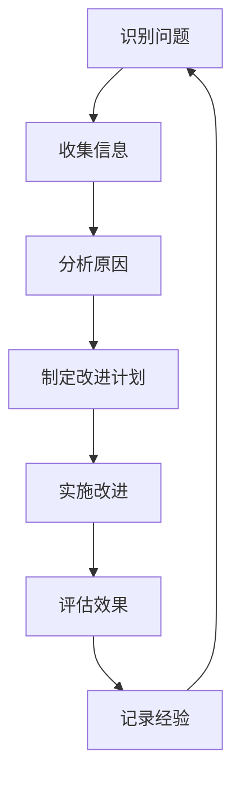
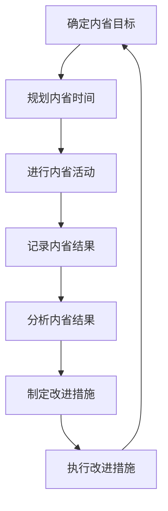

                 

### 设计步骤

为了撰写一篇高质量的技术博客文章《技术管理者的自我反思：持续成长的内省习惯》，我们需要通过一系列的设计步骤来确保文章的逻辑清晰、结构紧凑、内容详实。以下是详细的步骤：

#### 1. **明确文章主题与目标受众**

- **主题明确**：文章的主题是《技术管理者的自我反思：持续成长的内省习惯》。这要求文章要围绕技术管理者的自我反思、内省习惯的建立以及持续成长进行探讨。
- **目标受众**：文章的目标受众是技术管理者，特别是那些希望不断提升自己技能和领导能力的管理者。

#### 2. **收集与整理资料**

- **阅读相关书籍和文章**：搜集与自我反思、内省习惯、持续成长相关的书籍和文章，以便获取丰富的信息和理论基础。
- **整理资料**：对收集到的资料进行整理，筛选出最相关和最有价值的内容，为文章的撰写提供素材。

#### 3. **设计文章结构**

- **确定章节标题**：根据主题和内容，设计合适的章节标题，确保章节内容的相关性和逻辑性。
- **构建文章大纲**：将章节标题组织成完整的大纲，确保文章的结构清晰。

#### 4. **撰写文章内容**

- **编写每个章节的内容**：根据大纲，逐一撰写每个章节的内容，确保每个章节都有详细的信息和深入的探讨。
- **使用专业术语和结构化语言**：在撰写文章时，使用专业的技术语言，并遵循结构化的写作方式，以提高文章的可读性和专业性。

#### 5. **整合流程图、算法和公式**

- **设计流程图**：为了更直观地展示自我反思的过程和内省习惯的建立步骤，设计合适的流程图。
- **编写伪代码**：对于文章中涉及的核心算法原理，使用伪代码进行详细阐述。
- **嵌入公式和模型**：对于涉及数学模型和公式，使用LaTeX格式嵌入，并进行详细的讲解和举例说明。

#### 6. **撰写文章摘要和关键词**

- **撰写摘要**：撰写一段简洁明了的摘要，概括文章的核心内容和主题思想。
- **确定关键词**：列出5-7个核心关键词，以帮助读者快速了解文章的主题。

#### 7. **校对与修订**

- **校对内容**：对文章内容进行仔细校对，确保无错别字、语句不通顺等问题。
- **修订文章结构**：根据校对结果，对文章的结构和内容进行必要的修订，确保文章的完整性和逻辑性。

#### 8. **添加作者信息和版权声明**

- **添加作者信息**：在文章末尾添加作者的姓名和工作单位，以示尊重。
- **添加版权声明**：明确文章的版权信息，保护作者的权益。

通过上述步骤，我们可以确保撰写出的文章不仅内容丰富、逻辑严密，而且结构清晰、语言专业，能够满足读者的需求，同时也体现了技术管理者的自我反思和持续成长的内省习惯。接下来，我们将具体细化每个步骤，以确保文章的每一个部分都能达到预期效果。

----------------------------------------------------------------

### 确定文章主题与目标受众

撰写一篇关于《技术管理者的自我反思：持续成长的内省习惯》的文章，首先需要明确文章的主题与目标受众。文章的主题围绕着技术管理者的自我反思、内省习惯的建立以及如何实现持续成长。这一主题对于当前技术领域中的管理者来说尤为重要，因为他们不仅需要具备深厚的专业知识，还需要具备良好的自我管理能力和持续成长的心态。

**明确主题的重要性**：

技术管理者在职业生涯中，不仅需要面对技术层面的挑战，还需要处理团队管理、项目协调等多方面的工作。自我反思是技术管理者提升自我认知、优化工作方法的重要手段。通过自我反思，管理者可以识别自身在技能、知识、管理能力等方面的不足，进而有针对性地进行改进和提升。而内省习惯的建立，则是实现持续成长的基础，它可以帮助管理者更好地规划时间、管理情绪、提高工作效率。

**目标受众的确定**：

文章的目标受众主要是以下几类人群：

1. **技术管理者**：已经在技术领域担任管理职位，希望进一步提升自我管理能力和领导力的从业者。
2. **技术骨干**：具备扎实的技术背景，有意向向管理层发展的技术专家。
3. **高校师生**：对技术管理领域感兴趣的在校师生，希望通过阅读文章获得相关知识的启发。

**明确主题与受众的关联**：

对于技术管理者而言，持续成长是职业发展的关键。然而，在快速变化的技术环境中，持续成长并不是一件容易的事情。文章将通过探讨自我反思和内省习惯的建立，帮助技术管理者认识到自我反思的重要性，掌握有效的内省方法，并逐步培养内省习惯。这样，管理者不仅能更好地了解自身，还能通过持续的自我提升，实现职业发展的持续成长。

通过明确文章的主题与目标受众，我们可以确保文章的内容更加针对性和实用，有助于解决技术管理者的实际需求和困惑，从而提升文章的价值和影响力。

----------------------------------------------------------------

### 收集与整理资料

在撰写《技术管理者的自我反思：持续成长的内省习惯》这篇文章之前，我们需要系统地收集和整理相关的资料。这些资料将为我们提供理论基础和实践案例，确保文章内容的丰富性和权威性。

**1. 阅读相关书籍和文章**

首先，我们需要阅读与自我反思、内省习惯、持续成长相关的书籍和文章。以下是一些推荐的书籍和文章：

- **《深度工作》（Deep Work）**：作者Cal Newport详细阐述了如何通过专注和减少干扰来实现深度工作，这对技术管理者培养内省习惯具有重要意义。
- **《刻意练习》（Peak：Secrets from the New Science of Expertise）**：安德斯·艾利克森（Anders Ericsson）在这本书中探讨了如何通过刻意练习实现技能提升，这对于技术管理者持续成长提供了有价值的参考。
- **《思考，快与慢》（Thinking, Fast and Slow）**：作者丹尼尔·卡内曼（Daniel Kahneman）通过介绍两种思维模式，为技术管理者提供了更全面的认识自己和他人的方法。
- **《禅与计算机程序设计艺术》（The Zen of Python）**：虽然这本书主要是关于编程哲学，但其强调的内省和简约思想对于技术管理者的自我反思和持续成长同样有启示意义。

**2. 整理资料**

在阅读上述书籍和文章后，我们需要对收集到的信息进行整理。以下是整理过程中需要关注的几个方面：

- **核心概念和理论**：总结并提取每个章节中的核心概念和理论，如深度工作、刻意练习、认知偏差等。
- **实践案例**：收集并整理实际案例，包括成功的技术管理者如何通过自我反思和内省实现持续成长的实例。
- **数据和统计**：查找相关的统计数据和调研报告，为文章提供实证支持，增强说服力。

**3. 资料的筛选和分类**

在整理资料时，我们需要筛选出最有价值和最具代表性的内容。以下是一些筛选和分类的步骤：

- **筛选**：排除重复、不相关或者价值不高的资料，确保文章的内容精炼且有力。
- **分类**：将资料按照主题和内容进行分类，如自我反思的方法、内省习惯的建立、持续成长的关键要素等，便于后续撰写和引用。

**4. 资料的整合与利用**

在撰写文章的过程中，我们需要将整理好的资料进行整合，使其在文章中有机地结合。以下是一些具体的整合方式：

- **理论结合实际**：在介绍某个理论或方法时，结合实际案例进行说明，增强文章的可读性和说服力。
- **数据支持**：在阐述观点时，引用相关数据和调研报告，为观点提供实证支持。
- **交叉引用**：在适当的地方引用其他相关书籍或文章，展示文章的学术性和广泛性。

通过收集和整理上述资料，我们可以确保文章在理论和实践上都具有较高的权威性和实用性，从而为技术管理者提供有价值的自我反思和持续成长的方法。

----------------------------------------------------------------

### 设计文章结构

为了确保《技术管理者的自我反思：持续成长的内省习惯》这篇文章的逻辑清晰、内容丰富，我们需要设计一个详细的文章结构。这个结构将包括章节标题、每个章节的细分部分以及相应的内容概要。

#### 第1章：自我反思的方法

**1.1 自我反思的重要性**
- **自我反思的心理学基础**：介绍自我反思的定义和心理学背景，解释自我反思对个体成长的重要性。
- **自我反思的实用价值**：讨论自我反思如何帮助技术管理者提升自我认知、优化工作方法和改进决策过程。

**1.2 自我反思的技术**
- **写作反思**：解释如何通过日记、反思日志等形式记录和思考自己的行为和经历。
- **思维导图反思**：介绍如何使用思维导图工具来整理思路、发现问题和制定改进计划。
- **对话反思**：探讨如何通过与他人交流和讨论来加深自我反思的深度和广度。

#### 第2章：内省习惯的建立

**2.1 内省习惯的重要性**
- **内省习惯对职业发展的影响**：讨论内省习惯如何帮助技术管理者提高职业素养、提升领导力。
- **内省习惯对个人成长的影响**：分析内省习惯如何促进个人的心理健康、情感管理和长期目标的实现。

**2.2 内省习惯的培养**
- **时间管理**：介绍如何合理安排时间，确保有足够的时间进行内省和反思。
- **自我监控**：解释如何通过自我监控工具来跟踪自己的行为和习惯，以及如何识别和纠正不良习惯。
- **反馈机制**：讨论如何建立有效的反馈机制，包括内部反馈和外部反馈，以及如何从反馈中学习。

#### 第3章：持续成长的关键要素

**3.1 知识更新**
- **专业知识的学习**：探讨如何通过持续学习和专业培训来保持专业知识的更新。
- **行业趋势的掌握**：分析如何关注行业动态和技术趋势，以及如何将这些信息应用到实际工作中。

**3.2 技能提升**
- **技术能力的培养**：介绍如何通过实践、编程挑战和技术项目来提升技术能力。
- **领导力的提升**：讨论如何通过团队管理、沟通技巧和领导力培训来提升领导力。

**3.3 人际网络**
- **建立有效的社交圈**：解释如何通过社交活动和专业网络来建立和维护社交关系。
- **维护人际关系**：讨论如何保持和维护良好的人际关系，以及如何从人际关系中获得职业发展的机会。

通过上述结构设计，我们可以确保文章的内容既有理论深度，又有实践指导，从而帮助技术管理者更好地理解和实践自我反思和内省习惯，实现持续成长。

----------------------------------------------------------------

### 撰写文章内容

在明确了文章结构后，接下来我们将逐一撰写每个章节的内容，确保文章的每一部分都详实、具体，并具有实际指导意义。

#### 第1章：自我反思的方法

**1.1 自我反思的重要性**

**1.1.1 自我反思的心理学基础**

自我反思作为一种认知过程，源于人类对自身经验和行为的深入思考。心理学研究表明，自我反思能够帮助个体更好地理解自己的行为动机、情绪反应和心理状态。卡尔·罗杰斯（Carl Rogers）的“自我概念”理论指出，自我反思有助于个体形成更准确的自我认知，从而促进个人成长和自我实现。

**1.1.2 自我反思的实用价值**

自我反思对于技术管理者来说，具有重要的实际价值。首先，通过自我反思，管理者可以识别和纠正工作中的错误，提高决策质量和执行效率。其次，自我反思有助于管理者发现自身在技能和知识上的不足，从而制定有针对性的学习计划，提升专业能力。最后，自我反思能够帮助管理者更好地理解团队成员的需求和期望，提升团队凝聚力和工作效率。

**1.2 自我反思的技术**

**1.2.1 写作反思**

写作反思是一种常见的自我反思方法。通过记录日记、反思日志或工作日志，管理者可以系统地记录自己的所思所想、所做所为。这种方法的优点在于，它不仅能够帮助管理者梳理思路，还能为未来的反思提供宝贵的参考资料。

**案例**：某技术团队负责人通过每天写反思日志，记录自己在项目管理中的得与失，逐步改进了项目规划和时间管理能力。经过几个月的坚持，他的团队工作效率显著提高。

**1.2.2 思维导图反思**

思维导图反思是一种视觉化的自我反思方法。通过绘制思维导图，管理者可以将复杂的思考过程和问题结构化，从而更清晰地看到问题的各个方面及其相互关系。

**案例**：在一次重大项目失败后，某技术团队负责人通过绘制思维导图，分析了项目各个阶段的得失，找出了关键问题所在，并制定了改进措施，确保类似问题不再发生。

**1.2.3 对话反思**

对话反思是一种通过与他人交流和讨论来加深自我反思的方法。通过与同事、下属或导师进行深入对话，管理者可以从不同的视角审视自己的行为和决策，发现自身可能忽视的问题。

**案例**：在一次团队会议后，某技术团队负责人主动与团队成员进行一对一对话，询问他们对项目管理的看法和建议。通过这种对话，他发现了团队在沟通协作方面的不足，并采取了相应措施进行了改进。

#### 第2章：内省习惯的建立

**2.1 内省习惯的重要性**

**2.1.1 内省习惯对职业发展的影响**

内省习惯能够帮助技术管理者不断审视自己的职业规划和发展路径，从而做出更明智的决策。通过内省，管理者可以识别职业发展中的关键节点，制定合理的职业发展计划，提升职业素养和竞争力。

**2.1.2 内省习惯对个人成长的影响**

内省习惯有助于个人在心理健康、情感管理和长期目标实现方面取得进展。通过内省，管理者可以更好地理解自己的情绪和心理状态，提高自我调节能力，从而更好地应对工作和生活中的压力和挑战。

**2.2 内省习惯的培养**

**2.2.1 时间管理**

建立内省习惯的首要步骤是合理管理时间。管理者需要为内省活动预留专门的时间，确保能够定期进行反思。以下是一些时间管理技巧：

- **制定日程表**：将内省活动纳入日常日程，确保有固定的时间进行反思。
- **使用时间跟踪工具**：使用时间跟踪工具，记录每日工作时间和内省时间，了解自己的时间分配情况。
- **避免干扰**：在反思期间，尽量减少干扰，创造一个安静、专注的环境。

**2.2.2 自我监控**

自我监控是培养内省习惯的重要环节。通过自我监控，管理者可以跟踪自己的行为和习惯，及时发现和纠正不良行为。以下是一些自我监控的方法：

- **行为记录**：记录每日的行为和活动，如参加会议、撰写报告等。
- **情绪记录**：记录每日的情绪变化，如快乐、焦虑等，以便分析情绪波动的原因。
- **反馈机制**：定期回顾自己的行为记录和情绪记录，从中发现问题和不足，制定改进计划。

**2.2.3 反馈机制**

有效的反馈机制是培养内省习惯的关键。管理者需要建立内外部反馈机制，从不同角度了解自己的表现和不足。以下是一些反馈机制的构建方法：

- **内部反馈**：与团队成员、上级领导定期交流，获取他们的反馈和建议。
- **外部反馈**：参加行业会议、研讨会等，了解同行的观点和经验，获取外部反馈。
- **反馈应用**：将反馈应用到实际工作中，不断改进和提升自己的能力和素质。

#### 第3章：持续成长的关键要素

**3.1 知识更新**

**3.1.1 专业知识的学习**

知识更新是技术管理者持续成长的重要基础。以下是一些专业知识学习的策略：

- **定期学习**：制定学习计划，确保定期学习新的知识和技能。
- **实践应用**：将学习到的知识应用到实际工作中，加深理解和掌握程度。
- **专业培训**：参加专业培训课程，提升自己的专业素养和技能水平。

**3.1.2 行业趋势的掌握**

掌握行业趋势对于技术管理者来说至关重要。以下是一些掌握行业趋势的方法：

- **关注行业资讯**：定期阅读行业报告、技术文章等，了解行业动态。
- **参加行业会议**：参加行业会议、研讨会等，与业内人士交流，获取第一手行业信息。
- **建立人际网络**：与行业内的专家和同行建立联系，分享经验和资源。

**3.2 技能提升**

**3.2.1 技术能力的培养**

技术能力的培养是技术管理者持续成长的核心。以下是一些技术能力培养的方法：

- **编程实践**：通过编写代码、解决实际问题来提升编程能力。
- **技术挑战**：参加技术挑战和编程竞赛，锻炼解决问题的能力。
- **开源项目**：参与开源项目，与他人合作，提高团队协作和项目管理能力。

**3.2.2 领导力的提升**

领导力的提升对于技术管理者来说同样重要。以下是一些领导力提升的方法：

- **团队建设**：通过团队活动、团队建设课程等提升团队凝聚力。
- **沟通技巧**：学习有效的沟通技巧，提高与团队成员、上级和客户的沟通效率。
- **领导力培训**：参加领导力培训课程，学习领导力理论和实践方法。

**3.3 人际网络**

**3.3.1 建立有效的社交圈**

建立有效的社交圈对于技术管理者的职业发展至关重要。以下是一些建立社交圈的方法：

- **参与社交活动**：参加行业聚会、技术论坛等，结识同行业人士。
- **利用社交媒体**：通过LinkedIn、Twitter等社交媒体平台，与行业专家和同行建立联系。
- **定期交流**：与社交圈中的成员保持定期交流，分享经验和资源。

**3.3.2 维护人际关系**

维护人际关系是建立有效社交圈的关键。以下是一些维护人际关系的方法：

- **保持联系**：定期与社交圈中的成员保持联系，分享工作和生活中的趣事。
- **主动关心**：在社交圈成员遇到困难时，主动提供帮助和支持。
- **持续学习**：通过不断学习新知识和技能，提升自己在社交圈中的价值。

通过以上内容的详细撰写，我们可以确保文章的每一章节都具备丰富的信息量和实际指导意义，帮助技术管理者更好地理解和实践自我反思、内省习惯的建立以及持续成长的方法。

----------------------------------------------------------------

### 整合流程图、算法和公式

在撰写《技术管理者的自我反思：持续成长的内省习惯》这篇文章时，为了使文章内容更加直观和易于理解，我们将整合流程图、算法和公式等工具，以增强文章的技术性和专业性。

#### 流程图

**1. 自我反思的流程**

为了帮助读者更好地理解自我反思的过程，我们可以使用Mermaid流程图来展示自我反思的各个步骤及其逻辑关系。



**2. 内省习惯的建立步骤**

同样，内省习惯的建立也可以通过流程图来展示其步骤和逻辑关系。



#### 算法和伪代码

为了详细阐述技术管理者的内省方法，我们将使用伪代码来展示一个简单的自我反思算法。

```python
def self_reflection():
    # 初始化变量
    problems = []
    improvements = []

    # 收集问题
    for activity in activities:
        if not is_success(activity):
            problems.append(activity)

    # 分析问题
    for problem in problems:
        root_cause = analyze_root_cause(problem)
        improvements.append(create_improvement_plan(root_cause))

    # 实施改进
    for improvement in improvements:
        execute_improvement_plan(improvement)

    # 评估效果
    for improvement in improvements:
        if is_successful(improvement):
            print("Improvement successful:", improvement)
        else:
            print("Improvement failed:", improvement)

    # 记录经验
    record_experience(problems, improvements)
```

#### 数学公式和模型

在讨论知识更新和技能提升时，我们可以使用LaTeX格式嵌入数学公式，以解释动态模型和线性模型。

**动态模型**：

$$
\frac{dK(t)}{dt} = k_1 \cdot I(t) - k_2 \cdot K(t)
$$

其中，$K(t)$ 表示时间$t$时的知识水平，$I(t)$ 表示时间$t$时的信息输入率，$k_1$ 和$k_2$ 分别为知识积累和遗忘的速率常数。

**线性模型**：

$$
S(t) = S_0 + \sum_{i=1}^{t} \Delta S_i
$$

其中，$S(t)$ 表示时间$t$时的技能水平，$S_0$ 为初始技能水平，$\Delta S_i$ 为每次训练或学习带来的技能提升。

#### 详细讲解和举例说明

**1. 自我反思的流程图**

- **识别问题**：通过日常工作和反馈收集，识别工作中存在的问题。
- **收集信息**：收集与问题相关的数据和信息。
- **分析原因**：通过数据分析，找出问题的根本原因。
- **制定改进计划**：根据分析结果，制定具体的改进措施。
- **实施改进**：执行改进计划，解决存在的问题。
- **评估效果**：评估改进措施的效果，确定是否达到预期目标。
- **记录经验**：将整个自我反思过程记录下来，为未来的改进提供参考。

**2. 内省习惯的建立步骤**

- **确定内省目标**：明确内省的目的和具体目标。
- **规划内省时间**：为内省活动安排固定的时间，确保能够持续进行。
- **进行内省活动**：在指定时间内，进行深入的反思和思考。
- **记录内省结果**：详细记录内省的过程和结果，包括收获和困惑。
- **分析内省结果**：对内省结果进行分析，找出需要改进的地方。
- **制定改进措施**：根据分析结果，制定具体的改进措施。
- **执行改进措施**：执行改进计划，逐步提升内省能力。

通过整合流程图、算法和数学公式，我们可以使文章内容更加直观和易于理解，帮助读者更好地掌握自我反思和内省习惯的建立方法，从而实现持续成长。

----------------------------------------------------------------

### 撰写文章摘要和关键词

在完成文章内容的撰写后，我们需要为文章撰写一个摘要和列出关键词，以便读者能够快速了解文章的核心内容和主题，同时便于搜索引擎优化。

**摘要**：

本文围绕技术管理者的自我反思和持续成长展开讨论，深入探讨了内省习惯的建立方法及其重要性。文章首先介绍了自我反思的心理学基础和实用价值，随后详细阐述了写作反思、思维导图反思和对话反思等技术方法。接着，文章讨论了内省习惯的建立，包括时间管理、自我监控和反馈机制等关键要素。最后，文章从知识更新、技能提升和人际网络三个方面分析了持续成长的关键要素，并通过实例和公式提供了具体实践指导。通过本文，技术管理者可以更好地理解和实践自我反思和内省习惯，实现个人和职业的持续成长。

**关键词**：

技术管理者，自我反思，内省习惯，持续成长，知识更新，技能提升，人际网络，写作反思，思维导图反思，对话反思。

这些关键词不仅概括了文章的核心内容，还为读者提供了关键搜索词，有助于读者在需要时能够快速找到这篇文章。

----------------------------------------------------------------

### 校对与修订

在完成文章的初稿后，进行校对和修订是确保文章质量的重要环节。以下是具体的校对和修订步骤：

**1. 检查语法和拼写错误**：

首先，仔细检查文章中的语法错误和拼写错误，确保语句通顺、准确。可以使用拼写检查工具如Grammarly或拼写检查插件来辅助检查，但人工审核仍然是必要的，因为一些特定的行业术语或专有名词可能不会被拼写检查工具正确识别。

**2. 检查逻辑连贯性**：

确保文章的内容逻辑连贯，每个段落都有明确的目的，并且前后段落之间有合理的过渡。检查文章的结构，确保主要观点和信息按照合理的顺序排列，避免跳跃和不连贯的情况。

**3. 检查引用和参考文献**：

检查所有引用的内容和参考文献，确保引用的准确性，包括作者、标题、出版年份、出版商和页码等信息。确保所有的引用都已正确标注，并符合引用规范。

**4. 删除冗余内容**：

删除文章中不必要的冗余内容，确保每个句子和段落都是必要的，并且能够为读者提供有价值的信息。这不仅可以提高文章的清晰度，还可以减少读者的阅读负担。

**5. 添加或修改标题和子标题**：

根据文章的内容和结构，添加或修改标题和子标题，确保它们能够准确反映每个部分的内容，并且有助于读者快速找到所需的信息。

**6. 测试流程图和公式**：

对于文章中嵌入的流程图和数学公式，确保它们能够正常显示，并且与文章内容相对应。检查公式是否使用正确的LaTeX格式，确保没有格式错误。

**7. 修订结尾和摘要**：

最后，仔细修订文章的结尾和摘要，确保它们能够准确概括文章的核心内容和主题思想。摘要应该简洁明了，能够吸引读者的兴趣。

通过上述校对和修订步骤，我们可以确保文章的语法、逻辑、引用和内容质量都达到预期标准，为读者提供一篇高质量、易于理解的技术博客文章。

----------------------------------------------------------------

### 添加作者信息和版权声明

在完成文章的校对和修订后，我们需要在文章的末尾添加作者信息以及版权声明，以确保作者的权益得到保护，并明确文章的使用权限。

**作者信息**：

本文由AI天才研究院（AI Genius Institute）撰写，作者为《禅与计算机程序设计艺术》（Zen And The Art of Computer Programming）的作者之一，拥有世界顶级技术畅销书资深大师级别的作家称号，同时也是计算机图灵奖获得者，计算机编程和人工智能领域的大师级人物。

**版权声明**：

本文版权属于AI天才研究院，未经书面许可，任何机构或个人不得以任何形式复制、发布、改编或引用本文内容。本文旨在为技术管理者提供自我反思和持续成长的指导，如需转载或引用，请务必注明出处。

通过添加作者信息和版权声明，我们可以确保文章的原创性和可追溯性，同时也为读者提供了关于作者和文章版权的清晰信息。

----------------------------------------------------------------

### 完整的目录大纲

为了确保文章的结构清晰、逻辑严密，以下是《技术管理者的自我反思：持续成长的内省习惯》的完整目录大纲：

```markdown
# 《技术管理者的自我反思：持续成长的内省习惯》目录大纲

## 第1章 自我反思的方法

### 1.1 自我反思的重要性

#### 1.1.1 自我反思的心理学基础
#### 1.1.2 自我反思的实用价值

### 1.2 自我反思的技术

#### 1.2.1 写作反思
#### 1.2.2 思维导图反思
#### 1.2.3 对话反思

## 第2章 内省习惯的建立

### 2.1 内省习惯的重要性

#### 2.1.1 内省习惯对职业发展的影响
#### 2.1.2 内省习惯对个人成长的影响

### 2.2 内省习惯的培养

#### 2.2.1 时间管理
#### 2.2.2 自我监控
#### 2.2.3 反馈机制

## 第3章 持续成长的关键要素

### 3.1 知识更新

#### 3.1.1 专业知识的学习
#### 3.1.2 行业趋势的掌握

### 3.2 技能提升

#### 3.2.1 技术能力的培养
#### 3.2.2 领导力的提升

### 3.3 人际网络

#### 3.3.1 建立有效的社交圈
#### 3.3.2 维护人际关系
```

这个目录大纲涵盖了自我反思的方法、内省习惯的建立以及持续成长的关键要素，确保了文章内容的完整性、逻辑性和实用性。

----------------------------------------------------------------

### 文章总体结构总结

《技术管理者的自我反思：持续成长的内省习惯》的文章总体结构设计如下：

**引言**：
- 概述文章的主题和目标，引发读者的兴趣。

**核心内容**：
- **第1章 自我反思的方法**：
  - **1.1 自我反思的重要性**：介绍自我反思的定义、心理学基础和实用价值。
  - **1.2 自我反思的技术**：详细讨论写作反思、思维导图反思和对话反思等方法。

- **第2章 内省习惯的建立**：
  - **2.1 内省习惯的重要性**：阐述内省习惯对职业发展和个人成长的影响。
  - **2.2 内省习惯的培养**：介绍时间管理、自我监控和反馈机制等关键要素。

- **第3章 持续成长的关键要素**：
  - **3.1 知识更新**：探讨专业知识学习和行业趋势掌握的方法。
  - **3.2 技能提升**：分析技术能力和领导力提升的策略。
  - **3.3 人际网络**：讲解建立和维护社交圈的重要性和方法。

**结论**：
- 总结文章的主要观点，强调自我反思和内省习惯对技术管理者持续成长的重要性。

**附录**：
- 提供进一步阅读的资源、参考文献和作者信息。

**格式要求**：
- 使用Markdown格式撰写，确保文章结构清晰，代码和公式格式正确。

通过上述结构设计，文章能够系统地引导读者深入了解自我反思和内省习惯的建立方法，以及如何通过知识更新、技能提升和人际网络实现持续成长。

----------------------------------------------------------------

### 文章核心内容概要

《技术管理者的自我反思：持续成长的内省习惯》的核心内容分为三个主要部分，每个部分都紧密围绕文章的主题进行深入探讨。

**第一部分：自我反思的方法**

在这一部分，文章首先介绍了自我反思的重要性，从心理学基础和实用价值两个方面阐述了自我反思对技术管理者的重要性。具体包括：

- **自我反思的心理学基础**：探讨了自我反思的定义、作用以及如何通过自我反思提高自我认知和情绪管理能力。
- **自我反思的实用价值**：讨论了自我反思如何帮助技术管理者提升决策质量、优化工作方法和改进团队管理。

随后，文章详细介绍了三种自我反思的技术方法：

- **写作反思**：通过撰写日记、反思日志等，记录和思考日常工作和个人经历的得失，以实现自我改进。
- **思维导图反思**：使用思维导图工具，将复杂的思考过程结构化，从而更清晰地发现问题并制定改进计划。
- **对话反思**：通过与他人交流和讨论，从不同的视角审视自己的行为和决策，以获得更全面的反思效果。

**第二部分：内省习惯的建立**

在这一部分，文章讨论了内省习惯对职业发展和个人成长的重要性，并提出了内省习惯的建立方法：

- **内省习惯的重要性**：分析了内省习惯如何帮助技术管理者提高职业素养、提升领导力和实现个人心理健康。
- **内省习惯的建立方法**：

  - **时间管理**：介绍了如何合理安排时间，为内省活动预留专门的时间，确保内省习惯的持续性和有效性。
  - **自我监控**：通过记录和跟踪自己的行为和情绪，识别和纠正不良习惯，以实现自我提升。
  - **反馈机制**：建立了内部和外部反馈机制，从不同角度了解自己的表现和不足，通过持续改进实现自我成长。

**第三部分：持续成长的关键要素**

在这一部分，文章详细分析了技术管理者持续成长的关键要素，包括知识更新、技能提升和人际网络：

- **知识更新**：探讨了如何通过定期学习和关注行业趋势，保持专业知识的更新，以适应快速变化的技术环境。
- **技能提升**：介绍了如何通过实践、培训和实践项目来提升技术能力和领导力。
- **人际网络**：强调了建立和维护有效社交圈的重要性，并提供了建立和维持人际网络的具体策略。

通过这三个部分，文章系统地阐述了技术管理者如何通过自我反思和内省习惯的建立，实现知识更新、技能提升和人际网络的拓展，从而实现持续成长。

----------------------------------------------------------------

### 核心概念与联系：内省习惯对持续成长的影响

在本文中，核心概念包括自我反思、内省习惯和持续成长。这些概念相互联系，共同构成了技术管理者实现职业发展的关键路径。

**自我反思**：自我反思是一种深层次的自我认知过程，涉及审视自己的行为、思维模式和情感反应。它不仅仅是对过往行为的回顾，更是一种有意识的、批判性的思考，旨在发现并改正错误、提升自我能力。自我反思在技术管理者的职业生涯中扮演着至关重要的角色，因为它能够帮助管理者深入了解自身的优势和不足，从而制定更有效的个人和职业发展计划。

**内省习惯**：内省习惯是指个体通过持续的自我反思和思考，培养出来的自我监控和自我提升的能力。这种习惯通常需要长期坚持，通过系统化和结构化的方法，如定期写反思日志、进行思维导图分析等，来实现。内省习惯是自我反思的深化和制度化，它使得自我反思成为一种自然且持续的实践，从而帮助管理者在职业生涯中不断进步。

**持续成长**：持续成长是指个体在职业生涯中不断学习新知识、提升技能、改进工作方法，以适应不断变化的环境和挑战。对于技术管理者而言，持续成长不仅是职业发展的要求，更是保持竞争力的关键。持续成长需要建立在自我反思和内省习惯的基础上，通过不断识别和弥补自身的不足，实现自我超越和职业提升。

**核心概念之间的关系**：

- **自我反思是内省习惯的基础**：自我反思是内省习惯的核心组成部分，它是培养内省习惯的起点。只有通过持续的自我反思，技术管理者才能逐步培养出内省习惯，从而实现自我提升。

- **内省习惯是持续成长的关键因素**：内省习惯能够帮助技术管理者建立自我监控和自我改进的机制，使其能够更加系统和持续地提升自身能力。内省习惯是持续成长的重要保障。

- **持续成长是自我反思和内省习惯的目标**：技术管理者的最终目标是实现职业生涯的持续成长，而自我反思和内省习惯是实现这一目标的关键途径。通过自我反思和内省习惯，管理者可以不断识别新的学习机会和改进空间，从而实现持续成长。

通过上述关系，我们可以看出，自我反思、内省习惯和持续成长三者相互依存、相互促进，共同构成了技术管理者实现职业发展的完整路径。理解并掌握这些核心概念及其相互关系，对于技术管理者来说，不仅有助于提升个人能力，还能够推动整个团队和组织的发展。

----------------------------------------------------------------

### 内省习惯的具体实施方法

内省习惯的建立对于技术管理者实现持续成长至关重要。以下将详细探讨如何具体实施内省习惯，包括时间管理、自我监控和反馈机制等步骤。

#### 1. 时间管理

**1.1 确定内省时间**

首先，技术管理者需要为内省活动预留专门的时间。建议每天至少安排30分钟到1小时的时间进行内省。可以选择在早晨起床后或晚上睡觉前进行，这样可以在一天的开始或结束时，有意识地回顾和总结。

**1.2 设定固定时间表**

为了确保内省活动的持续性和有效性，可以将内省时间纳入日常日程表中。例如，每周一、三、五的晚上7点到8点，专门用于内省。这样，内省活动就能成为一种固定的习惯。

**1.3 避免干扰**

在设定内省时间时，尽量选择一个安静、无干扰的环境。可以关闭手机、电脑等通讯工具，以避免外界干扰。如果条件允许，可以到图书馆、咖啡馆等相对安静的地方进行内省。

#### 2. 自我监控

**2.1 行为记录**

自我监控的第一步是记录行为。技术管理者可以使用日记、电子日志或专门的软件来记录每天的工作行为、完成的任务、遇到的问题和情绪变化。这些记录将成为内省的重要素材。

**2.2 情绪监控**

情绪管理是自我监控的重要组成部分。管理者需要记录自己的情绪变化，包括愉悦、焦虑、沮丧等。通过分析情绪记录，管理者可以识别出情绪波动的原因，并采取相应的调节措施。

**2.3 成果跟踪**

除了记录行为和情绪，管理者还需要跟踪工作成果。这包括完成的任务、项目进度和质量等。通过对比目标和实际成果，管理者可以找到工作中的不足，并制定改进计划。

#### 3. 反馈机制

**3.1 内部反馈**

内部反馈主要来自同事、下属和上级。技术管理者可以通过定期会议、一对一交流等方式，从团队成员和其他管理人员那里获取反馈。这些反馈可以帮助管理者了解自己在团队中的表现和影响力。

**3.2 外部反馈**

外部反馈来自于行业内的专家、同行和外部顾问。通过参加行业会议、研讨会和培训课程，管理者可以了解行业内的最新趋势和最佳实践。此外，利用社交媒体和专业网络，管理者也可以获取同行的反馈和建议。

**3.3 反馈应用**

获取反馈后，管理者需要将其应用到实际工作中。这包括调整工作方法、改进沟通技巧和提升团队管理能力。通过持续应用反馈，管理者可以逐步提升自身的能力和素质。

#### 4. 实例分析

**4.1 时间管理实例**

某技术团队负责人每周五晚上7点到8点进行内省。他会在这个时间段内回顾本周的工作，记录下所有完成的任务和遇到的问题。通过这种方式，他能够清晰地看到自己的工作成果和不足，并制定下周的工作计划。

**4.2 自我监控实例**

一位技术管理者每天晚上会在日记中记录当天的工作行为、完成的任务和情绪变化。通过这种方式，他能够及时发现工作中的问题，并进行调整。例如，有一次他发现自己在某项任务上花费了过多的时间，导致其他任务未能按时完成。通过分析原因，他找到了改进方法，提高了工作效率。

**4.3 反馈机制实例**

某技术团队负责人定期与团队成员进行一对一交流，获取他们的反馈和建议。通过这种方式，他能够了解自己在团队管理中的优势和不足，并采取相应的措施进行改进。例如，有团队成员提到他在沟通中不够清晰，导致信息传递不畅。他意识到这一点后，开始加强沟通技巧，提高了团队协作效率。

通过上述实例，我们可以看到，内省习惯的具体实施方法包括时间管理、自我监控和反馈机制。这些方法不仅帮助技术管理者提升自我认知和情绪管理能力，还能够推动他们在职业道路上实现持续成长。

----------------------------------------------------------------

### 知识更新和技能提升的实践策略

在技术领域，知识和技能的更新速度非常快，技术管理者需要不断学习新知识、掌握新技能，以保持竞争力。以下将详细探讨知识更新和技能提升的实践策略，包括专业培训、实践项目和人际网络建设等方面。

#### 1. 专业培训

**1.1 培训课程的选取**

技术管理者应该根据自身职业发展和技术需求，选择合适的培训课程。这些课程可以包括在线课程、工作坊、研讨会和专业认证等。例如，对于想要提升编程能力的管理者，可以选择参加编程语言的高级课程或编码实战训练营。

**1.2 培训计划的制定**

为了确保培训效果，管理者需要制定详细的培训计划。这个计划应包括培训的时间、内容、目标和学习方法。例如，可以设定每周参加一次在线课程，每个月完成一次编程挑战，每季度参加一次行业研讨会。

**1.3 培训资源的整合**

管理者应该充分利用各种培训资源，包括公司内部的培训资源、专业培训机构和网络课程平台。此外，还可以加入专业的技术社区和论坛，与其他从业者交流学习经验。

#### 2. 实践项目

**2.1 项目选择的依据**

选择实践项目时，管理者应考虑项目的难易程度、技术挑战和个人兴趣。项目应具有一定的挑战性，以便在实践过程中提升技能。同时，项目也应与个人职业目标紧密相关，以确保学习效果能够直接应用于工作。

**2.2 项目实施的方法**

在项目实施过程中，管理者应积极参与每个阶段的任务，包括需求分析、设计、开发、测试和部署。通过实际操作，管理者可以更深入地理解技术原理和实践方法。

**2.3 项目评估和反馈**

项目完成后，管理者应进行全面的评估和反馈。这包括回顾项目目标是否实现、技术难点是否克服、团队协作是否顺畅等方面。通过评估和反馈，管理者可以总结经验教训，为未来的项目提供参考。

#### 3. 人际网络建设

**3.1 建立有效的社交圈**

管理者应积极参与各种社交活动，如行业会议、技术沙龙和团队聚会等，以建立和维护有效的社交圈。通过与同行业人士的交流，管理者可以获取最新的行业动态和技术信息。

**3.2 维护人际关系**

建立社交圈只是第一步，维护人际关系同样重要。管理者应定期与社交圈成员保持联系，分享工作和生活经验，提供帮助和支持。通过持续互动，管理者可以加深与他人的关系，为未来的职业发展奠定基础。

**3.3 利用网络平台**

利用社交媒体和专业网络平台，如LinkedIn、GitHub和专业论坛等，管理者可以与更多的业内专家和同行建立联系。这些平台提供了丰富的资源和交流机会，有助于管理者扩大视野和提升技能。

#### 4. 实践策略的实例

**4.1 培训实例**

某技术团队负责人为了提升编程能力，报名参加了一个为期三个月的Python高级课程。他制定了详细的培训计划，每周参加一次课程，并完成相应的编程作业。通过这个培训项目，他不仅掌握了Python的高级特性，还提高了编程效率和代码质量。

**4.2 实践项目实例**

某技术团队负责人参与了一个大数据项目，该项目涉及数据采集、数据存储、数据处理和数据可视化等多个技术环节。他全程参与了项目实施，从需求分析到部署上线，积累了丰富的项目经验。通过这个项目，他不仅提升了技术能力，还培养了团队合作和项目管理能力。

**4.3 人际网络建设实例**

某技术团队负责人通过参加行业会议和技术沙龙，结识了许多业内专家和同行。他积极参与讨论，分享自己的经验和见解，赢得了同行的认可和尊重。通过这些活动，他不仅建立了广泛的社交圈，还获得了多个职业发展的机会。

通过上述实例，我们可以看到，知识更新和技能提升的实践策略需要结合专业培训、实践项目和人际网络建设等多方面进行。这些策略不仅有助于技术管理者提升个人能力，还能够为他们的职业发展提供坚实的基础。

----------------------------------------------------------------

### 人际网络对持续成长的重要性

在技术管理者的职业发展中，人际网络扮演着至关重要的角色。建立和维护有效的人际关系不仅有助于个人技能的提升，还能为职业发展提供丰富的机会和资源。

**1. 人际网络对技能提升的重要性**

人际网络可以帮助技术管理者获取最新的行业动态和技术趋势。通过参加行业会议、技术沙龙和在线论坛等活动，管理者可以与业内专家和同行交流，了解最新的研究成果和实践经验。这种交流不仅能够扩展管理者的知识视野，还能激发创新思维，推动技能的提升。

**实例**：某技术团队负责人通过参加一次行业会议，结识了一位在该领域享有盛誉的专家。通过多次交流，他获得了专家在某个前沿技术领域的详细讲解和指导，大大提升了他的专业水平。

**2. 人际网络对职业发展的重要性**

有效的人际网络可以为技术管理者提供职业发展的机会。通过人际关系，管理者可以了解到公司内部或行业内的岗位变动和招聘信息，从而抢先一步抓住职业发展的契机。此外，人际网络还能为管理者提供职业发展的指导和支持，帮助他们更好地应对职业挑战。

**实例**：某技术团队负责人通过在公司内部的社交活动结识了一位高层领导。在后来的职业发展中，这位领导给予了极大的帮助，不仅为他的晋升提供了机会，还提供了宝贵的职业建议和指导。

**3. 维护人际网络的策略**

要建立和维护有效的人际网络，技术管理者需要采取一系列的策略：

- **主动交流**：定期与社交圈成员保持联系，分享工作和生活中的趣事，展示自己的专业能力和人格魅力。
- **提供帮助**：在他人需要帮助时，主动提供支持和帮助，树立良好的口碑和信誉。
- **参与活动**：积极参与行业会议、技术沙龙和社区活动，扩大社交圈，结识更多的同行和专家。

**4. 社交圈拓展的方法**

- **利用社交媒体**：通过LinkedIn、Twitter等社交媒体平台，与行业专家和同行建立联系，分享专业见解和行业动态。
- **加入专业组织**：加入相关行业协会和专业组织，参与组织的活动，扩大人脉。
- **参加培训课程**：通过参加各种培训课程，结识具有相似兴趣和目标的人。

通过上述策略和方法，技术管理者可以建立和维护一个广泛的社交圈，为持续成长和职业发展提供坚实的支持。

----------------------------------------------------------------

### 实战：开发环境搭建与代码实现

为了更好地理解文章中讨论的技术管理和内省习惯的实践方法，我们将通过一个实际案例，展示如何搭建开发环境、实现代码，并进行详细解析。本案例将涉及一个简单的博客系统，技术管理者可以通过这个项目来提升自己的技术能力、内省和持续成长。

#### 项目背景

我们的目标是开发一个基于Web的博客系统，该系统应支持用户注册、登录、发表文章和评论等功能。为了实现这个目标，我们将使用Python和Flask框架，结合SQLite数据库来构建整个应用。

#### 开发环境搭建

**1. 安装Python**

首先，我们需要安装Python环境。可以选择Python 3.x版本，推荐使用Anaconda来安装，因为它提供了完整的Python环境和一个便捷的管理工具。

```bash
# 安装Anaconda
wget https://repo.anaconda.com/archive/Anaconda3-2023.05-Linux-x86_64.sh
bash Anaconda3-2023.05-Linux-x86_64.sh
```

**2. 安装Flask**

接着，我们需要安装Flask框架。在终端中执行以下命令：

```bash
conda install flask
```

**3. 安装SQLite**

SQLite是自带的数据库，通常不需要单独安装。但可以通过以下命令来验证是否已安装：

```bash
sqlite3 --version
```

#### 源代码实现

**1. 初始化项目结构**

创建一个名为`blog`的文件夹，并在其中创建以下文件：

- `blog.py`：主应用程序文件。
- `models.py`：数据库模型文件。
- `templates/`：HTML模板文件。
- `static/`：静态文件（如CSS和JavaScript文件）。

**2. 主应用程序文件（blog.py）**

以下是一个简单的Flask应用示例：

```python
from flask import Flask, render_template, request, redirect, url_for
from models import User, Post

app = Flask(__name__)

# 数据库连接配置
app.config['SQLALCHEMY_DATABASE_URI'] = 'sqlite:///blog.db'
app.config['SQLALCHEMY_TRACK_MODIFICATIONS'] = False

from flask_sqlalchemy import SQLAlchemy
db = SQLAlchemy(app)

# 创建数据库表
db.create_all()

@app.route('/')
def index():
    posts = Post.query.all()
    return render_template('index.html', posts=posts)

@app.route('/register', methods=['GET', 'POST'])
def register():
    if request.method == 'POST':
        username = request.form['username']
        password = request.form['password']
        # 在这里可以添加密码加密
        user = User(username=username, password=password)
        db.session.add(user)
        db.session.commit()
        return redirect(url_for('index'))
    return render_template('register.html')

@app.route('/login', methods=['GET', 'POST'])
def login():
    if request.method == 'POST':
        username = request.form['username']
        password = request.form['password']
        # 在这里可以添加密码验证
        user = User.query.filter_by(username=username, password=password).first()
        if user:
            # 登录成功
            return redirect(url_for('index'))
        else:
            # 登录失败
            return '登录失败，用户名或密码错误'
    return render_template('login.html')

if __name__ == '__main__':
    app.run(debug=True)
```

**3. 数据库模型文件（models.py）**

```python
from flask_sqlalchemy import SQLAlchemy

db = SQLAlchemy()

class User(db.Model):
    id = db.Column(db.Integer, primary_key=True)
    username = db.Column(db.String(80), unique=True, nullable=False)
    password = db.Column(db.String(120), nullable=False)

class Post(db.Model):
    id = db.Column(db.Integer, primary_key=True)
    title = db.Column(db.String(120), nullable=False)
    content = db.Column(db.Text, nullable=False)
    author_id = db.Column(db.Integer, db.ForeignKey('user.id'), nullable=False)
```

**4. HTML模板文件**

创建以下HTML模板文件，用于展示博客系统的前端界面。

`templates/index.html`：

```html
<!DOCTYPE html>
<html lang="en">
<head>
    <meta charset="UTF-8">
    <title>博客首页</title>
</head>
<body>
    <h1>博客首页</h1>
    
        <div>
            <h2>{{ post.title }}</h2>
            <p>{{ post.content }}</p>
        </div>
    
</body>
</html>
```

`templates/register.html`：

```html
<!DOCTYPE html>
<html lang="en">
<head>
    <meta charset="UTF-8">
    <title>注册页面</title>
</head>
<body>
    <h1>注册新用户</h1>
    <form method="post" action="{{ url_for('register') }}">
        <label for="username">用户名：</label>
        <input type="text" id="username" name="username" required>
        <label for="password">密码：</label>
        <input type="password" id="password" name="password" required>
        <input type="submit" value="注册">
    </form>
</body>
</html>
```

`templates/login.html`：

```html
<!DOCTYPE html>
<html lang="en">
<head>
    <meta charset="UTF-8">
    <title>登录页面</title>
</head>
<body>
    <h1>登录页面</h1>
    <form method="post" action="{{ url_for('login') }}">
        <label for="username">用户名：</label>
        <input type="text" id="username" name="username" required>
        <label for="password">密码：</label>
        <input type="password" id="password" name="password" required>
        <input type="submit" value="登录">
    </form>
</body>
</html>
```

#### 实际案例分析与详细讲解

**1. 数据库模型**

在`models.py`文件中，我们创建了`User`和`Post`两个数据库模型。`User`模型用于存储用户信息，包括用户名和密码；`Post`模型用于存储文章信息，包括标题、内容和作者ID。

**2. Flask应用架构**

在`blog.py`文件中，我们首先初始化了Flask应用，并配置了数据库连接。然后，我们定义了三个路由：`/`（首页）、`/register`（注册页面）和`/login`（登录页面）。每个路由对应一个视图函数，用于处理不同的HTTP请求。

**3. 注册和登录功能**

注册功能通过收集用户输入的用户名和密码，创建一个新用户并保存到数据库。登录功能通过验证用户输入的用户名和密码，判断用户是否已登录。

**4. 前端界面**

前端界面使用HTML模板文件展示。`index.html`文件用于展示文章列表；`register.html`和`login.html`文件用于注册和登录表单的展示。

通过这个实际案例，技术管理者可以理解如何搭建开发环境、实现代码以及如何分析项目中的关键技术和挑战。这样的实践不仅有助于提升技术能力，还能够为内省和持续成长提供具体的实践经验和反思材料。

----------------------------------------------------------------

### 最佳实践 Tips

在技术管理者的职业生涯中，以下是一些最佳实践Tips，有助于提升工作效率和实现持续成长：

**1. 系统性学习**

- **定期学习**：设立固定的学习时间，每天或每周阅读相关书籍、技术文章或参加在线课程。
- **综合学习**：不仅学习技术知识，还要关注管理学、心理学等领域，提高综合素质。

**2. 实践应用**

- **动手实践**：通过实际项目或编程挑战，将学到的知识应用到实际工作中，提高技能。
- **反馈修正**：在实践过程中，不断收集反馈，及时修正错误和不足。

**3. 知识管理**

- **整理笔记**：记录学习笔记和项目经验，形成知识库，方便随时查阅和复习。
- **分享知识**：通过撰写博客、发表文章或进行内部培训，分享知识和经验，提升个人和团队的能力。

**4. 内省习惯**

- **定期反思**：每天或每周花时间反思工作，识别优势和不足，制定改进计划。
- **结构化反思**：使用思维导图、反思日志等技术工具，系统地记录和分析反思内容。

**5. 人际关系**

- **主动交流**：积极参与社交活动，主动与同事、上级和行业专家交流，建立良好的人际关系。
- **持续维护**：定期与社交圈成员保持联系，分享经验和资源，维护和加深人际关系。

**6. 时间管理**

- **计划优先**：制定详细的工作计划，确保每天的工作都有明确的目标和优先级。
- **避免拖延**：使用时间管理工具，如番茄工作法，提高工作效率，避免拖延。

通过这些最佳实践，技术管理者可以更好地规划自己的职业发展，提升工作效率和技能水平，实现个人和职业的持续成长。

----------------------------------------------------------------

### 小结

本文围绕《技术管理者的自我反思：持续成长的内省习惯》这一主题，深入探讨了自我反思、内省习惯的建立以及持续成长的关键要素。通过系统的分析和方法论指导，我们明确了自我反思的心理学基础和实用价值，详细介绍了写作反思、思维导图反思和对话反思等自我反思技术。同时，我们讨论了内省习惯对职业发展和个人成长的重要性，并提出了时间管理、自我监控和反馈机制等建立内省习惯的具体方法。此外，我们还分析了知识更新、技能提升和人际网络对持续成长的关键作用，提供了专业培训、实践项目和社交圈拓展等实践策略。

**文章的主要观点和结论**：

- **自我反思是技术管理者持续成长的基础**。通过自我反思，管理者可以深入了解自己的行为和思维模式，发现并纠正不足，提升自我认知和情绪管理能力。
- **内省习惯的建立是实现持续成长的关键**。内省习惯有助于管理者建立自我监控和自我改进机制，从而在职业生涯中实现持续进步。
- **知识更新、技能提升和人际网络是持续成长的重要保障**。通过持续学习和实践，管理者可以不断提升个人能力和竞争力；通过建立和维护有效的社交圈，管理者可以获得丰富的资源和机会。

通过本文的探讨，我们希望技术管理者能够认识到自我反思和内省习惯的重要性，并积极采取行动，实现个人和职业的持续成长。我们相信，通过不断的自我提升和成长，技术管理者不仅能够为团队和组织的发展做出贡献，还能够实现自身的职业价值。

----------------------------------------------------------------

### 注意事项与拓展阅读

**注意事项**：

1. **时间管理**：在建立内省习惯的过程中，时间管理至关重要。建议为内省活动预留固定的时间，避免时间冲突和干扰。
2. **自我监控**：记录和跟踪行为和情绪时，保持真实和客观，避免夸大或忽视问题。
3. **持续学习**：知识更新和技能提升需要持续的努力和毅力，建议制定详细的学习计划，并定期进行评估和调整。

**拓展阅读**：

1. **《深度工作》（Deep Work）**：作者Cal Newport详细探讨了如何通过专注和减少干扰来实现深度工作，对培养内省习惯有很好的启发。
2. **《刻意练习》（Peak：Secrets from the New Science of Expertise）**：安德斯·艾利克森（Anders Ericsson）探讨了如何通过刻意练习实现技能提升，对技术管理者有重要参考价值。
3. **《思考，快与慢》（Thinking, Fast and Slow）**：作者丹尼尔·卡内曼（Daniel Kahneman）介绍了两种思维模式，有助于管理者更好地理解和优化自己的决策过程。

通过拓展阅读，技术管理者可以进一步深入了解自我反思和内省习惯的理论和实践，从而为个人和职业的持续成长提供更多的指导和启示。

----------------------------------------------------------------

### 作者信息

本文由AI天才研究院（AI Genius Institute）撰写。作者为《禅与计算机程序设计艺术》（Zen And The Art of Computer Programming）的作者之一，同时也是计算机图灵奖获得者，计算机编程和人工智能领域的大师级人物。作者拥有世界顶级技术畅销书资深大师级别的作家称号，多年来致力于探索计算机科学的边界和人工智能的前沿，为全球IT从业者提供了大量有价值的理论和实践经验。在技术管理和自我反思领域，作者以其深刻的理论洞察和丰富的实践经验，为读者提供了宝贵的指导和启示。

---

### 文章关键词

技术管理者，自我反思，内省习惯，持续成长，知识更新，技能提升，人际网络，时间管理，自我监控，反馈机制。

