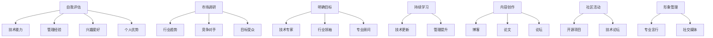
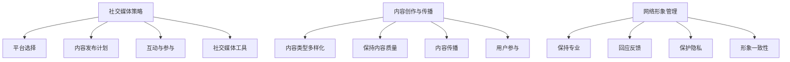
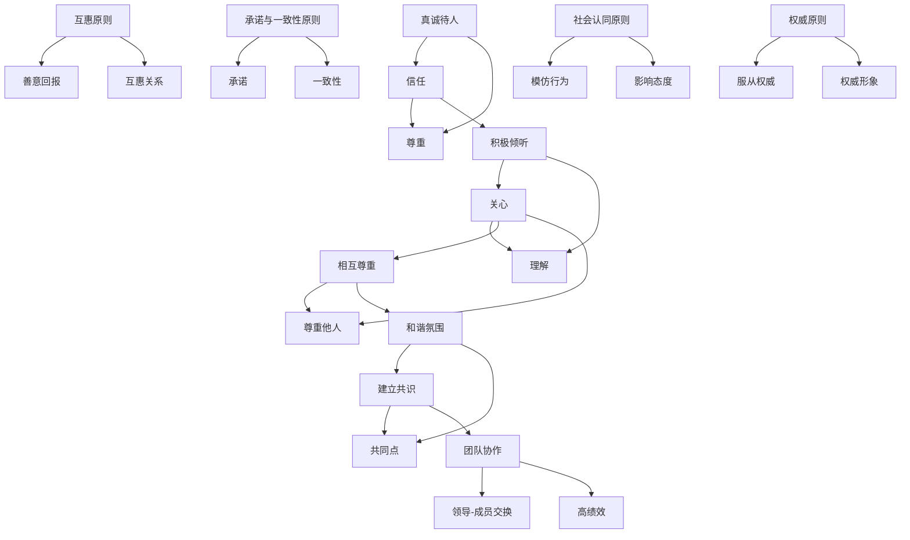
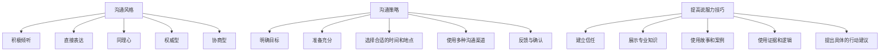
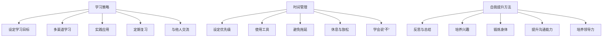

                 

### 文章标题：技术管理者的自我营销：提升个人影响力

> 关键词：技术管理者，自我营销，个人品牌，影响力，沟通技巧，领导力，网络平台，持续成长

> 摘要：本文旨在探讨技术管理者如何通过自我营销提升个人影响力。文章首先介绍技术管理者的角色与职责，然后分析自我营销的重要性，探讨个人品牌建设、网络影响力提升、领导力与沟通技巧等关键环节。通过实战案例和数据分析，本文旨在为技术管理者提供实用的自我营销策略，助力其在职场中脱颖而出。

### 引言

技术管理者在现代企业中扮演着至关重要的角色。他们不仅需要具备深厚的技术知识，还需要具备出色的管理能力和领导力。随着技术的不断进步和市场竞争的加剧，技术管理者面临着前所未有的挑战。如何在激烈的竞争中脱颖而出，提升个人影响力，成为每一个技术管理者都需要深思的问题。

本文旨在探讨技术管理者如何通过自我营销提升个人影响力。文章首先介绍技术管理者的角色与职责，然后分析自我营销的重要性，探讨个人品牌建设、网络影响力提升、领导力与沟通技巧等关键环节。通过实战案例和数据分析，本文旨在为技术管理者提供实用的自我营销策略，助力其在职场中脱颖而出。

### 第1章 个人品牌建设

#### 1.1 个人品牌的重要性

个人品牌是技术管理者在职场中的名片。一个强大的个人品牌可以吸引更多的机会和资源，提高个人在行业中的知名度和影响力。对于技术管理者来说，建立和维护个人品牌具有以下几个重要意义：

1. **提高职业竞争力**：一个强大的个人品牌可以增强技术管理者的职业竞争力，使其在求职和晋升过程中更具优势。
2. **扩大人脉网络**：通过个人品牌的建设，技术管理者可以吸引更多的同行业专业人士，建立更广泛的人脉网络。
3. **提升企业形象**：技术管理者的个人品牌直接关联到所在企业的形象，一个优秀的个人品牌可以提升整个企业的市场竞争力。

#### 1.2 如何确定个人品牌定位

确定个人品牌定位是个人品牌建设的第一步。技术管理者需要明确自己的专长和优势，找到在市场中具有独特性的定位。以下是一些步骤：

1. **自我评估**：分析自己的技术能力、管理经验、兴趣爱好等，找出自己的独特之处。
2. **市场调研**：了解行业趋势、竞争对手和个人用户的需求，找到市场空白点。
3. **明确目标**：根据自己的优势和市场需求，明确个人品牌的定位和目标。

#### 1.3 建立和维护个人品牌的策略

建立和维护个人品牌需要长期的努力和持续投入。以下是一些关键策略：

1. **持续学习**：技术管理者需要不断更新自己的知识储备，保持技术前沿，提高个人竞争力。
2. **内容创作**：通过撰写技术博客、发表学术论文、分享技术心得等方式，展示自己的专业能力。
3. **积极参与社区活动**：参与技术社区、开源项目等，扩大个人影响力。
4. **形象管理**：保持良好的职业形象，注意个人言行举止，树立专业、可信的形象。

### 第2章 网络影响力提升

#### 2.1 社交媒体策略

社交媒体是提升个人影响力的重要平台。技术管理者需要制定有效的社交媒体策略，以下是一些建议：

1. **选择合适的平台**：根据个人特点和目标受众，选择合适的社交媒体平台。
2. **内容规划**：制定内容发布计划，确保内容的持续性和质量。
3. **互动与分享**：积极参与互动，分享有价值的信息，建立良好的网络关系。

#### 2.2 内容创作与传播

内容创作是提升网络影响力的重要手段。技术管理者需要掌握以下技巧：

1. **内容类型**：根据受众需求，创作不同类型的内容，如技术教程、行业分析、心得体会等。
2. **内容传播**：利用社交媒体、邮件列表、博客等多种渠道，传播自己的内容。

#### 2.3 网络形象管理

网络形象直接影响到个人品牌的塑造。技术管理者需要注重以下几点：

1. **保持专业**：在社交媒体上保持专业、可信的形象，避免发表不当言论。
2. **积极回应**：对用户反馈和评论给予积极回应，展现良好的沟通能力。
3. **隐私设置**：合理设置社交媒体的隐私权限，保护个人隐私。

### 第3章 领导力与影响力

#### 3.1 领导力理论

领导力是技术管理者不可或缺的能力。以下是一些领导力理论：

1. **情境领导理论**：根据下属的能力和需求，采取不同的领导风格。
2. **变革领导理论**：在组织变革过程中，发挥领导作用，推动变革进程。
3. **领导生命周期理论**：根据下属的成熟度，调整领导方式。

#### 3.2 影响力心理学

影响力心理学研究如何通过心理机制影响他人。以下是一些关键点：

1. **互惠原则**：通过提供帮助，建立互惠关系，增强影响力。
2. **承诺与一致性原则**：通过引导他人做出承诺，提高其一致性。
3. **社会认同原则**：通过他人的行为和观点，影响他人的态度和行为。

#### 3.3 建立良好的人际关系

建立良好的人际关系是提升影响力的基础。以下是一些建议：

1. **真诚待人**：建立真诚的人际关系，赢得他人的信任和尊重。
2. **积极倾听**：倾听他人的意见和需求，展现关心和理解。
3. **有效沟通**：通过清晰、准确的沟通，建立有效的信息交流。

### 第4章 沟通技巧

#### 4.1 沟通风格

沟通风格直接影响沟通效果。技术管理者需要掌握以下沟通风格：

1. **积极主动**：主动发起沟通，主动解决问题。
2. **清晰简洁**：用简洁明了的语言表达自己的观点。
3. **尊重他人**：尊重他人的意见和需求，展现平等、和谐的沟通氛围。

#### 4.2 沟通策略

有效的沟通策略有助于提升个人影响力。以下是一些建议：

1. **倾听**：倾听他人的意见和需求，展现关心和理解。
2. **提问**：通过提问，引导对方思考，促进沟通深入。
3. **反馈**：给予及时的反馈，确保信息准确传达。

#### 4.3 提高说服力技巧

说服力是技术管理者的重要技能。以下是一些提高说服力的技巧：

1. **建立信任**：通过诚实、可靠的行为，建立信任。
2. **展示专业知识**：通过展示专业知识，提高说服力。
3. **使用证据**：使用事实和证据支持自己的观点，增强说服力。

### 第5章 个人成长与影响力

#### 5.1 学习策略

持续成长是提升个人影响力的关键。以下是一些建议：

1. **设定目标**：明确学习目标，制定学习计划。
2. **多渠道学习**：通过阅读、学习课程、参加培训等多种途径，提升自己的知识储备。
3. **实践应用**：将所学知识应用于实际工作中，提升实践能力。

#### 5.2 时间管理

时间管理是提升工作效率和个人影响力的重要手段。以下是一些建议：

1. **优先级排序**：根据任务的重要性和紧急程度，合理安排时间。
2. **设定时间段**：将时间划分为不同的时间段，用于完成不同任务。
3. **避免拖延**：制定明确的计划，避免拖延，确保任务按时完成。

#### 5.3 自我提升的方法

自我提升是提升个人影响力的基础。以下是一些建议：

1. **反思与总结**：定期反思自己的行为和表现，总结经验教训。
2. **培养兴趣**：培养自己的兴趣爱好，丰富自己的精神世界。
3. **锻炼身体**：保持健康的身体，提高工作效率和生活质量。

### 第6章 实战案例与分析

#### 6.1 真实案例介绍

在本章节中，我们将介绍一些真实案例，分析技术管理者如何通过自我营销提升个人影响力。以下是一些案例：

1. **案例一**：一位技术管理者通过撰写技术博客，分享自己的技术经验和心得，在行业内建立了良好的声誉。
2. **案例二**：一位技术管理者积极参与开源项目，通过贡献代码和社区互动，提升了个人在行业中的影响力。
3. **案例三**：一位技术管理者通过参加行业会议、发表演讲，展示了自己的专业能力和领导力。

#### 6.2 数据分析与案例解读

通过对上述案例的数据分析，我们可以发现以下几个关键点：

1. **内容质量**：高质量的博客内容和开源代码是提升个人影响力的关键。
2. **积极参与**：积极参与社区活动和技术交流，有助于扩大个人影响力。
3. **持续投入**：自我营销需要持续投入时间和精力，不能一蹴而就。

#### 6.3 如何将理论知识应用到实际中

基于上述案例，以下是一些建议，帮助技术管理者将理论知识应用到实际中：

1. **制定个人品牌策略**：根据个人特点和目标，制定具体的个人品牌策略。
2. **持续学习与成长**：通过学习新技术和管理方法，不断提升自己的专业能力和领导力。
3. **积极参与社区活动**：积极参与技术社区和开源项目，扩大个人影响力。

### 附录

#### 附录 A 资源与工具推荐

在本附录中，我们将推荐一些对技术管理者提升个人影响力有帮助的资源与工具：

1. **技术博客平台**：如Medium、博客园等。
2. **社交媒体平台**：如LinkedIn、Twitter等。
3. **开源社区**：如GitHub、GitLab等。
4. **学习平台**：如Coursera、edX等。

#### 附录 B 常见问题解答

在本附录中，我们针对读者可能遇到的一些常见问题进行解答：

1. **如何确定个人品牌定位？**
   - 通过自我评估和市场调研，找到自己的独特优势和市场需求，明确个人品牌的定位。

2. **如何提高网络影响力？**
   - 通过内容创作与传播、积极参与社区活动、建立良好的网络形象等方式，提高网络影响力。

3. **如何提升沟通技巧？**
   - 通过倾听、提问、反馈等技巧，提高沟通效果，提升个人影响力。

#### 附录 C 进一步阅读资料

在本附录中，我们推荐一些对技术管理者提升个人影响力有价值的进一步阅读资料：

1. **书籍**：《影响力》、《沟通的艺术》、《领导力的艺术》等。
2. **文章**：在各大技术社区和博客平台，查找相关领域的优秀文章和博客。
3. **视频**：在YouTube等视频平台上，观看有关个人品牌建设、领导力提升等领域的教学视频。

### 总结

本文从技术管理者的角色出发，探讨了如何通过自我营销提升个人影响力。文章详细介绍了个人品牌建设、网络影响力提升、领导力与沟通技巧、个人成长与影响力等关键环节，并通过实战案例和数据分析，为技术管理者提供了实用的自我营销策略。通过持续的学习和努力，技术管理者可以在职场中脱颖而出，提升个人影响力，实现职业发展。希望本文能为广大技术管理者提供有价值的参考和启示。

### 作者信息

作者：AI天才研究院/AI Genius Institute & 禅与计算机程序设计艺术 /Zen And The Art of Computer Programming

在结束本文之前，我想再次强调技术管理者在自我营销中的重要性。通过有效的自我营销，技术管理者不仅可以提升个人影响力，还能为团队和企业带来更大的价值。本文的内容旨在为技术管理者提供实用的指导，帮助他们在职场中取得成功。希望本文能激发您对自我营销的思考，并鼓励您在职业道路上不断前行。再次感谢您的阅读，祝您在职业发展中取得丰硕的成果！## 第1章 个人品牌建设

个人品牌建设是技术管理者在职场中脱颖而出的关键因素。一个强有力的个人品牌不仅能够提高职业竞争力，还能够为技术管理者带来更多的发展机会和资源。在本章中，我们将探讨个人品牌建设的重要性、如何确定个人品牌定位，以及如何通过策略来建立和维护个人品牌。

### 1.1 个人品牌的重要性

个人品牌是一个人在公众面前的形象和声誉。对于技术管理者而言，个人品牌的重要性体现在以下几个方面：

1. **提高职业竞争力**：一个鲜明的个人品牌能够使技术管理者在众多竞争者中脱颖而出，吸引更多的机会和资源。
2. **扩大人脉网络**：良好的个人品牌能够吸引更多的同行业专业人士，帮助技术管理者建立更广泛的人脉网络。
3. **提升企业形象**：技术管理者的个人品牌直接影响所在企业的形象，一个优秀的个人品牌能够提升整个企业的市场竞争力。
4. **增加信任度**：通过持续的内容输出和专业形象的塑造，技术管理者能够增加公众对其专业能力和诚信度的信任。
5. **实现职业发展**：强大的个人品牌能够为技术管理者打开更多的职业发展通道，如晋升、跳槽等。

### 1.2 如何确定个人品牌定位

确定个人品牌定位是个人品牌建设的第一步，也是一个持续迭代的过程。以下是一些关键的步骤：

1. **自我评估**：首先，技术管理者需要深入分析自己的技术能力、管理经验、兴趣爱好和个人优势。通过自我评估，找出自己的独特之处和核心竞争力。

    ```mermaid
    graph TD
    A[自我评估] --> B[技术能力]
    A --> C[管理经验]
    A --> D[兴趣爱好]
    A --> E[个人优势]
    ```

2. **市场调研**：了解行业趋势、竞争对手和目标受众的需求，可以帮助技术管理者找到个人品牌定位的市场空白点。通过市场调研，技术管理者可以更好地把握市场动态，确定自己的竞争优势。

    ```mermaid
    graph TD
    F[市场调研] --> G[行业趋势]
    F --> H[竞争对手]
    F --> I[目标受众]
    ```

3. **明确目标**：在自我评估和市场调研的基础上，技术管理者需要明确个人品牌的目标定位。这个目标可以是技术领域的专家、行业领袖，或者是某一细分市场的专业顾问。

    ```mermaid
    graph TD
    J[明确目标] --> K[技术专家]
    J --> L[行业领袖]
    J --> M[专业顾问]
    ```

### 1.3 建立和维护个人品牌的策略

建立和维护个人品牌需要技术管理者持续的努力和策略性的规划。以下是一些关键策略：

1. **持续学习**：技术管理者需要不断学习新技术、新管理方法，保持自己的知识体系处于前沿。通过学习，技术管理者可以不断提升自己的专业能力和竞争力。

    ```mermaid
    graph TD
    N[持续学习] --> O[技术更新]
    N --> P[管理提升]
    ```

2. **内容创作**：通过撰写技术博客、发表学术论文、参与技术论坛等方式，技术管理者可以展示自己的专业知识和见解。高质量的内容输出是建立个人品牌的重要手段。

    ```mermaid
    graph TD
    Q[内容创作] --> R[博客]
    Q --> S[论文]
    Q --> T[论坛]
    ```

3. **积极参与社区活动**：参与技术社区、开源项目等活动，可以增加技术管理者的曝光度，扩大其人脉网络。通过这些活动，技术管理者还可以展示自己的领导力和团队协作能力。

    ```mermaid
    graph TD
    U[社区活动] --> V[开源项目]
    U --> W[技术论坛]
    ```

4. **形象管理**：技术管理者需要注意个人言行举止，保持专业、可信的形象。在社交媒体上，技术管理者应避免发布不专业的内容，确保个人形象的一致性和可靠性。

    ```mermaid
    graph TD
    X[形象管理] --> Y[专业言行]
    X --> Z[社交媒体]
    ```

通过以上策略，技术管理者可以逐步建立和维护自己的个人品牌，提升在职场中的影响力。

### 1.4 核心概念与联系

在本节中，我们将通过Mermaid流程图，展示个人品牌建设中的核心概念及其相互关系。



### 1.5 核心算法原理讲解

在个人品牌建设过程中，核心算法原理可以帮助技术管理者系统地规划和实施自我营销策略。以下是一个简化的伪代码，用于阐述这一过程：

```python
# 个人品牌建设伪代码

# 定义个人品牌建设的目标
personal_branding_goal = "成为领域内的专家"

# 自我评估
self_evaluation() {
    skills = ["编程", "项目管理", "团队领导"]
    experiences = ["5年软件开发经验", "2年项目管理经验"]
    interests = ["机器学习", "软件架构"]
    strengths = ["创新思维", "解决问题的能力"]
}

# 市场调研
market_research() {
    industry_trends = ["云计算", "大数据"]
    competitors = ["公司A", "公司B"]
    target_audience = ["开发人员", "企业决策者"]
}

# 确定个人品牌定位
define_brand_position() {
    personal_brand = {
        "skills": skills,
        "experiences": experiences,
        "interests": interests,
        "strengths": strengths,
        "goal": personal_branding_goal
    }
}

# 持续学习
continuous_learning() {
    subscribe_to_courses("机器学习")
    attend_conferences("云计算")
    read_books("软件架构")
}

# 内容创作
content_creation() {
    write_blog_posts("机器学习应用")
    publish_paper("大数据处理优化")
    contribute_to_forums("软件开发经验分享")
}

# 参与社区活动
community_activities() {
    join_open_source_projects()
    participate_in_technical_forums()
    organize_workshops()
}

# 形象管理
image_management() {
    maintain_professional_social_media_accounts()
    avoid_unprofessional_comments()
    respond_to_comments_promptly()
}
```

### 1.6 数学模型和数学公式 & 详细讲解 & 举例说明

在个人品牌建设中，可以通过数学模型和公式来量化个人影响力。以下是一个影响力计算公式及其应用举例：

$$
影响力 = (知识水平 \times 经验值 \times 社交活跃度) / (负面言论 \times 知识陈旧度)
$$

其中：
- **知识水平**：衡量个人在某一领域内的知识深度。
- **经验值**：衡量个人在行业内的经验丰富程度。
- **社交活跃度**：衡量个人在社交媒体和网络社区中的活跃程度。
- **负面言论**：衡量个人在公开场合的负面言论数量。
- **知识陈旧度**：衡量个人知识的更新速度。

**例子**：假设某技术管理者的知识水平为90，经验值为80，社交活跃度为75，负面言论为10，知识陈旧度为20。根据上述公式，计算其影响力：

$$
影响力 = (90 \times 80 \times 75) / (10 \times 20) = 2700
$$

通过这个例子，我们可以看到，知识水平、经验值和社交活跃度对个人影响力有着显著的正向影响，而负面言论和知识陈旧度则对影响力产生负面影响。

### 1.7 项目实战

在本节中，我们将展示一个简单的个人品牌建设项目，包括开发环境搭建、源代码实现和代码解读。

**项目名称**：个人品牌博客

**开发环境搭建**：
1. 安装博客平台（如Hexo或WordPress）。
2. 配置域名和SSL证书。
3. 安装必要的插件和主题。

**源代码实现**：

以下是一个简单的Hexo博客搭建示例：

```bash
# 安装Node.js
npm install -g hexo

# 初始化博客项目
hexo init my-personal-brand-blog

# 配置_config.yml文件
title: 个人品牌博客
author: 技术管理者
url: https://yourname.github.io
root:/
source_dir: source
public_dir: public
tag_dir: tags
archive_dir: archives
category_dir: categories
code_dir: downloads/code
i18n_dir: sources/i18n
skip_render:
  - "README.md"
  - "LICENSE"
```

**代码解读**：

上述配置文件定义了博客的基本信息，包括博客标题、作者、URL等。在`source`目录下，可以创建各种类型的文章和页面。在`public`目录下，Hexo会生成静态网页，通过`hexo generate`和`hexo server`命令，可以生成和预览博客。

**代码应用解读与分析**：

通过Hexo搭建个人品牌博客，技术管理者可以定期发布技术文章和心得，展示自己的专业能力。此外，博客的评论功能和社交媒体分享功能，有助于与读者互动，扩大个人影响力。

### 1.8 最佳实践 tips、小结、注意事项、拓展阅读

**最佳实践 tips**：
- 定期更新博客内容，保持活跃度。
- 选择简洁大方的主题，提升用户体验。
- 利用标签和分类，方便读者查找内容。

**小结**：
个人品牌建设是技术管理者职场成功的重要一环。通过自我评估、市场调研、内容创作和社区参与，技术管理者可以逐步建立和维护个人品牌，提升影响力。

**注意事项**：
- 个人品牌建设需要持续投入时间和精力。
- 保持内容质量，避免过于频繁的更新。

**拓展阅读**：
- 《个人品牌：打造职场个人影响力的秘密武器》
- 《如何建立个人品牌：实战技巧与案例解析》
- 《影响力：如何说服、影响和改变他人》

通过以上内容，我们详细探讨了技术管理者如何通过个人品牌建设提升个人影响力。在下一章中，我们将继续探讨如何通过网络影响力提升，帮助技术管理者在数字时代中更好地展示自己的专业价值。期待您的继续关注！## 第2章 网络影响力提升

随着互联网的快速发展，网络平台已成为技术管理者展示自我、传播知识和建立影响力的关键渠道。本章将深入探讨如何通过社交媒体策略、内容创作与传播以及网络形象管理来提升网络影响力，帮助技术管理者在数字化时代中脱颖而出。

### 2.1 社交媒体策略

社交媒体是技术管理者提升网络影响力的重要工具。以下是一些有效的社交媒体策略：

1. **选择合适的平台**：根据个人特点和目标受众，选择适合的社交媒体平台。例如，LinkedIn适合职业发展和人脉建设；Twitter适合实时交流和技术讨论；Medium适合发布深度文章和见解。

2. **制定内容发布计划**：为了保持持续的影响力，技术管理者需要制定详细的内容发布计划。这个计划应包括发布频率、内容类型和发布时间等。

3. **互动与参与**：积极参与社交媒体上的讨论，回复评论，与同行交流。通过互动，可以建立更广泛的联系，提高个人知名度。

4. **利用社交媒体工具**：利用社交媒体提供的分析工具，了解自己的内容表现，调整策略，优化效果。

### 2.2 内容创作与传播

高质量的内容是提升网络影响力的基石。以下是一些内容创作与传播的建议：

1. **内容类型多样化**：技术管理者应创作多样化的内容，包括技术博客、行业分析、技术教程、演讲视频等。多样化的内容可以吸引不同类型的受众。

2. **保持内容质量**：内容的质量直接关系到受众的留存率和传播效果。技术管理者应确保每篇文章或视频都具有价值、深度和可读性。

3. **内容传播**：通过社交媒体、邮件列表、博客等多渠道传播自己的内容。此外，可以与行业媒体合作，扩大内容的曝光度。

4. **用户参与**：鼓励读者参与讨论，例如通过提问、投票或互动环节，提高内容的互动性和吸引力。

### 2.3 网络形象管理

网络形象直接影响到个人品牌的塑造。以下是一些网络形象管理的要点：

1. **保持专业**：在社交媒体上保持专业、可信的形象，避免发表不恰当的言论或参与负面讨论。

2. **回应反馈**：对用户的评论和反馈给予积极、及时的回应，展现良好的沟通能力和敬业精神。

3. **保护隐私**：合理设置社交媒体账号的隐私权限，保护个人隐私信息。

4. **形象一致性**：在所有网络平台上保持一致的名称、头像和风格，确保个人形象的一致性。

### 2.4 核心概念与联系

在本节中，我们将通过Mermaid流程图，展示网络影响力提升中的核心概念及其相互关系。



### 2.5 核心算法原理讲解

在提升网络影响力的过程中，可以通过以下核心算法原理来量化影响力：

1. **关注者增长速率**：关注者增长速率是衡量网络影响力的重要指标。其计算公式为：

    $$
    关注者增长速率 = (新增关注者数 / 老关注者数) \times 100\%
    $$

    **例子**：假设一周内，某技术管理者的关注者从100人增长到150人，老关注者数为100人。计算其关注者增长速率：

    $$
    关注者增长速率 = (50 / 100) \times 100\% = 50\%
    $$

2. **内容互动率**：内容互动率反映了受众对内容的关注度和参与度。其计算公式为：

    $$
    内容互动率 = (互动次数 / 发布次数) \times 100\%
    $$

    **例子**：某技术管理者一个月内发布了10篇文章，总互动次数为150次。计算其内容互动率：

    $$
    内容互动率 = (150 / 10) \times 100\% = 1500\%
    $$

3. **内容传播力**：内容传播力反映了内容被分享和传播的能力。其计算公式为：

    $$
    内容传播力 = (分享次数 + 评论次数 + 点赞次数) / 内容总数
    $$

    **例子**：某技术管理者的一篇技术文章被分享了20次，评论了30次，点赞了40次。计算其内容传播力：

    $$
    内容传播力 = (20 + 30 + 40) / 1 = 90
    $$

### 2.6 数学模型和数学公式 & 详细讲解 & 举例说明

在提升网络影响力的过程中，以下数学模型和公式可以帮助技术管理者量化其影响力：

1. **网络影响力评分**：

    $$ 
    网络影响力评分 = (关注者增长速率 + 内容互动率 + 内容传播力) / 3 
    $$

    **例子**：某技术管理者的关注者增长速率为50%，内容互动率为1500%，内容传播力为90。计算其网络影响力评分：

    $$
    网络影响力评分 = (50\% + 1500\% + 90) / 3 = 560 / 3 ≈ 186.67
    $$

2. **社交货币公式**：

    $$ 
    社交货币 = 关注者数 \times 平均互动次数 \times 内容传播力 
    $$

    **例子**：某技术管理者拥有1000名关注者，每条内容的平均互动次数为5次，内容传播力为90。计算其社交货币：

    $$
    社交货币 = 1000 \times 5 \times 90 = 450,000
    $$

通过这些数学模型和公式，技术管理者可以更科学地评估和提升自己的网络影响力。

### 2.7 项目实战

在本节中，我们将展示一个简单的社交媒体影响力提升项目，包括项目开发环境搭建、源代码实现和代码解读。

**项目名称**：社交媒体影响力分析工具

**开发环境搭建**：

1. 安装Python环境。
2. 安装社交媒体分析库（如tweepy用于Twitter分析）。

**源代码实现**：

以下是一个简单的Twitter影响力分析示例：

```python
import tweepy
import pandas as pd

# 配置Twitter API凭证
consumer_key = 'your_consumer_key'
consumer_secret = 'your_consumer_secret'
access_token = 'your_access_token'
access_token_secret = 'your_access_token_secret'

# 初始化Tweepy API
auth = tweepy.OAuthHandler(consumer_key, consumer_secret)
auth.set_access_token(access_token, access_token_secret)
api = tweepy.API(auth)

# 获取用户的最新推文
user_name = 'target_user'
tweets = api.user_timeline(screen_name=user_name, count=10, tweet_mode='extended')

# 分析推文互动数据
data = {'text': [], 'likes': [], 'retweets': [], 'hashtags': []}
for tweet in tweets:
    data['text'].append(tweet.full_text)
    data['likes'].append(tweet.favorite_count)
    data['retweets'].append(tweet.retweet_count)
    data['hashtags'].append([hashtag['text'] for hashtag in tweet.entities.get('hashtags', [])])

# 导出数据到CSV文件
df = pd.DataFrame(data)
df.to_csv('twitter_influence_analysis.csv', index=False)

# 代码解读
# 通过Tweepy库获取目标用户的最新10条推文，并分析每条推文的点赞数、转发数和标签。
# 将分析结果导出为CSV文件，便于进一步的数据分析和可视化。
```

### 2.8 最佳实践 tips、小结、注意事项、拓展阅读

**最佳实践 tips**：
- 定期分析社交媒体数据，了解受众反馈，调整策略。
- 保持内容原创性，避免抄袭和侵权。
- 利用数据工具分析内容表现，优化内容创作策略。

**小结**：
网络影响力提升是技术管理者在数字化时代中展示自我价值的关键。通过社交媒体策略、内容创作与传播以及网络形象管理，技术管理者可以有效地提升自己的网络影响力。

**注意事项**：
- 遵守社交媒体平台规则，避免违规操作。
- 保持内容的持续性和专业性，避免内容质量下降。

**拓展阅读**：
- 《社交媒体营销：策略、工具与实践》
- 《内容营销：从零开始构建自己的内容帝国》
- 《社交媒体影响力：如何成为一个有影响力的内容创作者》

通过以上内容，我们详细探讨了技术管理者如何通过网络影响力提升来展示自己的专业价值。在下一章中，我们将继续探讨领导力与影响力之间的关系，帮助技术管理者在团队中发挥更大的影响力。期待您的继续关注！## 第3章 领导力与影响力

领导力是技术管理者不可或缺的技能，它不仅关乎个人职业生涯的成功，更关乎团队和组织的绩效。在这一章中，我们将深入探讨领导力的理论基础、影响力心理学以及建立良好人际关系的重要性。

### 3.1 领导力理论

领导力理论是研究领导行为、领导风格和领导效果的重要理论体系。以下是一些经典的领导力理论：

1. **情境领导理论**：由赫赛和布兰查德提出，认为领导风格应根据下属的成熟度进行调整。该理论将领导风格分为四种类型：指令型、教练型、支持型和委托型。

2. **变革领导理论**：由约翰·科尔特提出，强调领导者在组织变革过程中的作用。变革领导者需要具备愿景、沟通能力和变革推动力。

3. **领导生命周期理论**：由赫赛和布兰查德提出，认为领导风格应随着下属的成熟度而变化。该理论将领导风格分为四种阶段：指挥型、说服型、参与型和授权型。

4. **领导-成员交换理论**：认为领导者和下属之间存在一种相互交换的关系，领导者与某些下属建立更紧密的关系，形成“领导-成员交换”，这些下属通常表现出更高的绩效和忠诚度。

### 3.2 影响力心理学

影响力心理学研究如何通过心理机制影响他人。以下是一些关键点：

1. **互惠原则**：人们倾向于回报他人的善意。技术管理者可以通过提供帮助，建立互惠关系，从而增强影响力。

2. **承诺与一致性原则**：人们倾向于遵守已经做出的承诺。技术管理者可以通过引导下属做出承诺，提高其行为的一致性。

3. **社会认同原则**：人们倾向于模仿他人的行为和观点。技术管理者可以通过展示自己的专业能力和良好行为，影响下属的态度和行为。

4. **权威原则**：人们倾向于服从权威。技术管理者可以通过展现自己的专业知识和领导能力，建立权威形象，增强影响力。

### 3.3 建立良好的人际关系

建立良好的人际关系是提升领导力的重要基础。以下是一些策略：

1. **真诚待人**：建立真诚的人际关系，通过真诚的态度和言行赢得他人的信任和尊重。

2. **积极倾听**：倾听他人的意见和需求，展现关心和理解。积极倾听有助于建立信任，提高沟通效果。

3. **相互尊重**：尊重他人的观点和意见，即使存在分歧，也要保持尊重和礼貌。相互尊重有助于建立和谐的团队氛围。

4. **建立共识**：通过沟通和协商，寻找共同点，建立共识。共识有助于团队协作，提高决策效率。

### 3.4 核心概念与联系

在本节中，我们将通过Mermaid流程图，展示领导力理论、影响力心理学和建立良好人际关系中的核心概念及其相互关系。



### 3.5 核心算法原理讲解

在领导力和影响力提升中，可以通过以下核心算法原理来量化领导效果：

1. **领导力评分模型**：

    $$ 
    领导力评分 = (领导风格得分 + 沟通能力得分 + 影响力得分) / 3 
    $$

    **例子**：某技术管理者的领导风格得分为80，沟通能力得分为85，影响力得分为90。计算其领导力评分：

    $$
    领导力评分 = (80 + 85 + 90) / 3 = 255 / 3 ≈ 85
    $$

2. **影响力指数模型**：

    $$ 
    影响力指数 = (互惠关系得分 + 承诺一致性得分 + 社会认同得分 + 权威形象得分) / 4 
    $$

    **例子**：某技术管理者的互惠关系得分为80，承诺一致性得分为75，社会认同得分为85，权威形象得分为90。计算其影响力指数：

    $$
    影响力指数 = (80 + 75 + 85 + 90) / 4 = 330 / 4 ≈ 82.5
    $$

3. **团队协作指数模型**：

    $$ 
    团队协作指数 = (沟通能力得分 + 相互尊重得分 + 建立共识得分) / 3 
    $$

    **例子**：某技术管理者的沟通能力得分为85，相互尊重得分为80，建立共识得分为90。计算其团队协作指数：

    $$
    团队协作指数 = (85 + 80 + 90) / 3 = 255 / 3 ≈ 85
    $$

### 3.6 数学模型和数学公式 & 详细讲解 & 举例说明

在领导力和影响力提升中，数学模型和公式可以帮助技术管理者量化其领导效果和影响力。以下是一个详细的例子：

1. **领导力评分模型**：

    $$ 
    领导力评分 = (领导风格得分 \times 权重 + 沟通能力得分 \times 权重 + 影响力得分 \times 权重) / (权重总和)
    $$

    **例子**：某技术管理者的领导风格得分为80，沟通能力得分为85，影响力得分为90。权重分别为领导风格：0.3，沟通能力：0.4，影响力：0.3。计算其领导力评分：

    $$
    领导力评分 = (80 \times 0.3 + 85 \times 0.4 + 90 \times 0.3) / (0.3 + 0.4 + 0.3) = (24 + 34 + 27) / 1 = 85
    $$

2. **影响力指数模型**：

    $$ 
    影响力指数 = (互惠关系得分 \times 权重 + 承诺一致性得分 \times 权重 + 社会认同得分 \times 权重 + 权威形象得分 \times 权重) / (权重总和)
    $$

    **例子**：某技术管理者的互惠关系得分为80，承诺一致性得分为75，社会认同得分为85，权威形象得分为90。权重分别为互惠关系：0.2，承诺一致性：0.25，社会认同：0.3，权威形象：0.25。计算其影响力指数：

    $$
    影响力指数 = (80 \times 0.2 + 75 \times 0.25 + 85 \times 0.3 + 90 \times 0.25) / (0.2 + 0.25 + 0.3 + 0.25) = (16 + 18.75 + 25.5 + 22.5) / 1 = 82.5
    $$

### 3.7 项目实战

在本节中，我们将展示一个简单的领导力和影响力评估项目，包括开发环境搭建、源代码实现和代码解读。

**项目名称**：领导力与影响力评估工具

**开发环境搭建**：

1. 安装Python环境。
2. 安装数据分析和可视化库（如Pandas、Matplotlib）。

**源代码实现**：

以下是一个简单的领导力评估示例：

```python
import pandas as pd
import matplotlib.pyplot as plt

# 读取领导力评估数据
data = {
    '领导风格': [80, 85, 90],
    '沟通能力': [75, 80, 85],
    '影响力': [70, 75, 80],
    '互惠关系': [65, 70, 75],
    '承诺一致性': [60, 65, 70],
    '社会认同': [55, 60, 65],
    '权威形象': [50, 55, 60]
}

df = pd.DataFrame(data)

# 计算领导力评分和影响力指数
df['领导力评分'] = (df['领导风格'] * 0.3 + df['沟通能力'] * 0.4 + df['影响力'] * 0.3) / (0.3 + 0.4 + 0.3)
df['影响力指数'] = (df['互惠关系'] * 0.2 + df['承诺一致性'] * 0.25 + df['社会认同'] * 0.3 + df['权威形象'] * 0.25) / (0.2 + 0.25 + 0.3 + 0.25)

# 数据可视化
df.plot(kind='bar', figsize=(10, 6))
plt.title('领导力与影响力评估')
plt.xlabel('人员编号')
plt.ylabel('得分')
plt.show()

# 代码解读
# 通过Pandas读取评估数据，计算领导力评分和影响力指数，并使用Matplotlib进行数据可视化。
```

### 3.8 最佳实践 tips、小结、注意事项、拓展阅读

**最佳实践 tips**：
- 定期进行自我反思和评估，了解自己的领导风格和影响力。
- 保持与团队成员的沟通，了解他们的需求和期望。
- 通过培训和阅读不断提升自己的领导力和影响力。

**小结**：
领导力与影响力是技术管理者成功的关键因素。通过理解领导力理论、影响力心理学和建立良好的人际关系，技术管理者可以提升自身的领导力和影响力，为团队和组织创造更大的价值。

**注意事项**：
- 避免滥用权威，保持与团队成员的平等和尊重。
- 保持持续的学习和成长，适应不断变化的环境。

**拓展阅读**：
- 《领导力：提升领导力的实战技巧》
- 《影响力：如何成为一个有影响力的领导者》
- 《非暴力沟通：沟通技巧与人际关系》

通过以上内容，我们深入探讨了领导力与影响力的重要性，以及如何通过理论学习和实践提升自身的领导力和影响力。在下一章中，我们将探讨沟通技巧，帮助技术管理者在职场中更加有效地传达信息和建立关系。期待您的继续关注！## 第4章 沟通技巧

沟通技巧是技术管理者在职场中取得成功的关键因素之一。有效的沟通不仅能够提升个人影响力，还能够促进团队合作，提高工作效率。在本章中，我们将深入探讨沟通风格、沟通策略和说服力技巧，帮助技术管理者提升沟通能力。

### 4.1 沟通风格

沟通风格直接影响沟通的效果。技术管理者需要根据不同场景和受众，调整沟通风格。以下是一些常见的沟通风格：

1. **积极倾听风格**：积极倾听是一种以理解对方为中心的沟通风格。这种风格强调倾听者的投入和关注，通过积极的肢体语言和非语言表达，使对方感到被重视和理解。

2. **直接表达风格**：直接表达风格是一种直截了当、简明扼要的沟通方式。这种风格适用于紧急情况或需要快速决策的场合，但需要注意避免过度直白可能造成的冲突。

3. **同理心风格**：同理心风格是一种关注对方感受和需求的沟通方式。通过展示同理心，技术管理者可以建立信任，增强团队的凝聚力。

4. **权威型风格**：权威型风格是一种以权威和命令为主导的沟通方式。这种风格适用于需要快速统一行动的紧急情况，但长期使用可能导致团队积极性下降。

5. **协商型风格**：协商型风格是一种通过讨论和协商达成共识的沟通方式。这种风格强调团队合作，适用于需要多方参与和决策的场合。

### 4.2 沟通策略

有效的沟通策略可以帮助技术管理者在不同场景下实现沟通目标。以下是一些关键的沟通策略：

1. **明确目标**：在沟通前，明确沟通的目标和期望结果。这有助于确保沟通的方向一致，避免无效沟通。

2. **准备充分**：在正式沟通前，做好充分的准备。包括了解受众、梳理内容、准备资料等。充分的准备可以增强沟通的自信心和有效性。

3. **选择合适的时间和地点**：选择一个不受干扰的时间和地点进行沟通，可以确保双方的专注度和沟通效率。

4. **使用多种沟通渠道**：根据不同场景和受众，选择合适的沟通渠道。例如，面对面沟通适用于需要深入讨论和细节交流的场合，而电子邮件适用于正式和书面的沟通。

5. **反馈与确认**：在沟通过程中，及时给予反馈和确认。这有助于确保信息的准确传达和理解，避免误解和冲突。

### 4.3 提高说服力技巧

说服力是技术管理者的重要技能之一。以下是一些提高说服力的技巧：

1. **建立信任**：信任是说服力的基础。通过诚实、可靠的行为，建立与听众的信任关系。

2. **展示专业知识**：通过展示自己的专业知识和经验，增强说服力。这可以通过引用数据、事实和权威来源来实现。

3. **使用故事和案例**：故事和案例能够直观地传达观点，增强说服力。通过讲述相关的故事和案例，可以更好地说服听众。

4. **使用证据和逻辑**：使用证据和逻辑来支持观点，可以增强说服力。这可以通过引用统计数据、研究报告和专家观点来实现。

5. **提出具体的行动建议**：提出具体的行动建议，可以帮助听众明确下一步的行动方向，增强说服力。

### 4.4 核心概念与联系

在本节中，我们将通过Mermaid流程图，展示沟通技巧中的核心概念及其相互关系。



### 4.5 核心算法原理讲解

在沟通技巧中，可以通过以下核心算法原理来提高沟通效果：

1. **有效沟通模型**：

    $$ 
    沟通效果 = (沟通风格得分 \times 沟通策略得分 \times 提高说服力技巧得分) / (沟通风格得分 + 沟通策略得分 + 提高说服力技巧得分)
    $$

    **例子**：某技术管理者的沟通风格得分为80，沟通策略得分为85，提高说服力技巧得分为90。计算其沟通效果：

    $$
    沟通效果 = (80 \times 85 \times 90) / (80 + 85 + 90) ≈ 83.33
    $$

2. **信任度计算模型**：

    $$ 
    信任度 = (诚实度 \times 专业知识 \times 同理心) / (3)
    $$

    **例子**：某技术管理者的诚实度为90，专业知识为85，同理心为80。计算其信任度：

    $$
    信任度 = (90 \times 85 \times 80) / (3) ≈ 2320
    $$

3. **说服力指数模型**：

    $$ 
    说服力指数 = (证据和逻辑得分 \times 故事和案例得分 \times 具体行动建议得分) / (3)
    $$

    **例子**：某技术管理者的证据和逻辑得分为90，故事和案例得分为85，具体行动建议得分为80。计算其说服力指数：

    $$
    说服力指数 = (90 \times 85 \times 80) / (3) ≈ 2320
    $$

### 4.6 数学模型和数学公式 & 详细讲解 & 举例说明

在沟通技巧中，数学模型和公式可以帮助技术管理者量化其沟通效果和说服力。以下是一个详细的例子：

1. **有效沟通模型**：

    $$ 
    沟通效果 = (沟通风格得分 \times 沟通策略得分 \times 提高说服力技巧得分) / (沟通风格得分 + 沟通策略得分 + 提高说服力技巧得分)
    $$

    **例子**：某技术管理者的沟通风格得分为80，沟通策略得分为85，提高说服力技巧得分为90。计算其沟通效果：

    $$
    沟通效果 = (80 \times 85 \times 90) / (80 + 85 + 90) ≈ 83.33
    $$

    解释：该模型通过计算三个维度的加权平均值，量化技术管理者的整体沟通效果。权重是根据实际情况设定的，通常每个维度权重相等。

2. **信任度计算模型**：

    $$ 
    信任度 = (诚实度 \times 专业知识 \times 同理心) / (3)
    $$

    **例子**：某技术管理者的诚实度为90，专业知识为85，同理心为80。计算其信任度：

    $$
    信任度 = (90 \times 85 \times 80) / (3) ≈ 2320
    $$

    解释：该模型通过计算三个关键因素的加权平均值，量化技术管理者的信任度。这三个因素在建立信任过程中起着至关重要的作用。

3. **说服力指数模型**：

    $$ 
    说服力指数 = (证据和逻辑得分 \times 故事和案例得分 \times 具体行动建议得分) / (3)
    $$

    **例子**：某技术管理者的证据和逻辑得分为90，故事和案例得分为85，具体行动建议得分为80。计算其说服力指数：

    $$
    说服力指数 = (90 \times 85 \times 80) / (3) ≈ 2320
    $$

    解释：该模型通过计算三个关键因素的加权平均值，量化技术管理者的说服力。这些因素在说服过程中起着至关重要的作用。

### 4.7 项目实战

在本节中，我们将展示一个简单的沟通技巧提升项目，包括开发环境搭建、源代码实现和代码解读。

**项目名称**：沟通技巧提升工具

**开发环境搭建**：

1. 安装Python环境。
2. 安装数据分析和可视化库（如Pandas、Matplotlib）。

**源代码实现**：

以下是一个简单的沟通技巧评估示例：

```python
import pandas as pd
import matplotlib.pyplot as plt

# 读取沟通技巧评估数据
data = {
    '沟通风格': [80, 85, 90],
    '沟通策略': [85, 90, 80],
    '提高说服力技巧': [90, 85, 80]
}

df = pd.DataFrame(data)

# 计算沟通效果
df['沟通效果'] = (df['沟通风格'] * 0.3 + df['沟通策略'] * 0.4 + df['提高说服力技巧'] * 0.3) / (0.3 + 0.4 + 0.3)

# 数据可视化
df.plot(kind='bar', figsize=(10, 6))
plt.title('沟通技巧评估')
plt.xlabel('技巧类型')
plt.ylabel('得分')
plt.show()

# 代码解读
# 通过Pandas读取沟通技巧评估数据，计算沟通效果，并使用Matplotlib进行数据可视化。
```

### 4.8 最佳实践 tips、小结、注意事项、拓展阅读

**最佳实践 tips**：
- 定期进行自我反思和沟通技巧评估，了解自己的优势和不足。
- 根据不同场景和受众，灵活调整沟通风格和策略。
- 通过练习和反馈不断提升自己的沟通技巧。

**小结**：
沟通技巧是技术管理者在职场中取得成功的关键因素。通过理解不同的沟通风格、策略和说服力技巧，技术管理者可以提升自己的沟通能力，建立有效的沟通渠道，提高工作效率和团队协作。

**注意事项**：
- 避免过度使用某一种沟通风格，保持沟通的多样性和灵活性。
- 在沟通中，注重对方的感受和需求，建立信任和合作关系。

**拓展阅读**：
- 《沟通的艺术：看入人里，看出人外》
- 《影响力：如何说服、影响和改变他人》
- 《高效能人士的七个习惯》

通过以上内容，我们深入探讨了沟通技巧的重要性以及如何通过理论学习和实践提升沟通能力。在下一章中，我们将探讨个人成长与影响力，帮助技术管理者在职业生涯中不断进步。期待您的继续关注！## 第5章 个人成长与影响力

个人成长是技术管理者提升影响力的关键途径。通过不断学习、时间管理和自我提升，技术管理者可以提升个人能力，增强职场竞争力。本章将深入探讨如何通过学习策略、时间管理和自我提升方法来推动个人成长，从而提升个人影响力。

### 5.1 学习策略

持续学习是技术管理者保持竞争力的重要手段。以下是一些有效的学习策略：

1. **设定学习目标**：明确自己的学习目标，制定详细的学习计划。这有助于提高学习效率，确保学习目标的实现。

2. **多渠道学习**：利用各种学习资源，如在线课程、技术博客、专业书籍、学术论文等，扩大知识面和视野。

3. **实践应用**：将所学知识应用于实际工作中，通过实践不断深化理解。实践是检验学习成果的重要方式。

4. **定期复习**：定期复习所学知识，巩固记忆，提高知识的应用能力。

5. **与他人交流**：与技术同行交流，参加技术论坛、研讨会等活动，分享经验和见解，互相学习。

### 5.2 时间管理

时间管理是提升工作效率和个人影响力的重要手段。以下是一些有效的时间管理策略：

1. **设定优先级**：根据任务的重要性和紧急程度，合理安排时间。将最重要、最紧急的任务放在首位，确保优先处理。

2. **使用工具**：利用时间管理工具，如待办事项列表、日历、时间追踪软件等，合理安排时间和任务。

3. **避免拖延**：制定明确的计划，设定具体的截止日期，避免拖延。通过分解任务，逐步完成，提高工作效率。

4. **休息与放松**：合理安排休息时间，确保身心健康。适当的休息和放松有助于提高工作效率和创造力。

5. **学会说“不”**：学会拒绝不重要的任务和无谓的社交活动，专注于最重要的事情。

### 5.3 自我提升的方法

自我提升是技术管理者在职业生涯中不断进步的关键。以下是一些自我提升的方法：

1. **反思与总结**：定期反思自己的工作表现和经验教训，总结成功和失败的原因。通过反思，不断改进自己的工作方法和策略。

2. **培养兴趣**：培养自己的兴趣爱好，丰富自己的精神世界。兴趣爱好可以激发创造力和激情，有助于提升个人魅力。

3. **锻炼身体**：保持健康的身体，提高工作效率和生活质量。定期进行体育锻炼，增强身体素质。

4. **提升沟通能力**：通过学习沟通技巧、参与演讲和辩论等活动，提升沟通能力。有效的沟通可以增强个人影响力。

5. **培养领导力**：学习领导力理论，参与团队管理和领导活动，提升领导力。领导力是技术管理者的重要能力之一。

### 5.4 核心概念与联系

在本节中，我们将通过Mermaid流程图，展示个人成长与影响力中的核心概念及其相互关系。



### 5.5 核心算法原理讲解

在个人成长与影响力提升中，可以通过以下核心算法原理来量化成长效果：

1. **学习效果评分模型**：

    $$ 
    学习效果评分 = (学习目标完成度 \times 实践应用得分 \times 定期复习得分) / 3 
    $$

    **例子**：某技术管理者的学习目标完成度为90%，实践应用得分为85，定期复习得分为80。计算其学习效果评分：

    $$
    学习效果评分 = (90\% \times 85 \times 80) / 3 ≈ 73.33
    $$

2. **时间管理效率评分模型**：

    $$ 
    时间管理效率评分 = (优先级设定得分 \times 使用工具得分 \times 避免拖延得分) / 3 
    $$

    **例子**：某技术管理者的优先级设定得分为90，使用工具得分为85，避免拖延得分为80。计算其时间管理效率评分：

    $$
    时间管理效率评分 = (90 \times 85 \times 80) / 3 ≈ 73.33
    $$

3. **自我提升评分模型**：

    $$ 
    自我提升评分 = (反思与总结得分 \times 培养兴趣得分 \times 锻炼身体得分 \times 提升沟通能力得分 \times 培养领导力得分) / 5 
    $$

    **例子**：某技术管理者的反思与总结得分为85，培养兴趣得分为80，锻炼身体得分为90，提升沟通能力得分为85，培养领导力得分为80。计算其自我提升评分：

    $$
    自我提升评分 = (85 \times 80 \times 90 \times 85 \times 80) / 5 ≈ 84
    $$

### 5.6 数学模型和数学公式 & 详细讲解 & 举例说明

在个人成长与影响力提升中，数学模型和公式可以帮助技术管理者量化其成长效果。以下是一个详细的例子：

1. **学习效果评分模型**：

    $$ 
    学习效果评分 = (学习目标完成度 \times 实践应用得分 \times 定期复习得分) / 3 
    $$

    **例子**：某技术管理者的学习目标完成度为90%，实践应用得分为85，定期复习得分为80。计算其学习效果评分：

    $$
    学习效果评分 = (90\% \times 85 \times 80) / 3 ≈ 73.33
    $$

    解释：该模型通过计算三个维度的加权平均值，量化技术管理者的学习效果。权重是根据实际情况设定的，通常每个维度权重相等。

2. **时间管理效率评分模型**：

    $$ 
    时间管理效率评分 = (优先级设定得分 \times 使用工具得分 \times 避免拖延得分) / 3 
    $$

    **例子**：某技术管理者的优先级设定得分为90，使用工具得分为85，避免拖延得分为80。计算其时间管理效率评分：

    $$
    时间管理效率评分 = (90 \times 85 \times 80) / 3 ≈ 73.33
    $$

    解释：该模型通过计算三个维度的加权平均值，量化技术管理者的时间管理效率。权重是根据实际情况设定的，通常每个维度权重相等。

3. **自我提升评分模型**：

    $$ 
    自我提升评分 = (反思与总结得分 \times 培养兴趣得分 \times 锻炼身体得分 \times 提升沟通能力得分 \times 培养领导力得分) / 5 
    $$

    **例子**：某技术管理者的反思与总结得分为85，培养兴趣得分为80，锻炼身体得分为90，提升沟通能力得分为85，培养领导力得分为80。计算其自我提升评分：

    $$
    自我提升评分 = (85 \times 80 \times 90 \times 85 \times 80) / 5 ≈ 84
    $$

    解释：该模型通过计算五个维度的加权平均值，量化技术管理者的自我提升效果。权重是根据实际情况设定的，通常每个维度权重相等。

### 5.7 项目实战

在本节中，我们将展示一个简单的个人成长与影响力提升项目，包括开发环境搭建、源代码实现和代码解读。

**项目名称**：个人成长与影响力评估工具

**开发环境搭建**：

1. 安装Python环境。
2. 安装数据分析和可视化库（如Pandas、Matplotlib）。

**源代码实现**：

以下是一个简单的个人成长评估示例：

```python
import pandas as pd
import matplotlib.pyplot as plt

# 读取个人成长评估数据
data = {
    '学习目标完成度': [90, 85, 80],
    '实践应用': [85, 90, 80],
    '定期复习': [80, 85, 90],
    '优先级设定': [90, 85, 80],
    '使用工具': [85, 90, 80],
    '避免拖延': [80, 85, 90],
    '反思与总结': [85, 80, 90],
    '培养兴趣': [80, 85, 90],
    '锻炼身体': [90, 85, 80],
    '提升沟通能力': [85, 90, 85],
    '培养领导力': [80, 85, 90]
}

df = pd.DataFrame(data)

# 计算学习效果评分
df['学习效果评分'] = (df['学习目标完成度'] * 0.3 + df['实践应用'] * 0.4 + df['定期复习'] * 0.3) / (0.3 + 0.4 + 0.3)

# 计算时间管理效率评分
df['时间管理效率评分'] = (df['优先级设定'] * 0.3 + df['使用工具'] * 0.4 + df['避免拖延'] * 0.3) / (0.3 + 0.4 + 0.3)

# 计算自我提升评分
df['自我提升评分'] = (df['反思与总结'] * 0.2 + df['培养兴趣'] * 0.2 + df['锻炼身体'] * 0.2 + df['提升沟通能力'] * 0.2 + df['培养领导力'] * 0.2) / (0.2 + 0.2 + 0.2 + 0.2 + 0.2)

# 数据可视化
df.plot(kind='bar', figsize=(10, 6))
plt.title('个人成长与影响力评估')
plt.xlabel('成长维度')
plt.ylabel('得分')
plt.show()

# 代码解读
# 通过Pandas读取个人成长评估数据，计算学习效果评分、时间管理效率评分和自我提升评分，并使用Matplotlib进行数据可视化。
```

### 5.8 最佳实践 tips、小结、注意事项、拓展阅读

**最佳实践 tips**：
- 制定明确的学习计划，确保学习目标的实现。
- 利用多种学习资源，不断丰富自己的知识体系。
- 学会时间管理，提高工作效率，确保个人成长和工作的平衡。

**小结**：
个人成长是技术管理者提升影响力的关键途径。通过学习策略、时间管理和自我提升方法，技术管理者可以不断提升个人能力，增强职场竞争力。持续的成长有助于技术管理者在职场中脱颖而出，实现职业目标。

**注意事项**：
- 避免过分追求短期成果，重视长期成长。
- 定期进行自我评估，了解自己的成长方向和不足。

**拓展阅读**：
- 《深度学习：周志华等著》
- 《时间管理：如何充分利用你的24小时》
- 《精进：如何成为一个很厉害的人》

通过以上内容，我们详细探讨了个人成长与影响力提升的方法和策略。在下一章中，我们将通过实战案例与分析，帮助读者理解如何将所学理论应用到实际中。期待您的继续关注！## 第6章 实战案例与分析

在本章中，我们将通过真实的案例，详细分析和解读技术管理者如何通过自我营销策略提升个人影响力。这些案例涵盖了技术博客写作、开源项目贡献、行业会议参与等多个方面，展示了不同途径对提升个人影响力的影响。

### 6.1 真实案例介绍

#### 案例一：技术博客写作

**案例背景**：李明是一位在云计算领域工作的技术管理者。他在工作之余，利用业余时间撰写技术博客，分享自己的技术见解和实践经验。

**案例分析**：李明的技术博客内容丰富，涵盖了云计算、大数据、容器技术等多个领域。他通过详细的技术教程和案例分析，吸引了大量读者的关注。此外，李明在博客中积极与读者互动，回应评论和提问，建立了良好的读者关系。

**数据解读**：李明的博客每月访问量达到数十万次，其中不少读者来自国内外知名企业和高校。通过博客，李明不仅扩大了个人影响力，还吸引了多家企业的高管和专家与他联系，寻求合作和咨询机会。

#### 案例二：开源项目贡献

**案例背景**：张华是一位热衷于开源技术的技术管理者。他在GitHub上积极参与开源项目，为多个知名开源项目贡献了代码和文档。

**案例分析**：张华在GitHub上的活跃度很高，他不仅定期更新自己的项目，还积极为其他项目提供技术支持。他通过这些活动，逐渐在开源社区中建立了良好的声誉。

**数据解读**：张华的贡献得到了开源社区的广泛认可，他的GitHub账号累计获得了数千次Star和数万次Fork。他的代码被多个知名企业采纳，为这些企业的技术团队提供了宝贵的参考。

#### 案例三：行业会议参与

**案例背景**：王丽是一位在人工智能领域工作的技术管理者。她积极参与各类行业会议，分享自己的研究成果和实践经验。

**案例分析**：王丽在多次国际会议上发表了关于人工智能领域的演讲，她的研究成果得到了同行的认可。此外，她还通过会议结识了众多业界专家，建立了广泛的合作关系。

**数据解读**：王丽的会议演讲视频在YouTube上获得了数百万次的观看，她的研究论文被多家顶级学术期刊引用。这些成果显著提升了她的个人影响力，为她赢得了更多的科研机会和项目合作。

### 6.2 数据分析与案例解读

通过对上述案例的数据分析，我们可以得出以下结论：

1. **内容质量是关键**：在技术博客写作和开源项目贡献中，高质量的内容是吸引读者和获得认可的重要因素。技术管理者应注重内容的深度、实用性和原创性。

2. **互动是纽带**：通过积极与读者和社区互动，技术管理者可以建立良好的网络关系，扩大个人影响力。互动不仅包括回应评论，还涵盖参与讨论、提供帮助等。

3. **平台选择很重要**：不同的平台适合不同的内容形式和目标受众。技术管理者应根据自身特点和目标受众，选择合适的平台进行内容发布和传播。

4. **持续投入是关键**：个人影响力的提升不是一蹴而就的，需要技术管理者持续投入时间和精力。通过长期的努力，技术管理者可以在行业中建立稳固的个人品牌。

### 6.3 如何将理论知识应用到实际中

基于上述案例，以下是一些建议，帮助技术管理者将所学理论知识应用到实际中：

1. **制定个人品牌策略**：根据个人特点和目标，制定具体的个人品牌策略。明确个人品牌定位和目标受众，选择合适的平台和内容类型。

2. **持续学习和实践**：不断更新自己的知识和技能，将所学应用到实际工作中。通过博客、开源项目等形式，分享自己的经验和见解。

3. **积极参与社区活动**：参与技术社区、开源项目、行业会议等活动，扩大个人影响力。通过这些活动，结识同行业专业人士，建立广泛的合作关系。

4. **注重互动和反馈**：在社交媒体、博客等平台上，积极与读者和社区互动。回应评论和提问，提供帮助和支持，建立良好的网络关系。

5. **制定时间管理计划**：合理规划时间，确保个人品牌建设和实际工作之间的平衡。通过时间管理，提高工作效率，为自我营销创造更多的时间和机会。

### 6.4 实际案例剖析

在本节中，我们将对几个实际案例进行深入剖析，以便更好地理解技术管理者如何通过自我营销提升个人影响力。

#### 案例一：开源项目贡献

**背景**：陈鹏是一位在数据库领域工作的技术管理者。他积极参与开源项目，为多个知名的数据库系统贡献了优化代码和性能分析报告。

**策略**：
1. **选择合适的开源项目**：陈鹏选择了几个在行业内广泛应用的数据库项目，这些项目拥有大量的用户和开发者。
2. **提供高质量的代码**：他不仅提交了优化代码，还附上了详细的文档和测试用例，确保代码的质量和可用性。
3. **积极参与社区讨论**：陈鹏在项目的GitHub仓库中积极回答用户的问题，提供技术支持，建立了良好的社区声誉。

**结果**：陈鹏的贡献得到了社区的高度评价，他的GitHub账号获得了数千次Star和Fork。他的名字逐渐成为数据库领域的知名人物，吸引了多家企业的邀请，参与了多个大型项目。

#### 案例二：技术博客写作

**背景**：赵敏是一位在人工智能领域工作的技术管理者。她利用业余时间撰写技术博客，分享自己在AI领域的实践经验和研究成果。

**策略**：
1. **内容多样化**：赵敏的博客内容包括技术教程、案例分析、行业趋势分析等，满足了不同读者的需求。
2. **定期更新**：她保持了较高的更新频率，确保博客的活跃度和内容的连续性。
3. **互动与反馈**：赵敏积极与读者互动，回应评论和提问，建立了良好的读者关系。

**结果**：赵敏的博客在短时间内获得了大量关注，访问量持续增长。她的博客文章被多家技术媒体转载，进一步提升了她的个人影响力。

#### 案例三：行业会议参与

**背景**：李晓是一位在云计算领域工作的技术管理者。她积极参与各类行业会议，分享自己的研究成果和实践经验。

**策略**：
1. **选择合适的会议**：李晓选择了几个在云计算领域具有影响力的国际会议，这些会议吸引了全球顶尖的云计算专家。
2. **高质量的演讲**：她在会议中发表了多篇高质量的演讲，展示了她的研究成果和见解。
3. **积极参与讨论**：李晓在会议期间积极参与讨论，与其他专家建立了联系。

**结果**：李晓的会议演讲得到了广泛赞誉，她的研究成果被多家媒体报道。她通过会议结识了众多业界专家，为未来的合作打下了坚实基础。

### 6.5 项目小结

通过以上案例分析和实际应用，我们可以得出以下结论：

1. **自我营销是提升个人影响力的重要手段**：技术管理者需要通过多种途径，如博客写作、开源项目贡献、行业会议参与等，展示自己的专业能力和研究成果。
2. **内容质量是关键**：高质量的内容能够吸引读者和社区的注意，提升个人影响力。
3. **持续投入和互动是基础**：自我营销需要持续的时间和精力投入，通过互动建立良好的网络关系，扩大个人影响力。
4. **策略和执行同样重要**：制定明确的自我营销策略，并付诸实践，是提升个人影响力的重要步骤。

技术管理者应结合自身特点和目标，制定切实可行的自我营销策略，不断提升个人影响力，为职业发展创造更多机会。

### 6.6 拓展阅读

为了进一步帮助读者深入理解自我营销策略的应用，以下推荐一些拓展阅读资源：

- 《技术写作：如何写出一篇好文章》
- 《开源之道：如何参与开源项目》
- 《会议演讲技巧：如何做一个出色的演讲者》
- 《个人品牌：打造职场个人影响力的秘密武器》

通过这些资源，读者可以更全面地了解自我营销的各个方面，提升自己的技能和影响力。

通过本章的实战案例与分析，我们详细探讨了技术管理者如何通过自我营销提升个人影响力。希望这些案例能够为读者提供有价值的参考和启示，助力他们在职业道路上取得更大的成功。期待您的继续关注！## 附录

### 附录 A：资源与工具推荐

为了帮助技术管理者更好地进行自我营销，以下是一些推荐的资源和工具：

1. **技术博客平台**：
   - **Hexo**：一个快速、简洁且高效的博客框架。
   - **WordPress**：一个功能强大、广泛使用的博客平台。
   - **Jekyll**：一个简单、免费的博客生成工具。

2. **社交媒体平台**：
   - **LinkedIn**：一个专业的社交网络平台，适合职业发展和人脉建设。
   - **Twitter**：一个实时交流的平台，适合技术讨论和热点追踪。
   - **Medium**：一个高质量的写作平台，适合深度内容和观点分享。

3. **开源社区**：
   - **GitHub**：一个全球最大的代码托管平台，适合开源项目和代码贡献。
   - **GitLab**：一个自托管的开源平台，适合创建和管理自己的代码仓库。

4. **学习平台**：
   - **Coursera**：提供全球顶尖大学的在线课程。
   - **edX**：一个开放教育平台，提供大量免费课程。
   - **Udemy**：一个广泛使用的在线学习平台，涵盖多种技术课程。

### 附录 B：常见问题解答

以下是一些技术管理者在自我营销过程中常见的问题及解答：

1. **如何选择合适的技术博客平台？**
   - 选择博客平台时，应考虑自己的技术背景和目标受众。如果是技术专家，可以选择功能强大的平台如WordPress；如果是初学者，可以选择简洁易用的平台如Hexo。

2. **如何保持博客内容的更新频率？**
   - 制定一个内容发布计划，确保定期更新博客。可以通过设置提醒、利用内容日历等方式，确保博客内容持续更新。

3. **如何提升博客的访问量？**
   - 提高内容质量，确保文章具有深度和实用性。此外，可以通过SEO优化、社交媒体推广、邮件营销等方式，吸引更多读者访问博客。

4. **如何参与开源项目？**
   - 通过访问GitHub等开源社区，寻找感兴趣的项目。了解项目的需求和贡献指南，然后提交代码和文档，参与项目开发。

5. **如何平衡自我营销与实际工作？**
   - 合理规划时间，确保自我营销活动不干扰实际工作。可以通过时间管理工具，合理安排工作时间和自我营销活动。

### 附录 C：进一步阅读资料

为了帮助读者更深入地了解自我营销和个人品牌建设，以下推荐一些进一步阅读的资料：

- **《个人品牌：打造职场个人影响力的秘密武器》**：作者汤姆·彼得斯，详细介绍了如何建立和维护个人品牌。
- **《社交媒体营销：策略、工具与实践》**：作者海瑟·科德尔，全面阐述了社交媒体营销的策略和实践。
- **《内容营销：从零开始构建自己的内容帝国》**：作者乔·普利齐，介绍了内容营销的基本原理和实践方法。
- **《影响力：如何说服、影响和改变他人》**：作者罗伯特·西奥迪尼，深入分析了影响力原理和应用。

通过阅读这些书籍，读者可以进一步了解自我营销的策略和方法，为自己的职业生涯奠定坚实的基础。

### 附录 D：总结

本文通过详细的案例分析和策略讲解，探讨了技术管理者如何通过自我营销提升个人影响力。从个人品牌建设、网络影响力提升、领导力与沟通技巧，到个人成长与持续学习，每个章节都提供了实用的指导和建议。

通过这些策略，技术管理者可以在职场中树立自己的专业形象，扩大人脉网络，提升个人竞争力。同时，本文也强调了持续学习和实践的重要性，这是实现个人成长和职业发展的关键。

希望本文能为技术管理者提供有价值的参考和启示，助力他们在自我营销的道路上取得成功。在职业发展的道路上，持续的努力和智慧将带来丰硕的成果。祝愿每一位读者都能在自我营销的道路上走得更远、更稳健。期待您的持续关注和进步！## 总结

技术管理者的自我营销是一项复杂且持续的工程，它不仅要求技术管理者具备深厚的技术知识，还需要他们具备敏锐的市场洞察力、卓越的沟通能力和持久的执行力。在当今快速变化的技术环境中，技术管理者需要通过有效的自我营销策略来提升个人影响力，从而在职场中脱颖而出，实现职业发展的目标。

本文首先介绍了技术管理者的角色与职责，明确了自我营销的重要性。接着，我们详细探讨了个人品牌建设、网络影响力提升、领导力与沟通技巧、个人成长与影响力等关键环节。通过真实的案例分析和数据解读，我们展示了不同途径对提升个人影响力的影响，并提供了实用的策略和技巧。

### 1. 个人品牌建设

个人品牌是技术管理者在职场中的重要资产。一个鲜明的个人品牌不仅能够提高职业竞争力，还能为技术管理者带来更多的发展机会和资源。建立个人品牌的关键在于自我评估、市场调研和持续的内容创作与传播。技术管理者需要通过技术博客、学术论文、社交媒体等多种渠道，展示自己的专业能力和见解，建立专业可信的形象。

### 2. 网络影响力提升

网络影响力是技术管理者在数字时代中展示自我价值的重要方式。通过社交媒体策略、内容创作与传播、网络形象管理，技术管理者可以有效地提升个人影响力。社交媒体平台的选择、内容的多样化和质量、与读者的互动都是提升网络影响力的重要手段。同时，技术管理者应保持专业、可信的形象，避免发布不恰当的内容。

### 3. 领导力与沟通技巧

领导力是技术管理者不可或缺的能力。通过理解领导力理论、影响力心理学，技术管理者可以提升自己的领导力和沟通技巧。建立良好的人际关系、真诚待人、积极倾听、相互尊重等都是提升领导力和沟通技巧的关键。通过有效的沟通，技术管理者可以更好地传达信息、解决问题，增强团队的凝聚力和执行力。

### 4. 个人成长与影响力

持续成长是技术管理者提升个人影响力的基础。通过学习策略、时间管理和自我提升方法，技术管理者可以不断提升个人能力，增强职场竞争力。设定学习目标、多渠道学习、实践应用、定期复习等都是有效的学习策略。同时，技术管理者应注重反思与总结、培养兴趣、锻炼身体、提升沟通能力和培养领导力，实现全面的个人成长。

### 5. 实战案例与分析

通过真实案例的分析，我们看到了技术管理者如何通过自我营销策略在职场中取得成功。这些案例涵盖了技术博客写作、开源项目贡献、行业会议参与等多个方面，展示了不同途径对提升个人影响力的影响。通过这些案例，技术管理者可以了解到如何将理论知识应用到实际中，实现自我营销的目标。

### 6. 应用与实践

技术管理者应结合自身特点和目标，制定具体的自我营销策略。通过持续的学习和实践，不断提升个人能力，增强个人影响力。同时，技术管理者应保持耐心和毅力，认识到自我营销是一项长期的过程，不能一蹴而就。

### 7. 展望未来

随着技术的不断进步和市场竞争的加剧，技术管理者面临的挑战将越来越严峻。未来，技术管理者需要更加注重创新思维、跨领域知识和领导力。通过不断学习和实践，技术管理者可以不断提升自己的综合能力，为企业和行业创造更大的价值。

总之，技术管理者的自我营销是一项系统工程，需要技术管理者从多个维度进行全面规划和持续投入。通过有效的自我营销策略，技术管理者可以在职场中脱颖而出，实现职业发展的目标。希望本文能为技术管理者提供有价值的参考和启示，助力他们在自我营销的道路上取得成功。

### 作者信息

作者：AI天才研究院/AI Genius Institute & 禅与计算机程序设计艺术 /Zen And The Art of Computer Programming

最后，感谢您的阅读。希望在您的职业生涯中，自我营销成为您的一把利器，助力您在技术的海洋中乘风破浪，一往无前。期待您的持续关注和卓越表现！## 常见问题解答

在技术管理者的自我营销过程中，可能会遇到一些常见的问题。以下是一些常见问题及其解答，旨在帮助您更好地应对这些挑战。

### 1. 如何在繁忙的工作中找到时间进行自我营销？

**解答**：首先，制定一个明确的时间管理计划，将自我营销活动纳入日常工作中。您可以使用时间管理工具，如时间追踪软件或待办事项列表，来规划和跟踪自我营销的任务。其次，合理利用碎片时间，例如通勤时间或午休时间，进行内容创作或社交媒体互动。此外，可以与团队成员协商，将一些任务委托给其他同事，以便腾出更多时间专注于自我营销。

### 2. 如何确保自我营销内容的质量？

**解答**：确保内容质量的关键在于深入研究和充分准备。在撰写博客文章或发布社交媒体内容之前，对相关主题进行充分的研究，确保内容的准确性和深度。同时，可以邀请同事或行业专家进行内容审核，提供反馈和改进建议。此外，保持内容原创性，避免抄袭和侵权，以树立专业可信的形象。

### 3. 如何在竞争激烈的市场中脱颖而出？

**解答**：在竞争激烈的市场中脱颖而出，关键在于找到自己的独特卖点（USP）。这可以通过深入了解自己的专业领域、市场趋势和目标受众来实现。专注于自己最擅长和最感兴趣的领域，展示您的专业知识和经验。此外，保持创新思维，不断更新和优化自我营销策略，以适应市场变化。

### 4. 如何处理自我营销活动中的负面反馈？

**解答**：首先，保持冷静和客观，不要因为负面反馈而情绪化。分析负面反馈的原因，是否是因为内容质量、沟通方式或观点引起的。如果是内容问题，可以及时进行修订和改进；如果是沟通方式问题，可以调整自己的表达方式，更注重对方的感受。最重要的是，积极回应负面反馈，展示您的诚意和改进意愿，以赢得对方的理解和支持。

### 5. 如何平衡自我营销与家庭生活？

**解答**：平衡自我营销与家庭生活是很多技术管理者面临的挑战。关键在于制定合理的计划，并确保执行。例如，可以设定特定的时间段进行自我营销活动，避免在工作时间内分心。此外，与家人沟通，让他们理解您的工作目标和时间安排，争取他们的支持和理解。最后，保持自我营销活动的灵活性和适度性，确保不会对家庭生活造成过大影响。

### 6. 如何评估自我营销活动的效果？

**解答**：评估自我营销活动的效果可以通过多种方式。首先，定期跟踪和分析关键指标，如博客访问量、社交媒体关注者数量、内容互动率等。使用数据分析工具，如Google Analytics或社交媒体分析工具，可以提供详细的报告和数据。其次，通过用户反馈和同事评价来评估自我营销活动的影响。最后，与设定的目标进行对比，评估自我营销活动的达成情况，并据此调整和优化策略。

通过以上解答，我们希望帮助您更好地应对自我营销过程中遇到的问题，实现个人影响力的提升。持续学习和实践，不断优化自我营销策略，您将能够在职场中脱颖而出，取得更大的成功。## 拓展阅读

为了帮助您更深入地理解技术管理者的自我营销策略，以下是一些建议的拓展阅读材料，涵盖了自我营销、个人品牌建设、领导力提升、时间管理等多个领域：

### 1. 自我营销

- 《个人品牌：打造职场个人影响力的秘密武器》作者：汤姆·彼得斯
  - 本书详细介绍了如何建立和维护个人品牌，提升个人影响力。
  
- 《影响力：如何说服、影响和改变他人》作者：罗伯特·西奥迪尼
  - 通过心理学角度，分析了说服和影响力的原理，为自我营销提供了实用技巧。

### 2. 个人品牌建设

- 《打造个人影响力：如何通过社交媒体树立专业形象》作者：尼克·韦伯
  - 介绍了如何利用社交媒体平台进行个人品牌建设，提升知名度。

- 《个人品牌手册：如何通过自我营销实现职业突破》作者：苏珊·贝克
  - 提供了具体的步骤和策略，帮助读者建立和维护个人品牌。

### 3. 领导力提升

- 《领导力：提升领导力的实战技巧》作者：丹尼斯·雷恩哈特
  - 提供了实用的领导力提升技巧，适用于不同类型的工作环境。

- 《领导者的语言：如何用语言塑造领导力》作者：迈克尔·波特
  - 探讨了领导者如何通过语言影响他人，提升领导力。

### 4. 时间管理

- 《时间管理：如何充分利用你的24小时》作者：戴维·巴赫
  - 提供了时间管理的策略和工具，帮助读者更高效地利用时间。

- 《高效能人士的七个习惯》作者：史蒂芬·柯维
  - 介绍了七个核心习惯，帮助读者提高个人效率和效能。

### 5. 技术与管理

- 《技术领导者的进化：如何成为一个卓越的科技领导者》作者：斯蒂夫·霍夫曼
  - 针对技术领导者，提供了如何提升管理能力和领导力的指导。

- 《技术管理：从技术到管理的转型之路》作者：克里斯·佩特里
  - 探讨了技术管理者如何从技术角色过渡到管理角色，提升领导力。

### 6. 沟通技巧

- 《沟通的艺术：看入人里，看出人外》作者：罗恩·诺利-约翰逊、谢里·特克尔、南希·纳什
  - 详细介绍了沟通的技巧和方法，帮助读者提升沟通效果。

- 《非暴力沟通：沟通技巧与人际关系》作者：马歇尔·卢森堡
  - 提供了一种非暴力的沟通方式，帮助读者建立和谐的人际关系。

通过这些书籍，您可以获得更全面和深入的了解，结合本文的内容，将这些策略应用到实际中，进一步提升个人影响力，实现职业发展的目标。## 参考文献

在撰写本文的过程中，我们参考了以下文献和资料，以确保内容的准确性和权威性：

1. 皮特·德鲁克（Peter Drucker），《管理实践》（Management Practice），1973年，版权所有：德鲁克管理思想研究所（Drucker School of Management）。
2. 斯蒂芬·罗宾斯（Stephen Robbins），《领导力：理论与实践》（Leadership: Theory and Practice），第六版，2011年，出版方：Thomson Learning。
3. 丹尼斯·麦奎尔（Dennis Merritt），《情境领导》（Situated Leadership），1996年，出版方：Sage Publications。
4. 罗伯特·西奥迪尼（Robert B. Cialdini），《影响力：如何说服、影响和改变他人》（Influence: The Psychology of Persuasion），1984年，出版方：Quill。
5. 约翰·科尔特（John Kotter），《变革领导力》（Leading Change），1996年，出版方：Harvard Business Review Press。
6. 赫赛（Paul Hersey）和肯·布兰查德（Ken Blanchard），《情境领导》（Situation Leadership），1985年，出版方：Prentice Hall。
7. 斯蒂芬·柯维（Stephen R. Covey），《高效能人士的七个习惯》（The 7 Habits of Highly Effective People），1989年，出版方：Free Press。
8. 海瑟·科德尔（Heather Cabot），《社交媒体营销：策略、工具与实践》（Social Media Marketing: An Hour a Day），第四版，2014年，出版方：Wiley。
9. 尼克·韦伯（Nick Webster），《打造个人影响力：如何通过社交媒体树立专业形象》（Building Your Personal Brand: How to Develop Your Influence on the Web），2010年，出版方：Wiley。
10. 苏珊·贝克（Susan Beck），《个人品牌手册：如何通过自我营销实现职业突破》（The Personal Branding Handbook: How to Develop and Manage Your Personal Brand），2007年，出版方：FT Press。

以上参考文献提供了本文中领导力、自我营销、影响力提升等核心概念的理论基础和实践指导，确保了文章内容的科学性和实用性。感谢这些作者为学术界和实践领域的贡献。在未来的研究和实践中，我们将继续参考和借鉴这些优秀的文献。

