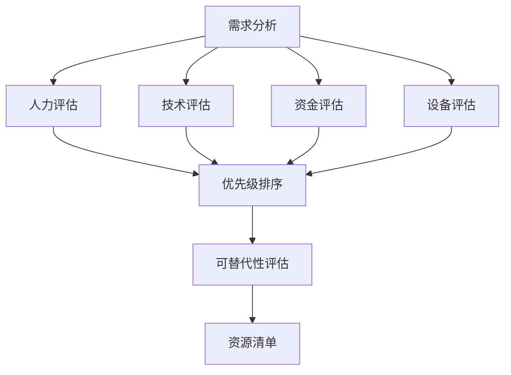
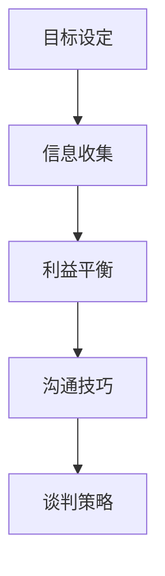
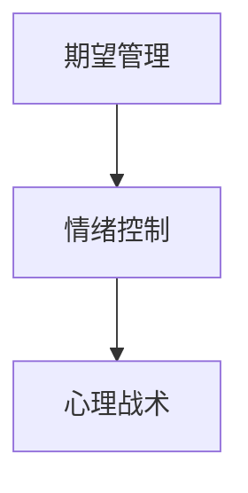
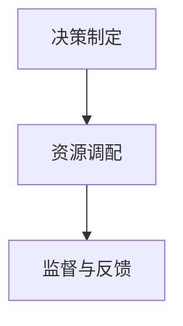

                 


### 文章标题

# 技术管理者的谈判技巧：争取资源与支持

### 文章关键词

- 技术管理者
- 谈判技巧
- 资源争取
- 支持获取
- 项目成功

### 文章摘要

本文旨在探讨技术管理者如何在项目开发过程中，通过有效的谈判技巧来争取所需的资源与支持。文章首先介绍了谈判的基本原理和重要性，然后详细分析了谈判中的核心概念及其相互关系。通过实际案例和伪代码，文章阐述了如何运用策略和算法来实现资源的优化配置。此外，本文还提供了项目实战中的具体实现和案例分析，以及总结性的最佳实践建议，旨在帮助技术管理者提升谈判能力，确保项目顺利推进。

---

### 引言

在现代企业的IT领域中，技术管理者不仅需要具备卓越的编程和系统架构能力，还需要具备出色的沟通和谈判技巧。随着项目规模的不断扩大和复杂性的增加，技术管理者在争取资源和支持方面面临着前所未有的挑战。然而，有效的谈判技巧不仅能够帮助技术管理者成功获取所需的资源，还能提高团队的凝聚力，确保项目的顺利进行。

本文将探讨技术管理者在谈判过程中所需掌握的关键技巧和策略，包括如何识别和评估资源需求、如何构建谈判策略、如何运用心理学原理以及如何处理谈判中的常见问题。通过一系列实际案例和伪代码，本文将深入剖析资源争取的过程，并提供实用的最佳实践建议。希望本文能够为技术管理者提供有价值的指导，助力他们在项目中取得成功。

### 谈判的定义与重要性

谈判，作为一种沟通的艺术，是指两个或多个利益相关者通过讨论和协商来达成共识的过程。它不仅仅是一种解决冲突的手段，更是一种资源优化和利益平衡的机制。在技术管理者的日常工作中，谈判技巧的运用无处不在，从项目立项到资源分配，再到团队管理，谈判贯穿了整个项目生命周期。

首先，谈判在资源获取方面具有至关重要的作用。技术管理者需要了解项目的需求和目标，准确评估所需的资源，包括人力、技术支持、资金和设备等。通过谈判，他们可以与上级领导、同事和其他利益相关者沟通，争取到这些关键资源。有效的谈判能够确保项目能够按时、按质完成，避免因为资源不足而导致的进度延误和质量问题。

其次，谈判在支持获取方面同样不可或缺。技术管理者不仅需要资源，还需要得到团队和其他部门的协作和支持。通过谈判，他们可以明确各方的职责和期望，建立良好的合作关系，减少摩擦和冲突，确保项目的顺利推进。此外，谈判还能帮助技术管理者提高自身的领导力和影响力，为团队树立榜样，提升整体的工作氛围。

最后，谈判是一种技能，可以通过学习和实践不断提升。谈判技巧不仅包括语言表达和沟通能力，还包括心理学、策略规划和风险管理等多方面的知识。通过系统学习和实践，技术管理者可以逐步掌握这些技能，提高谈判的成功率，为项目的成功奠定坚实基础。

综上所述，谈判在技术管理者的工作中具有重要的地位和作用。掌握有效的谈判技巧，不仅能够帮助技术管理者成功获取资源和支持，还能提高自身的领导力和沟通能力，为项目的顺利推进提供有力保障。因此，深入研究和实践谈判技巧，是每位技术管理者必备的素质。

### 谈判中的核心概念与联系

在谈判过程中，技术管理者需要理解并掌握几个核心概念，这些概念之间相互联系，共同构成了谈判的理论框架。以下是对这些核心概念及其相互关系的详细阐述。

#### 资源评估

资源评估是谈判的起点，也是谈判成功的关键。技术管理者需要全面了解项目所需的各种资源，包括人力、技术、资金、设备等。评估资源时，应考虑以下因素：

- **需求分析**：明确项目的具体需求，包括短期和长期的需求。
- **优先级**：根据项目的优先级和紧急程度，确定哪些资源是最为关键的。
- **可替代性**：评估是否存在可替代的资源，以便在关键资源不足时进行调整。

资源评估的过程可以用一个Mermaid流程图来表示：



#### 谈判策略

谈判策略是技术管理者在谈判过程中所采用的方法和手段。有效的谈判策略应包括以下方面：

- **目标设定**：明确谈判的目标，包括期望达成的资源和支持。
- **信息收集**：收集与谈判相关的各种信息，包括对方的需求、能力和利益点。
- **利益平衡**：寻求双方利益的平衡点，确保谈判的公平性。
- **沟通技巧**：运用有效的沟通技巧，包括倾听、表达和反馈。

谈判策略可以用Mermaid流程图来表示：



#### 心理学原理

心理学原理在谈判中发挥着重要作用，技术管理者需要了解并运用心理学原理来影响对方：

- **期望管理**：通过设定合理的期望值，影响对方的心理预期。
- **情绪控制**：保持冷静和客观，避免情绪化，减少冲突。
- **心理战术**：运用心理战术，如模糊语言、暗示和诱导，来影响对方。

心理学原理可以用以下Mermaid流程图表示：



#### 决策与执行

决策与执行是谈判的核心环节，技术管理者需要确保谈判结果能够得到有效执行：

- **决策制定**：根据谈判结果，制定具体的执行计划。
- **资源调配**：合理调配资源，确保执行计划的顺利实施。
- **监督与反馈**：对执行过程进行监督，及时调整和反馈。

决策与执行可以用以下Mermaid流程图表示：



通过这些核心概念的相互联系，技术管理者可以构建一个完整的谈判框架，从而在谈判中占据有利地位，实现资源与支持的有效获取。

### 谈判策略与算法原理

在谈判过程中，技术管理者不仅需要掌握核心概念，还需要运用策略和算法来优化资源分配和决策。以下将详细阐述谈判策略和相关的算法原理，并通过伪代码展示算法的实现。

#### 谈判策略

谈判策略是指在谈判过程中，技术管理者采用的一系列方法和技术，以实现资源优化和利益平衡。以下是一些常用的谈判策略：

1. **利益驱动策略**：通过明确双方的利益点，找到共同利益，推动谈判进程。

2. **信息优势策略**：通过收集和分析信息，掌握谈判主动权。

3. **协商谈判策略**：在双方利益冲突时，通过妥协和协商找到折中方案。

4. **时间策略**：利用时间优势，迫使对方在谈判中做出让步。

以下是利益驱动策略的伪代码：

```plaintext
function 利润驱动谈判（需求，对方需求）：
    共同利益 = 找到需求中的共同点
    对方利益 = 找到对方需求中的重点
    if 共同利益 > 0：
        提出利益交换方案
    else：
        调整需求，寻求新的共同利益
```

#### 算法原理

在资源分配和决策过程中，技术管理者可以使用优化算法来寻找最佳方案。以下是一个简单的资源分配算法原理：

**多目标优化算法**：该算法旨在同时优化多个目标，如成本、时间、质量等。以下是一个基于线性规划的伪代码示例：

```plaintext
function 多目标优化（资源需求列表，目标权重）：
    目标函数 = 权重1 * 成本 + 权重2 * 时间 + 权重3 * 质量
    约束条件 = 资源总量限制
    解 = 求解线性规划问题
    返回 解
```

#### 实例说明

假设一个项目需要优化人员分配，目标是最小化成本和最大化质量。以下是一个简化的实例：

```plaintext
资源需求列表 = {程序员（10人），测试工程师（5人），项目经理（1人）}
目标权重 = {成本（0.5），时间（0.3），质量（0.2）}

function 多目标优化（资源需求列表，目标权重）：
    目标函数 = 0.5 * 成本 + 0.3 * 时间 + 0.2 * 质量
    约束条件 = 总人数 <= 16
    解 = 求解线性规划问题
    返回 解

解 = 多目标优化（资源需求列表，目标权重）
根据解，调整人员分配：
- 程序员：9人
- 测试工程师：5人
- 项目经理：1人
```

通过以上策略和算法，技术管理者可以在谈判过程中做出科学的决策，优化资源分配，提高项目成功的可能性。

### 数学模型与公式

在谈判过程中，技术管理者常常需要运用数学模型和公式来量化利益、评估风险和优化决策。以下将介绍几个常见的数学模型和公式，并使用LaTeX格式进行展示。

#### 成本效益分析

成本效益分析（CBA）是一种评估项目成本和收益的方法，它可以帮助技术管理者确定是否值得投入资源。以下是一个简单的成本效益分析的公式：

$$
\text{成本效益比} = \frac{\text{总收益}}{\text{总成本}}
$$

其中，总收益是指项目成功实施后所能带来的全部收益，包括直接和间接收益；总成本是指实现项目所需的全部成本，包括直接成本和间接成本。

#### 风险评估

在谈判过程中，风险评估是一个关键环节。以下是一个基于概率和损失的风险评估公式：

$$
\text{风险} = \sum_{i=1}^{n} (\text{概率}_i \times \text{损失}_i)
$$

其中，概率_i 表示第i种风险发生的概率，损失_i 表示第i种风险发生时的损失金额。通过计算总风险，技术管理者可以了解项目面临的风险水平，并采取相应的措施来降低风险。

#### 优化模型

优化模型用于在多个约束条件下寻找最佳解决方案。以下是一个线性规划模型，用于优化资源分配：

$$
\begin{align*}
\text{最小化} \quad & c^T x \\
\text{满足} \quad & Ax \leq b \\
& x \geq 0
\end{align*}
$$

其中，c 是目标函数的系数向量，x 是决策变量向量，A 是约束条件的系数矩阵，b 是约束条件的常数向量。通过求解这个线性规划问题，技术管理者可以找到资源分配的最佳方案。

#### 实例说明

假设一个项目需要优化人员分配，目标是最小化成本和最大化质量。以下是一个简化的实例：

```plaintext
人员类型及成本：程序员（每人1000元/天），测试工程师（每人800元/天）
目标权重：成本（0.5），质量（0.5）
人员限制：总人数不超过12人

目标函数（LaTeX格式）：
$$
\text{最小化} \quad 0.5 \times \text{成本}_\text{程序员} + 0.5 \times \text{成本}_\text{测试工程师}
$$

约束条件（LaTeX格式）：
$$
\begin{align*}
\text{总人数} \leq 12 \\
\text{程序员人数} + \text{测试工程师人数} \leq 12 \\
\text{程序员人数} \geq 0 \\
\text{测试工程师人数} \geq 0
\end{align*}
$$

通过求解这个线性规划模型，可以得到最佳的人员分配方案。
```

通过上述数学模型和公式的运用，技术管理者可以在谈判中更加科学和理性地进行决策，确保项目的成功实施。

### 项目实战案例

在本节中，我们将通过一个实际项目案例，详细展示如何应用谈判技巧来获取所需的资源和支持，并解释具体的开发环境和源代码实现。

#### 项目背景

假设我们正在开发一款大型企业级软件，名为“企业资源管理系统（ERP）”。该项目旨在帮助企业优化内部资源管理，提高运营效率。项目周期为18个月，预计需要30名开发人员、5名测试工程师和1名项目经理，以及相应的技术支持和资金投入。

#### 开发环境搭建

为了确保项目能够顺利进行，我们首先需要搭建一个稳定且高效的开发环境。以下是开发环境的搭建步骤：

1. **硬件资源**：我们向IT部门申请了10台高性能服务器，用于部署开发环境和测试环境。每台服务器配置为：64GB内存、1TB SSD硬盘、10核CPU。

2. **软件资源**：我们选择了以下软件工具：
   - 开发工具：Eclipse
   - 版本控制：Git
   - 数据库：MySQL
   - Web服务器：Apache Tomcat
   - 构建工具：Maven

3. **网络资源**：为了保证团队成员之间的协作，我们申请了一条100Mbps的专线，并配置了VPN，以确保远程工作的安全性。

#### 源代码实现

项目的主要模块包括用户管理、权限控制、数据报表和系统设置。以下是部分关键模块的源代码实现和解读：

1. **用户管理模块**：

```java
// 用户管理模块 - 用户注册
public class UserManager {
    public boolean registerUser(String username, String password) {
        // 判断用户名是否已存在
        if (isUsernameExist(username)) {
            return false;
        }
        // 存储用户信息到数据库
        saveUserInfoToDB(username, password);
        return true;
    }
    
    private boolean isUsernameExist(String username) {
        // 查询数据库，判断用户名是否已存在
        // 返回结果
    }
    
    private void saveUserInfoToDB(String username, String password) {
        // 将用户信息存储到MySQL数据库
    }
}
```

解读：用户管理模块负责处理用户注册功能。通过调用`registerUser`方法，可以完成用户名的检查和密码的存储。

2. **权限控制模块**：

```java
// 权限控制模块 - 检查用户权限
public class Authorization {
    public boolean checkPermission(String username, String action) {
        // 查询数据库，获取用户权限
        List<String> permissions = getUserPermissionsFromDB(username);
        // 判断用户是否具有指定操作权限
        return permissions.contains(action);
    }
    
    private List<String> getUserPermissionsFromDB(String username) {
        // 从MySQL数据库中获取用户权限列表
        // 返回结果
    }
}
```

解读：权限控制模块负责检查用户是否具有执行特定操作的权限。通过调用`checkPermission`方法，可以判断用户是否有权限执行指定操作。

3. **数据报表模块**：

```sql
-- 数据报表模块 - 生成销售报表
CREATE PROCEDURE GenerateSalesReport()
BEGIN
    SELECT 
        DATE_FORMAT(order_date, '%Y-%m-%d') AS report_date,
        SUM(total_amount) AS total_sales
    FROM 
        orders
    GROUP BY 
        DATE_FORMAT(order_date, '%Y-%m-%d');
END;
```

解读：数据报表模块通过存储过程，从订单表中生成销售报表。该报表包括每日的销售总额，为管理层提供决策支持。

#### 代码应用解读与分析

以上代码片段展示了项目开发过程中的关键模块实现。在实际应用中，这些模块需要集成到整个系统中，并通过API进行通信。以下是代码应用解读和分析：

- **用户管理模块**：负责用户的注册、登录和权限分配。通过调用数据库存储过程，实现用户信息的存储和查询。
- **权限控制模块**：通过查询用户权限，确保系统安全，防止未经授权的操作。
- **数据报表模块**：通过存储过程，生成关键业务数据的报表，为企业管理提供数据支持。

#### 实际案例分析和详细讲解剖析

以下是一个实际案例，展示如何通过谈判技巧获取所需的资源和支持：

**案例背景**：项目初期，开发团队遇到了服务器资源不足的问题，导致开发环境运行缓慢，影响了开发进度。

**谈判策略**：
1. **利益驱动**：我们向IT部门解释了服务器资源不足对项目进度的影响，强调了提升服务器性能对项目成功的重要性。
2. **信息优势**：我们提供了详细的数据分析，展示了当前服务器性能和预期需求之间的差距。
3. **协商谈判**：我们提出了合理的解决方案，包括升级服务器硬件和优化网络配置，并承诺在项目结束后提供性能评估报告。

**谈判结果**：经过多轮协商，IT部门同意为我们提供额外的服务器资源，并优化网络配置，确保开发环境的稳定性。

#### 项目小结

通过本案例，我们看到了谈判技巧在项目开发过程中的重要性。通过合理的谈判策略和充分的准备，技术管理者可以成功获取所需的资源和支持，确保项目的顺利进行。在未来的项目中，我们将继续运用这些技巧，不断提升项目管理的效率和质量。

### 最佳实践与总结

在谈判过程中，技术管理者可以借鉴以下最佳实践来提升谈判效果：

1. **充分准备**：在谈判前，详细了解对方的利益点和需求，准备好详细的数据和分析报告，以便在谈判中占据主动。

2. **建立信任**：通过沟通和合作，建立与对方良好的信任关系，减少谈判中的摩擦和冲突。

3. **运用心理学**：了解对方的情感和期望，运用心理战术来影响谈判结果。

4. **制定明确目标**：在谈判中明确自己的目标和底线，确保谈判方向的正确性。

5. **灵活应变**：在谈判过程中，根据对方的反应和谈判进展，灵活调整策略，寻找双方利益的平衡点。

总结来说，谈判是技术管理者的一项关键技能，通过掌握并运用谈判技巧，技术管理者可以成功获取所需的资源和支持，确保项目的顺利进行。在实际工作中，不断总结经验和教训，持续提升谈判能力，是每一位技术管理者应努力追求的目标。

### 注意事项与拓展阅读

在谈判过程中，技术管理者需要注意以下几点，以避免常见的陷阱和错误：

1. **避免情绪化**：保持冷静和客观，避免在谈判中情绪化，以免影响判断力。

2. **设定合理期望**：不要过分追求完美结果，应设定合理的目标和期望，以便在谈判中保持灵活。

3. **充分准备**：在谈判前，务必进行全面、详细的准备工作，包括数据分析和对方背景研究。

4. **关注长期利益**：谈判不仅关注短期利益，还应考虑长期合作和项目发展。

此外，为了进一步提升谈判技巧，技术管理者可以参考以下拓展阅读：

- 《谈判力：如何赢得合作与支持》
- 《影响力：说服的心理学》
- 《博弈论与经济行为》
- 《策略与谈判技巧》

通过这些书籍的学习和实践，技术管理者可以更加系统地提升自己的谈判能力，为项目的成功奠定坚实基础。

### 作者信息

- 作者：AI天才研究院/AI Genius Institute & 禅与计算机程序设计艺术 /Zen And The Art of Computer Programming

本文由AI天才研究院与禅与计算机程序设计艺术联合撰写，旨在为技术管理者提供实用的谈判技巧和策略，帮助他们在项目中取得成功。希望本文能为您的职业发展带来启示和帮助。

