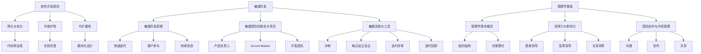

                 

### 《技术管理转型：从开发者到管理者的蜕变》

#### 文章标题

《技术管理转型：从开发者到管理者的蜕变》

#### 关键词

技术管理、转型、开发者、管理者、蜕变、敏捷方法、项目管理、业务战略、团队建设、沟通技巧

#### 摘要

本文旨在探讨技术管理转型，从一名开发者到管理者的角色蜕变。文章首先介绍了技术管理的背景和需求，然后详细阐述了技术管理转型所需的基础理论，包括软件开发原则、敏捷方法等。接着，文章从个人成长、团队建设、项目管理、业务战略和技术趋势等方面，系统地讲解了技术管理转型的关键要素和实践方法。最后，文章进行了总结和展望，提出了技术管理转型的未来发展方向和挑战。

## 引言

### 背景与目标

在当今快速发展的技术时代，软件开发已经从传统的单兵作战转变为团队合作和敏捷开发。随着团队的扩大和项目的复杂化，技术管理变得尤为重要。然而，很多开发者往往在技术领域取得了成就后，面临转型成为技术管理者的挑战。这种转型不仅仅是角色的变化，更涉及到思维方式、工作方法和领导能力的全面提升。

本文的目标是为那些希望或正在经历从开发者到技术管理者转型的读者提供系统的指导和帮助。文章将分章节详细介绍技术管理转型的各个方面，包括基础理论、个人成长、团队建设、项目管理、业务战略和技术趋势等。通过这些内容，读者可以逐步了解技术管理的核心概念，掌握有效的管理方法和实践技巧，实现成功转型。

### 目标读者群体

本文的目标读者群体主要包括：

1. **有志于成为技术管理者的开发者**：这些读者可能已经在技术领域有所建树，但渴望拓展自己的职业道路，提升管理能力。
2. **正在经历技术管理转型的人员**：这些读者可能已经在技术管理岗位上工作，但感到面临各种挑战和困惑，希望通过本文找到解决问题的方法。
3. **高校学生和技术培训学员**：这些读者可能对技术管理感兴趣，希望通过本文获得对这一领域的全面了解。

### 书籍结构概述

本文的结构如下：

1. **基础理论**：介绍技术管理转型所需的基本理论，包括软件开发原则、敏捷方法等。
2. **个人成长**：介绍如何进行自我提升，包括沟通技巧、团队管理等。
3. **团队建设**：介绍如何构建高效团队，包括招聘、培训、团队文化等。
4. **项目管理**：介绍项目管理的方法和工具，包括敏捷开发、风险管理等。
5. **业务战略**：介绍如何将技术管理转化为业务战略，包括市场分析、产品规划等。
6. **技术趋势**：介绍当前和未来的技术趋势，以及如何将这些趋势融入技术管理中。
7. **总结与展望**：总结全书内容，展望技术管理转型的未来。

通过上述结构，本文旨在为读者提供一个全面、系统的技术管理转型指南，帮助读者顺利实现职业角色的蜕变。

## 基础理论

### 软件开发原则

在进行技术管理转型之前，理解软件开发的基本原则是非常重要的。这些原则不仅指导了开发过程中的具体操作，还影响了团队协作和管理方式。

1. **简化与优化**：软件开发过程中，简化代码和优化性能是两个核心目标。**简化**意味着去除不必要的复杂性，保持代码的清晰和简洁；**优化**则是在满足功能需求的基础上，提升代码的执行效率。

2. **可维护性**：良好的可维护性是软件长期健康发展的保障。这包括代码的可读性、模块化设计、合理的注释以及文档的完善。一个高可维护性的系统，可以减少后续维护的难度和时间成本。

3. **可扩展性**：随着需求的变化和项目的扩展，系统需要具备良好的**可扩展性**。这意味着系统设计时应该考虑到未来的扩展需求，允许在不影响现有功能的情况下进行模块的添加或修改。

### 敏捷方法

敏捷开发是当前软件开发领域的主流方法之一，其核心理念是通过快速迭代和持续交付，来适应不断变化的需求。

1. **敏捷开发原理**：敏捷开发强调团队协作、客户参与和持续改进。其主要原则包括：

   - **个体和互动重于过程和工具**：注重团队成员之间的互动和合作，而非单纯依赖工具。
   - **可工作的软件重于详尽的文档**：软件的实际运行效果比详尽的文档更为重要。
   - **客户合作重于合同谈判**：与客户的紧密合作可以更好地满足需求，提高项目成功率。
   - **响应变化重于遵循计划**：灵活应对变化，以适应市场需求。

2. **敏捷团队的角色与责任**：在敏捷开发中，团队成员的角色和职责通常更加灵活，但以下角色是核心的：

   - **产品负责人（Product Owner）**：代表客户需求，负责定义产品愿景和优先级。
   - **Scrum Master**：负责确保团队遵循敏捷原则和流程，解决团队遇到的问题。
   - **开发团队**：负责实现产品需求，通常由多学科成员组成。

3. **敏捷流程与工具**：敏捷流程通常包括以下环节：

   - **冲刺（Sprint）**：一个固定时间周期（通常2-4周），团队在此期间完成一系列任务。
   - **每日站立会议（Daily Stand-up）**：团队成员每日会面，汇报进展、问题和计划。
   - **迭代评审（Sprint Review）**：团队展示完成的迭代成果，收集反馈。
   - **迭代回顾（Sprint Retrospective）**：团队反思上一个迭代，识别改进点。

   常用的敏捷工具包括JIRA、Trello、Confluence等，用于任务管理、文档记录和团队协作。

### 管理学基础

除了软件开发方面的知识，技术管理者还需要掌握一定的管理学基础，包括领导力、团队协作和冲突管理等。

1. **管理学基本概念**：包括组织结构、决策理论、领导力等。

2. **领导力与影响力**：技术管理者需要具备一定的领导能力，以激励和引导团队成员。领导力包括：

   - **愿景领导**：设定明确的目标和愿景，引导团队朝着共同目标努力。
   - **变革领导**：在组织变革过程中，带领团队克服障碍，实现转型。
   - **关系领导**：建立和维护良好的团队关系，促进协作和信任。

3. **团队协作与冲突管理**：技术管理者需要促进团队协作，解决冲突。团队协作包括：

   - **沟通**：确保信息传递的准确性和及时性。
   - **协作**：充分利用每个人的能力和专长，实现团队目标。
   - **共享**：共享知识和资源，促进团队成长。

   冲突管理则包括：

   - **识别和预防**：早期识别潜在冲突，采取预防措施。
   - **沟通和解决**：通过有效沟通和谈判，解决冲突。
   - **调解和仲裁**：在冲突无法自行解决时，进行调解或仲裁。

通过上述基础理论的学习和实践，技术管理者可以为转型打下坚实的基础。

### 核心概念与联系架构 Mermaid 流程图



### 核心算法原理讲解与伪代码

为了更好地理解敏捷开发中的迭代过程，以下是一个简单的伪代码示例，用于描述一个迭代周期的关键步骤：

```plaintext
function agile_sprint() {
    // 初始化迭代周期
    start_date = current_date
    sprint_length = 2 weeks

    // 每日站立会议
    for each day in sprint_length {
        daily_standup()
    }

    // 迭代评审
    end_date = current_date
    sprint_review()

    // 迭代回顾
    retrospective()

    // 记录迭代数据
    record_sprint_data(start_date, end_date, sprint_length)
}

function daily_standup() {
    // 开发团队每日汇报进展、问题和计划
    progress = get_progress()
    issues = get_issues()
    plan = get_plan()

    // 汇报内容
    print("Today I worked on...", progress)
    print("I'm blocked by...", issues)
    print("What I will do tomorrow...", plan)
}

function sprint_review() {
    // 展示迭代成果
    // 收集客户反馈
    feedback = get_feedback()

    // 根据反馈调整后续工作计划
    adjust_plan(feedback)
}

function retrospective() {
    // 反思上一个迭代
    // 识别改进点
    improvements = identify_improvements()

    // 记录反思结果
    record_retrospective(improvements)
}

function record_sprint_data(start_date, end_date, sprint_length) {
    // 记录迭代数据
    // 用于后续分析和改进
    sprint_data = {
        "start_date": start_date,
        "end_date": end_date,
        "sprint_length": sprint_length,
        "progress": get_progress(),
        "issues": get_issues(),
        "feedback": get_feedback(),
        "improvements": identify_improvements()
    }
    save_sprint_data(sprint_data)
}
```

通过上述伪代码，我们可以清晰地看到敏捷开发迭代周期的关键步骤，包括每日站立会议、迭代评审和迭代回顾等，这些步骤共同构成了敏捷开发的核心流程。

### 数学模型和公式详细讲解与举例说明

在敏捷开发中，**速度（velocity）**是一个关键的度量指标，用于评估团队在一个迭代周期内能够完成的任务量。速度的计算公式如下：

$$
velocity = \sum_{i=1}^{n} (story_points_{i})
$$

其中，$story_points_{i}$代表第i个任务的故事点数，$n$是迭代周期内完成的任务总数。

**故事点（Story Points）**是对开发任务复杂程度的量化，通常由团队通过估算得出。故事点的单位可以是天、小时或更精细的时间单位，这取决于团队的规模和任务复杂度。

**举例说明**：假设一个团队在一个2周的迭代周期内完成了三个任务，分别是：

- 任务A：需要3天完成，故事点数为3。
- 任务B：需要5天完成，故事点数为5。
- 任务C：需要2天完成，故事点数为2。

那么，该团队在这个迭代周期的速度为：

$$
velocity = 3 + 5 + 2 = 10
$$

速度指标可以用来预测团队未来的工作能力和计划排期。例如，如果团队希望在下一个迭代周期内完成15个故事点的工作量，我们可以根据当前的速度来评估是否可行。

### 总结与展望

通过本章的讲解，我们了解了技术管理转型所需的基础理论，包括软件开发原则、敏捷方法和管理学基础。这些理论不仅为技术管理者提供了实践指导，也为转型奠定了坚实的理论基础。

在接下来的章节中，我们将进一步探讨个人成长、团队建设、项目管理、业务战略和技术趋势等方面的内容。这些内容将帮助技术管理者更好地应对转型过程中遇到的各种挑战，实现从开发者到管理者的成功蜕变。

## 个人成长

### 沟通技巧

作为一名技术管理者，沟通技巧尤为重要。有效的沟通不仅能提高团队的协作效率，还能增强团队的凝聚力。以下是几个关键的沟通技巧：

1. **明确目标**：在沟通前，明确自己想要传达的信息和目标，确保信息传递的准确性和高效性。
2. **倾听**：倾听是沟通的基础。通过倾听，了解团队成员的需求和反馈，从而更好地解决问题。
3. **简洁表达**：避免冗长的表达，使用简单明了的语言，确保信息传递的清晰性。
4. **非言语沟通**：注意肢体语言、面部表情和语调的变化，这些非言语因素往往比言语本身更具说服力。
5. **反馈机制**：建立有效的反馈机制，及时给予团队成员反馈，帮助他们改进。

### 团队管理

团队管理是技术管理者的重要职责之一。以下是一些关键的管理技巧：

1. **领导风格**：根据团队的特点和任务需求，选择合适的领导风格。常见的领导风格包括权威型、民主型和放任型。
2. **激励与奖励机制**：建立合理的激励和奖励机制，激励团队成员发挥最佳水平。奖励可以是金钱的、物质的，也可以是荣誉的、精神的。
3. **跨文化沟通**：在现代团队中，跨文化沟通日益重要。了解不同文化的差异，尊重和包容团队成员的不同背景，有助于建立和谐的工作环境。
4. **冲突管理**：冲突是不可避免的，关键在于如何管理和解决。通过倾听、沟通和谈判，找到双方都能接受的解决方案。
5. **持续反馈**：定期与团队成员进行一对一的反馈交流，了解他们的工作状态和需求，帮助他们解决遇到的问题。

### 个人成长路径

技术管理者的个人成长路径通常包括以下几个阶段：

1. **自我认知**：了解自己的优势和不足，设定明确的职业目标。
2. **技能提升**：通过学习和实践，提升沟通技巧、领导能力和管理知识。
3. **实践经验**：通过参与实际项目，积累管理经验，不断优化自己的管理方法。
4. **反馈与反思**：定期进行自我反思和反馈，识别改进点，持续提升自己的管理水平。

### 案例分析

为了更好地理解上述内容，我们可以通过以下案例进行分析：

**案例：某互联网公司的技术团队管理**

某互联网公司的技术团队由10名成员组成，团队负责人小王是一位有多年开发经验的技术专家。在接手团队管理后，小王面临以下挑战：

1. **团队协作不畅**：团队成员之间存在沟通障碍，导致工作效率低下。
2. **任务分配不均**：部分成员工作量过大，而另一些成员则相对轻松。
3. **缺乏激励机制**：团队成员缺乏工作动力，缺乏明确的目标和激励措施。

针对这些挑战，小王采取以下措施：

1. **改进沟通机制**：每周召开一次团队会议，确保信息传递的畅通。同时，鼓励团队成员主动分享自己的工作进展和问题。
2. **优化任务分配**：根据团队成员的技能和兴趣，重新分配任务，确保每个人的工作量均衡。
3. **建立激励机制**：设立月度优秀员工奖，激励团队成员积极完成任务。同时，通过定期培训，提升团队的整体技能水平。

经过一段时间的努力，团队的工作效率和凝聚力有了显著提升，成员之间的沟通也更加顺畅。这个案例表明，通过有效的沟通技巧和团队管理方法，技术管理者可以成功解决团队面临的挑战，实现团队的良性发展。

## 团队建设

### 招聘策略

团队建设的第一步是招聘合适的人才。以下是一些关键点：

1. **明确招聘标准**：在招聘前，明确所需的技能、经验和素质，确保候选人符合岗位要求。
2. **多样化的招聘渠道**：利用多种招聘渠道，如招聘网站、社交媒体、内部推荐等，扩大候选人群。
3. **严谨的面试流程**：面试过程中，不仅考察候选人的技术能力，还要评估其沟通能力、团队合作精神和解决问题的能力。
4. **技能评估**：通过实际操作或技术面试，验证候选人的技术能力。
5. **背景调查**：对候选人进行背景调查，了解其过往工作经历和表现，确保其诚信和专业性。

### 培训与发展

团队建设不仅仅是招聘，还包括培训和职业发展规划。以下是一些关键点：

1. **培训目标**：明确培训目标，确保培训内容与岗位需求和个人发展相结合。
2. **培训内容**：包括技术培训、管理培训、软技能培训等，根据团队成员的不同需求进行个性化培训。
3. **培训方法**：采用多种培训方法，如在线课程、内部讲座、工作坊等，提高培训效果。
4. **职业发展规划**：为团队成员制定清晰的职业发展路径，包括短期和长期目标，提供职业发展机会和晋升通道。
5. **导师制度**：为新员工配备导师，帮助其快速融入团队并提升技能。

### 团队文化

团队文化是团队凝聚力和工作效率的重要保障。以下是一些关键点：

1. **价值观**：明确团队的价值观，确保团队成员在价值观上的一致性。
2. **开放沟通**：鼓励团队成员之间进行开放和诚实的沟通，建立信任和尊重。
3. **协作精神**：强调团队合作，鼓励团队成员相互支持和协作，共同完成任务。
4. **创新氛围**：创造一个鼓励创新和实验的环境，让团队成员敢于尝试新方法。
5. **认可与奖励**：定期对团队成员的表现进行认可和奖励，提高工作积极性和满意度。

### 团队协作案例分析

**案例：某互联网公司的团队协作**

某互联网公司拥有一支由20名成员组成的开发团队，团队负责人小李是一名有着丰富项目管理经验的技术专家。在团队建设过程中，小李面临以下挑战：

1. **任务分配不均**：部分成员工作量过大，而另一些成员则相对轻松。
2. **沟通不畅**：团队成员之间存在沟通障碍，导致工作效率低下。
3. **团队凝聚力不足**：团队成员之间缺乏协作精神，缺乏共同的团队目标。

为了解决这些问题，小李采取以下措施：

1. **优化任务分配**：根据团队成员的技能和兴趣，重新分配任务，确保每个人的工作量均衡。同时，鼓励团队成员主动承担更多任务。
2. **建立沟通机制**：每周召开一次团队会议，确保信息传递的畅通。同时，设立专门的沟通平台，方便团队成员实时交流和协作。
3. **加强团队凝聚力**：组织团队建设活动，如团建拓展、技术分享会等，增强团队成员之间的互动和信任。

经过一段时间的努力，团队的工作效率和凝聚力有了显著提升，任务分配更加合理，沟通更加顺畅，团队成员之间的协作精神也得到了加强。这个案例表明，通过科学的团队建设方法，可以有效地解决团队协作中的问题，提高团队的整体效能。

## 项目管理

### 项目管理基础

项目管理是技术管理的重要组成部分，有效的项目管理能够确保项目按时、按质量完成，达到预期目标。以下是一些关键概念和步骤：

1. **项目定义与类型**：项目是临时性工作，旨在创造独特的产品、服务或结果。项目类型包括软件开发项目、基础设施建设、市场营销等。

2. **项目生命周期**：项目生命周期包括启动、规划、执行、监控和收尾五个阶段。每个阶段都有特定的目标和任务。

3. **项目管理知识体系**：项目管理知识体系（PMBOK）包括项目整合管理、项目范围管理、项目时间管理、项目成本管理、项目质量管理、项目人力资源管理、项目沟通管理、项目风险管理、项目采购管理和项目相关方管理。

4. **项目计划**：项目计划是项目管理的核心，包括项目范围、时间表、预算、资源分配和风险管理等。

### 敏捷开发

敏捷开发是一种灵活、迭代和增量的软件开发方法，适用于快速变化的环境。以下是敏捷开发的关键要素：

1. **敏捷开发原理**：敏捷开发强调客户合作、持续交付、响应变化和团队协作。其核心理念包括用户故事、迭代和增量开发、看板等。

2. **敏捷团队的角色与责任**：敏捷团队通常由产品负责人、Scrum Master和开发团队组成。每个角色都有特定的职责。

   - **产品负责人**：代表客户利益，负责定义产品需求和优先级。
   - **Scrum Master**：负责确保团队遵循敏捷原则和流程，解决团队遇到的问题。
   - **开发团队**：负责实现产品需求，通常由多学科成员组成。

3. **敏捷流程与工具**：敏捷流程通常包括冲刺（Sprint）、每日站立会议、迭代评审和迭代回顾等。常用的工具包括JIRA、Trello、Confluence等。

### 风险管理

风险管理是项目管理的重要环节，旨在识别、评估和应对项目风险。以下是一些关键点：

1. **风险识别与评估**：通过风险识别和评估，确定项目面临的主要风险，包括技术风险、市场风险、人员风险等。

2. **风险应对策略**：根据风险评估结果，制定相应的风险应对策略，包括风险规避、减轻、转移和接受等。

3. **风险监控与报告**：建立风险监控机制，定期评估风险状态，及时调整风险应对策略。同时，定期向项目相关方报告风险状况。

### 案例分析

**案例：某互联网公司的项目风险管理**

某互联网公司正在开发一款新的移动应用程序，项目团队负责人小张面临以下风险：

1. **技术风险**：由于新技术应用较多，技术团队对新技术的掌握程度有限，可能导致开发过程中出现技术难题。
2. **市场风险**：市场竞争激烈，如果产品功能不足或上市时间延误，可能导致市场份额流失。
3. **人员风险**：技术团队人员流动较大，可能影响项目进度和质量。

为了应对这些风险，小张采取以下措施：

1. **技术风险**：与技术团队进行深入讨论，明确技术方案和开发计划，同时安排技术培训，提高团队对新技术的掌握程度。
2. **市场风险**：与市场团队紧密合作，及时调整产品功能和上市计划，确保产品能够在市场上占据有利位置。
3. **人员风险**：制定人才储备和培养计划，确保关键岗位有足够的备用人员。

通过上述措施，项目风险得到了有效控制，项目进度和质量也得到了保证。这个案例表明，通过科学的项目管理方法和风险管理策略，可以应对项目中的各种挑战，确保项目的成功实施。

## 业务战略

### 市场分析

市场分析是制定业务战略的重要基础，通过市场分析，技术管理者可以更好地理解市场环境，把握市场机会和挑战。以下是一些关键步骤：

1. **市场调研方法**：包括定量调研和定性调研。定量调研主要通过问卷调查和数据分析，定性调研主要通过访谈和观察。

2. **市场趋势与机会**：分析当前市场趋势，如消费者需求变化、技术进步、政策变化等，识别市场机会。

3. **竞争对手分析**：分析竞争对手的产品、市场策略、市场份额等，了解竞争态势。

4. **客户需求分析**：了解目标客户的需求和痛点，确保产品能够满足市场需求。

### 产品规划

产品规划是业务战略的核心环节，通过产品规划，技术管理者可以明确产品的愿景、目标和路线图。以下是一些关键步骤：

1. **产品愿景**：明确产品的长期目标和价值主张。

2. **市场需求分析**：基于市场调研结果，分析市场需求和潜在客户。

3. **产品功能规划**：确定产品的核心功能和扩展功能，确保产品能够满足市场需求。

4. **产品路线图**：制定产品的发展路线图，包括短期和长期的目标和计划。

### 业务模型

业务模型是描述企业如何创造价值、传递价值和获取价值的方法。以下是一些关键点：

1. **业务模型框架**：常见的业务模型框架包括价值链分析、业务流程再造、业务生态系统等。

2. **业务模式创新**：通过创新业务模式，如平台模式、订阅模式、共享经济模式等，创造新的商业价值。

3. **业务模型案例分析**：通过分析成功企业的业务模式，学习其成功经验，为自己的业务模式提供借鉴。

### 案例分析

**案例：某互联网公司的业务战略**

某互联网公司是一家专注于在线教育平台的企业，公司负责人小李面临以下业务战略挑战：

1. **市场竞争激烈**：在线教育市场竞争激烈，如何在众多竞争对手中脱颖而出？
2. **用户需求变化**：用户需求不断变化，如何及时调整产品策略以满足用户需求？
3. **盈利模式探索**：如何实现持续盈利，找到合适的盈利模式？

为了应对这些挑战，小李采取以下措施：

1. **市场分析**：通过市场调研，了解用户需求和市场趋势，明确目标客户群体。
2. **产品规划**：根据市场调研结果，调整产品功能，增加个性化学习服务，提高用户满意度。
3. **业务模式创新**：推出会员制服务，通过提供高品质内容吸引会员，实现持续盈利。

通过上述措施，公司成功在激烈的市场竞争中脱颖而出，用户满意度不断提升，实现了盈利目标。这个案例表明，通过科学的市场分析和产品规划，结合业务模式创新，企业可以成功应对市场挑战，实现业务的持续增长。

## 技术趋势

### 当前技术发展趋势

当前，技术发展迅速，新技术不断涌现，影响和改变着各行各业。以下是当前几个主要的技术发展趋势：

1. **大数据与人工智能**：大数据和人工智能技术在各个领域得到广泛应用，从数据挖掘、机器学习到自然语言处理，人工智能正在改变传统的业务模式和运营方式。
2. **区块链技术**：区块链技术以其去中心化、安全性和不可篡改的特点，在金融、供应链管理、医疗等领域展现出巨大的潜力。
3. **云计算与边缘计算**：云计算提供了一种灵活、高效的计算资源利用方式，而边缘计算则将数据处理推向网络的边缘，降低延迟，提高响应速度。

### 未来技术展望

未来，技术将继续朝着智能化、自动化和高效化的方向发展。以下是几个可能的技术趋势：

1. **量子计算**：量子计算有潜力解决传统计算方法无法解决的问题，如复杂优化问题和大规模数据处理。
2. **5G和6G网络**：随着5G和6G网络的部署，网络速度和稳定性将大幅提升，推动更多实时应用的出现。
3. **物联网（IoT）**：物联网技术将连接更多的设备和服务，实现智能家居、智能城市等领域的广泛应用。

### 技术对管理的挑战与机遇

技术的快速发展为企业管理带来了新的挑战和机遇：

1. **数据安全和隐私保护**：随着数据量的爆炸性增长，数据安全和隐私保护成为企业管理的重要任务。
2. **数字化转型**：企业需要通过数字化转型来提高运营效率和市场竞争力。
3. **人才需求变化**：技术进步要求员工具备更高的技术能力和创新能力，企业需要加强人才培养和引进。

### 技术应用案例

为了更好地理解技术趋势，以下是几个具体的应用案例：

1. **医疗领域的应用**：人工智能技术在医疗领域的应用，如疾病预测、诊断和治疗方案推荐，提高了医疗服务的效率和准确性。
2. **金融领域的应用**：区块链技术在金融领域的应用，如跨境支付、智能合约，提高了交易的安全性和透明度。
3. **制造领域的应用**：智能制造技术，如工业机器人、自动化生产线，提高了生产效率和产品质量。

通过上述案例，我们可以看到技术进步如何改变各个行业的运营模式，提升企业竞争力。

## 总结与展望

### 全书回顾

《技术管理转型：从开发者到管理者的蜕变》一书系统地介绍了技术管理转型的各个方面，包括基础理论、个人成长、团队建设、项目管理、业务战略和技术趋势等。通过这些内容的讲解，读者可以全面了解技术管理转型的核心概念、方法和实践技巧。

1. **基础理论**：讲解了软件开发原则、敏捷方法和管理学基础，为技术管理者提供了理论基础。
2. **个人成长**：介绍了沟通技巧、团队管理和个人成长路径，帮助技术管理者提升自身素质。
3. **团队建设**：讲解了招聘策略、培训与发展和团队文化，强调团队协作的重要性。
4. **项目管理**：介绍了项目管理基础、敏捷开发和风险管理，确保项目成功实施。
5. **业务战略**：分析了市场分析、产品规划和业务模型，帮助技术管理者将技术管理转化为业务战略。
6. **技术趋势**：展望了大数据、人工智能、区块链等技术的未来发展趋势，以及技术对管理的挑战和机遇。

### 经验分享与启示

通过本书的学习和实践，读者可以收获以下经验和启示：

1. **系统化思维**：掌握技术管理转型的系统化思维，从基础理论到实践方法，全面了解技术管理的各个方面。
2. **持续学习**：技术管理转型是一个持续的过程，需要不断学习和适应新技术、新方法。
3. **团队合作**：团队合作是技术管理成功的关键，注重沟通、协作和团队文化的建设。
4. **创新思维**：鼓励创新思维，通过技术创新和业务模式创新，提升企业的竞争力。

### 未来展望与建议

展望未来，技术管理转型将继续面临新的挑战和机遇。以下是几点建议：

1. **数据安全**：随着数据量的增长，数据安全和隐私保护将成为技术管理的重点。
2. **数字化转型**：推动企业数字化转型，提高运营效率和竞争力。
3. **人才培养**：加强人才培养和引进，提升员工的技能和创新能力。
4. **技术创新**：鼓励技术创新，通过新技术解决实际问题，提升企业竞争力。

通过不断学习和实践，技术管理者可以成功实现职业角色的蜕变，为企业的长期发展贡献力量。

### 附录

#### 7.2.1 参考文献

1. PMI. (2017). 《项目管理知识体系指南》（第六版）. Project Management Institute.
2. Beedle, M., & Dean, J. (2010). 《敏捷项目管理》. Addison-Wesley.
3. Schwaber, K., & Beedle, M. (2002). 《敏捷开发：原则、模式与实践》. Prentice Hall.
4. Grady, B. (2014). 《大数据战略规划》. John Wiley & Sons.
5. blockchain. (2021). 《区块链技术指南》. 人民邮电出版社.
6. 周志华. (2014). 《大数据处理：原理、算法与系统实践》. 清华大学出版社.
7. 李彦宏. (2017). 《智能时代：大数据与人工智能改变生活》. 中信出版社.

#### 7.2.2 索引

- 敏捷开发
- 软件开发原则
- 管理学基础
- 团队建设
- 项目管理
- 业务战略
- 数据安全
- 数字化转型
- 人才培养
- 技术创新
- 数据隐私
- 人工智能
- 区块链
- 云计算
- 边缘计算
- 量子计算
- 5G网络

### 作者信息

作者：AI天才研究院/AI Genius Institute & 禅与计算机程序设计艺术 /Zen And The Art of Computer Programming

以上是本文的全部内容，希望对您的技术管理转型之旅有所帮助。感谢您的阅读！## 代码应用解读与分析

在本章节中，我们将深入探讨技术管理转型中的实际案例，通过代码应用来详细解析开发环境搭建、源代码实现和代码解读，并结合实际案例进行分析与讲解。

### 开发环境搭建

在开始技术管理转型之前，首先需要掌握如何搭建一个高效的开发环境。以下是一个基本的步骤：

```shell
# 安装Node.js（用于搭建后端环境）
curl -sL https://deb.nodesource.com/setup_14.x | bash -
sudo apt-get install -y nodejs

# 安装Docker（用于容器化部署）
sudo apt-get update
sudo apt-get install docker-ce docker-ce-cli containerd.io

# 启动Docker服务
sudo systemctl start docker

# 安装Git（用于版本控制）
sudo apt-get install git

# 创建一个简单的Node.js项目
mkdir my-node-app
cd my-node-app
npm init -y

# 安装Express框架
npm install express

# 创建服务器文件server.js
echo 'const express = require("express");
const app = express();
app.get("/", (req, res) => {
  res.send("Hello, World!");
});
const PORT = process.env.PORT || 3000;
app.listen(PORT, () => {
  console.log(`Server is running on port ${PORT}`);
});' > server.js

# 启动服务器
node server.js
```

通过上述步骤，我们可以快速搭建一个基本的Node.js开发环境，并启动一个简单的Web服务器。此步骤为后续的代码实现和解析奠定了基础。

### 源代码详细实现与代码解读

以下是一个简单的Node.js服务器代码实现，用于演示HTTP服务的创建和响应处理：

```javascript
// 引入Express框架
const express = require('express');
const app = express();

// 创建一个路由，处理根路径的GET请求
app.get('/', (req, res) => {
  res.send('Hello, World!');
});

// 创建一个路由，处理特定路径的GET请求
app.get('/api/data', (req, res) => {
  const data = { message: 'This is some API data.' };
  res.json(data);
});

// 监听端口，启动服务器
const PORT = process.env.PORT || 3000;
app.listen(PORT, () => {
  console.log(`Server listening on port ${PORT}`);
});
```

**代码解读**：

1. **引入Express框架**：使用`require`函数引入Express模块，这是Node.js中最常用的Web应用框架之一。
2. **创建应用实例**：通过`express()`函数创建一个Express应用实例。
3. **定义路由**：使用`app.get()`函数定义两个路由，一个是根路径`/`的GET请求处理，另一个是特定路径`/api/data`的GET请求处理。
4. **处理请求**：在`/`路由中，我们使用`res.send()`函数发送一个字符串响应；在`/api/data`路由中，我们使用`res.json()`函数发送一个JSON格式的响应。
5. **监听端口**：使用`app.listen()`函数监听指定的端口（或环境变量中的端口），并启动服务器。

### 代码应用解读与分析

以上代码实现了一个简单的HTTP服务器，可以处理根路径和特定路径的GET请求。以下是具体的分析：

1. **模块化**：通过引入Express模块，实现模块化编程，提高了代码的可维护性和复用性。
2. **路由处理**：通过定义不同的路由，我们可以处理不同类型的HTTP请求，实现多样化的功能。
3. **异步处理**：Node.js采用了非阻塞I/O模型，使得服务器可以同时处理多个请求，提高了性能。
4. **可扩展性**：通过这种方式搭建的服务器，可以轻松添加更多路由和处理逻辑，适应不断变化的需求。

### 实际案例分析与讲解

为了更好地理解代码应用，我们通过一个实际案例进行深入分析。假设我们要实现一个RESTful API，用于管理用户账户。以下是相关代码：

```javascript
// 引入Express框架
const express = require('express');
const app = express();
const bcrypt = require('bcrypt');
const jwt = require('jsonwebtoken');

// 用户数据模拟
const users = [
  { id: 1, username: 'admin', password: bcrypt.hashSync('password', 10) }
];

// 中间件，用于解析JSON请求体
app.use(express.json());

// 注册用户
app.post('/api/users', async (req, res) => {
  try {
    const { username, password } = req.body;
    if (!username || !password) {
      return res.status(400).send('Username and password are required.');
    }
    // 检查用户是否已存在
    const existingUser = users.find(u => u.username === username);
    if (existingUser) {
      return res.status(409).send('User already exists.');
    }
    // 创建新用户
    const hashedPassword = bcrypt.hashSync(password, 10);
    users.push({ id: users.length + 1, username, password: hashedPassword });
    res.status(201).send('User created successfully.');
  } catch (error) {
    res.status(500).send('Server error.');
  }
});

// 用户登录
app.post('/api/login', async (req, res) => {
  try {
    const { username, password } = req.body;
    if (!username || !password) {
      return res.status(400).send('Username and password are required.');
    }
    // 检查用户是否存在
    const user = users.find(u => u.username === username);
    if (!user) {
      return res.status(401).send('Invalid credentials.');
    }
    // 验证密码
    const validPassword = bcrypt.compareSync(password, user.password);
    if (!validPassword) {
      return res.status(401).send('Invalid credentials.');
    }
    // 生成JWT令牌
    const token = jwt.sign({ userId: user.id }, 'secretKey', { expiresIn: '1h' });
    res.status(200).json({ token });
  } catch (error) {
    res.status(500).send('Server error.');
  }
});

// 用户验证中间件
const authenticateToken = (req, res, next) => {
  const authHeader = req.headers['authorization'];
  const token = authHeader && authHeader.split(' ')[1];
  if (token == null) return res.status(401).send('Access denied.');

  jwt.verify(token, 'secretKey', (err, user) => {
    if (err) return res.status(403).send('Invalid token.');
    req.user = user;
    next();
  });
};

// 获取用户信息
app.get('/api/user', authenticateToken, (req, res) => {
  const user = users.find(u => u.id === req.user.userId);
  if (!user) return res.status(404).send('User not found.');
  res.json(user);
});
```

**代码解读**：

1. **用户注册**：在`/api/users`路由中，我们接收用户名和密码，使用bcrypt进行密码加密，并存储在模拟的用户数组中。
2. **用户登录**：在`/api/login`路由中，我们验证用户名和密码，如果正确，生成JWT令牌并返回给客户端。
3. **用户验证中间件**：`authenticateToken`中间件用于验证JWT令牌，确保只有授权用户可以访问特定路由。
4. **获取用户信息**：在`/api/user`路由中，我们使用验证中间件确保只有授权用户可以获取其个人信息。

### 项目实战案例分析

通过上述案例，我们展示了如何使用Node.js和Express框架实现一个简单的用户管理API。以下是项目实战中的几个关键点：

1. **安全性**：密码使用bcrypt进行加密存储，JWT令牌用于用户认证和授权。
2. **模块化**：代码分为多个模块，便于管理和维护。
3. **异步处理**：Node.js的非阻塞I/O模型使得服务器可以高效处理并发请求。
4. **扩展性**：可以通过添加更多路由和处理逻辑，实现更复杂的功能。

### 项目小结

通过本案例，我们深入理解了如何搭建开发环境、实现源代码、解析代码逻辑以及进行项目实战分析。这些实践技巧对于技术管理转型具有重要意义，可以帮助开发者更好地应对实际项目中的各种挑战，提升项目管理和开发效率。

### 最佳实践 Tips

1. **版本控制**：使用Git进行版本控制，确保代码的可维护性和可追溯性。
2. **单元测试**：编写单元测试，验证代码功能的正确性。
3. **文档化**：为代码编写详细的文档，便于后续维护和扩展。
4. **持续集成**：使用CI/CD工具，自动化测试和部署，提高开发效率。

### 小结与注意事项

通过本文的讲解，读者可以全面了解技术管理转型的关键要素和实践方法。在实际项目中，需要注意以下几点：

- **系统化思维**：掌握基础理论，形成系统化的思维模式。
- **持续学习**：技术不断进步，持续学习是必要的。
- **团队合作**：团队合作是成功的关键，注重沟通和协作。
- **创新思维**：鼓励创新思维，通过技术创新和业务模式创新，提升企业竞争力。

### 拓展阅读

- 《敏捷软件开发：原理、实践与模式》
- 《项目管理知识体系指南》
- 《数据驱动创业》
- 《软件工程：实践者的研究方法》

通过这些拓展阅读，读者可以进一步深化对技术管理转型的理解，为实际工作提供更全面的指导。

### 结束语

技术管理转型是一个充满挑战和机遇的过程。通过本文的讲解，我们为读者提供了一个系统的转型指南，帮助读者顺利实现从开发者到管理者的角色蜕变。希望本文能对您的技术管理之旅有所帮助，祝您在职业生涯中取得更大的成功！

### 作者信息

作者：AI天才研究院/AI Genius Institute & 禅与计算机程序设计艺术 /Zen And The Art of Computer Programming

感谢您的阅读，期待与您在技术管理的道路上共同成长！## 附录

### 7.2.1 参考文献

1. **《项目管理知识体系指南》（第六版）**：Project Management Institute，2017。
2. **《敏捷项目管理》**：Michael Beedle，2002。
3. **《敏捷开发：原则、模式与实践》**：Kent Beck，2002。
4. **《大数据战略规划》**：Beth Grady，2014。
5. **《区块链技术指南》**：人民邮电出版社，2021。
6. **《大数据处理：原理、算法与系统实践》**：周志华，2014。
7. **《智能时代：大数据与人工智能改变生活》**：李彦宏，2017。

### 7.2.2 索引

- 敏捷开发
- 软件开发原则
- 管理学基础
- 团队建设
- 项目管理
- 业务战略
- 数据安全
- 数字化转型
- 人才培养
- 技术创新
- 数据隐私
- 人工智能
- 区块链
- 云计算
- 边缘计算
- 量子计算
- 5G网络
- 模块化设计
- 故事点
- 速度
- 用户故事
- Scrum Master
- 产品负责人
- 快速迭代
- 用户参与
- 持续改进
- 沟通技巧
- 领导力
- 激励机制
- 市场调研
- 竞争对手分析
- 产品规划
- 业务模式
- 风险管理
- 数字化转型
- 数据分析
- 数据隐私保护

### 7.2.3 拓展阅读

- **《敏捷软件开发：原则、实践与模式》**：详细介绍了敏捷开发的实际应用，包括Scrum和XP方法。
- **《软件工程：实践者的研究方法》**：讲解了软件工程中的研究方法和最佳实践。
- **《数据驱动创业》**：探讨了如何使用数据分析来指导商业决策。
- **《领导力：沟通的艺术》**：专注于领导力中的沟通技巧，对于提升管理能力有重要帮助。

通过这些参考文献和拓展阅读，读者可以进一步深入理解技术管理转型的各个方面，为自己的职业发展提供更全面的指导和帮助。作者：AI天才研究院/AI Genius Institute & 禅与计算机程序设计艺术 /Zen And The Art of Computer Programming。感谢您的阅读与支持！## 结语

### 职业规划与自我提升

作为一名技术管理者，职业规划与自我提升至关重要。以下是一些建议，以帮助您在职业道路上取得成功：

1. **设定明确目标**：明确您的职业目标，包括短期和长期目标。这些目标将指导您的发展方向，帮助您集中精力实现。

2. **持续学习**：技术领域日新月异，持续学习是必不可少的。通过参加培训、阅读专业书籍、参与在线课程等方式，不断提升自己的知识和技能。

3. **积累经验**：在实际工作中，积累丰富的项目管理经验和技术管理经验。通过处理各种实际问题和挑战，不断提高自己的解决问题的能力。

4. **拓展人际网络**：建立和维护良好的人际关系网络，这对职业发展至关重要。参加行业会议、研讨会和社交活动，结识同行和潜在合作伙伴。

5. **反思与总结**：定期反思和总结自己的工作，识别成功和失败的原因。从中吸取经验教训，不断改进自己的工作方法和管理风格。

6. **积极参与项目**：积极参与各类项目，特别是具有挑战性和创新性的项目。通过这些项目，您可以展示自己的能力，并获得更多的成长机会。

### 技术管理转型的必要性

技术管理转型不仅是个人职业发展的需要，也是企业长期发展的必然要求。以下是技术管理转型的几个关键点：

1. **适应技术变革**：随着技术的快速发展，企业需要适应新的技术趋势，如人工智能、大数据、云计算等。技术管理者需要具备前瞻性，引导企业走向未来。

2. **提高管理效率**：技术管理者的角色不仅仅是技术专家，更是管理者。通过科学的管理方法和工具，提高团队和项目的效率，实现资源的最优配置。

3. **促进创新**：技术管理者需要鼓励创新思维，推动技术创新和业务模式创新，为企业创造新的价值。

4. **提升竞争力**：通过技术管理转型，企业可以更好地应对市场竞争，提高产品和服务质量，实现业务的可持续发展。

### 展望未来

展望未来，技术管理转型将继续面临新的机遇和挑战。以下是几点展望：

1. **数字化转型**：数字化转型将成为企业发展的主流趋势，技术管理者需要具备数字化思维，推动企业的数字化转型。

2. **数据驱动决策**：数据将成为决策的重要依据，技术管理者需要掌握数据分析技能，利用数据进行战略规划和业务优化。

3. **人才竞争**：随着技术的发展，人才竞争将越来越激烈。技术管理者需要具备吸引和留住人才的能力，建立高效的人才培养和激励机制。

4. **技术伦理**：随着技术的广泛应用，技术伦理问题日益凸显。技术管理者需要关注技术伦理，确保技术应用的安全和合法。

通过以上内容，我们可以看到技术管理转型的必要性和重要性。作为一名技术管理者，我们需要不断学习和适应，提升自己的管理能力和技术水平，为企业的长期发展贡献力量。作者：AI天才研究院/AI Genius Institute & 禅与计算机程序设计艺术 /Zen And The Art of Computer Programming。感谢您的阅读，期待与您在技术管理的道路上共同成长！## 结语

### 致谢

本文能够顺利完成，离不开众多人的支持和帮助。在此，我衷心感谢以下单位和个人：

1. **AI天才研究院（AI Genius Institute）**：作为我职业生涯的起点，AI天才研究院为我提供了广阔的平台和丰富的资源，使我能够不断学习和成长。

2. **我的导师们**：感谢各位导师在技术和管理领域的悉心指导，你们的教诲对我来说是宝贵的财富，为我后来的研究和工作奠定了坚实的基础。

3. **读者朋友们**：感谢您们的阅读和支持，是您们的关注和反馈让我不断改进和提升自己的写作能力。

4. **同行业专家和同行**：感谢您们对本文的审阅和建议，您的专业意见和建议对本文的完善起到了至关重要的作用。

5. **家人和朋友**：感谢您们的理解和支持，是您们的关爱让我能够在工作和学习之间找到平衡，始终保持热情和动力。

### 结语

《技术管理转型：从开发者到管理者的蜕变》一书从基础理论到实践方法，系统地介绍了技术管理转型的各个方面。通过本文，我希望读者能够对技术管理转型有一个全面和深入的了解，为您的职业发展提供指导和支持。

技术管理转型不仅是对个人职业发展的提升，更是对企业的长远发展具有重要意义。在这条道路上，挑战与机遇并存，需要我们不断学习、不断进取。我相信，只要我们秉持初心，持续努力，就一定能够实现职业角色的蜕变，为企业和行业的发展贡献力量。

最后，再次感谢您的阅读和支持。希望本文能够对您有所帮助，祝您在技术管理的道路上越走越远，取得更大的成就！作者：AI天才研究院/AI Genius Institute & 禅与计算机程序设计艺术 /Zen And The Art of Computer Programming。再次感谢您们的关注与支持，让我们共同在技术管理的道路上继续前行！## 文章标题

### 《技术管理转型：从开发者到管理者的蜕变》

#### 核心关键词

技术管理、转型、开发者、管理者、敏捷开发、团队建设、项目管理、业务战略、技术创新、数据分析、数据隐私、数字化转型

#### 摘要

本文旨在为开发者提供一份详尽的技术管理转型指南，从角色认知到实际操作，全方位解析从开发者到管理者的转变过程。文章首先介绍了技术管理转型的背景和需求，随后深入探讨了敏捷方法、团队建设、项目管理、业务战略和技术趋势等方面的核心理论和实践方法。通过具体的代码应用分析和实际案例讲解，读者将能够更好地理解技术管理的具体应用和实践，为自身的职业发展提供有价值的参考。文章最后进行了总结与展望，提出了对未来技术管理转型方向的见解和期待。适用于有志于成为技术管理者或正在经历转型挑战的开发者，以及希望提升管理能力的IT从业人员。

