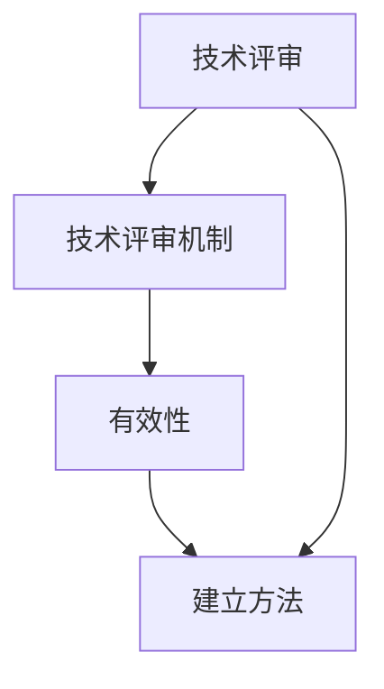

                 


### 文章标题

### 技术评审：建立有效的技术评审机制

> 关键词：技术评审、技术评审机制、有效性、建立方法

摘要：
本文旨在探讨技术评审的概念、机制、有效性及其建立方法。通过逻辑清晰、结构紧凑的分析，结合伪代码和数学模型，我们将深入探讨技术评审的核心算法原理，并通过实际项目实战案例展示其应用。文章将提供最佳实践和注意事项，以帮助读者更好地理解和实施有效的技术评审机制。

---

### 背景介绍

在当今快速发展的信息技术时代，软件项目开发和迭代速度不断加快。随之而来的是对软件质量和稳定性的更高要求。技术评审作为软件开发过程中不可或缺的一环，旨在确保项目的开发质量，提前识别和修复潜在的问题。然而，如何建立和实施有效的技术评审机制，仍然是一个复杂而具有挑战性的课题。

技术评审不仅仅是代码的审查，它涵盖了从需求分析、设计到实现和测试等多个环节。一个有效的技术评审机制能够提升团队协作效率，降低项目风险，确保软件的稳定性和可靠性。本文将围绕这一主题，系统地探讨技术评审的核心概念、机制设计、有效性评估及其建立方法。

---

### 核心概念与联系

要深入理解技术评审机制，我们首先需要明确几个核心概念，包括技术评审、技术评审机制、有效性和建立方法。以下是这些概念之间的联系以及一个简化的Mermaid流程图：

#### 核心概念

1. **技术评审（Technical Review）**：对软件项目中的需求、设计、代码、测试等进行审查的过程，旨在识别和修复问题，提高项目质量。
2. **技术评审机制（Technical Review Mechanism）**：一种组织、执行和监控技术评审的系统方法，包括评审流程、评审人员、评审标准和工具等。
3. **有效性（Effectiveness）**：技术评审机制在提升项目质量、降低风险等方面的实际效果。
4. **建立方法（Establishment Method）**：设计、实施和优化技术评审机制的具体步骤和策略。

#### Mermaid流程图



这个流程图展示了技术评审是如何通过机制设计和实施方法来影响评审的有效性。下面，我们将逐步深入探讨这些概念。

---

### 核心算法原理讲解

技术评审涉及多个核心算法原理，包括质量控制算法、代码审查算法和问题识别算法。以下是对这些算法原理的详细讲解，我们将使用伪代码来描述。

#### 质量控制算法

质量控制算法旨在评估代码的质量，通常基于错误计数和代码复杂度等因素。

```python
def quality_control(code):
    error_count = count_errors(code)
    complexity = calculate_complexity(code)
    if error_count <= threshold and complexity <= max_complexity:
        return "代码质量合格"
    else:
        return "代码质量不合格"
```

在这个算法中，`count_errors` 函数用于统计代码中的错误数量，`calculate_complexity` 函数用于计算代码的复杂度。参数 `threshold` 和 `max_complexity` 用于设定质量控制的阈值。

#### 代码审查算法

代码审查算法用于检查代码是否符合编码规范和设计要求。

```python
def code_review(code, standards):
    review_comments = []
    for line in code:
        if not meets_standards(line, standards):
            review_comments.append("代码行：{} 不符合规范。".format(line))
    return review_comments
```

在这个算法中，`meets_standards` 函数用于检查代码行是否满足预定的编码标准和设计要求。`standards` 参数是一个包含编码规范的字典或列表。

#### 问题识别算法

问题识别算法旨在通过测试结果识别代码中的问题。

```python
def problem_identification(test_results):
    problem_list = []
    for result in test_results:
        if result.failed:
            problem_list.append("测试用例：{} 识别到问题。".format(result.case))
    return problem_list
```

在这个算法中，`test_results` 参数是一个包含测试结果的列表，每个测试结果都有一个 `failed` 属性，用于指示测试是否通过。如果测试失败，算法会将测试用例添加到 `problem_list` 中。

---

### 数学模型和数学公式详细讲解

技术评审中涉及多个数学模型和公式，用于评估代码的质量和性能。以下是一个简单的质量控制模型，以及其详细讲解和举例说明。

#### 质量控制模型

**数学公式：**

$$
\text{质量} = \frac{\text{测试通过代码行数}}{\text{总代码行数}} \times \text{无错误代码行数}
$$

**详细讲解：**

该模型通过计算代码中测试通过的行数与总行数的比例，再乘以无错误的代码行数，来评估代码的整体质量。这个模型考虑了代码的测试覆盖率和错误率。

**举例说明：**

假设我们有1000行代码，其中200行经过测试并且没有错误，另外800行没有经过测试。那么，代码的质量可以计算如下：

$$
\text{质量} = \frac{200}{1000} \times 100\% = 20\%
$$

这表示代码中有20%的行数通过了测试并且没有错误。

---

### 项目实战

为了更好地理解技术评审的实际应用，我们将通过一个简单的项目实战案例进行讲解。本案例将涉及代码审查工具的搭建，包括环境搭建、源代码实现和代码解读。

#### 环境搭建

1. 安装Git：Git是一个分布式版本控制系统，用于代码的版本管理和协作开发。

2. 安装代码审查工具：我们选择Gerrit，它是一个基于Git的代码审查平台。

#### 源代码实现

以下是一个简单的代码审查工具示例，用于检查代码是否符合编码规范：

```python
def check_code_compliance(code, standards):
    compliance_comments = []
    for line in code:
        if not is_line_compliant(line, standards):
            compliance_comments.append(f"代码行：{line} 不符合规范。")
    return compliance_comments

def is_line_compliant(line, standards):
    # 假设标准是每行代码必须以大括号开始和结束
    if not (line.startswith('{') and line.endswith('}')):
        return False
    return True
```

在这个示例中，`check_code_compliance` 函数用于检查代码是否符合预定的编码规范，`is_line_compliant` 函数用于具体的行级检查。

#### 代码解读与分析

这个代码审查工具的基本原理是检查每行代码是否符合特定的编码规范。如果不符合，则返回一个评论列表，列出不符合规范的代码行。这种工具可以帮助开发人员在编码过程中保持一致性，提高代码的可读性和可维护性。

#### 实际案例分析与详细讲解

假设我们有一段代码：

```python
{
    "name": "John Doe",
    "age": 30
}
```

这段代码使用了大括号来定义JSON对象，符合我们的编码规范。如果代码如下：

```python
{ "name": "John Doe", "age": 30 }
```

则不符合规范，因为缺少了大括号的开头和结尾。使用代码审查工具可以轻松识别这种错误，并提醒开发者进行修复。

#### 项目小结

通过这个简单的项目实战，我们展示了如何搭建一个基础的代码审查工具，并讲解了其实际应用。这种工具可以显著提高代码质量，减少错误和漏洞，是技术评审机制的重要组成部分。

---

### 最佳实践 Tips、小结、注意事项、拓展阅读

#### 最佳实践 Tips

1. **明确评审目标**：在实施技术评审之前，应明确评审的目标和标准，确保评审活动具有针对性。
2. **多样化评审方式**：结合自动化工具和人工评审，提高评审的全面性和准确性。
3. **建立评审流程**：制定详细的评审流程，包括评审的时间、地点、参与人员等，确保评审活动有序进行。
4. **定期回顾与优化**：定期对技术评审机制进行回顾和优化，以适应项目的变化和团队的发展。

#### 小结

本文系统地介绍了技术评审的核心概念、机制设计、有效性评估及其建立方法。通过伪代码、数学模型和实际项目案例，我们深入探讨了技术评审的核心算法原理和应用。

#### 注意事项

1. **平衡效率与质量**：在实施技术评审时，需要平衡评审的效率和质量，避免过度评审导致项目延误。
2. **培训评审人员**：确保评审人员具备足够的技能和知识，以进行有效的技术评审。
3. **保密性**：保护评审过程中涉及到的敏感信息和知识产权，确保评审过程的公正和透明。

#### 拓展阅读

- 《软件工程：实践者的研究方法》（Roger S. Pressman）- 详细介绍了软件工程中的评审过程和方法。
- 《代码大全》（Steve McConnell）- 提供了关于代码审查和代码质量的深入讨论。
- 《Gerrit：Git代码审查与发布管理实战》（李雨泽）- 介绍了Gerrit的安装和使用方法，以及代码审查的实际操作。

---

### 作者信息

作者：AI天才研究院/AI Genius Institute & 禅与计算机程序设计艺术 /Zen And The Art of Computer Programming

---

以上是对技术评审及其机制建立的全面分析和讲解，希望对您的理解有所帮助。在实际应用中，不断优化评审机制，提升团队协作效率和项目质量是至关重要的。让我们一起努力，为技术的进步贡献自己的力量。

