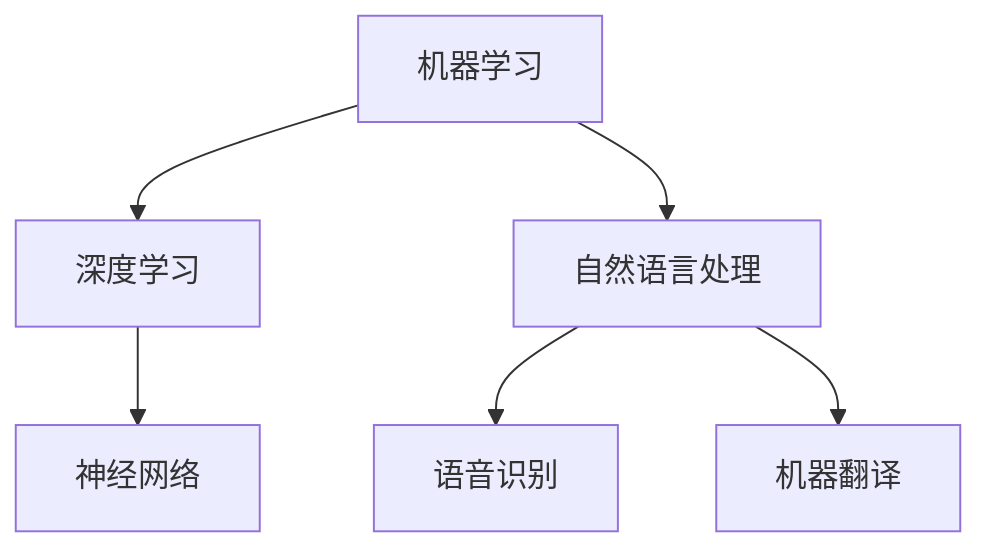
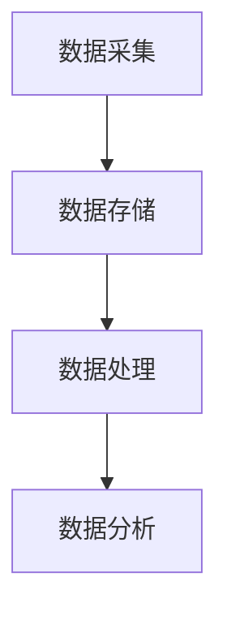
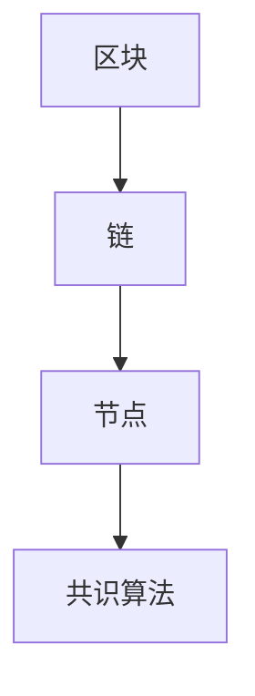

                 

### 文章标题

# 技术调研：如何高效进行技术调研

### 关键词
- 技术调研
- 高效方法
- 工具与策略
- 案例分析

### 摘要
本文旨在探讨如何高效进行技术调研。我们将从技术调研的基本概念、常用方法、工具选择、调研流程管理、案例分析及优化策略等多个方面进行详细讲解。通过本文，读者将能够掌握一套系统的技术调研方法和实战技巧，从而在实际工作中更加高效地进行技术调研。

### 目录

## 引言
### 技术调研的定义与重要性
### 本文的目的与结构

## 第一部分：技术调研概述
### 第1章：技术调研的重要性与基本概念
#### 技术调研的定义
#### 技术调研的目标
#### 技术调研的分类

### 第2章：技术调研环境
#### 技术调研前的准备工作
#### 技术调研的方法和策略
#### 技术调研的资源与工具

## 第二部分：技术调研方法
### 第3章：文献调研
#### 文献检索技巧
#### 文献筛选与评估
#### 文献综述写作

### 第4章：在线调研
#### 在线调研平台的利用
#### 网络数据的获取与处理
#### 网络调研的方法与技巧

### 第5章：专家访谈
#### 专家访谈的目的与准备
#### 专家访谈的方法与技巧
#### 专家访谈的报告撰写

### 第6章：实地调研
#### 实地调研的目的与规划
#### 实地调研的方法与流程
#### 实地调研的数据处理与分析

## 第三部分：技术调研工具与流程
### 第7章：技术调研工具的使用
#### 文献调研工具
#### 在线调研工具
#### 实地调研工具

### 第8章：技术调研流程管理
#### 技术调研项目的规划
#### 技术调研的进度监控
#### 技术调研成果的整理与分享

## 第四部分：技术调研案例分析
### 第9章：技术调研案例研究
#### 案例一：人工智能技术调研
#### 案例二：大数据技术调研
#### 案例三：区块链技术调研

### 第10章：技术调研报告撰写与发布
#### 技术调研报告的结构
#### 技术调研报告的撰写技巧
#### 技术调研报告的发布与传播

## 第五部分：技术调研的优化与实战
### 第11章：技术调研的优化策略
#### 技术调研的效率提升
#### 技术调研的质量保证
#### 技术调研的创新与应用

### 第12章：技术调研实战案例
#### 实战一：企业技术需求调研
#### 实战二：行业技术趋势分析
#### 实战三：技术评估与投资决策

## 结束语
### 最佳实践 tips
### 小结
### 注意事项
### 拓展阅读

### 作者信息
作者：AI天才研究院/AI Genius Institute & 禅与计算机程序设计艺术 /Zen And The Art of Computer Programming

## 引言

### 技术调研的定义与重要性

技术调研是信息技术领域中的一个重要环节，其定义可以概括为：通过系统化的方法，搜集、整理和分析与特定技术相关的信息，以期为决策提供支持。技术调研不仅涉及技术的理论知识，还包括实际应用场景中的经验与案例。

#### 技术调研的重要性

1. **支持创新**：技术调研可以帮助企业和研究机构了解当前技术发展趋势，发现潜在的创新机会。
2. **优化决策**：通过技术调研，决策者可以基于充分的信息做出更为明智的选择。
3. **避免重复劳动**：技术调研可以避免重复开发已被解决或过时的技术，提高工作效率。

#### 本文的目的与结构

本文旨在为读者提供一套系统化的技术调研方法和实战技巧。全文分为五个主要部分：

- **第一部分：技术调研概述**，介绍技术调研的基本概念和环境。
- **第二部分：技术调研方法**，详细讲解文献调研、在线调研、专家访谈和实地调研。
- **第三部分：技术调研工具与流程**，介绍常用的技术调研工具及其应用。
- **第四部分：技术调研案例分析**，通过实际案例展示技术调研的应用。
- **第五部分：技术调研的优化与实战**，探讨技术调研的优化策略及实战案例。

接下来，我们将逐步深入每个部分，详细探讨技术调研的各个方面。

## 第一部分：技术调研概述

### 第1章：技术调研的重要性与基本概念

#### 技术调研的定义

技术调研是一种通过多种途径搜集、整理和分析与特定技术相关信息的系统性方法。它不仅涉及技术的理论研究和应用实例，还包括对技术发展趋势和市场需求的深入分析。

#### 技术调研的目标

技术调研的主要目标包括：

1. **了解技术现状**：通过调研，了解当前技术的最新进展和应用情况。
2. **发现潜在机会**：寻找新技术的应用场景和市场机会。
3. **支持决策**：为技术项目选择、投资决策和战略规划提供依据。
4. **提升竞争力**：帮助企业了解竞争对手的技术能力和市场动向，从而制定相应的策略。

#### 技术调研的分类

技术调研可以根据不同的标准进行分类：

1. **按内容分类**：可以分为文献调研、在线调研、专家访谈和实地调研。
2. **按范围分类**：可以分为全局调研和局部调研。
3. **按目的分类**：可以分为基础调研、应用调研和战略调研。

### 第2章：技术调研环境

#### 技术调研前的准备工作

在进行技术调研之前，需要做好以下准备工作：

1. **确定调研目标**：明确调研的目的和预期成果。
2. **组建调研团队**：根据需要选择具有相关专业知识和技能的团队成员。
3. **收集相关资料**：搜集可能用到的文献、报告、数据等资料。

#### 技术调研的方法和策略

技术调研的方法和策略包括：

1. **文献调研**：通过查阅相关文献来了解技术背景和发展趋势。
2. **在线调研**：利用互联网资源进行调研，包括搜索、数据分析等。
3. **专家访谈**：与行业专家进行深入交流，获取宝贵的见解和建议。
4. **实地调研**：到技术应用现场进行观察和访谈，获取第一手资料。

#### 技术调研的资源与工具

技术调研需要利用多种资源和工具：

1. **数据库**：如IEEE Xplore、ACM Digital Library等，提供大量技术文献。
2. **在线调研平台**：如SurveyMonkey、Google 表单等，用于在线问卷调查。
3. **分析工具**：如Google Analytics、Tableau等，用于数据分析。
4. **会议和研讨会**：参加相关会议和研讨会，获取行业最新动态。

通过本章节的介绍，读者可以初步了解技术调研的基本概念、目标和分类，为后续章节的学习打下基础。

### 第二部分：技术调研方法

技术调研的方法是进行有效调研的关键。在这一部分中，我们将详细探讨文献调研、在线调研、专家访谈和实地调研这四种主要的技术调研方法。

#### 第3章：文献调研

文献调研是通过查阅和研究已有的文献资料来获取信息的方法。这种方法在技术调研中尤为重要，因为它提供了对某一技术领域全面、深入的了解。

##### 3.1 文献检索技巧

文献检索是文献调研的第一步，以下是一些关键的检索技巧：

1. **关键词选择**：选择与调研主题密切相关的关键词，利用逻辑运算符（如AND、OR、NOT）进行组合检索，以提高检索效率。
2. **使用专业数据库**：利用专业数据库，如IEEE Xplore、ACM Digital Library、ScienceDirect等，这些数据库提供了丰富的技术文献资源。
3. **筛选和评估**：对检索结果进行筛选和评估，选择与调研目标最为相关的文献。

##### 3.2 文献筛选与评估

在获取大量文献后，需要对其进行筛选和评估，以确保信息的质量和相关性。以下是一些筛选和评估的方法：

1. **阅读摘要**：通过阅读文献摘要，快速判断其是否与调研主题相关。
2. **评估来源**：评估文献的来源，如期刊、会议论文、专著等，选择权威性和影响力较高的来源。
3. **引用次数**：查看文献的引用次数，引用次数较高的文献通常具有较高的学术价值。

##### 3.3 文献综述写作

文献综述是对某一技术领域的文献进行归纳和分析，以展示当前研究的进展和趋势。以下是一些文献综述写作的技巧：

1. **确定结构**：通常包括引言、主体（按时间或主题分类）和结论三个部分。
2. **逻辑连贯**：确保文献综述的内容逻辑清晰，信息之间相互关联。
3. **引用规范**：遵循正确的引用规范，确保文献引用的准确性和完整性。

#### 第4章：在线调研

在线调研是利用互联网资源进行数据收集和分析的方法。这种方法具有便捷、高效、成本较低的特点，适用于各种技术调研场景。

##### 4.1 在线调研平台的利用

在线调研平台提供了便捷的数据收集和分析工具，如SurveyMonkey、Google 表单等。以下是一些利用在线调研平台的技巧：

1. **设计问卷**：根据调研目标设计问卷，确保问卷的问题清晰、简洁，并涵盖所需的信息。
2. **发布问卷**：通过电子邮件、社交媒体、专业论坛等渠道发布问卷，扩大样本覆盖范围。
3. **数据分析**：使用在线调研平台的分析工具，对收集的数据进行分析，提取有价值的信息。

##### 4.2 网络数据的获取与处理

网络数据的获取与处理是进行在线调研的重要环节。以下是一些关键步骤：

1. **数据获取**：使用网络爬虫、API接口等工具获取网络数据，确保数据的全面性和准确性。
2. **数据清洗**：对获取的数据进行清洗，去除无效数据，确保数据的质量。
3. **数据存储**：将清洗后的数据存储在数据库中，便于后续的分析和处理。

##### 4.3 网络调研的方法与技巧

网络调研的方法和技巧多种多样，以下是一些常用的方法：

1. **问卷调查**：通过设计问卷收集用户意见和反馈。
2. **在线访谈**：利用在线工具（如Zoom、Skype）进行访谈，获取深入的信息。
3. **数据分析**：利用数据分析工具（如SPSS、Python等）对收集的数据进行定量和定性分析。

#### 第5章：专家访谈

专家访谈是通过与行业专家进行面对面或在线交流，获取专业见解和宝贵建议的方法。这种方法能够深入了解某一技术领域，为决策提供重要参考。

##### 5.1 专家访谈的目的与准备

专家访谈的主要目的是：

1. **获取专业见解**：通过访谈了解专家对某一技术领域的研究成果和看法。
2. **发现潜在机会**：通过与专家交流，发现潜在的技术机会和市场动向。
3. **构建网络关系**：通过与专家建立联系，扩大人脉，为未来的合作打下基础。

在进行专家访谈前，需要进行以下准备工作：

1. **确定访谈对象**：选择在某一技术领域有深入研究或有丰富实践经验的专家。
2. **准备访谈提纲**：根据调研目标，设计访谈问题，确保问题具有针对性。
3. **预约访谈时间**：与专家协商访谈时间，确保双方都方便。

##### 5.2 专家访谈的方法与技巧

进行专家访谈时，需要遵循以下方法和技巧：

1. **开场白**：用简短的自我介绍和访谈目的开场，营造轻松的氛围。
2. **倾听与提问**：认真倾听专家的回答，根据回答进行进一步的提问。
3. **记录重点**：实时记录访谈内容，特别是重要的见解和建议。
4. **结束访谈**：在访谈结束时，对专家表示感谢，并确认访谈内容的记录无误。

##### 5.3 专家访谈的报告撰写

专家访谈结束后，需要撰写报告，总结访谈内容并提取关键信息。以下是一些撰写报告的技巧：

1. **结构清晰**：报告应包括引言、访谈内容、总结和建议三个部分。
2. **逻辑连贯**：确保报告的内容逻辑清晰，信息之间相互关联。
3. **引用规范**：对引用的专家观点和研究成果进行规范引用。
4. **附件**：附上访谈录音或录像，以便于查阅和验证。

#### 第6章：实地调研

实地调研是到技术应用的现场进行观察和访谈，获取第一手资料的方法。这种方法能够提供更为直观和深入的了解。

##### 6.1 实地调研的目的与规划

实地调研的主要目的是：

1. **了解技术应用**：通过实地调研，了解技术在实际应用中的效果和问题。
2. **获取用户反馈**：通过与用户交流，获取他们对技术的实际使用体验和反馈。
3. **发现改进机会**：通过实地调研，发现技术的改进方向和优化机会。

在进行实地调研前，需要进行以下规划：

1. **确定调研地点**：选择具有代表性的技术应用场景。
2. **准备调研工具**：如摄像机、录音笔、调查问卷等。
3. **安排调研时间**：与调研地点的管理人员和用户协商，确保调研时间的安排合理。

##### 6.2 实地调研的方法与流程

实地调研的方法和流程包括：

1. **观察与记录**：在现场进行观察，记录技术应用的细节和用户行为。
2. **访谈与问卷**：与技术人员和用户进行访谈，获取他们的看法和建议；通过问卷收集更多的用户反馈。
3. **数据整理与分析**：对收集的观察记录和访谈数据进行整理和分析，提取有价值的信息。

##### 6.3 实地调研的数据处理与分析

实地调研的数据处理与分析包括：

1. **数据整理**：对收集的数据进行整理，去除无效和重复的数据。
2. **数据分析**：使用统计分析和数据可视化工具，对数据进行定量和定性分析。
3. **报告撰写**：根据数据分析结果，撰写实地调研报告，总结调研发现和结论。

通过本章节的介绍，读者可以掌握文献调研、在线调研、专家访谈和实地调研四种技术调研方法的具体操作技巧和注意事项，为后续的技术调研工作提供有力支持。

### 第三部分：技术调研工具与流程

技术调研的成功离不开有效的工具和科学的流程。在这一部分中，我们将详细介绍技术调研工具的使用以及如何管理技术调研的流程。

#### 第7章：技术调研工具的使用

技术调研工具的选择和使用对于提高调研效率和准确性至关重要。以下是一些常用的技术调研工具及其使用方法：

##### 7.1 文献调研工具

文献调研工具主要包括数据库、文献管理软件和研究工具。以下是一些常用的文献调研工具：

1. **数据库**：
   - **IEEE Xplore**：涵盖计算机科学、电子工程等领域的文献数据库。
   - **ACM Digital Library**：提供计算机科学领域的高质量文献。
   - **Web of Science**：综合性的科学文献数据库，涵盖多个学科。

2. **文献管理软件**：
   - **EndNote**：一款功能强大的文献管理软件，支持文献的收集、整理和管理。
   - **Zotero**：开源的文献管理软件，支持跨平台使用。

3. **研究工具**：
   - **Google Scholar**：Google 提供的学术搜索引擎，可以快速查找相关文献。
   - **Semantic Scholar**：利用自然语言处理技术进行文献内容分析，提供更智能的搜索结果。

##### 7.2 在线调研工具

在线调研工具用于设计和发布问卷、收集和分析数据。以下是一些常用的在线调研工具：

1. **SurveyMonkey**：提供多样化的问卷设计选项和强大的数据分析功能。
2. **Google 表单**：简单易用，支持多种数据格式和自动化分析。
3. **Typeform**：提供丰富的交互式问卷设计选项，提高用户参与度。

##### 7.3 实地调研工具

实地调研工具主要用于数据收集、记录和分析。以下是一些常用的实地调研工具：

1. **摄像机**：用于记录现场观察和访谈内容。
2. **录音笔**：用于记录访谈过程中的语音信息。
3. **平板电脑或智能手机**：用于实时填写问卷和记录数据。

#### 第8章：技术调研流程管理

技术调研流程管理是确保调研项目顺利进行的重要环节。以下是一些关键的管理步骤：

##### 8.1 技术调研项目的规划

在启动技术调研项目之前，需要进行详细的规划，确保调研目标的明确和资源的合理分配。以下是规划步骤：

1. **明确调研目标**：确定调研的核心问题和预期成果。
2. **定义调研范围**：明确调研的具体领域和范围。
3. **资源分配**：根据调研目标和范围，分配人力、时间和预算资源。

##### 8.2 技术调研的进度监控

在技术调研过程中，需要实时监控进度，确保项目按计划进行。以下是一些进度监控的方法：

1. **制定时间表**：根据调研任务，制定详细的时间表，明确每个阶段的开始和结束时间。
2. **定期汇报**：定期向项目负责人汇报调研进度，及时调整计划。
3. **使用项目管理工具**：如Trello、Jira等，跟踪任务进度和团队协作情况。

##### 8.3 技术调研成果的整理与分享

技术调研成果的整理与分享是确保调研成果得到充分利用的关键。以下是一些整理与分享的方法：

1. **整理报告**：将调研成果整理成报告，包括调研过程、发现和建议。
2. **制作幻灯片**：利用幻灯片工具，将调研结果进行视觉化展示。
3. **内部分享**：在团队内部进行调研成果分享，促进知识共享和团队协作。
4. **发布文档**：将调研报告和分享资料发布在内部知识库或外部网站上，供相关人员查阅。

通过本章节的介绍，读者可以了解如何选择和使用技术调研工具，以及如何管理技术调研的流程，从而提高技术调研的效率和效果。

### 第四部分：技术调研案例分析

技术调研在现实中的应用不仅能够帮助企业和研究机构了解技术发展趋势，还能够为具体的决策提供有力的支持。在这一部分中，我们将通过三个具体案例，展示技术调研在不同领域的应用。

#### 第9章：技术调研案例研究

##### 9.1 案例一：人工智能技术调研

**背景介绍**

人工智能（AI）作为当前科技领域的热点，吸引了众多企业和研究机构的关注。为了了解人工智能技术的最新发展、应用场景和潜在风险，某科技公司在2022年进行了一次全面的人工智能技术调研。

**核心概念与联系**

人工智能的核心概念包括机器学习、深度学习、自然语言处理等。通过Mermaid流程图，我们可以展示这些概念之间的关系：



**核心算法原理讲解**

机器学习是人工智能的核心组成部分，其基本原理是通过训练模型来发现数据中的模式。以下是一个简单的机器学习算法——线性回归的伪代码：

```python
# 线性回归伪代码
def linear_regression(x, y):
    # 求解斜率 k 和截距 b
    k = (sum(y * x) - (sum(x) * sum(y))) / (sum(x**2) - (len(x) * (sum(x)))**2)
    b = (sum(y) - k * sum(x)) / len(x)
    return k, b
```

**数学模型和公式**

线性回归的数学模型可以表示为：

$$y = kx + b$$

其中，\(y\) 是因变量，\(x\) 是自变量，\(k\) 是斜率，\(b\) 是截距。

**项目实战**

在调研过程中，该公司通过分析大量的学术论文和技术报告，构建了一个包含多种人工智能算法的数据库。通过这个数据库，公司能够快速获取最新的技术动态和应用案例。

**代码实现**

以下是一个简单的线性回归算法的实现：

```python
import numpy as np

# 线性回归实现
def linear_regression(x, y):
    k = np.polyfit(x, y, 1)
    b = np.mean(y) - k[0] * np.mean(x)
    return k[0], b

# 数据示例
x = [1, 2, 3, 4, 5]
y = [2, 4, 5, 4, 5]

# 训练模型
k, b = linear_regression(x, y)

# 预测
print(f"预测值 y = {k} * x + {b}")
```

**实际案例分析和详细讲解剖析**

该公司通过调研发现，人工智能在金融、医疗、制造等领域具有广泛的应用前景。例如，在金融领域，AI可以用于风险评估、欺诈检测和投资策略优化；在医疗领域，AI可以用于疾病诊断、药物研发和患者管理。

**项目小结**

通过这次人工智能技术调研，该公司不仅掌握了最新的技术动态，还明确了未来的研究方向和应用场景。这为公司在人工智能领域的战略决策提供了有力支持。

##### 9.2 案例二：大数据技术调研

**背景介绍**

随着互联网和物联网的快速发展，大数据技术成为企业和研究机构关注的焦点。为了了解大数据技术的最新进展、应用场景和挑战，某互联网公司在2022年进行了一次全面的大数据技术调研。

**核心概念与联系**

大数据的核心概念包括数据采集、存储、处理和分析。以下是一个简化的Mermaid流程图，展示这些概念之间的关系：



**核心算法原理讲解**

大数据处理的关键算法包括MapReduce、Hadoop和Spark等。以下是一个简单的MapReduce算法的伪代码：

```python
# MapReduce伪代码
def map(input):
    for item in input:
        emit(item, 1)

def reduce(key, values):
    return sum(values)
```

**数学模型和公式**

大数据分析中常用的数学模型包括聚类分析、分类分析和回归分析。以下是一个简单的聚类分析模型的公式：

$$d(x_i, x_j) = \sqrt{\sum_{k=1}^{n}(x_{ik} - x_{jk})^2}$$

其中，\(d\) 表示距离，\(x_i\) 和 \(x_j\) 表示两个数据点。

**项目实战**

在调研过程中，该公司通过分析大量的学术论文和技术报告，构建了一个包含多种大数据处理算法的数据库。通过这个数据库，公司能够快速获取最新的技术动态和应用案例。

**代码实现**

以下是一个简单的聚类分析算法的实现：

```python
import numpy as np

# 聚类分析实现
def euclidean_distance(x, y):
    return np.sqrt(np.sum((x - y)**2))

def k_means(data, k, max_iterations):
    centroids = [data[i] for i in range(k)]
    for _ in range(max_iterations):
        new_centroids = []
        for i in range(k):
            points = [x for x in data if np.argmin([euclidean_distance(x, centroids[j]) for j in range(k)]) == i]
            new_centroids.append(np.mean(points, axis=0))
        if np.all(centroids == new_centroids):
            break
        centroids = new_centroids
    return centroids

# 数据示例
data = np.array([[1, 1], [1, 2], [2, 1], [2, 2]])

# K-means聚类
centroids = k_means(data, 2, 100)
print("聚类中心：", centroids)
```

**实际案例分析和详细讲解剖析**

该公司通过调研发现，大数据技术在电商、金融、医疗等领域具有广泛的应用。例如，在电商领域，大数据可以用于个性化推荐、用户行为分析和市场预测；在金融领域，大数据可以用于风险评估、交易监控和欺诈检测。

**项目小结**

通过这次大数据技术调研，该公司不仅了解了最新的技术进展，还明确了大数据技术在不同领域的应用场景和挑战。这为公司在大数据战略的制定和实施提供了有力支持。

##### 9.3 案例三：区块链技术调研

**背景介绍**

区块链技术作为一种新兴的分布式账本技术，在金融、供应链管理、医疗等领域得到了广泛应用。为了了解区块链技术的最新发展、应用场景和潜在风险，某金融机构在2022年进行了一次全面的区块链技术调研。

**核心概念与联系**

区块链的核心概念包括区块、链、节点和共识算法。以下是一个简化的Mermaid流程图，展示这些概念之间的关系：



**核心算法原理讲解**

区块链技术中的共识算法是确保区块链网络安全性和一致性的关键。以下是一个简单的工作量证明（Proof of Work, PoW）算法的伪代码：

```python
# 工作量证明伪代码
def proof_of_work(last_hash, target_difficulty):
    nonce = 0
    while calculate_hash(last_hash, nonce) > target_difficulty:
        nonce += 1
    return nonce
```

**数学模型和公式**

工作量证明算法中的数学模型包括哈希函数和目标难度。以下是一个简单的哈希函数的公式：

$$H = Hash(last\_hash + nonce)$$

**项目实战**

在调研过程中，该金融机构通过分析大量的学术论文和技术报告，构建了一个包含多种区块链算法的数据库。通过这个数据库，公司能够快速获取最新的技术动态和应用案例。

**代码实现**

以下是一个简单的工作量证明算法的实现：

```python
import hashlib

# 工作量证明实现
def calculate_hash(last_hash, nonce):
    string_to_hash = last_hash + str(nonce)
    return hashlib.sha256(string_to_hash.encode()).hexdigest()

def proof_of_work(last_hash, target_difficulty):
    nonce = 0
    while calculate_hash(last_hash, nonce) > target_difficulty:
        nonce += 1
    return nonce

# 目标难度示例
target_difficulty = '0000'

# 找到合适的nonce
nonce = proof_of_work('initial_hash', target_difficulty)
print(f"找到的nonce：{nonce}")
```

**实际案例分析和详细讲解剖析**

该金融机构通过调研发现，区块链技术在金融领域具有广泛的应用。例如，在支付系统中，区块链可以用于提高交易速度和降低成本；在供应链管理中，区块链可以用于提高透明度和可追溯性。

**项目小结**

通过这次区块链技术调研，该金融机构不仅了解了区块链技术的最新进展，还明确了区块链技术在金融领域的应用场景和挑战。这为公司在区块链战略的制定和实施提供了有力支持。

#### 第10章：技术调研报告撰写与发布

撰写和发布技术调研报告是技术调研流程中的重要环节，它不仅是对调研成果的总结，也是为后续决策提供依据的关键步骤。在这一章节中，我们将详细介绍技术调研报告的结构、撰写技巧以及发布与传播的方法。

##### 10.1 技术调研报告的结构

一个完整的技术调研报告通常包括以下几个部分：

1. **封面**：包括报告标题、作者、机构、日期等基本信息。
2. **摘要**：简要介绍调研的背景、目的、方法和主要发现。
3. **目录**：列出报告各章节和子章节，方便读者快速定位。
4. **引言**：详细阐述调研的背景、目的、意义和研究方法。
5. **正文**：详细描述调研的过程、方法和结果，包括数据分析、案例研究和发现。
6. **结论**：总结调研的主要发现，提出建议和未来研究方向。
7. **参考文献**：列出报告中引用的所有文献资料，确保引用的规范和完整性。
8. **附录**：包括调研工具、数据表、图表等附加信息。

##### 10.2 技术调研报告的撰写技巧

撰写技术调研报告时，应遵循以下技巧：

1. **明确结构**：确保报告结构清晰，逻辑连贯，便于读者阅读和理解。
2. **精确表达**：使用准确、清晰的语言描述调研过程和结果，避免模糊和主观的表述。
3. **数据支持**：使用图表、表格和引用数据来支持报告中的观点和结论。
4. **引用规范**：遵循正确的引用规范，确保所有引用的文献资料准确无误。
5. **简洁明了**：避免冗长和复杂的句子，使报告内容简洁明了，易于阅读。

##### 10.3 技术调研报告的发布与传播

技术调研报告的发布与传播是确保调研成果得到充分利用的重要步骤。以下是一些发布与传播的方法：

1. **内部分享**：在团队内部进行分享，通过邮件、会议或内部网站等渠道发布报告，促进团队成员之间的交流和学习。
2. **外部发布**：将报告发布在专业的技术博客、学术期刊或社交媒体平台上，吸引更多读者的关注。
3. **合作与交流**：与相关企业和研究机构进行合作，共同发布报告，扩大影响力。
4. **会议与研讨会**：在技术会议和研讨会上展示调研成果，与同行进行交流，获取反馈和建议。

**案例：**

某互联网公司进行了一次关于人工智能技术在电商领域应用的技术调研。调研报告完成后，公司内部通过邮件和内部网站进行了分享，并在技术博客和学术期刊上发布了报告。此外，公司还在行业会议上展示了调研成果，与同行进行了深入交流。通过这些方式，报告得到了广泛的关注和认可，为公司在人工智能领域的发展提供了有力支持。

通过本章的介绍，读者可以了解如何撰写和发布技术调研报告，以及如何通过多种渠道传播调研成果，确保调研成果得到充分利用。

### 第五部分：技术调研的优化与实战

#### 第11章：技术调研的优化策略

技术调研的效率和质量直接影响到调研结果的可靠性和实用性。为了提高技术调研的效率和质量，我们需要从多个方面进行优化。

##### 11.1 技术调研的效率提升

**1. 精细化需求分析**
在调研之前，进行细致的需求分析，明确调研的具体目标和范围，避免在无关的信息上浪费时间和资源。

**2. 利用自动化工具**
采用自动化工具（如爬虫、脚本等）进行数据的收集和分析，提高工作效率。自动化工具可以快速处理大量数据，减少手动操作的错误和耗时。

**3. 优化信息筛选流程**
通过建立信息筛选标准和流程，快速识别和排除与调研目标无关的信息，提高信息筛选的效率。

**4. 加强团队协作**
建立高效的团队协作机制，明确团队成员的角色和职责，确保信息流通顺畅，提高调研工作的整体效率。

##### 11.2 技术调研的质量保证

**1. 多元化数据来源**
确保数据来源的多样性和可靠性，结合多种渠道获取信息，提高数据的完整性和准确性。

**2. 严格质量控制**
在调研过程中，对收集的数据进行严格的质量控制，包括数据清洗、验证和审核，确保数据的真实性和可靠性。

**3. 定期培训与更新**
定期对调研团队成员进行培训，更新他们的知识和技能，提高调研的专业性和深度。

**4. 完善反馈机制**
建立完善的反馈机制，及时收集和分析反馈信息，对调研方法和流程进行优化，确保调研结果的实用性和有效性。

##### 11.3 技术调研的创新与应用

**1. 创新方法引入**
积极探索和应用新的技术调研方法，如用户画像分析、大数据分析等，提高调研的精准度和深度。

**2. 实践案例借鉴**
借鉴其他领域和行业的成功案例，将有效的调研方法和技术应用到自己的调研工作中，提高调研的实用性和可操作性。

**3. 持续改进与优化**
通过持续改进和优化，不断完善技术调研的方法和流程，确保调研工作的持续改进和创新。

**4. 开放合作与共享**
加强与其他企业和研究机构的合作与交流，共享调研成果和经验，共同推动技术调研领域的发展和创新。

#### 第12章：技术调研实战案例

技术调研不仅是一种理论方法，更需要在实际工作中得到应用和验证。以下我们将通过三个具体案例，展示技术调研在企业技术需求调研、行业技术趋势分析和技术评估与投资决策中的应用。

##### 12.1 实战一：企业技术需求调研

**背景介绍**

某大型制造企业在进行新产品的研发过程中，需要对其目标市场的技术需求进行深入调研。为了确保新产品的市场竞争力，公司决定开展一次全面的技术需求调研。

**调研目标**

1. 了解目标市场的新技术趋势和应用案例。
2. 识别目标客户对新技术的基本需求。
3. 确定新产品的技术方向和功能需求。

**调研方法**

1. 文献调研：通过查阅相关的技术文献和行业报告，了解当前市场的新技术趋势和应用案例。
2. 专家访谈：与行业专家和潜在客户进行访谈，获取他们对新技术需求的直接反馈。
3. 实地调研：到目标市场进行实地考察，观察和分析客户的使用场景和需求。

**调研过程**

1. 确定调研目标和范围，组建调研团队。
2. 通过文献调研和在线资源，收集相关技术和市场信息。
3. 设计专家访谈问卷，安排专家访谈时间。
4. 实地调研，收集客户使用场景和需求反馈。
5. 整理和分析调研数据，撰写调研报告。

**调研成果**

1. 识别了目标市场的主要技术趋势和应用案例。
2. 收集了客户对新技术需求的具体反馈。
3. 确定了新产品的技术方向和功能需求。

**项目小结**

通过这次技术需求调研，企业对新产品的技术方向和功能有了更为清晰的认识，为新产品的研发提供了有力支持。

##### 12.2 实战二：行业技术趋势分析

**背景介绍**

某互联网公司在进行战略规划时，需要对其所处行业的最新技术趋势进行分析。为了确保公司在技术上的领先地位，公司决定开展一次全面的行业技术趋势分析。

**调研目标**

1. 了解行业内的技术创新和热点领域。
2. 分析竞争对手的技术布局和战略。
3. 确定公司的技术发展方向和战略重点。

**调研方法**

1. 文献调研：通过查阅行业报告、学术论文和媒体报道，了解行业的技术发展趋势和热点领域。
2. 在线调研：利用专业的行业网站和论坛，收集和分析竞争对手的技术动态和市场表现。
3. 专家访谈：与行业专家和资深从业者进行访谈，获取他们对行业技术趋势的见解和预测。

**调研过程**

1. 确定调研目标和范围，组建调研团队。
2. 通过文献调研，收集行业技术发展趋势和热点领域的信息。
3. 通过在线调研，分析竞争对手的技术动态和市场表现。
4. 安排专家访谈，获取行业技术趋势的见解和预测。
5. 整理和分析调研数据，撰写调研报告。

**调研成果**

1. 识别了行业内的主要技术趋势和热点领域。
2. 分析了竞争对手的技术布局和战略。
3. 确定了公司的技术发展方向和战略重点。

**项目小结**

通过这次行业技术趋势分析，公司对其所处的行业环境和技术趋势有了更深刻的认识，为公司的战略规划和决策提供了重要参考。

##### 12.3 实战三：技术评估与投资决策

**背景介绍**

某风投公司在进行投资项目评估时，需要对候选项目的核心技术进行评估。为了确保投资决策的科学性和有效性，公司决定开展一次全面的技术评估。

**调研目标**

1. 评估候选项目的核心技术水平和市场潜力。
2. 分析项目的技术风险和商业风险。
3. 提出投资决策建议。

**调研方法**

1. 文献调研：通过查阅项目报告、学术论文和行业报告，了解项目的技术细节和市场前景。
2. 专家访谈：与项目团队和行业专家进行访谈，获取对项目技术水平和市场潜力的评估。
3. 实地调研：到项目现场进行实地考察，了解项目的实际进展和实施情况。

**调研过程**

1. 确定调研目标和范围，组建调研团队。
2. 通过文献调研，收集项目的技术细节和市场前景信息。
3. 设计专家访谈问卷，安排专家访谈时间。
4. 实地调研，了解项目的实际进展和实施情况。
5. 整理和分析调研数据，撰写技术评估报告。

**调研成果**

1. 评估了候选项目的核心技术水平和市场潜力。
2. 分析了项目的技术风险和商业风险。
3. 提出了投资决策建议。

**项目小结**

通过这次技术评估，公司对候选项目的技术水平和市场前景有了更清晰的认识，为投资决策提供了重要依据。

### 结论

技术调研是信息技术领域中的一个关键环节，它不仅支持企业的创新决策，还帮助研究机构了解技术发展趋势。本文通过详细探讨技术调研的定义、重要性、分类、方法、工具、流程、案例以及优化策略，为读者提供了一套系统化的技术调研方法和实战技巧。通过学习和应用这些方法，读者将能够在实际工作中更加高效地进行技术调研，为企业的战略决策和创新发展提供有力支持。

#### 最佳实践 tips

1. **明确调研目标**：在开始调研前，明确调研的目标和预期成果，有助于提高调研的针对性。
2. **多元化数据来源**：结合多种数据来源，确保数据的全面性和准确性。
3. **定期更新知识库**：定期更新调研工具和知识库，以保持调研方法的先进性和实用性。
4. **注重团队合作**：建立高效的团队协作机制，提高调研工作的效率和质量。

#### 小结

技术调研不仅是一种信息搜集和分析的方法，更是一种战略工具。通过有效的技术调研，企业能够把握技术趋势，发现市场需求，制定明智的战略决策。本文的内容涵盖了技术调研的各个方面，旨在为读者提供全面的指导。

#### 注意事项

1. **保护数据隐私**：在进行调研时，务必遵守数据保护法规，保护参与者的隐私。
2. **确保信息真实性**：在引用和发布调研结果时，确保信息的真实性和准确性，避免误导。
3. **适应动态变化**：技术领域变化迅速，调研方法和工具也需要不断更新和调整。

#### 拓展阅读

- 《科技情报研究方法》
- 《大数据技术基础》
- 《人工智能：一种现代方法》
- 《区块链技术指南》

### 作者信息

作者：AI天才研究院/AI Genius Institute & 禅与计算机程序设计艺术 /Zen And The Art of Computer Programming

通过本文的学习，希望读者能够在技术调研的道路上不断进步，为信息技术领域的发展贡献自己的力量。

