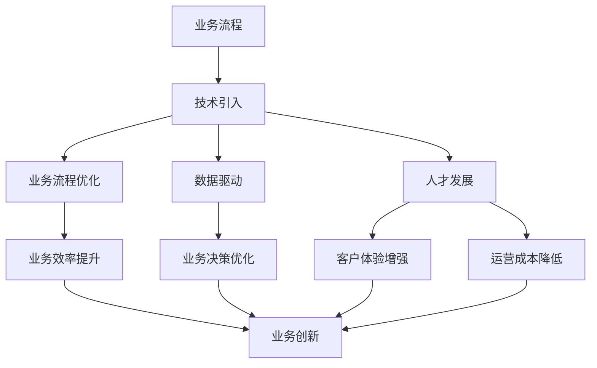

                 

# 技术赋能：用技术赋能业务创新

> 关键词：技术赋能、业务创新、实践案例、挑战与解决方案

> 摘要：本文将探讨技术赋能在业务创新中的重要作用。通过分析技术赋能的定义、核心原理和业务场景，结合实际案例，探讨技术赋能的挑战与解决方案，旨在为读者提供关于如何利用技术推动业务创新的实用指导。

---

## 引言

在当今快速发展的数字化时代，技术已经成为驱动业务创新的核心力量。技术赋能（Technology Enablement）这一概念，正逐渐成为企业转型升级的关键策略。通过技术赋能，企业能够利用先进的技术手段，提高业务效率、优化客户体验、降低运营成本，从而在激烈的市场竞争中脱颖而出。

本文将围绕技术赋能这一主题，首先介绍其定义与背景，然后深入探讨技术赋能的核心原理和业务场景，接着通过实际案例展示技术赋能的实践效果，最后分析技术赋能面临的挑战与解决方案。希望通过本文的探讨，能够为读者提供关于如何利用技术赋能推动业务创新的启示和指导。

## 技术赋能的定义与背景

### 技术赋能的定义

技术赋能，指的是通过引入和应用先进的技术，提升业务流程的效率、优化业务决策、增强客户体验，从而实现业务创新和价值创造的过程。技术赋能不仅包括技术的引入和应用，还涉及对现有业务流程的重新设计、组织架构的调整以及人才能力的提升。

### 技术赋能的背景

随着信息技术的快速发展，云计算、大数据、人工智能、物联网等新兴技术已经深刻改变了各行各业的运营模式。企业不再仅仅依赖于传统的业务流程和模式，而是开始积极拥抱新技术，通过技术赋能实现业务创新和转型。

一方面，技术的进步为企业提供了更多的可能性。例如，云计算提供了弹性的计算资源，使得企业能够快速扩展和调整业务规模；大数据技术则帮助企业挖掘海量数据中的价值，优化业务决策；人工智能和物联网技术则提升了业务流程的自动化程度和智能化水平。

另一方面，市场竞争的加剧和消费者需求的不断变化，也迫使企业不断寻求新的业务增长点。技术赋能成为企业提升竞争力、实现业务创新的重要手段。

### 技术赋能的意义

技术赋能对企业具有多方面的意义：

1. **提高业务效率**：通过自动化和智能化手段，优化业务流程，提高工作效率和准确性。

2. **优化业务决策**：利用大数据和人工智能技术，从海量数据中提取有价值的信息，为企业决策提供数据支持。

3. **增强客户体验**：通过个性化推荐、智能客服等技术，提升客户体验，增加客户忠诚度。

4. **降低运营成本**：通过优化业务流程和资源利用，降低运营成本，提高企业盈利能力。

5. **促进业务创新**：技术赋能不仅优化现有业务，还能激发企业创新思维，开拓新的业务模式和市场机会。

## 技术赋能的核心原理

### 技术赋能的原理概述

技术赋能的核心原理可以概括为以下几点：

1. **技术引入**：通过引入新兴技术，如云计算、大数据、人工智能、物联网等，提升业务流程的自动化和智能化水平。

2. **业务流程优化**：对现有业务流程进行重新设计，去除冗余环节，提高业务效率。

3. **数据驱动**：利用大数据技术，从海量数据中提取有价值的信息，指导业务决策。

4. **人才发展**：提升员工的技术能力和业务素质，推动企业整体竞争力的提升。

### 技术赋能的关键技术

1. **云计算**：提供弹性的计算资源，支持企业快速扩展和调整业务规模。

2. **大数据**：通过数据采集、存储、处理和分析，帮助企业挖掘数据中的价值。

3. **人工智能**：实现业务流程的自动化和智能化，提升业务决策的准确性。

4. **物联网**：连接各种设备和系统，实现信息的互联互通，提升业务协同效率。

### 技术赋能与业务流程的关系架构

为了更好地理解技术赋能的原理，我们可以通过一个Mermaid流程图来展示技术赋能与业务流程之间的关系：

## 技术赋能的业务场景

技术赋能在不同业务场景中具有广泛的应用。以下是几个典型行业的技术赋能案例：

### 金融行业

在金融行业，技术赋能主要体现在以下几个方面：

1. **风险管理**：利用大数据和人工智能技术，对金融风险进行实时监控和预测，提高风险管理效率。

2. **信用评估**：通过大数据分析和机器学习模型，对客户信用进行评估，降低信贷风险。

3. **个性化服务**：利用用户行为数据，提供个性化的金融产品和服务，提升客户满意度。

4. **智能投顾**：利用人工智能技术，为客户提供智能投资建议，提高投资回报率。

### 医疗行业

在医疗行业，技术赋能为医疗服务的提升和优化提供了强有力的支持：

1. **智能诊断**：利用人工智能技术，对医学影像和病例数据进行智能分析，提高诊断准确率。

2. **远程医疗**：通过物联网技术和远程医疗平台，实现医疗资源的共享和优化，提升医疗服务可及性。

3. **健康管理**：利用可穿戴设备和大数据技术，实时监控和管理个人健康数据，提升健康服务水平。

4. **智慧医院**：通过物联网和人工智能技术，实现医院管理智能化，提升医院运营效率。

### 电商行业

在电商行业，技术赋能主要体现在以下几个方面：

1. **个性化推荐**：利用大数据和人工智能技术，对用户行为进行分析，提供个性化的商品推荐。

2. **智能客服**：通过人工智能技术，实现24小时智能客服，提升客户服务水平。

3. **供应链优化**：利用物联网和大数据技术，实现供应链的实时监控和优化，提高供应链效率。

4. **智能物流**：通过物联网技术和智能配送系统，实现物流的精准配送和实时跟踪。

### 制造业

在制造业，技术赋能主要表现在以下几个方面：

1. **智能制造**：通过物联网和人工智能技术，实现生产过程的智能化和自动化，提高生产效率和产品质量。

2. **设备预测维护**：利用大数据和物联网技术，对设备进行实时监控和分析，实现设备预测性维护，降低设备故障率。

3. **供应链协同**：通过物联网和大数据技术，实现供应链各环节的实时信息和数据共享，提高供应链协同效率。

4. **质量控制**：利用人工智能和大数据技术，对产品质量进行实时监控和分析，提高产品质量控制水平。

## 技术赋能的实践案例

### 案例一：金融行业的智能投顾

某大型金融企业引入人工智能技术，开发了一款智能投顾系统。该系统通过分析用户投资偏好、风险承受能力等数据，为用户推荐个性化的投资组合。具体实现过程如下：

1. **数据采集**：系统从用户的投资记录、交易记录、财务报表等数据源中，收集用户的相关数据。

2. **数据预处理**：对采集到的数据进行清洗、归一化和特征提取，为后续分析做准备。

3. **特征工程**：根据用户的投资行为和风险偏好，提取关键特征，如资产配置、交易频率、风险等级等。

4. **模型训练**：利用机器学习算法，如决策树、支持向量机等，对提取的特征进行训练，建立预测模型。

5. **模型部署**：将训练好的模型部署到线上平台，用户可以通过网页或手机应用访问智能投顾系统。

6. **用户反馈**：系统根据用户反馈调整投资建议，实现个性化服务。

### 案例二：医疗行业的智能诊断

某大型医疗企业引入人工智能技术，开发了一款智能诊断系统。该系统通过分析医学影像和病例数据，为医生提供诊断建议。具体实现过程如下：

1. **数据采集**：系统从医院影像系统、病例数据库等数据源中，收集医学影像和病例数据。

2. **数据预处理**：对采集到的数据进行清洗、归一化和特征提取，为后续分析做准备。

3. **特征工程**：根据医学影像和病例数据的特点，提取关键特征，如影像纹理、病例症状等。

4. **模型训练**：利用深度学习算法，如卷积神经网络（CNN）等，对提取的特征进行训练，建立诊断模型。

5. **模型部署**：将训练好的模型部署到线上平台，医生可以通过网页或手机应用访问智能诊断系统。

6. **医生反馈**：系统根据医生反馈调整诊断建议，实现智能诊断的优化。

### 案例三：电商行业的个性化推荐

某大型电商平台引入大数据和人工智能技术，开发了一款个性化推荐系统。该系统通过分析用户行为数据，为用户推荐个性化的商品。具体实现过程如下：

1. **数据采集**：系统从用户的浏览记录、购物车数据、购买记录等数据源中，收集用户的行为数据。

2. **数据预处理**：对采集到的数据进行清洗、归一化和特征提取，为后续分析做准备。

3. **特征工程**：根据用户行为数据的特征，提取关键特征，如用户兴趣标签、购买频率等。

4. **模型训练**：利用协同过滤算法、深度学习算法等，对提取的特征进行训练，建立推荐模型。

5. **模型部署**：将训练好的模型部署到线上平台，用户可以通过网页或手机应用访问个性化推荐系统。

6. **用户反馈**：系统根据用户反馈调整推荐策略，实现个性化推荐的优化。

### 案例四：制造业的智能制造

某大型制造企业引入物联网和人工智能技术，实现生产过程的智能化和自动化。具体实现过程如下：

1. **设备连接**：将生产设备连接到物联网平台，实现设备的实时监控和数据采集。

2. **数据预处理**：对采集到的设备数据进行清洗、归一化和特征提取，为后续分析做准备。

3. **特征工程**：根据设备数据的特征，提取关键特征，如设备状态、生产效率等。

4. **模型训练**：利用机器学习算法，如决策树、支持向量机等，对提取的特征进行训练，建立预测模型。

5. **模型部署**：将训练好的模型部署到线上平台，用于设备预测性维护和生产优化。

6. **设备反馈**：系统根据设备反馈调整生产策略，实现智能制造的优化。

## 技术赋能的挑战与解决方案

### 挑战一：数据安全与隐私保护

技术赋能的过程中，涉及大量的数据采集、存储和处理。数据安全和隐私保护成为技术赋能面临的主要挑战。

1. **挑战**：数据泄露、数据滥用等问题可能导致企业声誉受损，甚至造成经济损失。

2. **解决方案**：

   - **数据加密**：对敏感数据进行加密存储和传输，确保数据的安全性。

   - **权限管理**：实施严格的权限管理，确保只有授权人员才能访问和处理敏感数据。

   - **数据脱敏**：在数据分析和应用过程中，对敏感数据进行脱敏处理，避免数据泄露。

### 挑战二：技术选型与实施

技术赋能需要选择合适的技术，并进行有效的实施。技术选型和实施过程面临诸多挑战。

1. **挑战**：技术选型不当或实施过程出现问题，可能导致项目失败或效率低下。

2. **解决方案**：

   - **需求分析**：在项目启动前，进行详细的需求分析，确保技术选型符合实际需求。

   - **风险评估**：在技术选型和实施过程中，进行风险评估，提前识别和解决潜在问题。

   - **敏捷开发**：采用敏捷开发模式，快速迭代和调整，确保项目顺利进行。

### 挑战三：人才缺乏与培训

技术赋能需要具备相关技术能力和业务素质的人才。人才缺乏和培训问题成为技术赋能的挑战。

1. **挑战**：缺乏具备技术能力和业务素质的人才，可能导致技术赋能项目无法顺利实施。

2. **解决方案**：

   - **内部培养**：加强对内部员工的培训，提升员工的技术能力和业务素质。

   - **外部招聘**：积极招聘具备技术能力和业务素质的外部人才，补充内部人才不足。

   - **合作与交流**：与高校、科研机构等合作，开展技术交流和人才培养，提升整体技术水平。

## 总结与展望

技术赋能在业务创新中具有重要作用。通过技术赋能，企业能够提高业务效率、优化业务决策、增强客户体验，从而在激烈的市场竞争中脱颖而出。然而，技术赋能也面临诸多挑战，如数据安全与隐私保护、技术选型与实施、人才缺乏与培训等。解决这些挑战，需要企业加强数据安全与隐私保护、做好技术选型和风险评估、加强人才引进和培养。

未来，随着技术的不断进步，技术赋能将迎来更加广阔的发展空间。企业应积极拥抱新技术，利用技术赋能推动业务创新，实现持续发展和竞争优势。

## 作者信息

作者：AI天才研究院/AI Genius Institute & 禅与计算机程序设计艺术 /Zen And The Art of Computer Programming

---

通过本文的探讨，希望读者能够对技术赋能在业务创新中的重要作用有更深入的理解，并能够运用技术赋能的策略，推动自身业务的创新和发展。在技术赋能的道路上，不断探索、实践和优化，实现企业的持续发展和成功。|>

