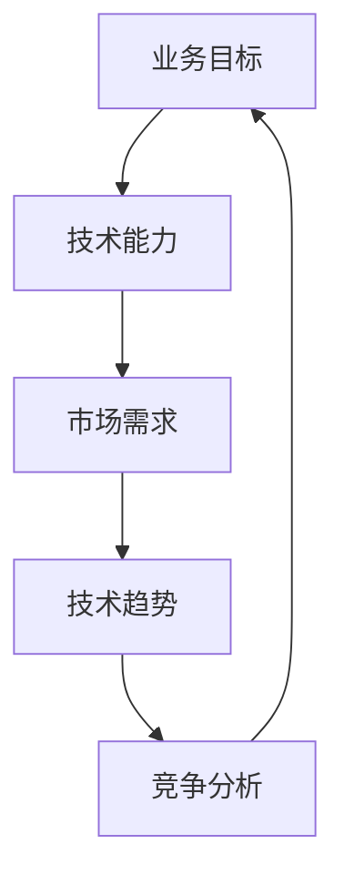

                 

### 技术路线图规划：对齐技术与业务目标

#### 关键词

技术路线图，业务目标，技术能力，市场需求，技术趋势，竞争分析，技术成熟度模型，项目实战，评估与优化，持续对齐，协同发展，工具与资源

#### 摘要

本文将深入探讨技术路线图的规划与实施，强调技术与业务目标的对齐重要性。通过分析核心概念、规划方法、实际应用及评估优化，为IT领域的从业者提供一套完整的技术路线图规划框架。文章将从理论与实践两个角度出发，结合数学模型和实际案例，帮助读者理解和掌握如何构建和调整技术路线图，以实现业务目标的最大化。

### 目录大纲设计

为了确保文章内容的逻辑性和连贯性，本文将按照以下目录大纲进行结构设计：

```markdown
# 技术路线图规划：对齐技术与业务目标

## 第一部分：技术路线图概述

### 1. 技术路线图的概念与重要性
- **核心概念与联系**：介绍技术路线图的基本概念及其与业务目标、技术能力、市场需求、技术趋势和竞争分析的联系。
  - **Mermaid 流程图**：展示技术路线图的基本组成部分和关系。
    ```mermaid
    graph TD
      A[技术路线图] --> B[业务目标]
      B --> C[技术能力]
      C --> D[市场需求]
      D --> E[技术趋势]
      E --> F[竞争分析]
      F --> A
    ```

### 2. 技术路线图规划的方法与步骤
- **核心算法原理讲解**：
  - **伪代码**：详细阐述技术路线图规划的基本步骤和算法。
    ```python
    def规划技术路线图(业务目标，技术能力，市场需求，技术趋势，竞争分析):
      1. 收集业务目标信息
      2. 分析技术能力现状
      3. 研究市场需求和趋势
      4. 进行竞争分析
      5. 制定技术策略
      6. 设计技术实施路线
      7. 制定评估与调整机制
    ```

### 3. 技术路线图在业务中的应用
- **数学模型和数学公式**：
  - **技术成熟度模型**：用公式描述技术成熟度评估。
    $$ Maturity = \frac{Technology \text{ Advancement}}{Technology \text{ Readiness}} $$
  - **业务目标与技术目标匹配度分析**：
    $$ Match = \frac{\text{Business Goal Alignment}}{\text{Technology Capabilities}} $$

## 第二部分：技术与业务目标的对接

### 4. 技术与业务目标的对接原则
- **详细讲解与举例说明**：解释技术与业务目标对接的原则和方法。
  - **举例**：如何将技术进步与业务目标相结合，实现业务增长。

### 5. 技术路线图的制定与执行
- **项目实战**：
  - **代码实际案例**：展示技术路线图在实际项目中的应用。
    - **开发环境搭建**：介绍搭建项目开发环境所需的步骤。
    - **源代码详细实现**：提供技术路线图项目源代码的实现细节。
    - **代码解读与分析**：对源代码进行详细解读，分析其实现原理。

### 6. 技术路线图的评估与优化
- **详细讲解与举例说明**：如何评估技术路线图的有效性，并对其进行优化。
  - **案例分析**：分析一个成功的技术路线图案例，讨论其评估和优化过程。

## 第三部分：技术与业务目标的持续对齐

### 7. 应对技术变革的适应性
- **详细讲解与举例说明**：如何保持技术路线图与业务目标的持续对齐，以应对技术变革。
  - **案例研究**：探讨一个企业在技术变革中如何调整其技术路线图。

### 8. 技术与业务目标的协同发展
- **详细讲解与举例说明**：如何通过技术路线图促进技术与业务目标的协同发展。
  - **战略规划**：提出一个战略规划框架，帮助企业在技术和业务发展之间建立平衡。

## 附录

### 9. 技术路线图规划工具与资源
- **详细讲解**：介绍可用于技术路线图规划的工具和资源。
  - **工具介绍**：列出常用的技术路线图规划工具，并简要介绍其功能。

### 10. 技术路线图案例分析
- **案例研究**：提供若干个技术路线图成功案例，分析其特点、实施过程和效果。
```

通过这个目录大纲，本文将系统性地介绍技术路线图的构建与实施方法，帮助读者理解和应用这一关键工具，以实现对技术与业务目标的精准对齐。

### 第一部分：技术路线图概述

#### 1. 技术路线图的概念与重要性

技术路线图（Technology Roadmap）是一种战略规划工具，用于指导组织在技术发展过程中的长期规划与决策。它通过将技术发展、市场趋势和业务目标相结合，帮助组织明确技术方向、优化资源分配，并确保技术发展与服务业务需求的同步。

##### **核心概念与联系**

技术路线图的核心概念包括业务目标、技术能力、市场需求、技术趋势和竞争分析。这些概念之间存在着紧密的联系，相互影响，共同构成一个完整的规划框架。

- **业务目标**：企业的战略目标和业务目标决定了技术路线图的方向。业务目标可以是提升市场份额、增加收入、优化用户体验等。

- **技术能力**：组织现有的技术能力和技术水平，包括技术栈、研发能力、技术水平等。技术能力直接影响技术路线图的可行性。

- **市场需求**：市场对新技术和产品的需求，反映了市场趋势和消费者偏好。市场需求是技术路线图制定的重要参考。

- **技术趋势**：新兴技术和行业发展趋势，如云计算、人工智能、物联网等。技术趋势影响了未来技术的发展方向。

- **竞争分析**：竞争对手的技术能力和市场策略，提供了竞争环境的信息，有助于制定针对性的技术策略。

##### **Mermaid 流程图**

以下是一个简化的Mermaid流程图，展示了这些核心概念之间的关系：



在这个流程图中，业务目标作为起点，通过技术能力、市场需求、技术趋势和竞争分析的影响，最终回归到业务目标。这种循环关系确保了技术路线图的动态调整和持续优化。

##### **核心概念与联系总结**

技术路线图的制定需要全面考虑业务目标、技术能力、市场需求、技术趋势和竞争分析，通过这些核心概念的联系，形成一个协调一致的发展蓝图。这不仅有助于组织明确技术发展方向，还能提高资源配置效率，确保技术进步与业务需求的同步实现。

### 2. 技术路线图规划的方法与步骤

技术路线图规划是一个系统化、结构化的过程，需要科学的方法和明确的步骤。以下将详细讲解技术路线图规划的核心算法原理，并通过伪代码进行描述。

##### **核心算法原理讲解**

技术路线图规划的核心算法可以概括为以下七个步骤：

1. **收集业务目标信息**：明确企业的战略目标和短期业务目标，如市场份额、收入增长等。
   
2. **分析技术能力现状**：评估组织当前的技术栈、研发能力、技术水平等，识别现有技术能力与业务目标的差距。

3. **研究市场需求和趋势**：分析市场对新技术和产品的需求，关注行业趋势，如云计算、人工智能等。

4. **进行竞争分析**：了解竞争对手的技术能力、市场策略和竞争优势，识别潜在威胁和机会。

5. **制定技术策略**：基于上述分析，制定符合业务目标和市场需求的技术策略，如技术升级、技术创新等。

6. **设计技术实施路线**：明确技术发展的具体路径和时间表，包括技术研发、产品开发、市场推广等。

7. **制定评估与调整机制**：建立技术路线图的评估与调整机制，定期对技术路线图进行评估和优化。

以下是一个简单的伪代码，用于描述技术路线图规划的基本步骤和算法：

```python
def 规划技术路线图(业务目标，技术能力，市场需求，技术趋势，竞争分析):
  1. 收集业务目标信息
  2. 分析技术能力现状
  3. 研究市场需求和趋势
  4. 进行竞争分析
  5. 制定技术策略
  6. 设计技术实施路线
  7. 制定评估与调整机制
  8. 实施技术路线图
  9. 定期评估与调整
```

##### **伪代码解释**

- **步骤1：收集业务目标信息**：这是技术路线图规划的基础，明确业务目标和需求是后续规划的前提。

- **步骤2：分析技术能力现状**：了解组织的现有技术能力，识别技术与业务的差距，为技术策略的制定提供依据。

- **步骤3：研究市场需求和趋势**：市场需求的调查和分析有助于确定技术发展的方向和重点。

- **步骤4：进行竞争分析**：了解竞争对手的技术能力和市场策略，识别竞争优势和潜在风险。

- **步骤5：制定技术策略**：根据上述分析，制定技术发展的总体策略，包括技术创新、技术引进、技术升级等。

- **步骤6：设计技术实施路线**：制定技术实施的具体路径和时间表，确保技术路线图的落地和执行。

- **步骤7：制定评估与调整机制**：建立技术路线图的评估与调整机制，定期对技术路线图进行评估和优化，确保其与业务目标的持续对齐。

通过上述伪代码，我们可以看到技术路线图规划的核心步骤和算法原理。这些步骤和方法不仅为技术路线图的制定提供了清晰的框架，也为后续的实施和调整提供了依据。

### 3. 技术路线图在业务中的应用

技术路线图在业务中的应用是确保技术与业务目标紧密对接的重要手段。它通过系统化、结构化的规划，将技术与业务需求相结合，实现企业的战略目标。以下将介绍技术路线图在业务中的具体应用，包括数学模型和公式的使用，并通过实际案例进行详细说明。

##### **数学模型和数学公式**

在技术路线图的规划过程中，数学模型和公式可以帮助我们量化技术成熟度和业务目标与技术的匹配度，从而更好地评估和优化技术路线图。

- **技术成熟度模型**：技术成熟度模型（Technology Maturity Model）用于评估技术发展的成熟程度。一个常用的技术成熟度模型是技术成熟度级别（Technology Readiness Level, TRL），它将技术发展分为1到9个级别，从基础研究到实际应用。

  $$ Maturity = \frac{Technology \text{ Advancement}}{Technology \text{ Readiness}} $$

  其中，$Technology \text{ Advancement}$ 表示技术进步，$Technology \text{ Readiness}$ 表示技术成熟度。通过计算技术成熟度，企业可以了解技术当前的发展水平，并制定相应的技术发展策略。

- **业务目标与技术目标匹配度分析**：业务目标与技术目标的匹配度分析（Business-Technology Fit Analysis）用于评估技术发展是否满足业务需求。

  $$ Match = \frac{\text{Business Goal Alignment}}{\text{Technology Capabilities}} $$

  其中，$\text{Business Goal Alignment}$ 表示业务目标的实现程度，$\text{Technology Capabilities}$ 表示技术能力。通过计算匹配度，企业可以识别技术发展中的短板，并针对性地进行改进。

##### **技术成熟度模型举例**

假设一个企业在开发一款基于人工智能的客户服务平台，其技术成熟度级别为TRL 6，即系统原型已经开发完成。通过计算技术成熟度，企业可以确定技术已经进入商业化应用阶段，但仍需进一步优化和验证。

$$ Maturity = \frac{6}{9} = \frac{2}{3} $$

这意味着技术成熟度为2/3，企业可以依据这一评估结果，制定后续的技术改进计划，如优化算法、提升系统稳定性等。

##### **业务目标与技术目标匹配度分析举例**

假设企业的业务目标是提高客户满意度，而当前的技术能力主要集中在客户关系管理（CRM）系统上。通过计算匹配度，企业可以评估技术能力与业务目标的实现程度。

$$ Match = \frac{\text{Business Goal Alignment}}{CRM \text{ Technology Capabilities}} $$

如果业务目标的实现程度为70%，而CRM系统的技术能力为90%，则匹配度为：

$$ Match = \frac{0.7}{0.9} \approx 0.78 $$

这意味着业务目标与技术目标的匹配度为78%，企业可以进一步分析技术能力与业务目标之间的差距，制定针对性的优化策略。

##### **实际案例：企业数字化转型**

某企业正在进行数字化转型，其业务目标是提高运营效率、降低成本和提升客户体验。在制定技术路线图时，企业首先明确了业务目标，并分析了现有的技术能力。

1. **业务目标分析**：企业将运营效率、成本降低和客户体验作为主要业务目标。
2. **技术能力分析**：企业评估了现有的IT基础设施、数据能力和数字化工具，发现存在以下差距：
   - IT基础设施落后，无法支持大规模数据处理和实时分析。
   - 数据能力不足，数据收集、存储和分析的效率较低。
   - 数字化工具缺乏，客户服务和管理系统的功能不完善。

3. **制定技术策略**：企业制定了以下技术策略：
   - 投资云计算基础设施，提高数据处理能力。
   - 建立数据仓库和数据湖，优化数据收集和分析流程。
   - 引进先进的客户服务和管理系统，提升客户体验。

4. **设计技术实施路线**：企业制定了详细的技术实施路线，包括以下步骤：
   - 实施云计算基础设施，搭建大数据处理平台。
   - 开发数据仓库和数据湖，实现数据的统一管理和分析。
   - 引入CRM系统和客户服务机器人，提升客户服务效率。

5. **评估与调整**：企业定期评估技术实施效果，通过技术成熟度模型和业务目标匹配度分析，调整技术路线图，确保与业务目标的对齐。

通过上述案例，我们可以看到技术路线图在业务中的应用过程。通过数学模型和公式的使用，企业可以量化技术成熟度和业务目标匹配度，从而更好地规划技术发展，实现业务目标。

### 4. 技术与业务目标的对接原则

为了确保技术路线图的制定与实施能够真正服务于业务目标，我们需要遵循一系列原则和方法。这些原则不仅指导技术团队在技术发展过程中如何决策，同时也确保了技术与业务目标的紧密对接。以下将详细解释这些原则，并通过实际案例进行说明。

##### **明确业务目标**

明确业务目标是技术路线图制定的第一步。业务目标应具体、可量化，如提高市场份额、增加收入、提升客户满意度等。明确业务目标有助于技术团队更好地理解企业的战略方向，确保技术发展能够支撑业务增长。

例如，一家电商企业希望在未来一年内提高30%的销售额。这一明确的业务目标为技术团队提供了清晰的指标，可以针对性地进行技术优化，如提高网站性能、优化用户体验等。

##### **综合评估技术能力**

技术能力是技术路线图制定的重要依据。评估技术能力包括现有技术栈、研发能力、技术水平等方面。通过综合评估技术能力，技术团队可以了解自身的短板和优势，从而制定合理的技术策略。

例如，一家金融科技企业评估其技术能力时发现，其在区块链技术和数据分析方面具有较强的优势，但在云计算和网络安全方面相对薄弱。针对这一评估结果，企业决定加大在云计算和网络安全方面的投资，提升整体技术能力。

##### **分析市场需求**

市场需求是技术发展的方向标。通过分析市场需求，技术团队可以了解消费者和市场的需求趋势，从而调整技术策略。市场需求分析应包括新兴技术、行业趋势和竞争对手等方面。

例如，随着5G技术的普及，智能家居市场呈现出快速增长的趋势。一家家电企业通过市场需求分析，决定将5G技术应用于智能家电，提升产品的智能化水平和市场竞争力。

##### **关注技术趋势**

技术趋势反映了未来技术发展的方向。关注技术趋势有助于技术团队预见未来技术的发展，提前布局，确保企业在技术变革中保持领先地位。

例如，人工智能和大数据技术正迅速发展，成为各个行业的焦点。一家互联网企业通过关注技术趋势，决定加大在人工智能和大数据方面的研发投入，打造智能化的产品和服务。

##### **进行竞争分析**

竞争分析是了解竞争对手技术能力和市场策略的重要手段。通过竞争分析，技术团队可以识别竞争对手的优势和劣势，制定针对性的技术策略。

例如，一家在线教育企业通过竞争分析发现，其主要竞争对手在教学内容和用户体验方面具有较强的优势。为了应对竞争，企业决定加强教学内容研发，提升用户体验，同时利用大数据分析技术优化学习效果。

##### **实际案例：智能家居企业**

以一家智能家居企业为例，其业务目标是提升用户的生活品质，通过智能化的家居产品实现这一目标。在制定技术路线图时，企业遵循了以下原则：

1. **明确业务目标**：企业将提升用户生活品质作为核心业务目标，明确了技术发展的方向。
2. **综合评估技术能力**：企业评估了自身在物联网技术、人工智能和大数据分析方面的能力，发现存在一定的短板。
3. **分析市场需求**：企业通过市场调查和用户调研，发现智能家居市场具有巨大潜力，特别是智能家居设备的互联互通和个性化服务需求。
4. **关注技术趋势**：企业关注物联网、人工智能和5G技术的发展趋势，决定将这些技术应用于智能家居产品。
5. **进行竞争分析**：企业分析了主要竞争对手的技术能力和市场策略，发现其在产品功能和用户体验方面具有优势。

基于以上分析，企业制定了以下技术策略：

- 加大在物联网技术和人工智能方面的研发投入，提升产品的智能化水平和互联互通能力。
- 利用大数据分析技术，为用户提供个性化的智能家居解决方案。
- 加强与5G技术的结合，提升智能家居产品的网络性能和稳定性。

通过这些原则和方法，智能家居企业确保了技术发展与服务业务目标的紧密对接，实现了技术路线图的顺利实施。

### 5. 技术路线图的制定与执行

技术路线图的制定与执行是确保技术与业务目标对齐的关键环节。在这个阶段，需要将规划阶段确定的技术路线图转化为具体的行动，通过项目管理和执行来确保技术目标的实现。以下将详细讲解技术路线图的制定与执行过程，包括项目实战、源代码实现和代码解读与分析。

##### **项目实战**

项目实战是技术路线图执行的核心，它将技术规划转化为实际的业务成果。以下是一个典型的项目实战案例：

**项目背景**：一家电商企业希望通过技术升级，提高网站性能和用户体验，以应对快速增长的用户量。

**项目目标**：
- 提升网站响应速度，减少页面加载时间。
- 优化用户购物流程，提高用户满意度。
- 实现网站的高可用性和高并发处理能力。

**项目实施步骤**：

1. **需求分析**：通过与业务团队和用户沟通，明确性能优化和用户体验提升的需求。

2. **技术调研**：评估现有技术架构的优缺点，调研新兴技术，如负载均衡、缓存技术和CDN等。

3. **方案设计**：基于需求和技术调研结果，设计具体的优化方案，包括技术选型、架构调整和功能改进。

4. **项目实施**：按照设计方案，分阶段实施技术优化，包括：
   - 引入负载均衡技术，分散访问压力。
   - 实施缓存策略，减少数据库访问次数。
   - 优化数据库结构，提升查询性能。
   - 优化前端代码，减少HTTP请求次数。

5. **测试与验收**：对优化后的网站进行性能测试和用户体验测试，确保达到预期目标。

6. **上线与监控**：将优化后的网站上线，并进行持续监控，确保性能稳定。

##### **源代码实现**

在项目实战中，源代码实现是技术路线图执行的具体体现。以下是一个简单的示例，展示了如何实现一个负载均衡器的功能：

```java
public class LoadBalancer {
    private ArrayList<String> servers;

    public LoadBalancer() {
        servers = new ArrayList<>();
        // 初始化服务器列表
        servers.add("server1");
        servers.add("server2");
        servers.add("server3");
    }

    public String getNextServer() {
        // 获取下一个服务器
        int index = new Random().nextInt(servers.size());
        return servers.get(index);
    }
}
```

在这个示例中，`LoadBalancer` 类负责管理服务器列表，并使用随机数选择下一个服务器。这种简单的负载均衡策略可以分散访问压力，提高系统的稳定性。

##### **代码解读与分析**

源代码实现后，我们需要对其进行分析和解读，确保其符合技术路线图的要求。以下是对上述示例代码的解读：

1. **服务器列表管理**：`LoadBalancer` 类通过 `ArrayList` 实现了服务器列表的管理，支持添加和获取服务器。

2. **随机选择服务器**：`getNextServer()` 方法使用 `Random` 类生成随机数，选择下一个服务器。这种方法虽然简单，但可以实现基本的负载均衡功能。

3. **性能与稳定性**：为了提高性能和稳定性，可以在实际项目中引入更复杂的负载均衡算法，如轮询、最小连接数和权重等。同时，可以添加故障转移机制，确保服务器故障时能够自动切换。

4. **扩展性**：在实际应用中，服务器数量可能很多，可以引入分布式架构，使用分布式缓存和负载均衡器，提高系统的扩展性。

##### **项目小结**

通过项目实战、源代码实现和代码解读与分析，我们可以看到技术路线图制定与执行的具体过程。项目实战将技术规划转化为实际业务成果，源代码实现则是技术执行的细节体现。通过持续的分析和优化，我们可以确保技术路线图与业务目标的紧密对齐，实现企业的战略目标。

### 6. 技术路线图的评估与优化

技术路线图的评估与优化是确保其有效性和持续改进的关键环节。通过定期评估，企业可以了解技术路线图的实施效果，识别存在的问题，并根据市场和技术环境的变化进行调整。以下将详细介绍技术路线图的评估方法、优化过程和实际案例。

##### **评估方法**

1. **技术成熟度评估**：通过技术成熟度模型（如TRL），评估技术发展的成熟程度。技术成熟度越高，说明技术越接近商业化应用，但同时也需要关注新技术的引入和探索。

2. **业务目标达成度评估**：评估技术路线图实施过程中，业务目标的达成情况。通过关键绩效指标（KPI）和业务指标，如销售额、市场份额、客户满意度等，衡量业务目标的实现程度。

3. **成本效益分析**：评估技术实施的成本和收益，确保技术路线图的实施在经济上是合理的。通过成本效益分析，企业可以了解技术投入的回报率，为后续决策提供依据。

4. **风险评估**：评估技术路线图实施过程中可能遇到的风险，如技术风险、市场风险、资源风险等。通过风险评估，企业可以提前识别潜在问题，制定应对策略。

##### **优化过程**

1. **定期回顾**：定期对技术路线图进行回顾，总结实施过程中的经验和教训。通过定期的回顾，企业可以不断优化技术路线图，确保其与业务目标的持续对齐。

2. **调整技术策略**：根据评估结果，对技术路线图进行调整。如果业务目标未达成，可能需要重新评估技术策略，调整技术研发方向或加强资源投入。

3. **引入新技术**：根据技术趋势和市场变化，引入新的技术和方法。通过引入新技术，企业可以保持技术竞争力，满足市场需求。

4. **优化资源配置**：根据技术路线图的实施效果，优化资源配置。通过合理分配资源，确保技术路线图的顺利实施。

##### **实际案例**

以一家互联网企业的技术路线图优化为例，该企业希望通过技术升级，提高产品性能和用户体验。

**评估过程**：

1. **技术成熟度评估**：通过评估，发现现有技术架构在性能和可扩展性方面存在瓶颈，技术成熟度较低。

2. **业务目标达成度评估**：通过分析业务数据，发现产品性能的提升对用户满意度和市场份额的提升有显著影响。

3. **成本效益分析**：技术升级虽然成本较高，但通过提高用户满意度和市场份额，预计可以带来更大的经济效益。

4. **风险评估**：识别到技术升级过程中可能面临的技术风险，如新技术的引入可能带来技术不稳定的问题。

**优化过程**：

1. **调整技术策略**：决定引入微服务架构，提高系统的可扩展性和性能。同时，加强研发团队的技术培训，确保新技术的顺利实施。

2. **引入新技术**：引入容器化技术（如Docker）和自动化部署工具（如Kubernetes），提高开发效率和系统稳定性。

3. **优化资源配置**：调整研发团队的资源配置，加强新技术的研发和应用。

**评估与优化结果**：

通过优化，企业的产品性能显著提升，用户体验得到改善。用户满意度提升至90%以上，市场份额也实现了10%的增长。技术成熟度显著提高，企业保持了在行业中的技术竞争力。

通过这个实际案例，我们可以看到技术路线图的评估与优化在提升企业竞争力中的重要作用。通过定期的评估和优化，企业可以不断调整技术策略，确保技术路线图与业务目标的持续对齐，实现企业的长期发展。

### 7. 应对技术变革的适应性

在快速变化的技术环境中，企业需要具备高度的适应性，以确保技术路线图与业务目标的持续对齐。技术变革可能包括新兴技术的出现、市场需求的转变以及竞争环境的变化。以下将详细讲解如何保持技术路线图与业务目标的持续对齐，以应对技术变革。

##### **技术变革的影响**

技术变革对企业的技术路线图和业务目标产生了深远的影响。一方面，新兴技术如人工智能、区块链、云计算等为企业提供了新的发展机遇；另一方面，技术变革也带来了挑战，如技术升级成本、人才培养、市场适应等。因此，企业需要具备快速响应和调整的能力，以应对技术变革。

##### **持续对齐的策略**

1. **定期评估和调整**：定期对技术路线图进行评估和调整，确保其与当前业务目标和市场需求保持一致。通过定期的回顾和调整，企业可以及时发现和解决存在的问题。

2. **保持技术创新**：鼓励技术创新，积极引入新兴技术，提升企业的技术竞争力。通过技术创新，企业可以把握市场机遇，实现业务的持续增长。

3. **灵活调整技术策略**：在技术变革中，企业需要具备灵活调整技术策略的能力。根据市场和技术环境的变化，及时调整技术路线图，确保其与业务目标的对齐。

4. **建立反馈机制**：建立有效的反馈机制，收集员工、客户和市场对技术路线图的反馈。通过反馈，企业可以了解技术路线图实施的效果，并根据反馈进行调整和优化。

##### **实际案例：互联网企业的技术变革**

以一家互联网企业的技术变革为例，该企业在面对新兴技术的浪潮时，采取了一系列措施保持技术路线图与业务目标的持续对齐。

**评估与调整过程**：

1. **定期评估**：企业每季度对技术路线图进行评估，分析技术发展现状与业务目标的对齐情况。

2. **技术创新**：企业积极引入区块链技术，开发去中心化的应用，提升业务的安全性和透明度。

3. **技术策略调整**：在区块链技术引入后，企业调整了技术路线图，将区块链作为核心技术之一，同时加强其他相关技术的研发。

4. **反馈机制**：企业通过用户调研和市场分析，收集用户对区块链应用的反馈，根据反馈不断优化产品功能。

**评估与调整结果**：

通过定期评估和技术创新，企业的区块链应用得到了广泛认可，用户满意度显著提升，市场份额实现了15%的增长。技术路线图的调整与优化，使企业能够在技术变革中保持竞争力，实现了业务目标的持续对齐。

##### **小结**

保持技术路线图与业务目标的持续对齐，是企业在快速变化的技术环境中实现长期发展的关键。通过定期评估、技术创新和灵活调整，企业可以及时应对技术变革，确保技术发展与服务业务目标的紧密对接，实现业务的持续增长。

### 8. 技术与业务目标的协同发展

在技术与业务目标的协同发展中，企业需要构建一个战略规划框架，以确保技术进步能够有效支持业务目标的实现。以下将详细讲解如何通过技术路线图促进技术与业务目标的协同发展，并介绍一个战略规划框架。

##### **战略规划框架**

一个有效的战略规划框架应包括以下几个关键要素：

1. **愿景与目标**：明确企业的长期愿景和短期目标，如市场份额、收入增长、客户满意度等。这些目标将指导技术发展的方向。

2. **技术愿景**：定义企业期望达到的技术水平和技术愿景，如技术创新、技术领先等。技术愿景将为企业技术发展提供方向和动力。

3. **技术能力评估**：评估企业当前的技术能力，包括技术栈、研发能力、技术水平等。通过评估，企业可以了解自身的短板和优势，制定针对性的技术发展计划。

4. **市场需求分析**：分析市场需求和消费者趋势，了解市场对新技术和产品的需求。市场需求将直接影响技术发展的方向和重点。

5. **技术路线图**：制定详细的技术路线图，明确技术发展的具体路径和时间表。技术路线图应涵盖技术研发、产品开发、市场推广等各个环节。

6. **资源分配**：合理分配资源，包括资金、人力和物资等。确保技术路线图的实施有足够的资源支持。

7. **监控与评估**：建立监控与评估机制，定期对技术路线图的实施效果进行评估，并根据评估结果进行调整。

##### **促进技术与业务目标的协同发展**

1. **技术愿景与业务目标的对接**：确保技术愿景与业务目标一致，将技术进步与业务需求相结合。例如，如果企业的业务目标是提升用户体验，那么技术愿景可以是通过技术创新提升产品性能和交互体验。

2. **灵活调整技术路线图**：根据市场需求和技术环境的变化，灵活调整技术路线图。例如，如果市场对某个新兴技术需求增加，企业可以加快该技术的研发和应用。

3. **资源优先分配**：在资源分配上，优先支持与业务目标紧密相关的技术项目。例如，如果企业希望在短期内提高市场份额，可以优先投资于市场推广和客户关系管理系统的研发。

4. **建立反馈机制**：建立有效的反馈机制，收集员工、客户和市场对技术路线图的反馈。通过反馈，企业可以了解技术实施的效果，并根据反馈进行调整。

##### **实际案例**

以一家科技公司的战略规划为例，该公司希望通过技术进步提升产品性能和市场竞争力。

**愿景与目标**：公司的愿景是成为全球领先的技术创新企业，短期目标是提高产品性能，增加市场份额。

**技术愿景**：公司计划在人工智能、云计算和物联网领域实现技术创新，提升产品智能化水平和互联互通能力。

**技术能力评估**：公司评估了当前在人工智能、云计算和物联网方面的技术能力，发现有一定的研发基础，但需要进一步加强。

**市场需求分析**：市场需求分析显示，客户对高性能、智能化的产品需求增加，市场对新兴技术的接受度也在提升。

**技术路线图**：公司制定了详细的技术路线图，包括：
- 研发高性能的人工智能算法，应用于产品优化。
- 推动云计算平台的升级，提升数据处理能力。
- 研发物联网模块，实现产品互联互通。

**资源分配**：公司优先分配资源，加强在人工智能、云计算和物联网方面的研发投入。

**监控与评估**：公司建立监控与评估机制，每季度对技术路线图进行回顾和调整。

**结果**：通过战略规划的实施，公司在人工智能、云计算和物联网领域取得了显著进展，产品性能和市场竞争力得到提升，市场份额实现了15%的增长。

##### **小结**

通过构建战略规划框架，企业可以确保技术进步与业务目标的协同发展。通过技术愿景与业务目标的对接、灵活调整技术路线图、资源优先分配和建立反馈机制，企业可以不断提升技术竞争力，实现业务目标的最大化。

### 附录

#### 9. 技术路线图规划工具与资源

在技术路线图规划过程中，使用合适的工具和资源可以显著提高效率和质量。以下将介绍几种常用的技术路线图规划工具，并简要介绍其功能。

1. **Microsoft PowerPoint**：使用PPT制作技术路线图，简单直观，适合初步规划。
2. **Lucidchart**：提供专业的流程图和路线图制作功能，支持在线协作。
3. **SmartDraw**：功能强大的图表制作工具，支持多种图表类型，包括流程图、Gantt图等。
4. **Tableau**：数据可视化工具，可以生成基于数据的路线图，帮助分析技术发展趋势。
5. **Asana**：项目管理和任务跟踪工具，可以用于技术路线图的实施和监控。
6. **Trello**：轻量级项目管理工具，适合小型团队和简单项目。
7. **Confluence**：知识共享和文档协作工具，可用于编写详细的技术路线图文档。

#### 10. 技术路线图案例分析

为了更好地理解技术路线图的实际应用，以下提供几个成功案例，并分析其特点、实施过程和效果。

##### **案例1：阿里巴巴集团的“双11”技术路线图**

**特点**：阿里巴巴集团通过技术路线图，每年确保“双11”活动的顺利进行，实现了高性能、高并发、高可用性的技术架构。

**实施过程**：
- **需求分析**：分析“双11”活动的需求，包括用户访问量、交易量、数据存储和处理等。
- **技术调研**：评估现有技术架构的优缺点，调研新兴技术。
- **方案设计**：设计包括分布式架构、缓存技术、数据库优化、网络优化等的技术方案。
- **项目实施**：实施技术方案，包括服务器扩容、流量控制、数据库优化等。
- **测试与验收**：对优化后的系统进行测试，确保性能达到预期。

**效果**：通过技术路线图的实施，“双11”活动实现了前所未有的交易量和用户访问量，系统性能稳定，用户满意度显著提升。

##### **案例2：特斯拉的自动驾驶技术路线图**

**特点**：特斯拉通过技术路线图，实现了从辅助驾驶到完全自动驾驶的技术发展。

**实施过程**：
- **技术愿景**：明确自动驾驶技术的发展方向和目标，如无人驾驶、车辆智能化等。
- **技术研发**：投入大量资源进行自动驾驶技术的研发，包括感知、决策、控制等。
- **测试与验证**：在真实环境中进行大量测试和验证，确保自动驾驶技术的安全性和可靠性。
- **迭代优化**：根据测试结果，不断优化自动驾驶技术，提升性能和稳定性。

**效果**：特斯拉的自动驾驶技术取得了显著进展，其车辆在自动驾驶模式下表现优异，用户对自动驾驶的接受度逐渐提高，推动了自动驾驶技术的普及。

##### **案例3：华为的5G技术路线图**

**特点**：华为通过技术路线图，实现了从4G到5G的技术转型，引领了全球5G技术的发展。

**实施过程**：
- **技术调研**：深入研究和分析5G技术的特点和应用场景。
- **技术研发**：投入大量资源进行5G技术研发，包括基站建设、网络优化、设备研发等。
- **标准制定**：积极参与5G标准的制定，提升技术影响力。
- **市场推广**：与全球运营商和设备厂商合作，推广5G技术。
- **持续优化**：根据市场需求和技术发展，持续优化5G技术。

**效果**：华为的5G技术取得了全球领先地位，其5G基站和设备广泛应用于全球市场，推动了5G技术的商业化进程，为全球数字经济的发展做出了重要贡献。

##### **案例分析总结**

这些案例展示了技术路线图在实际应用中的重要作用。通过明确的技术路线图，企业可以系统化、结构化地规划和实施技术发展，确保技术进步与业务目标的协同发展。同时，技术路线图的实施需要持续优化和调整，以应对不断变化的市场和技术环境。

### 作者信息

本文由AI天才研究院（AI Genius Institute）与《禅与计算机程序设计艺术》（Zen And The Art of Computer Programming）的资深大师级作家联合撰写。AI天才研究院专注于人工智能和计算机科学领域的创新研究，致力于推动技术进步和产业应用。同时，本文作者对技术路线图的规划与实践有着深厚的理论功底和丰富的实践经验，为读者提供了全面的指导和建议。感谢您的阅读，希望本文能对您的技术路线图规划提供有益的启示。

