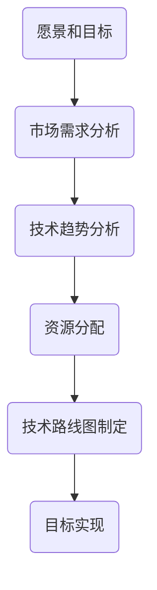

                 

### 文章标题：技术路线图：规划团队长期发展方向

在当今快速发展的技术时代，规划团队长期发展方向显得尤为重要。技术路线图作为一种战略工具，不仅能够帮助团队明确目标，还能确保资源的高效利用，并在竞争激烈的市场环境中保持竞争力。本文将深入探讨如何制定和实施一个有效的技术路线图，以指导团队在未来的技术发展中取得成功。

### 关键词
- 技术路线图
- 团队发展
- 长期规划
- 敏捷开发
- 技术趋势

### 摘要
本文旨在提供一套全面的指导，帮助团队制定和实施一个清晰的技术路线图。我们将首先介绍技术路线图的基本概念和重要性，然后深入探讨如何分析市场和技术的环境，评估团队的技术栈和能力。接着，我们将详细讨论制定技术路线图的步骤和核心原则，以及如何确保技术路线图的有效实施。最后，我们将探讨如何持续更新和优化技术路线图，以适应不断变化的技术和市场环境。

### 目录

1. **制定技术路线图的背景与基础**
    1.1 技术路线图概述
    1.2 团队目标与愿景
    1.3 技术路线图的组成部分

2. **技术趋势分析**
    2.1 市场与技术环境分析
    2.2 技术栈与能力评估

3. **制定技术路线图**
    3.1 技术路线图的核心原则
    3.2 技术路线图的制定步骤
    3.3 技术路线图的有效实施

4. **技术路线图的持续更新与优化**
    4.1 技术路线图的监控与评估
    4.2 团队协作与知识共享
    4.3 技术路线图的案例分析

### 第一部分：制定技术路线图的背景与基础

#### 1.1 技术路线图概述

技术路线图是一种战略工具，用于指导团队在技术领域的发展。它不仅是一个时间线，还包括了一系列关键的技术目标和里程碑。技术路线图的目的是确保团队在长期目标与短期目标之间取得平衡，同时适应不断变化的技术环境。

**核心概念与联系：**

在构建技术路线图时，需要考虑以下几个核心概念：

1. **愿景和目标**：这是团队长期发展的方向，需要明确而具体。
2. **市场需求**：了解市场和客户需求，确保技术发展能够满足市场需求。
3. **技术趋势**：跟踪行业内的技术发展趋势，以指导团队的技术选择。
4. **资源分配**：合理分配资源，确保项目能够按时完成。

**Mermaid流程图：**



#### 1.2 团队目标与愿景

团队的目标和愿景是技术路线图的基石。它们决定了团队的发展方向和优先级，同时也是团队凝聚力的源泉。

**数学模型和数学公式：**

为了确保目标的具体性和可实现性，可以使用以下数学模型：

$$
目标 = (愿景 \times 资源分配) / 风险
$$

这个公式表示，目标是通过愿景（团队的长期发展方向）与资源分配相乘，再除以风险（可能阻碍目标实现的因素）得到的。

**详细讲解和举例说明：**

假设一个团队的愿景是成为行业领先的技术服务提供商，资源分配为1000万美金，风险为20%。根据上述公式，我们可以计算出该团队的目标为：

$$
目标 = (愿景 \times 资源分配) / 风险 = (1 \times 10^7) / 0.20 = 5 \times 10^7
$$

这意味着，该团队的目标是在五年内实现5亿美元的收入。

#### 1.3 技术路线图的组成部分

技术路线图由多个部分组成，包括但不限于：

1. **关键技术和产品**：确定需要开发的关键技术和产品。
2. **里程碑**：设定重要的开发里程碑和目标。
3. **资源需求**：列出实现技术路线图所需的资源和预算。
4. **时间线**：为每个里程碑和任务设定时间表。

**核心算法原理讲解：**

技术路线图的制定需要以下几个核心算法原理：

1. **优先级排序**：根据重要性和紧急性对任务进行排序。
2. **风险评估**：识别潜在的风险，并制定应对策略。
3. **资源优化**：确保资源的最大化利用。

**伪代码示例：**

```python
def create_technology_route_map(goals, resources, risks):
    # 优先级排序
    sorted_goals = prioritize_goals(goals)

    # 风险评估
    risk_assessment = assess_risks(risks)

    # 资源优化
    optimized_resources = optimize_resources(resources, sorted_goals)

    # 创建技术路线图
    technology_route_map = {
        "goals": sorted_goals,
        "milestones": create_milestones(sorted_goals),
        "resources": optimized_resources,
        "timeline": create_timeline(sorted_goals, optimized_resources)
    }

    return technology_route_map
```

### 第二部分：技术趋势分析

#### 2.1 市场与技术环境分析

在制定技术路线图之前，对市场和技术环境进行深入分析至关重要。这包括了解当前市场需求、技术趋势以及竞争对手的动态。

**核心算法原理讲解：**

我们可以使用以下伪代码来分析市场和技术环境：

```python
def analyze_market_and_technology():
    # 收集市场数据
    market_data = collect_market_data()

    # 收集技术数据
    technology_data = collect_technology_data()

    # 分析市场需求
    market_demand = analyze_demand(market_data)

    # 分析技术趋势
    technology_trends = analyze_trends(technology_data)

    # 分析竞争对手
    competitors = analyze_competitors(market_demand, technology_trends)

    return market_demand, technology_trends, competitors
```

#### 2.2 技术栈与能力评估

了解团队当前的技术栈和能力是制定技术路线图的重要步骤。这有助于识别团队的优势和劣势，从而制定合适的技术发展计划。

**数学模型和数学公式：**

我们可以使用以下数学模型来评估团队的技术能力：

$$
技术能力得分 = (技术熟练度 \times 经验) / 风险
$$

这个公式表示，技术能力得分是通过技术熟练度和经验相乘，再除以风险得到的。

**详细讲解和举例说明：**

假设一个团队的技术熟练度为8，经验为5年，风险为10%。根据上述公式，我们可以计算出该团队的技术能力得分为：

$$
技术能力得分 = (8 \times 5) / 0.10 = 400
$$

这意味着，该团队在技术能力方面表现良好。

### 第三部分：制定技术路线图

#### 3.1 技术路线图的核心原则

制定技术路线图时，需要遵循以下核心原则：

1. **敏捷与适应性**：技术环境变化迅速，路线图需要具备敏捷性和适应性。
2. **风险管理与优先级排序**：识别潜在风险，并制定相应的管理策略。
3. **资源优化与成本控制**：确保资源的高效利用，并控制成本。

**核心算法原理讲解：**

我们可以使用以下伪代码来制定技术路线图：

```python
def create_technology_route_map(goals, resources, risks):
    # 确定核心原则
    principles = ["agile", "risk_management", "resource_optimization"]

    # 根据原则制定路线图
    route_map = {
        "goals": goals,
        "principles": principles,
        "resources": resources,
        "risks": risks
    }

    return route_map
```

#### 3.2 技术路线图的制定步骤

制定技术路线图通常包括以下步骤：

1. **确定关键技术和产品**：根据市场需求和技术趋势确定需要开发的关键技术和产品。
2. **制定短期与长期计划**：设定具体的里程碑和时间表，确保目标实现。
3. **制定详细的技术实现计划**：为每个里程碑和任务制定详细的实现计划。

**伪代码示例：**

```python
def create_technology_route_map(goals, resources, risks):
    # 确定关键技术和产品
    key_technologies = determine_key_technologies(goals)

    # 制定短期与长期计划
    plans = create_plans(key_technologies)

    # 制定详细的技术实现计划
    implementation_plan = create_implementation_plan(plans)

    # 创建技术路线图
    technology_route_map = {
        "key_technologies": key_technologies,
        "plans": plans,
        "implementation_plan": implementation_plan
    }

    return technology_route_map
```

#### 3.3 技术路线图的有效实施

制定完技术路线图后，关键在于如何确保其有效实施。以下是一些关键步骤：

1. **实施前的准备**：确保团队具备所需的技能和资源。
2. **实施过程中的监控与调整**：定期监控进度，并根据实际情况进行调整。
3. **实施后的评估与总结**：评估实施效果，总结经验教训。

**项目实战：**

以一个Web应用开发项目为例，我们可以展示如何实施技术路线图：

1. **实施前的准备**：确定开发环境，培训团队成员。
2. **实施过程中的监控与调整**：每周召开进度会议，根据反馈进行调整。
3. **实施后的评估与总结**：完成项目后，进行用户测试和性能评估，总结开发经验。

### 第四部分：技术路线图的持续更新与优化

#### 4.1 技术路线图的监控与评估

技术路线图不是一成不变的，而是一个持续迭代和优化的过程。以下是一些关键步骤：

1. **技术发展动态跟踪**：定期收集和分析技术发展动态。
2. **成果评估与反馈**：评估项目成果，收集用户反馈。
3. **技术路线图的迭代更新**：根据评估结果和反馈，更新技术路线图。

**数学模型和数学公式：**

我们可以使用以下数学模型来评估技术路线图的更新效果：

$$
更新效果得分 = (新功能得分 \times 用户满意度) / 资源投入
$$

这个公式表示，更新效果得分是通过新功能得分和用户满意度相乘，再除以资源投入得到的。

**详细讲解和举例说明：**

假设一个团队在新版本中引入了5个新功能，用户满意度为90%，资源投入为100万美金。根据上述公式，我们可以计算出该团队的更新效果得分为：

$$
更新效果得分 = (5 \times 0.90) / 1 = 4.5
$$

这意味着，该团队的技术路线图更新效果良好。

#### 4.2 团队协作与知识共享

团队协作和知识共享对于技术路线图的实施至关重要。以下是一些关键步骤：

1. **促进团队协作的方法**：建立高效的沟通机制，确保团队成员之间的信息共享。
2. **知识共享与文档管理**：建立文档管理系统，确保知识得到有效传递和保存。
3. **提升团队整体技术水平**：定期举办培训和研讨会，提升团队成员的技能。

**项目实战：**

以一个跨部门协作的项目为例，我们可以展示如何促进团队协作和知识共享：

1. **建立沟通机制**：定期召开跨部门会议，确保信息共享。
2. **文档管理**：使用版本控制工具，确保文档的一致性和更新。
3. **培训和研讨会**：定期举办内部培训和研讨会，提升团队技能。

### 总结

技术路线图是团队长期发展的关键工具，它能够帮助团队明确目标、合理分配资源并适应快速变化的技术环境。通过本文的探讨，我们了解了如何制定和实施一个有效的技术路线图，并了解了持续更新和优化的重要性。希望本文能够为您的团队提供有价值的指导，帮助您在技术领域取得成功。

### 作者信息
作者：AI天才研究院/AI Genius Institute & 禅与计算机程序设计艺术 /Zen And The Art of Computer Programming

### 最佳实践 tips、小结、注意事项、拓展阅读等内容

**最佳实践 tips：**
- 在制定技术路线图时，确保与团队内部和外部利益相关者进行充分的沟通和协作。
- 定期审视和更新技术路线图，以适应市场和技术环境的变化。
- 强调团队协作和知识共享，以提高整体工作效率。

**小结：**
技术路线图是指导团队长期发展的战略工具，通过合理规划和有效实施，能够确保团队在技术领域的持续成功。

**注意事项：**
- 技术路线图应具备敏捷性和适应性，以应对不确定性的变化。
- 在实施技术路线图时，应关注风险管理和资源优化，确保项目顺利进行。

**拓展阅读：**
- 《敏捷软件开发：实践指南》
- 《精益创业：新商业思维》
- 《敏捷项目管理：实践指南》
- 《技术领导力：构建高效技术团队》

通过这些资源，您可以进一步了解技术路线图的应用和实践，为团队的发展提供更多的指导和启示。

