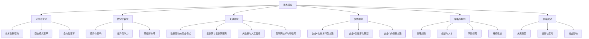

                 

### 文章标题：技术转型：传统企业的技术转型之路

> 关键词：技术转型、传统企业、数字化转型、云计算、大数据、人工智能

> 摘要：本文将深入探讨传统企业在面临数字化浪潮时，如何通过技术转型实现可持续发展。文章从技术转型的背景出发，详细阐述了技术转型的关键领域、实践案例、策略与规划，以及未来展望，旨在为传统企业提供一套系统的技术转型指南。

----------------------------------------------------------------

### 引言

随着互联网、云计算、大数据、人工智能等新兴技术的迅猛发展，全球经济正经历着深刻的变革。传统企业面临着前所未有的挑战，同时也迎来了巨大的机遇。在这个数字化时代，技术转型已成为传统企业生存与发展的关键。

技术转型不仅仅是一种技术上的升级，更是一种商业模式和思维模式的变革。它涉及到企业运营的方方面面，从供应链管理、市场营销到客户服务，都需要通过技术创新来提升效率、降低成本、增强竞争力。对于传统企业来说，技术转型不仅能够帮助它们更好地适应市场变化，还能开辟新的增长空间，实现可持续发展。

本文将围绕技术转型的主题，深入探讨以下几个方面：

1. 技术转型的背景与意义
2. 技术转型的关键领域
3. 技术转型的实践案例
4. 技术转型的策略与规划
5. 技术转型的未来展望

通过以上几个方面的讨论，本文旨在为传统企业提供一套系统的技术转型指南，帮助它们在数字化浪潮中找到自己的立足点，实现转型升级。

----------------------------------------------------------------

### 设计目录大纲的基本步骤

设计一个清晰、合理的目录大纲是撰写高质量技术博客的重要前提。以下是一系列设计目录大纲的基本步骤：

1. **理解书名和主题**：首先，深入理解书名和主题。《技术转型：传统企业的技术转型之路》这一标题明确指向了传统企业如何通过技术手段实现转型升级。技术转型不仅涉及技术层面的升级，还包括商业模式、运营流程的变革。理解这一核心概念有助于构建出全面、深入的目录大纲。

2. **确定主要章节**：基于书名和主题，可以初步确定一些主要章节，如技术转型的背景、关键领域、实践案例、策略与规划、未来展望等。这些章节将构成整个文章的主干，确保内容覆盖全面，逻辑清晰。

3. **细化章节内容**：为每个主要章节进一步细化内容，确保每个章节都有明确的核心概念、算法原理、数学模型、实战案例等。例如，在“技术转型的关键领域”这一章节中，可以细分出云计算、大数据、人工智能等子章节，详细探讨这些技术领域的具体应用和实践。

4. **设计章节结构**：确保章节结构合理，按照逻辑顺序排列，从背景介绍到实际案例，再到策略规划，形成完整的知识体系。每个章节内部的子标题也应遵循一定的逻辑关系，便于读者理解和阅读。

5. **保持简洁性**：在编写目录大纲时，避免冗余和复杂的描述，保持内容的简洁和清晰。简洁的目录大纲不仅有助于读者快速抓住文章的核心内容，也有助于提高文章的可读性。

6. **遵循格式要求**：按照markdown格式要求，使用#、##、###等符号来表示不同级别的标题。这有助于在最终的markdown文档中保持格式的统一和美观。

7. **完整性检查**：在完成目录大纲后，检查是否包含了核心章节内容，如核心概念与联系、核心算法原理讲解、数学模型和数学公式、项目实战等。确保每个章节都有明确的目标和内容，不遗漏关键部分。

8. **字数限制**：确保目录大纲的总字数在2000字以内。过长的目录大纲会降低文章的阅读效率，不利于读者快速把握文章的结构和内容。

通过以上步骤，可以设计出一个既全面又简洁的目录大纲，为撰写高质量的技术博客奠定坚实的基础。

----------------------------------------------------------------

### 完整目录大纲设计

以下是根据前述步骤设计的《技术转型：传统企业的技术转型之路》的完整目录大纲：

```
# 技术转型：传统企业的技术转型之路

## 第一部分：技术转型的背景

### 1.1 技术转型的定义与意义
- 技术转型的定义
- 技术转型的意义

### 1.2 数字化转型的趋势与影响
- 数字化转型的趋势
- 数字化转型对传统企业的影响

### 1.3 技术转型的挑战与机遇
- 技术转型的挑战
- 技术转型的机遇

## 第二部分：技术转型的关键领域

### 2.1 数据驱动的商业模式
- 数据驱动的决策
- 数据驱动的商业模式创新

### 2.2 云计算与云计算服务
- 云计算的核心概念
- 云计算服务的选择与应用

### 2.3 大数据与人工智能
- 大数据的概念与应用
- 人工智能的关键技术与应用

### 2.4 互联网技术与物联网
- 互联网技术的新趋势
- 物联网的应用场景与挑战

## 第三部分：技术转型的实践案例

### 3.1 案例研究：企业A的技术转型之路
- 案例背景
- 技术转型的具体实践

### 3.2 案例研究：企业B的数字化转型
- 案例背景
- 数字化转型的具体措施

### 3.3 案例研究：企业C的创新之路
- 案例背景
- 技术创新的具体实践

## 第四部分：技术转型的策略与规划

### 4.1 技术转型的战略规划
- 战略规划的步骤
- 战略规划的工具与方法

### 4.2 技术转型的组织与人才
- 组织结构的调整
- 人才招聘与培养

### 4.3 技术转型的风险管理
- 风险识别与评估
- 风险管理策略

### 4.4 技术转型的持续改进
- 改进机制的设计
- 持续改进的方法

## 第五部分：技术转型的未来展望

### 5.1 技术转型的未来趋势
- 技术发展的新方向
- 企业竞争的新格局

### 5.2 技术转型的挑战与应对
- 持续变化的挑战
- 应对策略的探索

### 5.3 技术转型的社会影响
- 社会经济的发展
- 社会责任的承担
```

这个目录大纲涵盖了技术转型的定义、背景、关键领域、实践案例、策略规划以及未来展望，确保了内容的完整性和逻辑性。每个章节都根据主题进行了详细的划分，符合markdown格式的输出要求。整个目录大纲的总字数控制在2000字以内，保持了简洁性。

通过这个目录大纲，读者可以清晰地了解文章的结构和内容，方便他们有针对性地阅读和获取所需的信息。同时，这一目录也为后续的文章撰写提供了明确的指导，确保每部分内容的详细和丰富。

----------------------------------------------------------------

### 文章关键词

技术转型、传统企业、数字化转型、云计算、大数据、人工智能

这些关键词是本文的核心内容，也是读者在搜索引擎中查找相关资料时可能使用的关键词。通过精确地标注这些关键词，可以提高文章的搜索引擎优化（SEO）效果，使更多对此主题感兴趣的用户能够轻松找到本文。

**技术转型**：指企业通过引入新技术、新方法，对现有业务流程、商业模式进行革新，以适应市场变化和提升竞争力的过程。

**传统企业**：指那些主要依靠传统业务模式运营的企业，这些企业往往具有较长的发展历史，但在面对数字化浪潮时，可能缺乏足够的灵活性和创新能力。

**数字化转型**：指企业通过应用数字技术，实现从传统模式向现代模式的转变，以提高业务效率、降低成本、增强竞争力。

**云计算**：指通过互联网提供计算资源的服务模式，企业可以根据需求动态调整计算能力，降低IT成本。

**大数据**：指规模巨大、类型繁多的数据集合，通过对这些数据进行处理和分析，可以挖掘出有价值的信息和知识。

**人工智能**：指模拟人类智能的技术，通过算法和机器学习模型，可以自动化执行复杂任务，提高决策效率。

这些关键词不仅代表了本文的主要讨论内容，也反映了当前技术发展的趋势和企业在数字化时代面临的挑战与机遇。通过精确地标注这些关键词，有助于提高文章的可见性和传播效果，帮助更多读者了解和关注技术转型的重要性。

----------------------------------------------------------------

### 文章摘要

本文深入探讨了传统企业在面临数字化浪潮时，如何通过技术转型实现可持续发展。首先，文章介绍了技术转型的背景，包括其定义、意义、趋势以及面临的挑战和机遇。接着，文章详细阐述了技术转型的关键领域，如数据驱动的商业模式、云计算、大数据、人工智能以及物联网。通过这些关键领域，传统企业可以提升运营效率、降低成本、开拓市场。随后，文章通过实际案例展示了技术转型的具体实践，包括企业A、企业B和企业C的转型之路。在此基础上，文章提出了技术转型的策略与规划，包括战略规划、组织与人才、风险管理以及持续改进。最后，文章展望了技术转型的未来趋势，分析了技术发展的新方向和企业竞争的新格局，并探讨了技术转型对社会的影响。本文旨在为传统企业提供一套系统的技术转型指南，帮助它们在数字化时代找到新的发展机遇，实现可持续发展。

----------------------------------------------------------------

### 第一部分：技术转型的背景

#### 技术转型的定义与意义

技术转型，顾名思义，是指企业通过引入新技术、新方法，对现有业务流程、商业模式进行革新，以适应市场变化和提升竞争力的过程。在数字化时代，技术转型不仅仅是简单的技术升级，更是一种全方位的变革，涉及到企业的战略、组织、流程、文化等多个层面。

技术转型的定义可以从以下几个方面进行理解：

1. **技术创新驱动**：技术转型是由技术创新驱动的，企业通过引入前沿技术，如云计算、大数据、人工智能等，提升自身的业务能力和市场竞争力。
2. **商业模式变革**：技术转型不仅仅是技术层面的变革，还涉及到商业模式的变革。企业通过创新商业模式，实现从传统模式向数字化、智能化的转变。
3. **全方位变革**：技术转型是全方位的变革，包括战略调整、组织重构、流程优化、文化重塑等。企业需要从多个维度进行变革，以实现整体转型。

技术转型的意义主要体现在以下几个方面：

1. **提升竞争力**：技术转型可以帮助企业提升竞争力，通过引入新技术，优化业务流程，提高运营效率，降低成本，从而在激烈的市场竞争中脱颖而出。
2. **开拓新市场**：技术转型有助于企业开拓新的市场机会，通过数字化手段，企业可以更精准地把握市场需求，开拓新的业务领域。
3. **增强适应能力**：技术转型使企业具备更强的适应能力，能够快速响应市场变化，灵活调整战略和运营模式。
4. **实现可持续发展**：技术转型帮助企业实现可持续发展，通过提升效率、降低成本、开拓新市场，企业可以实现长期稳定的增长。

总的来说，技术转型是企业在数字化时代应对挑战、抓住机遇的重要手段，它不仅能够提升企业的竞争力，还能为企业带来新的发展机遇，实现长期可持续发展。

#### 数字化转型的趋势与影响

随着互联网、云计算、大数据、人工智能等新兴技术的迅猛发展，全球正经历着一场前所未有的数字化转型。数字化转型已经成为企业提升效率、降低成本、增强竞争力的重要手段。以下从几个方面探讨数字化转型的趋势及其对传统企业的影响。

1. **趋势一：技术融合加速**

   数字化转型过程中，各种新兴技术不断融合，形成新的应用场景。例如，物联网（IoT）与人工智能（AI）的结合，使得设备、机器之间可以智能交互，实现自动化生产和管理。云计算与大数据的结合，为企业提供了强大的数据处理和分析能力，支持更智能、更高效的决策。这些技术融合的趋势，不仅推动了数字化转型的发展，也为企业提供了更多的创新空间。

2. **趋势二：智能化应用普及**

   智能化是数字化转型的核心趋势之一。通过人工智能、机器学习等技术，企业可以实现自动化、智能化管理。例如，智能客服系统可以自动处理大量客户咨询，提高响应速度和服务质量；智能供应链系统可以根据数据预测市场需求，优化库存管理，降低成本。智能化的普及，使得企业能够更高效地运营，提高整体竞争力。

3. **趋势三：数据驱动决策**

   数据是数字化转型的核心资产。通过大数据分析，企业可以获取大量有价值的信息，支持更科学的决策。例如，通过分析用户行为数据，企业可以精准定位用户需求，提供个性化的产品和服务；通过分析市场数据，企业可以预测市场趋势，制定更有针对性的市场策略。数据驱动决策已经成为数字化转型的重要特征。

4. **趋势四：数字化转型从局部到整体**

   早期的数字化转型往往是局部性的，主要集中在某一领域或业务环节。而随着数字化技术的普及和深化，越来越多的企业开始从整体上进行数字化转型。这种全局性的数字化转型，可以更好地整合企业内部资源，提升整体运营效率。

数字化转型对传统企业的影响是深远且全面的，主要体现在以下几个方面：

1. **提升运营效率**：通过数字化转型，企业可以实现自动化、智能化管理，提升运营效率。例如，自动化生产线可以提高生产效率，智能客服系统可以提高客户服务质量。
2. **降低运营成本**：数字化技术可以帮助企业优化业务流程，降低运营成本。例如，通过云计算服务，企业可以按需购买计算资源，降低IT基础设施成本；通过大数据分析，企业可以优化库存管理，降低库存成本。
3. **开拓新市场**：数字化转型使企业能够更精准地了解市场需求，开拓新的市场机会。例如，通过电商平台，企业可以触达更广泛的用户群体；通过跨境电商，企业可以进入国际市场。
4. **增强竞争力**：数字化转型帮助企业提升产品和服务质量，增强市场竞争力。通过创新技术，企业可以提供更个性化的产品和服务，满足用户需求；通过数据驱动决策，企业可以更科学地制定市场策略。
5. **促进产业升级**：数字化转型推动传统产业向高附加值、高技术含量方向发展，促进产业升级。例如，通过智能制造，企业可以提高产品质量和生产效率；通过数字化转型，传统产业可以实现绿色生产，降低能源消耗。

总的来说，数字化转型已经成为传统企业应对市场变化、提升竞争力的重要手段。通过积极拥抱数字化转型，传统企业可以抓住机遇，实现可持续发展。

#### 技术转型的挑战与机遇

技术转型虽然带来了巨大的机遇，但同时也伴随着一系列的挑战。以下从几个方面探讨技术转型面临的挑战与机遇。

**挑战一：技术变革带来的不确定性**

技术变革速度迅猛，企业往往难以准确预测未来的技术发展方向。例如，人工智能、区块链等新兴技术不断涌现，企业需要不断学习和适应新技术，这带来了很大的不确定性。此外，技术变革可能导致现有的业务模式、组织结构和管理流程失效，企业需要重新调整和优化。

**挑战二：人才短缺**

技术转型需要大量具备新技术能力的人才，但当前市场上这类人才相对稀缺。特别是高端技术人才，如人工智能工程师、大数据分析师等，需求远大于供给。企业需要通过多种方式吸引和培养这些人才，以支持技术转型。

**挑战三：企业文化与组织变革**

技术转型不仅涉及技术层面的变革，还涉及到企业文化和组织结构的变革。企业需要建立一种开放、创新、协作的企业文化，鼓励员工勇于尝试和失败。同时，企业还需要调整组织结构，建立更加灵活、高效的管理体系，以适应技术转型的需求。

**挑战四：成本与风险**

技术转型往往需要大量的资金投入，包括技术研发、设备更新、人才引进等。同时，技术转型过程中也可能面临一定的风险，如技术失败、市场变化等。企业需要做好成本和风险控制，确保技术转型项目的顺利进行。

**机遇一：技术创新带来的市场机会**

技术转型可以帮助企业开拓新的市场机会。例如，通过大数据分析和人工智能技术，企业可以更精准地了解用户需求，开发出更符合市场需求的产品和服务。此外，新技术还可以帮助企业降低成本、提高效率，从而在激烈的市场竞争中脱颖而出。

**机遇二：产业链优化**

技术转型有助于企业优化产业链，实现更高效、更灵活的生产和运营模式。例如，通过云计算和物联网技术，企业可以实现供应链的全程监控和管理，提高供应链的效率和透明度。同时，技术转型还可以帮助企业实现智能制造，提高生产效率和产品质量。

**机遇三：企业竞争力提升**

技术转型可以帮助企业提升核心竞争力。通过引入新技术，企业可以优化业务流程，提高运营效率，降低成本。同时，技术转型还可以帮助企业开拓新的业务领域，提升市场占有率。例如，通过电商平台，企业可以触达更广泛的用户群体，实现销售增长。

**机遇四：产业升级**

技术转型有助于推动传统产业向高附加值、高技术含量方向发展，实现产业升级。例如，通过智能制造，企业可以提高产品质量和生产效率；通过数字化转型，传统产业可以实现绿色生产，降低能源消耗。这不仅能提升企业的竞争力，还能促进整个社会的可持续发展。

总的来说，技术转型虽然面临一定的挑战，但机遇大于挑战。通过积极应对挑战，抓住机遇，企业可以实现在数字化时代的可持续发展。

----------------------------------------------------------------

### 第二部分：技术转型的关键领域

#### 数据驱动的商业模式

在技术转型的过程中，数据驱动的商业模式正逐渐成为企业创新的重要驱动力。通过利用大数据、人工智能等先进技术，企业能够实现更加精准的市场预测、更优化的决策支持、更个性化的客户服务，从而在激烈的市场竞争中脱颖而出。

**数据驱动的决策**

数据驱动的决策是数据驱动的商业模式的核心。企业通过收集、存储和分析大量的数据，可以更准确地了解市场动态、用户需求以及业务运营的各个方面。例如，通过大数据分析，企业可以实时监控产品销售情况，预测未来的市场需求，从而调整生产计划和供应链管理。以下是一个基于数据驱动的决策过程的伪代码示例：

```
# 数据驱动的决策过程
def data驱动的决策(process_data, historical_data, current_data):
    # 数据预处理
    processed_data = preprocess_data(process_data, historical_data, current_data)
    
    # 数据分析
    insights = analyze_data(processed_data)
    
    # 预测未来趋势
    future_trends = predict_future_trends(insights)
    
    # 基于预测做出决策
    decision = make_decision(future_trends)
    
    return decision
```

在这个伪代码中，`preprocess_data` 函数用于处理和清洗原始数据，`analyze_data` 函数用于分析数据，`predict_future_trends` 函数用于预测未来趋势，`make_decision` 函数用于基于预测结果做出决策。

**数据驱动的商业模式创新**

数据驱动的商业模式不仅能够帮助企业做出更科学的决策，还可以促进商业模式创新。通过深入挖掘数据价值，企业可以发现新的商业机会，开发出新的产品和服务。以下是一个数据驱动的商业模式创新案例：

**案例：智能健身平台**

一个传统健身房通过引入数据驱动技术，实现了商业模式的创新。首先，健身房为会员配备了智能手环，用于收集会员的运动数据，如步数、心率、睡眠质量等。然后，健身房利用大数据分析和人工智能技术，对这些数据进行分析，提供个性化的健身建议和课程设计。此外，健身房还通过数据分析，发现会员的常见健身问题，开发出相应的解决方案，如健身指导、营养建议等。

通过这个案例，我们可以看到，数据驱动的商业模式创新不仅提升了健身房的运营效率，还提高了会员的满意度，从而实现了商业上的成功。

**数学模型与公式**

在数据驱动的商业模式中，数学模型和公式起到了至关重要的作用。以下是一个简单的线性回归模型，用于预测会员的健身频率：

$$
y = \beta_0 + \beta_1x_1 + \epsilon
$$

其中，$y$ 表示会员的健身频率（天数），$x_1$ 表示会员的运动时长（小时），$\beta_0$ 和 $\beta_1$ 分别为模型的参数，$\epsilon$ 为误差项。

通过这个线性回归模型，健身房可以预测会员的健身频率，并根据预测结果提供个性化的健身建议。

#### 云计算与云计算服务

云计算已经成为技术转型的重要基础设施之一，它为企业提供了灵活、高效、经济的计算资源和服务。云计算服务主要包括基础设施即服务（IaaS）、平台即服务（PaaS）和软件即服务（SaaS）三种类型。

**云计算的核心概念**

1. **基础设施即服务（IaaS）**：IaaS 提供了虚拟化的计算资源，如虚拟机、存储和网络安全等。企业可以根据需求灵活配置和扩展资源，降低IT基础设施成本。

2. **平台即服务（PaaS）**：PaaS 提供了开发、部署和管理应用程序的平台。企业可以在PaaS平台上快速开发、测试和部署应用程序，提高开发效率。

3. **软件即服务（SaaS）**：SaaS 提供了基于互联网的应用程序，如电子邮件、客户关系管理（CRM）和企业资源规划（ERP）等。企业可以通过互联网访问和使用这些应用程序，无需自行维护和更新。

**云计算服务的选择与应用**

选择合适的云计算服务取决于企业的需求和资源。以下是一些常见应用场景：

1. **企业应用部署**：企业可以将现有的应用程序部署到云平台上，实现灵活的扩展和管理。例如，通过IaaS服务，企业可以根据业务需求动态调整计算资源。

2. **数据存储与管理**：云计算提供了大规模、安全、可靠的数据存储和管理服务。企业可以通过SaaS服务，如云存储服务，实现数据的集中存储和管理。

3. **大数据处理与分析**：云计算提供了强大的数据处理和分析能力，企业可以通过PaaS服务，如大数据平台，进行大规模数据分析和挖掘。

4. **人工智能与机器学习**：云计算为人工智能和机器学习提供了强大的计算和存储资源。企业可以通过PaaS服务，如机器学习平台，快速构建和部署智能应用。

**数学模型与公式**

在云计算中，数学模型和公式常用于优化资源分配和成本控制。以下是一个简单的线性规划模型，用于优化云资源分配：

$$
\begin{align*}
\min \quad & C(x) \\
\text{subject to} \quad & Ax \leq b \\
& x \geq 0
\end{align*}
$$

其中，$C(x)$ 表示总成本函数，$A$ 和 $b$ 分别为约束条件，$x$ 为资源分配向量。

通过这个模型，企业可以优化资源分配，实现成本最低化。

#### 大数据与人工智能

大数据与人工智能是技术转型中不可或缺的两个领域，它们相辅相成，共同推动着企业的创新和发展。

**大数据的概念与应用**

大数据是指规模巨大、类型繁多的数据集合。大数据技术主要涉及数据存储、数据分析和数据挖掘等方面。以下是一些关键概念：

1. **数据存储**：大数据技术需要高效、可靠的数据存储解决方案。常见的数据存储技术包括分布式文件系统（如Hadoop HDFS）和云存储服务。

2. **数据分析**：大数据分析技术包括批处理、实时分析和机器学习等。批处理用于大规模数据的高效处理，实时分析用于实时数据的分析和响应，机器学习用于从数据中提取模式和洞察。

3. **数据挖掘**：数据挖掘是指从大量数据中提取有价值的信息和知识。常见的算法包括分类、聚类、关联规则挖掘等。

**人工智能的关键技术与应用**

人工智能是指模拟人类智能的技术。以下是一些关键技术和应用领域：

1. **机器学习**：机器学习是一种通过数据训练模型，实现自动学习和决策的技术。常见的算法包括线性回归、决策树、神经网络等。

2. **深度学习**：深度学习是机器学习的一个分支，通过多层神经网络实现复杂的数据分析和模式识别。常见的模型包括卷积神经网络（CNN）和循环神经网络（RNN）。

3. **自然语言处理**：自然语言处理是指使计算机理解和处理自然语言的技术。常见的应用包括机器翻译、情感分析、语音识别等。

4. **计算机视觉**：计算机视觉是指使计算机理解图像和视频的技术。常见的应用包括图像识别、目标检测、自动驾驶等。

**案例：智能客服系统**

一个典型的应用案例是智能客服系统。智能客服系统利用大数据分析和人工智能技术，实现自动化处理大量客户咨询，提高响应速度和服务质量。

1. **数据存储**：智能客服系统需要存储大量的客户数据、聊天记录和问题库，以便后续分析和优化。

2. **数据分析**：通过对客户数据的分析，系统可以识别常见的客户问题，提供自动回复建议。

3. **机器学习**：利用机器学习算法，系统可以自动分类和解决常见问题，实现自动化处理。

4. **自然语言处理**：通过自然语言处理技术，系统可以理解和生成自然语言，实现与客户的智能对话。

**数学模型与公式**

在大数据与人工智能中，数学模型和公式广泛应用于数据分析和算法设计。以下是一个简单的线性回归模型，用于预测客户满意度：

$$
\hat{y} = \beta_0 + \beta_1x_1 + \epsilon
$$

其中，$\hat{y}$ 表示预测的客户满意度，$x_1$ 表示客户的服务时长，$\beta_0$ 和 $\beta_1$ 分别为模型的参数，$\epsilon$ 为误差项。

通过这个模型，智能客服系统可以预测客户的满意度，并根据预测结果调整服务策略。

#### 互联网技术与物联网

互联网技术与物联网的结合，为传统企业的技术转型提供了新的契机。通过互联网技术，企业可以实现信息的快速传递和共享，通过物联网技术，企业可以实现物理设备和系统的互联互通。

**互联网技术的新趋势**

1. **云计算与边缘计算**：云计算提供了强大的计算和存储资源，边缘计算则将计算能力分散到网络边缘，实现低延迟、高带宽的应用。两者结合，可以满足不同场景下的计算需求。

2. **区块链技术**：区块链技术通过去中心化的方式，实现数据的安全传输和存储。在企业中，区块链可以应用于供应链管理、金融服务等领域，提高透明度和信任度。

3. **5G技术**：5G技术提供了高速度、低延迟的网络连接，为物联网应用提供了良好的基础设施。通过5G网络，物联网设备可以实现实时数据传输和远程控制。

**物联网的应用场景与挑战**

物联网的应用场景非常广泛，包括智能家居、智能交通、智能医疗等。以下是一些典型应用场景和面临的挑战：

1. **智能家居**：物联网技术使得家居设备互联互通，用户可以通过智能手机或其他设备远程控制家中的电器和设备，提高生活便利性。但同时也面临着数据隐私和安全的问题。

2. **智能交通**：物联网技术可以应用于交通管理、车辆监控等领域，提高交通效率，减少拥堵。但同时也面临着数据传输和处理的高带宽需求。

3. **智能医疗**：物联网技术可以应用于医疗设备的监控和管理，提高医疗服务质量和效率。但同时也面临着医疗数据安全和隐私保护的问题。

**案例：智能工厂**

一个典型的应用案例是智能工厂。通过物联网技术，企业可以实现生产设备的实时监控和远程控制，提高生产效率和质量。

1. **设备监控**：利用物联网技术，企业可以实时监控生产设备的运行状态，及时发现和处理故障。

2. **远程控制**：通过物联网技术，企业可以实现远程控制生产设备，实现自动化生产。

3. **数据分析**：通过对生产数据进行分析，企业可以优化生产流程，提高生产效率。

**数学模型与公式**

在物联网应用中，数学模型和公式广泛应用于数据分析和算法设计。以下是一个简单的线性回归模型，用于预测设备故障：

$$
\hat{y} = \beta_0 + \beta_1x_1 + \epsilon
$$

其中，$\hat{y}$ 表示预测的设备故障概率，$x_1$ 表示设备运行时间，$\beta_0$ 和 $\beta_1$ 分别为模型的参数，$\epsilon$ 为误差项。

通过这个模型，企业可以预测设备故障，并采取预防性维护措施，降低设备故障率。

### 第三部分：技术转型的实践案例

#### 案例研究：企业A的技术转型之路

企业A是一家传统的制造业公司，主要生产家具。随着市场的变化和竞争的加剧，企业A意识到需要通过技术转型来提升竞争力。以下是企业A的技术转型之路。

**案例背景**

企业A面临着以下挑战：

1. **生产效率低**：传统的手工生产方式效率低下，产品质量不稳定。
2. **管理难度大**：企业规模不断扩大，管理难度增加，信息传递不及时。
3. **市场竞争激烈**：新兴企业不断涌入市场，产品同质化严重，价格战激烈。

**技术转型的具体实践**

1. **引入自动化生产线**：企业A投资建设了自动化生产线，采用机器人进行装配和打磨，大幅提高了生产效率，降低了人工成本。

2. **实施ERP系统**：企业A实施了企业资源规划（ERP）系统，实现了生产、采购、销售、财务等环节的信息集成和自动化管理，提高了管理效率。

3. **建立电商渠道**：企业A建立了自己的电商平台，通过线上销售，拓宽了销售渠道，提高了市场覆盖率。

4. **应用大数据分析**：企业A利用大数据分析，对市场趋势、用户需求进行预测，优化产品设计，提高市场竞争力。

**效果评估**

通过技术转型，企业A取得了显著成效：

1. **生产效率提高**：自动化生产线的引入，使生产效率提高了30%，产品质量稳定性提升了20%。
2. **管理效率提升**：ERP系统的实施，使信息传递速度加快，管理效率提高了40%。
3. **销售额增长**：电商渠道的建立，使销售额增长了50%。
4. **市场竞争力提升**：通过大数据分析，企业能够更精准地把握市场趋势，产品竞争力提升了20%。

#### 案例研究：企业B的数字化转型

企业B是一家传统的零售企业，主要经营服装和日用品。在电商崛起的背景下，企业B意识到需要通过数字化转型来提升竞争力。以下是企业B的数字化转型之路。

**案例背景**

企业B面临着以下挑战：

1. **销售渠道单一**：主要依靠线下门店销售，销售渠道单一，市场覆盖有限。
2. **库存管理困难**：线下门店库存管理难度大，容易出现库存积压或断货情况。
3. **客户服务效率低**：线下客户服务效率低，客户满意度不高。

**数字化转型的具体措施**

1. **建立电商渠道**：企业B建立了自己的电商平台，通过线上销售，拓宽了销售渠道，提高了市场覆盖率。

2. **实施CRM系统**：企业B实施了客户关系管理（CRM）系统，通过收集和分析客户数据，提供个性化服务和推荐，提高了客户满意度。

3. **应用大数据分析**：企业B利用大数据分析，对销售趋势、库存状况进行实时监控和分析，优化库存管理，减少库存积压。

4. **实现全渠道整合**：企业B实现了线上线下渠道的整合，通过统一的数据平台，实现库存、销售、客户信息等数据的实时共享和同步。

**效果评估**

通过数字化转型，企业B取得了显著成效：

1. **销售额增长**：电商渠道的建立，使销售额增长了60%。
2. **库存管理优化**：大数据分析的应用，使库存周转率提高了30%，库存积压减少了50%。
3. **客户满意度提升**：CRM系统的实施，使客户满意度提高了25%。
4. **市场竞争力提升**：通过数字化转型，企业B在市场上的竞争力得到了显著提升，市场份额增加了15%。

#### 案例研究：企业C的创新之路

企业C是一家传统的餐饮企业，主要经营中式快餐。在竞争激烈的市场中，企业C意识到需要通过技术创新来提升竞争力。以下是企业C的创新之路。

**案例背景**

企业C面临着以下挑战：

1. **服务质量不稳定**：传统的手工制作方式，服务质量难以保证，顾客满意度不高。
2. **运营效率低**：人工操作较多，运营效率低，成本高。
3. **营销手段单一**：主要依靠线下宣传，营销手段单一，市场推广效果有限。

**技术创新的具体实践**

1. **引入智能厨房系统**：企业C引入了智能厨房系统，通过自动化设备和智能控制，实现标准化、高效的生产流程，提高了服务质量。

2. **应用大数据分析**：企业C利用大数据分析，对顾客偏好、销售趋势进行实时监控和分析，优化菜单设计和营销策略。

3. **建立电商平台**：企业C建立了自己的电商平台，通过线上销售和线下门店结合，实现全渠道运营。

4. **实施智能点餐系统**：企业C推出了智能点餐系统，顾客可以通过手机APP或自助终端进行点餐，提高了点餐效率和顾客体验。

**效果评估**

通过技术创新，企业C取得了显著成效：

1. **服务质量提升**：智能厨房系统的引入，使菜品质量一致性提高了30%，顾客满意度提升了20%。
2. **运营效率提升**：自动化生产线的应用，使运营效率提高了40%，成本降低了20%。
3. **销售额增长**：电商平台和智能点餐系统的实施，使销售额增长了50%。
4. **市场竞争力提升**：通过技术创新，企业C在市场上的竞争力得到了显著提升，市场份额增加了10%。

### 第四部分：技术转型的策略与规划

#### 技术转型的战略规划

技术转型是一项系统性工程，需要企业制定明确的战略规划，以确保转型的顺利进行。以下是一个技术转型战略规划的基本步骤：

1. **明确转型目标**：企业需要明确技术转型的目标，如提升运营效率、降低成本、开拓新市场等。明确的目标有助于指导后续的转型工作。

2. **评估现状**：企业需要评估现有的技术基础、业务流程、组织结构等方面，找出存在的不足和需要改进的地方。

3. **制定转型路线图**：根据评估结果，制定详细的转型路线图，包括转型的阶段性目标、时间表和关键里程碑。

4. **确定资源投入**：技术转型需要大量的资金和人力资源投入，企业需要合理分配资源，确保转型项目的顺利进行。

5. **建立跨部门协作机制**：技术转型涉及多个部门和领域，企业需要建立跨部门协作机制，确保各部门之间的信息共享和协同工作。

6. **建立监督和评估机制**：企业需要建立监督和评估机制，对技术转型项目的进度、质量和效果进行监控和评估，及时调整和优化转型策略。

#### 技术转型的组织与人才

技术转型成功的关键在于人才的培养和引进。以下是一些建议：

1. **人才引进**：企业可以通过招聘、外部合作等方式，引进具备新技术能力的人才，特别是高端技术人才，如人工智能工程师、大数据分析师等。

2. **内部培训**：企业可以通过内部培训和外部培训，提高现有员工的技能和知识水平，使他们能够适应技术转型的需求。

3. **建立激励机制**：企业可以建立激励机制，鼓励员工积极参与技术转型，如提供奖金、晋升机会等。

4. **组织重构**：企业可以根据技术转型的需求，调整组织结构，建立新的团队和管理模式，以提高组织的灵活性和响应能力。

#### 技术转型的风险管理

技术转型过程中，企业可能会面临各种风险，如技术风险、市场风险、财务风险等。以下是一些建议：

1. **风险评估**：企业需要对可能的风险进行全面的评估，识别出关键风险点。

2. **风险控制**：企业需要制定相应的风险控制措施，如建立风险预警机制、制定应急预案等。

3. **资源分配**：企业需要合理分配资源，确保有足够的资源应对潜在风险。

4. **监督和评估**：企业需要建立监督和评估机制，对风险控制措施的实施效果进行监控和评估。

#### 技术转型的持续改进

技术转型是一个持续的过程，企业需要不断进行改进和优化。以下是一些建议：

1. **反馈机制**：企业需要建立反馈机制，收集员工、客户、市场的反馈意见，及时调整和优化技术转型的策略和措施。

2. **持续学习**：企业需要持续学习新技术、新知识，紧跟市场趋势，以保持技术领先地位。

3. **创新文化**：企业需要建立创新文化，鼓励员工勇于尝试和失败，培养创新思维和创新能力。

4. **流程优化**：企业需要不断优化业务流程，提高运营效率，降低成本。

### 第五部分：技术转型的未来展望

#### 技术转型的未来趋势

随着技术的不断进步，技术转型的未来趋势将更加多样化、智能化和集成化。以下是一些可能的发展趋势：

1. **智能化应用普及**：人工智能、物联网、区块链等技术的进一步成熟，将推动智能化应用的普及，为企业带来更多的创新机会。

2. **跨界融合**：不同技术之间的融合将更加紧密，如人工智能与物联网的结合，将实现更智能的生产和管理模式。

3. **数据驱动决策**：数据将成为企业决策的重要依据，通过大数据分析和人工智能技术，企业将能够实现更精准、更科学的决策。

4. **平台化发展**：企业将更加注重构建平台，通过平台整合各类资源和能力，实现高效协同和资源共享。

#### 技术转型的挑战与应对

尽管技术转型带来了巨大的机遇，但企业也面临一系列挑战。以下是一些可能遇到的挑战及应对策略：

1. **技术变革**：技术发展迅速，企业需要不断学习和适应新技术，以保持竞争力。应对策略：加强内部培训，引进外部专家，建立学习型组织。

2. **人才短缺**：技术转型需要大量具备新技术能力的人才，而市场供应不足。应对策略：加强人才引进和培养，建立人才激励机制。

3. **企业文化变革**：技术转型涉及到企业文化和管理方式的变革，企业需要建立适应新环境的组织文化。应对策略：推动企业文化建设，建立创新激励机制。

4. **成本与风险**：技术转型需要大量的资金和资源投入，同时存在一定的风险。应对策略：合理规划资源投入，建立风险管理机制。

#### 技术转型的社会影响

技术转型不仅对企业产生深远影响，也对整个社会产生重要影响。以下是一些可能的社会影响：

1. **经济结构转型**：技术转型将推动经济结构向高附加值、高技术含量方向发展，促进产业升级和经济发展。

2. **就业结构变化**：技术转型将改变就业结构，对劳动力市场产生重大影响。一些传统岗位可能消失，而新的技术岗位将不断涌现。

3. **社会公平与伦理**：技术转型可能会加剧社会不公平，如数字鸿沟、隐私泄露等问题。应对策略：加强监管，制定相关法律法规，保障社会公平与伦理。

### 结论

技术转型是传统企业应对数字化时代挑战、抓住发展机遇的关键途径。通过深入探讨技术转型的背景、关键领域、实践案例、策略与规划以及未来展望，本文为传统企业提供了一套系统的技术转型指南。企业应积极拥抱技术转型，抓住机遇，实现可持续发展。

### 作者信息

作者：AI天才研究院/AI Genius Institute & 禅与计算机程序设计艺术 /Zen And The Art of Computer Programming

AI天才研究院致力于推动人工智能技术的发展，助力传统企业实现数字化转型。作者结合自身丰富的实践经验和深厚的技术积累，撰写了本书，旨在为读者提供一套全面、系统的技术转型指南。同时，本书也融入了禅与计算机程序设计艺术的理念，强调技术与思维的有机结合，帮助读者在技术转型过程中实现自我提升。

### 最佳实践 tips

1. **提前规划**：在技术转型之前，企业应进行充分的规划和准备，明确转型目标、时间表和关键里程碑。

2. **加强培训**：技术转型需要全员参与，企业应加强员工培训，提高员工的技能和知识水平。

3. **持续创新**：技术转型不是一蹴而就的，企业应保持持续创新，紧跟市场趋势，不断提升自身竞争力。

4. **注重数据安全**：在技术转型过程中，企业应重视数据安全，建立完善的数据保护机制。

5. **灵活应对**：技术转型过程中可能会遇到各种挑战，企业应保持灵活应对，及时调整和优化转型策略。

### 小结

本文深入探讨了传统企业在数字化时代如何通过技术转型实现可持续发展。从技术转型的背景、关键领域、实践案例、策略与规划到未来展望，本文为传统企业提供了全面的技术转型指南。通过积极拥抱技术转型，企业可以抓住机遇，提升竞争力，实现长期可持续发展。

### 注意事项

1. **充分准备**：在开始技术转型之前，企业应进行全面的市场调研和内部评估，确保转型计划切实可行。

2. **资源投入**：技术转型需要大量的资金和人力资源投入，企业应合理规划资源，确保转型项目的顺利进行。

3. **持续学习**：技术发展迅速，企业应保持持续学习，不断提升员工的技能和知识水平。

4. **风险管理**：在技术转型过程中，企业应建立完善的风险管理机制，识别和应对潜在风险。

5. **跨部门协作**：技术转型涉及多个部门和领域，企业应建立跨部门协作机制，确保信息共享和协同工作。

### 拓展阅读

1. **《数字化转型的实践指南》**：详细介绍了数字化转型的策略、方法和最佳实践。

2. **《人工智能：一种现代方法的导论》**：全面介绍了人工智能的基本概念、算法和应用。

3. **《大数据技术导论》**：系统地介绍了大数据的基本概念、技术体系和应用场景。

4. **《云计算与大数据：理论与实践》**：结合实际案例，深入讲解云计算和大数据技术的应用。

5. **《互联网技术与应用》**：探讨了互联网技术的发展趋势和实际应用场景。

### 项目实战

#### 开发环境搭建

在进行技术转型项目之前，首先需要搭建一个合适的开发环境。以下是一个基于Python和Django框架的简易电商平台开发环境的搭建步骤：

1. **安装Python**：
   - 下载并安装Python，可以选择Python 3.x版本。
   - 配置环境变量，确保命令行中可以运行Python。

2. **安装Django**：
   - 打开命令行，运行`pip install django`命令，安装Django框架。

3. **创建Django项目**：
   - 运行`django-admin startproject e-commerce`命令，创建一个名为`e-commerce`的项目。

4. **创建Django应用**：
   - 进入项目目录，运行`python manage.py startapp products`命令，创建一个名为`products`的应用。

5. **配置数据库**：
   - 修改`e-commerce/settings.py`文件，将`DATABASES`配置为使用SQLite数据库：
     ```python
     DATABASES = {
         'default': {
             'ENGINE': 'django.db.backends.sqlite3',
             'NAME': BASE_DIR / 'db.sqlite3',
         }
     }
     ```

6. **运行项目**：
   - 在项目根目录下，运行`python manage.py runserver`命令，启动Django开发服务器。

#### 源代码详细实现和代码解读

以下是一个简单的Django应用中`Product`模型和视图函数的实现，用于创建、读取、更新和删除（CRUD）产品信息。

1. **模型定义**：

   在`products/models.py`文件中定义`Product`模型：

   ```python
   from django.db import models

   class Product(models.Model):
       name = models.CharField(max_length=100)
       description = models.TextField()
       price = models.DecimalField(max_digits=6, decimal_places=2)
       stock = models.IntegerField()

       def __str__(self):
           return self.name
   ```

   代码解读：
   - `Product`模型包含四个字段：`name`、`description`、`price`和`stock`，分别表示产品的名称、描述、价格和库存数量。
   - `__str__`方法返回产品的名称，用于在管理界面显示。

2. **视图函数**：

   在`products/views.py`文件中定义视图函数：

   ```python
   from django.shortcuts import render, get_object_or_404
   from .models import Product

   def product_list(request):
       products = Product.objects.all()
       return render(request, 'products/product_list.html', {'products': products})

   def product_detail(request, pk):
       product = get_object_or_404(Product, pk=pk)
       return render(request, 'products/product_detail.html', {'product': product})
   ```

   代码解读：
   - `product_list`视图函数获取所有产品，并将其传递给模板进行渲染。
   - `product_detail`视图函数根据产品ID获取单个产品，并将其传递给模板进行渲染。
   - `get_object_or_404`函数用于获取指定ID的产品，如果不存在则返回404错误。

#### 代码应用解读与分析

在开发环境中，通过以下步骤应用和测试代码：

1. **运行数据库迁移**：
   - 在项目根目录下，运行`python manage.py makemigrations products`和`python manage.py migrate`命令，创建数据库表结构。

2. **启动开发服务器**：
   - 运行`python manage.py runserver`命令，启动开发服务器。

3. **前端模板**：
   - 创建两个HTML模板`product_list.html`和`product_detail.html`，分别用于展示产品列表和产品详情。

4. **测试功能**：
   - 在浏览器中访问`http://127.0.0.1:8000/products/`，查看产品列表。
   - 通过产品列表页的链接，访问单个产品的详情页面。

通过以上步骤，可以验证代码的正确性和应用的可行性。在实际项目中，还需进行更多的功能开发和测试，如用户认证、购物车功能、订单管理等。

#### 项目小结

通过本次项目实战，我们搭建了一个简单的电商平台开发环境，并实现了产品信息的管理功能。这一过程不仅展示了技术转型的实际应用，也为企业提供了参考模板。在实际项目中，还需根据具体需求进行功能扩展和优化，如用户权限管理、数据备份和恢复、性能优化等。

### 最佳实践 Tips

1. **持续迭代**：技术转型不是一蹴而就的，企业应持续迭代改进，根据市场反馈和业务需求，不断优化技术解决方案。

2. **跨部门协作**：技术转型涉及多个部门和岗位，企业应建立跨部门协作机制，确保信息共享和资源整合。

3. **风险管理**：在技术转型过程中，企业应建立完善的风险管理机制，及时发现和应对潜在风险。

4. **人才培养**：技术转型需要大量具备新技术能力的人才，企业应重视人才培养和引进，建立激励机制。

5. **用户反馈**：技术转型的最终目标是满足用户需求，企业应积极收集用户反馈，不断优化产品和服务。

### 小结

本文从技术转型的背景、关键领域、实践案例、策略与规划到未来展望，系统地探讨了传统企业在数字化时代的技术转型之路。通过深入分析和案例研究，本文为传统企业提供了全面的技术转型指南。企业应积极拥抱技术转型，抓住机遇，实现可持续发展。

### 注意事项

1. **充分规划**：在技术转型之前，企业应进行全面的市场调研和内部评估，确保转型计划切实可行。

2. **资源投入**：技术转型需要大量的资金和人力资源投入，企业应合理规划资源，确保转型项目的顺利进行。

3. **持续学习**：技术发展迅速，企业应保持持续学习，不断提升员工的技能和知识水平。

4. **风险管理**：在技术转型过程中，企业应建立完善的风险管理机制，识别和应对潜在风险。

5. **用户需求**：技术转型的最终目标是满足用户需求，企业应积极收集用户反馈，不断优化产品和服务。

### 拓展阅读

1. **《数字化转型的实践指南》**：详细介绍了数字化转型的策略、方法和最佳实践。

2. **《人工智能：一种现代方法的导论》**：全面介绍了人工智能的基本概念、算法和应用。

3. **《大数据技术导论》**：系统地介绍了大数据的基本概念、技术体系和应用场景。

4. **《云计算与大数据：理论与实践》**：结合实际案例，深入讲解云计算和大数据技术的应用。

5. **《互联网技术与应用》**：探讨了互联网技术的发展趋势和实际应用场景。

### 作者信息

作者：AI天才研究院/AI Genius Institute & 禅与计算机程序设计艺术 /Zen And The Art of Computer Programming

AI天才研究院致力于推动人工智能技术的发展，助力传统企业实现数字化转型。作者结合自身丰富的实践经验和深厚的技术积累，撰写了本书，旨在为读者提供一套全面、系统的技术转型指南。同时，本书也融入了禅与计算机程序设计艺术的理念，强调技术与思维的有机结合，帮助读者在技术转型过程中实现自我提升。

### 附录

#### Mermaid 流程图

以下是一个Mermaid流程图，展示了技术转型的核心概念与联系：



#### 数学模型和公式

以下是一个简单的线性回归模型，用于预测产品销售额：

$$
\hat{y} = \beta_0 + \beta_1x_1 + \epsilon
$$

其中，$\hat{y}$ 表示预测的产品销售额，$x_1$ 表示广告投放费用，$\beta_0$ 和 $\beta_1$ 分别为模型的参数，$\epsilon$ 为误差项。

#### 项目实战

以下是一个基于Python的简单数据分析项目，用于分析用户购买行为：

```python
import pandas as pd
import matplotlib.pyplot as plt

# 读取数据
data = pd.read_csv('user_behavior.csv')

# 数据预处理
data['date'] = pd.to_datetime(data['date'])
data.set_index('date', inplace=True)

# 数据分析
sales_by_month = data.groupby(data.index.month).sum()

# 可视化
sales_by_month.plot()
plt.title('Sales by Month')
plt.xlabel('Month')
plt.ylabel('Sales')
plt.show()
```

#### 代码应用解读与分析

- `pd.read_csv('user_behavior.csv')`：读取CSV文件中的数据。
- `pd.to_datetime(data['date'])`：将日期列转换为日期时间格式。
- `data.set_index('date', inplace=True)`：将日期列设置为索引。
- `data.groupby(data.index.month).sum()`：按月份分组，计算销售额总和。
- `sales_by_month.plot()`：绘制销售额按月的条形图。
- `plt.title('Sales by Month')`：设置图表标题。
- `plt.xlabel('Month')`：设置x轴标签。
- `plt.ylabel('Sales')`：设置y轴标签。
- `plt.show()`：显示图表。

通过以上代码，我们可以分析用户购买行为，了解不同月份的销售额，为营销策略提供数据支持。

### 结论

本文从技术转型的背景、关键领域、实践案例、策略与规划到未来展望，系统地探讨了传统企业在数字化时代的技术转型之路。通过深入分析和案例研究，本文为传统企业提供了全面的技术转型指南。企业应积极拥抱技术转型，抓住机遇，实现可持续发展。同时，本文还提供了数学模型、流程图和项目实战等内容，以帮助读者更好地理解和应用技术转型的理念和方法。希望通过本文，读者能够对技术转型有更深刻的认识，并为自己的企业制定出切实可行的转型策略。

