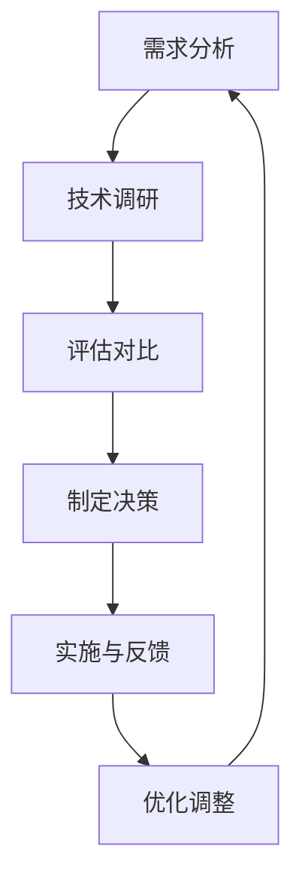
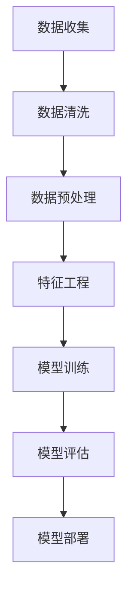

                 


### 文章标题

《技术选型决策框架：在众多选择中做出正确决策》

---

#### 关键词

- 技术选型
- 决策框架
- 成本效益分析
- 风险评估
- 项目案例

---

#### 摘要

本文旨在为IT行业从业人员提供一套系统化的技术选型决策框架。通过对技术选型的概念、评估方法、对比技巧以及具体应用场景的深入剖析，帮助读者在众多技术方案中做出更为科学合理的决策，确保项目的成功实施与持续发展。

---

### 《技术选型决策框架：在众多选择中做出正确决策》目录大纲

#### 第一部分：决策框架基础

##### 第1章：技术选型决策概述

###### 1.1 技术选型的概念与重要性

- 技术选型的定义
- 技术选型的目标与原则

###### 1.2 技术选型的背景与趋势

- 数字化转型的需求
- 技术创新的推动力

###### 1.3 技术选型的影响因素

- 技术成熟度
- 成本效益分析
- 风险评估

##### 第2章：技术评估与对比方法

###### 2.1 技术评估框架

- 成熟度模型（如Gartner Hype Cycle）
- 技术成熟度评估方法

###### 2.2 技术对比方法

- 功能对比
- 性能对比
- 成本对比
- 可维护性对比

###### 2.3 用户案例与经验分享

- 成功案例
- 失败案例
- 教训与启示

#### 第二部分：应用场景与技术选型

##### 第3章：云计算与云服务

###### 3.1 云计算概述

- 云计算的基本概念
- 云计算的服务模型

###### 3.2 云服务技术选型

- IaaS、PaaS、SaaS的对比
- 公有云、私有云、混合云的对比

###### 3.3 云服务项目案例

- 云计算平台搭建
- 云存储解决方案
- 容器化与微服务架构

##### 第4章：大数据与数据存储

###### 4.1 大数据技术基础

- 大数据的基本概念
- 大数据的4V特性

###### 4.2 数据存储技术选型

- 关系型数据库 vs. 非关系型数据库
- 数据仓库 vs. 数据湖

###### 4.3 大数据项目案例

- 数据清洗与预处理
- 数据分析与应用

##### 第5章：人工智能与机器学习

###### 5.1 人工智能概述

- 人工智能的定义与发展历程
- 人工智能的关键技术

###### 5.2 机器学习技术选型

- 监督学习 vs. 无监督学习
- 深度学习 vs. 传统机器学习

###### 5.3 机器学习项目案例

- 人工智能算法应用
- 机器学习模型的评估与优化

##### 第6章：网络安全与数据保护

###### 6.1 网络安全基础

- 网络安全的基本概念
- 网络安全的主要威胁

###### 6.2 数据保护技术选型

- 数据加密与脱敏
- 数据访问控制与审计

###### 6.3 网络安全项目案例

- 网络安全架构设计
- 数据泄露应急响应

##### 第7章：技术选型决策实战

###### 7.1 决策流程与工具

- 技术选型决策流程
- 决策支持工具

###### 7.2 决策案例分析

- 项目背景与需求
- 技术评估与对比
- 最终决策与实施

###### 7.3 决策经验总结

- 成功案例经验
- 失败案例教训
- 决策改进建议

---

**Mermaid 流程图示例：**



**核心算法原理讲解示例：**

```markdown
### 支持向量机（SVM）算法原理

支持向量机（SVM）是一种强大的分类算法，通过最大化分类边界上的支持向量来学习分类模型。

#### 基本原理

假设数据集分为两类，可以通过以下优化问题求解分类边界：

$$
\begin{aligned}
\min\ _{w,b}\frac{1}{2}||w||^2 \\
\text{s.t.} y_i \left\langle \ w,x_i \right\rangle \geq 1
\end{aligned}
$$

其中，$w$为权重向量，$b$为偏置项，$x_i$为样本特征，$y_i$为样本标签。

#### 伪代码

```
Function SVM(X, Y):
    # 求解拉格朗日乘子
    Lagrangian = ...
    # 使用二次规划方法求解w和b
    w, b = QuadraticProgramming(Lagrangian)
    return w, b
```

**数学模型和数学公式讲解示例：**

```markdown
### 概率分布函数

概率分布函数是描述随机变量取值概率的一种数学模型。常见的概率分布函数包括正态分布、二项分布等。

#### 正态分布

正态分布的概率密度函数为：

$$
f(x|\mu,\sigma^2) = \frac{1}{\sqrt{2\pi\sigma^2}} e^{-\frac{(x-\mu)^2}{2\sigma^2}}
$$

其中，$\mu$为均值，$\sigma^2$为方差。

#### 二项分布

二项分布的概率质量函数为：

$$
P(X=k) = C_n^k p^k (1-p)^{n-k}
$$

其中，$n$为试验次数，$k$为成功的次数，$p$为每次试验成功的概率。

---

**Mermaid 流程图示例：**



**项目实战：开发环境搭建**

为了搭建一个简单的机器学习项目，我们需要以下开发环境：

1. 安装Python环境
2. 安装Jupyter Notebook
3. 安装必要的库，如Scikit-learn、Pandas、NumPy等

**源代码详细实现和代码解读**

以下是一个简单的线性回归模型实现的代码：

```python
import numpy as np
from sklearn.linear_model import LinearRegression

# 准备数据
X = np.array([1, 2, 3, 4, 5]).reshape(-1, 1)
y = np.array([2, 4, 5, 4, 5])

# 创建模型并训练
model = LinearRegression()
model.fit(X, y)

# 预测
y_pred = model.predict(X)

# 打印结果
print("Coefficients: ", model.coef_)
print("Intercept: ", model.intercept_)
print("Predictions: ", y_pred)
```

**代码应用解读与分析**

该代码实现了一个简单的线性回归模型，用于预测一个线性关系。首先，我们导入必要的库，然后准备数据集。接着，我们创建一个线性回归模型并使用`fit`方法训练模型。最后，我们使用`predict`方法对数据进行预测，并打印模型系数和预测结果。

**实际案例分析和详细讲解剖析**

假设我们有一个销售数据的机器学习项目，我们需要预测下个月的销售量。通过数据收集、清洗、预处理和特征工程等步骤，我们最终使用线性回归模型训练模型，并使用测试集进行评估。通过对比不同模型的性能，我们可以选择最优的模型进行部署，以实现销售预测的目标。

**项目小结**

在完成销售预测项目后，我们进行项目总结，分析项目的成功经验和不足之处，并提出改进建议。这有助于我们不断优化项目，提高预测准确性。

**最佳实践 tips、小结、注意事项、拓展阅读等内容**

- 在技术选型过程中，要充分考虑项目的需求、成本和风险。
- 定期评估技术的成熟度和发展趋势，确保技术选型的长期有效性。
- 结合实际案例，总结经验教训，为未来的项目提供参考。
- 拓展阅读：可以参考相关技术领域的专业书籍、论文和在线资源，以深入了解技术细节和应用场景。

---

通过上述的框架和示例，我们可以逐步构建出一篇逻辑清晰、内容丰富、结构严谨的技术选型决策框架文章。在撰写文章时，我们应遵循以下原则：

1. **系统化结构**：确保文章按照逻辑顺序展开，每个部分都有明确的主题和目标。
2. **详细解释**：对于核心概念、算法原理、数学模型等，要用通俗易懂的语言进行解释，辅以伪代码和示例，使读者容易理解。
3. **实践导向**：结合实际项目案例，深入分析技术选型的实际应用和效果，提供真实可行的经验和建议。
4. **总结和展望**：在文章结尾部分，对技术选型决策的要点进行总结，并提供未来可能的发展方向和注意事项。

遵循这些原则，我们可以撰写出一篇高质量的技术选型决策框架文章，为IT从业人员提供有价值的指导和建议。

