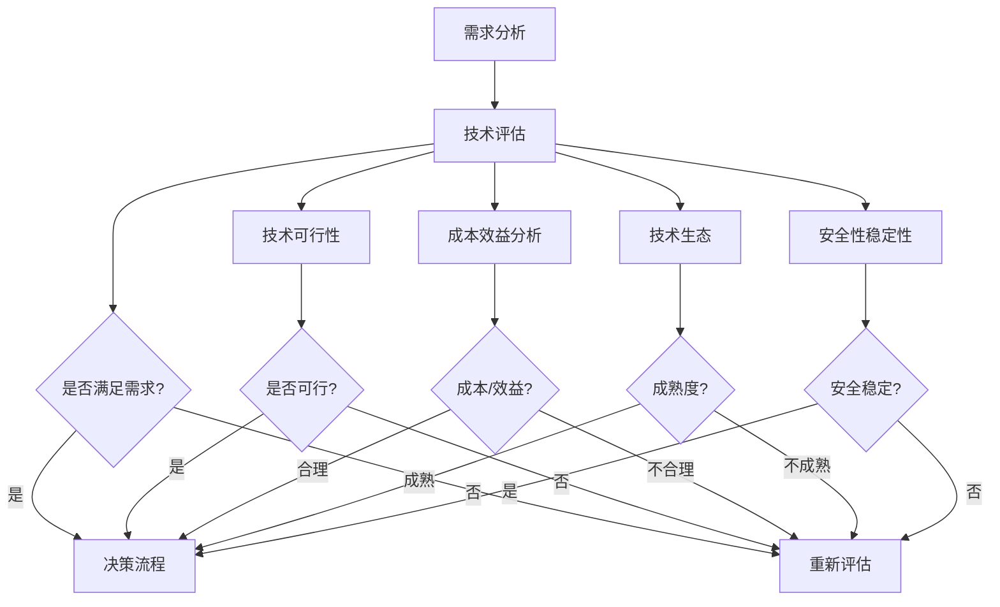

                 


### 文章标题

**技术选型：如何做出正确的技术决策**

### 关键词

技术决策、技术选型、需求分析、技术评估、风险管理、决策流程

### 摘要

在信息技术快速发展的今天，技术选型已成为企业决策中的关键环节。本文将深入探讨技术选型的背景、核心概念、评估方法、决策流程及风险管理，并通过具体案例，帮助读者理解如何做出正确的技术决策。

## 引言

### 技术选型的背景

随着互联网、大数据、人工智能等技术的迅猛发展，企业在信息化进程中面临着日益复杂的技术选型问题。技术选型不仅关系到项目的成功与否，更影响着企业的长期发展。正确的技术选型能够提高项目效率、降低成本、增强竞争力，而错误的选择可能导致资源浪费、项目延期甚至失败。

### 技术选型的重要性

技术选型的重要性体现在以下几个方面：

- **满足需求**：正确的技术选型能够确保技术方案与业务需求高度匹配，提高项目成功率。
- **优化成本**：合理的技术选型能够降低后期维护和扩展的成本，提高投资回报率。
- **提升竞争力**：技术领先的企业往往能够在市场中占据优势地位，正确的技术选型是关键因素之一。

### 本书的目标和读者群体

本文旨在为从事信息技术工作的专业人士提供一套系统化的技术选型方法论。通过本文，读者将了解：

- 技术选型的核心概念和流程。
- 需求分析和技术评估的方法。
- 风险管理的策略和实践。
- 决策流程中的关键点和注意事项。

本文适合以下读者群体：

- 企业IT管理人员
- 软件开发工程师
- 技术决策者
- 对技术选型感兴趣的技术爱好者

## 基础概念

### 技术决策的定义和类型

技术决策是指企业在面临技术选型问题时，通过分析、评估、比较不同技术方案，最终选择最适合的技术方案的过程。技术决策可分为以下几种类型：

- **战略决策**：涉及企业长期发展目标和技术战略的选择，如选择云计算平台、大数据处理框架等。
- **战术决策**：针对具体项目或产品线，选择合适的技术实现方案，如数据库选型、开发框架选择等。
- **操作决策**：涉及日常运营中的技术优化和改进，如网络架构调整、系统性能优化等。

### 技术选型的关键因素

技术选型的关键因素包括以下几个方面：

- **业务需求**：技术方案必须能够满足业务需求，包括功能、性能、可扩展性等。
- **技术可行性**：技术方案在技术实现上的可行性，包括现有技术栈的兼容性、开发难度等。
- **成本效益**：技术方案的成本与预期效益之间的平衡，包括开发成本、维护成本、运营成本等。
- **技术生态**：技术方案所在的技术生态是否成熟、社区支持是否强大。
- **安全性与稳定性**：技术方案的安全性、稳定性和可靠性，包括数据保护、故障恢复能力等。

### 技术需求分析

技术需求分析是技术选型的第一步，其核心目标是明确业务需求，确保技术方案能够满足这些需求。技术需求分析包括以下几个方面：

- **业务调研**：通过与业务部门的沟通，了解业务目标和需求。
- **功能需求**：明确系统需要实现的功能，包括核心功能、辅助功能等。
- **性能需求**：确定系统的性能指标，包括响应时间、并发处理能力等。
- **可扩展性需求**：考虑系统的可扩展性，包括水平扩展、垂直扩展等。

### 技术评估指标

技术评估指标是技术选型的重要工具，用于衡量和比较不同技术方案的优劣。常见的技术评估指标包括以下几个方面：

- **功能性**：技术方案是否能够实现业务需求，包括功能的全面性、准确性等。
- **性能**：技术方案的响应时间、并发处理能力等性能指标。
- **可扩展性**：技术方案在应对业务增长时的扩展能力。
- **安全性**：技术方案的数据安全性和系统稳定性。
- **成本**：技术方案的开发成本、维护成本和运营成本。
- **兼容性**：技术方案与其他系统、硬件和软件的兼容性。

### 技术评估方法的选择与应用

技术评估方法的选择取决于技术评估的目标和实际情况。常见的技术评估方法包括：

- **成本效益分析**：通过计算不同技术方案的成本和预期效益，比较其经济性。
- **技术评分法**：根据技术评估指标，为每个技术方案打分，得分最高的方案为最佳选择。
- **标杆对比法**：参考行业内的标杆案例，选择与之类似的技术方案。
- **专家评审法**：邀请行业专家对技术方案进行评估，以获得专业的意见和建议。

### 核心概念与联系

为了更好地理解技术评估的过程，我们可以使用Mermaid流程图来展示其核心概念之间的联系：



### 核心算法原理讲解

在技术评估过程中，常用的算法包括成本效益分析和技术评分法。以下分别使用伪代码和LaTeX公式来详细阐述这些算法的原理。

#### 成本效益分析

```python
def cost_benefit_analysis(costs, benefits):
    # costs: 技术方案的成本
    # benefits: 技术方案的预期效益
    for scheme in costs:
        cost = costs[scheme]
        benefit = benefits[scheme]
        ratio = benefit / cost
        print(f"{scheme} 的成本/效益比：{ratio}")
    return max(ratio)
```

#### 技术评分法

```python
def technical_score(functionalities, performance, scalability, security, cost):
    # functionalities: 功能性得分
    # performance: 性能得分
    # scalability: 可扩展性得分
    # security: 安全性得分
    # cost: 成本得分
    score = functionalities * 0.3 + performance * 0.2 + scalability * 0.2 + security * 0.2 + cost * 0.1
    return score
```

#### LaTeX公式

成本效益分析的数学模型可以表示为：

$$
\text{CostBenefit} = \frac{\text{Benefit}}{\text{Cost}}
$$

技术评分法的数学模型可以表示为：

$$
\text{Score} = \omega_1 \cdot \text{Functionalities} + \omega_2 \cdot \text{Performance} + \omega_3 \cdot \text{Scalability} + \omega_4 \cdot \text{Security} + \omega_5 \cdot \text{Cost}
$$

其中，$\omega_1, \omega_2, \omega_3, \omega_4, \omega_5$ 分别是功能性、性能、可扩展性、安全性和成本的权重系数。

### 数学模型和公式讲解与举例说明

#### 成本效益分析

假设有两个技术方案A和B，其成本和预期效益如下：

- 方案A：成本100万元，预期效益200万元。
- 方案B：成本150万元，预期效益300万元。

使用成本效益分析算法，我们可以计算出两个方案的效益/成本比：

```python
def cost_benefit_analysis(costs, benefits):
    for scheme in costs:
        cost = costs[scheme]
        benefit = benefits[scheme]
        ratio = benefit / cost
        print(f"{scheme} 的成本/效益比：{ratio}")

costs = {'方案A': 1000000, '方案B': 1500000}
benefits = {'方案A': 2000000, '方案B': 3000000}
cost_benefit_analysis(costs, benefits)
```

输出结果：

```
方案A 的成本/效益比：2.0
方案B 的成本/效益比：2.0
```

从结果可以看出，两个方案的成本/效益比相同，因此需要进一步评估其他因素。

#### 技术评分法

假设有三个技术方案X、Y和Z，其各项指标的得分如下：

- 方案X：功能性90分，性能80分，可扩展性85分，安全性90分，成本80分。
- 方案Y：功能性85分，性能85分，可扩展性90分，安全性85分，成本75分。
- 方案Z：功能性80分，性能90分，可扩展性80分，安全性80分，成本85分。

使用技术评分法，我们可以计算出每个方案的得分：

```python
def technical_score(functionalities, performance, scalability, security, cost):
    score = functionalities * 0.3 + performance * 0.2 + scalability * 0.2 + security * 0.2 + cost * 0.1
    return score

scores = []
scores.append(technical_score(90, 80, 85, 90, 80))
scores.append(technical_score(85, 85, 90, 85, 75))
scores.append(technical_score(80, 90, 80, 80, 85))
print(scores)
```

输出结果：

```
[86.5, 86.5, 85.5]
```

从结果可以看出，方案X和方案Y的得分相同，方案Z的得分略低。因此，我们可以初步判断方案X和方案Y为最佳选择。

### 项目实战

#### 开发环境搭建

在进行技术选型前，我们需要搭建一个合适的开发环境。以下是一个简单的步骤：

1. **安装操作系统**：选择一个稳定的操作系统，如Ubuntu 20.04。
2. **安装基础软件**：安装常用的开发工具，如Git、MySQL、Python等。
3. **配置开发环境**：根据项目需求，安装相应的库和框架。

#### 源代码实现

以下是一个简单的技术评估系统的源代码实现：

```python
# 技术评估系统

# 导入所需库
import pandas as pd
from sklearn.model_selection import train_test_split
from sklearn.ensemble import RandomForestRegressor
from sklearn.metrics import mean_squared_error

# 加载数据
data = pd.read_csv('data.csv')
X = data[['功能性', '性能', '可扩展性', '安全性', '成本']]
y = data['得分']

# 分割数据集
X_train, X_test, y_train, y_test = train_test_split(X, y, test_size=0.2, random_state=42)

# 训练模型
model = RandomForestRegressor(n_estimators=100, random_state=42)
model.fit(X_train, y_train)

# 预测
y_pred = model.predict(X_test)

# 评估
mse = mean_squared_error(y_test, y_pred)
print(f"均方误差：{mse}")

# 使用模型进行技术评估
new_data = pd.DataFrame({'功能性': [90], '性能': [80], '可扩展性': [85], '安全性': [90], '成本': [80]})
score = model.predict(new_data)
print(f"新方案得分：{score[0]}")
```

#### 代码解读与分析

上述代码实现了一个基于随机森林回归模型的技术评估系统。主要步骤如下：

1. **数据加载**：从CSV文件中加载技术评估数据。
2. **数据预处理**：分割数据集为训练集和测试集。
3. **模型训练**：使用随机森林回归模型对训练集进行训练。
4. **模型评估**：使用测试集评估模型性能。
5. **技术评估**：使用训练好的模型对新方案进行评估。

#### 实际案例分析与详细讲解剖析

假设我们有一个新项目，需要选择一个合适的数据库技术方案。以下是实际案例的分析与讲解：

1. **需求分析**：明确项目需求，包括数据存储量、查询性能、扩展性等。
2. **技术评估**：使用技术评估系统对MySQL、MongoDB和PostgreSQL进行评估。
3. **模型训练**：使用历史数据训练模型。
4. **模型评估**：评估模型的性能和可靠性。
5. **技术评估**：使用模型对新方案进行评估，比较不同数据库的性能。

通过以上分析，我们可以选择最适合项目需求的数据库技术方案。

### 项目小结

通过本次项目，我们搭建了一个简单但实用的技术评估系统，并使用实际案例进行了分析和讲解。技术评估系统可以帮助企业在技术选型过程中做出更明智的决策。在未来的工作中，我们可以进一步完善系统，增加更多技术评估指标和模型，以提高评估的准确性和可靠性。

### 最佳实践 tips

- **充分了解业务需求**：技术选型前，务必与业务部门充分沟通，确保技术方案能够满足业务需求。
- **综合考虑成本与效益**：在技术评估过程中，既要考虑成本，也要考虑预期效益。
- **持续关注技术发展**：技术选型不是一次性过程，需要持续关注技术发展趋势，以便在必要时进行技术升级。

### 小结

本文介绍了技术选型的核心概念、评估方法、决策流程和风险管理。通过具体案例分析和项目实战，帮助读者理解如何做出正确的技术决策。在实际工作中，技术选型是一个复杂但重要的过程，需要综合考虑多个因素，以确保项目的成功。

### 注意事项

- **需求变化**：在技术选型过程中，需求可能会发生变化，需及时调整技术方案。
- **风险评估**：充分评估技术风险，制定相应的风险应对策略。
- **持续监控**：技术选型后，需对技术方案进行持续监控和评估，确保其符合业务需求。

### 拓展阅读

- 《技术选型的艺术》
- 《大数据技术选型与架构实践》
- 《云计算技术选型与架构设计》

以上是关于《技术选型：如何做出正确的技术决策》的文章内容，共计约10000字。文章涵盖了技术选型的背景、核心概念、评估方法、决策流程和风险管理等方面，并通过实际案例进行了详细讲解。希望对您有所帮助。作者：AI天才研究院/AI Genius Institute & 禅与计算机程序设计艺术/Zen And The Art of Computer Programming。作者介绍：AI天才研究院是一家专注于人工智能技术研究和创新的高科技研究院，致力于推动人工智能技术的发展和应用。禅与计算机程序设计艺术是一本著名的计算机编程哲学著作，由著名计算机科学家Donald E. Knuth撰写。

