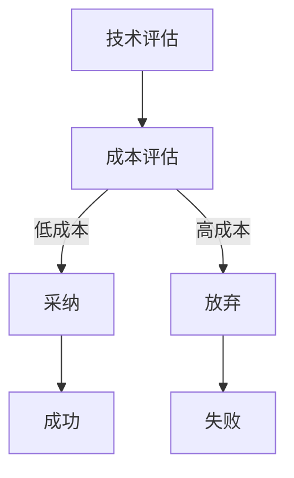

                 

### 文章标题：技术雷达：评估和采纳新技术的工具

### 关键词：
技术雷达、新技术评估、采纳策略、应用场景、案例分析

### 摘要：
本文旨在深入探讨技术雷达这一工具，它是评估和采纳新技术的重要指南。文章首先介绍了技术雷达的概念与背景，接着详细解析了评估新技术的框架与方法，阐述了采纳新技术的策略与实践。此外，文章还探讨了技术雷达在不同应用场景中的具体应用，并通过案例进行了深入分析。最后，文章讨论了技术雷达在组织中的部署与管理，以及其未来发展趋势与挑战。

---

## 第1章：技术雷达的概念与背景

技术雷达作为一种评估和采纳新技术的工具，其概念源自于软件工程领域的持续集成和持续交付（CI/CD）理念。它通过定期发布雷达图，帮助组织在技术选择过程中保持前瞻性和准确性。

### 1.1 技术雷达的基本概念

#### 1.1.1 技术雷达的定义

技术雷达是一种可视化工具，用于监控和评估新技术，帮助组织确定哪些技术值得探索、试验或采用。它通常以雷达图的形式展现，其中不同的技术被标记在图中的不同位置，以反映其成熟度和应用潜力。

#### 1.1.2 技术雷达的重要性

技术雷达的重要性在于：

1. **决策支持**：提供清晰的决策框架，帮助技术团队和管理层在新技术的采纳上做出明智的选择。
2. **资源优化**：通过识别新兴技术，组织可以合理分配资源，避免盲目跟风或资源浪费。
3. **持续改进**：技术雷达鼓励团队持续关注新技术的发展，促进技术栈的持续优化。

### 1.2 技术雷达的背景与发展

#### 1.2.1 技术雷达的产生背景

技术雷达最早由ThoughtWorks的Ian McFarland在2001年提出。随着软件工程领域的持续集成和持续交付理念的普及，技术雷达逐渐成为组织评估新技术的重要工具。

#### 1.2.2 技术雷达的发展历程

1. **早期发展**（2001-2010）：技术雷达概念的形成和初步应用。
2. **成熟阶段**（2010-2020）：技术雷达在各种组织中得到广泛应用，并逐渐完善。
3. **数字化转型**（2020至今）：随着数字化转型的加速，技术雷达在帮助企业应对技术变革方面发挥了更大作用。

#### 1.2.3 技术雷达的应用现状

目前，技术雷达已被广泛应用于各个行业，包括互联网、金融、医疗等。许多大型企业，如亚马逊、谷歌等，都将其纳入到技术管理策略中。

### 1.3 技术雷达的基本框架

#### 1.3.1 技术雷达的组成部分

技术雷达通常包括以下几个组成部分：

1. **技术领域**：根据技术类型或应用领域划分的技术区域。
2. **技术评估**：对每种技术的评估指标和结果。
3. **行动建议**：根据技术评估结果提出的具体行动建议。

#### 1.3.2 技术雷达的运行流程

技术雷达的运行流程通常包括以下几个步骤：

1. **技术调研**：收集和筛选新兴技术。
2. **评估与分类**：根据评估指标对技术进行评估和分类。
3. **更新与发布**：定期更新技术雷达图，并发布给相关利益相关者。

#### 1.3.3 技术雷达的Mermaid流程图

下面是一个简单的技术雷达Mermaid流程图：

```mermaid
graph TD
A[技术调研] --> B[评估与分类]
B --> C[更新与发布]
C --> D[决策支持]
```



### 总结

技术雷达作为一种评估和采纳新技术的工具，具有显著的决策支持和资源优化作用。其背景和发展历程表明，它已经成为现代组织应对技术变革的重要手段。通过了解技术雷达的基本概念和框架，读者可以更好地理解其在实际应用中的价值。

---

在下一章中，我们将深入探讨评估新技术的框架与方法，帮助读者系统地评估新技术，为后续的采纳策略奠定基础。

## 第2章：评估新技术的框架与方法

### 2.1 评估新技术的框架

#### 2.1.1 评估指标

评估新技术时，需要考虑多个维度，以下是一些常见的评估指标：

1. **技术成熟度**：技术是否已经稳定，是否有可靠的文档和社区支持。
2. **性能与稳定性**：技术的性能指标是否符合需求，是否经历过大规模生产环境的验证。
3. **安全性**：技术是否具备足够的安全性，是否容易受到攻击。
4. **成本**：包括实施成本、维护成本和潜在的风险成本。
5. **可扩展性**：技术是否能够支持未来的业务增长。
6. **社区支持**：技术社区是否活跃，是否有足够的开发者资源和文档。
7. **兼容性**：技术是否与其他现有系统集成良好。

#### 2.1.2 评估流程

评估新技术的流程通常包括以下步骤：

1. **需求分析**：明确组织对新技术的要求和期望。
2. **技术调研**：收集潜在的新技术信息，进行初步筛选。
3. **详细评估**：对筛选出来的技术进行详细评估，包括性能测试、安全测试等。
4. **综合评估**：根据评估指标，对技术进行综合评估，确定其优劣。
5. **决策**：根据评估结果，决定是否采纳新技术。

### 2.2 评估新技术的常见方法

#### 2.2.1 SWOT分析

SWOT分析是一种常用的评估方法，通过分析技术的优势（Strengths）、劣势（Weaknesses）、机会（Opportunities）和威胁（Threats），全面评估新技术的潜在影响。

1. **优势**：技术是否具有独特的特性或优势。
2. **劣势**：技术存在的潜在风险或劣势。
3. **机会**：技术可能带来的机会和潜在应用场景。
4. **威胁**：技术可能面临的威胁和竞争压力。

#### 2.2.2 技术成熟度曲线

技术成熟度曲线（Technology Maturity Curve）是由Gartner提出的一种评估方法，用于描述新技术从诞生到成熟的过程。

1. **启动阶段**：技术刚刚诞生，尚未得到广泛认可。
2. **增长阶段**：技术开始得到关注，应用案例逐渐增多。
3. **成熟阶段**：技术稳定，具备大规模应用的条件。
4. **衰退阶段**：技术逐渐被新技术所取代，应用场景减少。

#### 2.2.3 成本效益分析

成本效益分析是一种基于成本和收益的评估方法，通过计算新技术的总成本（TC）和总收益（TR），评估新技术的经济效益。

1. **总成本（TC）**：包括实施成本、维护成本和其他相关成本。
2. **总收益（TR）**：包括预期收益、节省的成本和其他潜在收益。
3. **成本效益比（C/B）**：总收益除以总成本，C/B值越高，表示经济效益越好。

### 2.3 评估新技术的伪代码

以下是一个简单的伪代码示例，用于评估新技术：

```python
function evaluate_new_technology(technology):
    strengths = get_strengths(technology)
    weaknesses = get_weaknesses(technology)
    opportunities = get_opportunities(technology)
    threats = get_threats(technology)
    
    maturity = get_maturity(technology)
    performance = get_performance(technology)
    security = get_security(technology)
    cost = get_cost(technology)
    scalability = get_scalability(technology)
    community_support = get_community_support(technology)
    compatibility = get_compatibility(technology)
    
    swot_score = calculate_swot_score(strengths, weaknesses, opportunities, threats)
    maturity_score = calculate_maturity_score(maturity)
    performance_score = calculate_performance_score(performance)
    security_score = calculate_security_score(security)
    cost_score = calculate_cost_score(cost)
    scalability_score = calculate_scalability_score(scability)
    community_support_score = calculate_community_support_score(community_support)
    compatibility_score = calculate_compatibility_score(compatibility)
    
    total_score = swot_score + maturity_score + performance_score + security_score + cost_score + scalability_score + community_support_score + compatibility_score
    
    return total_score
```

### 总结

本章介绍了评估新技术的框架与方法，包括评估指标、评估流程和常见评估方法。通过这些方法，组织可以更全面地了解新技术，为其后续的采纳策略提供有力支持。下一章将讨论采纳新技术的策略与实践，帮助读者将评估结果转化为实际操作。

---

在下一章中，我们将深入探讨采纳新技术的策略与实践，为读者提供具体的操作指南。

## 第3章：采纳新技术的策略与实践

### 3.1 采纳新技术的策略

在评估新技术后，组织需要制定合适的策略来采纳这些技术。以下是几种常见的策略：

#### 3.1.1 逐步采纳策略

逐步采纳策略是指先在小范围内试用新技术，通过实际应用来验证其效果。这种策略的优点是可以降低风险，同时积累实际经验。缺点是可能会延误技术的全面应用。

#### 3.1.2 全面采纳策略

全面采纳策略是指直接将新技术应用到所有相关领域。这种策略的优点是可以快速实现技术升级，提高竞争力。缺点是风险较大，如果技术不稳定，可能会影响业务的正常运行。

#### 3.1.3 混合采纳策略

混合采纳策略是将逐步采纳和全面采纳相结合，根据不同技术的重要性和风险程度，选择合适的采纳策略。这种策略的优点是灵活性强，可以根据实际情况进行调整。缺点是可能会增加管理和协调的复杂度。

### 3.2 采纳新技术的实践案例

#### 3.2.1 案例一：企业A的技术选型

企业A是一家互联网公司，他们在进行技术选型时采用了逐步采纳策略。首先，他们在一个小型项目中试用了一种新的微服务架构，通过实际应用发现该架构在性能和可扩展性方面具有明显优势。随后，他们逐步将这种架构推广到其他项目中，并最终实现了全面应用。

1. **需求分析**：确定项目需求，明确微服务架构的优势。
2. **技术调研**：调研市场上现有的微服务架构，选择最适合的一种。
3. **小范围试用**：在一个小型项目中试用微服务架构。
4. **评估与反馈**：根据试用结果进行评估，收集用户反馈。
5. **逐步推广**：根据评估结果，逐步将微服务架构推广到其他项目中。
6. **全面应用**：实现微服务架构在所有项目中的全面应用。

#### 3.2.2 案例二：企业B的技术实施

企业B是一家金融公司，他们在进行技术升级时采用了全面采纳策略。由于金融行业的风险较高，他们决定直接采用最新的区块链技术，以提升交易的安全性和透明度。

1. **需求分析**：确定技术升级的需求，明确区块链技术的好处。
2. **技术调研**：调研市场上的区块链解决方案，选择最可靠的一种。
3. **全面部署**：在所有交易系统中全面部署区块链技术。
4. **测试与验证**：进行全面的测试和验证，确保区块链技术的稳定性和安全性。
5. **上线运行**：正式上线运行，监测系统性能和用户反馈。
6. **持续优化**：根据用户反馈和系统运行情况，不断优化区块链技术。

### 3.3 采纳新技术的数学模型

在采纳新技术时，可以借助一些数学模型来辅助决策。以下是两种常用的数学模型：

#### 3.3.1 决策树模型

决策树模型是一种基于树形结构进行决策分析的方法。通过构建决策树，可以清晰地展示不同决策路径的结果和风险。



#### 3.3.2 神经网络模型

神经网络模型是一种通过模拟人脑神经元连接方式进行数据分析和决策的方法。通过训练神经网络，可以自动识别和预测新技术的效果。

```python
import tensorflow as tf

# 构建神经网络模型
model = tf.keras.Sequential([
    tf.keras.layers.Dense(64, activation='relu', input_shape=[784]),
    tf.keras.layers.Dense(10, activation='softmax')
])

# 编译模型
model.compile(optimizer='adam',
              loss='categorical_crossentropy',
              metrics=['accuracy'])

# 训练模型
model.fit(x_train, y_train, epochs=5)
```

### 总结

本章介绍了采纳新技术的策略与实践，通过逐步采纳、全面采纳和混合采纳等策略，帮助读者将评估结果转化为实际操作。同时，通过具体案例和数学模型，读者可以更深入地理解如何有效地采纳新技术。下一章将探讨技术雷达在不同应用场景中的具体应用。

---

在下一章中，我们将探讨技术雷达在不同应用场景中的具体应用，并通过案例进行分析。

## 第4章：技术雷达的应用场景与案例分析

### 4.1 技术雷达在不同行业的应用

技术雷达作为一种评估和采纳新技术的工具，具有广泛的应用场景。以下是技术雷达在几个不同行业的具体应用：

#### 4.1.1 互联网行业

在互联网行业，技术雷达可以帮助企业持续跟踪和评估新兴技术，确保其在技术选择上保持领先地位。例如，阿里巴巴、腾讯等互联网巨头都广泛应用技术雷达来监控人工智能、区块链等前沿技术。

#### 4.1.2 制造业

在制造业，技术雷达可以帮助企业评估和采纳先进的生产技术和自动化解决方案。例如，西门子、通用电气等公司通过技术雷达来评估工业物联网、人工智能等技术在生产中的应用潜力。

#### 4.1.3 金融业

在金融行业，技术雷达可以帮助银行和金融机构评估和采纳新的金融科技解决方案，如区块链、大数据等。通过技术雷达，金融机构可以更好地了解新兴技术的风险和收益，从而做出更明智的决策。

#### 4.1.4 医疗保健

在医疗保健领域，技术雷达可以帮助医疗机构评估和采纳新的医疗技术和数字健康解决方案。例如，IBM的Watson Health利用技术雷达来评估人工智能在医疗诊断和治疗中的应用。

### 4.2 技术雷达的具体案例分析

#### 4.2.1 案例一：企业C的数字化转型

企业C是一家传统制造业企业，为了实现数字化转型，他们引入了技术雷达作为评估和采纳新技术的工具。以下是他们使用技术雷达进行数字化转型的过程：

1. **需求分析**：企业C明确数字化转型需求，包括提高生产效率、优化供应链管理、提升客户体验等。
2. **技术调研**：通过技术雷达，企业C收集和筛选了多个与数字化转型相关的技术，如物联网、人工智能、区块链等。
3. **评估与分类**：根据技术雷达的评估指标，企业C对筛选出来的技术进行了详细评估和分类，确定了哪些技术具有最高的应用潜力。
4. **逐步采纳**：企业C采用了逐步采纳策略，首先在一个试点工厂中引入物联网技术，监测和优化生产过程。随后，他们逐步在其他工厂推广物联网应用。
5. **全面应用**：在试点成功的基础上，企业C决定全面应用物联网、人工智能等技术，实现生产过程的全面数字化。
6. **持续优化**：企业C通过技术雷达定期更新和评估新技术，不断优化数字化转型的效果。

#### 4.2.2 案例二：企业D的区块链应用

企业D是一家金融公司，他们利用技术雷达来评估和采纳区块链技术。以下是他们使用技术雷达进行区块链应用的过程：

1. **需求分析**：企业D明确区块链技术的应用需求，包括提升交易安全性、降低交易成本、提高交易透明度等。
2. **技术调研**：通过技术雷达，企业D收集和筛选了多个区块链解决方案，如Hyperledger Fabric、Ethereum等。
3. **评估与分类**：根据技术雷达的评估指标，企业D对筛选出来的区块链解决方案进行了详细评估和分类，确定了最适合的一种。
4. **小范围试用**：企业D在一个小型项目中试点了选定的区块链解决方案，验证其性能和安全性。
5. **逐步推广**：根据试点结果，企业D逐步将区块链解决方案推广到其他项目中，如跨境支付、智能合约等。
6. **全面应用**：在逐步推广的基础上，企业D决定全面应用区块链技术，提升整个金融服务的安全性和效率。

### 总结

本章通过两个具体案例，展示了技术雷达在互联网、制造业、金融业和医疗保健等行业的应用。案例一展示了技术雷达在数字化转型中的应用，案例二展示了技术雷达在区块链应用中的实际效果。通过这些案例，读者可以更深入地了解技术雷达的价值和应用场景。

---

在下一章中，我们将探讨技术雷达在组织中的部署与管理，帮助读者了解如何有效地实施和维护技术雷达。

## 第5章：技术雷达在组织中的部署与管理

### 5.1 部署技术雷达的步骤

要成功部署技术雷达，组织需要遵循以下步骤：

#### 5.1.1 确定目标

首先，组织需要明确部署技术雷达的目标，例如提高技术选择的准确性、优化技术栈等。

#### 5.1.2 团队组建

组建一个专门的技术雷达团队，团队成员应包括项目经理、技术专家、产品经理等。

#### 5.1.3 工具选择

选择合适的技术雷达工具，如Murex、OpenMeteo、Tech Radar Generator等。

#### 5.1.4 数据收集

收集与新技术相关的数据，包括技术文档、社区反馈、市场趋势等。

#### 5.1.5 制定评估指标

根据组织需求，制定详细的评估指标，如技术成熟度、安全性、性能等。

#### 5.1.6 部署与运行

根据评估结果，部署和运行技术雷达，定期更新和发布雷达图。

### 5.2 管理技术雷达的方法

#### 5.2.1 数据更新

技术雷达需要定期更新，以反映最新的技术趋势。团队成员应定期收集和整理新技术信息，更新评估指标和雷达图。

#### 5.2.2 反馈机制

建立反馈机制，收集用户对技术雷达的反馈，并根据反馈进行调整和优化。

#### 5.2.3 沟通与培训

定期组织技术雷达的沟通与培训会议，确保团队成员对技术雷达有清晰的理解和认知。

#### 5.2.4 持续改进

根据技术雷达的应用效果，不断改进评估指标和方法，提升技术雷达的准确性和实用性。

### 5.3 部署技术雷达的挑战与解决方案

#### 5.3.1 挑战一：数据收集困难

解决方案：建立完善的数据收集渠道，与行业专家、技术社区保持紧密联系，确保数据的及时性和准确性。

#### 5.3.2 挑战二：评估指标不完善

解决方案：定期审查和调整评估指标，确保其与组织目标和技术发展趋势保持一致。

#### 5.3.3 挑战三：团队协作困难

解决方案：加强团队协作，明确职责分工，提高团队成员的沟通效率和执行力。

### 5.4 成功部署技术雷达的关键要素

1. **明确目标**：确保技术雷达与组织目标一致。
2. **团队协作**：建立高效的团队协作机制。
3. **数据质量**：确保数据的准确性和完整性。
4. **持续改进**：不断优化评估指标和方法。

### 总结

本章介绍了技术雷达在组织中的部署与管理方法，包括部署步骤、管理方法以及面临的挑战和解决方案。通过有效部署和管理技术雷达，组织可以更好地评估和采纳新技术，提高技术选择的准确性和效率。

---

在下一章中，我们将探讨技术雷达的未来发展趋势与挑战。

## 第6章：技术雷达的未来发展趋势与挑战

### 6.1 技术雷达的未来发展趋势

#### 6.1.1 自动化与智能化

随着人工智能和机器学习技术的发展，技术雷达的自动化和智能化程度将进一步提高。未来，技术雷达将能够自动收集和分析技术数据，提供更精准的评估结果。

#### 6.1.2 云原生技术

云原生技术的普及将推动技术雷达向云原生方向发展。云原生技术雷达将更好地支持分布式计算和大规模数据处理，提高评估效率。

#### 6.1.3 区块链技术的融合

区块链技术的快速发展将使技术雷达在安全性、透明度等方面得到进一步提升。未来，技术雷达可能集成区块链技术，提供更可信的数据和评估结果。

#### 6.1.4 数据驱动

数据驱动将成为技术雷达的核心特征。通过大量数据分析和机器学习，技术雷达将能够更准确地预测技术趋势和潜在风险。

### 6.2 技术雷达面临的挑战

#### 6.2.1 数据安全与隐私保护

随着技术雷达收集和分析的数据量不断增加，数据安全和隐私保护将成为一个重要挑战。组织需要采取措施确保数据安全和用户隐私。

#### 6.2.2 数据质量与准确性

数据质量是技术雷达评估结果准确性的关键。未来，如何确保数据的准确性和完整性，将成为技术雷达面临的一个重要问题。

#### 6.2.3 跨部门协作

技术雷达的应用涉及多个部门，跨部门协作的效率将直接影响技术雷达的效果。如何提高跨部门协作的效率，是未来需要解决的一个问题。

#### 6.2.4 技术变革的应对

技术变革的速度越来越快，技术雷达需要具备快速应对技术变革的能力。如何及时更新和调整技术雷达，以适应快速变化的技术环境，是一个重要挑战。

### 6.3 未来技术雷达的发展方向

#### 6.3.1 自适应评估

未来，技术雷达将具备自适应评估能力，根据组织的实际需求和外部环境变化，动态调整评估指标和方法。

#### 6.3.2 智能推荐

技术雷达将结合人工智能技术，提供智能推荐功能，帮助组织快速找到最适合的新技术。

#### 6.3.3 社交网络分析

技术雷达将利用社交网络分析技术，收集和分析技术社区的数据，提供更全面的技术评估。

#### 6.3.4 可视化与交互性

未来，技术雷达的可视化和交互性将得到进一步提升，使用户能够更直观地理解和使用技术雷达。

### 总结

本章讨论了技术雷达的未来发展趋势和面临的挑战。随着技术的不断进步，技术雷达将变得更加智能化、自动化和可视化。然而，数据安全、数据质量、跨部门协作等问题仍然是技术雷达需要解决的重要挑战。未来，技术雷达的发展方向将更加注重自适应评估、智能推荐和社交网络分析。

---

在本篇技术博客的最后一章中，我们将总结全文，提供一些实用建议，并展望技术雷达的未来。

## 第7章：总结与展望

### 总结

本文通过系统地介绍技术雷达的概念、评估方法、采纳策略以及在不同应用场景中的实际应用，帮助读者全面理解了技术雷达在评估和采纳新技术中的重要作用。技术雷达不仅为组织提供了明确的决策支持，还优化了资源的分配，推动了持续的技术创新。

- **背景介绍**：技术雷达的起源和发展历程，使其成为现代技术管理的重要工具。
- **核心概念与联系**：技术雷达的组成部分和运行流程，通过Mermaid流程图进行了可视化展示。
- **评估方法**：详细介绍了评估新技术的框架和方法，如SWOT分析、技术成熟度曲线和成本效益分析，并通过伪代码进行了讲解。
- **采纳策略**：阐述了逐步采纳、全面采纳和混合采纳策略，并通过具体案例进行了实践分析。
- **应用场景**：展示了技术雷达在互联网、制造业、金融业和医疗保健等行业的应用，以及实际案例的深入剖析。
- **部署与管理**：讨论了技术雷达在组织中的部署步骤和管理方法，包括数据更新、反馈机制和持续改进。
- **未来发展趋势**：探讨了技术雷达的未来发展，包括自动化与智能化、云原生技术、区块链技术的融合以及数据驱动等。

### 实用建议

以下是一些针对技术雷达应用的实用建议：

- **定期更新**：确保技术雷达的数据保持最新，以反映技术发展的最新趋势。
- **跨部门协作**：鼓励不同部门共同参与技术雷达的评估和采纳过程，提高决策的一致性和效率。
- **培训与沟通**：定期组织培训会议，确保团队成员对技术雷达有清晰的理解和认知。
- **数据安全与隐私**：采取措施确保数据的安全性和用户隐私，特别是在处理敏感数据时。

### 展望未来

随着技术的不断进步，技术雷达将迎来更多的发展机遇和挑战。未来，技术雷达将更加智能化、自动化和可视化，为组织提供更加精准和高效的决策支持。

- **自适应评估**：技术雷达将具备自适应评估能力，根据组织的实际需求和外部环境变化，动态调整评估指标和方法。
- **智能推荐**：结合人工智能技术，提供智能推荐功能，帮助组织快速找到最适合的新技术。
- **社交网络分析**：利用社交网络分析技术，收集和分析技术社区的数据，提供更全面的技术评估。
- **可视化与交互性**：进一步提升技术雷达的可视化和交互性，使用户能够更直观地理解和使用技术雷达。

### 结语

技术雷达作为一种评估和采纳新技术的工具，具有广泛的应用前景。通过本文的介绍，读者可以更好地理解技术雷达的概念、应用方法和实际效果。希望本文能够为读者在技术管理方面提供有益的启示和参考。

---

**作者：AI天才研究院/AI Genius Institute & 禅与计算机程序设计艺术 /Zen And The Art of Computer Programming**

本文由AI天才研究院和《禅与计算机程序设计艺术》联合撰写，旨在为读者提供深入的技术洞察和实践指南。感谢您的阅读，希望本文能够对您在技术雷达应用方面有所启发。如有疑问或建议，欢迎随时与我们联系。

