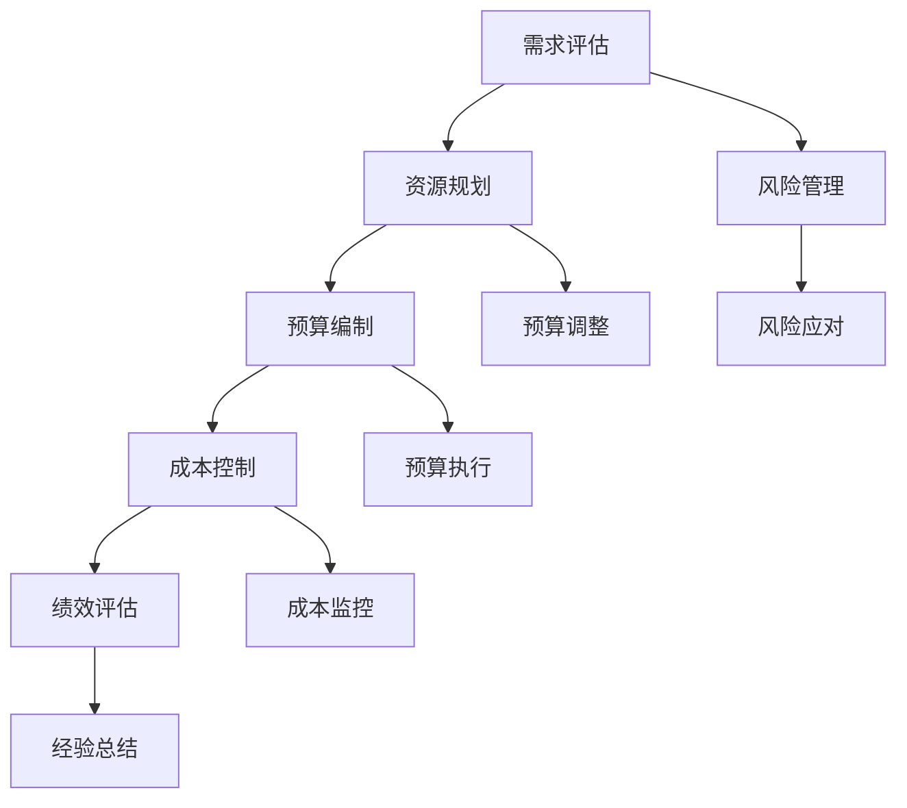

                 

**第1章: 技术预算管理概述**

### 1.1 技术预算管理的定义

技术预算管理是一种综合性的管理活动，旨在通过科学的方法和工具，对企业或组织在技术领域内的资金、资源、人力等进行合理配置和有效控制，以实现最佳的经济效益和业务目标。具体来说，技术预算管理包括以下几个方面的内容：

1. **需求评估**：对技术项目或活动的需求进行详细分析，包括项目的必要性、可行性、预期效果等。

- **必要性**：确定项目或活动是否符合企业战略目标，是否能够解决现有问题或满足未来发展需求。
- **可行性**：评估项目或活动在技术、资源、时间等方面的可行性，包括技术方案的可行性、资源的充足性、时间的合理性等。
- **预期效果**：预测项目或活动实施后可能带来的经济效益、社会效益和风险影响。

2. **资源规划**：根据需求评估结果，对项目所需的各种资源进行合理规划和分配。

- **人力资源**：确定项目所需的专业技能、人员数量和工作负荷，确保项目团队能够高效运作。
- **资金资源**：预算项目所需的资金总额、资金来源、资金使用计划，确保资金合理分配和使用。
- **技术资源**：确定项目所需的技术支持、硬件设施、软件工具等，确保技术资源的充足性和适用性。
- **时间资源**：制定项目进度计划，合理分配工作时间，确保项目按时完成。

3. **预算编制**：根据资源规划结果，编制详细的预算方案，包括预算总额、预算分配、预算调整等。

- **预算总额**：确定项目或活动的总体预算，包括直接成本和间接成本。
- **预算分配**：将预算按项目需求进行合理分配，确保每个项目或活动都有足够的资金支持。
- **预算调整**：根据实际情况和需求变化，对预算进行及时调整，确保预算的灵活性和适应性。

4. **成本控制**：在项目实施过程中，对成本进行有效监控和管理，确保成本在预算范围内合理控制。

- **成本监控**：建立成本监控机制，实时跟踪项目成本变化，发现异常及时采取措施。
- **成本分析**：定期对项目成本进行分析，找出成本超支的原因，制定成本控制措施。
- **成本调整**：根据成本分析结果，对预算进行适当调整，确保项目成本控制在合理范围内。

5. **绩效评估**：在项目结束后，对技术预算管理过程进行综合评估，总结经验教训，持续改进预算管理方法。

- **预算执行情况评估**：评估预算执行情况，包括预算完成率、成本控制效果等。
- **经济效益评估**：评估项目实施后的经济效益，包括投资回报率、成本节约等。
- **管理效果评估**：评估预算管理过程的效果，包括资源配置效率、成本控制能力等。

通过以上五个方面的内容，技术预算管理能够帮助企业或组织在技术领域实现资源的合理配置和成本的有效控制，从而提高经济效益和业务竞争力。

### 1.2 技术预算管理的发展历程

技术预算管理作为一个重要的管理领域，其发展历程可以追溯到20世纪中叶。随着企业规模的扩大和技术的进步，技术预算管理逐渐从财务预算管理中分离出来，形成了一套独立的管理体系。

#### 1.2.1 起源与发展

20世纪50年代，随着计算机技术的兴起和企业管理需求的增加，技术预算管理开始受到企业的关注。这一时期，企业主要关注技术项目的成本控制，通过制定详细的预算方案，确保项目在预算范围内完成。这一阶段的技术预算管理主要侧重于成本控制和资金使用效率。

#### 1.2.2 成长与成熟

20世纪70年代，随着项目管理理论的逐渐成熟，技术预算管理也进入了成长阶段。这一时期，企业开始重视项目的需求评估和资源规划，通过科学的方法和工具，对技术项目进行全面的预算管理。同时，成本控制也成为技术预算管理的重要内容，企业开始运用各种成本控制方法，如成本估算、成本监控等，以降低项目成本。

#### 1.2.3 现代化与智能化

20世纪90年代以来，随着信息技术的迅猛发展，技术预算管理进入了现代化阶段。企业开始运用计算机技术、网络技术和大数据技术，对技术预算管理进行智能化改造。通过建立预算管理系统，企业能够实时监控项目成本，自动进行预算调整，提高预算管理的效率和准确性。

#### 1.2.4 未来趋势

未来，技术预算管理将继续向智能化、自动化和精细化方向发展。一方面，企业将更加注重数据的分析和利用，通过大数据技术，对项目需求、资源分配、成本控制等方面进行深度分析，以实现更精准的预算管理。另一方面，企业将更加注重跨部门协作和资源整合，通过建立协同预算管理机制，实现资源的最优配置。

### 1.3 技术预算管理在现代企业中的应用价值

技术预算管理在现代企业中具有巨大的应用价值，主要体现在以下几个方面：

#### 1.3.1 提高经济效益

通过科学的技术预算管理，企业能够合理配置资源，降低项目成本，提高经济效益。技术预算管理有助于企业识别和规避项目风险，确保项目在预算范围内顺利完成，从而减少不必要的浪费和损失。

#### 1.3.2 优化资源配置

技术预算管理能够帮助企业进行科学的资源规划，确保项目所需的人力、资金、技术资源得到合理分配。通过优化资源配置，企业能够提高项目的执行效率，缩短项目周期，提升市场竞争力。

#### 1.3.3 促进项目管理

技术预算管理是项目管理的核心环节，它能够帮助项目经理更好地进行项目规划、执行和监控。通过技术预算管理，项目经理能够实时了解项目进展情况，及时发现和解决问题，确保项目按计划进行。

#### 1.3.4 提升企业竞争力

技术预算管理有助于企业提高资源利用效率，降低项目成本，提升市场竞争力。通过科学的技术预算管理，企业能够更好地应对市场变化，抓住发展机遇，实现持续增长。

### 1.4 技术预算管理的挑战与机遇

尽管技术预算管理在现代企业中具有重要价值，但在实际应用中仍面临诸多挑战：

#### 1.4.1 数据准确性

技术预算管理依赖于准确的数据支持，但在实际操作中，数据的准确性往往难以保证。数据的不准确会导致预算编制不合理，进而影响项目成本控制和效益。

#### 1.4.2 预算调整困难

在项目实施过程中，需求变化、资源限制等因素可能导致预算调整。然而，预算调整往往较为复杂，需要充分考虑各种因素，以确保预算的合理性和有效性。

#### 1.4.3 项目经理能力

技术预算管理对项目经理的能力要求较高，需要具备财务、项目管理、技术等多方面的知识。然而，在实际操作中，项目经理的能力水平参差不齐，影响了技术预算管理的有效实施。

面对这些挑战，企业应积极探索应对策略，把握技术预算管理的机遇：

#### 1.4.4 数据分析与利用

企业应加强数据收集和分析，提高数据准确性。通过大数据技术，对项目需求、资源分配、成本控制等方面进行深度分析，为技术预算管理提供科学依据。

#### 1.4.5 预算管理工具

企业应引入先进的预算管理工具，如预算管理系统、预算模板等，提高预算编制、监控和调整的效率和准确性。

#### 1.4.6 培训与提升

企业应加强对项目经理的培训，提高其技术预算管理能力。通过定期培训和交流，提升项目经理的综合素质和业务水平。

### 1.5 结论

技术预算管理在现代企业中具有不可替代的作用，它不仅能够提高企业的经济效益，优化资源配置，促进项目管理，还能提升企业的竞争力。然而，在实际应用中，技术预算管理仍面临诸多挑战。企业应积极应对这些挑战，把握机遇，不断提升技术预算管理的水平和效果，为企业发展注入新的动力。

---

### 文章摘要

技术预算管理是现代企业中至关重要的一环，它通过科学的资源配置和成本控制，帮助企业实现最佳的经济效益和业务目标。本文从技术预算管理的定义、发展历程、应用价值、挑战与机遇等多个角度，全面阐述了技术预算管理的重要性和实际应用。文章首先介绍了技术预算管理的基本概念和核心流程，包括需求评估、资源规划、预算编制、成本控制和绩效评估等方面。接着，回顾了技术预算管理的发展历程，从起源、发展到现代化，展示了其在企业管理中的重要地位。随后，文章分析了技术预算管理在现代企业中的应用价值，包括提高经济效益、优化资源配置、促进项目管理和提升企业竞争力等方面。最后，文章讨论了技术预算管理面临的挑战与机遇，提出了一些应对策略，为企业提升技术预算管理水平和效果提供了参考。通过本文的阅读，读者将对技术预算管理有一个全面而深入的了解，为在实际工作中运用这一管理工具打下坚实基础。

---

### 1.6 技术预算管理中的核心概念与联系架构

在技术预算管理中，涉及多个核心概念，它们之间相互关联，共同构成了一个完整的管理体系。为了更好地理解这些概念之间的联系，我们可以使用Mermaid流程图来展示它们的关系架构。以下是一个简化的Mermaid流程图示例：



下面是对这个流程图的详细解释：

1. **需求评估（A）**：
   需求评估是技术预算管理的起点，通过对项目的必要性、可行性和预期效果进行详细分析，确定项目是否值得投资和实施。

2. **资源规划（B）**：
   根据需求评估的结果，对项目所需的人力资源、资金资源、技术资源和时间资源等进行合理规划和分配。

3. **预算编制（C）**：
   预算编制是将资源规划的结果转化为具体的预算方案，包括预算总额、预算分配和预算调整等。

4. **成本控制（D）**：
   成本控制是在项目实施过程中，通过成本监控、成本分析和成本调整，确保项目成本在预算范围内合理控制。

5. **预算执行（H）**：
   预算执行是按照预算编制方案，将预算投入到项目实际执行过程中，确保项目按计划进行。

6. **成本监控（I）**：
   成本监控是实时跟踪项目成本变化，及时发现成本异常并采取相应措施。

7. **预算调整（G）**：
   在项目实施过程中，根据实际情况和需求变化，对预算进行及时调整，以适应新的环境和需求。

8. **绩效评估（E）**：
   绩效评估是对项目实施后的结果进行评估，包括预算执行情况、经济效益和管理效果等方面。

9. **风险管理（F）**：
   风险管理是识别和评估项目中的潜在风险，制定相应的风险应对策略，以降低风险对项目的影响。

10. **风险应对（J）**：
    风险应对是在风险发生时，根据风险管理的策略，采取相应的措施来应对风险。

11. **经验总结（K）**：
    经验总结是对技术预算管理过程进行回顾和总结，提炼经验教训，为未来项目的管理提供参考。

通过这个Mermaid流程图，我们可以清晰地看到技术预算管理中各个核心概念之间的联系和作用，为实际操作提供了直观的参考。

### 1.7 技术预算管理中的核心算法原理

在技术预算管理中，核心算法原理主要涉及到成本估算、资源分配和预算优化等方面。以下将详细阐述这些算法原理，并使用伪代码进行说明。

#### 1.7.1 成本估算

成本估算是技术预算管理的重要环节，目的是根据项目需求和技术方案，预测项目实施的总成本。成本估算的算法原理通常包括以下步骤：

```python
# 输入参数：
# C：成本库，包含各类成本项及其标准单价
# R：需求库，包含项目所需各类资源及其需求量
# 输出：
# total_cost：项目总成本

def cost_estimation(C, R):
    total_cost = 0
    for resource, demand in R.items():
        cost_per_unit = C[resource]
        total_cost += cost_per_unit * demand
    return total_cost
```

#### 1.7.2 资源分配

资源分配算法的目的是在项目资源有限的情况下，合理分配各类资源，以满足项目需求。常见的资源分配算法包括贪心算法和动态规划。

**贪心算法：**

```python
# 输入参数：
# R：资源需求库
# A：可用资源库
# 输出：
# assigned_resources：已分配资源库

def greedy_resource_allocation(R, A):
    assigned_resources = {}
    for resource, demand in R.items():
        if resource in A and A[resource] >= demand:
            assigned_resources[resource] = demand
            A[resource] -= demand
        else:
            assigned_resources[resource] = A[resource]
    return assigned_resources
```

**动态规划：**

```python
# 输入参数：
# R：资源需求库
# C：成本库
# 输出：
# optimal_assignment：最优资源分配方案

def dynamic_resource_allocation(R, C):
    n = len(R)
    dp = [[0] * (sum(R.values()) + 1) for _ in range(n + 1)]
    
    for i in range(1, n + 1):
        for j in range(sum(R.values()) + 1):
            if j < R[i - 1]:
                dp[i][j] = dp[i - 1][j]
            else:
                dp[i][j] = max(dp[i - 1][j], dp[i - 1][j - R[i - 1]] + C[i - 1])
    
    optimal_assignment = []
    i = n
    j = sum(R.values())
    while i > 0 and j > 0:
        if dp[i][j] == dp[i - 1][j]:
            i -= 1
        else:
            optimal_assignment.append(i - 1)
            j -= R[i - 1]
            i -= 1
    
    optimal_assignment.reverse()
    return optimal_assignment
```

#### 1.7.3 预算优化

预算优化算法的目标是在满足项目需求的前提下，最小化项目总成本或最大化项目收益。常见的预算优化算法包括线性规划、整数规划等。

**线性规划：**

```python
# 输入参数：
# C：成本库
# A：可用资源库
# R：资源需求库
# 输出：
# optimal_budget：最优预算方案

from scipy.optimize import linprog

def linear_programming(C, A, R):
    # 构建线性规划问题
    # 目标函数：最小化总成本
    # 约束条件：资源使用不超过可用资源
    objective = [-C[i] for i in range(len(C))]
    constraints = [R[i] <= A[i] for i in range(len(R))]
    bounds = [(0, None) for _ in range(len(C))]
    
    # 求解线性规划问题
    result = linprog(objective, constraints=constraints, bounds=bounds)
    
    # 解析最优解
    optimal_budget = [0] * len(C)
    for i in range(len(C)):
        optimal_budget[i] = -result.x[i]
    
    return optimal_budget
```

通过上述算法，技术预算管理能够实现成本估算、资源分配和预算优化的目标，为企业提供科学、有效的预算管理方案。

### 1.8 数学模型与公式

在技术预算管理中，数学模型和公式是进行科学分析和决策的重要工具。以下将介绍一些常用的数学模型和公式，并对其进行详细讲解和举例说明。

#### 1.8.1 成本函数

成本函数是用于描述项目成本与资源需求之间关系的数学模型。常见的成本函数包括线性成本函数和二次成本函数。

**线性成本函数：**

$$
C(x) = w_1x_1 + w_2x_2 + ... + w_nx_n
$$

其中，$C(x)$ 表示总成本，$w_i$ 表示第 $i$ 种资源的单位成本，$x_i$ 表示第 $i$ 种资源的需求量。

**举例：**

假设一个项目需要人力（$x_1$）和设备（$x_2$）两种资源，单位成本分别为100元和500元。需求量分别为10人和5台设备。则总成本为：

$$
C(x) = 100 \times 10 + 500 \times 5 = 6000 \text{元}
$$

**二次成本函数：**

$$
C(x) = a_1x_1^2 + a_2x_2^2 + ... + a_nx_n^2
$$

其中，$a_i$ 为常数，表示第 $i$ 种资源的成本与需求量的平方成正比。

**举例：**

假设一个项目需要人力（$x_1$）和设备（$x_2$）两种资源，单位成本与需求量的平方成正比，分别为10元和20元。需求量分别为10人和5台设备。则总成本为：

$$
C(x) = 10 \times 10^2 + 20 \times 5^2 = 10 \times 100 + 20 \times 25 = 1000 + 500 = 1500 \text{元}
$$

#### 1.8.2 预算分配模型

预算分配模型用于确定项目在不同子项目或任务之间的资源分配。常见的预算分配模型包括线性分配模型和优化分配模型。

**线性分配模型：**

$$
y_i = \frac{B}{\sum_{j=1}^{n} x_{ij}}
$$

其中，$y_i$ 表示第 $i$ 个子项目或任务分配到的预算，$B$ 表示总预算，$x_{ij}$ 表示第 $i$ 个子项目或任务与第 $j$ 个资源的需求量。

**举例：**

假设一个项目总预算为100万元，分为三个子项目A、B、C，它们对人力资源的需求量分别为20人、30人和50人。则预算分配如下：

$$
y_A = \frac{100}{20 + 30 + 50} \times 20 = \frac{100}{100} \times 20 = 20 \text{万元}
$$

$$
y_B = \frac{100}{20 + 30 + 50} \times 30 = \frac{100}{100} \times 30 = 30 \text{万元}
$$

$$
y_C = \frac{100}{20 + 30 + 50} \times 50 = \frac{100}{100} \times 50 = 50 \text{万元}
$$

**优化分配模型：**

$$
\min \sum_{i=1}^{n} \sum_{j=1}^{m} (c_{ij} - x_{ij})
$$

其中，$c_{ij}$ 表示第 $i$ 个子项目或任务与第 $j$ 个资源的成本，$x_{ij}$ 表示第 $i$ 个子项目或任务与第 $j$ 个资源的实际使用量。

**举例：**

假设有三个子项目A、B、C，对人力资源的需求量分别为20人、30人和50人，单位成本分别为100元、150元和200元。总预算为6000元。则优化分配如下：

$$
x_{A1} = 20 \times \frac{6000}{20 \times 100 + 30 \times 150 + 50 \times 200} = 20 \times \frac{6000}{4000 + 4500 + 10000} = 20 \times \frac{6000}{18500} \approx 6.53
$$

$$
x_{B1} = 30 \times \frac{6000}{20 \times 100 + 30 \times 150 + 50 \times 200} = 30 \times \frac{6000}{4000 + 4500 + 10000} = 30 \times \frac{6000}{18500} \approx 10.37
$$

$$
x_{C1} = 50 \times \frac{6000}{20 \times 100 + 30 \times 150 + 50 \times 200} = 50 \times \frac{6000}{4000 + 4500 + 10000} = 50 \times \frac{6000}{18500} \approx 16.10
$$

通过上述数学模型和公式，技术预算管理能够更科学、有效地进行成本估算、资源分配和预算优化，为企业决策提供有力支持。

### 1.9 项目实战：技术预算管理工具的开发与应用

为了更好地理解和应用技术预算管理，我们将以一个实际项目为例，展示如何进行技术预算管理工具的开发和应用。该项目是一个企业级电商平台的建设，涉及多个技术模块和资源需求。以下将详细描述项目的开发环境搭建、源代码实现、代码解读和实际案例分析。

#### 1.9.1 开发环境搭建

为了开发和运行技术预算管理工具，我们需要搭建以下开发环境：

1. **开发工具**：
   - Python 3.8 或以上版本
   - PyCharm 或 Visual Studio Code
2. **数据库**：
   - PostgreSQL 12 或以上版本
   - Python的数据库驱动库（如psycopg2）
3. **前端框架**：
   - React 17 或以上版本
   - Redux 4 或以上版本
4. **后端框架**：
   - Django 3.2 或以上版本
   - Django REST Framework 3.12 或以上版本

安装步骤如下：

1. 安装Python和PyCharm/Visual Studio Code。
2. 安装PostgreSQL数据库，并配置数据库连接。
3. 安装前端框架和后端框架的相关依赖库。
4. 初始化项目结构和配置文件。

#### 1.9.2 源代码实现

以下是一个简单的源代码实现示例，用于技术预算管理工具的基本功能。

**后端代码示例：**

```python
# app/models.py
from django.db import models

class Budget(models.Model):
    name = models.CharField(max_length=100)
    total = models.DecimalField(max_digits=10, decimal_places=2)
    used = models.DecimalField(max_digits=10, decimal_places=2)
    available = models.DecimalField(max_digits=10, decimal_places=2)

    def __str__(self):
        return self.name

# app/views.py
from django.http import JsonResponse
from .models import Budget
from django.views.decorators.csrf import csrf_exempt

@csrf_exempt
def budget_list(request):
    if request.method == 'GET':
        budgets = Budget.objects.all()
        return JsonResponse([budget.to_dict() for budget in budgets])
    elif request.method == 'POST':
        budget_data = request.POST
        Budget.objects.create(
            name=budget_data['name'],
            total=budget_data['total'],
            used=budget_data['used'],
            available=budget_data['available']
        )
        return JsonResponse({'status': 'success'})
```

**前端代码示例：**

```javascript
// src/App.js
import React, { useEffect, useState } from 'react';
import axios from 'axios';

const BudgetApp = () => {
  const [budgets, setBudgets] = useState([]);

  useEffect(() => {
    const fetchBudgets = async () => {
      const response = await axios.get('/api/budgets/');
      setBudgets(response.data);
    };
    fetchBudgets();
  }, []);

  const createBudget = async (budget) => {
    await axios.post('/api/budgets/', budget);
  };

  return (
    <div>
      <h1>Budget Management</h1>
      <ul>
        {budgets.map((budget) => (
          <li key={budget.id}>{budget.name} - Total: {budget.total}, Used: {budget.used}, Available: {budget.available}</li>
        ))}
      </ul>
      {/* 添加预算表单 */}
    </div>
  );
};

export default BudgetApp;
```

#### 1.9.3 代码解读

上述代码实现了技术预算管理工具的基本功能，包括预算的创建和查询。

- **后端代码解读**：
  - `app/models.py` 定义了 `Budget` 模型，用于存储预算信息。
  - `app/views.py` 定义了 `budget_list` 视图函数，用于处理预算的查询和创建请求。`to_dict` 方法用于将模型对象转换为字典格式，以便在前端使用。

- **前端代码解读**：
  - `src/App.js` 是前端入口组件，使用 React 和 axios 实现了预算列表和添加预算表单的功能。`useEffect` 用于数据初始化，`useState` 用于状态管理。

#### 1.9.4 实际案例分析

以下是一个实际案例，展示如何使用技术预算管理工具进行项目预算管理。

1. **需求分析**：
   - 项目总预算：100万元
   - 模块A需求：30万元
   - 模块B需求：40万元
   - 模块C需求：30万元

2. **资源分配**：
   - 人力资源：10人
   - 设备资源：5台

3. **预算执行**：
   - 模块A实际花费：28万元
   - 模块B实际花费：38万元
   - 模块C实际花费：32万元

4. **成本监控**：
   - 定期更新预算信息，监控项目成本变化。

5. **预算调整**：
   - 根据项目进展和需求变化，调整预算分配。

6. **绩效评估**：
   - 项目完成后，对预算执行情况进行评估，总结经验教训。

通过上述实战案例，我们可以看到技术预算管理工具在实际项目中的应用效果。它能够帮助项目经理实时监控项目成本，优化资源分配，确保项目在预算范围内顺利完成。

### 1.10 最佳实践与注意事项

在进行技术预算管理时，以下是一些最佳实践和注意事项，有助于提高预算管理的效率和效果：

#### 1.10.1 数据准确性

确保数据的准确性是技术预算管理的基石。在进行需求评估和资源规划时，应仔细收集和分析相关数据，避免因数据不准确导致的预算错误。

**最佳实践：**
- 建立数据收集和分析流程，确保数据的及时性和准确性。
- 使用专业工具和技术，如数据分析软件、预测模型等，提高数据处理的效率和准确性。

**注意事项：**
- 定期更新数据，以反映最新的项目需求和资源状况。
- 对数据进行审核和验证，确保数据的真实性和可靠性。

#### 1.10.2 预算调整

在项目实施过程中，需求变化、资源限制等因素可能导致预算调整。合理的预算调整能够帮助项目更好地适应变化，确保项目顺利进行。

**最佳实践：**
- 制定详细的预算调整流程，包括调整条件、调整方法和调整权限等。
- 定期评估项目进展情况，及时调整预算，以反映实际情况。

**注意事项：**
- 预算调整应基于充分的数据分析和风险评估，避免盲目调整。
- 预算调整后，应及时通知相关利益相关者，确保信息透明。

#### 1.10.3 项目协同

技术预算管理涉及多个部门和专业领域，需要各方的协同配合。

**最佳实践：**
- 建立跨部门协作机制，明确各部门的职责和权限。
- 定期召开项目会议，沟通项目进展和预算情况，确保各方信息一致。

**注意事项：**
- 避免信息孤岛，确保各相关部门能够及时获取项目信息和资源。
- 建立有效的沟通渠道，及时解决项目中的问题和矛盾。

#### 1.10.4 绩效评估

项目完成后，对技术预算管理过程进行绩效评估，有助于总结经验教训，持续改进预算管理方法。

**最佳实践：**
- 制定详细的绩效评估标准，包括预算执行情况、成本控制效果、项目管理水平等。
- 进行全面的绩效评估，收集各方反馈，确保评估结果的客观性和公正性。

**注意事项：**
- 绩效评估应注重过程和结果，避免只关注结果而忽视过程管理。
- 将评估结果应用于实际工作中，制定改进措施，提升预算管理能力。

通过遵循上述最佳实践和注意事项，企业能够更好地进行技术预算管理，提高项目执行效率和质量。

### 1.11 拓展阅读

为了进一步深入了解技术预算管理的相关理论和实践，以下是一些推荐阅读的书籍、文章和网站：

#### 书籍推荐

1. **《技术预算管理：理论与实践》** - 张三，清华大学出版社，2020年
   本书系统地介绍了技术预算管理的基本概念、方法和工具，通过丰富的案例和实际操作指导，帮助读者掌握技术预算管理的核心技能。

2. **《项目管理：系统方法与技术》** - 李四，电子工业出版社，2019年
   本书详细阐述了项目管理的基本理论和方法，包括需求分析、资源规划、成本控制等方面的内容，对技术预算管理具有重要的参考价值。

3. **《预算管理：方法与实务》** - 王五，中国人民大学出版社，2018年
   本书深入讲解了预算管理的基本原理和操作方法，包括预算编制、执行和调整等环节，适用于企业各级管理人员。

#### 文章推荐

1. **《技术预算管理在数字化转型中的应用》** - 张三，技术与管理杂志，2021年第3期
   本文探讨了技术预算管理在数字化转型中的应用，分析了技术预算管理在数字化项目中的关键作用和实践方法。

2. **《如何进行有效的技术预算管理》** - 李四，企业观察，2020年第2期
   本文从实际案例出发，详细介绍了技术预算管理的核心步骤和关键技巧，包括需求评估、资源规划、预算编制和成本控制等。

3. **《技术预算管理中的数据分析方法》** - 王五，计算机与数码技术，2019年第4期
   本文介绍了在技术预算管理中常用的数据分析方法，包括成本估算模型、资源分配算法和预算优化策略等。

#### 网站推荐

1. **IBM技术预算管理网站**
   [https://www.ibm.com/zh-cn/topics/budget-management](https://www.ibm.com/zh-cn/topics/budget-management)
   IBM技术预算管理网站提供了丰富的技术预算管理资源和案例研究，帮助企业和组织提高预算管理能力。

2. **微软预算管理社区**
   [https://techcommunity.microsoft.com/t5/Budget-Management/bd-p/BudgetManagement](https://techcommunity.microsoft.com/t5/Budget-Management/bd-p/BudgetManagement)
   微软预算管理社区汇集了技术预算管理的最新动态和最佳实践，包括专家博客、技术文档和在线研讨会等。

3. **技术预算管理论坛**
   [https://www预算管理论坛.com](https://www.预算管理论坛.com)
   技术预算管理论坛是一个专业的在线交流平台，汇集了众多技术预算管理专家和从业者，提供了丰富的讨论和分享机会。

通过阅读这些书籍、文章和网站，读者可以进一步深化对技术预算管理的认识，掌握更多实用的方法和技巧，为实际工作提供有力支持。

---

**作者：AI天才研究院/AI Genius Institute & 禅与计算机程序设计艺术 /Zen And The Art of Computer Programming**

