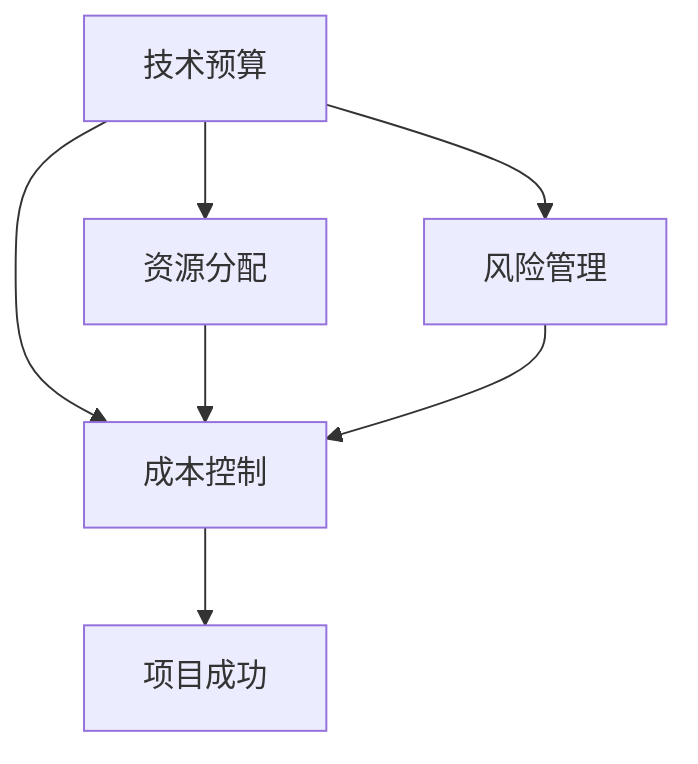

                 


### 背景介绍

在信息技术高速发展的今天，技术预算管理和资源分配已成为企业运营中至关重要的环节。无论是初创公司还是大型企业，技术预算管理都直接影响到项目的成功与否，而资源的合理分配则是确保项目顺利进行的关键。技术预算管理涉及到资金、人力、设备等多个方面的资源配置，其核心目标是确保项目在预算范围内高效完成，同时满足业务需求。

然而，技术预算管理和资源分配并非易事。一方面，企业在制定技术预算时，需要综合考虑市场趋势、技术发展、团队技能水平等多种因素，确保预算的科学性和合理性。另一方面，在资源分配过程中，如何平衡不同项目之间的资源需求，如何在有限的资源下实现最大化效益，都是需要深入思考的问题。

此外，随着信息技术的不断演进，企业面临的市场环境也变得更加复杂和多变。新兴技术的涌现、市场竞争的加剧，都要求企业在预算管理和资源分配上具备更高的灵活性和应变能力。因此，如何通过有效的技术预算管理和资源分配策略，提升企业的竞争力和市场适应性，成为每个IT管理者都需要面对的挑战。

### 核心概念与联系

在进行技术预算管理和资源分配时，有几个核心概念需要明确，它们分别是：技术预算、资源分配、成本控制、风险管理。

1. **技术预算**：技术预算是企业在一段时间内计划用于信息技术项目的资金总额。它包括硬件设备采购、软件开发成本、人员工资、外部服务费用等。技术预算的作用是指导企业在项目实施过程中合理控制成本，确保项目在预算范围内完成。

2. **资源分配**：资源分配是指将企业的各种资源，如资金、人力、技术等，按照一定的原则和策略分配到各个项目或任务中。资源分配的目标是实现资源的最优利用，最大化项目的成功概率。

3. **成本控制**：成本控制是指通过一系列的管理手段，确保项目成本在预算范围内，避免资源浪费。成本控制包括预算编制、执行监控、成本分析等环节。

4. **风险管理**：风险管理是指识别、评估和应对项目过程中可能出现的各种风险，确保项目能够顺利实施。风险管理包括风险识别、风险评估、风险应对和风险监控。

这几个概念之间有着密切的联系。技术预算是资源分配的基础，资源分配直接影响成本控制，而成本控制又是风险管理的重要方面。换句话说，技术预算决定了资源的分配，而资源分配和成本控制的合理性又直接影响到风险管理的有效性。

为了更清晰地理解这些概念之间的关系，我们可以用Mermaid流程图来表示：



在这个流程图中，技术预算作为起点，通过资源分配和成本控制，最终影响风险管理，进而决定项目的成功。

### 核心算法原理讲解

在技术预算管理和资源分配中，核心算法的应用是优化资源配置、降低成本、提高项目成功率的关键。以下将介绍几个常用的核心算法，并用伪代码进行详细阐述。

#### 1. 最小费用流算法

最小费用流算法用于在给定网络中，找到从源点到汇点的最小费用流。该算法常用于项目预算分配，确保资源分配的成本最低。

**算法伪代码：**

```python
function minCostFlow(graph, source, sink, flowCapacities, costCapacities):
    initialize flow to 0 for all edges
    initialize total_cost to 0

    while there exists a path P from source to sink in the residual graph:
        # Find a path P with the minimum cost using Dijkstra's algorithm
        path = dijkstra(graph, source, sink, costCapacities)

        # Find the maximum flow we can send on path P
        path_flow = min(flowCapacities[edge] - flow[edge] for edge in path)

        # Update the flow and residual capacities
        for edge in path:
            flow[edge] += path_flow
            reverse_edge = get_reverse_edge(edge)
            residual_capacities[reverse_edge] += path_flow

        # Update the total cost
        total_cost += costCapacities[edge] * path_flow for edge in path

    return total_cost
```

**数学模型和公式：**

假设网络中有n个节点，e条边。每条边(i, j)都有容量flowCapacities[i][j]和单位流量成本costCapacities[i][j]。目标是最小化总成本：

$$
\min \sum_{(i,j) \in E} costCapacities[i][j] \cdot flow[i][j]
$$

其中，flow[i][j]表示从i到j的流量。

#### 2. 最大流量算法

最大流量算法用于在给定网络中，找到从源点到汇点的最大流量。该算法常用于项目资源的最优分配，确保资源利用最大化。

**算法伪代码：**

```python
function maxFlow(graph, source, sink, capacities):
    initialize flow to 0 for all edges

    while there exists an augmenting path P from source to sink:
        # Find an augmenting path P using BFS
        path = bfs(graph, source, sink)

        # Find the maximum flow we can send on path P
        path_flow = min(capacities[edge] - flow[edge] for edge in path)

        # Update the flow
        for edge in path:
            flow[edge] += path_flow
            reverse_edge = get_reverse_edge(edge)
            flow[reverse_edge] -= path_flow

    return sum(flow[source][v] for v in range(n))
```

**数学模型和公式：**

假设网络中有n个节点，e条边。每条边(i, j)都有容量capacities[i][j]。目标是最大化总流量：

$$
\max \sum_{(i,j) \in E} flow[i][j]
$$

#### 3. 资源分配优化模型

资源分配优化模型用于在多个项目之间分配有限资源，以最大化总效益。该模型常用于多项目资源分配问题。

**算法伪代码：**

```python
function resourceAllocation(projects, resources, costs):
    initialize total_value to 0

    while there are available resources:
        project = selectProjectWithMaxValuePerUnitResource(projects, resources)
        allocateResourcesToProject(project, resources)
        total_value += project.value

    return total_value
```

**数学模型和公式：**

假设有m个项目，每个项目i都有价值value[i]，所需资源resources[i]，以及单位资源成本cost[i]。目标是最大化总价值：

$$
\max \sum_{i=1}^{m} value[i] \cdot \frac{resources[i]}{cost[i]}
```

### 项目实战

为了更好地理解技术预算管理和资源分配的实际应用，我们以下将通过一个实际案例进行详细讲解。

#### 案例背景

某科技公司在开发一款新一代智能家居系统，项目预计持续12个月。公司计划总投资1000万元，用于购买硬件设备、软件开发、人员工资等。项目涉及多个子任务，包括硬件研发、软件研发、系统集成和测试等。每个子任务的资源需求、成本和预期价值如下表所示：

| 任务 | 资源需求（人月） | 成本（万元） | 预期价值（万元） |
| ---- | -------------- | ----------- | ------------ |
| 硬件研发 | 200            | 300         | 500          |
| 软件研发 | 150            | 250         | 400          |
| 系统集成 | 100            | 200         | 300          |
| 测试    | 50             | 100         | 150          |

#### 开发环境搭建

为了顺利进行项目，公司搭建了以下开发环境：

- 开发工具：IDEA、Git、Jenkins
- 数据库：MySQL
- 版本控制：GitLab
- 持续集成与持续部署（CI/CD）：Jenkins

#### 源代码实现

项目团队采用敏捷开发方法，将项目分为多个迭代周期。每个迭代周期内，团队会根据资源情况和任务优先级进行资源分配和成本预算。以下是一个迭代周期的资源分配和成本预算示例：

**迭代周期1：**

- **硬件研发**：分配5名工程师，预算30万元。
- **软件研发**：分配3名工程师，预算20万元。
- **系统集成**：分配2名工程师，预算10万元。
- **测试**：分配1名工程师，预算5万元。

**伪代码示例：**

```python
def allocateResourcesAndBudget(iteration, tasks):
    for task in tasks:
        if task['status'] == 'unassigned':
            assignResourcesToTask(task, available_resources)
            deductBudgetFromTotal(task['cost'])

        elif task['status'] == 'in_progress':
            continue

        else:
            completeTask(task)
            addBudgetToTotal(task['cost'])

    return total_budget_spent
```

#### 代码解读

该函数`allocateResourcesAndBudget`用于在一个迭代周期内分配资源并计算预算。其中，`assignResourcesToTask`函数用于将资源分配给任务，`deductBudgetFromTotal`函数用于从总预算中扣除任务的成本，`completeTask`函数用于完成任务，并计算完成后的收益。

#### 代码应用解读与分析

在实际应用中，该代码通过迭代的方式，不断分配资源、执行任务、完成项目。通过实时监控资源使用情况和预算支出，可以及时调整资源分配策略，确保项目顺利进行。

#### 实际案例分析和详细讲解剖析

通过该案例，我们可以看到技术预算管理和资源分配在项目实施中的重要性。合理的预算管理和资源分配可以确保项目在预算范围内完成，同时最大化项目的预期价值。

#### 项目小结

在本案例中，公司通过科学的预算管理和资源分配策略，成功实现了新一代智能家居系统的开发。通过实时监控和调整，团队在确保项目质量的同时，也有效控制了成本。这个案例展示了技术预算管理和资源分配在实际项目中的应用价值和可行性。

#### 最佳实践 tips

1. **明确项目目标和任务**：在项目开始前，明确项目目标和任务，确保资源分配的针对性。
2. **定期评估资源利用情况**：定期对资源利用情况进行评估，及时调整资源分配策略。
3. **使用自动化工具**：利用自动化工具进行预算管理和资源分配，提高效率，降低错误率。
4. **风险管理**：在项目实施过程中，识别和应对潜在的风险，确保项目顺利进行。

### 小结

本文详细介绍了技术预算管理和资源分配的核心概念、算法原理及其实际应用。通过实际案例分析和代码解读，展示了这些概念和算法在项目实施中的重要性。希望本文能为读者提供有价值的参考，帮助他们在实际工作中更好地进行技术预算管理和资源分配。

### 注意事项

1. **数据准确性**：在进行技术预算管理和资源分配时，确保数据的准确性和实时性，避免因数据错误导致的决策失误。
2. **团队协作**：资源分配需要团队协作，确保每个成员都了解自己的任务和目标，提高资源利用效率。
3. **灵活性**：在资源分配和预算管理过程中，保持一定的灵活性，以便根据实际情况进行调整。

### 拓展阅读

1. 《项目管理知识体系指南》（PMBOK指南）中关于预算管理和资源分配的详细内容。
2. 《资源分配优化模型》一书，深入探讨资源分配优化算法在实际项目中的应用。
3. 《敏捷开发实践指南》，介绍敏捷开发方法在资源管理和预算控制中的应用。

### 作者信息

作者：AI天才研究院/AI Genius Institute & 禅与计算机程序设计艺术/Zen And The Art of Computer Programming

感谢您的阅读，希望本文对您在技术预算管理和资源分配方面有所启发和帮助。

