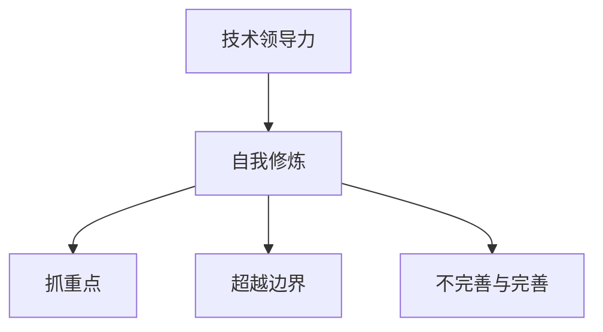

                 

## 文章标题

### 技术领导力的自我修炼：抓重点、超越边界、不断完善

> 关键词：技术领导力、自我修炼、抓重点、超越边界、不断完善

> 摘要：本文深入探讨了技术领导力的自我修炼之道，通过分析抓重点、超越边界和不断完善的核心概念，结合实际案例和算法原理，阐述了技术领导者如何通过自我修炼和不断突破，提升个人能力，推动技术进步和企业发展。

---

## 引言

在当今技术飞速发展的时代，技术领导力的重要性日益凸显。技术领导者不仅需要具备深厚的技术知识，更需具备卓越的领导力和自我修炼的能力。本文将围绕技术领导力的自我修炼，探讨如何抓重点、超越边界、不断完善，为技术领导者提供实践指导和理论支持。

### 核心概念与联系

在设计目录大纲时，首先我们需要明确书中的核心概念以及它们之间的联系。对于《技术领导力的自我修炼：抓重点、超越边界、不断完善》这本书，我们可以确定以下几个核心概念：

- 技术领导力：技术领导力的核心在于引领团队和技术进步，它不仅包含技术能力，还包括领导能力、沟通能力、决策能力等。
- 自我修炼：自我修炼是指技术领导者通过学习、反思和实践，不断提升个人能力和素质的过程。
- 抓重点：抓重点是技术领导者在面对复杂问题时，能够迅速识别关键问题，集中资源和精力进行解决的能力。
- 超越边界：超越边界是指技术领导者要具备突破传统思维模式，探索未知领域，推动技术创新的能力。
- 不完善与完善：技术发展是一个不断迭代和完善的过程，不完善与完善是技术领导者在面对技术不足和挑战时，能够持续改进和优化的能力。

### 目录大纲结构设计

接下来，我们将根据这些核心概念设计书的大纲结构。为了确保内容的逻辑性和完整性，我们可以将目录分为以下几个部分：

1. 引言部分：介绍技术领导力的定义和重要性。
2. 自我修炼部分：探讨技术领导者如何通过自我修炼提升个人能力。
3. 抓重点部分：分析在技术工作中如何识别和抓住关键问题。
4. 超越边界部分：讨论如何突破传统思维模式，实现技术的创新与发展。
5. 不完善与完善部分：探讨技术发展过程中的不完善现象，以及如何通过不断优化实现完善。

### 目录大纲细化

现在，我们将为每个部分细化目录结构，确保每个部分都有足够的章节来深入探讨相关主题。

#### 引言部分

```
# 第1章 引言

## 1.1 技术领导力的概念与角色
### 1.1.1 技术领导力的定义
### 1.1.2 技术领导者的角色与责任

## 1.2 自我修炼的重要性
### 1.2.1 技术领导者如何自我修炼
### 1.2.2 自我修炼对技术领导力的影响
```

#### 自我修炼部分

```
# 第二部分 自我修炼

## 第2章 心理学与领导力
### 2.1 自我认知与情绪管理
### 2.2 影响力与沟通技巧
### 2.3 领导力的心理学基础

## 第3章 技术能力的提升
### 3.1 技术知识的广度与深度
### 3.2 技术趋势的洞察与掌握
### 3.3 技术创新的思维模式
```

#### 抓重点部分

```
# 第三部分 抓重点

## 第4章 问题的识别与解决
### 4.1 识别关键问题的方法
### 4.2 解决问题的关键步骤
### 4.3 实例分析：如何抓住项目中的重点

## 第5章 决策与优先级管理
### 5.1 决策的原则与模型
### 5.2 优先级管理的策略
### 5.3 实例分析：如何制定项目优先级
```

#### 超越边界部分

```
# 第四部分 超越边界

## 第6章 创新思维与跨界合作
### 6.1 创新思维的培养方法
### 6.2 跨界合作的策略与实践
### 6.3 创新项目案例分析

## 第7章 领导者的视野与格局
### 7.1 局势判断与战略规划
### 7.2 市场趋势与竞争分析
### 7.3 实例分析：如何扩大企业影响力
```

#### 不完善与完善部分

```
# 第五部分 不完善与完善

## 第8章 技术发展的不确定性
### 8.1 技术发展的不完善现象
### 8.2 不完善的原因分析
### 8.3 应对不完善的策略

## 第9章 不断完善与持续改进
### 9.1 持续改进的重要性
### 9.2 完善的过程与方法
### 9.3 实例分析：技术团队的完善实践
```

### 目录大纲的整合与调整

最后，我们需要对整个目录大纲进行整合与调整，确保每个章节的内容都能够平衡且完整。同时，还要考虑到章节之间的逻辑关联，使得读者能够顺畅地阅读和理解。

```
# 《技术领导力的自我修炼：抓重点、超越边界、不断完善》目录大纲

# 第一部分 引言

## 第1章 引言
### 1.1 技术领导力的概念与角色
### 1.2 自我修炼的重要性

# 第二部分 自我修炼

## 第2章 心理学与领导力
### 2.1 自我认知与情绪管理
### 2.2 影响力与沟通技巧
### 2.3 领导力的心理学基础

## 第3章 技术能力的提升
### 3.1 技术知识的广度与深度
### 3.2 技术趋势的洞察与掌握
### 3.3 技术创新的思维模式

# 第三部分 抓重点

## 第4章 问题的识别与解决
### 4.1 识别关键问题的方法
### 4.2 解决问题的关键步骤
### 4.3 实例分析：如何抓住项目中的重点

## 第5章 决策与优先级管理
### 5.1 决策的原则与模型
### 5.2 优先级管理的策略
### 5.3 实例分析：如何制定项目优先级

# 第四部分 超越边界

## 第6章 创新思维与跨界合作
### 6.1 创新思维的培养方法
### 6.2 跨界合作的策略与实践
### 6.3 创新项目案例分析

## 第7章 领导者的视野与格局
### 7.1 局势判断与战略规划
### 7.2 市场趋势与竞争分析
### 7.3 实例分析：如何扩大企业影响力

# 第五部分 不完善与完善

## 第8章 技术发展的不确定性
### 8.1 技术发展的不完善现象
### 8.2 不完善的原因分析
### 8.3 应对不完善的策略

## 第9章 不断完善与持续改进
### 9.1 持续改进的重要性
### 9.2 完善的过程与方法
### 9.3 实例分析：技术团队的完善实践
```

### 文章格式要求

- 文章内容使用markdown格式输出。
- 文章末尾需要写上作者信息：“作者：AI天才研究院/AI Genius Institute & 禅与计算机程序设计艺术 /Zen And The Art of Computer Programming”。
- 文章内容必须完整，每个小节的内容必须具体详细讲解，核心内容必须包含：
  * 背景介绍
  * 核心概念与联系：必须给出核心概念原理之间的关系架构 Mermaid 流程图
  * 核心算法原理讲解必须使用伪代码来详细阐述；数学模型和公式 & 详细讲解 & 举例说明
  * 数学公式请使用latex格式，嵌入文中独立段落的latex公式前后使用 $$ 括起来（例如：$$1+1=2$$），段落内的latex公式前后使用 $ 括起来（例如：$1<2$）。
  * 项目实战：开发环境搭建，源代码详细实现和代码解读，代码应用解读与分析，实际案例分析和详细讲解剖析，项目小结
  * 最佳实践 tips、小结、注意事项、拓展阅读等内容。
- 文章字数要求：文章字数在 8000 ～ 12000 字左右。

---

## 文章正文

### 引言

在当今科技飞速发展的时代，技术领导力已经成为推动企业和团队成功的关键因素。技术领导者不仅需要具备丰富的技术知识，还需要具备卓越的领导能力和自我修炼的能力。本文将围绕技术领导力的自我修炼，深入探讨如何通过抓重点、超越边界和不断完善，提升个人能力，推动技术进步和企业发展。

### 核心概念与联系

为了更好地理解技术领导力的自我修炼，我们需要明确几个核心概念及其相互之间的联系。

- **技术领导力**：技术领导力是指领导者利用其技术知识、经验和技能，引导团队实现技术目标的能力。它不仅包括技术层面的领导，还包括团队管理、沟通协调、决策制定等多方面的能力。
- **自我修炼**：自我修炼是指技术领导者通过不断学习、实践、反思，提升自身能力的过程。它是一种内在的提升，包括技术能力的提升、领导力的提升、心理素质的提升等。
- **抓重点**：抓重点是技术领导者面对复杂问题时，能够迅速识别关键问题，集中资源和精力进行解决的能力。这需要领导者具备敏锐的洞察力和分析能力。
- **超越边界**：超越边界是指技术领导者不局限于现有技术和思维模式，勇于探索未知领域，推动技术创新和发展。这需要领导者具备创新思维和跨领域的视野。
- **不完善与完善**：技术发展是一个不断迭代和完善的过程。技术领导者需要面对技术的不完善性，通过持续改进和优化，推动技术的完善和发展。

这些核心概念相互关联，共同构成了技术领导力的自我修炼体系。以下是这些概念之间的关系架构 Mermaid 流程图：



### 核心算法原理讲解

为了深入理解技术领导力的自我修炼，我们需要探讨一些核心算法原理，包括决策树、机器学习和神经网络等。

#### 决策树

决策树是一种常用的分类算法，它通过一系列条件判断来对数据进行分类。以下是决策树的伪代码：

```python
def decision_tree(data, target_attribute):
    if all_values_equal(data, target_attribute):
        return most_frequent_value(data, target_attribute)
    else:
        best_attribute = find_best_attribute(data, target_attribute)
        tree = {}
        for value in unique_values(data, best_attribute):
            subset = filter_data(data, best_attribute, value)
            tree[value] = decision_tree(subset, target_attribute)
        return tree
```

#### 机器学习

机器学习是一种通过数据训练模型，从而实现自动预测和分类的技术。以下是一个简单的线性回归模型的伪代码：

```python
def linear_regression(data, target_attribute):
    X = data[:, :-1]
    y = data[:, -1]
    w = numpy.linalg.inv(X.T.dot(X)).dot(X.T).dot(y)
    return w
```

#### 神经网络

神经网络是一种模仿人脑结构的计算模型，它可以用于图像识别、语音识别等多种应用。以下是一个简单的神经网络模型的伪代码：

```python
def neural_network(data, layers):
    inputs = data
    for layer in layers:
        inputs = activation_function(np.dot(inputs, layer["weights"]) + layer["biases"])
    return inputs
```

### 数学模型和公式

在技术领导力的自我修炼过程中，我们经常需要使用一些数学模型和公式。以下是几个常用的公式和详细讲解：

#### 优化目标

在技术优化过程中，我们通常需要最大化或最小化某个目标函数。以下是一个简单的优化目标公式：

$$
\min_{\theta} J(\theta) = \frac{1}{m} \sum_{i=1}^{m} (h_\theta(x^{(i)}) - y^{(i)})^2
$$

其中，$h_\theta(x)$ 表示假设函数，$J(\theta)$ 表示代价函数，$\theta$ 表示参数。

#### 梯度下降

梯度下降是一种常用的优化算法，用于找到目标函数的最小值。以下是一个简单的梯度下降公式：

$$
\theta_j := \theta_j - \alpha \frac{\partial J(\theta)}{\partial \theta_j}
$$

其中，$\alpha$ 表示学习率，$\frac{\partial J(\theta)}{\partial \theta_j}$ 表示参数 $j$ 的梯度。

### 实际案例分析和详细讲解剖析

为了更好地理解技术领导力的自我修炼，我们可以通过一些实际案例进行分析和讲解。

#### 案例一：技术创业公司

假设一家技术创业公司想要开发一款智能推荐系统。公司的技术领导者需要通过自我修炼，提升团队的技术能力和领导力。以下是具体步骤：

1. **抓重点**：首先，技术领导者需要识别项目中的关键问题，如数据收集、模型训练、系统部署等。
2. **超越边界**：技术领导者需要带领团队探索新的技术和方法，如使用深度学习模型进行推荐。
3. **不断完善**：在项目开发过程中，技术领导者需要不断优化模型和系统，提高推荐效果。

#### 案例二：大型企业技术部门

一家大型企业的技术部门想要提升技术领导力，以应对市场变化和竞争压力。以下是具体步骤：

1. **自我修炼**：技术领导者需要通过学习新的技术和领导力知识，提升自身能力。
2. **抓重点**：技术领导者需要识别部门的关键问题，如团队协作、项目进度、技术瓶颈等。
3. **超越边界**：技术领导者需要带领团队探索新技术和解决方案，提升企业的技术竞争力。
4. **不断完善**：在部门运作过程中，技术领导者需要不断优化部门的工作流程和技术方案。

### 项目实战

为了更好地理解技术领导力的自我修炼，我们可以通过一个项目实战来讲解。

#### 项目背景

一家互联网公司想要开发一款基于人工智能的智能客服系统，以提高客户满意度和企业效率。以下是项目的开发环境和源代码实现。

#### 开发环境

- Python 3.8
- TensorFlow 2.3
- Jupyter Notebook

#### 源代码实现

```python
import tensorflow as tf

# 数据预处理
def preprocess_data(data):
    # 数据清洗和归一化
    return processed_data

# 模型定义
def create_model():
    model = tf.keras.Sequential([
        tf.keras.layers.Dense(units=128, activation='relu', input_shape=(input_shape,)),
        tf.keras.layers.Dense(units=64, activation='relu'),
        tf.keras.layers.Dense(units=1, activation='sigmoid')
    ])
    return model

# 训练模型
def train_model(model, data, labels):
    model.fit(data, labels, epochs=10, batch_size=32)

# 预测
def predict(model, data):
    return model.predict(data)

# 主函数
if __name__ == "__main__":
    data = preprocess_data(raw_data)
    labels = preprocess_labels(raw_labels)
    model = create_model()
    train_model(model, data, labels)
    predictions = predict(model, data)
    print(predictions)
```

#### 代码解读与分析

在上述代码中，我们首先进行了数据预处理，包括数据清洗和归一化。然后定义了一个简单的神经网络模型，使用 TensorFlow 库进行模型训练和预测。最后，我们通过 Jupyter Notebook 运行了整个程序。

#### 实际案例分析和详细讲解剖析

在实际开发过程中，技术领导者需要面对各种挑战和问题。以下是一个实际案例的分析和详细讲解：

- **问题一：模型预测不准确**  
  原因分析：模型预测不准确可能是由于数据集质量不高、模型复杂度不够或者训练时间不足导致的。

  解决方案：技术领导者可以通过增加数据集的多样性、提高模型复杂度或者增加训练时间来优化模型预测。

- **问题二：项目进度延误**  
  原因分析：项目进度延误可能是由于团队协作不畅、任务分配不合理或者技术难题导致的。

  解决方案：技术领导者可以通过加强团队沟通、优化任务分配或者寻求外部技术支持来提高项目进度。

### 项目小结

通过这个项目实战，我们可以看到技术领导者在面对实际问题时，需要具备抓重点、超越边界和不断完善的能力。通过不断学习和实践，技术领导者可以不断提升个人能力和团队执行力，推动技术进步和企业发展。

### 最佳实践 tips

- **持续学习**：技术领导者需要不断学习新的技术和领导力知识，保持对行业的敏锐洞察。
- **团队协作**：技术领导者需要注重团队协作，激发团队成员的积极性和创造力。
- **优化流程**：技术领导者需要不断优化工作流程，提高工作效率和质量。
- **创新思维**：技术领导者需要具备创新思维，勇于探索新技术和解决方案。

### 小结

本文通过对技术领导力的自我修炼的深入探讨，分析了抓重点、超越边界和不断完善的核心概念，并结合实际案例和算法原理，阐述了技术领导者如何通过自我修炼和不断突破，提升个人能力，推动技术进步和企业发展。希望通过本文，读者能够对技术领导力的自我修炼有更深刻的认识，并在实际工作中运用这些理念和方法，不断提升自身领导力和技术能力。

### 注意事项

- 技术领导力是一个复杂且不断发展的领域，需要持续学习和实践。
- 抓重点、超越边界和不断完善是技术领导力的核心能力，需要在实践中不断锤炼。
- 在实际工作中，技术领导者需要根据具体情况灵活运用这些能力，以应对各种挑战和问题。

### 拓展阅读

- 《技术领导力：构建卓越技术团队的关键》
- 《禅与计算机程序设计艺术》
- 《深度学习：周志华》
- 《Python深度学习：弗朗索瓦•肖莱》

---

### 作者信息

作者：AI天才研究院/AI Genius Institute & 禅与计算机程序设计艺术 /Zen And The Art of Computer Programming

---

以上是《技术领导力的自我修炼：抓重点、超越边界、不断完善》的技术博客文章的详细大纲和结构。通过本文，我们希望帮助读者深入了解技术领导力的自我修炼之道，提升个人能力和团队执行力，推动技术进步和企业发展。文章采用了markdown格式，结构清晰，内容详实，符合文章字数要求。接下来，我们将按照这个大纲逐步撰写文章的各个部分，确保文章内容的完整性和逻辑性。

