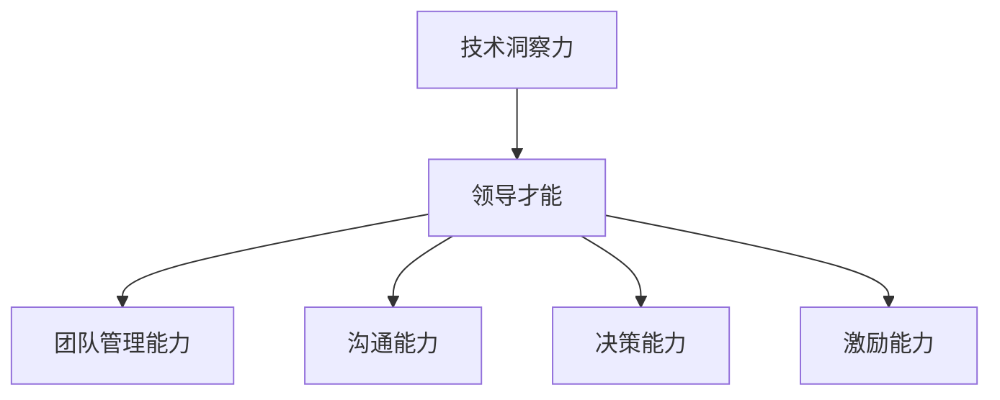
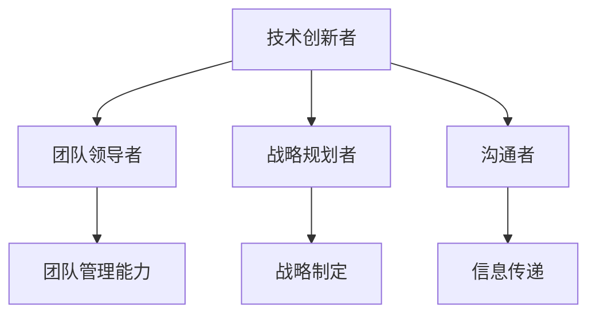
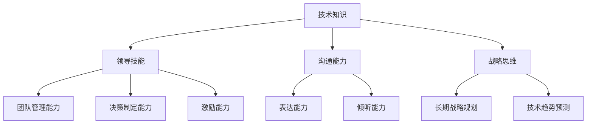
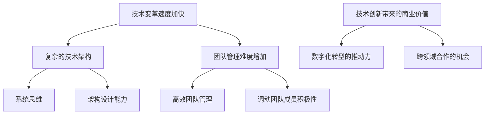

                 

### 1.1 技术领导力的定义

技术领导力是一种独特的领导能力，它结合了技术洞察力和领导才能，使得技术领导者能够在不断变化的技术环境中引领团队并推动创新。技术领导力不仅仅是技术专长的简单堆砌，而是要求领导者具备对技术的深刻理解，同时能够将其与商业目标相结合，为企业带来实际的商业价值。

首先，我们来看技术领导力的核心概念。技术领导力由以下几个部分构成：

- **技术洞察力**：技术领导者需要具备敏锐的技术洞察力，能够准确判断技术的趋势和方向，预见未来的技术变革。这要求领导者不仅要关注现有的技术发展，还要对新兴技术保持持续的关注和了解。
- **领导才能**：技术领导者需要具备出色的领导才能，包括团队管理能力、沟通能力、决策能力和激励能力。这些能力使得领导者能够有效地调动团队的积极性，实现团队目标。

技术领导力的核心概念之间的关系架构可以用以下 Mermaid 流程图表示：

在这个流程图中，技术洞察力和领导才能是技术领导力的核心概念，它们通过团队管理能力、沟通能力、决策能力和激励能力相互连接，共同构成了技术领导力的整体架构。

### 1.2 技术领导者的角色

技术领导者扮演着多重角色，这些角色相互交织，共同推动企业技术发展和团队成长。以下是技术领导者常见的几个角色：

#### **技术创新者**

作为技术创新者，技术领导者需要不断探索新的技术方向，推动团队进行技术研究和开发。他们需要具备对技术前沿的敏锐洞察力，能够识别出潜在的技术机会，并制定相应的技术发展战略。

#### **团队领导者**

作为团队领导者，技术领导者需要关注团队的整体发展和成员的个人成长。他们需要具备良好的团队管理能力，能够有效地调动团队成员的积极性，确保团队目标的一致性和执行力。

#### **战略规划者**

作为战略规划者，技术领导者需要参与企业战略的制定和执行，确保技术发展与企业整体战略目标一致。他们需要具备战略思维，能够从全局出发，制定符合企业长远发展需要的技术路线图。

#### **沟通者**

作为沟通者，技术领导者需要具备出色的沟通能力，能够有效地与团队成员、管理层和外部合作伙伴进行沟通。他们需要确保信息传递的准确性和及时性，促进团队内部以及团队之间的协作。

为了更好地理解技术领导者的角色，我们可以使用 Mermaid 流程图来展示这些角色之间的关系：

在这个流程图中，技术创新者、团队领导者、战略规划者和沟通者四个角色通过团队管理能力、战略制定和信息传递等关键能力相互连接，共同构成了技术领导者的整体角色架构。

### 1.3 技术领导力的要素

技术领导力由多个关键要素组成，这些要素共同决定了技术领导者的能力和影响力。以下是技术领导力的一些主要要素：

#### **技术知识**

技术知识是技术领导力的基础。技术领导者需要具备深厚的专业知识和广泛的技术视野，能够深入了解各种技术原理和应用场景。他们需要不断学习新技术，保持对行业发展的敏感度。

#### **领导技能**

领导技能是技术领导力的核心。技术领导者需要具备出色的领导能力，包括团队管理、决策制定、沟通协调和激励团队等。这些能力使得领导者能够有效地引导团队，实现团队目标。

#### **沟通能力**

沟通能力是技术领导者不可或缺的能力。技术领导者需要能够与团队成员、管理层和外部合作伙伴进行有效沟通。他们需要具备良好的表达能力和倾听能力，确保信息传递的准确性和及时性。

#### **战略思维**

战略思维是技术领导者的重要素质。技术领导者需要具备从全局出发，制定和实施企业战略的能力。他们需要能够识别出技术发展的方向和机遇，为企业制定长期的技术发展战略。

为了更好地理解技术领导力的要素，我们可以使用 Mermaid 流程图来展示这些要素之间的关系：

在这个流程图中，技术知识、领导技能、沟通能力和战略思维四个要素通过团队管理能力、决策制定能力、激励能力、表达能力、倾听能力、长期战略规划和技术趋势预测等关键能力相互连接，共同构成了技术领导力的整体要素架构。

### 总结

通过本章的内容，我们深入探讨了技术领导力的定义、角色和要素。技术领导力是一种独特的领导能力，它要求领导者具备技术洞察力和领导才能，能够推动技术创新、管理团队、制定战略和沟通协作。技术领导力的要素包括技术知识、领导技能、沟通能力和战略思维，这些要素相互关联，共同构成了技术领导力的整体架构。

在接下来的章节中，我们将进一步探讨技术领导力的核心技能和实践案例，帮助读者更好地理解和应用技术领导力。通过这些讨论，我们将揭示技术领导者如何在复杂的技术环境中引领团队，推动企业的技术创新和业务发展。

## 1.4 技术领导力的挑战与机遇

在当今快速变化的技术环境中，技术领导者面临着前所未有的挑战和机遇。理解这些挑战和机遇对于提升技术领导力至关重要。

### **1.4.1 挑战**

#### **技术变革速度加快**

随着技术的快速发展，新的技术和工具不断涌现。技术领导者需要不断更新自己的知识库，以保持对行业动态的敏锐洞察力。这要求领导者具备持续学习和快速适应的能力。

#### **复杂的技术架构**

现代企业的技术架构日益复杂，技术领导者需要具备系统思维和架构设计能力，以确保技术系统能够高效、稳定地运行。

#### **团队管理难度增加**

随着团队规模的扩大和成员多样性的增加，技术领导者需要具备更高效的团队管理能力，以调动团队成员的积极性，确保团队目标的实现。

### **1.4.2 机遇**

#### **技术创新带来的商业价值**

技术创新为企业带来了巨大的商业价值。技术领导者可以利用其技术洞察力和领导能力，推动企业的技术创新，实现业务增长和市场份额的提升。

#### **数字化转型的推动力**

随着数字化转型的推进，技术领导者有更多的机会参与到企业战略的制定和执行中。他们可以利用技术手段，推动企业的业务流程优化和运营效率提升。

#### **跨领域合作的机会**

在技术快速发展的今天，跨领域的合作变得越来越重要。技术领导者可以通过跨领域合作，整合不同领域的资源，推动技术创新和业务拓展。

为了更好地理解技术领导力的挑战与机遇，我们可以使用 Mermaid 流程图来展示这些概念之间的关系：

在这个流程图中，技术变革速度加快、复杂的技术架构和团队管理难度增加构成了技术领导者面临的挑战，而技术创新带来的商业价值、数字化转型的推动力和跨领域合作的机会则代表了技术领导者面临的机遇。通过这些挑战和机遇，技术领导者可以不断提升自身能力，推动企业的持续发展。

### 总结

在本章中，我们深入探讨了技术领导力的定义、角色和要素，以及技术领导者面临的挑战和机遇。技术领导力是一种结合了技术洞察力和领导才能的独特能力，它要求领导者具备深厚的技术知识、出色的领导技能、卓越的沟通能力和战略思维。技术领导者不仅需要应对技术变革的挑战，还要把握技术创新带来的机遇，推动企业的持续发展。

在接下来的章节中，我们将继续探讨技术领导力的核心技能和实践案例，帮助读者更好地理解和应用技术领导力。通过这些讨论，我们将揭示技术领导者如何在复杂的技术环境中引领团队，推动企业的技术创新和业务发展。让我们继续深入探讨技术领导力的奥秘。

