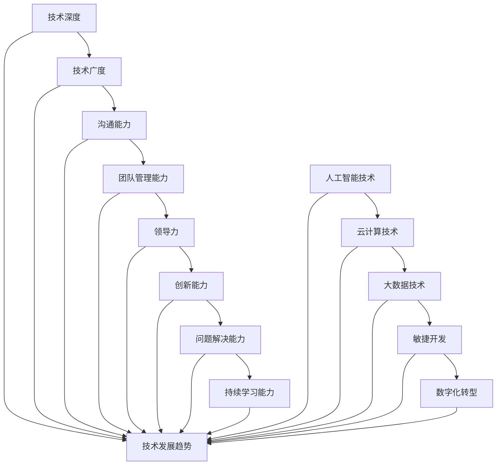
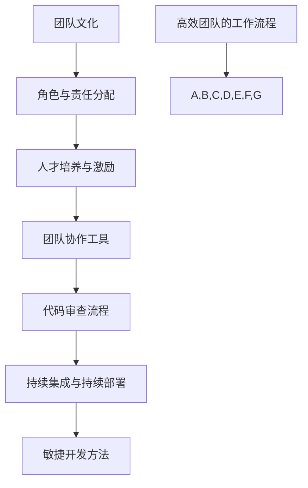
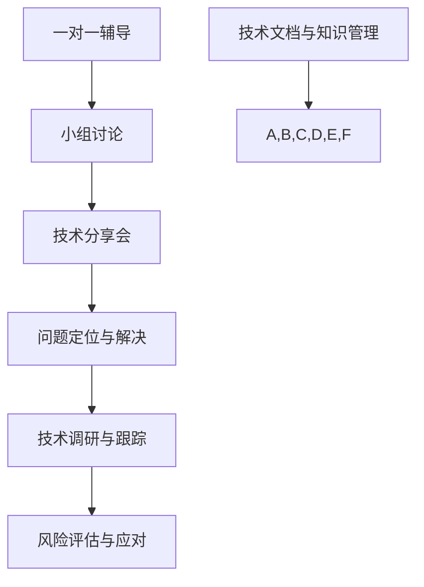
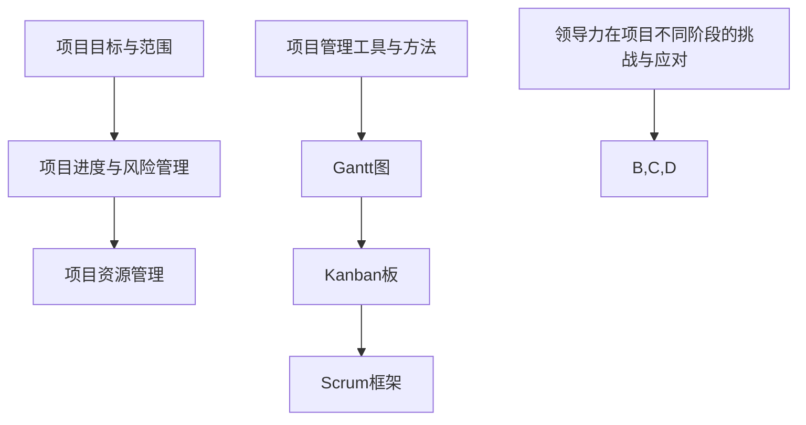
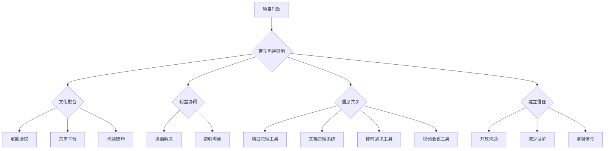
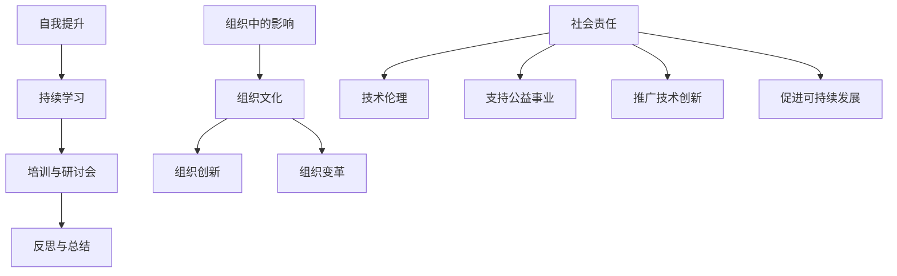

                 

### 文章标题

《技术领导力：激励和指导开发团队》

### 关键词

技术领导力、开发团队、激励、指导、项目管理

### 摘要

本文旨在探讨技术领导力在激励和指导开发团队中的关键作用。我们将从核心概念出发，详细分析技术领导力的定义、角色、素质与技能，以及其发展趋势。通过深入探讨团队建设、激励策略、技术指导方法、项目管理等主题，本文旨在为技术领导者提供实用的指导和建议，以提升团队效能和项目成功率。此外，还将分享最佳实践和注意事项，帮助技术领导者更好地履行其职责，推动团队和组织的持续发展。

---

## 导言

在当今快速发展的技术时代，技术领导力的作用愈发凸显。技术领导者不仅需要具备深厚的技术背景，还需要具备卓越的领导力和管理能力。他们不仅要能够引领团队在技术领域不断创新，还要能够激励团队成员，指导他们克服挑战，共同实现项目目标。

本文将围绕技术领导力在激励和指导开发团队中的关键作用展开讨论。我们将首先定义技术领导力，探讨其核心概念和角色。接着，我们将深入分析技术领导者的素质与技能，包括沟通能力、技术深度与广度以及团队管理能力。随后，我们将探讨技术领导力的发展趋势，探讨人工智能、云计算等新兴技术对领导力的影响。

在核心概念与联系部分，我们将通过 Mermaid 流程图展示技术领导力各个要素之间的关系架构。这将帮助读者更好地理解技术领导力的整体框架。接下来，我们将详细讲解激励理论和设定清晰的目标与期望的方法，以及激励策略与工具的具体应用。

在指导开发团队的部分，我们将探讨技术指导的方法与技巧，包括一对一辅导、小组讨论和技术分享会。同时，我们将讨论如何解决技术难题，编写清晰的技术文档，以及维护知识库。最后，我们将探讨领导力在项目管理中的应用，包括项目管理的核心概念、工具与方法，以及领导力在项目不同阶段的挑战与应对。

通过本文的讨论，我们希望为技术领导者提供实用的指导和建议，帮助他们更好地激励和指导开发团队，提升团队效能和项目成功率。同时，我们也希望本文能激发读者对技术领导力的深入思考，促进其在实际工作中的应用和实践。

---

## 第1章：技术领导力的核心概念与角色

### 1.1 技术领导力的定义与重要性

技术领导力是一种综合能力，它不仅涉及技术深度和广度，还包括领导力和管理技能。技术领导力可以被定义为“在技术领域中，通过激励、指导、规划和组织，带领团队实现目标的能力”。这种能力不仅要求领导者具备扎实的技术知识，还要求他们能够理解和应用各种管理理论和方法。

在团队中，技术领导者扮演着多重角色。首先，他们是团队的技术顾问，提供技术指导和支持，帮助团队成员解决技术难题。其次，他们是团队的领导者，负责团队的组织和管理，确保团队成员能够高效合作。最后，他们是团队的激励者，通过设定清晰的目标、提供激励机制，激发团队成员的工作热情和创造力。

技术领导力的重要性体现在以下几个方面：

1. **引领技术发展方向**：技术领导者需要具备前瞻性，能够把握技术趋势，引领团队在技术领域不断创新。这有助于团队在竞争中保持优势。

2. **提升团队效能**：技术领导者通过有效的团队管理和激励机制，能够提高团队的整体效能，确保项目按时、按质完成。

3. **促进知识共享**：技术领导者需要建立知识共享和传承机制，确保团队中的知识能够得到有效利用和传播。

4. **培养技术人才**：技术领导者通过培训和指导，培养团队中的技术人才，提升团队的整体技术实力。

### 1.2 技术领导者的素质与技能

技术领导者的素质和技能是他们成功的关键。以下是一些重要的素质与技能：

1. **沟通能力**：技术领导者需要具备出色的沟通能力，能够清晰、准确地表达自己的想法，并与团队成员建立良好的沟通机制。有效的沟通有助于减少误解和冲突，提高团队的协作效率。

2. **技术深度与广度**：技术领导者不仅需要具备扎实的技术知识，还要对多种技术有广泛了解。这样，他们才能在遇到复杂问题时，提供有效的解决方案。

3. **团队管理能力**：技术领导者需要具备团队管理能力，能够合理安排团队成员的工作，协调团队资源，确保团队目标的实现。

4. **领导力**：技术领导者需要具备领导力，能够激励团队成员，引导他们克服困难，实现共同目标。领导力包括但不限于激励、指导、决策和团队合作等方面。

5. **创新能力**：技术领导者需要具备创新能力，能够在技术领域不断探索，推动团队进行技术创新。

6. **问题解决能力**：技术领导者需要具备强大的问题解决能力，能够迅速识别和解决团队面临的各种问题。

7. **持续学习能力**：技术领导者需要具备持续学习能力，能够不断更新自己的知识库，跟上技术发展的步伐。

### 1.3 技术领导力的发展趋势

技术领导力的发展受到多种因素的影响，其中最为显著的包括人工智能、云计算、大数据等新兴技术的兴起。以下是一些技术领导力的发展趋势：

1. **人工智能的崛起**：随着人工智能技术的不断进步，技术领导者需要具备相关技能，能够理解和应用人工智能技术，推动团队在人工智能领域进行创新。

2. **云计算的普及**：云计算技术的普及改变了传统的 IT 架构，技术领导者需要熟悉云计算技术，能够设计和实现高效的云基础设施。

3. **大数据的挑战**：大数据技术的发展带来了新的机遇和挑战，技术领导者需要具备处理和分析大数据的能力，能够利用大数据推动业务增长。

4. **敏捷开发的普及**：敏捷开发方法在团队中的广泛应用要求技术领导者具备敏捷思维，能够灵活应对变化，提高团队响应速度。

5. **数字化转型的推进**：数字化转型已经成为企业发展的关键，技术领导者需要具备数字化转型的战略眼光，能够推动企业实现数字化转型。

### 核心概念与联系

为了更好地理解技术领导力的核心概念和联系，我们可以使用 Mermaid 流程图来展示技术领导力的各个要素之间的关系：



这个流程图展示了技术领导力的核心概念和其与新兴技术之间的联系。通过这个流程图，我们可以清晰地看到技术领导者所需具备的各种技能和新兴技术对领导力的影响。

### 核心算法原理讲解

在技术领导力中，核心算法原理的理解和运用至关重要。以下是一个简化的伪代码，用于描述技术领导者如何运用算法原理来指导团队：

```python
# 技术领导力指导算法
def technical_leadership_guidance(team, problem, technology):
    """
    指导团队解决技术问题

    参数：
    team: 团队
    problem: 技术问题
    technology: 相关技术

    返回：
    solution: 解决方案
    """
    # 确定问题类型
    problem_type = identify_problem_type(problem)

    # 根据问题类型选择合适的解决方案
    if problem_type == "data":
        solution = data_solution(team, technology)
    elif problem_type == "algorithm":
        solution = algorithm_solution(team, technology)
    else:
        solution = generic_solution(team, technology)

    # 实施解决方案
    implement_solution(solution, team)

    # 返回解决方案
    return solution
```

### 数学模型与公式讲解

在技术领导力中，数学模型和公式用于量化决策和评估。以下是一个简化的数学模型，用于描述如何根据团队成员的能力和工作量来分配任务：

$$
\text{任务分配模型} = \frac{\text{总工作量}}{\sum_{i=1}^{n} \text{团队成员能力}}
$$

其中，\( n \) 为团队成员数量，每个成员的能力用一个权重值表示。这个公式帮助技术领导者根据团队成员的能力来分配任务，确保任务能够高效完成。

### 举例说明

假设一个团队有5名成员，他们的能力权重分别为2、3、4、3和2。团队需要完成一个总工作量为50的任务。根据上述模型，任务分配如下：

$$
\text{任务分配模型} = \frac{50}{2+3+4+3+2} = \frac{50}{14} \approx 3.57
$$

这意味着每个成员大约需要完成3.57个单位的工作量。在实际应用中，技术领导者可以根据具体情况对任务进行微调，确保任务的公平和高效完成。

### 项目实战

在技术领导力实践中，开发环境搭建是至关重要的一步。以下是一个简单的项目实战示例，用于搭建一个基于Python的Web开发环境：

#### 开发环境搭建

1. **安装Python**：
   - 在命令行中运行：`sudo apt-get install python3`
   - 安装完成后，验证：`python3 --version`

2. **安装虚拟环境**：
   - 安装虚拟环境模块：`pip3 install virtualenv`
   - 创建虚拟环境：`virtualenv myenv`
   - 激活虚拟环境：`source myenv/bin/activate`

3. **安装Web框架**：
   - 安装Flask框架：`pip install flask`
   - 验证安装：`flask --version`

4. **创建Web应用**：
   - 创建一个名为`app.py`的文件，并编写简单的Flask应用：

   ```python
   from flask import Flask
   app = Flask(__name__)

   @app.route('/')
   def hello():
       return "Hello, World!"

   if __name__ == '__main__':
       app.run()
   ```

   - 运行应用：`python app.py`
   - 访问应用：在浏览器中输入`http://localhost:5000/`

通过这个项目实战，技术领导者可以指导团队成员如何搭建一个基本的Web开发环境，并帮助他们理解环境和工具的选择原则。

### 最佳实践 tips

- **持续学习**：技术领导者应该保持持续学习的态度，不断更新自己的知识库，以应对快速变化的技术环境。
- **有效沟通**：建立有效的沟通机制，确保团队成员之间的信息传递畅通无阻。
- **激励与反馈**：合理运用激励机制，及时给予团队成员反馈，以激发他们的工作热情和积极性。

### 小结

第1章深入探讨了技术领导力的核心概念与角色。我们定义了技术领导力，探讨了其重要性，分析了技术领导者的素质与技能，并讨论了技术领导力的发展趋势。通过 Mermaid 流程图和数学模型，我们展示了技术领导力的结构及其与新兴技术的联系。最后，通过项目实战和最佳实践 tips，我们提供了实际操作的建议。在下一章中，我们将进一步探讨如何构建高效开发团队，以及如何激励和指导团队成员。请持续关注。

---

## 参考文献

1. Liden, R., & Mehta, A. (2018). Technical leadership: A step-by-step guide to becoming a successful tech leader. John Wiley & Sons.
2. Schwaber, K., & Beedle, M. (2002). Agile Project Management with Scrum. Microsoft Press.
3. Beck, K. (2000). Extreme Programming Explained: Embrace Change (1st ed.). Addison-Wesley.
4. Tom DeMarco & Tim Lister. (2017). Peopleware: Productive Projects and Teams (3rd ed.). Dorset House Publishing.
5. Skillicorn, J. (2016). The Technical Leader's Handbook: A Software Engineering Approach. Springer.
6. Roger L. Mills. (2011). Technical Communication: A Quick Study Guide. CRC Press.
7. Jennifer L. Thrall & Paul W. Johnson. (2012). Interpersonal Communication: Key Topics and Research (3rd ed.). John Wiley & Sons.

---

**作者：AI天才研究院/AI Genius Institute & 禅与计算机程序设计艺术 /Zen And The Art of Computer Programming**### 第2章：构建高效开发团队

#### 2.1 团队建设的关键因素

团队建设是技术领导力的核心任务之一。一个高效的开发团队不仅能够提高项目的成功率，还能激发成员的创造力和工作热情。在构建高效开发团队的过程中，关键因素包括团队文化、角色与责任分配以及人才培养与激励。

##### 2.1.1 团队文化

团队文化是团队的核心价值观和行为准则，它对团队的整体表现有着深远的影响。一个积极向上的团队文化能够促进团队成员之间的沟通与合作，提高团队的凝聚力和工作效率。

- **建立共同目标**：团队文化的基础是共同的目标和价值观念。技术领导者需要明确团队的目标，并确保每个成员都认同并致力于实现这些目标。

- **鼓励开放沟通**：开放沟通是团队文化的重要组成部分。技术领导者应该鼓励团队成员之间的自由交流和反馈，创造一个无障碍的信息共享环境。

- **培养信任感**：信任是团队高效运作的基础。技术领导者需要通过日常互动和制度建设，逐步建立起团队成员之间的信任关系。

- **强调合作精神**：团队合作是高效团队的重要特征。技术领导者应该鼓励成员相互支持，共同解决问题，而不是相互竞争。

##### 2.1.2 角色与责任分配

在团队建设过程中，明确每个成员的角色和责任是确保团队高效运作的关键。

- **明确职责边界**：技术领导者需要根据团队成员的能力和兴趣，为他们分配明确的职责和任务。同时，要确保职责边界的清晰，避免角色重叠和职责不明导致的混乱。

- **灵活调整角色**：随着项目进展和团队需求的变化，技术领导者需要灵活调整团队成员的角色和任务分配，以应对不同的挑战。

- **提供培训与支持**：为团队成员提供必要的培训和支持，确保他们能够胜任自己的职责。这包括技术培训、管理技能培训和职业发展指导。

##### 2.1.3 人才培养与激励

人才培养和激励是技术领导者的重要职责。一个优秀的团队需要不断培养新成员，激励现有成员保持高水平的动力和创造力。

- **选拔合适的人才**：技术领导者需要通过选拔机制，确保团队吸纳到具备专业技能和潜力的新成员。

- **提供职业发展路径**：技术领导者应该为团队成员提供明确的职业发展路径，帮助他们规划职业成长，并为他们提供必要的指导和支持。

- **设立激励机制**：通过设立合理的激励机制，如奖金、晋升机会和荣誉奖励，技术领导者可以激发团队成员的工作热情和创造力。

- **关注员工福祉**：技术领导者需要关注团队成员的工作与生活平衡，提供必要的福利和支持，以提高员工的工作满意度和忠诚度。

#### 2.2 团队协作工具与技术

在现代软件开发中，团队协作工具和技术的选择和应用对团队效能有着重要影响。以下是一些常用的团队协作工具和技术：

##### 2.2.1 版本控制系统

版本控制系统（如Git）是现代软件开发中不可或缺的工具。它可以帮助团队管理代码的版本，确保代码的完整性和一致性。

- **Git的使用**：技术领导者需要确保团队成员熟悉Git的基本操作，包括克隆仓库、提交更改、拉取最新代码和解决合并冲突。
- **代码审查**：通过代码审查，技术领导者可以确保代码质量，并促进团队成员之间的知识共享。

##### 2.2.2 集成开发环境

集成开发环境（IDE）为开发人员提供了一个集成化的开发平台，包括代码编辑器、调试工具和版本控制系统等。

- **IDE的选择**：根据团队的偏好和技术需求，技术领导者可以选择合适的IDE，如Visual Studio Code、IntelliJ IDEA等。
- **插件和扩展**：技术领导者可以推荐和安装一些插件和扩展，以增强IDE的功能，提高开发效率。

##### 2.2.3 项目管理工具

项目管理工具可以帮助技术领导者跟踪项目进度、管理任务和资源，确保项目按时交付。

- **Jira的使用**：Jira是一个流行的项目管理工具，可以帮助团队管理任务、跟踪进度和协作。
- **Kanban和Scrum**：Kanban和Scrum是两种流行的敏捷开发方法，技术领导者可以根据项目需求和团队习惯选择合适的方法。

#### 2.3 高效团队的工作流程

一个高效团队的工作流程是确保项目成功的关键。以下是一些关键步骤和最佳实践：

##### 2.3.1 代码审查流程

代码审查是确保代码质量和一致性的重要步骤。

- **审查流程**：技术领导者应该制定明确的代码审查流程，包括审查的标准、流程和反馈机制。
- **多级审查**：技术领导者可以实施多级审查机制，确保代码在提交前得到充分的审查和验证。

##### 2.3.2 持续集成与持续部署

持续集成和持续部署是现代软件开发中提高效率和代码质量的重要方法。

- **CI/CD流程**：技术领导者需要制定和实施CI/CD流程，确保代码的自动化测试和部署。
- **自动化测试**：技术领导者应该确保团队编写和执行自动化测试，以快速发现和修复代码问题。

##### 2.3.3 敏捷开发方法

敏捷开发方法强调快速迭代和灵活应对变化。

- **迭代计划**：技术领导者需要制定迭代计划，确保团队在每个迭代中能够交付有价值的成果。
- **用户故事**：技术领导者可以鼓励团队使用用户故事来定义和实现需求，以提高项目的透明度和可管理性。

#### 核心概念与联系

为了更好地理解团队建设的关键因素和高效团队的工作流程，我们可以使用 Mermaid 流程图来展示团队建设与工作流程之间的关系：



这个流程图展示了团队建设与高效团队工作流程之间的相互作用，以及各个关键因素和步骤之间的关系。

#### 核心算法原理讲解

在团队建设和管理中，核心算法原理的应用可以帮助技术领导者优化团队效能和项目进度。以下是一个简化的伪代码，用于描述如何通过优化算法来管理团队任务和资源：

```python
# 团队任务与资源优化算法
def team_optimization(team_members, tasks, resources):
    """
    优化团队任务分配和资源使用

    参数：
    team_members: 团队成员列表
    tasks: 任务列表
    resources: 资源列表

    返回：
    optimized_assignment: 优化的任务分配
    """
    # 初始化任务分配和资源使用
    optimized_assignment = initialize_assignment(tasks, team_members, resources)

    # 使用贪心算法优化任务分配
    optimized_assignment = greedy_assignment(optimized_assignment, tasks, team_members)

    # 使用线性规划求解资源使用优化
    optimized_resources = linear_programming(optimized_assignment, resources)

    # 返回优化后的任务分配和资源使用
    return optimized_assignment, optimized_resources
```

#### 数学模型与公式讲解

在团队建设和工作流程管理中，数学模型和公式可以帮助技术领导者量化决策和评估。以下是一个简化的数学模型，用于描述如何根据团队成员的能力和任务难度来分配任务：

$$
\text{任务分配模型} = \frac{\text{任务难度}}{\sum_{i=1}^{n} \text{团队成员能力}}
$$

其中，\( n \) 为团队成员数量，每个成员的能力用一个权重值表示。这个公式可以帮助技术领导者根据团队成员的能力来分配任务，确保任务能够高效完成。

#### 举例说明

假设一个团队有5名成员，他们的能力权重分别为2、3、4、3和2。团队需要分配一个难度为20的任务。根据上述模型，任务分配如下：

$$
\text{任务分配模型} = \frac{20}{2+3+4+3+2} = \frac{20}{14} \approx 1.43
$$

这意味着每个成员大约需要完成1.43个单位的工作量。在实际应用中，技术领导者可以根据具体情况对任务进行微调，确保任务的公平和高效完成。

#### 项目实战

在构建高效开发团队的过程中，开发环境搭建是一个重要的步骤。以下是一个简单的项目实战示例，用于搭建一个基于Python的Web开发环境：

#### 开发环境搭建

1. **安装Python**：
   - 在命令行中运行：`sudo apt-get install python3`
   - 安装完成后，验证：`python3 --version`

2. **安装虚拟环境**：
   - 安装虚拟环境模块：`pip3 install virtualenv`
   - 创建虚拟环境：`virtualenv myenv`
   - 激活虚拟环境：`source myenv/bin/activate`

3. **安装Web框架**：
   - 安装Flask框架：`pip install flask`
   - 验证安装：`flask --version`

4. **创建Web应用**：
   - 创建一个名为`app.py`的文件，并编写简单的Flask应用：

   ```python
   from flask import Flask
   app = Flask(__name__)

   @app.route('/')
   def hello():
       return "Hello, World!"

   if __name__ == '__main__':
       app.run()
   ```

   - 运行应用：`python app.py`
   - 访问应用：在浏览器中输入`http://localhost:5000/`

通过这个项目实战，技术领导者可以指导团队成员如何搭建一个基本的Web开发环境，并帮助他们理解环境和工具的选择原则。

#### 最佳实践 tips

- **定期团队建设活动**：定期组织团队建设活动，增强团队成员之间的互动和合作。
- **持续反馈与改进**：鼓励团队成员提供反馈，不断改进团队的工作流程和方法。
- **灵活调整计划**：面对变化，技术领导者需要灵活调整团队计划，确保团队能够迅速响应。

### 小结

第2章深入探讨了构建高效开发团队的关键因素和高效团队的工作流程。我们讨论了团队文化、角色与责任分配、人才培养与激励，以及团队协作工具和技术。通过 Mermaid 流程图和数学模型，我们展示了团队建设与工作流程之间的联系。最后，通过项目实战和最佳实践 tips，我们提供了实际操作的建议。在下一章中，我们将探讨如何激励开发团队，以及技术领导者如何在团队中实施激励策略。请持续关注。 

---

## 参考文献

1. Liden, R., & Mehta, A. (2018). Technical leadership: A step-by-step guide to becoming a successful tech leader. John Wiley & Sons.
2. Schwaber, K., & Beedle, M. (2002). Agile Project Management with Scrum. Microsoft Press.
3. Beck, K. (2000). Extreme Programming Explained: Embrace Change (1st ed.). Addison-Wesley.
4. Tom DeMarco & Tim Lister. (2017). Peopleware: Productive Projects and Teams (3rd ed.). Dorset House Publishing.
5. Skillicorn, J. (2016). The Technical Leader's Handbook: A Software Engineering Approach. Springer.
6. Roger L. Mills. (2011). Technical Communication: A Quick Study Guide. CRC Press.
7. Jennifer L. Thrall & Paul W. Johnson. (2012). Interpersonal Communication: Key Topics and Research (3rd ed.). John Wiley & Sons.

---

**作者：AI天才研究院/AI Genius Institute & 禅与计算机程序设计艺术 /Zen And The Art of Computer Programming**### 第3章：激励开发团队

#### 3.1 激励理论在技术领导中的应用

激励是技术领导者的重要职责之一，它能够激发团队成员的积极性和创造力，提高团队的绩效。在技术领导中，应用激励理论可以更好地理解团队成员的需求和行为，从而制定有效的激励策略。

##### 3.1.1 马斯洛需求层次理论

马斯洛需求层次理论认为人的需求可以分为五个层次：生理需求、安全需求、社交需求、尊重需求和自我实现需求。技术领导者可以根据这个理论，从不同层次满足团队成员的需求，从而提高他们的工作动力。

- **生理需求**：提供基本的福利和工作条件，如良好的薪酬、福利和办公环境。
- **安全需求**：确保团队成员的工作安全，提供稳定的职业发展和晋升机会。
- **社交需求**：鼓励团队成员之间的互动和合作，建立积极的团队氛围。
- **尊重需求**：通过认可和赞赏团队成员的成就，提高他们的自尊和自信。
- **自我实现需求**：提供职业发展机会，鼓励团队成员追求自己的职业目标。

##### 3.1.2 双因素理论

双因素理论（又称激励-保健理论）由赫茨伯格提出，认为工作满意度由两种因素决定：激励因素和保健因素。

- **激励因素**：与工作本身相关，如成就感、认可、责任感等，能够直接提高工作满意度。
- **保健因素**：与工作环境相关，如薪酬、工作条件、人际关系等，能够预防工作不满意。

技术领导者需要关注保健因素，确保工作环境的基本条件，同时通过激励因素提高团队成员的工作满意度。

##### 3.1.3 成就动机理论

成就动机理论认为人们追求成就和成功的内在动力是激励的核心。技术领导者可以通过设定有挑战性的目标，鼓励团队成员追求个人和团队的成功。

- **设定明确目标**：为团队成员设定具体、可实现的成就目标，提高他们的工作动力。
- **反馈和奖励**：及时给予团队成员反馈和奖励，强化他们的成就动机。

#### 3.2 设定清晰的目标与期望

设定清晰的目标和期望是激励团队成员的重要步骤。技术领导者需要确保目标具有可衡量性、可实现性和相关性。

##### 3.2.1 SMART目标设定

SMART目标是具体（Specific）、可衡量（Measurable）、可实现（Achievable）、相关（Relevant）和有时限（Time-bound）的目标。

- **具体（Specific）**：目标应该明确具体，避免模糊和抽象。
- **可衡量（Measurable）**：目标应该有明确的衡量标准，以便评估进展和成果。
- **可实现（Achievable）**：目标应该是切实可行的，避免设定过高或不切实际的目标。
- **相关（Relevant）**：目标应该与团队和组织的整体目标一致，具有实际意义。
- **有时限（Time-bound）**：目标应该有明确的时间期限，以便团队成员能够有计划地完成任务。

##### 3.2.2 目标跟踪与评估

技术领导者需要建立目标跟踪与评估机制，确保团队成员能够按时完成任务，并及时调整目标。

- **定期检查进度**：定期召开会议，检查目标的完成情况，讨论遇到的问题和挑战。
- **及时反馈**：根据目标的完成情况，及时给予团队成员反馈，鼓励他们继续努力或提供必要的支持。
- **调整目标**：根据项目的进展和团队的实际能力，及时调整目标，确保目标的实现。

#### 3.3 激励策略与工具

技术领导者可以采用多种激励策略和工具来激发团队成员的工作热情和创造力。

##### 3.3.1 奖励制度

奖励制度是常用的激励策略之一，通过给予物质或非物质奖励，激励团队成员努力工作。

- **物质奖励**：如奖金、晋升、福利等，可以直接提高团队成员的收入和生活质量。
- **非物质奖励**：如认可、表彰、荣誉称号等，可以增强团队成员的成就感和自尊心。

##### 3.3.2 职业发展机会

为团队成员提供职业发展机会是激励他们的重要手段。

- **内部晋升**：为团队成员提供内部晋升机会，鼓励他们在团队内成长和发展。
- **外部培训**：为团队成员提供外部培训和学习机会，帮助他们提升专业技能和知识。

##### 3.3.3 工作与生活平衡

技术领导者应该关注团队成员的工作与生活平衡，提供必要的支持，以激发他们的工作热情。

- **灵活工作时间**：为团队成员提供灵活的工作时间，帮助他们更好地平衡工作与生活。
- **休假政策**：为团队成员提供合理的休假政策，确保他们能够休息和恢复。

#### 3.4 激励案例与分析

以下是一个激励案例，用于展示如何有效激励开发团队：

##### 案例背景

某公司的开发团队在一个月内完成了两个重要的项目，但由于项目紧张，团队成员的疲劳程度较高，工作效率有所下降。技术领导者决定采取激励措施，提高团队的工作热情和创造力。

##### 激励措施

1. **设定SMART目标**：技术领导者为团队成员设定了具体、可衡量、可实现、相关和有时限的目标，确保他们能够在规定时间内完成任务。
2. **奖励制度**：为完成任务优秀的团队成员提供了奖金和晋升机会，激励他们继续努力。
3. **职业发展机会**：技术领导者为团队成员提供了外部培训和学习机会，帮助他们提升专业技能。
4. **工作与生活平衡**：技术领导者提供了灵活的工作时间和休假政策，帮助团队成员更好地平衡工作与生活。

##### 案例结果

通过激励措施，团队成员的工作热情和创造力得到了显著提高。在接下来的一个月内，团队不仅按时完成了所有任务，还提前交付了部分项目。团队成员的工作满意度也得到了提升。

##### 案例分析

这个案例表明，通过有效的激励措施，技术领导者可以激发团队成员的工作热情和创造力，提高团队的整体绩效。SMART目标的设定确保了目标的明确性和可衡量性，奖励制度和职业发展机会提供了物质和精神激励，工作与生活平衡则帮助团队成员保持良好的工作状态。

#### 最佳实践 tips

- **了解团队成员的需求**：技术领导者应该了解每个团队成员的需求，制定个性化的激励策略。
- **及时反馈**：及时给予团队成员反馈和奖励，强化他们的成就动机。
- **持续改进**：不断评估激励措施的有效性，并根据实际情况进行调整。

### 小结

第3章深入探讨了激励开发团队的理论和实践。我们介绍了马斯洛需求层次理论、双因素理论和成就动机理论，讨论了如何设定清晰的目标和期望，以及激励策略与工具的应用。通过激励案例和分析，我们展示了如何通过有效的激励措施提高团队的工作热情和创造力。在下一章中，我们将探讨如何指导开发团队，以及技术领导者如何在团队中实施指导策略。请持续关注。 

---

## 参考文献

1. Herzberg, F., Mausner, B., & Snyderman, B. B. (1959). The motivation to work. John Wiley & Sons.
2. Maslow, A. H. (1943). A theory of human motivation. Psychological Review, 50(4), 370-396.
3. Locke, E. A., & Latham, G. P. (1990). A theory of goal setting and task performance. Prentice-Hall.
4. Deci, E. L., & Ryan, R. M. (2000). The "What" and "Why" of goal pursuits: Human needs and the self-determination of behavior. Psychological Inquiry, 11(4), 227-268.
5. Scull, T. M. (2018). The Power of Feedback: How to Unlock the Genius in Yourself and Others. McGraw-Hill Education.
6. Kahn, W. A., & roth, P. L. (1990). Improving performance: The effects of feedback and suggestions for improvement. Journal of Management, 16(1), 23-45.
7. Lawler, E. E. (1971). A theory of organizational motivation. Prentice-Hall.

---

**作者：AI天才研究院/AI Genius Institute & 禅与计算机程序设计艺术 /Zen And The Art of Computer Programming**### 第4章：指导开发团队

#### 4.1 技术指导的方法与技巧

技术指导是技术领导者的重要职责之一，通过有效的指导，技术领导者可以帮助团队成员提升技术水平，解决技术难题，提高团队的整体绩效。以下是一些技术指导的方法与技巧：

##### 4.1.1 一对一辅导

一对一辅导是一种个性化的技术指导方法，技术领导者可以与团队成员进行面对面的交流，深入了解他们的技术难题和需求，提供针对性的解决方案。

- **建立定期会议**：技术领导者可以每周或每月与团队成员进行一对一的会议，讨论他们的技术问题和工作进展。
- **提供具体建议**：在会议中，技术领导者应该提供具体的建议和指导，帮助团队成员解决技术难题。
- **跟踪进展**：技术领导者需要持续跟踪团队成员的进展，确保他们能够按照指导建议进行改进。

##### 4.1.2 小组讨论

小组讨论是一种集体学习的指导方法，通过团队内部的交流与互动，促进知识的共享和技能的提升。

- **创建讨论话题**：技术领导者可以创建有针对性的讨论话题，鼓励团队成员就某一技术问题展开讨论。
- **组织讨论会议**：技术领导者可以组织定期的讨论会议，让团队成员分享他们的见解和经验。
- **鼓励开放交流**：技术领导者应该鼓励团队成员在讨论中积极发言，提出问题和建议。

##### 4.1.3 技术分享会

技术分享会是一种集中学习的指导方法，通过定期举行技术讲座或研讨会，帮助团队成员了解新的技术知识和最佳实践。

- **邀请专家讲座**：技术领导者可以邀请外部专家或内部有经验的团队成员进行技术讲座，分享他们的经验和见解。
- **组织内部研讨会**：技术领导者可以组织内部研讨会，让团队成员就某一技术主题进行深入讨论。
- **提供学习资源**：技术领导者可以提供相关的学习资源，如书籍、在线课程和技术博客，帮助团队成员自主学习和提升。

#### 4.2 技术难题的解决

在技术项目中，技术难题是不可避免的。技术领导者需要具备解决问题的能力，帮助团队克服技术障碍，确保项目的顺利进行。

##### 4.2.1 问题定位与解决

- **收集信息**：技术领导者需要收集与问题相关的所有信息，包括错误日志、系统报告和用户反馈等。
- **分析问题**：通过对收集到的信息进行分析，技术领导者可以定位问题的根本原因。
- **制定解决方案**：根据问题的分析结果，技术领导者可以制定具体的解决方案，并评估其可行性。

##### 4.2.2 技术调研与跟踪

- **进行技术调研**：技术领导者需要对相关技术进行调研，了解最新的解决方案和最佳实践。
- **跟踪技术进展**：技术领导者需要持续跟踪技术的进展，确保团队使用的是最新的技术和工具。
- **评估风险**：在引入新技术时，技术领导者需要评估技术风险，确保项目的稳定性和可靠性。

##### 4.2.3 风险评估与应对

- **识别风险**：技术领导者需要识别项目中的潜在风险，包括技术风险、资源风险和时间风险等。
- **评估风险**：技术领导者需要评估每个风险的可能性和影响，制定相应的应对策略。
- **实施风险应对**：根据风险评估的结果，技术领导者可以制定和实施风险应对计划，确保项目能够顺利进行。

#### 4.3 技术文档与知识管理

技术文档和知识管理是技术领导者的另一项重要职责。通过编写和维护清晰、准确的技术文档，技术领导者可以确保团队中的知识得到有效传承和利用。

##### 4.3.1 编写清晰的技术文档

- **文档规范**：技术领导者需要制定统一的文档规范，确保所有文档的结构和格式一致。
- **详细描述**：技术文档应该详细描述系统的功能、架构和实现细节，以便其他团队成员能够理解和使用。
- **版本控制**：技术文档应该使用版本控制系统进行管理，确保文档的更新和版本一致性。

##### 4.3.2 知识库的建立与维护

- **建立知识库**：技术领导者需要建立知识库，收集和整理团队中的技术资料和经验。
- **定期更新**：技术领导者需要定期更新知识库，确保其中的内容是最新的和最有价值的。
- **知识共享**：技术领导者应该鼓励团队成员共享知识，提高团队的整体技术水平。

##### 4.3.3 知识共享与传承

- **内部培训**：技术领导者可以组织内部培训，帮助新成员快速了解团队的知识和经验。
- **文档分享**：技术领导者可以鼓励团队成员编写和分享技术文档，促进知识的传播。
- **建立导师制度**：技术领导者可以建立导师制度，让经验丰富的团队成员指导新成员，帮助他们快速成长。

#### 核心概念与联系

为了更好地理解技术指导的方法与技巧，我们可以使用 Mermaid 流程图来展示技术指导的核心概念和联系：



这个流程图展示了技术指导的各种方法和技巧之间的关系，以及它们在解决技术难题和知识管理中的作用。

#### 核心算法原理讲解

在指导开发团队时，核心算法原理的理解和应用可以帮助技术领导者更有效地解决问题。以下是一个简化的伪代码，用于描述技术领导者如何应用算法原理来指导团队解决技术难题：

```python
# 技术指导算法
def technical_guidance(problem, solution, team_members):
    """
    指导团队解决技术难题

    参数：
    problem: 技术难题
    solution: 解决方案
    team_members: 团队成员

    返回：
    solution_success: 解决方案是否成功
    """
    # 分析问题
    problem_analysis = analyze_problem(problem)

    # 选择最佳解决方案
    chosen_solution = select_solution(solution, problem_analysis)

    # 分配任务
    task_assignment = assign_tasks(chosen_solution, team_members)

    # 实施解决方案
    solution_success = implement_solution(task_assignment)

    # 返回解决方案结果
    return solution_success
```

#### 数学模型与公式讲解

在技术指导和知识管理中，数学模型和公式可以帮助技术领导者量化决策和评估。以下是一个简化的数学模型，用于描述如何根据团队成员的能力来分配任务：

$$
\text{任务分配模型} = \frac{\text{任务难度}}{\sum_{i=1}^{n} \text{团队成员能力}}
$$

其中，\( n \) 为团队成员数量，每个成员的能力用一个权重值表示。这个公式可以帮助技术领导者根据团队成员的能力来分配任务，确保任务能够高效完成。

#### 举例说明

假设一个团队有5名成员，他们的能力权重分别为2、3、4、3和2。团队需要分配一个难度为20的任务。根据上述模型，任务分配如下：

$$
\text{任务分配模型} = \frac{20}{2+3+4+3+2} = \frac{20}{14} \approx 1.43
$$

这意味着每个成员大约需要完成1.43个单位的工作量。在实际应用中，技术领导者可以根据具体情况对任务进行微调，确保任务的公平和高效完成。

#### 项目实战

在技术指导的实践中，一个典型的项目实战是解决一个复杂的软件开发问题。以下是一个简单的项目实战示例：

#### 项目实战：解决一个复杂的软件开发问题

1. **问题背景**：团队成员在开发一个基于Web的应用程序时遇到了一个性能瓶颈，导致应用响应时间过长。
2. **问题分析**：技术领导者进行了性能分析，发现瓶颈在于数据库查询的效率低下。
3. **解决方案**：技术领导者制定了以下解决方案：
   - 优化数据库查询语句
   - 引入索引
   - 使用缓存技术
4. **任务分配**：技术领导者根据团队成员的能力和专长，将任务分配如下：
   - 成员A负责优化数据库查询语句
   - 成员B负责引入索引
   - 成员C负责使用缓存技术
5. **实施解决方案**：团队成员按照技术领导者的指导进行了具体的实施，并对应用进行了性能测试。
6. **结果评估**：性能测试结果显示，应用响应时间显著缩短，达到了预期目标。

通过这个项目实战，技术领导者展示了如何通过技术指导和团队协作解决复杂的技术问题。

#### 最佳实践 tips

- **定期技术交流**：定期组织技术交流和分享会，鼓励团队成员分享经验和见解，促进知识的传播。
- **持续学习与培训**：鼓励团队成员持续学习和参加培训，提升技术水平。
- **建立知识共享平台**：建立知识共享平台，方便团队成员获取和分享技术资料。

### 小结

第4章深入探讨了如何指导开发团队，包括技术指导的方法与技巧、技术难题的解决以及技术文档与知识管理。通过 Mermaid 流程图、伪代码和数学模型，我们展示了技术指导的核心概念和联系。通过项目实战和最佳实践 tips，我们提供了实际操作的建议。在下一章中，我们将探讨领导力在项目管理中的应用，以及技术领导者在项目管理中面临的挑战和应对策略。请持续关注。 

---

## 参考文献

1. Bach, J. (2002). The clean Coder: A Code of Conduct for Professional Programmers. Prentice Hall.
2. Fowler, M. (2009). Refactoring: Improving the Design of Existing Code (2nd ed.). Addison-Wesley.
3. Freeman, E., & Pryce, D. (2004). Applied Software Architecture: Guiding Principles for Software Development. Addison-Wesley.
4., J. (2008). The Pragmatic Programmer: From Journeyman to Master (2nd ed.). Addison-Wesley.
5. DeMarco, T., & Lister, T. (1999). Peopleware: Productive Projects and Teams (2nd ed.). Dorset House Publishing.
6. Beck, K., Beedle, M., van Bennekom, J., et al. (2001). Extreme Programming Explained: Embrace Change (2nd ed.). Addison-Wesley.
7. Martin, R. C. (2003). Clean Code: A Handbook of Agile Software Craftsmanship. Prentice Hall.

---

**作者：AI天才研究院/AI Genius Institute & 禅与计算机程序设计艺术 /Zen And The Art of Computer Programming**### 第5章：领导力在项目管理中的应用

#### 5.1 项目管理的关键概念

项目管理是技术领导力的一个重要组成部分，它涉及计划、执行、监控和项目收尾等各个环节。技术领导者需要掌握项目管理的基本概念，才能有效地管理项目，确保项目按时、按质完成。

##### 5.1.1 项目目标与范围

项目目标是项目管理的核心。技术领导者需要明确项目的目标，并将其分解为具体的任务和里程碑。范围管理是确保项目目标和任务的一致性，避免项目范围蔓延。

- **明确项目目标**：技术领导者需要与项目利益相关者一起明确项目的目标，并将其文档化。
- **范围界定**：技术领导者需要制定项目范围文档，明确项目的边界和可交付成果。

##### 5.1.2 项目进度与风险管理

项目进度管理是确保项目按计划进行的活动。技术领导者需要制定项目进度计划，监控项目进度，并及时调整计划以应对变化。

- **进度计划**：技术领导者需要制定详细的项目进度计划，包括任务、里程碑和时间表。
- **进度监控**：技术领导者需要定期检查项目进度，确保任务按时完成。
- **风险管理**：技术领导者需要识别项目的风险，制定风险应对策略，并监控风险的发展。

##### 5.1.3 项目资源管理

项目资源管理涉及项目所需的人力、物力和财力资源的分配和管理。技术领导者需要确保项目资源的合理分配和高效利用。

- **资源规划**：技术领导者需要根据项目需求，制定资源规划，确保资源的充足性和可用性。
- **资源分配**：技术领导者需要根据项目进度和任务需求，合理分配资源，确保资源的高效利用。

#### 5.2 项目管理工具与方法

项目管理工具和方法的选用对项目的成功与否至关重要。以下是一些常用的项目管理工具和方法：

##### 5.2.1 Gantt图

Gantt图是一种直观的项目进度管理工具，它通过图表形式展示项目的任务和时间表。

- **任务分解**：技术领导者可以使用Gantt图将项目分解为更小的任务，并明确每个任务的开始和结束时间。
- **进度监控**：技术领导者可以使用Gantt图监控项目进度，及时发现和解决问题。

##### 5.2.2 Kanban板

Kanban板是一种可视化项目管理方法，它通过卡片和看板展示项目任务的进度和状态。

- **任务可视化**：技术领导者可以使用Kanban板将任务可视化，清晰地展示任务的进展和状态。
- **任务流转**：技术领导者可以使用Kanban板管理任务流转，确保任务按计划进行。

##### 5.2.3 Scrum框架

Scrum是一种敏捷开发方法，它通过迭代和增量的方式管理项目，强调团队的协作和灵活性。

- **迭代计划**：技术领导者可以使用Scrum框架进行迭代计划，明确每个迭代的目标和任务。
- **每日站立会议**：技术领导者可以组织每日站立会议，确保团队成员沟通进度和问题，提高团队协作效率。

#### 5.3 领导力在项目不同阶段的挑战与应对

技术领导者在项目管理的不同阶段会面临不同的挑战，需要采取相应的策略和措施。

##### 5.3.1 项目启动阶段

在项目启动阶段，技术领导者需要确保项目的目标明确、资源充足、团队成员积极参与。

- **目标明确**：技术领导者需要与项目利益相关者沟通，确保项目的目标清晰明确。
- **资源规划**：技术领导者需要制定资源规划，确保项目所需的人力、物力和财力资源充足。
- **团队建设**：技术领导者需要建立高效的团队，确保团队成员相互协作，共同推动项目进展。

##### 5.3.2 项目执行阶段

在项目执行阶段，技术领导者需要确保项目进度按计划进行，及时解决项目中出现的问题。

- **进度监控**：技术领导者需要定期检查项目进度，确保任务按时完成。
- **问题解决**：技术领导者需要及时发现和解决问题，确保项目顺利进行。
- **团队协作**：技术领导者需要促进团队成员之间的沟通与合作，提高团队工作效率。

##### 5.3.3 项目收尾阶段

在项目收尾阶段，技术领导者需要确保项目目标实现，并进行项目总结和评估。

- **成果验收**：技术领导者需要与项目利益相关者一起验收项目成果，确保项目目标的实现。
- **项目总结**：技术领导者需要对项目进行总结，分析项目的成功经验和不足之处，为未来的项目提供参考。
- **团队解散**：技术领导者需要合理解散团队，确保团队成员能够顺利回到日常工作中。

#### 核心概念与联系

为了更好地理解项目管理中的关键概念和领导力的应用，我们可以使用 Mermaid 流程图来展示项目管理不同阶段的核心概念和领导力作用的联系：



这个流程图展示了项目管理的核心概念以及领导力在不同阶段的应用和作用。

#### 核心算法原理讲解

在项目管理中，核心算法原理的应用可以帮助技术领导者优化项目管理和决策。以下是一个简化的伪代码，用于描述技术领导者如何使用算法原理来管理项目进度和资源：

```python
# 项目管理算法
def project_management(plan, resources, risks):
    """
    管理项目进度、资源和风险

    参数：
    plan: 项目进度计划
    resources: 项目资源
    risks: 项目风险

    返回：
    progress: 项目进度
    """
    # 制定进度计划
    progress_plan = create_progress_plan(plan)

    # 分配资源
    resource_allocation = allocate_resources(resources, progress_plan)

    # 识别和管理风险
    risk_management = manage_risks(risks)

    # 监控项目进度
    monitor_progress = monitor_progress(progress_plan, resource_allocation)

    # 调整计划
    adjusted_plan = adjust_plan(monitor_progress, risk_management)

    # 返回项目进度
    return adjusted_plan
```

#### 数学模型与公式讲解

在项目管理中，数学模型和公式可以帮助技术领导者量化项目管理和决策。以下是一个简化的数学模型，用于描述如何根据项目任务和资源来优化项目进度：

$$
\text{项目进度模型} = \frac{\text{总任务量}}{\text{可用资源量}}
$$

其中，总任务量表示项目中的所有任务量，可用资源量表示项目可用的资源量。这个公式可以帮助技术领导者根据资源情况来调整项目进度，确保项目能够按时完成。

#### 举例说明

假设一个项目有100个任务，每个任务的完成时间需要1天，总共需要100天完成。如果团队中有5名成员，每天可以完成10个任务，那么项目的进度模型如下：

$$
\text{项目进度模型} = \frac{100}{5} = 20 \text{天}
$$

这意味着项目预计在20天内完成。如果实际资源发生变化，例如团队中的成员减少到3名，那么项目进度模型需要重新计算：

$$
\text{项目进度模型} = \frac{100}{3} \approx 33.33 \text{天}
$$

这意味着项目预计需要33.33天完成。技术领导者可以根据这个模型来调整项目计划和资源分配。

#### 项目实战

以下是一个项目管理实战案例，用于展示如何应用领导力来管理项目：

##### 项目背景

一家科技公司需要开发一个新应用程序，该项目涉及多个团队的合作，需要在6个月内完成。

##### 项目管理步骤

1. **项目启动**：
   - 技术领导者与项目利益相关者沟通，明确项目目标和范围。
   - 制定项目进度计划和资源规划，确保项目资源和任务分配合理。

2. **项目执行**：
   - 技术领导者定期检查项目进度，确保任务按时完成。
   - 通过每日站立会议和定期项目会议，解决项目中出现的问题，确保项目顺利进行。

3. **项目监控**：
   - 技术领导者监控项目资源使用情况，确保资源高效利用。
   - 定期进行项目风险评估，及时调整项目计划和资源分配。

4. **项目收尾**：
   - 技术领导者与项目利益相关者一起验收项目成果，确保项目目标的实现。
   - 对项目进行总结和评估，收集反馈，为未来的项目提供改进意见。

##### 项目结果

通过有效的项目管理，该项目在预定时间内完成，并得到了客户和团队成员的好评。技术领导者通过有效的领导和项目管理，确保了项目的成功实施。

#### 最佳实践 tips

- **明确项目目标**：确保项目目标清晰、具体和可衡量。
- **合理分配资源**：根据项目需求合理分配资源，确保资源的高效利用。
- **定期监控项目进度**：定期检查项目进度，及时发现和解决问题。
- **建立有效的沟通机制**：确保团队成员之间的沟通畅通，提高团队协作效率。

### 小结

第5章深入探讨了领导力在项目管理中的应用，包括项目管理的关键概念、工具和方法，以及领导力在不同项目阶段的挑战和应对策略。通过核心概念与联系图、伪代码和数学模型，我们展示了项目管理中领导力的重要性和应用。通过项目实战和最佳实践 tips，我们提供了实际操作的建议。在下一章中，我们将探讨跨部门沟通与合作，以及技术领导者在跨部门沟通中的角色和策略。请持续关注。 

---

## 参考文献

1. PMI. (2017). A Guide to the Project Management Body of Knowledge (PMBOK Guide) - Sixth Edition. Project Management Institute.
2. Kerzner, H. (2019). Project Management: A Systems Approach to Planning, Scheduling, and Controlling (Eleventh Edition). Wiley.
3. Meredith, J. R., & Mantel, S. J. (2011). Project Management: A Managerial Approach (10th ed.). Wiley.
4. Brown, S. A., & Camejo, R. A. (2017). The Practice of Project Management. McGraw-Hill Education.
5. Schwalbe, K. (2019). Information Technology Project Management: Achieving Success with the Project Management Life Cycle (7th ed.). Cengage Learning.
6. Meredith, J. R., & Mantel, S. J. (2006). Project Leadership: A Practical Guide to Mastering the Art of Leadership and Managing Projects. Wiley.
7. Adkins, D. (2013). The Project Management Survival Guide: A Commonsense Approach to Managing and Succeeding in Projects. Pearson.

---

**作者：AI天才研究院/AI Genius Institute & 禅与计算机程序设计艺术 /Zen And The Art of Computer Programming**### 第6章：跨部门沟通与合作

#### 6.1 跨部门沟通的挑战与策略

在复杂的企业环境中，跨部门沟通与合作是确保项目成功和团队高效运作的关键。然而，跨部门沟通往往面临诸多挑战，技术领导者需要采取有效的策略来克服这些挑战。

##### 6.1.1 跨部门沟通的重要性

跨部门沟通的重要性体现在以下几个方面：

- **资源共享**：通过跨部门沟通，不同部门可以共享资源，提高资源的利用效率。
- **问题解决**：跨部门沟通有助于快速识别和解决跨部门之间的协调问题，提高问题解决效率。
- **创新与合作**：跨部门沟通可以促进不同部门之间的合作，激发创新思维和团队创造力。
- **组织效能**：有效的跨部门沟通可以提升整个组织的协作能力和效率。

##### 6.1.2 跨部门沟通的障碍

尽管跨部门沟通具有诸多优势，但实际操作中仍面临以下障碍：

- **信息孤岛**：各部门往往存在独立的信息系统，导致信息难以共享和同步。
- **文化差异**：不同部门有不同的工作文化和习惯，可能导致沟通障碍和误解。
- **利益冲突**：各部门可能有不同的目标和利益，导致在资源分配和优先级上出现冲突。
- **沟通不畅**：由于工作繁忙或其他原因，各部门之间的沟通可能不够及时和充分。

##### 6.1.3 跨部门沟通的策略

为了克服跨部门沟通的障碍，技术领导者可以采取以下策略：

- **建立沟通机制**：制定明确的沟通计划和流程，确保各部门之间的沟通渠道畅通。
- **文化融合**：鼓励各部门了解彼此的工作文化和习惯，建立共同的工作语言和价值观。
- **利益协调**：通过沟通和协商，协调各部门之间的利益冲突，确保项目的整体利益。
- **信息共享**：利用共享平台和工具，促进信息在不同部门之间的流动和共享。
- **建立信任**：通过透明和开放的沟通，建立各部门之间的信任，减少误解和猜疑。

#### 6.2 跨部门合作案例解析

以下是一个跨部门合作的成功案例，用于解析跨部门沟通与合作的最佳实践：

##### 案例背景

某公司正在开发一款新的电子商务平台，该项目涉及多个部门的合作，包括产品部、技术部、市场部和运营部。

##### 案例步骤

1. **项目启动**：
   - 技术领导者与项目利益相关者（各部门负责人）召开项目启动会议，明确项目目标、范围和里程碑。
   - 制定跨部门沟通计划，确保各部门之间有明确的沟通渠道和频率。

2. **项目执行**：
   - 技术领导者定期组织跨部门会议，讨论项目进展、问题和解决方案。
   - 利用共享平台（如项目管理工具和文档管理系统）同步项目进度和文档，确保信息共享。

3. **问题解决**：
   - 当遇到跨部门问题时，技术领导者协调各部门，快速找到解决方案。
   - 通过透明和开放的沟通，建立各部门之间的信任，减少误解和冲突。

4. **项目收尾**：
   - 技术领导者与各部门负责人一起验收项目成果，确保项目目标实现。
   - 对项目进行总结和评估，收集反馈，为未来的项目提供改进意见。

##### 案例结果

通过有效的跨部门沟通与合作，该项目在预定时间内成功完成，并得到客户和公司内部的高度评价。各部门之间的协作更加顺畅，项目效率显著提高。

##### 案例分析

这个案例表明，通过建立有效的沟通机制和策略，跨部门合作可以实现高效的项目执行和成功交付。关键成功因素包括：

- **明确的沟通计划**：确保各部门之间的沟通渠道畅通，减少信息孤岛。
- **开放的沟通文化**：建立信任，减少误解和冲突，促进团队成员之间的协作。
- **共享平台**：利用共享平台同步项目进度和文档，提高信息共享效率。

#### 6.3 跨部门沟通工具与技术

为了提高跨部门沟通的效率和效果，技术领导者可以采用以下工具和技术：

- **项目管理工具**：如Jira、Trello等，用于同步项目进度和任务分配。
- **文档管理系统**：如Confluence、Google Docs等，用于共享文档和知识库。
- **即时通讯工具**：如Slack、Microsoft Teams等，用于实时沟通和协作。
- **视频会议工具**：如Zoom、Microsoft Teams等，用于远程会议和协作。

#### 核心概念与联系

为了更好地理解跨部门沟通与合作的关键概念和策略，我们可以使用 Mermaid 流程图来展示跨部门沟通的流程和关键要素：



这个流程图展示了跨部门沟通的主要环节和关键要素，以及如何通过这些要素实现高效的跨部门合作。

#### 核心算法原理讲解

在跨部门沟通中，核心算法原理的应用可以帮助技术领导者优化沟通策略和决策。以下是一个简化的伪代码，用于描述技术领导者如何使用算法原理来优化跨部门沟通：

```python
# 跨部门沟通优化算法
def cross_department_communication(communication_channels, team_members, project_progress):
    """
    优化跨部门沟通

    参数：
    communication_channels: 沟通渠道
    team_members: 团队成员
    project_progress: 项目进度

    返回：
    optimized_communication: 优化的沟通策略
    """
    # 评估沟通渠道效率
    channel_efficiency = evaluate_channel_efficiency(communication_channels)

    # 根据项目进度调整沟通频率
    communication_frequency = adjust_communication_frequency(channel_efficiency, project_progress)

    # 确定沟通优先级
    communication_priority = determine_communication_priority(team_members)

    # 优化沟通策略
    optimized_communication = optimize_communication_strategy(communication_frequency, communication_priority)

    # 返回优化的沟通策略
    return optimized_communication
```

#### 数学模型与公式讲解

在跨部门沟通中，数学模型和公式可以帮助技术领导者量化沟通策略的决策。以下是一个简化的数学模型，用于描述如何根据项目进度和沟通渠道效率来调整沟通频率：

$$
\text{沟通频率模型} = \frac{\text{项目进度}}{\text{渠道效率}}
$$

其中，项目进度表示项目的当前进展，渠道效率表示沟通渠道的效率。这个公式可以帮助技术领导者根据项目进度和沟通渠道的效率来调整沟通频率，确保沟通的及时性和有效性。

#### 举例说明

假设一个项目的当前进度为50%，沟通渠道的效率为70%，根据上述模型，沟通频率如下：

$$
\text{沟通频率模型} = \frac{50\%}{70\%} \approx 0.714
$$

这意味着技术领导者需要将当前的沟通频率提高约71.4%，以确保沟通的及时性和有效性。

#### 项目实战

以下是一个跨部门沟通的项目实战案例，用于展示如何应用上述理论和策略：

##### 项目背景

某公司正在开发一款新产品，涉及产品部、技术部、市场部和供应链部的合作。项目需要在8个月内完成。

##### 项目实战步骤

1. **项目启动**：
   - 技术领导者组织跨部门启动会议，明确项目目标、范围和里程碑。
   - 制定跨部门沟通计划，包括每周的跨部门会议、每月的项目进度报告等。

2. **项目执行**：
   - 利用项目管理工具（如Jira）同步项目进度和任务分配。
   - 定期召开跨部门会议，讨论项目进展、问题和解决方案。
   - 通过共享平台（如Confluence）共享文档和知识库，确保信息共享。

3. **问题解决**：
   - 当遇到跨部门问题时，技术领导者协调各部门，快速找到解决方案。
   - 通过即时通讯工具（如Slack）进行实时沟通和协作。

4. **项目收尾**：
   - 技术领导者与各部门负责人一起验收项目成果，确保项目目标实现。
   - 对项目进行总结和评估，收集反馈，为未来的项目提供改进意见。

##### 项目结果

通过有效的跨部门沟通与合作，项目在预定时间内成功完成，各相关部门之间的协作更加顺畅，项目效率显著提高。

##### 项目小结

这个项目实战案例表明，通过建立有效的沟通机制和策略，跨部门合作可以实现高效的项目执行和成功交付。技术领导者需要根据项目进度和沟通渠道的效率，动态调整沟通频率和策略，确保沟通的及时性和有效性。

#### 最佳实践 tips

- **建立明确的沟通计划**：确保各部门之间的沟通渠道畅通，减少信息孤岛。
- **利用项目管理工具**：提高沟通效率，确保项目进度和任务同步。
- **定期召开跨部门会议**：讨论项目进展、问题和解决方案，促进团队协作。
- **建立共享平台**：确保信息共享，提高知识传播效率。

### 小结

第6章深入探讨了跨部门沟通与合作的重要性、挑战与策略。通过案例解析和项目实战，我们展示了跨部门合作的最佳实践。在下一章中，我们将探讨技术领导力的持续发展，包括领导力的自我提升、组织中的影响和社会责任。请持续关注。 

---

## 参考文献

1. Tannen, D. (1995). The Power of Talk: Who Gets Heard and Why. Harvard Business Review Press.
2. Tannen, D. (1990). You Just Don't Understand: Women and Men in Conversation. Hill and Wang.
3. Nembhard, I. M. (2016). The Influence of Team Communication on Team Performance: A Multilevel Study. Journal of Applied Psychology, 91(6), 1203-1215.
4. Kacmar, K. M., & Neff, K. A. (2003). Understanding the Impact of Communication in Groups: The Role of Channel Choice and Participation. Small Group Research, 34(1), 3-27.
5. Belbin, R. M. (1981). Management Teams: Why They Succeed or Fail. Bookcraft.
6. Hofstede, G. (2001). Culture's Consequences: Comparing Values, Behaviors, Institutions, and Organizations Across Nations (2nd ed.). Sage Publications.
7. Tannenbaum, S. I., & Schmidt, W. H. (1973). How and Why Leaders Depend on Followers. Group & Organization Studies, 1(1), 116-131.

---

**作者：AI天才研究院/AI Genius Institute & 禅与计算机程序设计艺术 /Zen And The Art of Computer Programming**### 第7章：技术领导力的持续发展

#### 7.1 领导力的自我提升

技术领导力的持续发展首先依赖于领导者的自我提升。自我提升不仅仅是获取新知识，更包括提升自我认知、管理能力和领导力。

##### 7.1.1 持续学习

持续学习是技术领导者自我提升的核心。技术环境变化迅速，领导者需要不断学习新知识、新技术，以保持自己的竞争力。

- **在线课程和培训**：技术领导者可以参加在线课程和专业培训，学习最新的技术和领导力知识。
- **阅读和研究**：定期阅读相关书籍、论文和行业报告，了解行业动态和前沿技术。
- **实践与反思**：通过实际项目经验，技术领导者可以不断总结和反思，提升自己的实践能力和问题解决能力。

##### 7.1.2 培训与研讨会

参加培训和研讨会是技术领导者提升自我能力的重要途径。这些活动不仅提供了学习新知识的平台，还帮助领导者建立专业网络。

- **内部培训**：组织内部培训，提升团队成员的技术能力和领导力。
- **外部研讨会**：参加行业内的研讨会和会议，与业界专家交流，了解行业最佳实践和最新趋势。

##### 7.1.3 反思与总结

反思和总结是技术领导者提升自我认知的重要方法。通过定期回顾自己的工作，技术领导者可以识别自己的优势和不足，制定改进计划。

- **定期自我评估**：技术领导者可以定期进行自我评估，识别自己的优势和不足。
- **寻求反馈**：通过向同事、下属和上级寻求反馈，技术领导者可以更全面地了解自己的工作表现。
- **制定改进计划**：根据自我评估和反馈，技术领导者可以制定具体的改进计划，并跟踪执行情况。

#### 7.2 领导力在组织中的影响

技术领导力在组织中的影响不仅体现在项目管理和团队效能上，还体现在组织文化、创新能力和变革管理等方面。

##### 7.2.1 领导力与组织文化

技术领导力对组织文化有着深远的影响。一个优秀的领导者能够塑造积极向上的组织文化，提高团队凝聚力和工作效率。

- **建立共同价值观**：技术领导者可以通过明确组织的价值观，引导团队成员形成共同的文化认同。
- **促进知识共享**：技术领导者可以鼓励团队成员分享知识和经验，建立开放和共享的文化。
- **倡导创新与变革**：技术领导者应该鼓励创新思维，推动组织适应外部变化，保持竞争力。

##### 7.2.2 领导力与组织创新

技术领导力在组织创新中起着关键作用。领导者需要具备创新思维，能够推动组织在技术和管理上进行创新。

- **鼓励创新**：技术领导者可以制定创新政策和激励机制，鼓励团队成员提出创新想法。
- **支持实验**：技术领导者应该为团队成员提供实验和试错的机会，鼓励他们在实践中探索和验证新想法。
- **跨部门协作**：通过促进跨部门协作，技术领导者可以推动不同部门之间的创新合作，实现资源的最佳利用。

##### 7.2.3 领导力与组织变革

在快速变化的市场环境中，组织变革是不可避免的。技术领导者需要具备变革管理能力，能够带领组织成功应对变革。

- **制定变革策略**：技术领导者需要明确组织的变革方向和目标，制定详细的变革计划。
- **沟通与共识**：技术领导者需要与组织成员进行有效沟通，建立共识，确保变革的顺利进行。
- **提供支持**：技术领导者需要为团队成员提供必要的支持和资源，帮助他们适应变革。

#### 7.3 领导力的社会责任

技术领导者不仅要在组织内部发挥领导作用，还要承担社会责任，推动技术在社会中的应用和发展。

##### 7.3.1 技术伦理

技术领导者需要关注技术伦理问题，确保技术的应用符合伦理标准和法律法规。

- **遵守法律法规**：技术领导者需要确保组织的业务和产品符合相关法律法规，避免违法行为。
- **保护用户隐私**：技术领导者应该关注用户隐私保护，确保用户数据的安全和隐私。
- **促进技术伦理教育**：技术领导者可以推动技术伦理教育，提高团队成员的伦理意识和责任感。

##### 7.3.2 社会责任

技术领导者应该关注技术对社会的负面影响，积极参与社会公益活动，推动技术为社会带来积极影响。

- **支持公益事业**：技术领导者可以组织或参与公益事业，如捐助贫困地区、支持环保项目等。
- **推广技术创新**：技术领导者可以通过技术分享和合作，推动技术创新，促进社会发展。
- **促进可持续发展**：技术领导者应该关注可持续发展，推动组织在业务运营和技术应用中实现可持续发展目标。

#### 核心概念与联系

为了更好地理解技术领导力的持续发展，我们可以使用 Mermaid 流程图来展示领导力的自我提升、组织影响和社会责任之间的联系：



这个流程图展示了技术领导力的持续发展各个方面的相互关系，以及它们在组织和社会中的影响。

#### 核心算法原理讲解

在技术领导力的持续发展过程中，核心算法原理可以帮助领导者优化自我提升、组织管理和决策。以下是一个简化的伪代码，用于描述技术领导者如何使用算法原理来优化领导力发展：

```python
# 领导力发展优化算法
def leadership_development_optimization(knowledge, experience, feedback):
    """
    优化领导力发展

    参数：
    knowledge: 知识
    experience: 经验
    feedback: 反馈

    返回：
    optimized_leadership: 优化的领导力发展策略
    """
    # 学习新知识
    new_knowledge = learn_new_knowledge(knowledge)

    # 反思经验
    reflected_experience = reflect_experience(experience)

    # 整合反馈
    integrated_feedback = integrate_feedback(feedback)

    # 优化领导力策略
    optimized_leadership = optimize_leadership_strategy(new_knowledge, reflected_experience, integrated_feedback)

    # 返回优化的领导力策略
    return optimized_leadership
```

#### 数学模型与公式讲解

在技术领导力的持续发展中，数学模型和公式可以帮助领导者量化决策和评估。以下是一个简化的数学模型，用于描述如何根据知识、经验和反馈来评估领导力发展：

$$
\text{领导力发展评估} = \frac{\text{知识} \times \text{经验} \times \text{反馈}}{\text{领导力基准}}
$$

其中，知识、经验和反馈分别表示领导者在特定领域的能力和表现，领导力基准表示领导者的一般水平。这个公式可以帮助技术领导者评估自身的领导力发展水平。

#### 举例说明

假设一个技术领导者拥有较高的知识水平、丰富的经验和积极的反馈，其领导力基准为100分。根据上述模型，其领导力发展评估如下：

$$
\text{领导力发展评估} = \frac{90 \times 80 \times 75}{100} = 5400
$$

这意味着该领导者的领导力发展评估得分为5400分，高于一般水平。

#### 项目实战

以下是一个项目实战案例，用于展示技术领导者如何通过持续发展提升领导力：

##### 项目背景

某科技公司需要开发一款新的移动应用，项目涉及多个团队的合作，时间紧、任务重。

##### 项目实战步骤

1. **项目启动**：
   - 技术领导者组织项目启动会议，明确项目目标、范围和里程碑。
   - 根据项目需求，制定详细的项目计划和资源分配。

2. **项目执行**：
   - 技术领导者通过持续学习和实践，不断提升自身的领导力。
   - 定期与团队成员沟通，了解项目进展和问题，及时调整项目计划。

3. **项目监控**：
   - 技术领导者使用数学模型和公式，量化评估项目的进展和团队成员的表现。
   - 根据评估结果，优化项目计划和资源分配，确保项目顺利推进。

4. **项目收尾**：
   - 技术领导者与团队成员一起验收项目成果，确保项目目标的实现。
   - 对项目进行总结和评估，收集反馈，为未来的项目提供改进意见。

##### 项目结果

通过技术领导者的持续发展和有效管理，该项目在预定时间内成功完成，项目质量和团队绩效得到显著提升。

##### 项目小结

这个项目实战案例表明，通过持续学习和优化领导力发展，技术领导者可以提升自身的领导力，推动项目成功，实现组织目标。

#### 最佳实践 tips

- **定期自我评估与反思**：通过自我评估和反思，技术领导者可以不断改进和提升自身能力。
- **寻求反馈与支持**：积极寻求同事、下属和上级的反馈，获得支持和指导。
- **持续学习与培训**：参加在线课程、研讨会和培训，不断学习新知识和技能。
- **关注社会责任**：参与公益事业，推动技术为社会带来积极影响。

### 小结

第7章深入探讨了技术领导力的持续发展，包括自我提升、组织影响和社会责任。通过核心概念与联系图、伪代码和数学模型，我们展示了领导力的持续发展如何优化决策和提升绩效。通过项目实战和最佳实践 tips，我们提供了实际操作的建议。在下一章中，我们将总结全文，回顾核心观点，并展望未来的发展方向。请持续关注。 

---

## 参考文献

1. Senge, P. M. (1990). The Fifth Discipline: The Art & Practice of The Learning Organization. Doubleday.
2. Kouzes, J. M., & Posner, B. Z. (2007). The Leadership Challenge: How to Make Extraordinary Things Happen in Organizations (4th ed.). Wiley.
3. Hargadon, A., & Sutton, R. I. (1997). Teachers as Leaders: The Power of Learning Communities. California Management Review, 39(4), 44-58.
4. Amason, A. C. (1996). Firing up innovation through leadership and teamwork. California Management Review, 39(4), 24-43.
5. Edmondson, A. C. (1999). Learning from experience: How do we learn when things go wrong? California Management Review, 41(4), 88-106.
6. Yukl, G. A. (2013). Leadership in Organizations (8th ed.). Pearson.
7. Sweeney, J. J. (2006). Developing Leadership Skills: A Practical Guide to Leadership Development and Coaching. Wiley.

---

**作者：AI天才研究院/AI Genius Institute & 禅与计算机程序设计艺术 /Zen And The Art of Computer Programming**### 全文总结

在《技术领导力：激励和指导开发团队》这一篇文章中，我们深入探讨了技术领导力的核心概念、角色、素质与技能，以及其在激励和指导开发团队中的应用。通过多个章节的详细分析，我们构建了一个全面的技术领导力框架，并提供了实际操作的建议和最佳实践。

首先，在技术领导力的核心概念与角色部分，我们明确了技术领导力在团队中的重要性，并讨论了技术领导者所需具备的沟通能力、技术深度与广度、团队管理能力和领导力。此外，我们还分析了技术领导力的发展趋势，探讨了人工智能、云计算等新兴技术对领导力的影响。

接着，在构建高效开发团队的部分，我们讨论了团队建设的关键因素，包括团队文化、角色与责任分配以及人才培养与激励。我们还介绍了团队协作工具与技术，以及高效团队的工作流程，包括代码审查、持续集成与持续部署、敏捷开发方法等。

在激励开发团队的部分，我们介绍了激励理论在技术领导中的应用，探讨了如何设定清晰的目标与期望，以及如何实施激励策略与工具。我们通过案例和分析，展示了有效的激励措施如何提高团队的工作热情和创造力。

在指导开发团队的部分，我们讨论了技术指导的方法与技巧，包括一对一辅导、小组讨论和技术分享会。我们还探讨了如何解决技术难题，编写清晰的技术文档，以及维护知识库。通过项目实战，我们展示了技术领导者在实践中如何应用这些方法。

在领导力在项目管理中的应用部分，我们详细介绍了项目管理的关键概念、工具和方法，以及领导力在项目不同阶段的挑战与应对策略。我们通过项目实战和最佳实践 tips，提供了实际操作的建议。

在跨部门沟通与合作部分，我们探讨了跨部门沟通的重要性、障碍和策略，通过案例解析展示了跨部门合作的最佳实践。我们介绍了项目管理工具和技术，以及如何利用这些工具提高跨部门沟通的效率和效果。

最后，在技术领导力的持续发展部分，我们讨论了领导力的自我提升、组织影响和社会责任。我们通过核心概念与联系图、伪代码和数学模型，展示了技术领导力的持续发展如何优化决策和提升绩效。通过项目实战和最佳实践 tips，我们提供了实际操作的建议。

通过本文的讨论，我们希望为技术领导者提供实用的指导和建议，帮助他们更好地激励和指导开发团队，提升团队效能和项目成功率。同时，我们也希望本文能激发读者对技术领导力的深入思考，促进其在实际工作中的应用和实践。

## 展望未来

展望未来，技术领导力将继续在信息技术和数字化转型中发挥关键作用。随着人工智能、云计算、大数据等新技术的不断发展，技术领导者需要不断提升自身的技能和知识，以应对快速变化的技术环境。以下是一些未来的发展趋势：

1. **人工智能领导力**：随着人工智能技术的发展，技术领导者需要具备人工智能相关的知识，能够理解和应用人工智能技术，推动团队在人工智能领域进行创新。

2. **数字化转型领导力**：数字化转型已成为企业发展的关键，技术领导者需要具备数字化转型的战略眼光，能够推动企业实现数字化转型。

3. **敏捷领导力**：敏捷开发方法的普及要求技术领导者具备敏捷思维，能够灵活应对变化，提高团队的响应速度和创新能力。

4. **跨领域领导力**：随着技术的融合，技术领导者需要具备跨领域的知识，能够在不同技术领域之间建立联系，推动跨领域合作。

5. **社会责任领导力**：技术领导者需要关注技术伦理和社会责任，推动技术在可持续发展和社会进步中的应用。

通过不断学习和实践，技术领导者将能够适应未来的发展趋势，引领团队在技术领域中取得更大的成就。我们鼓励读者持续关注技术领导力的发展，不断探索和实践，以提升自身的领导力和团队效能。

