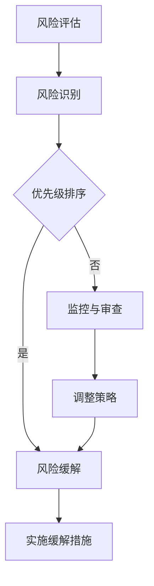

                 

### 文章标题：技术风险管理：识别和缓解潜在威胁

技术风险管理是现代IT行业中至关重要的一个环节，对于企业的发展和信息安全具有深远的影响。在数字化转型的浪潮中，技术的应用日益广泛，随之而来的技术风险也变得愈发复杂和多样化。因此，如何有效识别和缓解这些潜在威胁，成为每个企业不得不面对的挑战。本文将深入探讨技术风险管理的核心概念、识别与缓解方法，并借助实际案例，为读者提供实用的指导和建议。

### 文章关键词

- 技术风险管理
- 风险识别
- 风险缓解
- 安全漏洞
- 风险评估
- 风险缓解策略

### 文章摘要

本文首先介绍了技术风险管理的背景和重要性，随后详细阐述了技术风险管理的核心概念和流程。接着，文章聚焦于技术风险的识别方法，包括威胁建模和漏洞扫描等，并通过实例进行分析。在识别风险的基础上，文章进一步探讨了风险缓解的策略和措施，并利用伪代码和数学模型进行了详细解释。最后，通过实际项目案例，文章展示了技术风险管理的实战应用，并提出了未来发展的展望和最佳实践建议。

### 第1章 引言

技术风险管理，简而言之，就是对企业所采用的技术进行风险评估和管理，以识别和缓解潜在的技术威胁。在全球信息化和数字化迅速发展的背景下，技术已经成为企业运营和发展的核心驱动力。然而，技术的快速发展也带来了诸多风险，如安全漏洞、数据泄露、系统崩溃等，这些风险不仅影响企业的正常运营，甚至可能导致企业的声誉和财务损失。

### 1.1 技术风险管理的背景

随着云计算、物联网、人工智能等新兴技术的普及，企业对技术的依赖程度不断加深。然而，技术的复杂性和不确定性也使得技术风险管理的难度大幅提升。一方面，技术的发展速度远超过安全防护的更新速度，使得现有安全措施难以应对新的威胁；另一方面，技术的多样性和跨领域应用，使得风险识别和缓解变得更加复杂。因此，技术风险管理成为企业确保持续运营和发展的关键。

### 1.2 技术风险的特征

技术风险具有以下主要特征：

1. **不可预见性**：技术风险往往来自于技术的未知领域，难以提前预测。
2. **复杂性**：技术系统的复杂性使得风险难以全面识别和评估。
3. **跨领域性**：技术风险不仅局限于单一领域，可能会跨越多个领域产生连锁反应。
4. **累积性**：技术风险可能随着时间的推移逐渐累积，导致严重后果。
5. **可转移性**：通过合理的管理措施，技术风险可以转移或减轻。

### 1.3 技术风险管理的意义

技术风险管理的意义主要体现在以下几个方面：

1. **保障企业运营**：通过识别和缓解技术风险，确保企业的正常运营，减少停机时间和经济损失。
2. **提升安全防护**：加强技术风险管理，可以提升企业的安全防护水平，降低安全漏洞和黑客攻击的风险。
3. **降低法律风险**：遵守相关法规和标准，降低因违规操作导致的法律风险。
4. **增强竞争力**：通过有效的技术风险管理，提高企业的安全性和可靠性，增强市场竞争力。
5. **持续创新**：在风险管理的基础上，企业可以更加放心地探索和采用新技术，促进持续创新。

### 第2章 核心概念与联系

技术风险管理涉及多个核心概念，包括技术风险、风险管理和技术风险管理框架。理解这些概念之间的关系，有助于我们更好地把握技术风险管理的全貌。

### 2.1 技术风险的定义

技术风险是指由于技术系统的缺陷、故障或外部威胁等因素，导致系统无法正常运作或达到预期目标，进而对企业的运营、财务、声誉等方面产生负面影响的可能性。

### 2.2 风险管理的定义

风险管理是指通过识别、评估、优先排序、应对和监控风险，以确保企业实现既定的目标。风险管理不仅涉及技术风险，还涵盖其他各种类型的风险，如市场风险、财务风险等。

### 2.3 技术风险管理框架

技术风险管理框架是企业进行技术风险管理的系统性方法和工具。一个完整的技术风险管理框架通常包括以下步骤：

1. **风险评估**：识别和评估技术风险。
2. **风险优先级排序**：根据风险评估结果，确定风险的优先级。
3. **风险缓解**：制定和实施风险缓解措施。
4. **监控与审查**：持续监控风险，并根据实际情况调整风险缓解策略。

### 2.4 Mermaid流程图：技术风险管理的流程

以下是技术风险管理的流程Mermaid流程图：



### 第3章 识别技术风险

技术风险的识别是技术风险管理的第一步，也是至关重要的一步。有效的风险识别可以帮助企业提前预知潜在的威胁，从而采取相应的预防措施。以下是几种常见的技术风险识别方法。

### 3.1 技术风险的分类

根据技术风险的特征和来源，可以将技术风险分为以下几类：

1. **系统故障风险**：包括硬件故障、软件故障、系统崩溃等。
2. **安全漏洞风险**：包括系统漏洞、网络漏洞、应用漏洞等。
3. **数据泄露风险**：包括敏感数据泄露、未经授权的数据访问等。
4. **第三方依赖风险**：包括第三方服务提供商的故障或安全漏洞。
5. **技术演变风险**：包括技术过时、技术更新换代等。

### 3.2 技术风险识别方法

#### 3.2.1 威胁建模

威胁建模是一种通过系统化分析识别潜在威胁的方法。其步骤如下：

1. **确定系统边界**：明确需要保护的系统和数据范围。
2. **识别威胁源**：分析可能威胁系统的内外部因素。
3. **分析威胁行为**：识别威胁的具体行为和可能的影响。
4. **评估威胁可能性与影响**：根据威胁行为和系统实际情况，评估威胁的可能性和影响。

#### 3.2.2 漏洞扫描

漏洞扫描是一种通过自动化工具识别系统漏洞的方法。其步骤如下：

1. **选择漏洞扫描工具**：根据系统特点和需求选择合适的漏洞扫描工具。
2. **配置扫描参数**：设置扫描范围、扫描类型等参数。
3. **执行扫描**：运行漏洞扫描工具，收集系统漏洞信息。
4. **分析扫描结果**：对扫描结果进行分析，识别潜在风险。

#### 3.2.3 实例分析

以下是一个实际案例：

**案例背景**：某企业采用了一套复杂的分布式系统，包括多个服务器、数据库和中间件。由于系统复杂，企业担心可能存在安全漏洞和系统故障风险。

**识别方法**：

1. **威胁建模**：企业通过威胁建模，识别出可能威胁系统的内部和外部因素，如网络攻击、系统漏洞、硬件故障等。
2. **漏洞扫描**：使用漏洞扫描工具，对系统进行全面的漏洞扫描，发现多个潜在的安全漏洞。
3. **风险评估**：根据漏洞扫描结果和威胁建模分析，企业对漏洞进行风险评估，确定风险的优先级。

通过上述方法，企业成功识别了潜在的技术风险，并采取了相应的缓解措施。

### 第4章 缓解技术风险

在识别出技术风险后，下一步就是采取有效的缓解措施，以降低风险发生的概率和影响。以下是几种常见的技术风险缓解策略和措施。

#### 4.1 风险缓解策略

1. **预防措施**：通过改进系统设计、加强安全防护等手段，预防风险的发生。
2. **应急响应**：制定应急预案，以应对可能发生的风险事件。
3. **风险转移**：通过保险、合同约定等方式，将风险转移给第三方。
4. **风险接受**：对于无法避免或转移的风险，企业可以接受并制定相应的风险承受策略。

#### 4.2 风险缓解措施

1. **技术控制**：通过技术手段，降低风险发生的概率和影响，如使用防火墙、入侵检测系统等。
2. **管理控制**：通过管理手段，加强风险管理和监控，如制定安全政策、员工培训等。
3. **应急准备**：建立应急响应团队，制定应急预案，以快速响应风险事件。
4. **定期审查**：定期对系统进行安全审查，发现并修复潜在的风险。

#### 4.2.1 技术控制

技术控制是风险缓解的重要手段之一，以下是一些常见的技术控制措施：

1. **防火墙**：用于监控和控制进出网络的数据流量，防止未经授权的访问。
2. **入侵检测系统（IDS）**：用于监控网络活动，发现并报告潜在的攻击行为。
3. **加密技术**：用于保护数据在传输和存储过程中的安全性。
4. **安全补丁管理**：定期更新系统软件，修复已知漏洞。

#### 4.2.2 管理控制

管理控制是通过制度和流程来降低风险的发生概率和影响。以下是一些常见的管理控制措施：

1. **安全政策**：制定明确的安全政策，规范员工行为，确保系统安全。
2. **员工培训**：加强员工的安全意识，提高员工的技能水平。
3. **权限管理**：合理分配权限，确保员工只能访问其工作所需的数据和系统功能。
4. **审计与监控**：定期进行审计，监控系统运行状态，及时发现并处理异常情况。

#### 4.2.3 实例分析

以下是一个实际案例：

**案例背景**：某企业发现其内部系统存在多个潜在的安全漏洞，如未加密的敏感数据传输、未经授权的数据库访问等。

**缓解措施**：

1. **技术控制**：安装防火墙和入侵检测系统，加密敏感数据传输，定期更新系统补丁。
2. **管理控制**：制定安全政策，对员工进行安全培训，建立权限管理系统，定期进行安全审计。

通过上述措施，企业成功降低了系统的安全风险，确保了数据的保密性和完整性。

### 第5章 核心算法原理讲解

技术风险管理的核心在于风险评估和风险缓解。为了实现这一目标，我们需要运用一系列算法和数学模型。以下是核心算法原理的讲解。

#### 5.1 风险评估算法

风险评估是技术风险管理的第一步，其目的是评估技术风险的可能性和影响。以下是常用的量化风险评估模型：

##### 5.1.1 量化风险评估模型

量化风险评估模型通常包括以下三个关键要素：

1. **风险可能性（P）**：表示风险事件发生的概率。
2. **风险影响（C）**：表示风险事件发生对系统的负面影响。
3. **风险评估值（R）**：表示风险的综合评估结果，通常用风险可能性与风险影响的乘积表示。

数学公式如下：

$$
R = P \times C
$$

##### 5.1.2 伪代码：量化风险评估算法

```python
# 输入参数：风险可能性 P，风险影响 C
# 输出参数：风险评估值 R

def calculate_risk_assessment(P, C):
    R = P * C
    return R
```

#### 5.2 风险缓解算法

风险评估之后，我们需要采取风险缓解措施。风险缓解算法的目的是确定最佳的风险缓解策略，以最小化风险评估值。以下是一种常用的风险缓解策略优化算法：

##### 5.2.1 风险缓解策略优化算法

风险缓解策略优化算法通常包括以下步骤：

1. **确定风险缓解措施**：根据风险评估结果，确定需要采取的风险缓解措施。
2. **计算缓解效果**：为每个风险缓解措施计算缓解效果，通常用缓解效果指数表示。
3. **优化缓解策略**：使用优化算法（如遗传算法、模拟退火算法等），找到最佳的风险缓解策略。

##### 5.2.2 伪代码：风险缓解策略优化算法

```python
# 输入参数：缓解措施列表 Measures，评估结果列表 Assessments
# 输出参数：最佳缓解策略 BestStrategy

def optimize_risk_mitigation(Measures, Assessments):
    # 初始化策略集合 Strategies
    Strategies = generate_strategies(Measures)
    
    # 迭代优化策略
    while not converged:
        # 计算每个策略的评估结果
        Assessments = evaluate_strategies(Strategies)
        
        # 选择最佳策略
        BestStrategy = select_best_strategy(Strategies, Assessments)
        
        # 更新策略集合
        Strategies = update_strategies(Strategies, BestStrategy)
        
        # 检查收敛条件
        converged = check_convergence(Strategies)
    
    return BestStrategy
```

### 第6章 数学模型和数学公式

在技术风险管理中，数学模型和数学公式是评估和缓解风险的重要工具。以下将详细介绍风险评估和风险缓解的数学模型，以及具体的公式和详细解释。

#### 6.1 风险评估的数学模型

风险评估的数学模型主要涉及风险可能性、风险影响和风险评估值之间的关系。以下是一个基本的数学模型：

$$
R = P \times C
$$

其中：

- \( R \)：风险评估值，表示风险的综合评估结果。
- \( P \)：风险可能性，表示风险事件发生的概率。
- \( C \)：风险影响，表示风险事件发生对系统的负面影响。

##### 6.1.1 详细讲解

该公式表明，风险评估值是风险可能性和风险影响的乘积。风险可能性反映了风险事件发生的概率，而风险影响则反映了风险事件发生对系统的潜在危害。通过计算风险评估值，可以量化风险的程度，为后续的风险缓解措施提供依据。

##### 6.1.2 举例说明

假设一个系统的安全漏洞风险可能发生概率为0.3，一旦发生将导致系统完全崩溃，影响程度为100。根据上述公式，可以计算出该漏洞风险的风险评估值为：

$$
R = 0.3 \times 100 = 30
$$

这意味着该漏洞风险对系统的潜在影响程度为30。

#### 6.2 风险缓解的数学模型

风险缓解的数学模型主要关注缓解措施对风险评估值的影响。以下是一个简单但实用的风险缓解模型：

$$
C' = C - \alpha \times R
$$

其中：

- \( C' \)：风险缓解后的影响值，表示采取缓解措施后的风险影响。
- \( C \)：风险影响值，表示未采取缓解措施时的风险影响。
- \( \alpha \)：缓解效果指数，表示缓解措施对风险影响的减弱程度。
- \( R \)：风险评估值，表示风险的综合评估结果。

##### 6.2.1 详细讲解

该公式表明，风险缓解后的影响值是原始风险影响值减去缓解效果指数乘以风险评估值。缓解效果指数反映了缓解措施对风险影响的减弱程度，值越大，表示缓解效果越好。

##### 6.2.2 举例说明

假设一个系统的数据泄露风险原始影响值为100，缓解效果指数为0.5。根据上述公式，可以计算出该风险缓解后的影响值为：

$$
C' = 100 - 0.5 \times R
$$

如果风险评估值为50，那么缓解后的影响值为：

$$
C' = 100 - 0.5 \times 50 = 50
$$

这意味着采取缓解措施后，该风险的影响值降低了一半，从100降至50。

### 第7章 项目实战

通过前面的理论讲解，我们已经对技术风险管理有了全面的理解。接下来，我们将通过一个实际项目案例，展示技术风险管理在真实场景中的应用。

#### 7.1 技术风险管理项目案例

**项目背景**：某大型电商企业计划上线一项新的购物体验功能，以提高用户满意度和市场份额。然而，这一新功能的引入可能带来一定的技术风险，如系统崩溃、数据泄露等。为了确保项目的顺利进行，企业决定进行技术风险管理。

**项目目标**：

1. 识别潜在的技术风险。
2. 评估风险的可能性和影响。
3. 制定并实施风险缓解措施。
4. 监控项目进展，确保风险管理策略的有效性。

**开发环境搭建**：

1. **硬件环境**：配置高性能服务器和存储设备，确保系统稳定运行。
2. **软件环境**：选择合适的服务器操作系统、数据库管理系统和开发框架。
3. **安全工具**：安装防火墙、入侵检测系统、加密工具等安全防护软件。

**源代码实现**：

1. **需求分析**：明确新购物体验功能的需求和功能模块。
2. **系统设计**：设计系统架构，包括前端、后端、数据库等。
3. **编码实现**：根据系统设计文档，编写源代码，实现各功能模块。
4. **安全防护**：在编码过程中，加强安全防护措施，如加密敏感数据、防止SQL注入等。

**代码解读与分析**：

以下是项目中的一个关键模块——用户身份验证的代码片段：

```python
def verify_password(username, password):
    # 检查用户名是否合法
    if not validate_username(username):
        return False
    
    # 从数据库查询用户信息
    user = get_user_from_db(username)
    
    # 校验密码
    if not validate_password(password, user['password']):
        return False
    
    # 记录登录日志
    log_login_success(username)
    
    return True
```

**代码分析**：

1. **用户名验证**：通过`validate_username`函数检查用户名是否合法。
2. **密码验证**：通过`validate_password`函数校验输入的密码与数据库中存储的密码是否匹配。
3. **登录日志**：通过`log_login_success`函数记录登录成功的日志，便于后续监控和分析。

**实际案例分析和详细讲解剖析**：

**案例**：在项目上线初期，用户反馈购物体验功能存在登录异常问题，部分用户无法正常登录。

**分析**：

1. **日志分析**：通过登录日志发现，部分登录异常是由于用户名和密码错误导致的。
2. **数据库检查**：检查数据库中的用户信息，发现部分用户密码存储格式不一致，存在安全隐患。
3. **代码检查**：检查用户身份验证代码，发现存在密码校验逻辑漏洞，可能导致暴力破解攻击。

**解决方案**：

1. **改进密码验证逻辑**：优化密码验证逻辑，增加密码复杂度要求，防止用户名和密码错误。
2. **统一密码存储格式**：修改数据库中密码存储格式，确保所有用户密码采用相同的安全存储方式。
3. **增加安全防护措施**：在用户身份验证过程中，增加安全防护措施，如验证码、锁定账户等。

**项目小结**：

通过技术风险管理，企业成功识别并缓解了新功能上线可能带来的技术风险，确保了项目的顺利进行。在项目开发过程中，严格遵循安全开发和测试流程，及时发现并修复潜在的安全漏洞，为用户提供了一个安全可靠的购物体验。

### 第8章 未来展望

随着技术的不断进步和应用的深入，技术风险管理也面临着新的挑战和机遇。以下是未来技术风险管理的发展趋势、面临的挑战以及未来的发展方向。

#### 8.1 技术风险管理发展趋势

1. **自动化和智能化**：随着人工智能和自动化技术的发展，技术风险管理将更加自动化和智能化，通过机器学习和大数据分析，实现对风险的前瞻性预测和实时监控。
2. **全面风险管理**：技术风险管理将不再局限于单一的技术领域，而是与企业的全面风险管理相结合，从整体层面进行风险评估和管理。
3. **合规性和标准化**：随着法规和标准的不断完善，技术风险管理将更加注重合规性和标准化，确保企业遵守相关法规和行业标准。
4. **跨领域合作**：技术风险管理将涉及更多的跨领域合作，如与网络安全、数据隐私保护等领域的专家合作，共同应对复杂的技术风险。

#### 8.2 面临的挑战

1. **技术复杂性**：技术的快速发展和复杂性的增加，使得技术风险管理的难度加大，如何有效地识别和管理复杂的技术风险成为一大挑战。
2. **数据隐私和安全**：随着数据价值的提升，数据隐私和安全问题日益突出，如何在保障数据隐私的同时，实现技术风险的有效管理，是亟待解决的问题。
3. **法律法规的完善**：随着技术的不断演进，现有的法律法规可能无法完全覆盖新兴技术领域的风险，如何完善相关法律法规，成为技术风险管理的重要挑战。

#### 8.3 未来发展方向

1. **技术创新**：持续关注和引入新技术，如区块链、量子计算等，以提升技术风险管理的效率和准确性。
2. **人才培养**：加强技术风险管理专业人才的培养，提高其风险识别和应对能力。
3. **合作与共享**：推动跨行业、跨领域的合作与共享，共同应对复杂的技术风险。
4. **持续改进**：建立完善的技术风险管理机制，持续改进风险管理流程和方法，以适应不断变化的技术环境。

### 附录

#### 附录 A: 技术风险管理工具与资源

**A.1 风险评估工具**

1. **OWASP ZAP**：一款开源的网络应用安全扫描工具，支持自动化的漏洞扫描和手动测试。
2. **Nessus**：一款广泛使用的漏洞扫描工具，提供丰富的漏洞库和报告功能。
3. **Qualys**：一款云基础架构安全解决方案，提供全面的漏洞管理和合规性检查。

**A.2 风险缓解工具**

1. **Snort**：一款开源的网络入侵检测系统，能够实时检测和响应网络攻击。
2. **防火墙**：包括硬件防火墙和软件防火墙，用于监控和控制网络流量。
3. **加密工具**：如SSL加密、AES加密等，用于保护数据的安全传输。

### 作者信息

- 作者：AI天才研究院/AI Genius Institute & 禅与计算机程序设计艺术 /Zen And The Art of Computer Programming

