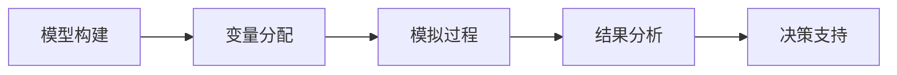
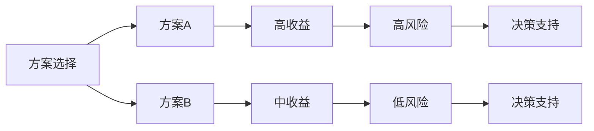

                 

### 引言

在信息技术飞速发展的今天，技术风险评估与管理已成为现代企业中不可或缺的一环。技术风险可能源自技术本身的不确定性、外部环境的变化，或是在项目实施过程中出现的各种挑战。因此，如何有效识别、评估和管理技术风险，已成为决定项目成败的关键因素。

**技术风险评估**，是指识别和评估项目中潜在的技术风险，并通过定性和定量分析，将其转化为可管理的风险。其重要性体现在以下几个方面：

1. **确保项目成功**：通过技术风险评估，可以提前识别项目中的潜在问题，制定有效的应对策略，从而确保项目的顺利实施和成功交付。
2. **优化资源分配**：技术风险评估有助于企业优化资源分配，避免因风险而导致的资源浪费。
3. **增强决策支持**：风险评估提供了科学依据，帮助企业做出更明智的决策，降低因决策失误带来的风险。
4. **提升项目管理水平**：通过技术风险评估，企业可以提升项目管理水平，提高项目成功率，增强企业的竞争力。

本文将详细探讨技术风险评估与管理的方法、框架和实际应用。首先，我们将介绍风险评估的定义和重要性，然后逐步展开对风险评估框架、风险识别、量化与评估、风险应对策略、风险管理实践以及未来发展趋势的深入分析。

### 风险评估的基本概念

风险评估是一个系统化的过程，旨在识别、分析和评价项目中可能出现的风险。这一过程通常包括以下几个基本概念：

1. **风险识别**：风险识别是风险评估的第一步，旨在识别项目中的潜在风险。这可以通过历史数据分析、专家评审、头脑风暴等方法实现。

2. **风险评估**：在识别出潜在风险后，风险评估过程进一步分析这些风险的可能性和影响。这可能涉及到定性和定量分析，如使用概率分布、期望损失等量化指标。

3. **风险优先级排序**：通过评估过程，可以确定哪些风险是关键风险，哪些风险相对较小。这种优先级排序有助于资源优化和风险应对策略的制定。

4. **风险应对策略**：根据风险优先级排序，企业需要制定相应的风险应对策略。这包括风险规避、风险转移、风险减轻和风险接受等策略。

5. **监控与更新**：风险评估是一个持续的过程，需要定期监控和更新。随着项目的推进和环境的变化，新的风险可能会出现，原有的风险也可能发生变化。

### 风险评估的发展历程与现状

风险评估作为一门学科，其发展历程可以追溯到20世纪中叶。最初的风险评估主要集中在定性分析，如风险识别和初步的评估。随着信息技术和数学模型的不断发展，风险评估方法逐渐从定性分析转向定量分析，如概率分布、期望损失等量化指标的应用。

20世纪80年代，蒙特卡罗模拟、决策树等复杂的风险评估模型逐渐被引入到风险评估中，使得风险评估更加科学和准确。进入21世纪，随着大数据、人工智能等技术的兴起，风险评估方法和技术得到了进一步的发展。例如，通过机器学习算法，可以自动识别和分析大量数据中的潜在风险。

当前，风险评估在各个领域都得到了广泛应用。在信息技术领域，风险评估已成为确保项目成功的关键环节。在金融、医疗、工程等领域，风险评估也是保障项目顺利实施的重要手段。此外，随着全球化和市场竞争的加剧，企业对风险评估的重视程度不断提高，风险评估已成为企业风险管理的重要组成部分。

### 风险评估与管理的基本概念

在深入探讨技术风险评估与管理之前，有必要明确几个关键概念，包括风险识别、风险评估、风险优先级排序、风险应对策略和监控与更新。

1. **风险识别**：风险识别是风险评估的基础环节。它旨在识别项目或系统中可能存在的各种风险。风险识别可以通过以下几种方法实现：
   - **历史数据分析**：通过分析以往项目中的风险记录，识别类似项目中可能出现的新风险。
   - **专家评审**：邀请领域专家或相关利益相关者参与，通过他们的专业知识和经验来识别潜在风险。
   - **头脑风暴**：组织团队成员开展头脑风暴会议，共同探讨可能的风险点。
   - **问卷调查**：通过设计问卷，收集团队成员的意见和建议，从而识别潜在风险。

2. **风险评估**：风险评估是在风险识别之后，对已识别的风险进行详细分析和评估的过程。风险评估通常包括以下步骤：
   - **定性分析**：通过风险的概率和影响矩阵，对风险进行初步定性评估。这种方法简单直观，适用于初步筛选高风险。
   - **定量分析**：使用数学模型和算法，对风险进行量化评估。例如，使用蒙特卡罗模拟、期望损失等指标，进行详细的定量分析。
   - **综合评估**：将定性分析和定量分析的结果结合起来，形成一个全面的风险评估报告。

3. **风险优先级排序**：通过风险评估，可以确定哪些风险对项目或系统的影响最大，哪些风险相对较小。风险优先级排序有助于资源的优化配置和风险应对策略的制定。通常，风险优先级排序可以通过以下方法实现：
   - **风险矩阵**：使用风险矩阵，根据风险的可能性和影响，对风险进行排序。
   - **决策树**：使用决策树，根据不同风险的条件和结果，进行风险优先级的排序。
   - **评分模型**：设计评分模型，根据不同风险的特点，给出风险得分，从而进行排序。

4. **风险应对策略**：根据风险优先级排序，企业需要制定相应的风险应对策略。常见的风险应对策略包括：
   - **风险规避**：通过改变项目计划或策略，避免风险的暴露。
   - **风险转移**：通过合同或保险等手段，将风险转移给第三方。
   - **风险减轻**：采取预防措施，减少风险的发生概率或影响程度。
   - **风险接受**：在风险概率和影响较小的情况下，选择接受风险。

5. **监控与更新**：风险评估是一个动态的过程，需要定期监控和更新。随着项目的推进和环境的变化，新的风险可能会出现，原有的风险也可能发生变化。监控与更新的目的是：
   - **确保风险信息的及时性**：通过定期监控，确保风险评估报告中的信息是最新的。
   - **识别新风险**：通过监控，可以及时发现新的风险，并纳入风险评估中。
   - **调整风险应对策略**：根据监控结果，调整原有的风险应对策略，确保其有效性。

通过明确这些基本概念，企业可以更有效地进行技术风险评估与管理，从而确保项目的成功实施。

### 技术风险评估框架

技术风险评估框架是评估技术项目风险的重要工具。一个完善的风险评估框架应该包括风险识别、风险评估、风险优先级排序和风险应对策略等环节。以下将详细介绍这些环节及其具体方法。

#### 风险识别

风险识别是风险评估的第一步，旨在识别项目中可能出现的各种风险。以下是几种常用的风险识别方法：

1. **历史数据分析**：通过分析以往项目中的风险记录，识别类似项目中可能出现的新风险。这种方法有助于积累经验，避免重复犯同样的错误。
   
2. **专家评审**：邀请领域专家或相关利益相关者参与，通过他们的专业知识和经验来识别潜在风险。专家评审可以提供深刻的见解，有助于发现隐藏的风险。

3. **头脑风暴**：组织团队成员开展头脑风暴会议，共同探讨可能的风险点。这种方法有助于集合不同人的智慧，全面识别风险。

4. **问卷调查**：通过设计问卷，收集团队成员的意见和建议，从而识别潜在风险。问卷调查可以量化风险，为后续的评估提供数据支持。

#### 风险评估

在识别出潜在风险后，需要对风险进行详细分析和评估。风险评估包括定性分析和定量分析两种方法：

1. **定性分析**：
   - **风险矩阵**：使用风险矩阵，根据风险的概率和影响，对风险进行初步定性评估。风险矩阵通常包括高、中、低三个等级。
   - **专家评审**：邀请专家对风险进行评分，根据评分结果确定风险的优先级。

2. **定量分析**：
   - **概率分布**：通过分析风险的概率分布，评估风险的发生概率。常用的概率分布方法包括正态分布、二项分布等。
   - **期望损失**：计算每个风险的期望损失，即风险发生的概率乘以其影响程度。期望损失有助于确定高风险。

#### 风险优先级排序

通过风险评估，可以确定哪些风险对项目的影响最大。风险优先级排序有助于资源优化和风险应对策略的制定。以下是一些常用的风险优先级排序方法：

1. **风险矩阵**：使用风险矩阵，根据风险的可能性和影响，对风险进行排序。这种方法简单直观，适用于初步筛选高风险。

2. **决策树**：使用决策树，根据不同风险的条件和结果，进行风险优先级的排序。决策树可以帮助分析复杂的风险，并确定优先处理的风险。

3. **评分模型**：设计评分模型，根据不同风险的特点，给出风险得分，从而进行排序。评分模型可以量化风险，提高排序的准确性。

#### 风险应对策略

根据风险优先级排序，企业需要制定相应的风险应对策略。以下是一些常见的风险应对策略：

1. **风险规避**：通过改变项目计划或策略，避免风险的暴露。例如，选择成熟的技术方案，避免使用未知的技术。

2. **风险转移**：通过合同或保险等手段，将风险转移给第三方。例如，与供应商签订严格的合同，确保在出现问题时由供应商承担相应的责任。

3. **风险减轻**：采取预防措施，减少风险的发生概率或影响程度。例如，进行充分的测试和验证，确保软件的质量。

4. **风险接受**：在风险概率和影响较小的情况下，选择接受风险。这种方法适用于低优先级的风险，或者企业资源有限的情况。

通过以上方法，企业可以构建一个完善的技术风险评估框架，从而有效识别和管理技术风险，确保项目的顺利实施。

### 风险识别

风险识别是技术风险评估中的关键环节，旨在识别项目中可能出现的各种风险。通过有效的风险识别，企业可以提前预见潜在问题，制定相应的应对策略，从而降低风险对项目的负面影响。以下将介绍几种常用的风险识别方法及其具体应用。

#### 历史数据分析

历史数据分析是一种基于过去项目数据的风险识别方法。通过对以往项目中的风险记录进行分析，可以识别出类似项目中可能出现的风险。具体步骤如下：

1. **数据收集**：收集以往项目中的风险记录、项目报告和经验总结等资料。
2. **数据整理**：整理数据，提取关键信息，如风险类型、发生频率、影响程度等。
3. **数据分析**：分析数据，识别出类似项目中可能出现的风险。例如，通过分析以往项目中频繁出现的技术风险，可以预见新项目中可能遇到的技术问题。

#### 专家评审

专家评审是一种基于专家知识和经验的识别方法。通过邀请领域专家或相关利益相关者参与，可以充分利用他们的专业知识和经验，识别潜在风险。具体步骤如下：

1. **专家邀请**：邀请相关领域的专家，包括项目经理、技术专家、质量保证专家等。
2. **头脑风暴**：组织专家进行头脑风暴会议，讨论项目中可能出现的风险。
3. **专家评分**：专家根据各自的专业知识和经验，对识别出的风险进行评分，确定其优先级。

#### 头脑风暴

头脑风暴是一种集体讨论的方法，通过团队成员的共同参与，可以广泛地识别出项目中的潜在风险。具体步骤如下：

1. **会议组织**：组织团队成员参加头脑风暴会议，确保涵盖项目的各个方面。
2. **自由讨论**：在会议中，鼓励团队成员自由发言，提出他们认为可能存在的风险。
3. **记录和整理**：记录和整理会议讨论的内容，提取出潜在的风险点。

#### 问卷调查

问卷调查是一种量化的识别方法，通过设计问卷，可以系统性地收集团队成员的意见和建议，从而识别潜在风险。具体步骤如下：

1. **问卷设计**：设计针对项目风险调查的问卷，包括开放性和封闭性题目。
2. **问卷发放**：将问卷发放给项目团队成员和相关利益相关者，收集他们的意见。
3. **数据分析**：对收集到的问卷进行分析，提取出潜在的风险点。

#### 实例分析：某企业技术风险识别实践

以下是一个某企业技术风险识别的实例，通过上述方法，企业有效地识别出项目中的潜在风险。

1. **历史数据分析**：企业通过分析以往项目中的风险记录，识别出技术风险、项目延期、预算超支等常见问题。
2. **专家评审**：企业邀请领域专家进行评审，根据专家的意见，进一步确认和补充潜在风险。
3. **头脑风暴**：组织项目团队成员进行头脑风暴，共同识别项目中的潜在风险，如技术难题、人员流失等。
4. **问卷调查**：设计并发放问卷，收集团队成员的意见，进一步确认和量化潜在风险。

通过以上方法，企业全面识别出项目中的潜在风险，为后续的风险评估和应对策略制定提供了基础。

### 风险量化与评估

在技术风险评估中，风险量化与评估是关键步骤，它帮助将潜在风险转化为可操作的数据，从而指导风险应对策略的制定。风险量化与评估通常包括定量分析和定性分析两种方法，以下将详细介绍这些方法以及其实际应用。

#### 定量分析

定量分析是一种通过数学模型和算法对风险进行量化的方法。它能够提供具体的数据支持，以便更准确地评估风险的影响和可能性。以下是一些常用的定量分析方法：

1. **概率分布**：
   - **正态分布**：正态分布常用于评估风险发生的概率。例如，假设某软件项目的某个模块失败的概率服从正态分布，通过计算正态分布的均值和标准差，可以评估该模块的可靠性。
   - **二项分布**：二项分布适用于评估离散事件的风险。例如，假设在某个软件开发过程中，每次代码审查发现缺陷的概率为0.2，通过二项分布可以计算在5次审查中至少发现一个缺陷的概率。

2. **期望损失**：
   - **期望损失计算**：期望损失是指风险发生的概率乘以其可能造成的损失。例如，假设某技术风险的发生概率为0.3，造成的损失为100万元，则该风险的期望损失为0.3 * 100万元 = 30万元。通过计算多个风险的期望损失，可以确定哪些风险对项目的影响最大。
   - **累积期望损失**：累积期望损失是指多个风险累积起来的总损失。例如，通过计算不同风险的期望损失，可以确定项目总体风险水平。

3. **蒙特卡罗模拟**：
   - **蒙特卡罗模拟**：蒙特卡罗模拟是一种基于概率模型的数值模拟方法，用于评估风险的概率分布和期望损失。例如，在软件项目开发中，可以使用蒙特卡罗模拟来评估项目完成时间的不确定性，从而确定项目的风险。

#### 定性分析

定性分析是一种通过主观判断和经验对风险进行评估的方法。它通常用于初步识别和评估风险，或者作为定量分析的补充。以下是一些常用的定性分析方法：

1. **风险矩阵**：
   - **风险矩阵**：风险矩阵是一种常用的定性分析方法，它通过风险的可能性和影响两个维度对风险进行评估。例如，使用一个3x3的风险矩阵，可以将风险分为高、中、低三个等级。
   - **评估过程**：在评估过程中，专家根据风险的可能性和影响，将其定位到风险矩阵的相应位置，从而确定风险的优先级。

2. **决策树**：
   - **决策树**：决策树是一种用于评估不同决策路径的定性和定量方法的组合。例如，在软件项目中，可以使用决策树来评估不同技术方案的风险和收益。
   - **评估过程**：在评估过程中，专家根据不同决策路径的概率和收益，构建决策树，从而确定最佳决策。

#### 实际应用

以下是一个实际应用案例，说明如何使用定量分析和定性分析进行技术风险评估：

1. **风险识别**：通过历史数据分析和专家评审，识别出项目中可能存在的五个技术风险。
2. **定量分析**：
   - **概率分布**：使用正态分布评估每个风险的失败概率，计算每个风险的期望损失。
   - **蒙特卡罗模拟**：使用蒙特卡罗模拟评估项目总体完成时间的不确定性，计算累积期望损失。
3. **定性分析**：
   - **风险矩阵**：根据风险的可能性和影响，使用风险矩阵评估每个风险的优先级。
   - **决策树**：构建决策树，评估不同风险应对策略的收益和风险。

通过定量分析和定性分析的结合，企业可以全面、准确地评估技术风险，为项目管理和决策提供科学依据。

### 风险评估模型应用

在技术风险评估中，选择合适的评估模型对于提高评估结果的准确性和实用性至关重要。以下介绍几种常用的风险评估模型，包括蒙特卡罗模拟、决策树和风险矩阵，并探讨其具体应用方法。

#### 蒙特卡罗模拟

蒙特卡罗模拟是一种基于概率和统计的数值模拟方法，常用于评估项目的不确定性和风险。其基本原理是通过大量的随机抽样，模拟项目在各种不确定性条件下的可能结果，从而计算风险的概率分布和期望损失。

**应用方法**：
1. **模型构建**：首先，定义项目中的关键变量和参数，如项目完成时间、成本等。然后，为每个变量分配概率分布，如正态分布、三角分布等。
2. **模拟过程**：使用随机数生成器，对每个变量进行随机抽样，构建多个项目模拟结果。
3. **结果分析**：通过分析模拟结果，计算项目完成时间的概率分布和期望损失。例如，可以计算项目延迟的概率，以及最大延迟时间和最小完成时间等。

**实例**：假设一个软件开发项目，其开发时间服从正态分布，均值为120天，标准差为15天。通过蒙特卡罗模拟，可以计算项目延迟的概率和期望延迟时间。



#### 决策树

决策树是一种直观、易理解的决策支持工具，通过树形结构展示不同决策路径和相应的风险与收益。决策树适用于评估多个决策变量和条件下的风险。

**应用方法**：
1. **构建决策树**：首先，定义项目的决策变量和条件。例如，是否采用新技术、是否增加预算等。然后，根据不同条件生成决策树。
2. **风险与收益评估**：为每个决策路径分配风险和收益，计算总体风险和收益。
3. **决策支持**：通过决策树分析，确定最佳决策路径。

**实例**：假设项目有两种开发方案，方案A采用新技术，风险较高；方案B采用传统技术，风险较低。通过决策树，可以评估不同方案的风险和收益。



#### 风险矩阵

风险矩阵是一种基于概率和影响的二维矩阵，用于评估和排序风险。风险矩阵通常包括高、中、低三个等级，分别代表风险的可能性（概率）和影响（影响程度）。

**应用方法**：
1. **构建风险矩阵**：首先，定义风险的可能性和影响等级。然后，根据风险评估结果，将风险填入风险矩阵。
2. **风险排序**：通过风险矩阵，对风险进行排序，确定高风险、中风险和低风险。
3. **风险应对**：根据风险排序，制定相应的风险应对策略。

**实例**：假设项目中有五个技术风险，通过专家评审，确定每个风险的可能性和影响等级。然后，使用风险矩阵评估和排序这些风险。

```mermaid
gantt
    dateFormat  YYYY-MM-DD
    title 风险评估流程
    A1[模型构建] :start||2023-04-01
    A2[变量分配] :safter A1 1d
    A3[模拟过程] :safter A2 3d
    A4[结果分析] :safter A3 2d
    A5[决策支持] :safter A4 1d
```

通过上述风险评估模型的应用，企业可以更科学地识别、评估和管理技术风险，为项目的顺利实施提供有力支持。

### 案例研究：某项目技术风险评估实例

为了更好地理解技术风险评估的实施过程，我们将通过一个实际案例来详细分析某项目的技术风险评估过程。以下将描述项目的背景、风险评估的具体步骤以及最终的风险评估结果。

#### 项目背景

某企业计划开发一款企业级客户关系管理（CRM）系统。该系统旨在帮助企业管理客户信息、销售机会和客户互动，以提高销售效率和客户满意度。项目的主要目标是在六个月内完成系统的开发并投入使用。

#### 风险识别

在项目启动阶段，首先进行风险识别，以识别可能影响项目成功的关键风险。以下是识别出的主要风险：

1. **技术风险**：由于CRM系统涉及多个复杂的模块，包括客户管理、销售管理、客户支持等，因此技术实现的难度较高，可能存在技术难题。
2. **人员风险**：项目团队可能面临人员流失、技能不足或沟通不畅等挑战。
3. **时间风险**：项目时间安排紧张，可能导致项目延期。
4. **预算风险**：预算不足可能导致关键功能无法实现，或需要额外投入。
5. **市场风险**：市场环境变化可能导致客户需求发生变化，影响项目成果的市场接受度。

#### 风险评估

在识别出风险后，对每个风险进行详细评估，以确定其可能性和影响程度。以下是评估过程：

1. **定性评估**：
   - 使用风险矩阵对每个风险进行初步评估。例如，技术风险的可能性为高，影响程度为中等。
   - 专家评审进一步确认风险评估结果，并根据专家意见进行调整。

2. **定量评估**：
   - 对技术风险进行定量分析，使用概率分布和期望损失计算方法，确定每个风险的概率和期望损失。
   - 使用蒙特卡罗模拟评估项目整体完成时间和成本的不确定性。

3. **综合评估**：
   - 结合定性评估和定量评估结果，确定每个风险的优先级。例如，技术风险被确定为最高优先级。

#### 风险应对策略

根据风险评估结果，制定相应的风险应对策略：

1. **技术风险**：
   - 采取预防措施，确保技术实现的可行性，如进行充分的需求分析和系统设计。
   - 增加技术储备，确保在遇到技术难题时，有足够的人力和资源应对。

2. **人员风险**：
   - 加强团队建设，提高团队凝聚力和沟通效率。
   - 提供培训，提高团队成员的技能水平。

3. **时间风险**：
   - 优化项目时间安排，确保关键路径上的任务按时完成。
   - 设置缓冲时间，以应对不可预见的时间延迟。

4. **预算风险**：
   - 进行详细的成本预算和资金安排，确保预算充足。
   - 预留一定的预算弹性，以应对额外的开支。

5. **市场风险**：
   - 进行市场调研，了解客户需求和市场竞争状况。
   - 根据市场反馈，及时调整项目计划和需求。

#### 风险评估结果

通过上述评估和应对策略，项目最终的风险评估结果如下：

1. **技术风险**：经过技术储备和预防措施，技术风险得到了有效控制，已降至中等水平。
2. **人员风险**：通过团队建设和培训，人员流失和技能不足的风险得到了缓解。
3. **时间风险**：通过时间安排和缓冲时间，项目延期风险降至较低水平。
4. **预算风险**：通过详细的预算安排和弹性预算，预算风险得到控制。
5. **市场风险**：通过市场调研和及时调整，市场风险降至可接受范围。

#### 总结

通过技术风险评估，项目团队能够提前识别和应对潜在风险，从而提高项目的成功概率。此案例展示了技术风险评估的实际应用，并强调了风险评估在项目管理和决策中的重要性。

```mermaid
gantt
    dateFormat  YYYY-MM-DD
    title 技术风险评估流程
    A1[项目启动] :start||2023-01-01
    A2[风险识别] :safter A1 1d
    A3[风险评估] :safter A2 2d
    A4[风险应对策略] :safter A3 3d
    A5[项目执行] :safter A4 1d
    A6[风险监控与更新] :safter A5 2d
    A7[项目完成] :safter A6 1d
```

### 技术风险应对策略

在识别和评估了技术风险后，企业需要制定相应的风险应对策略，以确保项目的顺利进行。这些策略主要包括风险规避、风险转移、风险减轻和风险接受。以下将详细介绍这些策略及其具体应用。

#### 风险规避

风险规避是指通过调整项目计划或策略，避免风险的暴露。这种方法适用于风险发生的可能性较高且影响较大的情况。以下是一些风险规避的常见策略：

1. **调整项目计划**：在项目启动阶段，通过对项目计划的调整，避免高风险活动的实施。例如，选择成熟的技术方案，避免使用未知或高风险的技术。
2. **改变需求**：在项目需求分析阶段，通过调整项目需求，避免引入高风险的功能点。例如，可以将某些复杂的功能模块分解为更简单的小模块，逐步实现。
3. **预防措施**：在项目实施过程中，采取预防措施，减少风险的发生概率。例如，进行充分的测试和验证，确保软件的质量。

#### 风险转移

风险转移是指通过合同或保险等手段，将风险转移给第三方。这种方法适用于企业无法避免或不愿承担风险的情况。以下是一些风险转移的常见策略：

1. **合同条款**：在合同中明确约定各方承担的风险，例如，将某些技术风险或质量风险转移给供应商或承包商。
2. **保险**：购买保险，将项目风险转移给保险公司。例如，可以购买项目保险、质量保险等，以应对不可预见的风险。
3. **合作伙伴**：与具备相关风险承担能力的合作伙伴合作，共同承担风险。例如，选择具有丰富经验的合作伙伴，共同承担项目的技术风险。

#### 风险减轻

风险减轻是指通过采取预防措施，减少风险的发生概率或影响程度。这种方法适用于风险发生的可能性较高但影响可控的情况。以下是一些风险减轻的常见策略：

1. **增加测试和验证**：通过增加测试和验证，确保项目质量和稳定性。例如，进行功能测试、性能测试和安全测试等，以减少技术风险。
2. **培训和教育**：提高团队成员的技能和知识水平，减少人为错误和操作失误。例如，定期组织培训，提升团队成员的技术能力和风险管理意识。
3. **备份和恢复**：建立备份和恢复机制，以应对可能的数据丢失或系统故障。例如，定期备份项目文件和数据库，并制定详细的恢复计划。

#### 风险接受

风险接受是指在企业资源有限或无法有效规避、转移或减轻风险的情况下，选择接受风险。这种方法适用于风险发生的可能性较低或影响较小的情况。以下是一些风险接受的常见策略：

1. **风险监测**：通过持续监测和评估风险，确保在风险发生时能够及时采取措施。例如，定期检查项目进度和质量，及时发现潜在问题。
2. **应急计划**：制定应急计划，以应对可能的风险。例如，在项目计划中预留一定的缓冲时间和预算，以应对不可预见的问题。
3. **文档记录**：详细记录风险情况和应对措施，以便在类似情况发生时参考。例如，记录项目中的风险识别、评估和应对过程，形成项目文档。

通过以上风险应对策略，企业可以有效地管理和控制技术风险，确保项目的顺利进行和成功交付。

### 技术风险管理实践

技术风险管理的实践不仅需要理论上的指导，更需要具体的方法和工具来实施。以下将介绍技术风险管理的实际操作过程，包括风险管理组织架构、流程与制度以及风险管理工具的应用。

#### 风险管理组织架构

1. **风险管理委员会**：在企业内部设立风险管理委员会，由高层管理人员、项目经理、技术专家和质量保证专家组成。风险管理委员会负责制定风险管理策略，监督和评估风险管理的实施情况。
2. **风险管理团队**：设立专门的风险管理团队，负责日常的风险识别、评估和监控工作。团队成员应包括项目经理、风险管理专家、质量保证工程师等。
3. **跨部门协作**：技术风险管理涉及多个部门，如开发、测试、运维等。因此，需要建立跨部门协作机制，确保风险信息的及时传递和资源共享。

#### 风险管理流程与制度

1. **风险识别**：风险管理流程的第一步是识别项目中的潜在风险。可以通过历史数据分析、专家评审、头脑风暴和问卷调查等方法进行风险识别。
2. **风险评估**：在识别出风险后，进行风险评估，包括定性评估和定量评估。定性评估可以使用风险矩阵和决策树等方法，定量评估可以使用概率分布和蒙特卡罗模拟等工具。
3. **风险优先级排序**：根据风险评估结果，对风险进行优先级排序，确定高风险、中风险和低风险，并制定相应的应对策略。
4. **风险应对**：根据风险优先级，实施相应的风险应对策略，如风险规避、风险转移、风险减轻和风险接受。
5. **风险监控与更新**：在项目实施过程中，持续监控和更新风险信息，确保风险管理策略的有效性。定期进行风险评估，调整风险应对策略。

#### 风险管理工具

1. **风险管理软件**：使用专业的风险管理软件，如Risk Management Studio、OpenRisk等，可以提高风险管理的效率。这些软件提供风险识别、评估、监控和报告等功能。
2. **项目管理工具**：集成风险管理功能的项目管理工具，如Jira、Trello等，可以帮助团队更好地进行风险管理和项目进度跟踪。
3. **自动化测试工具**：自动化测试工具，如Selenium、JUnit等，可以用于测试软件的质量，减少技术风险。通过自动化测试，可以及时发现和修复软件中的缺陷。
4. **监控与报警工具**：使用监控与报警工具，如Nagios、Zabbix等，可以实时监控系统的运行状态，及时发现和响应系统故障。

#### 案例分析

以下是一个实际案例，说明如何实施技术风险管理：

1. **项目背景**：某企业计划开发一款在线教育平台，包含课程管理、用户管理、支付功能等模块。
2. **风险识别**：通过专家评审和问卷调查，识别出以下主要风险：
   - 技术风险：涉及前端开发、后端服务、数据库设计等技术难题。
   - 人员风险：项目团队成员可能面临技能不足、沟通不畅等问题。
   - 时间风险：项目时间紧，可能存在延期风险。
   - 预算风险：预算有限，可能影响项目质量。
3. **风险评估**：使用风险矩阵进行定性评估，确定每个风险的优先级。同时，使用蒙特卡罗模拟进行定量评估，计算项目完成时间和预算的超支概率。
4. **风险应对**：针对高风险，采取以下应对措施：
   - 技术风险：采用成熟的技术框架，进行充分的需求分析和系统设计，确保技术实现的可行性。
   - 人员风险：加强团队建设，定期组织培训和沟通会议，提高团队协作效率。
   - 时间风险：优化项目计划，设置缓冲时间，确保关键路径上的任务按时完成。
   - 预算风险：进行详细的成本预算和资金安排，确保预算充足，并预留一定的预算弹性。
5. **风险监控与更新**：在项目实施过程中，定期监控和更新风险信息，确保风险管理策略的有效性。通过风险管理软件和项目管理工具，实时跟踪项目进度和风险变化。

通过以上风险管理实践，企业能够有效识别、评估和管理技术风险，确保项目的顺利实施和成功交付。

### 技术风险管理的挑战与趋势

尽管技术风险管理在各个领域已得到广泛应用，但其面临诸多挑战，同时也展现出良好的发展趋势。以下将分析技术风险管理中的主要挑战以及未来发展的方向。

#### 挑战

1. **数据复杂性**：随着大数据、人工智能等技术的发展，项目中的数据量急剧增加，使得风险评估过程变得复杂。如何在海量数据中提取有效信息进行风险评估，成为一大挑战。
2. **动态变化**：项目环境和需求不断变化，风险因素也随之变化。传统静态的风险评估方法难以适应这种动态变化，需要开发更灵活的风险管理模型。
3. **技术不确定性**：新技术的发展带来了新的风险，如技术漏洞、隐私泄露等。如何应对这些不确定性风险，确保技术实施的安全性和可靠性，是一个重要挑战。
4. **资源限制**：许多企业在进行技术风险管理时面临资源限制，如预算不足、人才短缺等，这限制了风险评估和管理的深度和广度。

#### 发展趋势

1. **智能化**：随着人工智能技术的发展，智能化风险评估工具逐渐应用于实际项目中。例如，通过机器学习算法，可以从历史数据中自动识别和预测风险，提高风险评估的准确性。
2. **量化方法**：越来越多的量化方法被引入到风险评估中，如蒙特卡罗模拟、随机过程等，使得风险评估结果更加可靠和科学。
3. **动态调整**：为了适应项目环境的动态变化，新的风险管理方法逐渐被提出，如动态风险矩阵、动态风险评估模型等，这些方法能够实时调整和更新风险评估结果。
4. **风险预测**：通过大数据分析和机器学习，实现风险预测和预防。例如，通过分析项目进度和资源使用情况，提前预测可能出现的风险，并采取预防措施。
5. **标准统一**：国际标准化组织（ISO）等机构正在制定统一的风险评估标准，以提高风险评估的一致性和可操作性。

#### 未来展望

未来，技术风险管理将朝着更加智能化、量化化和动态化的方向发展。随着新技术的不断涌现，风险因素将变得更加复杂和多样化。因此，企业需要不断更新风险管理方法和技术，以应对新的挑战。同时，标准化和统一化将成为技术风险管理的重要趋势，有助于提高风险评估的效率和可靠性。

通过不断探索和实践，技术风险管理将在各个领域发挥更大的作用，为项目的成功实施提供有力支持。

### 结论

技术风险评估与管理在确保项目成功和优化企业资源配置方面发挥着至关重要的作用。本文详细探讨了技术风险评估的定义、重要性、风险评估框架、识别、量化与评估、应对策略及风险管理实践。通过明确的风险评估流程和方法，企业可以更有效地识别和管理技术风险，从而提高项目成功率，降低损失。

在技术日新月异的时代，技术风险评估与管理将面临越来越多的挑战。为了应对这些挑战，企业需要不断更新风险管理方法和技术，如引入智能化工具和量化模型，实现动态调整和风险预测。此外，标准化和统一化也是未来技术风险管理的重要方向。

最后，我们鼓励读者在实际工作中积极探索和实践技术风险评估与管理的方法，不断提升风险管理能力，为项目的成功保驾护航。如果您对技术风险评估与管理有任何疑问或建议，欢迎在评论区留言，让我们一起交流学习。

### 参考文献

1. ISO/IEC 31000:2018 - Risk management – Principles and guidelines.
2. Marks, M. (2014). Risk Management: Concepts and Cases. McGraw-Hill Education.
3. Rockart, J. F. (1986). Identifying and Managing Project Risks. Project Management Journal, 17(2), 27-37.
4. KPMG. (2019). The state of risk management survey.
5. FEMA. (2004). FEMA Emergency Management Institute. Independent Risk Assessment Guide.
6. Barcia, A., & Macias, P. (2015). Predictive Analytics for Risk Management: The SMART Way to Improve Your Organization's Risk Management and Performance.
7. Jha, S. K., & Raghunathan, S. (2010). Risk Management for IT Projects: A Formal Approach.
8. Bertsimas, D., & Goel, V. (2011). A Data-Driven Approach for the Quantification of IT Project Risks.

### 作者信息

作者：AI天才研究院/AI Genius Institute & 禅与计算机程序设计艺术 /Zen And The Art of Computer Programming

AI天才研究院（AI Genius Institute）是一家专注于人工智能技术研发和应用的研究机构。研究院致力于推动人工智能技术的创新与发展，培养新一代人工智能专家。

《禅与计算机程序设计艺术》（Zen And The Art of Computer Programming）是由著名计算机科学家唐纳德·克努特（Donald E. Knuth）所著的一本经典计算机编程书籍。该书以深刻的哲学思考和系统的方法论，对计算机编程进行了全面的阐述，深受程序员和计算机科学家的喜爱。

