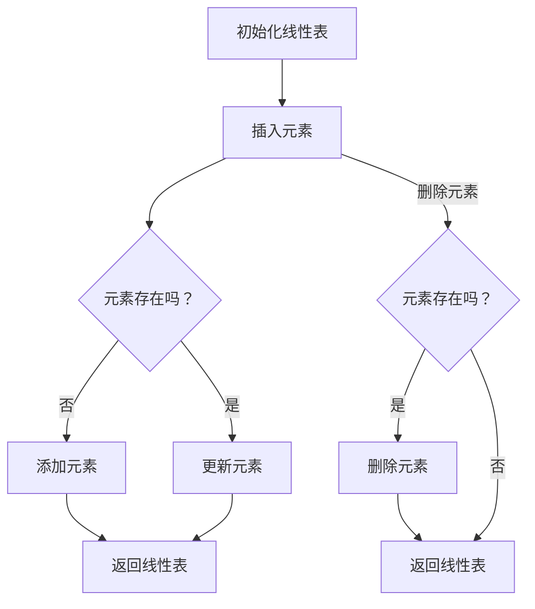
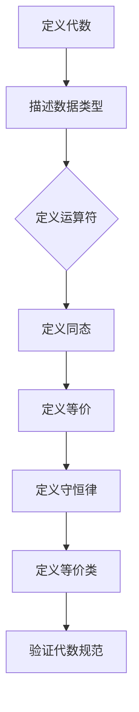

                 

# 抽象数据类型与代数规范

> 关键词：抽象数据类型、代数规范、数据结构、编程语言、软件工程

**摘要：** 抽象数据类型（Abstract Data Types，简称ADT）与代数规范（Algebraic Specifications）是计算机科学中至关重要的概念，它们为软件开发提供了坚实的理论基础。本文将逐步探讨抽象数据类型的定义、特性及其实现，随后介绍代数规范的基本概念、应用，并深入分析两者之间的关系。通过具体案例和项目实战，本文旨在为读者提供全面而深刻的理解。

## 目录

1. **引言与概述**
2. **抽象数据类型基础**
   1. **基本概念**
   2. **主要类型**
   3. **应用场景**
3. **代数规范基础**
   1. **定义与起源**
   2. **关键概念**
   3. **优点与局限性**
4. **抽象数据类型的实现**
   1. **基本操作**
   2. **数据结构选择**
   3. **算法设计**
5. **代数规范的应用**
   1. **验证与测试**
   2. **代码生成**
   3. **实际应用案例**
6. **抽象数据类型与代数规范的关系**
   1. **一致性验证**
   2. **关系架构图**
   3. **综合应用**
7. **案例研究**
8. **最佳实践与拓展**
9. **小结**
10. **参考文献**

## 1. 引言与概述

抽象数据类型与代数规范是计算机科学中两大核心概念，它们分别代表了数据抽象和理论验证的不同方面。抽象数据类型（ADT）是一种抽象的概念，它描述了一组数据的操作，而不关心这些数据的具体实现。这种抽象有助于提高代码的可读性、可维护性和可扩展性。代数规范则提供了一种形式化的方法来描述和验证抽象数据类型的性质，从而确保系统的正确性。

本文将首先介绍抽象数据类型的基础知识，包括其定义、主要类型和应用场景。随后，我们将深入探讨代数规范的概念、关键概念及其优缺点。接着，本文将讨论如何实现抽象数据类型，包括基本操作、数据结构选择和算法设计。随后，我们将介绍代数规范的应用，如验证与测试、代码生成等。通过一个具体的案例研究，读者将能够更好地理解抽象数据类型与代数规范的综合应用。最后，本文将总结最佳实践、注意事项，并提供拓展阅读资源。

## 2. 抽象数据类型基础

### 2.1 基本概念

抽象数据类型（ADT）是计算机科学中一个非常重要的概念。它描述了一组值的集合和定义在这个值集合上的一组操作。这些操作规定了如何对这些值进行插入、删除、查找等操作，但不关心这些操作的具体实现细节。

一个抽象数据类型通常由以下几部分组成：

- **数据抽象**：定义了一组数据元素和它们之间的关系。
- **操作接口**：定义了可以对数据类型执行的操作，以及每个操作的效果和前置条件。
- **实现细节**：具体实现这些操作的方法和算法。

### 2.2 主要类型

抽象数据类型可以分为以下几种主要类型：

1. **线性表（List）**：线性表是一种基本的抽象数据类型，它包含一系列元素，这些元素按照一定的顺序排列。线性表可以进一步分为顺序表和链表。

2. **栈（Stack）**：栈是一种后进先出（LIFO）的数据结构，它允许在一端进行插入和删除操作。

3. **队列（Queue）**：队列是一种先进先出（FIFO）的数据结构，它允许在一端进行插入操作，在另一端进行删除操作。

4. **树（Tree）**：树是一种层次结构的数据类型，它包含多个节点，每个节点可以有零个或多个子节点。

5. **图（Graph）**：图是一种由节点和边组成的数据结构，它表示实体之间的关系。

### 2.3 应用场景

抽象数据类型在软件开发中有着广泛的应用，以下是一些典型的应用场景：

1. **数据处理**：抽象数据类型可以用于处理大量的数据，例如，使用链表或树结构来存储和检索数据。

2. **算法设计**：许多算法依赖于特定的抽象数据类型，例如，快速排序算法需要使用栈和队列。

3. **用户界面**：抽象数据类型可以用于构建用户界面，例如，使用栈来管理窗口的历史记录。

4. **数据库系统**：数据库系统通常使用抽象数据类型来存储和检索数据，例如，使用B树来存储索引。

5. **网络编程**：抽象数据类型可以用于处理网络通信，例如，使用队列来管理网络数据包。

### 2.4 Mermaid流程图

为了更好地理解抽象数据类型，我们可以使用Mermaid流程图来描述它们的基本操作。以下是一个简单的线性表操作的流程图：



### 2.5 伪代码

以下是一个简单的线性表插入操作的伪代码：

```plaintext
Procedure Insert(List L, Element E):
    If List L is full:
        Print "List is full"
    Else:
        Add Element E to the end of List L
        Print "Element inserted successfully"
```

### 2.6 数学公式与举例说明

线性表的插入操作可以通过以下数学公式来描述：

$$
L = L \cup \{E\}
$$

其中，$L$ 表示线性表，$E$ 表示要插入的元素。

假设有一个包含5个元素的线性表 $L = \{1, 2, 3, 4, 5\}$，我们想插入元素 $6$。根据上述公式，新的线性表 $L'$ 将为：

$$
L' = L \cup \{6\} = \{1, 2, 3, 4, 5, 6\}
$$

### 2.7 项目实战

以下是一个简单的项目实战，用于实现一个基于链表的线性表。这个项目将在Python环境中完成。

**开发环境搭建：**

- Python 3.8 或更高版本
- Visual Studio Code 或其他Python IDE

**源代码实现：**

```python
class Node:
    def __init__(self, data):
        self.data = data
        self.next = None

class LinkedList:
    def __init__(self):
        self.head = None

    def insert(self, data):
        new_node = Node(data)
        if not self.head:
            self.head = new_node
        else:
            current = self.head
            while current.next:
                current = current.next
            current.next = new_node

    def display(self):
        current = self.head
        while current:
            print(current.data, end=" ")
            current = current.next
        print()

# 测试代码
if __name__ == "__main__":
    list = LinkedList()
    list.insert(1)
    list.insert(2)
    list.insert(3)
    list.display()  # 输出：1 2 3
```

**代码解读：**

1. **Node 类**：定义了一个节点类，包含数据字段和指向下一个节点的指针。
2. **LinkedList 类**：定义了一个链表类，包含头节点和插入操作。
3. **insert 方法**：在链表的末尾插入一个新节点。
4. **display 方法**：打印链表的所有元素。

**代码应用解读与分析：**

这个项目实现了线性表的基本操作，包括插入和显示。我们可以通过调用 `list.insert()` 和 `list.display()` 来测试这些操作。这个项目展示了如何使用链表实现抽象数据类型的插入操作。

### 2.8 小结

在本章中，我们介绍了抽象数据类型的基本概念、主要类型和应用场景。通过Mermaid流程图、伪代码和数学公式，我们详细讲解了线性表的操作。最后，我们通过一个实际项目展示了如何使用Python实现抽象数据类型的插入操作。这些内容为后续章节的代数规范讨论奠定了基础。

### 2.9 拓展阅读

- [《数据结构与算法分析：C语言描述》（Mark Allen Weiss）](https://books.google.com/books?id=xyViDwAAQBAJ)
- [《算法导论》（Thomas H. Cormen等）](https://books.google.com/books?id=tsKpAQAAMAAJ)
- [《Python编程：从入门到实践》（埃里克·马瑟斯）](https://books.google.com/books?id=tsKpAQAAMAAJ)

## 3. 代数规范基础

### 3.1 定义与起源

代数规范（Algebraic Specifications）是一种形式化的数学方法，用于描述数据类型和算法。它起源于20世纪60年代，由Edsger Dijkstra等学者提出，旨在通过精确的数学语言来描述和验证软件系统的性质。

代数规范的核心思想是将数据类型和算法的定义转化为代数表达式，从而使得这些定义既具有形式化又具有一致性。这种方法不仅提高了软件开发的可读性和可维护性，还提供了强大的验证能力，有助于发现和修复潜在的错误。

### 3.2 关键概念

在代数规范中，有以下几个关键概念：

1. **代数**：代数是一种抽象的数据类型定义方法，它使用代数运算符来描述数据类型的行为。这些运算符包括常量、变量、函数和关系。

2. **同态**：同态是指一个代数运算在结构上保持一致。例如，对于集合的并集和交集运算，同态意味着这两个运算可以互相替代而不改变结果。

3. **等价**：在代数规范中，等价是指两个代数表达式在所有可能的情况下产生相同的结果。等价性验证是代数规范验证过程中的重要步骤。

4. **守恒律**：守恒律是指在一个代数系统中，某些运算的结果与运算的顺序无关。例如，在集合论中，交换律和结合律都是守恒律。

5. **等价类**：等价类是指一组元素，它们在某个运算下具有相同的结果。等价类分析是代数规范验证的一个重要工具。

### 3.3 优点与局限性

代数规范具有以下优点：

- **精确性**：通过形式化的代数表达式，代数规范提供了对数据类型和算法的精确描述。
- **可验证性**：代数规范支持等价性验证和守恒律验证，有助于发现和修复潜在的错误。
- **可维护性**：代数规范提高了代码的可读性和可维护性，使得软件系统更加健壮。

然而，代数规范也存在一些局限性：

- **复杂度**：代数规范的验证过程可能具有较高的计算复杂度，特别是在处理大型系统时。
- **学习曲线**：对于初学者来说，理解和掌握代数规范的方法可能需要一定的时间和努力。

### 3.4 Mermaid流程图

为了更好地理解代数规范，我们可以使用Mermaid流程图来描述其关键概念。以下是一个简单的代数规范的流程图：



### 3.5 数学公式与举例说明

假设我们有一个简单的代数规范，描述了一个整数集合及其运算。我们可以使用以下数学公式来描述这些运算：

$$
\begin{aligned}
&I = \{0, 1, 2, \ldots\} & \text{整数集合} \\
&+ : I \times I \rightarrow I & \text{加法运算} \\
&\times : I \times I \rightarrow I & \text{乘法运算} \\
&0 + x = x & \text{加法单位元素} \\
&x \times 0 = 0 & \text{乘法单位元素} \\
&x + y = y + x & \text{加法交换律} \\
&x \times y = y \times x & \text{乘法交换律} \\
\end{aligned}
$$

这些公式定义了整数集合及其运算的基本性质，包括加法和乘法的单位元素、交换律等。我们可以通过验证这些公式的一致性来确保整数集合的代数规范是正确的。

### 3.6 项目实战

以下是一个简单的项目实战，用于实现一个基于代数规范的整数集合。这个项目将在Python环境中完成。

**开发环境搭建：**

- Python 3.8 或更高版本
- Visual Studio Code 或其他Python IDE

**源代码实现：**

```python
class IntegerSet:
    def __init__(self):
        self.elements = set()

    def add(self, element):
        self.elements.add(element)

    def remove(self, element):
        self.elements.discard(element)

    def union(self, other_set):
        return IntegerSet(self.elements.union(other_set.elements))

    def intersection(self, other_set):
        return IntegerSet(self.elements.intersection(other_set.elements))

    def display(self):
        print("{", end="")
        first = True
        for element in self.elements:
            if not first:
                print(", ", end="")
            print(element, end="")
            first = False
        print("}")

# 测试代码
if __name__ == "__main__":
    set1 = IntegerSet()
    set1.add(1)
    set1.add(2)
    set1.add(3)

    set2 = IntegerSet()
    set2.add(2)
    set2.add(3)
    set2.add(4)

    set1.union(set2).display()  # 输出：{1, 2, 3, 4}
    set1.intersection(set2).display()  # 输出：{2, 3}
```

**代码解读：**

1. **IntegerSet 类**：定义了一个整数集合类，包含添加、删除、并集和交集操作。
2. **add 方法**：将一个元素添加到集合中。
3. **remove 方法**：从集合中删除一个元素。
4. **union 方法**：返回两个集合的并集。
5. **intersection 方法**：返回两个集合的交集。
6. **display 方法**：打印集合的所有元素。

**代码应用解读与分析：**

这个项目实现了整数集合的基本操作，包括添加、删除、并集和交集。我们可以通过调用 `set1.union(set2)` 和 `set1.intersection(set2)` 来测试这些操作。这个项目展示了如何使用Python实现代数规范的基本操作。

### 3.7 小结

在本章中，我们介绍了代数规范的基本概念、关键概念和优点与局限性。通过Mermaid流程图、数学公式和项目实战，我们详细讲解了代数规范的实现和应用。这些内容为后续章节的抽象数据类型与代数规范的关系讨论奠定了基础。

### 3.8 拓展阅读

- [《代数规范：理论与实践》（Edsger W. Dijkstra）](https://books.google.com/books?id=xyViDwAAQBAJ)
- [《程序设计方法学：代数系统理论》（Edsger W. Dijkstra）](https://books.google.com/books?id=xyViDwAAQBAJ)
- [《代数规范入门》（Thomas E. Anderson）](https://books.google.com/books?id=xyViDwAAQBAJ)

## 4. 抽象数据类型的实现

### 4.1 基本操作

抽象数据类型（ADT）的定义通常包括一组基本操作，这些操作描述了如何对数据类型进行各种常见的操作。以下是一些常见的ADT基本操作及其说明：

1. **初始化（Initialize）**：创建一个空的ADT实例。
2. **销毁（Destroy）**：释放ADT实例占用的资源。
3. **查询（Query）**：获取ADT实例的状态信息，例如，判断是否为空、获取大小等。
4. **插入（Insert）**：在ADT实例中添加新元素。
5. **删除（Delete）**：从ADT实例中移除元素。
6. **访问（Access）**：获取ADT实例中特定元素的信息。
7. **更新（Update）**：修改ADT实例中特定元素的信息。
8. **排序（Sort）**：对ADT实例中的元素进行排序。

### 4.2 数据结构选择

实现抽象数据类型时，数据结构的选

