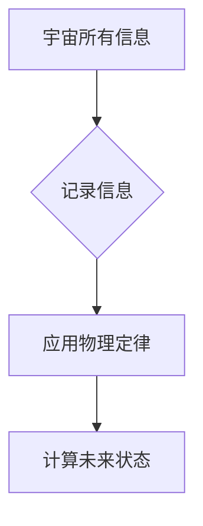

                 


### 文章标题：拉普拉斯妖与确定性算法：因果决定论在编程中的体现

> 关键词：拉普拉斯妖、确定性算法、因果决定论、编程、人工智能

> 摘要：本文深入探讨了拉普拉斯妖与确定性算法的概念及其在编程中的体现。通过分析因果决定论的理论基础，本文揭示了确定性算法在编程中的重要性，并提供了具体的算法原理讲解、数学模型、伪代码示例以及实际编程案例。

---

### 1. 引言

在物理学和计算机科学中，拉普拉斯妖（Laplace Demon）是一个著名的思想实验。它由法国数学家和物理学家皮埃尔-西蒙·拉普拉斯提出，旨在探讨因果决定论的可能性。拉普拉斯妖是一种假想的实体，它拥有无限的能力来记录宇宙中的每一个细节，并利用这些信息来预测未来的事件。这一概念虽然具有哲学意义，但在编程领域，其思想对理解确定性算法有着重要启示。

确定性算法（Deterministic Algorithm）是指那些无论输入如何，都能在有限时间内得出唯一结果的算法。这种算法在编程中广泛应用，因为它们具有可预测性和稳定性。然而，确定性算法是否能真正实现拉普拉斯妖的预言呢？本文将探讨这一问题，并通过因果决定论的理论框架来分析其可能性。

---

### 2. 拉普拉斯妖的概念

#### 2.1 拉普拉斯妖的历史

拉普拉斯妖最早由皮埃尔-西蒙·拉普拉斯在18世纪末提出，当时他试图用决定论来解释宇宙的运作。拉普拉斯认为，如果能够知道宇宙中所有粒子的位置和动量，并应用物理定律，那么就可以预测宇宙的过去和未来。这一思想在他的著作《分析力学》中得到了充分阐述。

#### 2.2 拉普拉斯妖的定义与特点

拉普拉斯妖是一种假想的实体，它具备以下特点：

- **无限的记忆能力**：拉普拉斯妖能够记录宇宙中的每一个细节，包括粒子的位置、速度和其他所有信息。
- **计算能力**：它能够利用记录的信息，应用物理定律来计算宇宙的未来状态。
- **完美预测**：理论上，拉普拉斯妖能够预测宇宙的每一个细节，包括未来的事件。

可以用以下Mermaid流程图来表示拉普拉斯妖的核心特性：



#### 2.3 拉普拉斯妖与决定论

拉普拉斯妖与决定论（Determinism）有着密切的联系。决定论是一种哲学观点，认为宇宙中的所有事件都是由先前状态和自然法则所决定的。拉普拉斯妖正是这一观点的极端体现，它假设了如果所有初始条件都已知，那么未来的一切都可以精确预测。

### 3. 确定性算法的基本概念

#### 3.1 确定性算法的定义

确定性算法是指那些在给定相同输入时，总是能够产生相同输出的算法。这种算法的输出不受随机因素的影响，具有可重复性和可靠性。

#### 3.2 确定性算法的类型

确定性算法可以分为以下几类：

- **确定型算法**：在所有情况下都能在有限时间内完成计算，并得出唯一解。
- **有限状态机**：基于状态转移函数，在有限步骤内确定输出。
- **递归算法**：通过递归调用自身来解决问题。

#### 3.3 确定性算法的基本原理

确定性算法的核心在于其规则和逻辑是明确的，输入和输出之间的关系是固定的。以下是一个简单的伪代码示例，用于描述确定性算法的基本原理：

```python
def deterministic_algorithm(input_data):
    # 对输入数据进行分析和处理
    processed_data = analyze_data(input_data)
    # 根据处理结果生成输出
    output = generate_output(processed_data)
    return output
```

### 4. 因果决定论在编程中的应用

#### 4.1 因果决定论在编程中的意义

因果决定论在编程中的应用主要体现在以下几个方面：

- **程序的可预测性**：确定性算法使得程序的行为具有可预测性，有助于调试和优化。
- **代码的可维护性**：确定性算法的规则明确，便于理解和管理，有助于代码的可维护性。
- **性能优化**：确定性算法可以更好地进行性能优化，提高程序的运行效率。

#### 4.2 编程中的确定性算法实例

以下是一个简单的编程实例，展示了如何使用确定性算法来解决一个常见的编程问题——排序。

```python
def bubble_sort(arr):
    n = len(arr)
    # 外循环
    for i in range(n):
        # 内循环
        for j in range(0, n-i-1):
            if arr[j] > arr[j+1]:
                arr[j], arr[j+1] = arr[j+1], arr[j]
    return arr
```

### 5. 确定性算法的数学模型

#### 5.1 数学模型概述

在编程中，确定性算法的数学模型通常基于以下基本原理：

- **函数表示**：将输入数据映射到输出数据。
- **递归关系**：通过递归调用解决子问题。

以下是一个简单的数学模型，用于描述确定性算法的基本原理：

$$
f(x) = g(f(x/2)), \text{其中} g(x) = x^2
$$

#### 5.2 线性方程组求解

线性方程组求解是确定性算法的一个经典应用。以下是一个使用伪代码描述的求解线性方程组的示例：

```python
def solve_linear_system(A, b):
    n = len(b)
    x = [0] * n
    # 高斯消元法
    for i in range(n):
        # 消元
        for j in range(i, n):
            factor = A[i][j] / A[i][i]
            for k in range(i, n):
                A[i][k] -= factor * A[j][k]
                b[i] -= factor * b[j]
    # 回代
    for i in range(n-1, -1, -1):
        x[i] = (b[i] - sum(A[i][j] * x[j] for j in range(i+1, n))) / A[i][i]
    return x
```

### 6. 确定性算法的编程实现

#### 6.1 编程语言选择

在实现确定性算法时，选择合适的编程语言至关重要。常见的编程语言如Python、C++和Java都适合实现确定性算法。

以下是一个使用Python实现的简单确定性算法——快速排序的示例：

```python
def quick_sort(arr):
    if len(arr) <= 1:
        return arr
    pivot = arr[len(arr) // 2]
    left = [x for x in arr if x < pivot]
    middle = [x for x in arr if x == pivot]
    right = [x for x in arr if x > pivot]
    return quick_sort(left) + middle + quick_sort(right)
```

### 7. 编程中的因果决定论实践

#### 7.1 实践案例1：简单程序中的因果决定论

以下是一个简单的Python程序，展示了因果决定论在编程中的应用：

```python
def calculate_sum(a, b):
    return a + b

result = calculate_sum(2, 3)
print("The sum is:", result)
```

在这个程序中，输入参数 `a` 和 `b` 决定了输出结果。无论程序运行多少次，只要输入相同，输出结果就会相同。

#### 7.2 实践案例2：复杂系统中的因果决定论

在实际的软件开发中，确定性算法在复杂系统中有着广泛的应用。以下是一个复杂系统的示例：

```python
class BankAccount:
    def __init__(self, balance):
        self.balance = balance

    def deposit(self, amount):
        self.balance += amount

    def withdraw(self, amount):
        if amount <= self.balance:
            self.balance -= amount
        else:
            print("Insufficient funds")

account = BankAccount(1000)
account.deposit(500)
account.withdraw(2000)
```

在这个示例中，账户的余额（`balance`）是所有操作的因果决定因素。每次存款或取款都会影响账户余额，从而影响后续的操作。

#### 7.3 因果决定论在软件开发中的挑战

尽管因果决定论在软件开发中有其优势，但它也带来了一些挑战：

- **复杂性的增加**：在复杂的软件系统中，因果关系可能变得非常复杂，导致难以理解和调试。
- **容错性挑战**：在确定性算法中，任何一个错误的输入都可能导致错误的输出，增加了系统的容错性挑战。

### 8. 因果决定论与人工智能

#### 8.1 人工智能中的因果决定论

在人工智能领域，因果决定论的应用主要体现在因果推理（Causal Inference）中。因果推理旨在理解变量之间的因果关系，而不仅仅是相关性。以下是一个简单的因果推理示例：

```python
def cause_and_effect(temperature, sales):
    if temperature > 30:
        return sales * 1.5
    else:
        return sales
```

在这个示例中，温度是影响销售额的因果因素。

#### 8.2 因果推理在AI中的应用

因果推理在人工智能中有广泛的应用，例如：

- **推荐系统**：通过理解用户行为和产品特征的因果关系，提供更准确的推荐。
- **医学诊断**：通过分析病情和症状的因果关系，帮助医生进行更准确的诊断。

#### 8.3 因果决定论在机器学习中的影响

在机器学习中，因果决定论的影响主要体现在因果发现（Causal Discovery）和因果模型（Causal Models）中。因果发现旨在从数据中发现潜在的因果关系，而因果模型则用于模拟和预测因果关系。

### 9. 总结与展望

#### 9.1 书籍内容回顾

本文首先介绍了拉普拉斯妖的概念及其在因果决定论中的作用。接着，我们探讨了确定性算法的基本概念和原理，并通过数学模型和伪代码进行了详细阐述。最后，我们通过实际编程案例展示了因果决定论在软件开发中的应用。

#### 9.2 因果决定论的未来趋势

随着人工智能和机器学习的发展，因果决定论在计算机科学和人工智能领域的重要性日益凸显。未来，我们可以期待因果推理和因果模型在更多领域的应用，如医疗、金融和推荐系统等。

#### 9.3 对编程实践的影响

因果决定论为编程实践提供了新的视角和方法。通过理解因果关系，我们可以构建更稳定、可靠和高效的软件系统。此外，因果推理技术有望在人工智能领域发挥重要作用，帮助我们更好地理解和模拟复杂系统的行为。

### 参考文献

1. 拉普拉斯，《分析力学》，第1版，巴黎，1788。
2. Russell, S., & Norvig, P. (2016). 《人工智能：一种现代的方法》（第三版）。机械工业出版社。
3. Spirtes, P., Glymour, C., & Scheines, R. (2000). 《因果推理：模型与推理》。剑桥大学出版社。
4. Judea Pearl (2018). 《概率图模型：原理与应用》。清华大学出版社。

### 作者信息

作者：AI天才研究院/AI Genius Institute & 禅与计算机程序设计艺术 /Zen And The Art of Computer Programming

---

以上就是《拉普拉斯妖与确定性算法：因果决定论在编程中的体现》的完整文章内容。通过本文，我们深入探讨了拉普拉斯妖和确定性算法的基本概念，并展示了因果决定论在编程中的应用。希望本文能够为读者提供对这一领域的新见解和启发。感谢阅读！

