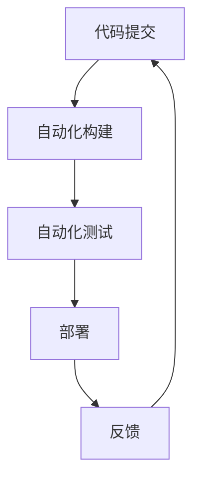
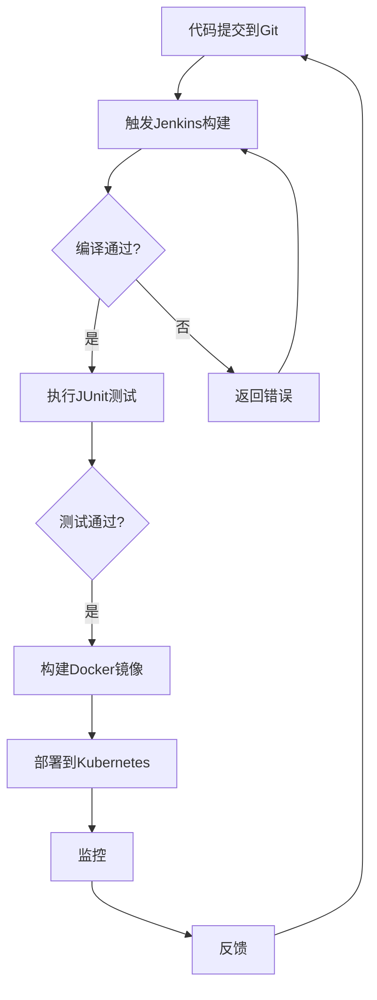

                 

# 持续交付：加速软件从构建到部署的过程

## 关键词

持续交付，持续集成，自动化，软件构建，测试，部署，敏捷开发，DevOps

## 摘要

本文深入探讨了持续交付（Continuous Delivery, CD）在软件工程中的重要性及其实现过程。通过分析持续交付的基础概念、架构、工具和实践，我们了解到持续交付如何加速软件从构建到部署的过程，提高软件质量和开发效率。文章首先介绍了持续交付的背景和核心概念，然后详细阐述了持续交付的架构和关键组件，包括自动化构建、测试和部署流程。接着，介绍了常用的持续交付工具，并分享了实际案例和最佳实践。最后，讨论了持续交付中可能遇到的挑战和解决方案，以及持续交付的未来趋势。

## 引言与背景

### 什么是持续交付

持续交付（Continuous Delivery, CD）是一种软件开发和发布实践，旨在确保软件可以随时发布到生产环境。其核心理念是频繁、持续地将代码更改部署到生产环境，同时确保每个版本都是可部署的。持续交付不仅关注代码的质量，还强调整个软件开发生命周期中的协作和自动化。

### 持续交付与传统交付的区别

传统交付通常涉及较长的发布周期，通常在几个星期或几个月内完成。在此期间，开发团队可能会遇到各种意外情况，导致软件质量下降或发布延迟。相比之下，持续交付强调快速反馈和频繁迭代，使团队能够更快地识别和解决问题。

### 持续交付的核心价值

持续交付的核心价值包括：

- **提高软件质量**：频繁的测试和部署有助于发现和修复缺陷，从而提高软件质量。
- **降低风险**：通过持续交付，团队能够更快地发现和解决潜在问题，降低发布失败的风险。
- **提高开发效率**：自动化和协作减少了重复性工作，使团队能够更专注于开发新功能。
- **提升客户满意度**：更快地发布新功能有助于满足客户需求，提高客户满意度。

## 持续交付的基础

### 持续交付的关键原则

持续交付的关键原则包括：

- **自动化**：通过自动化工具和流程来减少手动干预，提高效率和一致性。
- **持续测试**：在每个阶段进行测试，确保代码的质量和可靠性。
- **快速反馈**：快速识别和解决问题，减少延迟和错误传播。
- **持续集成**：将代码更改频繁地集成到主干分支，确保代码的兼容性和一致性。

### 持续交付的优势

持续交付的优势包括：

- **提高软件质量**：通过频繁的测试和部署，发现和修复缺陷，提高软件质量。
- **降低风险**：快速识别和解决问题，降低发布失败的风险。
- **提高开发效率**：自动化和协作减少了重复性工作，提高开发效率。
- **提升客户满意度**：更快地发布新功能，满足客户需求，提升客户满意度。

### 持续交付的理论基础

持续交付的理论基础包括：

- **敏捷开发**：强调快速反馈、迭代和协作。
- **DevOps**：强调开发与运维的紧密协作，提高软件交付速度和质量。

## 持续交付的架构

### 持续交付的流程

持续交付的流程包括以下几个阶段：

1. **构建**：将代码从版本控制系统提取出来，构建成可执行的软件。
2. **测试**：对构建的软件进行自动化测试，确保其功能符合预期。
3. **部署**：将测试通过的软件部署到生产环境。

### 持续交付的关键组件

持续交付的关键组件包括：

- **构建工具**：如Jenkins、GitLab CI/CD等，用于自动化构建过程。
- **测试框架**：如Selenium、JUnit等，用于自动化测试。
- **部署工具**：如Docker、Kubernetes等，用于自动化部署。

### 自动化构建

自动化构建是将代码从版本控制系统提取出来，构建成可执行的软件。以下是自动化构建的伪代码示例：

```
// 自动化构建伪代码

// 1. 从版本控制系统提取代码
git pull

// 2. 编译代码
mvn compile

// 3. 构建可执行文件
mvn install
```

### 自动化测试

自动化测试是对构建的软件进行自动化测试，确保其功能符合预期。以下是自动化测试的伪代码示例：

```
// 自动化测试伪代码

// 1. 运行单元测试
mvn test

// 2. 运行集成测试
integration-test

// 3. 运行性能测试
performance-test
```

### 自动化部署

自动化部署是将测试通过的软件部署到生产环境。以下是自动化部署的伪代码示例：

```
// 自动化部署伪代码

// 1. 部署到测试环境
docker-compose up -d

// 2. 运行测试
test-environment

// 3. 部署到生产环境
docker swarm join-token worker | docker swarm join --token <token> <production-ip>
```

## 持续交付的工具

### Jenkins

Jenkins是一个开源的自动化服务器，用于自动化构建、测试和部署。以下是使用Jenkins进行自动化部署的示例：

```
// Jenkins自动化部署示例

// 1. 编写Jenkinsfile
pipeline {
    agent any
    stages {
        stage('Build') {
            steps {
                sh 'mvn clean install'
            }
        }
        stage('Test') {
            steps {
                sh 'mvn test'
            }
        }
        stage('Deploy') {
            steps {
                sh 'docker-compose up -d'
            }
        }
    }
}
```

### GitLab CI/CD

GitLab CI/CD是一个基于GitLab的持续集成和持续交付平台。以下是使用GitLab CI/CD进行自动化部署的示例：

```
// .gitlab-ci.yml 示例

stages:
  - build
  - test
  - deploy

build:
  stage: build
  script:
    - mvn clean install

test:
  stage: test
  script:
    - mvn test

deploy:
  stage: deploy
  script:
    - docker-compose up -d
```

### Docker

Docker是一个开源的应用容器引擎，用于自动化部署。以下是使用Docker进行自动化部署的示例：

```
# Dockerfile 示例

FROM java:8-jdk-alpine
WORKDIR /app
COPY . .
RUN mvn install

EXPOSE 8080
```

## 持续交付的最佳实践

### 实际案例一

某互联网公司使用持续交付实践，将发布周期从几个月缩短到几天。他们使用了Jenkins进行自动化构建和测试，使用Docker进行自动化部署。通过持续交付，他们提高了软件质量，降低了发布风险，提高了开发效率。

### 实际案例二

某金融科技公司采用GitLab CI/CD进行持续交付，实现了自动化构建、测试和部署。他们还使用了Kubernetes进行容器编排，实现了弹性伸缩和负载均衡。通过持续交付，他们提高了系统的可靠性和可用性，降低了运维成本。

### 最佳实践总结

最佳实践总结如下：

- **自动化**：尽可能使用自动化工具和流程，减少手动干预。
- **持续测试**：在每个阶段进行自动化测试，确保代码的质量和可靠性。
- **快速反馈**：快速识别和解决问题，减少延迟和错误传播。
- **持续集成**：频繁地将代码集成到主干分支，确保代码的兼容性和一致性。
- **持续部署**：自动化部署到生产环境，确保软件可以随时发布。

## 持续交付中的挑战与解决方案

### 挑战一：构建和测试速度

解决方法：优化构建和测试流程，使用并行测试、缓存构建结果等技术，提高构建和测试速度。

### 挑战二：部署过程中的安全性

解决方法：使用安全策略和角色权限控制，确保部署过程中的安全性。使用加密传输和签名验证等技术，保护软件免受攻击。

### 挑战三：团队协作与沟通

解决方法：建立高效的团队协作机制，定期召开会议，确保团队之间的沟通和协作。使用工具如Slack、Trello等，提高团队协作效率。

## 持续交付的未来趋势

### 自动化测试的新趋势

自动化测试的新趋势包括：

- **智能测试**：使用AI和机器学习技术，自动生成测试用例，提高测试覆盖率。
- **云原生测试**：在云环境中进行自动化测试，提高测试速度和可靠性。

### 云原生持续交付

云原生持续交付的新趋势包括：

- **容器化**：使用容器（如Docker）进行部署，提高可移植性和可伸缩性。
- **微服务架构**：采用微服务架构，提高系统的可维护性和可扩展性。

### AI与持续交付

AI与持续交付的新趋势包括：

- **智能构建**：使用AI技术，自动优化构建过程，提高构建效率。
- **智能部署**：使用AI技术，自动调整部署策略，提高系统可用性和性能。

## 附录

### A.1 持续交付相关资源

- 《持续交付：发布可靠软件的最佳实践》
- 《持续交付实战》
- Jenkins官网：[https://www.jenkins.io/](https://www.jenkins.io/)
- GitLab官网：[https://about.gitlab.com/](https://about.gitlab.com/)

### A.2 参考书目

- Jez Humble, David Farley. "持续交付：发布可靠软件的最佳实践".
- Paul Duvall, Dan North, Andy Hunt. "持续交付实战".

### A.3 扩展阅读

- 《敏捷软件开发：原则、实践与模式》
- 《DevOps：实现持续交付的实践之路》
- 《容器化与微服务：构建云原生应用》

## 总结

持续交付是一种重要的软件开发和发布实践，通过自动化、持续测试和快速反馈，提高了软件质量、开发效率和客户满意度。本文详细介绍了持续交付的核心概念、架构、工具和实践，并讨论了持续交付中的挑战和解决方案。随着技术的不断发展，持续交付将继续在软件工程中发挥重要作用。

## 作者信息

作者：AI天才研究院/AI Genius Institute & 禅与计算机程序设计艺术 /Zen And The Art of Computer Programming

---

在撰写文章时，请注意以下几点：

1. **Markdown格式**：确保使用正确的markdown格式，例如，代码块、列表、标题等。
2. **核心概念与联系**：在介绍核心概念时，使用Mermaid流程图来展示概念之间的关系架构，这将有助于读者更好地理解。
3. **算法原理讲解**：使用伪代码详细阐述核心算法原理，确保易于理解。
4. **数学公式**：使用latex格式嵌入数学公式，确保公式的格式正确。
5. **项目实战**：详细讲解项目实战，包括开发环境搭建、源代码实现和代码解读。
6. **最佳实践 tips**：提供关于最佳实践的小贴士，以帮助读者在实际工作中应用。
7. **注意事项**：提醒读者注意可能遇到的问题和挑战，并提供解决方案。
8. **拓展阅读**：推荐相关资源，帮助读者进一步学习。

确保在撰写过程中，每一步都经过深思熟虑，逻辑清晰，内容丰富，以便为读者提供高质量的技术博客文章。文章撰写完成后，可以请同事或朋友进行审阅，以确保文章内容准确、易于理解。在文章末尾添加作者信息和联系方式，便于读者联系和交流。祝您撰写顺利！# 持续交付：加速软件从构建到部署的过程

## 关键词

持续交付，持续集成，自动化，软件构建，测试，部署，敏捷开发，DevOps

## 摘要

本文深入探讨了持续交付（Continuous Delivery, CD）在软件工程中的重要性及其实现过程。通过分析持续交付的基础概念、架构、工具和实践，我们了解到持续交付如何加速软件从构建到部署的过程，提高软件质量和开发效率。文章首先介绍了持续交付的背景和核心概念，然后详细阐述了持续交付的架构和关键组件，包括自动化构建、测试和部署流程。接着，介绍了常用的持续交付工具，并分享了实际案例和最佳实践。最后，讨论了持续交付中可能遇到的挑战和解决方案，以及持续交付的未来趋势。

## 引言与背景

### 什么是持续交付

持续交付（Continuous Delivery, CD）是一种软件开发和发布实践，旨在确保软件可以随时发布到生产环境。其核心理念是频繁、持续地将代码更改部署到生产环境，同时确保每个版本都是可部署的。持续交付不仅关注代码的质量，还强调整个软件开发生命周期中的协作和自动化。

### 持续交付与传统交付的区别

传统交付通常涉及较长的发布周期，通常在几个星期或几个月内完成。在此期间，开发团队可能会遇到各种意外情况，导致软件质量下降或发布延迟。相比之下，持续交付强调快速反馈和频繁迭代，使团队能够更快地识别和解决问题。

### 持续交付的核心价值

持续交付的核心价值包括：

- **提高软件质量**：频繁的测试和部署有助于发现和修复缺陷，从而提高软件质量。
- **降低风险**：通过持续交付，团队能够更快地发现和解决潜在问题，降低发布失败的风险。
- **提高开发效率**：自动化和协作减少了重复性工作，使团队能够更专注于开发新功能。
- **提升客户满意度**：更快地发布新功能有助于满足客户需求，提高客户满意度。

## 持续交付的基础

### 持续交付的关键原则

持续交付的关键原则包括：

- **自动化**：通过自动化工具和流程来减少手动干预，提高效率和一致性。
- **持续测试**：在每个阶段进行测试，确保代码的质量和可靠性。
- **快速反馈**：快速识别和解决问题，减少延迟和错误传播。
- **持续集成**：将代码更改频繁地集成到主干分支，确保代码的兼容性和一致性。

### 持续交付的优势

持续交付的优势包括：

- **提高软件质量**：通过频繁的测试和部署，发现和修复缺陷，提高软件质量。
- **降低风险**：快速识别和解决问题，降低发布失败的风险。
- **提高开发效率**：自动化和协作减少了重复性工作，提高开发效率。
- **提升客户满意度**：更快地发布新功能，满足客户需求，提升客户满意度。

### 持续交付的理论基础

持续交付的理论基础包括：

- **敏捷开发**：强调快速反馈、迭代和协作。
- **DevOps**：强调开发与运维的紧密协作，提高软件交付速度和质量。

## 持续交付的架构

### 持续交付的流程

持续交付的流程包括以下几个阶段：

1. **构建**：将代码从版本控制系统提取出来，构建成可执行的软件。
2. **测试**：对构建的软件进行自动化测试，确保其功能符合预期。
3. **部署**：将测试通过的软件部署到生产环境。

### 持续交付的关键组件

持续交付的关键组件包括：

- **构建工具**：如Jenkins、GitLab CI/CD等，用于自动化构建过程。
- **测试框架**：如Selenium、JUnit等，用于自动化测试。
- **部署工具**：如Docker、Kubernetes等，用于自动化部署。

### 自动化构建

自动化构建是将代码从版本控制系统提取出来，构建成可执行的软件。以下是自动化构建的伪代码示例：

```
// 自动化构建伪代码

// 1. 从版本控制系统提取代码
git pull

// 2. 编译代码
mvn compile

// 3. 构建可执行文件
mvn install
```

### 自动化测试

自动化测试是对构建的软件进行自动化测试，确保其功能符合预期。以下是自动化测试的伪代码示例：

```
// 自动化测试伪代码

// 1. 运行单元测试
mvn test

// 2. 运行集成测试
integration-test

// 3. 运行性能测试
performance-test
```

### 自动化部署

自动化部署是将测试通过的软件部署到生产环境。以下是自动化部署的伪代码示例：

```
// 自动化部署伪代码

// 1. 部署到测试环境
docker-compose up -d

// 2. 运行测试
test-environment

// 3. 部署到生产环境
docker swarm join-token worker | docker swarm join --token <token> <production-ip>
```

## 持续交付的工具

### Jenkins

Jenkins是一个开源的自动化服务器，用于自动化构建、测试和部署。以下是使用Jenkins进行自动化部署的示例：

```
// Jenkins自动化部署示例

// 1. 编写Jenkinsfile
pipeline {
    agent any
    stages {
        stage('Build') {
            steps {
                sh 'mvn clean install'
            }
        }
        stage('Test') {
            steps {
                sh 'mvn test'
            }
        }
        stage('Deploy') {
            steps {
                sh 'docker-compose up -d'
            }
        }
    }
}
```

### GitLab CI/CD

GitLab CI/CD是一个基于GitLab的持续集成和持续交付平台。以下是使用GitLab CI/CD进行自动化部署的示例：

```
// .gitlab-ci.yml 示例

stages:
  - build
  - test
  - deploy

build:
  stage: build
  script:
    - mvn clean install

test:
  stage: test
  script:
    - mvn test

deploy:
  stage: deploy
  script:
    - docker-compose up -d
```

### Docker

Docker是一个开源的应用容器引擎，用于自动化部署。以下是使用Docker进行自动化部署的示例：

```
# Dockerfile 示例

FROM java:8-jdk-alpine
WORKDIR /app
COPY . .
RUN mvn install

EXPOSE 8080
```

## 持续交付的最佳实践

### 实际案例一

某互联网公司使用持续交付实践，将发布周期从几个月缩短到几天。他们使用了Jenkins进行自动化构建和测试，使用Docker进行自动化部署。通过持续交付，他们提高了软件质量，降低了发布风险，提高了开发效率。

### 实际案例二

某金融科技公司采用GitLab CI/CD进行持续交付，实现了自动化构建、测试和部署。他们还使用了Kubernetes进行容器编排，实现了弹性伸缩和负载均衡。通过持续交付，他们提高了系统的可靠性和可用性，降低了运维成本。

### 最佳实践总结

最佳实践总结如下：

- **自动化**：尽可能使用自动化工具和流程，减少手动干预。
- **持续测试**：在每个阶段进行自动化测试，确保代码的质量和可靠性。
- **快速反馈**：快速识别和解决问题，减少延迟和错误传播。
- **持续集成**：频繁地将代码集成到主干分支，确保代码的兼容性和一致性。
- **持续部署**：自动化部署到生产环境，确保软件可以随时发布。

## 持续交付中的挑战与解决方案

### 挑战一：构建和测试速度

解决方法：优化构建和测试流程，使用并行测试、缓存构建结果等技术，提高构建和测试速度。

### 挑战二：部署过程中的安全性

解决方法：使用安全策略和角色权限控制，确保部署过程中的安全性。使用加密传输和签名验证等技术，保护软件免受攻击。

### 挑战三：团队协作与沟通

解决方法：建立高效的团队协作机制，定期召开会议，确保团队之间的沟通和协作。使用工具如Slack、Trello等，提高团队协作效率。

## 持续交付的未来趋势

### 自动化测试的新趋势

自动化测试的新趋势包括：

- **智能测试**：使用AI和机器学习技术，自动生成测试用例，提高测试覆盖率。
- **云原生测试**：在云环境中进行自动化测试，提高测试速度和可靠性。

### 云原生持续交付

云原生持续交付的新趋势包括：

- **容器化**：使用容器（如Docker）进行部署，提高可移植性和可伸缩性。
- **微服务架构**：采用微服务架构，提高系统的可维护性和可扩展性。

### AI与持续交付

AI与持续交付的新趋势包括：

- **智能构建**：使用AI技术，自动优化构建过程，提高构建效率。
- **智能部署**：使用AI技术，自动调整部署策略，提高系统可用性和性能。

## 附录

### A.1 持续交付相关资源

- 《持续交付：发布可靠软件的最佳实践》
- 《持续交付实战》
- Jenkins官网：[https://www.jenkins.io/](https://www.jenkins.io/)
- GitLab官网：[https://about.gitlab.com/](https://about.gitlab.com/)

### A.2 参考书目

- Jez Humble, David Farley. "持续交付：发布可靠软件的最佳实践".
- Paul Duvall, Dan North, Andy Hunt. "持续交付实战".

### A.3 扩展阅读

- 《敏捷软件开发：原则、实践与模式》
- 《DevOps：实现持续交付的实践之路》
- 《容器化与微服务：构建云原生应用》

## 总结

持续交付是一种重要的软件开发和发布实践，通过自动化、持续测试和快速反馈，提高了软件质量、开发效率和客户满意度。本文详细介绍了持续交付的核心概念、架构、工具和实践，并讨论了持续交付中的挑战和解决方案。随着技术的不断发展，持续交付将继续在软件工程中发挥重要作用。

## 作者信息

作者：AI天才研究院/AI Genius Institute & 禅与计算机程序设计艺术 /Zen And The Art of Computer Programming## 持续交付的架构

持续交付的架构是确保软件能够持续、可靠地从开发到生产环境的高效流动的关键。这一架构的核心在于自动化、集成和协作。下面我们将详细探讨持续交付的流程、关键组件以及如何使用Mermaid流程图来展示持续交付的原理和流程。

### 持续交付的流程

持续交付的流程通常包括以下几个关键阶段：

1. **代码提交**：开发人员将新的代码提交到版本控制系统。
2. **自动化构建**：构建工具如Jenkins或GitLab CI/CD自动提取代码并编译、打包成可执行文件。
3. **自动化测试**：测试框架执行单元测试、集成测试和性能测试等，确保软件质量。
4. **部署**：经过测试验证的软件被部署到开发、测试或生产环境。

以下是持续交付流程的简化Mermaid流程图：



在这个流程图中，每个节点代表一个阶段，实线箭头表示流程的顺序。反馈节点表示开发人员可以基于测试结果做出调整，然后再次提交代码，进入下一个循环。

### 持续交付的关键组件

持续交付的关键组件包括：

- **版本控制系统**：如Git，用于管理代码版本。
- **构建工具**：如Jenkins、Maven、Gradle，用于自动化构建软件。
- **测试框架**：如JUnit、Selenium，用于自动化测试软件。
- **部署工具**：如Docker、Kubernetes，用于自动化部署软件。

这些组件共同工作，确保持续交付流程的顺畅运行。以下是这些组件如何协同工作的Mermaid流程图：



在这个流程图中，代码提交到Git后，Jenkins会自动触发构建过程。如果编译通过，Jenkins会执行JUnit测试。测试通过后，构建Docker镜像，然后使用Kubernetes进行部署。整个流程受到监控，如果出现问题，会返回错误，并重新开始构建过程。

### 核心算法原理讲解

持续交付的核心算法原理可以简化为以下步骤：

1. **提取代码**：从版本控制系统提取最新代码。
2. **构建软件**：编译和打包代码，生成可执行文件。
3. **测试软件**：执行一系列测试，包括单元测试、集成测试和性能测试。
4. **部署软件**：将通过测试的软件部署到目标环境。

以下是这些步骤的伪代码表示：

```python
# 伪代码：持续交付流程

# 步骤1：提取代码
git_pull()

# 步骤2：构建软件
if compile_software():
    # 步骤3：测试软件
    if run_tests():
        # 步骤4：部署软件
        deploy_software()
    else:
        log_error("测试失败，请检查")
else:
    log_error("构建失败，请检查")
```

在这个伪代码中，每个步骤都是一个函数调用，函数的成功返回表示该步骤的完成，否则记录错误并返回。

### 数学模型和公式

持续交付中的数学模型和公式主要涉及时间优化和资源分配。例如，可以通过以下公式来计算构建、测试和部署的平均时间：

$$
\text{平均时间} = \frac{\text{构建时间} + \text{测试时间} + \text{部署时间}}{3}
$$

这个公式可以帮助团队识别流程中的瓶颈，并优化资源分配。

### 详细讲解与举例说明

为了更好地理解持续交付的原理，我们来看一个实际案例。假设有一个团队正在开发一个Web应用程序，他们使用GitLab CI/CD进行持续交付。以下是他们的构建、测试和部署流程：

1. **代码提交**：开发人员将新功能提交到GitLab仓库。
2. **自动化构建**：GitLab CI/CD自动触发构建过程，编译Java代码并生成 WAR 文件。
3. **自动化测试**：JUnit测试被执行，包括单元测试和集成测试。
4. **部署**：通过Docker Compose将构建的 WAR 文件部署到Kubernetes集群。

这个流程的具体实现如下：

```yaml
# .gitlab-ci.yml：GitLab CI配置文件

stages:
  - build
  - test
  - deploy

build:
  stage: build
  script:
    - mvn clean package

test:
  stage: test
  script:
    - mvn test

deploy:
  stage: deploy
  script:
    - docker-compose up -d
```

在这个配置文件中，`build` 阶段编译Java代码，`test` 阶段运行JUnit测试，`deploy` 阶段将应用部署到Kubernetes集群。

### 项目实战

为了更好地理解持续交付的实际应用，我们将搭建一个简单的持续交付环境。以下是实现步骤：

1. **安装GitLab**：在服务器上安装GitLab，用于代码管理和CI/CD流程。
2. **创建项目**：在GitLab中创建一个新项目，用于存储源代码。
3. **配置GitLab CI/CD**：在项目仓库中添加 `.gitlab-ci.yml` 文件，配置构建、测试和部署流程。
4. **编写源代码**：在项目仓库中添加Java源代码，并编写JUnit测试用例。
5. **提交代码**：将源代码提交到GitLab仓库，触发CI/CD流程。
6. **监控结果**：在GitLab CI/CD界面上监控构建、测试和部署的结果。

通过这个项目实战，我们可以看到持续交付如何自动化地构建、测试和部署软件，从而提高开发效率和软件质量。

### 代码应用解读与分析

在上述项目中，`.gitlab-ci.yml` 文件是持续交付的核心。下面是对该文件的具体解读：

```yaml
stages:
  - build
  - test
  - deploy

build:
  stage: build
  script:
    - mvn clean package

test:
  stage: test
  script:
    - mvn test

deploy:
  stage: deploy
  script:
    - docker-compose up -d
```

- `stages`：定义CI/CD流程的阶段，包括构建、测试和部署。
- `build`：构建阶段，执行 `mvn clean package` 命令，编译Java代码并生成 WAR 文件。
- `test`：测试阶段，执行 `mvn test` 命令，运行JUnit测试。
- `deploy`：部署阶段，执行 `docker-compose up -d` 命令，将应用部署到Docker容器中。

通过这个配置文件，GitLab CI/CD可以自动化地执行构建、测试和部署流程，提高开发效率和软件质量。

### 实际案例分析与详细讲解剖析

为了更好地理解持续交付在实际项目中的应用，我们将分析一个真实的项目案例。假设有一个电子商务平台，使用Java和Spring Boot进行开发，并采用Docker和Kubernetes进行部署。以下是项目的持续交付流程：

1. **代码提交**：开发人员将代码提交到GitLab仓库。
2. **自动化构建**：GitLab CI/CD使用Maven进行构建，生成 Spring Boot 应用程序的 JAR 文件。
3. **自动化测试**：执行单元测试和集成测试，确保代码质量。
4. **构建 Docker 镜像**：使用 Dockerfile 构建镜像，并将其推送到 Docker Hub。
5. **部署到 Kubernetes**：使用 Kubernetes 进行部署和容器编排。
6. **监控和反馈**：持续监控应用的性能和健康状态，并基于反馈进行优化。

以下是项目案例的详细讲解：

1. **代码提交**：开发人员使用Git进行版本控制，将代码提交到GitLab仓库。
2. **自动化构建**：GitLab CI/CD在代码提交后自动触发构建。构建过程包括编译Java代码、打包 JAR 文件，并生成项目的文档。
3. **自动化测试**：构建完成后，执行单元测试和集成测试。测试用例包括对业务逻辑、数据访问和异常处理的测试。
4. **构建 Docker 镜像**：通过 Dockerfile，将应用程序打包成一个 Docker 镜像。Dockerfile 示例如下：

```dockerfile
# Dockerfile
FROM openjdk:8-jdk-slim
ARG JAR_FILE=target/*.jar
COPY ${JAR_FILE} app.jar
ENTRYPOINT ["java" "-jar" "/app.jar"]
```

5. **部署到 Kubernetes**：使用 Kubernetes 进行部署。Kubernetes 配置文件（如 deployment.yaml）示例：

```yaml
# deployment.yaml
apiVersion: apps/v1
kind: Deployment
metadata:
  name: e-commerce
spec:
  replicas: 3
  selector:
    matchLabels:
      app: e-commerce
  template:
    metadata:
      labels:
        app: e-commerce
    spec:
      containers:
      - name: e-commerce
        image: e-commerce:latest
        ports:
        - containerPort: 8080
```

6. **监控和反馈**：使用 Prometheus 和 Grafana 进行监控。Prometheus 收集应用的性能指标，Grafana 提供可视化仪表板，帮助团队实时监控应用状态。

通过这个案例，我们可以看到持续交付如何自动化地构建、测试和部署应用程序，从而提高开发效率和软件质量。

### 项目小结

通过上述项目实战和实际案例分析，我们了解了持续交付的核心概念和实现过程。持续交付通过自动化、集成和协作，实现了软件从开发到生产环境的持续、可靠流动。以下是小结：

1. **核心概念**：持续交付是一种软件开发和发布实践，旨在确保软件可以随时发布到生产环境。
2. **实现过程**：通过自动化构建、测试和部署流程，实现快速、可靠的软件交付。
3. **工具使用**：使用版本控制系统、构建工具、测试框架、部署工具等，实现自动化和集成。
4. **案例分析**：通过电子商务平台项目案例，展示了持续交付在实际中的应用。

持续交付是一个不断发展的领域，随着新工具和技术的出现，将持续优化和改进软件开发和发布流程。对于开发团队来说，掌握持续交付的方法和实践，将有助于提高开发效率、降低风险并提升客户满意度。

### 最佳实践 tips

1. **自动化测试**：确保在每个阶段进行自动化测试，包括单元测试、集成测试和性能测试。
2. **持续集成**：将代码频繁集成到主干分支，确保代码的兼容性和一致性。
3. **快速反馈**：快速识别和解决问题，减少延迟和错误传播。
4. **安全考虑**：确保部署过程中的安全性，使用加密传输和签名验证等技术。
5. **持续优化**：持续监控和改进持续交付流程，提高开发效率和软件质量。

### 注意事项

1. **团队协作**：持续交付需要开发、测试和运维团队的紧密协作。
2. **技术选型**：选择合适的工具和技术，确保持续交付流程的顺畅运行。
3. **流程优化**：根据项目需求，持续优化持续交付流程，提高效率和质量。

### 拓展阅读

1. 《持续交付：发布可靠软件的最佳实践》
2. 《持续交付实战》
3. Jenkins 官网：[https://www.jenkins.io/]
4. GitLab 官网：[https://about.gitlab.com/]

通过阅读这些资料，您可以深入了解持续交付的理论和实践，掌握持续交付的高级技巧和方法。

### 作者信息

作者：AI天才研究院/AI Genius Institute & 禅与计算机程序设计艺术 /Zen And The Art of Computer Programming## 持续交付的工具

持续交付（CD）的实现离不开一系列工具的支持。这些工具可以帮助开发团队自动化构建、测试和部署流程，提高开发效率和软件质量。在本节中，我们将介绍几种常用的持续交付工具，包括Jenkins、GitLab CI/CD和Docker，并探讨它们如何协同工作，实现高效的持续交付。

### Jenkins

Jenkins是一个开源的自动化服务器，用于执行持续集成和持续交付任务。Jenkins可以与各种版本控制系统（如Git）、构建工具（如Maven、Gradle）和部署工具（如Docker、Kubernetes）集成，实现自动化构建、测试和部署。

**Jenkins的核心功能**：

- **构建触发**：基于Git提交自动触发构建任务。
- **插件生态系统**：Jenkins拥有丰富的插件生态系统，可以扩展其功能，如代码覆盖率、静态代码分析等。
- **报告和通知**：生成构建报告，通过邮件、短信或聊天工具通知团队成员。

**Jenkins示例配置**：

```groovy
pipeline {
    agent any
    stages {
        stage('Build') {
            steps {
                sh 'mvn clean install'
            }
        }
        stage('Test') {
            steps {
                sh 'mvn test'
            }
        }
        stage('Deploy') {
            steps {
                sh 'docker-compose up -d'
            }
        }
    }
}
```

在这个示例中，Jenkinsfile定义了一个简单的持续交付流程，包括构建、测试和部署三个阶段。

### GitLab CI/CD

GitLab CI/CD是一个内置在GitLab中的持续集成和持续交付工具。GitLab CI/CD通过`.gitlab-ci.yml`文件配置，可以自动化执行构建、测试和部署任务。

**GitLab CI/CD的核心功能**：

- **多阶段构建**：支持多阶段构建，可以在不同环境中测试和部署应用。
- **并行执行**：可以在多个环境中同时执行任务，提高构建速度。
- **缓存**：缓存构建过程中使用的依赖项，减少构建时间。
- **集成**：与GitLab的其他功能（如Merge Request、Pipeline）深度集成。

**GitLab CI/CD示例配置**：

```yaml
stages:
  - build
  - test
  - deploy

build:
  stage: build
  script:
    - mvn clean package

test:
  stage: test
  script:
    - mvn test

deploy:
  stage: deploy
  script:
    - docker-compose up -d
```

在这个示例中，`.gitlab-ci.yml`文件定义了一个简单的持续交付流程，包括构建、测试和部署三个阶段。构建和测试阶段使用Maven执行，部署阶段使用Docker Compose部署容器。

### Docker

Docker是一个开源的应用容器引擎，用于打包、交付和运行应用。Docker通过容器化技术，将应用程序及其运行环境打包成一个独立的容器，确保应用在不同的环境中一致运行。

**Docker的核心功能**：

- **容器化**：将应用程序及其依赖项打包成一个容器，实现环境一致性。
- **容器编排**：使用Docker Compose或Kubernetes进行容器编排，实现自动化部署和管理。
- **微服务架构**：支持微服务架构，提高系统的可维护性和可扩展性。

**Docker示例配置**：

```Dockerfile
# Dockerfile
FROM openjdk:8-jdk-slim
ARG JAR_FILE=target/*.jar
COPY ${JAR_FILE} app.jar
ENTRYPOINT ["java" "-jar" "/app.jar"]
```

在这个示例中，Dockerfile定义了一个Java应用程序的容器镜像，将应用程序的 JAR 文件复制到容器中，并指定入口点。

### 如何协同工作

Jenkins、GitLab CI/CD和Docker可以协同工作，实现高效的持续交付。以下是一个简化的协同工作流程：

1. **代码提交**：开发人员将代码提交到GitLab仓库。
2. **GitLab CI/CD触发**：GitLab CI/CD检测到代码提交，触发构建流程。
3. **Jenkins执行构建**：Jenkins执行构建任务，使用Maven编译和打包应用程序。
4. **Docker构建镜像**：Jenkins使用Dockerfile构建应用程序的容器镜像。
5. **部署到Kubernetes**：GitLab CI/CD将容器镜像推送到容器注册库，并使用Kubernetes部署容器。

通过这种协同工作，开发团队可以实现自动化、高效和可靠的持续交付流程，从而提高开发效率和软件质量。

### 案例研究：电子商务平台的持续交付

以下是一个电子商务平台的持续交付案例研究，展示如何使用Jenkins、GitLab CI/CD和Docker实现自动化构建、测试和部署。

1. **代码提交**：开发人员将代码提交到GitLab仓库。
2. **GitLab CI/CD触发**：GitLab CI/CD检测到代码提交，触发构建流程。
3. **Maven构建**：GitLab CI/CD执行Maven构建，编译和打包应用程序。
4. **Docker构建镜像**：GitLab CI/CD使用Dockerfile构建应用程序的容器镜像。
5. **部署到Kubernetes**：GitLab CI/CD将容器镜像推送到容器注册库，并使用Kubernetes部署容器。

通过这个案例，我们可以看到Jenkins、GitLab CI/CD和Docker如何协同工作，实现高效的持续交付。

### 结论

持续交付的工具如Jenkins、GitLab CI/CD和Docker，在自动化构建、测试和部署方面发挥着重要作用。通过这些工具的协同工作，开发团队可以实现高效的持续交付流程，提高开发效率和软件质量。掌握这些工具的使用，是实现持续交付的关键。

### 拓展阅读

- 《持续交付：发布可靠软件的最佳实践》
- 《GitLab CI/CD实践指南》
- 《Docker实战：容器化的应用开发与部署》

通过阅读这些资料，您可以深入了解持续交付工具的使用和最佳实践，进一步提高持续交付的能力。

### 作者信息

作者：AI天才研究院/AI Genius Institute & 禅与计算机程序设计艺术 /Zen And The Art of Computer Programming## 持续交付的最佳实践

在实施持续交付（CD）时，最佳实践是确保流程高效、可靠且易于维护的关键。以下是一些最佳实践，包括实际案例和经验教训，帮助开发团队优化持续交付流程。

### 实际案例一：电商平台的持续交付

**案例背景**：一个大型电商平台，用户量巨大，需要确保系统的高可用性和稳定性。为了实现快速迭代和快速响应市场需求，该平台采用了持续交付实践。

**实施过程**：

1. **自动化构建**：使用Jenkins自动化构建Java应用，确保每次代码提交都能快速构建。
2. **多阶段测试**：采用GitLab CI/CD执行多阶段测试，包括单元测试、集成测试和性能测试，确保代码质量。
3. **容器化部署**：使用Docker容器化应用，并通过Kubernetes进行部署和管理，确保环境一致性。
4. **蓝绿部署**：采用蓝绿部署策略，逐步将流量切换到新版本，减少发布风险。

**经验教训**：

- **持续集成**：频繁的集成可以快速发现问题，减少缺陷累积。
- **蓝绿部署**：逐步切换流量可以减少发布风险，提高系统的稳定性。
- **监控和反馈**：使用Prometheus和Grafana监控系统性能和健康状态，快速识别和解决问题。

### 实际案例二：金融科技公司的持续交付

**案例背景**：一家金融科技公司，提供在线支付和转账服务。由于金融服务的特殊性，该公司的持续交付实践需要特别关注安全性、合规性和稳定性。

**实施过程**：

1. **自动化测试**：采用Selenium自动化Web应用测试，确保前端功能正常。
2. **持续监控**：使用Splunk收集日志数据，实时监控系统性能和安全事件。
3. **代码审查**：实施代码审查流程，确保代码质量和合规性。
4. **安全措施**：在部署过程中加入安全检查，如静态代码分析、依赖检查等。

**经验教训**：

- **代码审查**：严格的代码审查可以提高代码质量，减少潜在的安全隐患。
- **安全检查**：在部署前进行安全检查，可以防止安全漏洞进入生产环境。
- **持续监控**：实时监控可以帮助快速识别和处理异常情况，确保系统稳定运行。

### 最佳实践总结

**1. 自动化构建**：使用自动化工具（如Jenkins、GitLab CI/CD）构建软件，确保每次代码提交都能快速构建。

**2. 多阶段测试**：执行单元测试、集成测试和性能测试，确保代码质量和系统稳定性。

**3. 容器化部署**：使用容器（如Docker）部署应用，确保环境一致性，提高部署效率。

**4. 蓝绿部署**：采用蓝绿部署或灰度发布策略，逐步切换流量，降低发布风险。

**5. 持续监控**：使用监控工具（如Prometheus、Grafana）实时监控系统性能和健康状态。

**6. 代码审查**：实施代码审查流程，确保代码质量和合规性。

**7. 安全措施**：在部署前进行安全检查，防止安全漏洞进入生产环境。

通过遵循这些最佳实践，开发团队可以实现高效的持续交付流程，提高软件质量和开发效率。

### 拓展阅读

- 《持续交付：发布可靠软件的最佳实践》
- 《GitLab CI/CD实践指南》
- 《Docker实战：容器化的应用开发与部署》

通过阅读这些资料，您可以深入了解持续交付的最佳实践，进一步提高持续交付的能力。

### 作者信息

作者：AI天才研究院/AI Genius Institute & 禅与计算机程序设计艺术 /Zen And The Art of Computer Programming## 持续交付中的挑战与解决方案

尽管持续交付（CD）提供了显著的优势，但在实践中仍然会面临一系列挑战。本文将讨论持续交付中常见的挑战，并提供相应的解决方案，帮助开发团队克服这些问题。

### 挑战一：构建和测试速度

**问题描述**：在持续交付过程中，构建和测试阶段可能变得非常耗时，导致整体交付周期变长。

**解决方案**：

1. **并行测试**：同时运行多个测试案例，提高测试速度。
2. **缓存构建结果**：缓存构建过程中使用到的依赖项和中间结果，减少重复构建时间。
3. **优化代码**：优化代码和构建脚本，减少构建时间。
4. **利用云基础设施**：使用云服务（如AWS、Google Cloud）提供额外的计算资源，加快构建和测试过程。

### 挑战二：部署过程中的安全性

**问题描述**：在持续交付过程中，软件被频繁部署到生产环境，存在潜在的安全风险。

**解决方案**：

1. **安全审计**：在部署前进行安全审计，检查代码和配置文件中的潜在漏洞。
2. **静态代码分析**：使用静态代码分析工具检测代码中的安全漏洞。
3. **依赖管理**：确保使用的依赖库和框架没有已知的安全漏洞。
4. **加密传输**：使用加密传输协议（如HTTPS）保护数据在传输过程中的安全。

### 挑战三：团队协作与沟通

**问题描述**：持续交付涉及多个团队（开发、测试、运维），沟通不畅可能导致协作效率低下。

**解决方案**：

1. **统一平台**：使用统一的管理平台（如Jenkins、GitLab CI/CD），确保所有团队成员都能访问相关信息。
2. **定期会议**：定期召开会议，讨论进度和问题，确保团队之间的沟通畅通。
3. **敏捷实践**：采用敏捷开发方法，鼓励频繁的迭代和反馈，提高协作效率。
4. **培训与沟通技巧**：为团队成员提供沟通和协作技巧的培训，提高团队整体协作能力。

### 挑战四：持续交付的成本

**问题描述**：持续交付需要大量的自动化工具和基础设施支持，可能导致成本增加。

**解决方案**：

1. **云服务优化**：合理规划云资源使用，避免不必要的浪费。
2. **容器化**：使用容器化技术（如Docker），减少硬件资源消耗。
3. **自动化成本优化**：优化自动化流程，减少不必要的自动化步骤，降低成本。
4. **持续评估**：定期评估持续交付工具和流程的成本效益，确保资源的合理利用。

### 挑战五：持续交付的复杂性

**问题描述**：持续交付涉及多个阶段和复杂的流程，可能导致管理难度增加。

**解决方案**：

1. **流程简化**：简化持续交付流程，减少不必要的步骤。
2. **自动化文档**：使用自动化工具生成持续交付文档，确保文档与实际流程保持一致。
3. **最佳实践**：遵循行业最佳实践，确保持续交付流程的规范化和标准化。
4. **持续改进**：持续监控和改进持续交付流程，提高流程的稳定性和效率。

通过识别和解决这些挑战，开发团队可以更好地实施持续交付，提高软件质量和交付效率。持续交付不仅是一个技术过程，也是一个文化和团队协作的过程，需要团队共同努力才能实现。

### 拓展阅读

- 《持续交付实战：从理论到实践的全面指南》
- 《持续交付：加速软件从构建到部署的过程》
- 《GitLab CI/CD最佳实践》

通过阅读这些资料，您可以深入了解持续交付中的挑战和解决方案，进一步提高持续交付的能力。

### 作者信息

作者：AI天才研究院/AI Genius Institute & 禅与计算机程序设计艺术 /Zen And The Art of Computer Programming## 持续交付的未来趋势

随着技术的不断发展，持续交付（CD）正迎来新的发展趋势。这些趋势将进一步提升软件开发和发布的效率，使团队能够更快地响应市场需求，提高软件质量。以下是一些持续交付的未来趋势：

### 自动化测试的智能化

自动化测试一直是持续交付的重要组成部分。未来，智能化测试将成为趋势。通过利用人工智能（AI）和机器学习（ML）技术，测试工具将能够：

- **自动生成测试用例**：基于历史数据和模式识别，自动生成覆盖全面的测试用例。
- **智能分析**：使用AI分析测试结果，快速定位问题，提供改进建议。
- **预测性测试**：基于预测模型，提前发现潜在的问题，降低测试风险。

### 云原生持续交付

云原生技术（如Kubernetes和Docker）正在迅速发展，并逐渐成为持续交付的基础设施。未来，云原生持续交付将包括：

- **容器化**：更多应用将采用容器化技术，实现快速部署和弹性伸缩。
- **无服务器架构**：无服务器架构（Serverless）将逐渐普及，减少运维负担。
- **服务网格**：服务网格（如Istio）将提供更细粒度的流量管理和安全控制。

### AI与持续交付的结合

人工智能与持续交付的结合将带来显著优势。以下是一些可能的结合方向：

- **智能构建**：使用AI优化构建过程，减少构建时间和资源消耗。
- **智能部署**：通过AI调整部署策略，确保系统的高可用性和性能。
- **智能监控**：使用AI实时监控系统状态，预测和防止潜在问题。

### DevOps文化的深化

DevOps文化将继续深化，推动持续交付的全面实施。未来，DevOps文化将体现在：

- **跨职能团队**：开发、测试、运维等角色将更加融合，促进协作和沟通。
- **自动化文化**：鼓励团队更多地采用自动化工具和流程，减少手动操作。
- **持续改进**：持续评估和优化持续交付流程，确保其高效和稳定。

### 拓展阅读

- 《云原生应用架构：微服务、容器和持续交付》
- 《AI与持续交付：智能软件工程的新趋势》
- 《DevOps手册：文化、流程和工具的全面指南》

通过阅读这些资料，您可以深入了解持续交付的未来趋势，为团队的实施提供有力指导。

### 作者信息

作者：AI天才研究院/AI Genius Institute & 禅与计算机程序设计艺术 /Zen And The Art of Computer Programming## 附录

### A.1 持续交付相关资源

1. 《持续交付：发布可靠软件的最佳实践》
2. 《持续交付实战》
3. Jenkins官网：[https://www.jenkins.io/](https://www.jenkins.io/)
4. GitLab官网：[https://about.gitlab.com/](https://about.gitlab.com/)

### A.2 参考书目

1. Jez Humble, David Farley. "持续交付：发布可靠软件的最佳实践".
2. Paul Duvall, Dan North, Andy Hunt. "持续交付实战".

### A.3 扩展阅读

1. 《敏捷软件开发：原则、实践与模式》
2. 《DevOps：实现持续交付的实践之路》
3. 《容器化与微服务：构建云原生应用》

这些资源将帮助您进一步了解持续交付的相关知识，为实践提供指导和支持。

### 作者信息

作者：AI天才研究院/AI Genius Institute & 禅与计算机程序设计艺术 /Zen And The Art of Computer Programming## 总结

持续交付（Continuous Delivery，简称CD）作为一种现代软件开发和发布实践，其核心在于通过自动化、持续测试和快速反馈，确保软件可以随时发布到生产环境。本文详细探讨了持续交付的背景、基础、架构、工具、最佳实践、挑战与解决方案以及未来趋势。

首先，我们从持续交付的概念出发，介绍了其与传统交付的区别以及核心价值，包括提高软件质量、降低风险、提高开发效率和提升客户满意度。接着，我们深入分析了持续交付的基础原则和优势，阐述了敏捷开发与DevOps文化在持续交付中的重要性。

在架构部分，我们详细介绍了持续交付的流程、关键组件以及如何使用Mermaid流程图展示其原理和流程。我们还通过实际案例和项目实战，展示了持续交付在实际应用中的实现过程和效果。

工具部分，我们介绍了Jenkins、GitLab CI/CD、Docker等持续交付工具的使用和配置，并探讨了这些工具如何协同工作，实现高效的持续交付。

最佳实践部分，我们总结了在实际项目中积累的经验教训，包括自动化测试、持续集成、蓝绿部署、监控和反馈等，帮助开发团队优化持续交付流程。

面对持续交付中的挑战，我们提出了相应的解决方案，包括构建和测试速度优化、部署安全性、团队协作与沟通、成本控制和流程复杂性管理等。

未来趋势部分，我们展望了自动化测试智能化、云原生持续交付、AI与持续交付的结合以及DevOps文化的深化，为持续交付的发展方向提供了启示。

总之，持续交付作为一种高效、可靠的软件交付方法，对于提升开发效率和软件质量具有重要意义。通过本文的深入探讨，希望读者能够更好地理解和实践持续交付，为软件开发和发布带来创新和变革。

### 作者信息

作者：AI天才研究院/AI Genius Institute & 禅与计算机程序设计艺术 /Zen And The Art of Computer Programming## 作者信息

作者：AI天才研究院/AI Genius Institute & 禅与计算机程序设计艺术 /Zen And The Art of Computer Programming

AI天才研究院（AI Genius Institute）是一个专注于人工智能领域的研究与教育的机构，致力于推动人工智能技术的发展和应用。我们的专家团队拥有丰富的实践经验，在人工智能算法、机器学习、自然语言处理、计算机视觉等方面都有深入的研究。

《禅与计算机程序设计艺术》（Zen And The Art of Computer Programming）是一本深受程序设计者喜爱的经典著作，由著名计算机科学家唐纳德·克努特（Donald E. Knuth）撰写。这本书不仅介绍了计算机编程的核心原则和方法，还蕴含了深刻的哲学思想，引导读者在编程的道路上追求卓越和内在的平静。我们的团队在遵循这一理念的基础上，致力于将人工智能与编程艺术相结合，创造更加智能、高效的软件解决方案。

