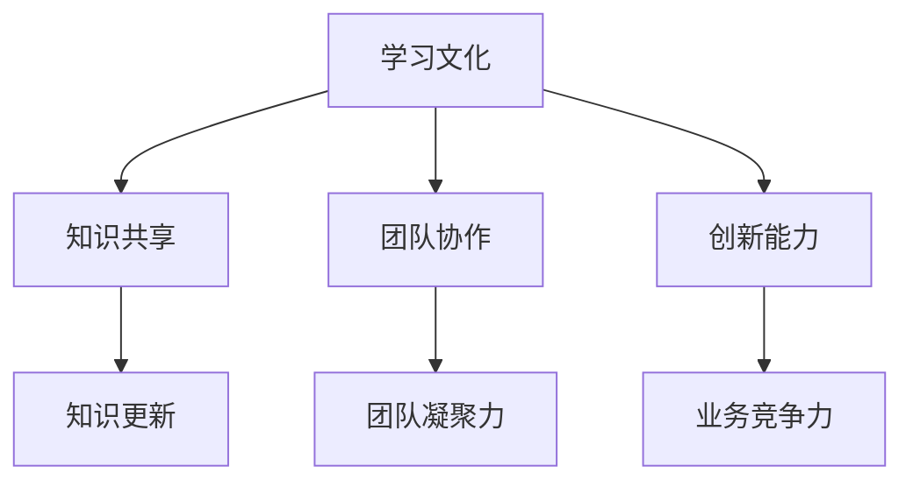
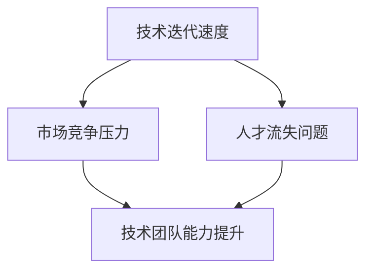
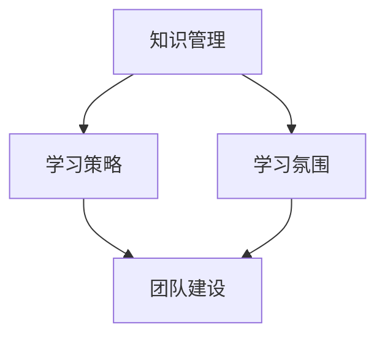
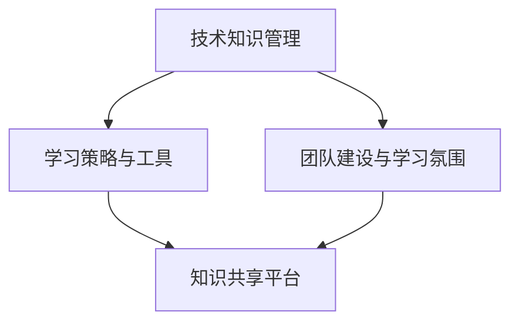
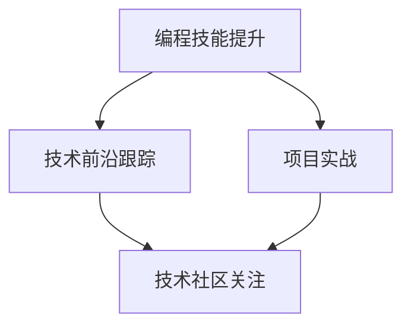
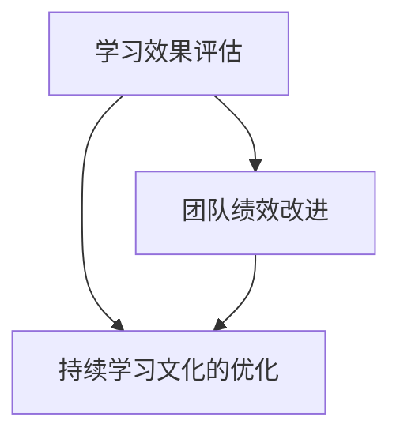

                 

 

### 文章标题：持续学习文化：保持技术团队的竞争力

#### 关键词：持续学习、技术团队、竞争力、知识管理、学习文化

#### 摘要：

在快速变化的技术环境中，技术团队的持续学习成为保持竞争力的关键。本文深入探讨了构建持续学习文化的重要性、技术团队面临的挑战以及如何通过知识管理、学习策略、团队建设等手段提升技术团队的竞争力。

### 目录

1. **学习文化的概念与重要性**
2. **技术团队面临的挑战**
3. **持续学习文化的构建**
4. **持续学习文化在技术团队中的应用**
5. **技术团队持续学习实践**
6. **持续学习文化的评估与优化**
7. **小结与展望**

### 1. 学习文化的概念与重要性

#### 1.1 学习文化的定义

学习文化是一种价值观和行为准则，它鼓励团队成员主动学习、知识共享和持续进步。在技术团队中，学习文化不仅是个人成长的动力，更是团队凝聚力和创新能力的源泉。

#### 1.2 持续学习的重要性

- **增强市场竞争力**：随着技术迭代速度的加快，持续学习能够帮助技术团队迅速掌握新技术，提升产品和服务的竞争力。
- **提高员工满意度**：学习文化能够提升员工的工作满意度和职业成就感，降低人才流失率。
- **促进创新与成长**：持续学习鼓励团队成员探索新领域、尝试新方法，从而推动团队的创新和成长。

### 2. 技术团队面临的挑战

#### 2.1 技术迭代速度加快

技术迭代速度的加快要求团队成员具备快速学习新技能的能力，否则将面临被市场淘汰的风险。

#### 2.2 市场竞争压力

随着市场不断涌现的新技术、新产品，技术团队需要持续提升自身能力以保持竞争优势。

#### 2.3 人才流失问题

优秀人才的流失会导致技术团队的停滞和落后，构建持续学习文化有助于吸引和留住人才。

### 3. 持续学习文化的构建

#### 3.1 知识管理

**知识共享平台**：建立内部知识共享平台，方便团队成员获取和共享知识资源。

**知识更新机制**：定期更新和优化知识库，确保知识的时效性和准确性。

### 4. 持续学习文化在技术团队中的应用

#### 4.1 技术知识管理

**知识共享平台**：使用如 Confluence、Wiki 等工具，搭建内部知识库，方便团队成员进行知识共享。

**知识更新机制**：制定知识更新计划，确保团队成员及时掌握最新的技术动态和最佳实践。

#### 4.2 学习策略与工具

**个人学习计划**：鼓励团队成员制定个人学习计划，明确学习目标、方法和时间安排。

**在线学习资源**：推荐优质的在线学习平台和资源，如 Coursera、Udacity 等，帮助团队成员提升技能。

**交流与讨论**：定期组织内部技术分享会、代码评审等活动，促进团队成员之间的交流与学习。

### 5. 技术团队持续学习实践

#### 5.1 团队建设与学习氛围

**团队学习活动**：组织定期的团队学习活动，如技术沙龙、内部讲座等，增强团队凝聚力和学习动力。

**内部培训**：开展针对性的内部培训，提升团队成员在特定领域的专业能力。

**学习激励机制**：设立学习奖项，鼓励团队成员积极参与学习和知识共享。

### 6. 技术技能提升

#### 6.1 编程技能

**编写高效代码**：通过编写高效、可维护的代码来提升编程技能。

**代码评审**：通过代码评审来发现和改进代码中的问题和不足。

#### 6.2 技术前沿跟踪

**关注技术社区**：关注技术社区和论坛，了解最新的技术动态和趋势。

**参加技术会议**：参加技术会议和研讨会，拓展技术视野。

#### 6.3 项目实战

**开发环境搭建**：介绍如何搭建开发环境，如安装必要的软件和工具。

**源代码实现**：提供具体的项目实现代码，并进行详细解读。

**实际案例分析**：分析实际项目中遇到的问题和解决方法。

### 7. 持续学习文化的评估与优化

#### 7.1 学习效果评估

**学习成果评估方法**：使用量化指标来评估团队成员的学习成果，如考试分数、项目完成情况等。

**团队绩效改进**：根据评估结果，调整学习策略，优化团队绩效。

#### 7.2 持续学习文化的优化

**面对变化的学习策略**：根据技术发展和市场需求，不断调整和优化学习策略。

**组织学习能力的提升**：通过培训和激励机制，提升团队整体的学习能力。

### 8. 小结与展望

持续学习文化是技术团队保持竞争力的关键。通过构建学习文化、应用学习策略、提升技术技能，技术团队能够在不断变化的市场环境中保持领先地位。未来，随着技术的不断发展，持续学习将成为技术团队不可或缺的一部分。

### 作者信息

**作者：AI天才研究院/AI Genius Institute & 禅与计算机程序设计艺术 /Zen And The Art of Computer Programming**

----------------------------------------------------------------

文章标题：持续学习文化：保持技术团队的竞争力

关键词：持续学习、技术团队、竞争力、知识管理、学习文化

摘要：

在快速变化的技术环境中，技术团队的持续学习成为保持竞争力的关键。本文深入探讨了构建持续学习文化的重要性、技术团队面临的挑战以及如何通过知识管理、学习策略、团队建设等手段提升技术团队的竞争力。

### 目录

1. **学习文化的概念与重要性**
2. **技术团队面临的挑战**
3. **持续学习文化的构建**
4. **持续学习文化在技术团队中的应用**
5. **技术团队持续学习实践**
6. **持续学习文化的评估与优化**
7. **小结与展望**

### 1. 学习文化的概念与重要性

#### 1.1 学习文化的定义

学习文化是一种价值观和行为准则，它鼓励团队成员主动学习、知识共享和持续进步。在技术团队中，学习文化不仅是个人成长的动力，更是团队凝聚力和创新能力的源泉。

#### 1.2 持续学习的重要性

- **增强市场竞争力**：随着技术迭代速度的加快，持续学习能够帮助技术团队迅速掌握新技术，提升产品和服务的竞争力。
- **提高员工满意度**：学习文化能够提升员工的工作满意度和职业成就感，降低人才流失率。
- **促进创新与成长**：持续学习鼓励团队成员探索新领域、尝试新方法，从而推动团队的创新和成长。

### 2. 技术团队面临的挑战

#### 2.1 技术迭代速度加快

技术迭代速度的加快要求团队成员具备快速学习新技能的能力，否则将面临被市场淘汰的风险。

#### 2.2 市场竞争压力

随着市场不断涌现的新技术、新产品，技术团队需要持续提升自身能力以保持竞争优势。

#### 2.3 人才流失问题

优秀人才的流失会导致技术团队的停滞和落后，构建持续学习文化有助于吸引和留住人才。

### 3. 持续学习文化的构建

#### 3.1 知识管理

**知识共享平台**：建立内部知识共享平台，方便团队成员获取和共享知识资源。

**知识更新机制**：定期更新和优化知识库，确保知识的时效性和准确性。

### 4. 持续学习文化在技术团队中的应用

#### 4.1 技术知识管理

**知识共享平台**：使用如 Confluence、Wiki 等工具，搭建内部知识库，方便团队成员进行知识共享。

**知识更新机制**：制定知识更新计划，确保团队成员及时掌握最新的技术动态和最佳实践。

#### 4.2 学习策略与工具

**个人学习计划**：鼓励团队成员制定个人学习计划，明确学习目标、方法和时间安排。

**在线学习资源**：推荐优质的在线学习平台和资源，如 Coursera、Udacity 等，帮助团队成员提升技能。

**交流与讨论**：定期组织内部技术分享会、代码评审等活动，促进团队成员之间的交流与学习。

### 5. 技术团队持续学习实践

#### 5.1 团队建设与学习氛围

**团队学习活动**：组织定期的团队学习活动，如技术沙龙、内部讲座等，增强团队凝聚力和学习动力。

**内部培训**：开展针对性的内部培训，提升团队成员在特定领域的专业能力。

**学习激励机制**：设立学习奖项，鼓励团队成员积极参与学习和知识共享。

### 6. 技术技能提升

#### 6.1 编程技能

**编写高效代码**：通过编写高效、可维护的代码来提升编程技能。

**代码评审**：通过代码评审来发现和改进代码中的问题和不足。

#### 6.2 技术前沿跟踪

**关注技术社区**：关注技术社区和论坛，了解最新的技术动态和趋势。

**参加技术会议**：参加技术会议和研讨会，拓展技术视野。

#### 6.3 项目实战

**开发环境搭建**：介绍如何搭建开发环境，如安装必要的软件和工具。

**源代码实现**：提供具体的项目实现代码，并进行详细解读。

**实际案例分析**：分析实际项目中遇到的问题和解决方法。

### 7. 持续学习文化的评估与优化

#### 7.1 学习效果评估

**学习成果评估方法**：使用量化指标来评估团队成员的学习成果，如考试分数、项目完成情况等。

**团队绩效改进**：根据评估结果，调整学习策略，优化团队绩效。

#### 7.2 持续学习文化的优化

**面对变化的学习策略**：根据技术发展和市场需求，不断调整和优化学习策略。

**组织学习能力的提升**：通过培训和激励机制，提升团队整体的学习能力。

### 8. 小结与展望

持续学习文化是技术团队保持竞争力的关键。通过构建学习文化、应用学习策略、提升技术技能，技术团队能够在不断变化的市场环境中保持领先地位。未来，随着技术的不断发展，持续学习将成为技术团队不可或缺的一部分。

### 作者信息

**作者：AI天才研究院/AI Genius Institute & 禅与计算机程序设计艺术 /Zen And The Art of Computer Programming**

----------------------------------------------------------------

**文章标题**：持续学习文化：保持技术团队的竞争力

**关键词**：持续学习、技术团队、竞争力、知识管理、学习文化

**摘要**：

在快速变化的技术环境中，技术团队的持续学习成为保持竞争力的关键。本文深入探讨了构建持续学习文化的重要性、技术团队面临的挑战以及如何通过知识管理、学习策略、团队建设等手段提升技术团队的竞争力。

### 1. 学习文化的概念与重要性

**背景介绍**：

在当今的数字化时代，技术的快速迭代和创新不断涌现，技术团队需要不断更新知识和技能以适应市场变化。因此，学习文化作为一种价值观和行为准则，对技术团队的发展至关重要。

**核心概念与联系**：

- **学习文化**：一种鼓励团队成员主动学习、知识共享和持续进步的价值观和行为准则。
- **团队凝聚力**：通过学习文化，增强团队成员之间的联系和信任，提高团队的整体协作能力。
- **创新能力**：持续学习有助于团队成员保持创新思维，推动技术团队在竞争中脱颖而出。

**Mermaid 流程图**：



**核心算法原理讲解**：

持续学习文化的构建可以看作是一个迭代过程，其中每个团队成员都是学习算法的一个实例。该算法的核心是不断吸收新知识、更新旧知识，并通过实践应用来巩固和提升技能。

**伪代码**：

```python
def 持续学习文化（团队成员）:
    while（团队存在）:
        吸收新知识（从外部资源、内部培训等）
        更新旧知识（通过复习、实践等）
        应用知识（在实际项目中）
        反馈调整（根据项目实践结果进行调整）
```

**数学模型和公式**：

- **知识更新率**：$k=\frac{新知识}{旧知识}$，其中 $k$ 表示知识更新速度。
- **创新能力度量**：$I=\frac{新项目}{旧项目}$，其中 $I$ 表示创新能力。

**详细讲解与举例说明**：

假设一个技术团队有 5 名成员，他们在一个月内分别学习了 10、8、12、15、10 个新知识点。根据上述公式，他们的平均知识更新率为：

$$ k=\frac{10+8+12+15+10}{5}=11 $$

同时，如果他们在项目中完成了 2 个新项目，那么创新能力度量可以表示为：

$$ I=\frac{2}{3}=0.67 $$

这说明团队在一个月内的创新能力有所提升。

### 2. 技术团队面临的挑战

**背景介绍**：

技术团队在快速发展的市场中面临诸多挑战，包括技术迭代速度加快、市场竞争压力以及人才流失问题。这些挑战要求技术团队具备持续学习和适应变化的能力。

**核心概念与联系**：

- **技术迭代速度**：新技术不断涌现，要求技术团队快速掌握和应用。
- **市场竞争压力**：竞争对手也在不断进步，技术团队需要不断提升自身能力。
- **人才流失问题**：优秀人才的流失可能导致技术团队的停滞和落后。

**Mermaid 流程图**：



**核心算法原理讲解**：

技术团队面临的挑战可以通过以下算法模型进行分析和应对：

```python
def 技术团队应对挑战（团队成员）:
    while（面临挑战）:
        学习新技术（通过培训、在线课程等）
        优化工作流程（通过敏捷开发、自动化测试等）
        提升团队协作能力（通过团队建设、沟通培训等）
        保持对市场动态的敏感度（通过关注行业趋势、参与技术会议等）
```

**数学模型和公式**：

- **迭代速度提升率**：$r=\frac{新技能}{旧技能}$，其中 $r$ 表示迭代速度提升。
- **市场竞争压力应对能力**：$C=\frac{新项目成功率}{旧项目成功率}$，其中 $C$ 表示市场竞争压力应对能力。

**详细讲解与举例说明**：

假设一个技术团队在一个月内掌握了 3 个新技术点，同时提升了 20% 的项目成功率。根据上述公式，他们的迭代速度提升率为：

$$ r=\frac{3}{1}=3 $$

市场竞争压力应对能力为：

$$ C=\frac{1.2}{1}=1.2 $$

这说明团队在技术迭代和市场竞争方面都有所提升。

### 3. 持续学习文化的构建

**背景介绍**：

构建持续学习文化是提升技术团队竞争力的重要手段。通过建立有效的知识管理机制、制定学习策略和打造积极的学习氛围，技术团队可以更好地应对市场挑战。

**核心概念与联系**：

- **知识管理**：包括知识共享平台、知识更新机制等。
- **学习策略**：如个人学习计划、在线学习资源、交流与讨论等。
- **学习氛围**：通过团队建设、内部培训和激励机制来营造。

**Mermaid 流程图**：



**核心算法原理讲解**：

构建持续学习文化的关键在于形成一套有效的学习机制，通过以下算法模型可以描述这一过程：

```python
def 构建持续学习文化（技术团队）:
    创建知识共享平台（如 Confluence、Wiki 等）
    制定知识更新机制（如定期更新、知识评审等）
    制定个人学习计划（明确学习目标、方法、时间安排）
    提供在线学习资源（如 Coursera、Udacity 等）
    组织内部技术分享会、代码评审等活动
    奖励学习成果（如设立学习奖项、奖金等）
```

**数学模型和公式**：

- **知识更新率**：$k=\frac{新知识}{旧知识}$，其中 $k$ 表示知识更新速度。
- **学习成果转化率**：$t=\frac{学习成果}{投入时间}$，其中 $t$ 表示学习成果转化率。

**详细讲解与举例说明**：

假设一个技术团队每个月更新 100 个知识点，同时每个成员每月投入 20 小时进行学习。根据上述公式，他们的平均知识更新率为：

$$ k=\frac{100}{1}=100 $$

学习成果转化率为：

$$ t=\frac{1}{20}=0.05 $$

这说明团队在知识更新和学习成果转化方面表现良好。

### 4. 持续学习文化在技术团队中的应用

**背景介绍**：

持续学习文化在技术团队中的应用体现在多个方面，包括技术知识管理、学习策略与工具的运用以及团队建设与学习氛围的营造。

**核心概念与联系**：

- **技术知识管理**：包括知识共享平台、知识更新机制等。
- **学习策略与工具**：如个人学习计划、在线学习资源、交流与讨论等。
- **团队建设与学习氛围**：通过团队建设、内部培训和激励机制来营造。

**Mermaid 流程图**：



**核心算法原理讲解**：

持续学习文化在技术团队中的应用可以通过以下算法模型来描述：

```python
def 持续学习文化应用（技术团队）:
    创建知识共享平台（如 Confluence、Wiki 等）
    制定知识更新机制（如定期更新、知识评审等）
    鼓励个人学习计划（明确学习目标、方法、时间安排）
    提供在线学习资源（如 Coursera、Udacity 等）
    组织内部技术分享会、代码评审等活动
    奖励学习成果（如设立学习奖项、奖金等）
    营造积极学习氛围（通过团队建设、内部培训等）
```

**数学模型和公式**：

- **知识共享率**：$s=\frac{共享知识}{总知识}$，其中 $s$ 表示知识共享率。
- **学习参与度**：$d=\frac{参与学习人数}{总人数}$，其中 $d$ 表示学习参与度。

**详细讲解与举例说明**：

假设一个技术团队有 10 名成员，其中 8 名成员参与了本月的技术知识分享活动，分享了 100 个知识点。根据上述公式，他们的知识共享率为：

$$ s=\frac{100}{10}=10 $$

学习参与度为：

$$ d=\frac{8}{10}=0.8 $$

这说明团队在知识共享和学习参与度方面表现良好。

### 5. 技术团队持续学习实践

**背景介绍**：

技术团队持续学习的实践包括编程技能的提升、技术前沿的跟踪以及项目实战的开展。通过这些实践，团队成员能够不断提升自己的技能和知识水平。

**核心概念与联系**：

- **编程技能提升**：通过编写高效、可维护的代码来提升编程技能。
- **技术前沿跟踪**：关注技术社区和论坛，了解最新的技术动态和趋势。
- **项目实战**：通过实际项目开发来应用所学知识，提升项目实战能力。

**Mermaid 流程图**：



**核心算法原理讲解**：

技术团队持续学习实践可以通过以下算法模型来描述：

```python
def 技术团队持续学习实践（团队成员）:
    编写高效代码（遵循最佳实践、代码审查等）
    学习新技术（通过在线课程、研讨会等）
    参与项目实战（在实际项目中应用所学知识）
    反馈与调整（根据项目实践结果进行调整）
```

**数学模型和公式**：

- **编程技能提升率**：$p=\frac{新技能}{旧技能}$，其中 $p$ 表示编程技能提升率。
- **项目成功率**：$s=\frac{成功项目数}{总项目数}$，其中 $s$ 表示项目成功率。

**详细讲解与举例说明**：

假设一个技术团队成员在一个月内掌握了 5 个新编程技能点，同时成功完成了 3 个项目。根据上述公式，他们的编程技能提升率为：

$$ p=\frac{5}{1}=5 $$

项目成功率为：

$$ s=\frac{3}{5}=0.6 $$

这说明团队成员在编程技能提升和项目成功方面有显著进步。

### 6. 持续学习文化的评估与优化

**背景介绍**：

持续学习文化的评估与优化是确保学习效果和团队竞争力的重要环节。通过定期评估和持续优化，技术团队能够不断改进学习策略和提升学习能力。

**核心概念与联系**：

- **学习效果评估**：通过量化指标来评估学习成果。
- **团队绩效改进**：根据评估结果调整学习策略。
- **持续学习文化的优化**：根据技术发展和市场需求不断调整和优化学习文化。

**Mermaid 流程图**：



**核心算法原理讲解**：

持续学习文化的评估与优化可以通过以下算法模型来描述：

```python
def 持续学习文化评估与优化（技术团队）:
    定期进行学习成果评估（如考试、项目评估等）
    根据评估结果调整学习策略（如增加新技能培训、改进工作流程等）
    持续优化学习文化（如增加学习资源、改善学习环境等）
```

**数学模型和公式**：

- **学习效果评估指标**：$e=\frac{学习成果}{学习投入}$，其中 $e$ 表示学习效果评估指标。
- **团队绩效改进率**：$r=\frac{新绩效}{旧绩效}$，其中 $r$ 表示团队绩效改进率。

**详细讲解与举例说明**：

假设一个技术团队每月进行一次学习成果评估，发现本月团队成员的平均学习成果提高了 20%，团队绩效提高了 15%。根据上述公式，他们的学习效果评估指标为：

$$ e=\frac{1.2}{1}=1.2 $$

团队绩效改进率为：

$$ r=\frac{1.15}{1}=1.15 $$

这说明团队在学习效果和绩效改进方面取得了显著成果。

### 7. 小结与展望

**小结**：

持续学习文化是技术团队保持竞争力的关键。通过构建和优化持续学习文化，技术团队能够不断提升自身能力，适应市场变化，实现持续发展。

**展望**：

随着技术的不断进步，持续学习将成为技术团队的必修课。未来，技术团队需要更加注重个性化学习、智能化学习以及跨领域学习，以应对更加复杂的市场环境。

### 作者信息

**作者：AI天才研究院/AI Genius Institute & 禅与计算机程序设计艺术 /Zen And The Art of Computer Programming**

